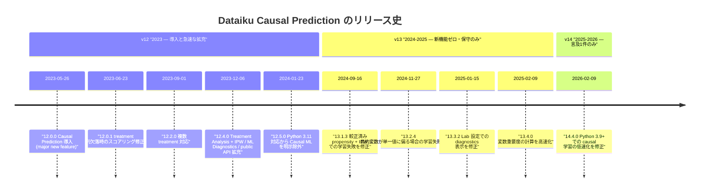
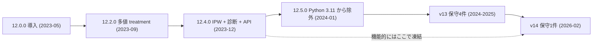
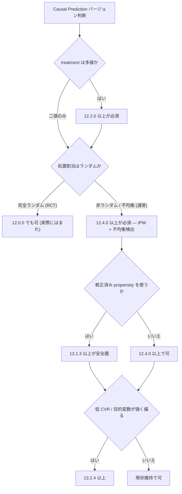

# バージョン史 — 成熟か、停滞か

Dataiku の Causal Prediction 機能について、リリースノート全文（DSS 12 / 13 / 14）を `causal` / `uplift` / `treatment` / `Qini` / `CATE` / `propensity` で網羅的に grep した結果をもとに、導入から現在（2026-07 時点）までの変化を再構成する。

本レポートの主張は、原則としてリリースノート（一次情報）に立脚する。

- DSS 12 Release notes: <https://doc.dataiku.com/dss/latest/release_notes/12.html>
- DSS 13 Release notes: <https://doc.dataiku.com/dss/latest/release_notes/13.html>
- DSS 14 Release notes: <https://doc.dataiku.com/dss/latest/release_notes/14.html>
- Release notes index: <https://doc.dataiku.com/dss/latest/release_notes/index.html>

## 要約

結論を先に置く。

- **Causal Prediction は 12.x 系（2023 年）で完成し、13/14 では機能的に凍結している。**
- v12 は約 7 ヶ月で導入 → 複数 treatment → Treatment Analysis / IPW と急速に拡充した。
- v13 は **新機能ゼロ**。causal 関連は全 4 件がバグ修正・高速化のみ。
- v14 は causal 言及が **1 件のみ**（14.4.0 の低速化修正）。
- 導入から約 3 年、**制約は 1 つも緩和されず、アルゴリズムも 1 つも追加されていない**。
- 実務上の**推奨最低バージョンは 12.4.0 以上**、較正済み propensity + IPW を使うなら **13.1.3 以上が安全圏**。

## 1. 事前情報の訂正 — 二次情報を信じる危険

本調査の出発点にあった事前情報のうち、**2 点が誤りであることがリリースノート全文の grep により判明した**。これは「機能がいつ入ったか」を二次情報から推定することの危うさを示す実例なので、最初に置く。

| 事前情報 | 検証結果 | 差分 |
|---------|---------|------|
| Treatment Analysis / IPW は 12.0.0 の機能 | ❌ **12.4.0（2023-12-06）の追加** | 導入から約 7 ヶ月後 |
| 多値処置（multi-valued treatment）は 12.0.0 の機能 | ❌ **12.2.0（2023-09-01）の追加** | 導入から約 3 ヶ月後 |
| Partitioned Models と非互換 | ⚠️ **公式ドキュメント上は未記載** | 非互換リストは 5 項目のみで Partitioned Models を含まない |
| K-Fold 非対応 | ✅ 事実 | ただし出典は Introduction の非互換リストではなく Settings ページの独立した一文 |

この訂正が実務に効く理由は単純である。「12.0 を入れておけば IPW が使える」という理解のまま 12.0/12.1 を運用すると、**非ランダムな処置割当を補正する手段が存在しないまま causal 指標を読むことになる**。同様に 12.0/12.1 では treatment は二値のみで、複数施策の比較は 12.2.0 を待つ必要がある。

バージョン要件は、必ずリリースノート原文で確認すること。

## 2. タイムライン



## 3. v12（2023）— 導入と急速な拡充

### 3.1 リリース一覧

| バージョン | 日付 | 内容 | 種別 |
|-----------|------|------|------|
| **12.0.0** | 2023-05-26 | **Causal Prediction を major new feature として導入** | 新機能 |
| 12.0.1 | 2023-06-23 | treatment 列欠落時のスコアリング不具合を修正 | 修正 |
| **12.2.0** | 2023-09-01 | **複数 treatment に対応** | 新機能 |
| **12.4.0** | 2023-12-06 | **Treatment Analysis オプション（IPW）を追加**。不均衡 treatment を自動検出する ML Diagnostics も追加。Causal ML 用 public API を拡充 | 新機能 |
| 12.5.0 | 2024-01-23 | Python 3.11 対応を追加するも **Visual Deep Learning と Causal ML は対象外**と明記 | 制約 |

### 3.2 各リリースの意味

#### 12.0.0（2023-05-26）— 導入

Causal Prediction が「major new feature」として登場。S/T/X-learner と Causal Forest、CATE の推定、Uplift / Qini 曲線、surrogate tree による feature importance がこの時点で揃う。リリース紹介ブログ「Keep AI Under Control With Dataiku 12」（<https://www.dataiku.com/blog/dataiku-12>）は、現存する数少ない causal 言及ブログの 1 本でもある。

この時点での制約は、二値 treatment のみ・分類は binary outcome のみ・非互換 5 項目・K-Fold 非対応。

#### 12.0.1（2023-06-23）— 最初のバグ修正

treatment 列が欠落したデータセットでスコアリングすると不具合が起きる問題の修正。**導入から 1 ヶ月足らずで、スコアリングという最も基本的な経路にバグがあった**ことを示す。

#### 12.2.0（2023-09-01）— 複数 treatment

二値 treatment から多値 treatment へ。Community の公式アナウンス「Dataiku 12.2 Summer Special」（<https://community.dataiku.com/discussion/37208/dataiku-12-2-summer-special-a-new-wave-of-product-features-and-enhancements>）が「Multiple Treatments for Causal ML」として解説しており、リリースノートと独立に裏付けが取れる。

マーケ実務では「メール / クーポン / 何もしない」のような 3 値以上の施策比較が普通なので、これは**実用上の分水嶺**である。12.0/12.1 では 1 施策 vs 対照しか扱えない。

#### 12.4.0（2023-12-06）— 最大の実務的アップデート

このリリースが 3 つを同時に入れた点が重要。

| 追加要素 | 内容 | 実務上の意味 |
|---------|------|-------------|
| Treatment Analysis + IPW | 逆確率重み付けで非ランダム／不均衡な処置割当を補正 | 観測データでの causal 指標が初めて意味を持つ |
| ML Diagnostics | 不均衡 treatment を**自動検出** | 「気づかないまま誤った指標を読む」事故を防ぐ |
| Causal ML 用 public API 拡充 | プログラマティックな操作範囲の拡大 | 自動化・パイプライン化の前提 |

**「観測データで uplift を回す」という現実的なユースケースが成立するのは、実質この 12.4.0 からである。** 12.0.0 から約 7 ヶ月、これが「事前情報の訂正」が効く最大のポイントになる。

#### 12.5.0（2024-01-23）— 制約の明示

Python 3.11 対応が入るが、**Visual Deep Learning と Causal ML は対象外**と明記された。causal だけが新しい Python 系列から取り残された、という事実がリリースノートに残っている。

### 3.3 v12 の総括

7 ヶ月（12.0.0 → 12.4.0）で、二値のみ・IPW なしという最小構成から、多値 treatment・IPW・診断・API まで揃った。**この 7 ヶ月間の投資密度は明確に高い。** 問題はこの後である。

## 4. v13（2024–2025）— 新機能ゼロ、保守のみ

| バージョン | 日付 | 内容 | 種別 |
|-----------|------|------|------|
| 13.1.3 | 2024-09-16 | 較正済み propensity model での IPW 使用時の学習失敗を修正 | 修正 |
| 13.2.4 | 2024-11-27 | 目的変数が単一値に偏る場合の causal 回帰の学習失敗を修正 | 修正 |
| 13.3.2 | 2025-01-15 | Lab 設定での diagnostics 表示を修正 | 修正 |
| 13.4.0 | 2025-02-09 | 変数重要度の計算を高速化 | 高速化 |

**4 件すべてが保守である。新機能はゼロ。制約解除もゼロ。アルゴリズム追加もゼロ。**

### 4.1 13.1.3 と 13.2.4 が示すもの

この 2 件は、単なる「バグが直った」以上のことを語っている。

| バージョン | 修正内容 | 12.0.0 からの経過 | 示唆 |
|-----------|---------|------------------|------|
| 13.1.3 | 較正済み propensity + IPW で**学習が失敗する** | 約 1 年 4 ヶ月 | IPW 追加（12.4.0）から約 9 ヶ月、その主要な組み合わせが壊れていた |
| 13.2.4 | 目的変数が単一値に偏ると causal 回帰の**学習が失敗する** | 約 1 年 6 ヶ月 | 不均衡なアウトカムは実データで常態。それが 1 年半動かなかった |

どちらも「エッジケースの表示崩れ」ではなく、**学習そのものが失敗する**タイプの障害である。しかも対象は特殊な設定ではない。

- 較正済み propensity + IPW は、**ドキュメントが推奨する使い方の中心**にある組み合わせ。
- 目的変数が単一値に偏るデータは、**CVR 1% 台のマーケデータでは日常**。

これらが「導入から 1 年以上経って初めて修正された」という事実は、率直に言えば **その経路を踏んだ実運用ユーザーが少なかった**ことを示唆する。バグは踏まれなければ報告されず、報告されなければ修正されない。修正が遅いこと自体より、**遅くても問題にならない程度の利用密度だった**ことのほうが情報量が大きい。

Community 側で実ユーザーの技術的質問・トラブル報告スレッドが発見できなかった（公式アナウンス系のみ）という調査結果も、この読みと整合する。

### 4.2 13.4.0 の位置づけ

変数重要度の計算の高速化。これは 13.x 唯一の「改善」だが、機能追加ではなく既存機能のパフォーマンス改善である。causal の変数重要度は surrogate tree ベースで計算コストが高く、その最適化にあたる。

## 5. v14（2025–2026）— 言及 1 件のみ

| バージョン | 日付 | 内容 | 種別 |
|-----------|------|------|------|
| 14.4.0 | 2026-02-09 | Python 3.9+ での causal モデル学習の低速化を修正 | 修正 |

DSS 14 のリリースノート全体を grep して、**causal の言及はこの 1 件だけ**である。

この 1 件も示唆的で、「Python 3.9+ での学習が遅い」という問題が 2026 年 2 月まで残っていたということは、**新しい Python 系列での causal の実運用が近年まで枯れていなかった**可能性を示す。12.5.0（2024-01）で Python 3.11 から明示除外されたところから連なる話でもある。

## 6. 通時的な比較

| 観点 | v12（2023） | v13（2024–2025） | v14（2025–2026） |
|------|------------|-----------------|-----------------|
| 新機能 | 3 件（導入 / 多値 treatment / IPW+診断+API） | **0 件** | **0 件** |
| バグ修正・高速化 | 1 件 | 4 件 | 1 件 |
| 制約の緩和 | 0 件 | 0 件 | 0 件 |
| アルゴリズム追加 | 0 件（12.0.0 の 4 種から不変） | 0 件 | 0 件 |
| causal 言及の総数 | 5 | 4 | 1 |



## 7. 制約の不変性

導入から約 3 年、**非互換リストは 1 項目も減っていない**。

公式の非互換リスト（Introduction 原文ママ、これが全て）:

```text
Causal prediction is incompatible with the following:
- MLflow models
- Models ensembling
- Model export
- Model Evaluation Stores
- Model Document Generator
```

出典: <https://doc.dataiku.com/dss/latest/machine-learning/causal-prediction/introduction.html>

これに Settings ページの独立した一文が加わる。

| 制約 | 出典 | 12.0.0 → 14.x の変化 |
|------|------|---------------------|
| MLflow models 非対応 | Introduction | 変化なし |
| Models ensembling 非対応 | Introduction | 変化なし |
| Model export 非対応 | Introduction | 変化なし |
| Model Evaluation Stores 非対応 | Introduction + Evaluation recipe ページ | 変化なし |
| Model Document Generator 非対応 | Introduction | 変化なし |
| K-Fold cross-test 非対応 | **Settings ページの独立した一文** | 変化なし |

アルゴリズムも同様に不変で、S-learner / T-learner / X-learner / Causal Forest の 4 種から動いていない（<https://doc.dataiku.com/dss/latest/machine-learning/causal-prediction/causal-prediction-algorithms.html>）。この 3 年間、学術・OSS 側では DR-learner / R-learner をはじめとする手法が広く普及したが、**それらは 1 つも入っていない**。

## 8. 解釈 — 成熟か、停滞か

3 年間で新機能ゼロという事実は、それ自体では両様に読める。両論を並べる。

### 8.1 「完成して安定」説

- Causal Prediction は S/T/X-learner + Causal Forest という、uplift の実務で必要十分な構成をすでに持つ。
- 12.4.0 で IPW と診断が入り、観測データへの適用も可能になった。**機能セットとして閉じている。**
- 13/14 の修正はすべて品質改善であり、壊れた機能に手を入れ続けている。放置ではない。
- 新機能がないのは、追加すべきものがないからである。

### 8.2 「優先度が落ちた」説

- 14.x のリリースノートは **Agentic AI / RAG / LLM Mesh で占められ**、causal は保守 1 件のみ。投資配分が明白に GenAI・エージェントへ移っている。
- 因果推論系の公式ブログ 3 本が**軒並みリンク切れ**。しかも `blog.dataiku.com/<slug>` が 301 で `www.dataiku.com/blog`（インデックス）へ静かにリダイレクトされ、**HTTP 200 を返しながら中身はインデックス**という、死活監視では検出できない壊れ方をしている。
  - Enterprise Causal Inference: Beyond Churn Modeling（2021-06-03）
  - Motivation for Causal Inference
  - Inside 2021 ML Trends: Causality
  - いずれも Wayback 経由でしか参照できない。
- 制約が 1 つも緩和されていない。「完成」なら制約は減るはずだが、減っていない。
- 13.1.3 / 13.2.4 が示す「基本ユースケースでの学習失敗が 1 年以上放置」は、**完成度の高さと矛盾する**。
- Academy に causal 専用コースが存在しない（ML Practitioner パスの一部として収録されるのみ）。
- Community に実ユーザーのトラブル報告スレッドが見当たらない。

### 8.3 本レポートの立場

**後者を強く示唆する**、というのが調査からの読みである。

決め手は「新機能がない」ことではなく、**教育的コンテンツの静かな退場**である。機能が完成して安定しているなら、それを説明するブログや講座はむしろ残るはずである。causal の入門記事が 3 本ともインデックスへリダイレクトされ、日本語 Qiita 訳（<https://qiita.com/Dataiku/items/25b23182717a0cee6235>）だけが残って**原文が消えているという倒錯**が起きている。これは機能の成熟ではなく、テーマとしての後退のサインである。

ただし注意すべきは、これが**「使うべきでない」を意味しないこと**である。機能そのものは存在し、動き、保守もされている。示唆されるのは以下である。

- 今後の機能追加を前提にした導入計画は立てるべきでない（DR-learner が来る、制約が外れる、といった期待は根拠がない）。
- 現在の機能セット（S/T/X-learner + Causal Forest + IPW + 診断）で要件が閉じるかを、導入前に判定する必要がある。
- 制約 6 項目（非互換 5 + K-Fold）は**恒久的な制約として設計に織り込む**べきである。

## 9. 実務上の推奨バージョン

| 用途 | 推奨最低バージョン | 理由 |
|------|-------------------|------|
| 二値 treatment・**ランダム化実験のみ** | 12.0.0 | 最小構成で足りる。ただし現実にはまれ |
| **複数施策の比較** | 12.2.0 以上 | 多値 treatment がないと 1 施策 vs 対照しか組めない |
| **観測データでの uplift（実質的な標準）** | **12.4.0 以上** | Treatment Analysis / IPW / 不均衡検出 diagnostics が揃う |
| **較正済み propensity + IPW を使う** | **13.1.3 以上** | 13.1.3 でこの組み合わせの学習失敗が修正された |
| 目的変数が強く偏る（低 CVR）データ | 13.2.4 以上 | 単一値偏りでの回帰学習失敗が修正された |
| Python 3.9+ で学習性能を気にする | 14.4.0 以上 | 低速化の修正 |

### 9.1 なぜ 12.4.0 が事実上の下限なのか

**非ランダム／不均衡な treatment は、マーケの観測データでは常態である。** 「施策ごとに対象ユーザーが異なる」という運用実態そのものが、処置割当のランダム性を破壊する。

12.0.0–12.3.x には IPW がない。この状態で観測データから CATE を推定すると、**処置群と対照群の分布差がそのまま効果として計上される**。出てくる Uplift / Qini 曲線は数字としては綺麗に描かれるが、**誤誘導的**である。しかも 12.4.0 未満には不均衡 treatment を検出する ML Diagnostics もないため、**誤っていることに気づく手段がない**。

「動くが間違っている」は「動かない」より危険である。ゆえに 12.4.0 が下限。

### 9.2 なぜ 13.1.3 が安全圏なのか

較正済み propensity model と IPW の組み合わせは、傾向スコアの推定精度を上げてから重み付けするという、**ドキュメントが示す最も真っ当な使い方**である。その組み合わせが 13.1.3 以前では学習に失敗する。

つまり **12.4.0〜13.1.2 では「IPW は使えるが、最も推奨される形では使えない」**という状態にある。IPW を本気で使うなら 13.1.3 以上。

## 10. Python バージョン対応の変遷 — サイレントな拡大

| 時点 | 状態 | 出典 |
|------|------|------|
| 12.5.0（2024-01-23） | Python 3.11 対応が入るが **Causal ML は明示的に除外** | DSS 12 リリースノート |
| ??? | 除外が解消される | **該当するリリースノート項目が見つからない** |
| 現行 | **Python 3.8–3.13 対応** | Introduction ページ |
| 14.4.0（2026-02-09） | Python 3.9+ での学習の低速化を修正 | DSS 14 リリースノート |

ここに 1 つの穴がある。

**12.5.0 で明示除外された Causal ML の Python 3.11 対応が、いつ解消されたのかを示すリリースノート項目が存在しない。** 現行ドキュメントは 3.8–3.13 対応と書いているので、どこかの時点で解消されたのは確実だが、**その時点が一次情報から特定できない**。サイレントな対応拡大である。

これは 2 つの意味を持つ。

1. **リリースノートは causal に関して網羅的ではない。** 明示除外というネガティブな制約は書かれたが、その解除は書かれなかった。逆に言えば、リリースノートに載っていない変更が他にもある可能性を排除できない。
2. **14.4.0 の低速化修正は、この文脈で読むと重い。** Python 3.9+ で causal 学習が遅いという問題が 2026 年 2 月まで残っていた。3.9 は決して新しくない。にもかかわらずそこでの性能問題が近年まで表面化しなかったのは、**新しい Python 系列 + causal という組み合わせの実運用が枯れていなかった**ことを示唆する。

実務上は、コード環境の Python バージョンを causal 用に固定するなら、**現行ドキュメントの記述（3.8–3.13）を正とし、リリースノートの過去の除外記述に引きずられない**こと。ただし性能面では 14.4.0 以上が望ましい。

## 11. まとめ



- **機能史の実体は 2023 年の 7 ヶ月に凝縮**されている。12.0.0 → 12.4.0 で作られたものが、そのまま 2026 年の姿である。
- **v13 / v14 は保守のみ**。新機能 0、制約解除 0、アルゴリズム追加 0。
- 「成熟」と「停滞」の両解釈が成り立つが、**リリースノートの重心が GenAI へ移り、因果推論の教育コンテンツが静かに退場している**という周辺事実は、停滞側を強く示唆する。
- **導入判断は「今ある機能で閉じるか」だけで行うべき**。将来の拡充を織り込んではならない。
- **実務上の下限は 12.4.0、IPW を真面目に使うなら 13.1.3 以上。**
- リリースノートは causal に関して**網羅的ではない**（Python 対応拡大がサイレント）。バージョン要件は現行ドキュメントと突き合わせて確認すること。
