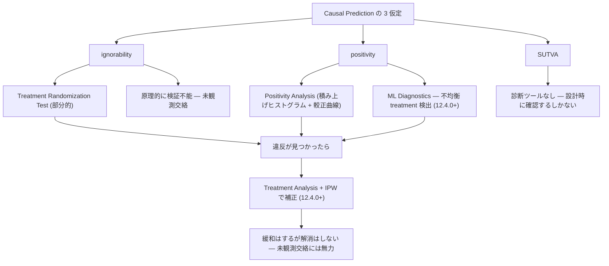
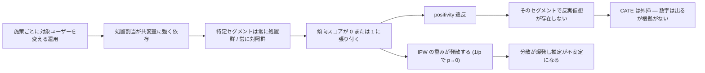
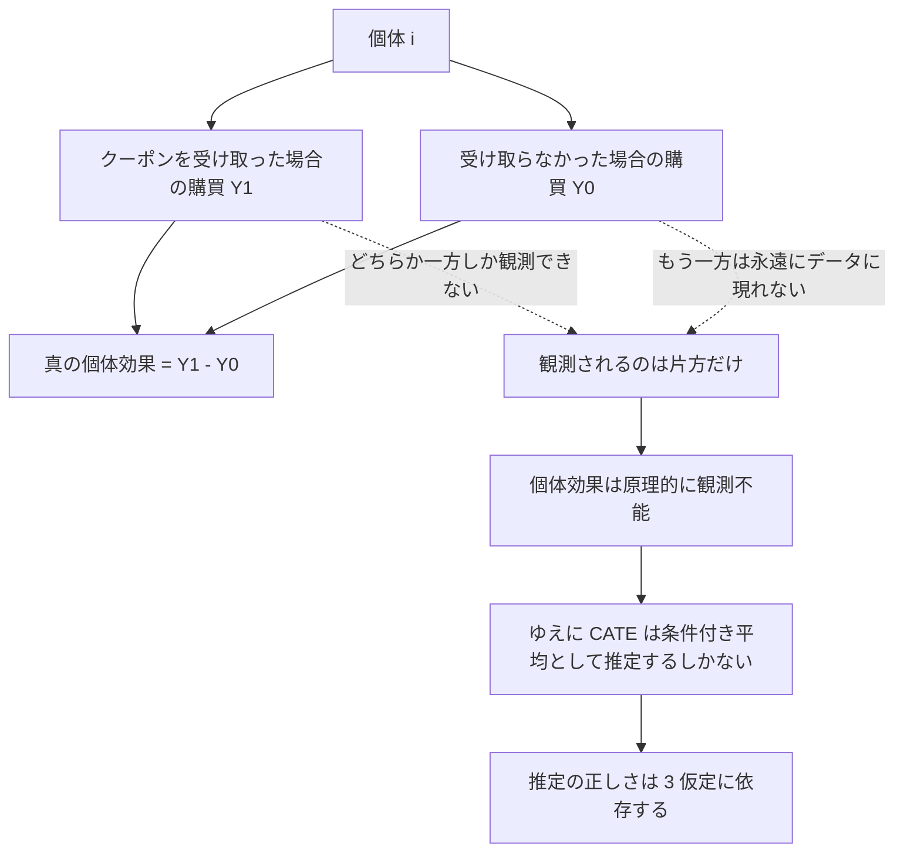

# 仮定と診断機能

Dataiku の Causal Prediction は、因果推論の 3 つの標準的な仮定の上に立っている。本レポートはその仮定が何を意味するか、Dataiku がそれをどう扱っているか、そして**仮定を明示する技術ドキュメントと、それに触れない製品資料の非対称性**を扱う。

主な出典:

- Concept | Causal prediction（KB）: <https://knowledge.dataiku.com/latest/ml-analytics/causal-prediction/concept-causal-prediction.html>
- Introduction — Causal Prediction: <https://doc.dataiku.com/dss/latest/machine-learning/causal-prediction/introduction.html>
- Causal Prediction Settings: <https://doc.dataiku.com/dss/latest/machine-learning/causal-prediction/settings.html>
- Causal Prediction Results: <https://doc.dataiku.com/dss/latest/machine-learning/causal-prediction/results.html>

## 要約

- 3 つの仮定は **ignorability / positivity / SUTVA**。KB が明示している。
- Dataiku は仮定違反を**検出するツールを 2 つ提供する**: Treatment Randomization Test（二項検定・p 閾値 0.05）と Positivity Analysis（積み上げヒストグラム + 較正曲線）。
- **本ユースケース（施策ごとに対象ユーザーが異なる）では positivity が壊れやすく、この 2 画面が決定的**である。ここは明確に Dataiku 側の強み。
- Treatment Analysis / IPW（12.4.0 以降）は非ランダム・不均衡な処置を補正するが、**緩和するだけで解消しない**。未観測交絡には無力。
- feature importance は「アウトカムへの影響」ではなく **「処置への反応の差」** を示す。読み違えると致命的。
- **反実仮想は原理的に観測不能**。KB がこれを明記しているのは誠実。
- **非対称性**: 技術資料は仮定を明示し違反検出ツールまで出すが、**製品ブログ・ソリューション・アナウンス側は仮定にほぼ触れない**。

## 1. 3 つの仮定

KB の Concept ページが挙げる 3 仮定を、マーケティング施策の文脈に翻訳する。

| 仮定 | 統計的な意味 | マーケ施策では何を要求するか | 壊れる典型例 |
|------|-------------|---------------------------|-------------|
| **ignorability**（条件付き独立 / 交絡なし） | 観測共変量で条件づければ、処置割当は潜在アウトカムと独立 | 「誰にメールを送るか」の決定に使った情報が、すべて特徴量として入っている | 営業担当の勘・過去の手動セグメント・CRM に残らない判断が割当に効いている |
| **positivity**（重なり / overlap） | すべての共変量値で、各処置を受ける確率が 0 でも 1 でもない | どのセグメントにも「施策を受けた人」と「受けなかった人」が両方いる | 「VIP には必ず送る」「休眠には絶対送らない」という運用ルール |
| **SUTVA**（干渉なし・処置の一貫性） | ある個体の処置が他個体のアウトカムに影響しない。処置は単一で明確に定義される | ユーザー同士が影響し合わない。同じ「クーポン」が全員に同じ内容で届く | 紹介・口コミ・SNS 拡散、世帯内共有、A/B で配信文面が途中で変わった |

### 1.1 ignorability — 最も破りやすく、最も検出しにくい

3 つのうち、**ignorability だけは統計的に検証できない**。未観測の交絡因子は、定義上データに存在しないので、その不在をデータから証明することはできない。

マーケ実務でこれが破れる経路は日常的である。

- 施策対象がルールベースで選ばれ、そのルールが特徴量として記録されていない。
- 「反応しそうな人」を人が選んでいる（＝アウトカムの予測に人間が使った情報が、特徴量に入っていない）。
- 過去キャンペーンの履歴が特徴量になく、しかし今回の割当に効いている。

Dataiku が提供する Treatment Randomization Test は「割当がランダムか」を検定するが、**これは ignorability の検証ではない**。ランダムでないと分かることと、非ランダム性を説明する変数が手元にあることは別である。

### 1.2 positivity — 本ユースケースの急所

後述する通り、ここが本件の核心である。

### 1.3 SUTVA — 沈黙しがちな仮定

SUTVA 違反は診断ツールが存在しない。設計時に確認するしかない。

- 紹介プログラム・口コミが効く商材では、処置群が対照群のアウトカムを押し上げる（＝効果が過小推定される）。
- 「クーポン」という treatment 値が、実際には割引率や有効期限が異なる複数の施策の寄せ集めだと、処置の一貫性が壊れる。

## 2. 仮定と診断の対応

## 3. Treatment Randomization Test

出典: Causal Prediction Results（<https://doc.dataiku.com/dss/latest/machine-learning/causal-prediction/results.html>）

| 項目 | 内容 |
|------|------|
| 手法 | **二項検定**（binomial test） |
| 出力 | **p 値** |
| 閾値 | **0.05** |
| 目的 | 処置割当がランダムかを検定する |

### 3.1 何を教えてくれるか

処置群への割当比率が、ランダム割当から統計的に有意に乖離しているかを示す。p < 0.05 なら「この割当はランダムではない」というシグナルになる。

### 3.2 何を教えてくれないか

ここを取り違えると危険なので明示する。

- **p ≥ 0.05 は「ランダムである」ことの証明ではない。** 帰無仮説を棄却できなかっただけである。サンプルが小さければ、非ランダムでも検出されない。
- **割当比率のランダム性は、共変量バランスのランダム性ではない。** 全体として 50:50 に割れていても、処置群だけ高購買層に偏っていることは普通に起こる。
- **ignorability の検証ではない。** 前述の通り。

### 3.3 実務での使い方

「p < 0.05 が出た → IPW を有効にする」という**トリガーとして使うのが妥当**であり、「p ≥ 0.05 が出た → 交絡はない」と読むのは誤りである。マーケの観測データでは、そもそも非ランダムであることが分かりきっているので、この検定は**確認作業**であって判定ではない。

## 4. Positivity Analysis

出典: Causal Prediction Results

| 項目 | 内容 |
|------|------|
| 可視化 1 | **積み上げヒストグラム** |
| 可視化 2 | **較正曲線**（calibration curve） |
| 目的 | 処置群と対照群の**重なり（overlap）を診断する** |

### 4.1 読み方

- **積み上げヒストグラム**: 傾向スコア（処置を受ける推定確率）の分布を、処置群と対照群で積み上げて表示する。両群が広い範囲で重なっていれば positivity は保たれている。**片方しか存在しない帯域がある = そこでは反実仮想が推定できない**。
- **較正曲線**: 傾向スコアモデルの予測確率が、実際の処置割合と一致しているかを示す。ズレていれば、その傾向スコアに基づく IPW の重みが信用できない。

### 4.2 典型的な失敗パターン

| ヒストグラムの形 | 意味 | 帰結 |
|-----------------|------|------|
| 両端に山、中央が空 | 処置群と対照群が分離している | **CATE は外挿になり、信用できない** |
| 対照群が傾向スコア 0 付近のみ | 「絶対に送らない」層が対照群の大半 | その層の効果は推定不能 |
| 処置群が傾向スコア 1 付近のみ | 「必ず送る」層が処置群の大半 | 同上 |
| 広く重なる | positivity 良好 | 推定可能 |

## 5. なぜ本ユースケースでこれが決定的か

ここが本レポートで最も実務的な部分である。

**「施策ごとに対象ユーザーが異なる」という運用実態は、そのまま positivity の破壊を意味する。**

因果関係を分解する。

具体的には以下のような運用が該当する。

- 「休眠ユーザー向けキャンペーン」「VIP 向け先行案内」のように、**施策とセグメントが 1:1 で紐づいている**。
- 施策の対象条件がビジネスルールで決まっており、条件を満たさない人には絶対に配信されない。
- 過去の反応率が高い層に優先配信するという最適化が、すでに走っている。

これらはすべて「傾向スコアが 0 または 1 に張り付く層を作る」。そしてその層では、**処置効果を推定するために必要な比較対象が物理的に存在しない**。

### 5.1 ここが Dataiku の明確な強み

重要なのは、**Dataiku がこの状況を診断する画面を標準で持っている**ことである。

| 提供機能 | 本ユースケースでの役割 | バージョン |
|---------|---------------------|-----------|
| Positivity Analysis | 重なりが壊れている共変量帯域を**目で特定できる** | 12.0.0 以降 |
| Treatment Randomization Test | 割当の非ランダム性を**定量的に確認できる** | 12.0.0 以降 |
| ML Diagnostics（不均衡 treatment 自動検出） | **気づかないまま進む事故を防ぐ** | **12.4.0 以降** |
| Treatment Analysis + IPW | 検出された不均衡を**補正する** | **12.4.0 以降** |

「施策ごとに対象が違う」ことが分かっている組織にとって、**この 2 画面（+ diagnostics）は導入価値の中心にある**と言ってよい。自前実装だと、傾向スコアの重なりを可視化する工程は往々にして省略される。標準画面として存在し、しかも診断が自動で警告を出すことには実質的な意味がある。

### 5.2 ただし診断は治療ではない

診断できることは、問題が解決することを意味しない。positivity が壊れている帯域が見つかったとき、取れる手は限られる。

| 対処 | 内容 | 代償 |
|------|------|------|
| 対象を絞る（trimming） | 重なりのある帯域だけで CATE を推定する | **推定対象母集団が変わる**。全ユーザー向けの結論は言えなくなる |
| 共変量を減らす | 分離を引き起こしている変数を落とす | ignorability が壊れる方向に動く |
| ランダム化を入れる | ホールドアウト群を作る | 運用の変更が必要。短期の売上を捨てる |
| IPW を掛ける | 逆確率で重み付け | **p→0 の領域で重みが発散**し、分散が爆発する |

最も筋が良いのは **3 番目（ランダム化ホールドアウトの導入）**だが、これはツールの問題ではなく運用の問題である。Dataiku が診断してくれるのは、**「運用を変える必要がある」という事実を突きつけるところまで**である。

## 6. Treatment Analysis と IPW

12.4.0（2023-12-06）で追加された機能。出典: Causal Prediction Settings、DSS 12 Release notes。

### 6.1 何をするか

逆確率重み付け（Inverse Probability Weighting）により、非ランダム／不均衡な処置割当を補正する。傾向スコア（処置を受ける確率）の逆数で各サンプルを重み付けし、疑似的にランダム化された集団を作る。

12.4.0 は同時に、**不均衡 treatment を自動検出する ML Diagnostics** も追加している。

### 6.2 何を解決し、何を解決しないか

| 交絡の種類 | IPW の効果 |
|-----------|-----------|
| **観測されている共変量による交絡** | ✅ 補正できる（これが IPW の目的） |
| 処置群・対照群のサイズの不均衡 | ✅ 補正できる |
| **未観測の交絡因子** | ❌ **無力**。IPW は観測された変数でしか重みを作れない |
| positivity 違反（p→0 / p→1） | ❌ **むしろ悪化させる**。重みが発散し分散が爆発する |
| SUTVA 違反 | ❌ 無関係 |

**IPW は緩和するが解消しない。** これが最も重要な一行である。

IPW は ignorability を仮定した上での補正手法であって、ignorability を作り出す手法ではない。「営業の勘で対象を選んだ」データに IPW を掛けても、その勘が特徴量にない限り、バイアスは残る。**IPW を有効にすると診断の警告が消えるが、消えたのは警告であって交絡ではない。**

### 6.3 較正済み propensity との組み合わせ

ドキュメントが示す最も真っ当な使い方は、**較正済み propensity model + IPW** である。ただし 03（バージョン史）で見た通り、この組み合わせは **13.1.3（2024-09-16）まで学習に失敗していた**。IPW を真面目に使うなら 13.1.3 以上が安全圏である。

## 7. feature importance の解釈の罠

出典: Concept | Causal prediction（KB）、Causal Prediction Results

| 項目 | 内容 |
|------|------|
| 手法 | **surrogate tree** による重要度 |
| 正規化 | **Gini 正規化** |
| **示すもの** | **「処置への反応の差」** |
| **示さないもの** | 「アウトカムへの影響」 |

### 7.1 なぜこれが罠なのか

通常の予測モデルの feature importance に慣れた読者は、ほぼ確実に読み違える。

| 読み方 | 通常の分類モデル | **causal モデル** |
|-------|----------------|------------------|
| 「年齢の重要度が高い」の意味 | 年齢が**購買確率**を強く説明する | 年齢が**施策への反応の差**を強く説明する |
| 上位変数の使い道 | ターゲティングの特徴量として有望 | **セグメント別に効果が違う軸**として有望 |
| 誤読すると | — | 「年齢が購買を決める」と読み、施策と無関係な結論を出す |

具体例で言えば、causal モデルで「休眠日数」の重要度が高いとき、それは「休眠日数が長い人ほど買わない」ではなく、**「休眠日数によってクーポンの効きが変わる」**という意味である。前者は相関的な事実、後者は施策設計に直結する事実であり、両者はまったく別のことを言っている。

### 7.2 surrogate tree であることの含意

重要度は**代理モデル（surrogate tree）経由**で算出される。つまり CATE 推定器そのものの内部構造ではなく、その予測を近似する木から重要度を読んでいる。代理モデルの近似精度が低ければ、重要度も信用できない。この点は、重要度を意思決定の根拠にする際に留意すべきである。

なお 13.4.0（2025-02-09）でこの計算が高速化されている。causal 関連で v13 唯一の「改善」がここだったという事実は、**この機能がそれなりに使われている**ことの間接的な証拠でもある。

## 8. 反実仮想は観測不能 — 根本的限界

KB の Concept ページは、因果推論の根本問題を明記している。**個体レベルの真の処置効果は原理的に観測できない。**

理由は単純で、同じ個体について「クーポンを受け取った場合の購買」と「受け取らなかった場合の購買」を同時に観測することはできないからである。どちらか一方しか現実には起こらない。もう一方は反実仮想であり、永遠にデータに現れない。

### 8.1 この明記が持つ意味

**KB がこれを書いていることは、率直に評価すべき誠実さである。**

多くのベンダー資料は「個人ごとの施策効果が分かります」と書く。それは厳密には嘘であり、実際に得られるのは「同じ共変量を持つ人々の平均的な効果（CATE）」である。個体効果ではない。Dataiku の技術資料はこの区別を潰していない。

そしてこれは、精度指標の解釈にも直結する。個体効果が観測できない以上、**CATE 推定の精度を通常の分類・回帰のように直接評価することはできない**。Uplift / Qini 曲線が使われるのはこのためであり、それらは群レベルの比較でしか効果を検証できないという制約の帰結である。

## 9. 非対称性 — 技術資料と製品資料

ここが本レポートの批評的な核である。

### 9.1 事実

| 資料の種類 | 具体例 | 3 仮定への言及 | 限界の明示 |
|-----------|-------|--------------|-----------|
| **技術ドキュメント** | Introduction, Settings, Results | ✅ 明示 | ✅ 非互換 5 項目、K-Fold 非対応 |
| **Knowledge Base（Concept）** | Concept \| Causal prediction | ✅ **ignorability / positivity / SUTVA を明示** | ✅ **反実仮想は観測不能と明記** |
| **診断ツール** | Randomization Test, Positivity Analysis, ML Diagnostics | ✅ **違反を検出する実装まで提供** | — |
| **製品ブログ** | Inside 2021 ML Trends: Causality 等 | ❌ **ほぼ言及なし** | ❌ |
| **ソリューション** | Omnichannel Pharma, Next Best Offer, MMM | ❌ **ほぼ言及なし** | ❌ |
| **リリースアナウンス** | Dataiku 12.2 Summer Special 等 | ❌ **ほぼ言及なし** | ❌ |

### 9.2 何が問題か

技術資料側は、正直に言って**良くできている**。仮定を挙げるだけでなく、違反を検出するツールまで作って同梱している。これはベンダーとしてかなり誠実な部類である。

問題は非対称性である。**「予測から処方へ」（Inside 2021 ML Trends: Causality）のような標語が、その移行が成立するための仮定の重さを伴わずに流通している。**

予測から処方への移行は、技術的な進歩ではなく**仮定の追加**である。予測モデルは「相関があれば当たる」で済む。処方モデルは、ignorability・positivity・SUTVA がすべて成り立って初めて意味を持つ。この 3 つは無料ではない。ランダム化実験を設計するか、割当ルールを完全に記録するか、運用を変えるか、いずれかのコストを払って初めて手に入る。

標語だけが流通し、仮定が伴わないとき、何が起きるか。**技術ドキュメントを読まない層が、診断画面を見ずに CATE を本番に流す。** 画面は数字を出す。Uplift 曲線も描かれる。しかしそれが正しい保証はどこにもない。

### 9.3 ツールが検出できることと、違反が解決されることは別問題

これが最も重要な一点である。

Dataiku は positivity 違反を検出できる。しかし検出された違反を**解決する手段は Dataiku の中にない**。解決策は「ランダム化ホールドアウトを運用に組み込む」「割当ルールを特徴量として記録する」といった、**組織とプロセスの変更**である。ソフトウェアが提供できるのは、その必要性を可視化するところまでである。

診断ツールの存在は、しばしば「対処されている」という錯覚を生む。**警告が出ている画面と、警告が出ていない画面の区別がつく組織にしか、この機能は価値を持たない。** そして製品資料側にその文脈がないことは、この錯覚を助長する方向に働く。

### 9.4 具体的な現れ

この非対称性は、ソリューションの実装にも現れている（詳細は 05）。

- **Next Best Offer for Banking** は「次に何をオファーすべきか」という本質的に因果的な問いを、**通常の分類モデル**で解いている。仮定を明示すれば、その代替が成立しないことは明白になるはずだが、そもそも仮定の話が出てこない。
- 因果推論の教育的ブログ 3 本が**リンク切れ**になっている。仮定を説明していた資料から先に消えている、とも読める。

## 10. 適用範囲の列挙にリスクの言及がない

Dataiku の資料は Causal Prediction の適用範囲として複数の領域を列挙するが、**領域固有の前提条件やリスクには触れていない**。

列挙される領域と、各領域で実際に問題になること。

| 領域 | 列挙されている | 領域固有の前提・リスク（資料には未言及） |
|------|--------------|----------------------------------|
| 小売 | ✅ | 在庫・価格の同時変動が交絡。店舗間の顧客移動が SUTVA を破る |
| マーケティング | ✅ | 対象選定ルールが positivity を破壊。マルチチャネル接触が処置定義を曖昧にする |
| ファンドレイジング | ✅ | 寄付は極端に低頻度・高分散。目的変数が単一値に偏る（13.2.4 で修正されたケース） |
| **医療処置** | ✅ | **適応による交絡（重症者ほど治療される）が典型的。誤った CATE は人体に及ぶ** |
| **臨床試験** | ✅ | **規制・倫理審査・事前登録が前提。post-hoc の CATE 探索は多重検定問題を生む** |
| **人事** | ✅ | **差別的取扱いの法的リスク。属性別の CATE をそのまま処遇に使えない** |
| **政治キャンペーン** | ✅ | **ネットワーク効果が SUTVA を正面から破る。倫理的論争を伴う** |

小売とマーケティングで CATE を誤ることの帰結は「予算の無駄」である。医療処置と人事と政治キャンペーンで誤ることの帰結は、それとは質的に異なる。

これらを**同じリストに並べて、同じ機能で解けると示唆すること自体が、リスクの平坦化**である。技術的には確かに同じ CATE 推定であり、その意味で列挙は誤りではない。しかし列挙が暗黙に伝えるのは「どの領域でもこの機能を使えばよい」であって、**各領域で仮定を満たすために何が必要かは、領域ごとにまったく違う**。

臨床試験の文脈で ignorability を担保するのはランダム化と事前登録である。マーケの文脈でそれに相当するものは、ほとんどの組織にない。**同じ機能でも、仮定を満たすためのコストは領域によって桁が違う。** その差が列挙からは見えない。

## 11. まとめ

| 論点 | 評価 |
|------|------|
| 3 仮定の明示 | ✅ **誠実**。KB が ignorability / positivity / SUTVA を明記 |
| 反実仮想が観測不能という限界の明示 | ✅ **誠実**。多くのベンダーが潰す区別を潰していない |
| 診断ツールの提供 | ✅ **強み**。Randomization Test + Positivity Analysis + ML Diagnostics |
| 本ユースケースへの適合 | ✅ **決定的に有用**。「施策ごとに対象が違う」= positivity が壊れる、をまさに診断できる |
| IPW による補正 | ⚠️ **緩和するが解消しない**。未観測交絡には無力、positivity 違反ではむしろ悪化 |
| feature importance | ⚠️ **読み違え注意**。「処置への反応の差」であって「アウトカムへの影響」ではない |
| 製品資料との非対称性 | ❌ **問題**。標語だけが仮定抜きで流通している |
| 適用範囲の列挙 | ❌ **問題**。医療・人事・政治を並べながら領域固有のリスクに触れない |

### 実務への含意

1. **技術ドキュメントと KB の Concept ページを正とせよ。** 製品ブログ・ソリューション資料からは仮定の話が抜けている。
2. **導入したらまず Positivity Analysis を見る。** 「施策ごとに対象が違う」運用なら、ほぼ確実に壊れた帯域がある。
3. **12.4.0 以上を使う。** ML Diagnostics の不均衡自動検出がないと、壊れていることに気づけない。
4. **IPW で警告が消えても、交絡が消えたと思うな。** 消えたのは警告である。
5. **feature importance を「何が購買を決めるか」として読むな。** 「誰に効くか」である。
6. **ランダム化ホールドアウトの導入は、ツールでは代替できない。** これは運用の意思決定である。
