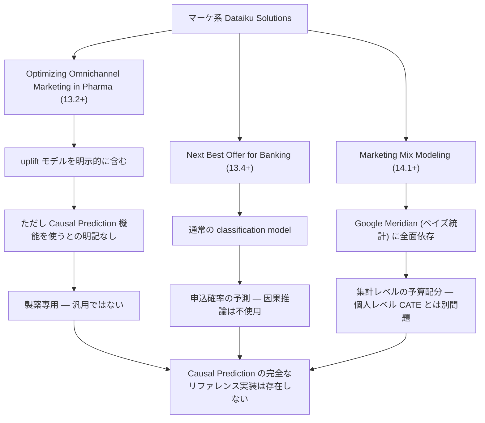
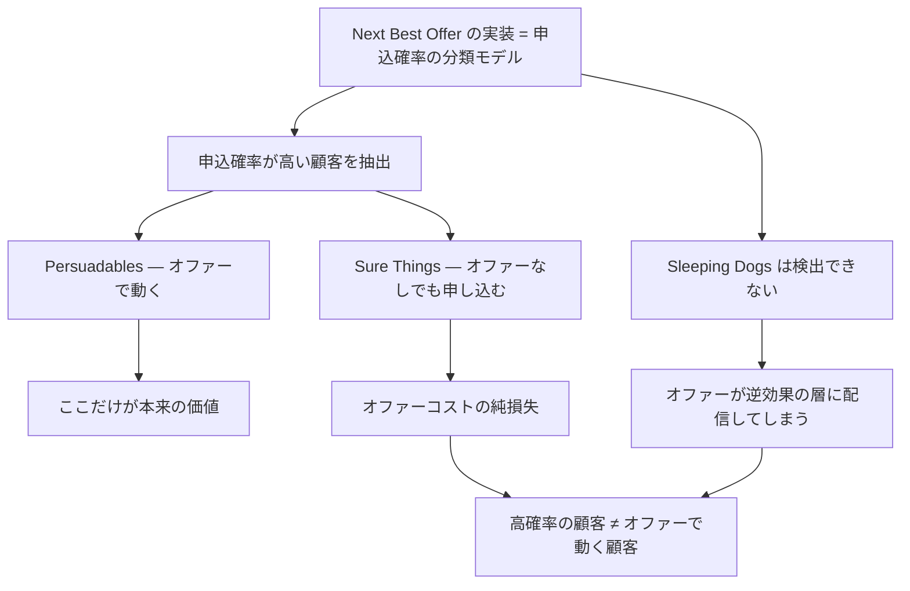
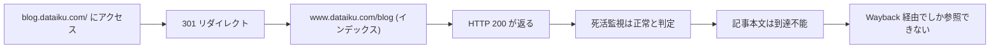

# ソリューションとマーケティング表現

Dataiku は「Dataiku Solutions」として業種別のテンプレート実装を公開している。マーケティング関連で uplift / 因果推論に関係しそうな 3 本を調べた結果、**Causal Prediction 機能を実際に使うソリューションは実質的に存在しない**ことが分かった。

本レポートは、その乖離と、Dataiku のマーケティング表現の性質を扱う。

主な出典:

- Solution | Optimizing Omnichannel Marketing in Pharma: <https://knowledge.dataiku.com/latest/solutions/life-sciences/solution-optimizing-omnichannel-marketing-in-pharma.html>
- Solution | Next Best Offer for Banking: <https://knowledge.dataiku.com/latest/solutions/financial-services/solution-next-best-offer.html>
- Solution | Marketing Mix Modeling: <https://knowledge.dataiku.com/latest/solutions/retail/solution-marketing-mix-modeling.html>
- Dataiku Solutions（index）: <https://knowledge.dataiku.com/latest/solutions/index.html>

## 要約

- 3 ソリューションのうち、**uplift モデルを明示的に含むのは 1 本のみ**（製薬専用）。
- **Next Best Offer for Banking は因果推論を使っていない**。実体は申込確率を予測する通常の分類モデル。
- **Marketing Mix Modeling も Causal Prediction とは無関係**。Google Meridian への依存。
- **Causal Prediction の完全なリファレンス実装は、公式ソリューションとして存在しない。**
- **定量的な効果主張が一件も見つからない**。誇張がない点は誠実、だが導入判断の根拠もない。両義的。
- 因果推論系の公式ブログ 3 本がリンク切れ。**HTTP 200 を返しながら中身はインデックス**という検出困難な壊れ方。

## 1. 3 ソリューションの実態

| ソリューション | 要求バージョン | uplift を使うか | Causal Prediction 機能を使うか | 実際の中身 |
|--------------|--------------|----------------|---------------------------|-----------|
| **Optimizing Omnichannel Marketing in Pharma** | **13.2+** | ✅ **明示的に含む** | ⚠️ **明記なし** | 製薬のオムニチャネル最適化。uplift モデルを含むが、Dataiku ネイティブの Causal Prediction 機能を使うとは書かれていない |
| **Next Best Offer for Banking** | **13.4+** | ❌ **使わない** | ❌ 使わない | **通常の classification model**（申込確率の予測）。uplift / CATE / treatment の記述は皆無 |
| **Marketing Mix Modeling** | **14.1+** | ❌ 使わない | ❌ 使わない | **Google Meridian**（ベイズ統計）に全面依存。集計レベルの予算配分手法 |

## 2. Optimizing Omnichannel Marketing in Pharma（13.2+）

### 2.1 実態

3 本の中で**唯一 uplift モデルを明示的に含む**ソリューションである。製薬企業のオムニチャネルマーケティング（MR 訪問・メール・Web など複数接点の最適化）を対象とする。

### 2.2 3 つの留保

しかし、これを「Causal Prediction のリファレンス実装」として期待すると外れる。

| 留保 | 内容 |
|------|------|
| **Causal Prediction 機能を使うとの明記がない** | uplift モデルを含むとは書かれているが、それが Dataiku ネイティブの Causal Prediction 機能なのか、カスタム実装なのかが判別できない |
| **製薬専用である** | 名称に「Marketing」とあるが「in Pharma」が付く。ドメイン固有の前提（MR の訪問制約、規制、処方データの構造）に強く依存する |
| **13.2+ が必要** | Causal Prediction 自体は 12.0.0 からあるのに、このソリューションは 13.2 以降。causal 機能のバージョン要件とは無関係な理由（他の機能依存）で上がっている |

### 2.3 名称が誤解を招く

「Optimizing Omnichannel Marketing」という文字列だけを見れば、汎用のオムニチャネルマーケ最適化テンプレートに見える。実態は製薬専用である。一般消費財やサブスクのマーケ担当者がこれを参照しても、**そのまま流用できるものではない**。

## 3. Next Best Offer for Banking（13.4+）— 最も重い乖離

### 3.1 実態

**uplift でも causal でもない。実体は申込確率を予測する通常の classification model である。**

調査の結果、このソリューションのドキュメントには **uplift / CATE / treatment の記述が皆無**であった。

### 3.2 なぜこれが問題か

「Next Best Offer」— 次に何をオファーすべきか — は、**本質的に因果的な問いである**。

問いの構造を分解する。

| 問い | 必要なもの | 得られるもの |
|------|-----------|-------------|
| 「この顧客はローンを申し込むか」 | 分類モデル（相関で足りる） | **申込確率** |
| 「この顧客にローンをオファーすべきか」 | **因果モデル（CATE）** | **オファーによる申込確率の増分** |

**Next Best Offer が答えるべきは後者だが、実装されているのは前者である。**

### 3.3 Sure Things を掘り当てる

ここで、Dataiku 自身が 2021 年のブログ「Enterprise Causal Inference: Beyond Churn Modeling」（アーカイブ: <http://web.archive.org/web/20220521224923/https://blog.dataiku.com/enterprise-causal-inference-beyond-churn-modeling>）で提示した 4 象限が効いてくる。

| 象限 | 施策を受けたら | 施策を受けなかったら | オファーすべきか |
|------|--------------|-------------------|----------------|
| **Persuadables** | 買う | 買わない | ✅ **ここだけが価値** |
| **Sure Things** | 買う | **買う** | ❌ 無駄。オファーなしでも買う |
| **Lost Causes** | 買わない | 買わない | ❌ 無駄 |
| **Sleeping Dogs** | **買わない** | 買う | ❌ **有害。オファーが逆効果** |

分類モデルが出す「申込確率が高い顧客」は、**Persuadables と Sure Things の混合**である。そして一般に、申込確率が最も高い層は Sure Things に偏る。放っておいても申し込む顧客だからこそ、確率が高いのである。

つまり、**「高確率の顧客＝オファーで動く顧客ではない」という uplift の中心的論点が、「Next Best Offer」という命名によって覆い隠されている**。

さらに悪いことに、分類モデルは **Sleeping Dogs を原理的に検出できない**。オファーが逆効果になる層は、申込確率が中程度に見えるだけで、区別する情報が分類モデルには存在しない。

### 3.4 皮肉

Dataiku は 2021 年に、まさにこの論点を説明するブログを書いている。そのブログは現在リンク切れである（後述）。そして 2025 年に公開された「Next Best Offer」ソリューションは、そのブログが批判した相関的アプローチそのものを実装している。

**教育コンテンツが消え、それが警告していた誤りが製品テンプレートとして残る。** これが本調査で最も象徴的な発見である。

## 4. Marketing Mix Modeling（14.1+）

### 4.1 実態

**Google Meridian**（ベイズ統計に基づく MMM ライブラリ）に全面依存する。**Causal Prediction 機能は不使用**。

### 4.2 そもそも別の問題を解いている

MMM と CATE は、しばしば同じ「マーケ効果測定」の文脈で語られるが、**解いている問題が違う**。

| 観点 | Marketing Mix Modeling | Causal Prediction（CATE） |
|------|----------------------|--------------------------|
| **分析単位** | **集計レベル**（週次・チャネル別の総売上など） | **個人レベル** |
| 問い | チャネル間で予算をどう配分するか | **誰に**施策を打つべきか |
| データ | 時系列の集計データ | 個票データ |
| 手法 | ベイズ回帰（Meridian） | S/T/X-learner, Causal Forest |
| 出力 | チャネル別の限界 ROI | 個人ごとの推定処置効果 |
| 典型的な意思決定 | 「TV に 30%、デジタルに 70%」 | 「このユーザーにクーポンを送る/送らない」 |

**MMM は集計レベルの予算配分手法であり、個人レベル CATE とは別問題を解く。** 両者は補完的であって代替関係にない。

このソリューションが Causal Prediction を使わないのは、**誤りではなく正しい**。MMM に CATE は不要である。問題は、Dataiku のマーケ系ソリューションを並べたとき、**因果推論を期待する読者がここに流れ着き、そして別のものを見つける**という構造にある。

### 4.3 バージョン要件

14.1+ が必要。3 本の中で最も新しい。causal は 14.x で保守 1 件だったのに対し、MMM は 14.1 で新規に追加されている。**投資配分の方向が読み取れる。**

## 5. Causal Prediction の完全なリファレンス実装は存在しない

3 本を通した結論。

| 探しているもの | 存在するか |
|--------------|-----------|
| Causal Prediction を使った汎用マーケ・ソリューション | ❌ 存在しない |
| Causal Prediction を使った業種別ソリューション | ❌ 明示的なものは存在しない |
| uplift を含むソリューション | ⚠️ 製薬 1 本のみ（Causal Prediction 機能かは不明） |
| Causal Prediction のハンズオン | ✅ **KB の Tutorial のみ**（<https://knowledge.dataiku.com/latest/ml-analytics/causal-prediction/tutorial-causal-prediction.html>） |
| Causal 専用の Academy コース | ❌ 存在しない（ML Practitioner パスに収録されるのみ） |

**Causal Prediction を本番規模で組み上げた完全なリファレンス実装は、公式ソリューションとして存在しない。**

参照可能なのは KB の Tutorial（単一／複数 treatment のハンズオン、更新割引のマーケ事例、DSS 12.0+）だけである。これはチュートリアルであってソリューションではない。エンドツーエンドのパイプライン、運用設計、モニタリングの参考にはならない。

### 5.1 これが意味すること

- **導入時に参照できる実装パターンがない。** 設計は自前で行う必要がある。
- ソリューションの存在は、ベンダーがそのユースケースに投資している証拠でもある。causal にそれがないことは、03（バージョン史）の「3 年間新機能ゼロ」と整合する。
- 逆に言えば、**ソリューションの不在は機能の不在ではない**。機能は存在し、Tutorial もある。ないのは「こう組めばよい」という完成形の提示である。

## 6. 定量的主張が「存在しない」

### 6.1 事実

blog / KB / Community を通じ、**「uplift により CVR が X% 改善」といった定量的な効果主張は一件も確認できなかった**。

表現はすべて「improving results」等の非定量的記述にとどまる。

| 探した場所 | 定量的主張 |
|-----------|-----------|
| 公式ブログ（現存分・アーカイブ分） | ❌ なし |
| Knowledge Base（Concept / Tutorial） | ❌ なし |
| Dataiku Solutions 3 本 | ❌ なし |
| Community（公式アナウンス含む） | ❌ なし |
| 製品ページ（Machine Learning） | ❌ なし。方法論の開示すらない |

### 6.2 両義的に読む

これは一義的には評価できない。両論を並べる。

#### 誠実と読む側

- **誇張された ROI 数値を掲げていない。** 「uplift 導入で売上 30% 増」のような、条件を伏せた事例数値がどこにもない。
- 因果推論の効果は、そもそも文脈依存性が極めて高い。データの質・処置割当の性質・ベースラインの打ち手によって、同じ手法でも結果は桁で変わる。**汎用的な数値を掲げること自体が不誠実**であり、それをしていないのは技術的に正直な態度である。
- 04 で見た「反実仮想は観測不能」の明記と同じ系統の誠実さである。効果を測ることの難しさを理解している組織は、安易な数字を出さない。

#### 空白と読む側

- **導入判断の根拠となるベンチマークや事例数値が公式に一切ない。** 稟議を通すための材料がゼロである。
- 「どの程度の規模のデータで、どの程度の効果が期待できるか」を示す公式情報が存在しない。
- 顧客事例が causal 領域で公開されていない。**実運用の事例が語れる状態にないのかもしれない**、という読みも可能である。
- 03 で見た「基本ユースケースでの学習失敗が 1 年以上放置」「Community に実ユーザーのトラブル報告なし」と並べると、**語る事例がないから語っていない**という解釈が補強される。

### 6.3 本レポートの立場

**両義的なまま扱うのが正しい。** どちらか一方に断定する材料はない。

ただし実務上の帰結は片方に寄る。理由がどちらであれ、**導入判断に使える公式の定量情報は存在しない**という事実は動かない。効果の見積もりは、自組織のデータで PoC を回して出すしかない。ベンダー資料に期待してはいけない。

## 7. ドキュメントの生存性 — 因果コンテンツの静かな後退

### 7.1 何が起きているか

因果推論系の公式ブログ 3 本が、2026 年時点で**すべてリンク切れ**である。

| ブログ | 元 URL の挙動 | アーカイブ |
|-------|--------------|-----------|
| **Enterprise Causal Inference: Beyond Churn Modeling**（2021-06-03） | 301 → ブログインデックス | <http://web.archive.org/web/20220521224923/https://blog.dataiku.com/enterprise-causal-inference-beyond-churn-modeling> |
| **Motivation for Causal Inference** | 301 → ブログインデックス | <http://web.archive.org/web/20220521212637/https://blog.dataiku.com/motivation-for-causal-inference> |
| Inside 2021 ML Trends: Causality | 301 → ブログインデックス | <http://web.archive.org/web/20240417154712/https://blog.dataiku.com/inside-2021-ml-trends-causality> |

### 7.2 検出困難な壊れ方

**これは通常のリンク切れではない。**

`blog.dataiku.com/<slug>` は 404 を返さない。**301 で静かにブログインデックスへリダイレクトされ、HTTP 200 を返す。** つまり:

- リンクチェッカーは正常と判定する。
- ブラウザで開くと「何かのページ」が表示されるので、慣れていないと気づかない。
- **記事本文は到達不能**。引用の実務上、Wayback 経由でしか参照できない。

これは 404 を返すよりタチが悪い。404 なら「消えた」と分かる。200 は「ある」と嘘をつく。

### 7.3 倒錯 — 訳が残り、原文が消える

最も象徴的なのがこれである。

| 資料 | 状態 |
|------|------|
| **Motivation for Causal Inference**（原文、blog.dataiku.com） | ❌ **リンク切れ** |
| **因果推論のモチベーション**（Dataiku 公式 Qiita、2022-08、上記の日本語訳） | ✅ **現存**: <https://qiita.com/Dataiku/items/25b23182717a0cee6235> |

**日本語訳が残り、原文が消えている。**

しかも Qiita の訳は 2022-08 の記事であり、**DSS のネイティブ Causal Prediction 機能には非言及**である（機能導入前の記事）。つまり今アクセスできる唯一の日本語 Dataiku 公式因果推論コンテンツは、**製品機能の話をしていない**。

日本語リソースの状況を率直に言えば、**極めて手薄**である。日本語で Dataiku の Causal Prediction 機能そのものを解説した資料は、公式・非公式ともに発見できなかった。Qiita の第三者記事（CausalImpact、文献レビュー、手法チートシート）は存在するが、いずれも Dataiku 非依存である。

### 7.4 何を意味するか

これは単なるサイト移行の副作用として片付けられない。

- **消えたのは因果推論の教育的コンテンツである。** 「なぜ因果推論が必要か」「uplift の 4 象限とは何か」を説明していた資料が、揃って到達不能になった。
- 現存する causal 言及ブログは「Keep AI Under Control With Dataiku 12」（<https://www.dataiku.com/blog/dataiku-12>）程度で、これはリリース紹介である。方法論の説明ではない。
- 製品ページ（Machine Learning、<https://www.dataiku.com/product/key-capabilities/machine-learning/>）は、旧 `pages.dataiku.com/causal-inference` の 301 先だが、**方法論の開示はない**。かつて因果推論の専用ランディングページがあった痕跡だけが残っている。
- **リリースノート上の 3 年間の機能停滞（03 参照）と完全に整合する。**

**因果推論というテーマが Dataiku のサイトから静かに退場している。** これが最も自然な読みである。

## 8. 総合 — マーケティング表現の性質

Dataiku の causal 関連の対外表現には、明確なパターンがある。

| パターン | 具体例 | 評価 |
|---------|-------|------|
| **名称と実装の乖離** | Next Best Offer が因果を使わない | ❌ **最も重い問題** |
| **名称が範囲を誤認させる** | Omnichannel Marketing が製薬専用 | ⚠️ 問題 |
| **隣接領域の混在** | MMM が causal と同じ棚に並ぶ | ⚠️ 読者の期待を外す |
| **定量的主張の不在** | 効果数値がどこにもない | ⚠️ **両義的**（誠実 / 空白） |
| **標語だけの流通** | 「予測から処方へ」に仮定の話がない | ❌ 問題（04 参照） |
| **教育コンテンツの後退** | 因果ブログ 3 本がリンク切れ | ❌ 問題 |
| **技術資料の誠実さ** | 3 仮定・非互換 5 項目・反実仮想の限界を明示 | ✅ **明確な美点** |

### 8.1 読者への含意

**ベンダー資料から uplift 実装例を期待して読むと空振りする。**

- Solutions を見ても、Causal Prediction の実装例は出てこない。
- ブログを探しても、因果推論の解説は Wayback にしかない。
- Academy にも専用コースはない。
- 定量的な効果の目安もない。

**技術ドキュメントを正とせよ。**

参照すべきは以下に絞られる。

| 資料 | 用途 |
|------|------|
| Introduction — Causal Prediction | 機能範囲、非互換 5 項目、Python バージョン、CATE の定義 |
| Causal Prediction Algorithms | S/T/X-learner、Causal Forest の設定 |
| Causal Prediction Settings | treatment/outcome 設定、IPW、K-Fold 非対応の唯一の出典 |
| Causal Prediction Results | Uplift/Qini の数式、feature importance、Randomization Test、Positivity Analysis |
| Scoring recipe / Evaluation recipe | 保存済みモデルの運用、MES 非対応の明記 |
| KB: Concept \| Causal prediction | 3 仮定、feature importance の意味、反実仮想の限界 |
| KB: Tutorial \| Causal prediction | 唯一のハンズオン |
| リリースノート（12/13/14） | バージョン要件の一次情報 |

この 8 点が実質的にすべてである。Causal Prediction のリファレンスは `machine-learning/causal-prediction/` 配下の 6 ページで全構成であり、KB の causal コンテンツは concept + tutorial の 2 本のみ。**全体で 10 ページに満たない。**

そしてその 10 ページ弱は、**率直に言って質が高い**。仮定を明示し、限界を認め、非互換を隠さない。問題は、その外側にあるすべて — 名称・ブログ・ソリューション・標語 — が、その誠実さを共有していないことである。

## 9. まとめ

- **3 ソリューションのうち Causal Prediction を使うものはゼロ。** uplift を含むのは製薬専用の 1 本のみ、しかも Causal Prediction 機能を使うとの明記はない。
- **Next Best Offer for Banking は、因果的な問いを相関的なモデルで解いている。** 命名が uplift の中心的論点（高確率 ≠ 動く顧客、Sure Things / Sleeping Dogs）を覆い隠している。
- **MMM は別問題を解いている。** 集計レベルの予算配分であり、個人レベル CATE とは補完関係にあって代替関係にない。
- **Causal Prediction の完全なリファレンス実装は公式に存在しない。** 参照可能なのは KB の Tutorial 1 本。
- **定量的な効果主張は一件も存在しない。** 誇張がないのは誠実だが、導入判断の根拠もないことを意味する。両義的。
- **因果推論の教育コンテンツが静かに退場している。** 3 本のブログが HTTP 200 を返しながら到達不能。日本語訳だけが残り原文が消えるという倒錯。
- **結論: ベンダー資料ではなく技術ドキュメントを読め。** 10 ページ弱だが、そこにあるものは信頼できる。
