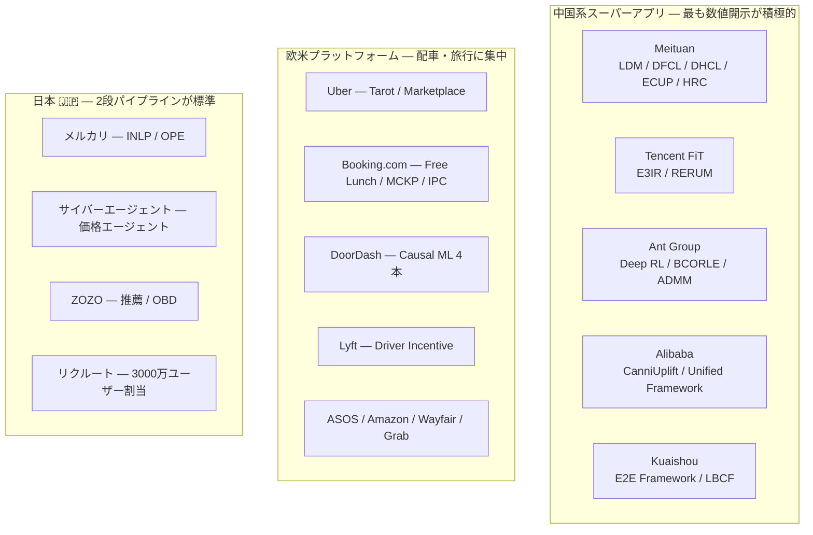
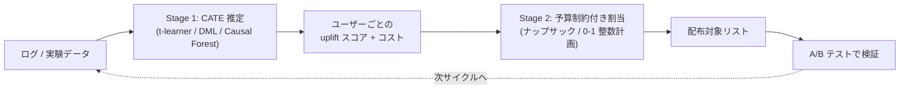

# 本番導入事例 — 定量的成果で読む

クーポン/インセンティブ最適化の**本番導入事例**を、定量的成果を軸に整理する。本クラスタ 69 リソースのうち事例に該当するのは 52 件で、地域別には**中国系プラットフォーム**（18 件）、**欧米プラットフォーム**（20 件）、**日本 🇯🇵**（20 件）に分かれる。

本レポートは意図的に**成功事例と失敗事例を同じ重みで扱う**。この領域の公開情報は成功側に強く偏っており、成功事例のみを並べると投資判断を誤るためである。

> ⚠️ 帰属・会議名の誤りが 7 件検出されている。引用前に [04-oss-status-and-corrections.md](./04-oss-status-and-corrections.md) を必ず確認すること。本レポート内では訂正済みの帰属を用いている。

## 1. 定量的成果が公開されている事例

ビジネス上の投資判断に直接使える、**ハードな数値が公開されている事例のみ**を最初に置く。

| 事例 | 企業 | 年 | 公開されている定量成果 |
|------|------|-----|---------------------|
| **Tarot / Multiple Knapsack** | **Uber** | 2026 | **予算消化率 68% → 99.99%**。10万ユーザー問題で **HiGHS(LP) 24時間超 → CP-SAT で数分** |
| **価格エージェント** 🇯🇵 | **サイバーエージェント** | 2025 | **クーポン原資を最大 70% 削減（売上は維持）** |
| **LDM (Real-time Coupon Allocation)** | **Meituan** | 2024 | **1人あたり 50ms、年間 CNY 800万の追加利益**。1億超ユーザー・110都市超 |
| **クーポン推薦モデル改善** 🇯🇵 | **ZOZO** | 2024 | **売上 124.69%**（配信対象者選定）、注文数 120.08%、配信CTR +0.12pt |
| **Flat Experiment / HTE** | **DoorDash** | — | **プロモコスト 33% 削減**となる部分集団を特定 |
| **Driver Incentive LP** | **Lyft** | — | **LP 1問あたり時間 -80%、E2E -92%** |
| **CanniUplift** | **Alibaba** | 2026 | **増分 GMV +4.08%**（本番 baseline 比） |
| **Robust Portfolio Optimization** | 匿名小売 | 2024 | **売上 +4.5%**（2,000万顧客 A/B） |
| **Online MCKP** | **Booking.com** | 2022 | **予算厳守のまま最適効果の 99.7% 超** |
| **Hidden Representation Clustering** | **Meituan** | 2025 | **OV +0.53%、GMV +0.65%**（数千万ユーザー規模） |
| **DISCO** | **ASOS** | 2024 | **平均バスケット額 >1% 改善** |
| **Scenarios (CDP)** | **Grab** | — | **コンバージョン +3% 超の uplift** |
| **Offline Constrained Deep RL** | **Ant Group** | 2023 | **数千万ユーザー・予算10億超**の全トラフィックに投入（改善率は非開示） |
| **Interleaving** 🇯🇵 | **Gunosy** | 2018 | **A/B テスト比で 10〜100 倍の評価効率** |

数値の性質が大きく 3 種類に分かれる点に注意したい。

- **運用効率の数値**（Uber 予算消化率、Lyft LP 時間、Meituan 50ms、Gunosy 評価効率）— 再現性が高く、他社に移植しやすい
- **ビジネス成果の数値**（ZOZO 売上 124.69%、Alibaba GMV +4.08%、匿名小売 +4.5%）— ベースラインと市場環境に強く依存し、そのまま自社に期待してはならない
- **コスト削減の数値**（サイバーエージェント 最大 70%、DoorDash 33%）— 「売上を維持したまま」という条件が付く点が重要。**削減幅の大きさは、裏を返せば元の配布が無駄だったことの証拠**でもある

## 2. 逆向きの定量的知見 — 過度な期待への歯止め

> 上表だけを見て判断すると必ず誤る。**否定的・失敗側の定量結果**を同じ重みで併記する。

| 事例 | 企業 | 年 | 定量的知見 |
|------|------|-----|----------|
| **HTE 推定手法の実用性検証** 🇯🇵 | **ZOZO** | 2025 | **5万サンプル・効果50%でも RMSE/ATE ≈ 0.7**。MSE/ATE 比は S-Learner=100% に対し Linear DML 7.3%、Causal Forest DML 12.7% |
| **Clustered Thompson Sampling** 🇯🇵 | **サイバーエージェント** | 2020 | **CTS が通常 TS に有意勝ちした設定はゼロ**、逆に TS が有意勝ちした設定は複数 |
| **GPS 付き複数処置 uplift** 🇯🇵 | **サイバーエージェント** | 2020 | クリエイティブ **3本では AUUC が負**。効果ピークは1本で上位10%、2本で上位22.5% |
| **Pococha バンディット** 🇯🇵 | **DeNA** | 2021 | 新規リスナーは **1人100推薦では報酬信号不足でランダムとほぼ差なし** |

この 4 件から読み取るべき含意は次の通り。

- **ZOZO の RMSE/ATE ≈ 0.7 は本クラスタで最も重要な単一の数値**かもしれない。5万サンプル・効果 50%（現実の施策より遥かに恵まれた条件）でさえ、個別効果の推定誤差が平均効果の 7 割に達する。つまり**「個人ごとの効果を精緻に当てる」という前提でパイプラインを設計してはならない**。同時に、Linear DML が S-Learner の 7.3% まで MSE を落としている事実は、**手法選択が効く**ことも示している。
- **サイバーエージェントの「有意勝ちゼロ」**は、クラスタ分割によるデータ希薄化で探索が不足したことに起因する。**セグメントを細かく切るほど良い、という直感は誤り**。
- **クリエイティブ 3本で AUUC が負**は、選択肢を増やすほど uplift モデルの信頼性が落ちることを意味する。**処置の種類数は少ないほうが安全**。
- **DeNA の「報酬信号不足」**は、データ量ではなく**1ユーザーあたりの観測数**が効くことを示す。新規ユーザーには uplift もバンディットも効かない。

これらが示す設計指針は共通している。**粗い粒度・少ない処置種類・十分な観測数**が確保できる場面を選ぶこと。

## 3. 地域別の事例

### 3.1 中国系スーパーアプリ

クーポン/インセンティブ配分の公開事例は**中国系スーパーアプリに強く偏在**しており、定量結果の開示も最も積極的である。

| # | タイトル | 企業 / 発表先 | 要点 |
|---|---------|-------------|------|
| 1 | [Data-Driven Real-time Coupon Allocation](https://arxiv.org/abs/2406.05987) | **Meituan** / 2024 | CVR 推定（isotonic 回帰）+ ラグランジュ双対。**50ms / 年間 CNY 800万**。1億超ユーザー・110都市超。**最も数値が揃った事例** |
| 2 | [Decision Focused Causal Learning (DFCL)](https://arxiv.org/abs/2407.13664) | **Meituan** / KDD 2024 本会議 | 0-1 整数確率計画を DFL で end-to-end 化。ソルバ呼び出しコスト削減の代理損失 |
| 3 | [Direct Heterogeneous Causal Learning (DHCL)](https://arxiv.org/abs/2211.15728) | **Meituan** / AAAI 2023 | ⚠️ **Alibaba ではなく Meituan**。decision factor で ML と OR を架橋しソート/比較のみで解を得る |
| 4 | [Entire Chain Uplift Modeling (ECUP)](https://arxiv.org/abs/2402.03379) | **Meituan** / WWW 2024 Companion | ⚠️ **Alibaba 帰属は誤り**。⚠️ **arXiv v2 は 2026-01-23 に取り下げ済み**。複数処置 + 全チェーンラベルは業界初 |
| 5 | [Hidden Representation Clustering (HRC)](https://arxiv.org/abs/2506.00959) | **Meituan** / 2025 | 個人単位予測でなく隠れ表現を K 群にクラスタリング→整数確率計画。**A/B で OV +0.53%、GMV +0.65%** |
| 6 | [Bi-Level Decision-Focused Causal Learning](https://arxiv.org/abs/2510.19517) | **Meituan 系** / 2025 | 観測データと実験データを橋渡しする二層 DFL。#2 の後続 |
| 7 | [E3IR](https://arxiv.org/abs/2408.11623) | **Tencent (FiT)** / RecSys 2024 | MCKP に単調・平滑な応答曲線制約 + **ILP を微分可能層として統合** |
| 8 | [RERUM](https://xingt-tang.github.io/assets/pdf/rerum_kdd24.pdf) | **Tencent (FiT)** / KDD 2024 | #7 と同一グループの実運用ライン |
| 9 | [Marketing Budget Allocation with Offline Constrained Deep RL](https://arxiv.org/abs/2309.02669) | **Ant Group** / WSDM 2023 Best Paper Candidate | **数千万ユーザー・予算10億超**のキャンペーン全トラフィックに投入 |
| 10 | [BCORLE(λ)](https://proceedings.neurips.cc/paper/2021/hash/ab452534c5ce28c4fbb0e102d4a4fb2e-Abstract.html) | **Ant Group** / NeurIPS 2021 | Offline BCQ + 状態にラグランジュ乗数を追加。**λ-generalization により λ ごとの再学習が不要** |
| 11 | [Distributed ADMM Solver for Billion-Scale GAP](https://arxiv.org/abs/2210.16986) | **Ant Group** / 2022 | Bregman ADMM で MapReduce 分散求解。**数十億の決定変数**規模 |
| 12 | [CanniUplift](https://arxiv.org/abs/2607.05242) | **Alibaba (Taobao & Tmall)** / KDD 2026 | seller/incentive レベルのカニバリを分離。**増分 GMV +4.08%**。最新の論点 |
| 13 | [A Unified Framework for Marketing Budget Allocation](https://arxiv.org/abs/1902.01128) | **Alibaba** / KDD 2019 | semi-black-box モデル。コスト上限・利益下限・ROI 下限に対応し全社運用。**本領域の古典** |
| 14 | [An End-to-End Framework for Marketing Effectiveness Optimization](https://arxiv.org/abs/2302.04477) | **Kuaishou** / 2023 | ⚠️ **Alibaba 帰属は誤り**。2段階の目的不整合を回避。**数億ユーザーの短編動画プラットフォーム**に展開 |
| 15 | [LBCF](https://arxiv.org/abs/2201.12585) | **Kuaishou** / WWW 2022 | ⚠️ 正式名は "Large-Scale Budget-Constrained"（"Lagrangian" ではない）。予算制約を木の分割基準に直接組込み |
| 16 | [Coarse-to-fine Dynamic Uplift Modeling](https://arxiv.org/abs/2410.16755) | **Kuaishou** / 2024 | 数十億ユーザー規模で検証 |
| 17 | [SACO](https://arxiv.org/abs/2508.09198) | **Alibaba 系（推定・要確認）** / 2025 | 逐次的相互作用を明示モデル化 |
| 18 | [UMLC](https://arxiv.org/abs/2502.15697) | KDD 2025 | 処置/対照群の分布シフト対策 |

中国系の特徴は、**リアルタイム性の要求が極端に高い**ことである。Meituan LDM の「1人あたり 50ms」は、ユーザーがアプリを開いた瞬間にクーポンを決める設計を意味する。この制約が Lagrangian 双対（オンラインで λ を持ち回るだけで済む）の採用を強く動機づけている。逆に言えば、**リアルタイム性が不要なユースケースでは中国系の方法論をそのまま輸入する必要はない**（詳細は [02](./02-budget-constrained-allocation.md)）。

もう一つの特徴は、**規模が方法論を規定している**ことだ。Ant の数十億決定変数、Kuaishou の数十億ユーザーは、汎用ソルバーの適用範囲を完全に超えており、ADMM 分散求解や決定基準のソートによる近似といった特殊解に追い込まれている。

### 3.2 欧米プラットフォーム

| # | タイトル | 企業 / 発表先 | 要点 |
|---|---------|-------------|------|
| 19 | [Beyond Prediction: Solving the Multiple Knapsack Problem at Scale](https://www.uber.com/us/en/blog/solving-multiple-knapsack/) | **Uber** / 2026-05 技術ブログ | Tarot。**予算消化率 68% → 99.99%**。10万ユーザー問題で **HiGHS(LP) 24時間超 → CP-SAT 数分**。**本クラスタで最も具体的な運用数値** |
| 20 | [Practical Marketplace Optimization at Uber](https://arxiv.org/abs/2407.19078) | **Uber** / KDD 2024 **Workshop** | ⚠️ **本会議ではない**。Deep S-Learner + tensor B-Spline、ADMM。定量結果は非開示 |
| 21 | [Free Lunch! Retrospective Uplift Modeling](https://arxiv.org/abs/2008.06293) | **Booking.com** / **RecSys 2020** | ⚠️ **CIKM ではない**。Retrospective Estimation + Knapsack + オンライン動的較正 |
| 22 | [E-Commerce Promotions Personalization via Online MCKP](https://arxiv.org/abs/2108.13298) | **Booking.com** / CIKM 2022 | **予算厳守のまま最適効果の 99.7% 超**。#21 が CIKM と誤引用される混同の実体はこちら |
| 23 | [Personalizing Benefits Allocation Without Spending Money](https://dl.acm.org/doi/10.1145/3523227.3547381) | **Booking.com** / RecSys 2022 | CATE 推定でプロモの機会費用を最適化 |
| 24 | [Incremental Profit per Conversion (IPC)](https://arxiv.org/abs/2306.13759) | **Booking.com** / 2023 | 応答依存コスト向けの評価指標。**単一モデル・転換データのみ**でメタラーナー不要 |
| 25 | [Challenges and Methods of Causal Promotions Recommendation](https://dl.acm.org/doi/10.1145/3769300) | **Booking.com** / ACM TORS | #21-24 の系譜を総括。**Booking 系を一本で押さえるならここ** |
| 26 | [DISCO](https://arxiv.org/abs/2406.06433) | **ASOS** / ECML-PKDD 2024 ADS | Thompson Sampling を整数計画に組込み、**RBF で連続アクションを表現**。**平均バスケット額 >1% 改善** |
| 27 | [Smarter promotions with causal machine learning](https://careersatdoordash.com/blog/doordash-smarter-promotions-with-causal-machine-learning/) | **DoorDash** | Double ML で「割引の有無」でなく**「いくら割引するか」**を最適化 |
| 28 | [Causal Modeling from Flat Experiment Results](https://careersatdoordash.com/blog/causal-modeling-to-get-more-value-from-flat-experiment-results/) | **DoorDash** | HTE で**プロモコストを 33% 削減**する部分集団を発見。**全体平均が flat な実験からも価値を抽出する論法** |
| 29 | [Optimizing DoorDash's Marketing Spend with ML](https://careersatdoordash.com/blog/optimizing-marketing-spend-with-ml/) | **DoorDash** | 1ドルあたり増分注文を最大化 |
| 30 | [Budget A/B experimentation](https://careersatdoordash.com/blog/doordash-ads-uses-budget-a-b-experimentation/) | **DoorDash** | LinkedIn 発祥の budget A/B。単一キャンペーン内に予算を分割した別宇宙を作り干渉を除去 |
| 31 | [Lyft: Optimizing Driver Incentive Plans](https://www.gurobi.com/case_studies/lyft-optimizing-driver-incentive-plans-and-adapting-to-market-changes/) | **Lyft** / Gurobi 事例 | ⚠️ **「Lyft WSDM'22」論文は存在しない**。数百万変数 LP。**LP 1問あたり -80%、E2E -92%** |
| 32 | [Driver Positioning and Incentive Budgeting with an Escrow Mechanism](https://arxiv.org/abs/2104.14740) | **Lyft** / INFORMS J. Applied Analytics 2021 | **全320都市に展開** |
| 33 | [Personalized Treatment Selection using Causal Heterogeneity](https://arxiv.org/abs/1901.10550) | **LinkedIn** / **WWW 2021** | ⚠️ **KDD'21 ではない**。(i) HTE 推定 → (ii) 制約付き最適化の2段構成 |
| 34 | [LORE](https://dl.acm.org/doi/10.1145/3298689.3347027) | **Amazon** / RecSys 2019 | 適格性 + 定員の同時制約を **Min-Cost Flow** に定式化 |
| 35 | [Marketing ML Systems at Wayfair](https://www.aboutwayfair.com/careers/tech-blog/building-scalable-and-performant-marketing-ml-systems-at-wayfair) | **Wayfair** | 数百キャンペーン規模での uplift 運用。OSS **pylift** の出自 |
| 36 | [Cost-Effective Incentive Allocation via Structured Counterfactual Inference](https://arxiv.org/abs/1902.02495) | **Adobe 系** / AAAI 2020 | **本領域の初期古典** |
| 37 | [Robust portfolio optimization model for electronic coupon allocation](https://arxiv.org/abs/2405.12865) | **匿名小売パートナー** / INFOR 2024 | **2,000万顧客へ A/B、売上 +4.5%**。2024-08 以降に既定アルゴリズムとして採用 |
| 38 | [Grab CDP "Scenarios"](https://engineering.grab.com/scenarios) | **Grab** | **コンバージョン +3% 超の uplift** |

**Uber Tarot（#19）が本クラスタで最も具体的な運用数値を持ち、かつ本ユースケース（数ヶ月に一度のバッチ配分）に最も近い**。予算消化率 68% → 99.99% という数値は、**uplift モデルの精度向上ではなく配分ソルバーの改善によって得られた**点が決定的に重要である。31 ポイントの改善は、どんな CATE 推定手法の改良でも到達し得ない規模だ。

DoorDash の「flat な実験から価値を抽出する」論法（#28）も実務的価値が高い。全体平均で有意差が出なかった実験を捨てず、HTE で部分集団を探すことで**プロモコスト 33% 削減**という結論を得ている。これは新規実験の予算を必要としない改善であり、投資対効果が最も高いパターンの一つ。

### 3.3 日本 🇯🇵

日本企業は **「CATE 推定 → ナップサック型割当」の2段パイプラインが事実上の標準構成**である。中国系のような end-to-end 微分可能化や、Ant のような分散 ADMM は日本の公開事例には見られない。

そして**失敗事例が公開されている点（サイバーエージェント、ZOZO、DeNA）は、成功事例に偏りがちな本領域で特に価値が高い**。この 3 社の否定的報告は、海外の成功事例だけを見ていては得られない校正情報を提供している。

| # | タイトル | 企業 / 発表先 | 要点 |
|---|---------|-------------|------|
| 39 | 🇯🇵 [Strategic Coupon Allocation in Two-sided Marketplaces](https://arxiv.org/abs/2407.14895) | **メルカリ** / KDD 2024 TSMO Workshop | uplift + **整数非線形計画(INLP)**。**約200万出品者・数百万クーポン**で検証 |
| 40 | 🇯🇵 [アイテムクーポンPJの半年を振り返る](https://ai.mercari.com/articles/ai/item-coupon/) | **メルカリ** / 2024-01 | uplift で予算制約下に週2回自動配布。**売れた出品者が購買活動も増やすスピルオーバー効果**を観測（数値非開示） |
| 41 | 🇯🇵 [OPE with General Logging Policies（RIETI DP 22-E-097）](https://www.rieti.go.jp/jp/publications/dp/22e097.pdf) | **メルカリ + RIETI/Yale** / 2022-10 | ⚠️ **主題は OPE 手法でクーポンは応用事例**。査読版は AAAI 2023 |
| 42 | 🇯🇵 [Uplift Modeling 適用の問題点と新しい評価指標](https://www.jstage.jst.go.jp/article/pjsai/JSAI2020/0/JSAI2020_1H4OS12b02/_article/-char/ja/) | **メルカリ** / JSAI2020 | **評価指標の議論の出発点** |
| 43 | 🇯🇵 [費用対効果の高いクーポン配布対象者の決定法](https://research.lycorp.co.jp/jp/publications/1960) | **LINEヤフー** / JSAI2024 | 購入とコストそれぞれの CATE から **ACPA（追加1単位購入に必要なコスト）**を算出。**日本語で最も本テーマに直球** |
| 44 | 🇯🇵 [多腕バンディット問題としての広告配信の最適化](https://developers.cyberagent.co.jp/blog/archives/25099/) | **サイバーエージェント** / 2020-02 | **失敗事例（貴重）**。**CTS が有意勝ちした設定はゼロ**。クラスタ分割によるデータ希薄化で探索不足 |
| 45 | 🇯🇵 [AI×経済学でクーポン原資の無駄を削減する「価格エージェント」](https://www.cyberagent.co.jp/news/detail/id=32319) | **サイバーエージェント** / 2025-08 | **売上を維持したままクーポン原資を最大 70% 削減**。**商用ソリューション化の到達点** |
| 46 | 🇯🇵 [「ユーザーごとに異なる施策効果」の推定手法の実用性を調べてみた話](https://techblog.zozo.com/entry/hte_analysis) | **ZOZO** / 2025-05 | **否定的定量結果（貴重）**。**5万サンプル・効果50%でも RMSE/ATE ≈ 0.7**。精緻な個別効果推定は困難と結論 |
| 47 | 🇯🇵 [クーポン推薦モデルとシステム改善の取り組み](https://techblog.zozo.com/entry/improve-coupon-recommendation) | **ZOZO** / 2024-01 | ⚠️ **uplift ではなく Two-Stage Recommender**。A/B で**売上 124.69%**、注文数 120.08% |
| 48 | 🇯🇵 [バンディットアルゴリズムを用いた推薦システムの構成](https://techblog.zozo.com/entry/zozoresearch-bandit-overviews) | **ZOZO研究所** / 2020-11 | ZOZOTOWN トップに Random / Bernoulli TS を Istio ルーティングで並行配信 |
| 49 | 🇯🇵 [3000万以上のユーザーに未経験サービスを促すギフト券配信の割当問題](https://atmarkit.itmedia.co.jp/ait/articles/2207/29/news011.html) | **リクルート** / 2022-07 | **3,000万超ユーザー**への割当を予算制約付き 0/1 割当問題として定式化。**汎用ソルバーでは非現実的なため専用の近似アルゴリズムを開発** |
| 50 | 🇯🇵 [リクルートにおける bandit アルゴリズム実装前までのプロセス](https://speakerdeck.com/rtechkouhou/rikurutoniokerubanditarugorizumushi-zhuang-qian-madefalsepurosesu) | **リクルートテクノロジーズ** / PyData.Tokyo 2017 | **本番導入の実務知見**。API 連携でなくファイル連携、**緊急停止ボタン**の実装など運用設計の生々しい記録 |
| 51 | 🇯🇵 [最適クリエイティブ数を予測する: UpLift Modeling](https://cyberagent.ai/blog/research/economics/12482/) | **サイバーエージェント** / 2020-03 | **一般化傾向スコア(GPS)** で IPW 適用。**3本は AUUC 負** |
| 52 | 🇯🇵 [Pococha におけるバンディットアルゴリズムの検証](https://engineering.dena.com/blog/2021/11/pococha-bandit/) | **DeNA** / 2021-12 | **10万サンプルではセグメント+contextless UCB が LinUCB を上回る**。新規リスナーはランダムとほぼ差なし |
| 53 | 🇯🇵 [Direct and Enduring Effect Predictions](https://arxiv.org/abs/2207.14798) | **メルカリ** / 2022 | 即時効果と持続効果を分離予測 |
| 54 | 🇯🇵 [Balancing Immediate Revenue and Future OPE in Coupon Allocation](https://link.springer.com/chapter/10.1007/978-981-96-0125-7_35) | **メルカリ** / PRICAI 2024 | **即時収益と将来の OPE 精度のトレードオフ**。ランダム化探索の価値を定量化 |
| 55 | 🇯🇵 [ABテストと、アップリフトモデリングによる施策の精緻化](https://note.com/m3dag/n/n0dee43556302) | **エムスリー** / 2024-04 | t-learner によるターゲティング精緻化 |
| 56 | 🇯🇵 [Open Bandit Dataset and Pipeline](https://arxiv.org/abs/2008.07146) | **ZOZO研究所** / NeurIPS 2021 D&B | **複数方策の A/B により収集された2,600万件超**のログ。**実運用の方策実装まで同梱した世界初の公開データ** |
| 57 | [Criteo Uplift Prediction Dataset](https://ailab.criteo.com/criteo-uplift-prediction-dataset/) | **Criteo** / AdKDD 2018 | **25M 行**。uplift 手法比較のデファクト標準 |
| 58 | 🇯🇵 [A/Bテストよりすごい？はじめてのインターリービング](https://data.gunosy.io/entry/2018/10/15/080000) | **Gunosy** / 2018-10 | **A/B テスト比で 10〜100 倍の効率** |

#### 日本の標準構成: 2段パイプライン

メルカリ（#39 INLP）、LINEヤフー（#43 ACPA）、リクルート（#49 0/1 割当）、ZOZO、エムスリー（#55 t-learner）がいずれもこの型に収まる。中国系のような end-to-end 化に踏み込んだ日本の公開事例は、2025 年のサイバーエージェント「価格エージェント」（#45）まで待つことになる。

#### リクルートの 3,000万ユーザー割当 — 規模が方法を決める

リクルート（#49）は 3,000万超ユーザーへのギフト券配信を予算制約付き 0/1 割当問題として定式化したが、**汎用ソルバーでは非現実的なため専用の近似アルゴリズムを開発**している。これは Uber Tarot（10万ユーザーで CP-SAT 数分）との対比で読むと示唆的である。

| | リクルート | Uber Tarot |
|---|---|---|
| 規模 | 3,000万ユーザー | 10万ユーザー |
| ソルバー | **専用近似アルゴリズム**（汎用ソルバー不可） | **CP-SAT**（汎用ソルバー） |
| 時期 | 2022 | 2026 |

**規模が 2〜3 桁変わると解法の選択肢が根本的に変わる**。自社の対象ユーザー数がどちらの帯域にあるかが、最初に確認すべき設計パラメータである。

#### リクルート PyData 発表の運用知見 — 論文には書かれないこと

リクルートテクノロジーズの PyData.Tokyo 発表（#50）は、本クラスタで**唯一「本番導入前のプロセス」そのものを記録した資料**である。技術的新規性はないが、実務的価値は高い。

- **API 連携ではなくファイル連携を選択** — リアルタイム推論のインフラを組む前に、まずバッチのファイル受け渡しで価値を検証する。数ヶ月に一度のバッチ配分というユースケースでは、そもそも API 連携が不要である可能性が高い。
- **緊急停止ボタンの実装** — アルゴリズムが暴走したときに人間が即座に止められる仕組み。これは論文にもテックブログにもほとんど書かれないが、本番導入の可否を分ける要件になりうる。

## 4. 事例の偏在 — 何が「見つからなかった」か

公開事例は**中国系スーパーアプリと配車・旅行（Uber / Lyft / DoorDash / Booking / Grab）に集中**している。以下の企業には、本領域（クーポン/インセンティブの予算制約付き最適化）の公開事例が**見つからなかった**。

| 地域 | 該当事例が見つからなかった企業 |
|------|----------------------------|
| 欧米 | Amazon（LORE #34 を除く）、eBay、Netflix、Spotify、Airbnb、Instacart、Zalando、Expedia |
| アジア | Shopee、Coupang、Naver、JD.com |
| 日本 🇯🇵 | 楽天、PayPay 等 |

この「不在」の解釈には注意が必要である。**やっていない**のか、**公開していない**のかは区別できない。ただし次のことは言える。

- Netflix / Spotify はサブスクリプション型でクーポン施策の余地自体が小さく、**業態的に該当しない**可能性が高い
- Amazon / 楽天 / JD.com のような大規模 EC が公開していないのは、**競争優位に直結するため非開示**という説明のほうが自然
- **したがって「事例が見つからない業態だから効かない」という推論は成立しない**。同時に「大手がみんなやっているはず」という推論も、根拠は薄い

偏在の実務的な含意は、**参照可能な事例が自社の業態と一致しない可能性が高い**ということだ。配車・フードデリバリー・旅行予約はいずれも**取引頻度が高く、クーポンの効果が短期に観測できる**業態である。取引頻度が低い業態では、これらの事例の数値をそのまま期待値にしてはならない。

## 5. 本レポートからの実務的含意

1. **配分ソルバーへの投資が、モデル精度への投資より効く可能性が高い**。Uber の予算消化率 68% → 99.99% は配分側の改善で得られた。ZOZO の RMSE/ATE ≈ 0.7 は、モデル側の精度向上には天井があることを示す。
2. **個別効果の精緻な推定を前提にしない設計にする**。ZOZO・サイバーエージェント・DeNA の否定的結果は一貫して「細かく当てようとすると失敗する」ことを示している。粗い粒度（Meituan HRC の K 群クラスタリングはこの方向）のほうが堅牢。
3. **処置の種類は少なく保つ**。サイバーエージェントのクリエイティブ 3本で AUUC 負という結果は明確な警告。
4. **flat な既存実験を掘り直す価値がある**（DoorDash #28）。新規予算なしでプロモコスト 33% 削減の候補を見つけた前例。
5. **失敗事例の公開元（サイバーエージェント / ZOZO / DeNA）を継続的に追う**。この 3 社は本領域で最も校正価値の高い情報源。
6. **規模を最初に確認する**。10万ユーザー帯なら CP-SAT で足りる（Uber）。3,000万ユーザー帯では専用近似が要る（リクルート）。
7. **緊急停止ボタンとファイル連携から始める**（リクルート #50）。バッチ配分ユースケースではリアルタイム基盤は不要。
