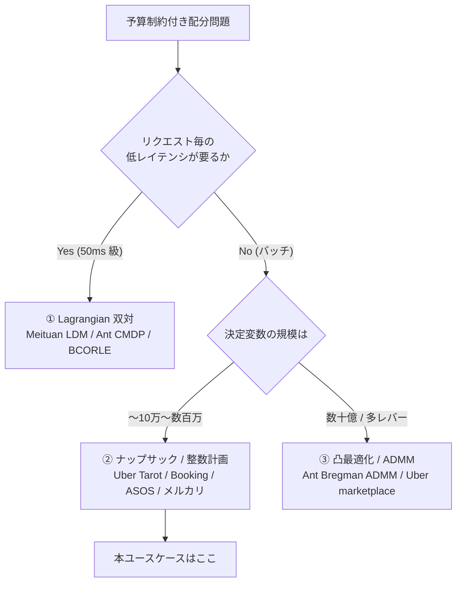
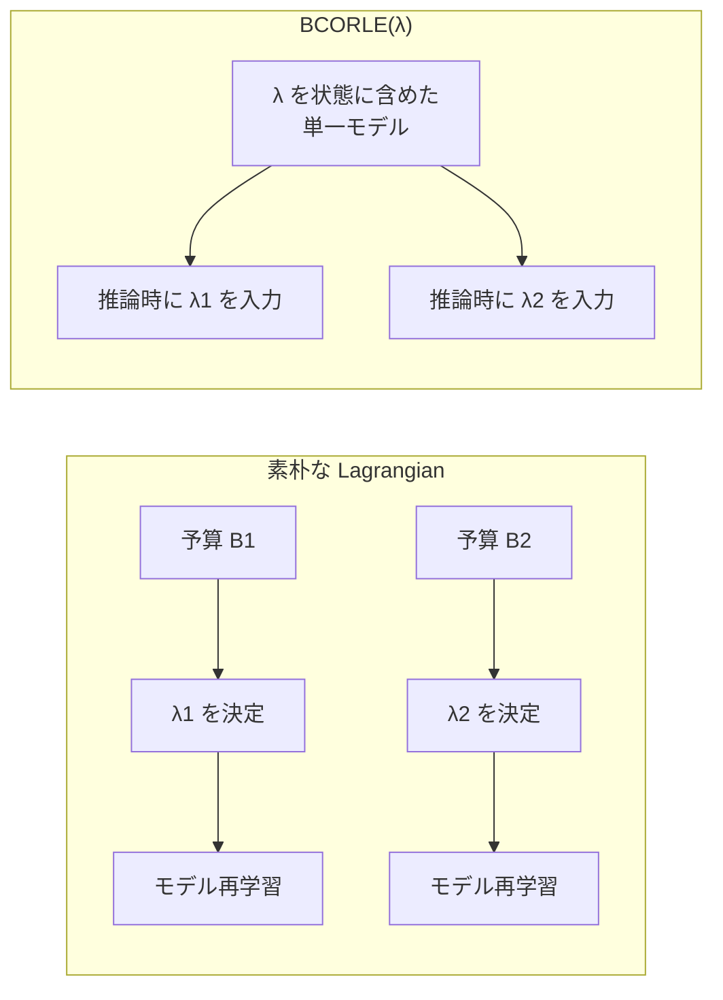
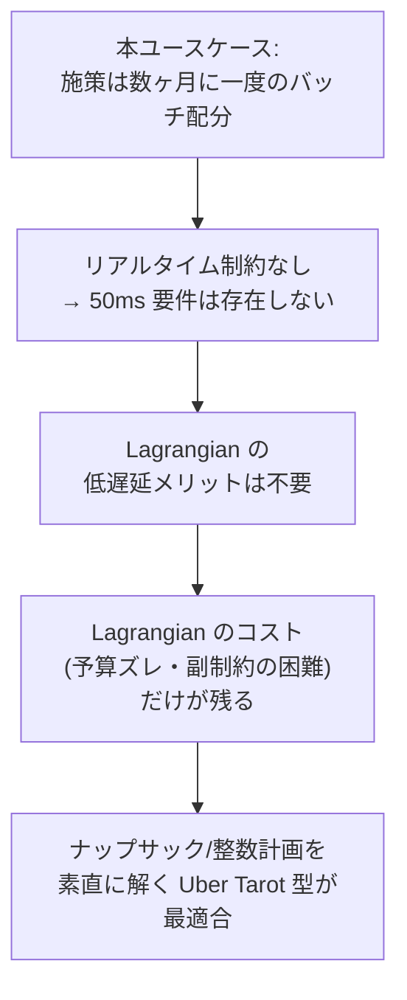

# 予算制約付き配分の3パターン

**本番事例はほぼ例外なく予算制約付き配分として定式化されている**。純粋な uplift スコアリングで終わる事例は少ない。これは本クラスタ 52 の事例を通観して得られる最も再現性の高い観察である。

「誰に効くか」を推定するだけでは意思決定にならず、「限られた原資をどう割り当てるか」まで解いて初めて本番に載る。逆に言えば、**uplift モデルだけを作って配分を人手のルールに任せている構成は、公開事例のなかにほとんど存在しない**。

本レポートでは、実際に採用されている定式化を **①Lagrangian 双対 / ②ナップサック・整数計画 / ③凸最適化・ADMM** の 3 パターンに整理し、それぞれの適用条件を示す。

## 1. 全体像

| パターン | 中核アイデア | 得意な場面 | 代表事例 |
|---------|------------|----------|---------|
| **① Lagrangian 双対** | 予算制約を乗数 λ で目的関数に吸収し、ユーザーごとに独立に判定 | **リクエスト毎レイテンシが効く場面で支配的** | Meituan LDM（50ms）、Ant CMDP、BCORLE(λ) |
| **② ナップサック / 整数計画** | 予算を明示的な制約とし、組合せ最適化ソルバーで直接解く | バッチ配分、予算の厳守、複雑な副制約 | Uber Tarot（MKP+CP-SAT）、Booking（MCKP）、ASOS DISCO、メルカリ INLP、Amazon LORE |
| **③ 凸最適化 / ADMM** | 問題を凸緩和し分散求解 | 超大規模、多都市・多レバーの同時最適化 | Ant Bregman ADMM（数十億変数）、Uber marketplace |

## 2. パターン① — Lagrangian 双対

### 2.1 発想

予算制約 $\sum_i c_i x_i \le B$ を乗数 $\lambda$ で目的関数に吸収すると、問題はユーザーごとに独立な判定に分解される。各ユーザー $i$ について「uplift $-$ $\lambda \times$ コスト」が正なら配る、という単純なルールになる。**$\lambda$ さえ決まれば、ユーザー 1 人あたりの判定は四則演算で済む**。これがミリ秒級のレイテンシを可能にする。

$\lambda$ の決定は二分探索（予算を使い切る $\lambda$ を探す）が典型。

### 2.2 事例

| 事例 | 企業 / 発表先 | 要点 |
|------|-------------|------|
| [Data-Driven Real-time Coupon Allocation (LDM)](https://arxiv.org/abs/2406.05987) | **Meituan** / 2024 | CVR 推定（isotonic 回帰）+ ラグランジュ双対。**1人あたり 50ms、年間 CNY 800万の追加利益**。1億超ユーザー・110都市超 |
| [Marketing Budget Allocation with Offline Constrained Deep RL](https://arxiv.org/abs/2309.02669) | **Ant Group** / WSDM 2023 Best Paper Candidate | CMDP 定式化 + **λ の二分探索**。数千万ユーザー・予算10億超の全トラフィックに投入 |
| [BCORLE(λ)](https://proceedings.neurips.cc/paper/2021/hash/ab452534c5ce28c4fbb0e102d4a4fb2e-Abstract.html) | **Ant Group** / NeurIPS 2021 | Offline BCQ + **状態にラグランジュ乗数 λ を追加**。**λ-generalization により λ ごとの再学習が不要** |
| [LBCF](https://arxiv.org/abs/2201.12585) | **Kuaishou** / WWW 2022 | 予算制約を**木の分割基準に直接組込み**。⚠️ 正式名は "Large-Scale Budget-Constrained"（"Lagrangian" ではない） |
| [The Best of Many Worlds: Dual Mirror Descent](https://arxiv.org/abs/2011.10124) | Balseiro/Lu/Mirrokni / Operations Research 2023 | オンライン配分の双対法。⚠️ **arXiv:2002.10421 は取り下げ済み、2011.10124 が正** |
| [Regularized Online Allocation Problems](https://arxiv.org/abs/2007.00514) | Balseiro et al. / ICML 2021 | 公平性等の正則化項付き拡張 |

### 2.3 BCORLE の λ-generalization

Lagrangian 法の実務上の最大の弱点は、**予算が変わるたびに $\lambda$ が変わり、$\lambda$ に依存するモデルを学習し直す必要がある**ことだ。オフライン RL では特にコストが重い。

BCORLE(λ) はこれを **$\lambda$ を状態空間に含める**ことで解決した。$\lambda$ を入力の一部として学習しておけば、推論時に任意の $\lambda$ を与えられる。これにより**$\lambda$ ごとの再学習が不要**になり、予算変更に即応できる。

### 2.4 Lagrangian が支配的になる条件

**リクエスト毎レイテンシが効く場面で支配的**である。Meituan の 50ms は、ユーザーがアプリを開いた瞬間にクーポンを決める設計を意味する。この場面では整数計画を解く時間はない。

一方で Lagrangian にはコストもある。

- **予算の厳守が難しい**。$\lambda$ は事前に決めるため、実際の流入が想定とずれると予算超過・未消化が生じる。Meituan・Ant は動的な $\lambda$ 調整でこれに対処している。
- **複雑な副制約を入れにくい**。「1人1枚まで」「セグメントごとの上限」といった制約が増えると、双対分解の綺麗さが崩れる。

## 3. パターン② — ナップサック / 整数計画

### 3.1 発想

予算を明示的な制約式として書き、組合せ最適化ソルバーに解かせる。定式化としては以下が使われる。

| 定式化 | 意味 | 事例 |
|-------|------|------|
| **MKP**（Multiple Knapsack） | 複数のナップサック（予算枠）に品物を詰める | Uber Tarot |
| **MCKP**（Multiple-Choice Knapsack） | 各ユーザーについて**排他的な選択肢群から1つ選ぶ**（クーポン額の選択に自然に対応） | Booking、Tencent E3IR |
| **INLP**（整数非線形計画） | 目的または制約が非線形 | メルカリ |
| **Min-Cost Flow** | 適格性 + 定員の同時制約をネットワークフローに帰着 | Amazon LORE |

> **MKP の純粋なマーケティング定式化は独立した canonical 論文としては存在せず、実務上は MCKP が支配的**である。MKP は Ant の generalized assignment（#11）に吸収されている構図。これは、クーポン施策が「配る/配らない」の二値ではなく「いくら配るか（0円/300円/500円/1000円）」という排他選択になることが多いためで、**MCKP のほうが問題の構造に素直に一致する**。

### 3.2 事例

| 事例 | 企業 / 発表先 | 定式化 | 要点 |
|------|-------------|-------|------|
| [Beyond Prediction: Solving MKP at Scale](https://www.uber.com/us/en/blog/solving-multiple-knapsack/) | **Uber** / 2026-05 | **MKP + CP-SAT** | **予算消化率 68% → 99.99%**。10万ユーザー問題で **HiGHS(LP) 24時間超 → CP-SAT 数分** |
| [Free Lunch! Retrospective Uplift Modeling](https://arxiv.org/abs/2008.06293) | **Booking.com** / **RecSys 2020** | **knapsack + ROI 制約** | Retrospective Estimation + Knapsack + オンライン動的較正。⚠️ CIKM ではない |
| [E-Commerce Promotions Personalization via Online MCKP](https://arxiv.org/abs/2108.13298) | **Booking.com** / CIKM 2022 | **Online MCKP** | **予算厳守のまま最適効果の 99.7% 超** |
| [E3IR](https://arxiv.org/abs/2408.11623) | **Tencent (FiT)** / RecSys 2024 | **MCKP 微分可能層** | 単調・平滑な応答曲線制約 + ILP を微分可能層として統合（[03](./03-end-to-end-trend.md) 参照） |
| [DISCO](https://arxiv.org/abs/2406.06433) | **ASOS** / ECML-PKDD 2024 ADS | **整数計画内 Thompson Sampling** | TS を IP に組込み、RBF で連続アクションを表現。**平均バスケット額 >1% 改善** |
| 🇯🇵 [Strategic Coupon Allocation in Two-sided Marketplaces](https://arxiv.org/abs/2407.14895) | **メルカリ** / KDD 2024 TSMO Workshop | **INLP** | 約200万出品者・数百万クーポンで検証 |
| [LORE](https://dl.acm.org/doi/10.1145/3298689.3347027) | **Amazon** / RecSys 2019 | **Min-Cost Flow** | 適格性 + 定員の同時制約を最小費用流に定式化 |
| 🇯🇵 [3000万ユーザーへのギフト券配信の割当問題](https://atmarkit.itmedia.co.jp/ait/articles/2207/29/news011.html) | **リクルート** / 2022-07 | **0/1 割当 + 専用近似** | **汎用ソルバーでは非現実的なため専用の近似アルゴリズムを開発** |
| [A Unified Framework for Marketing Budget Allocation](https://arxiv.org/abs/1902.01128) | **Alibaba** / KDD 2019 | semi-black-box + 制約 | コスト上限・利益下限・ROI 下限に対応し全社運用。**本領域の古典** |
| [CP-SAT Solver \| OR-Tools](https://developers.google.com/optimization/cp/cp_solver) | Google | ソルバー | **Uber Tarot が「HiGHS で24時間超 → CP-SAT で数分」を実現した当のソルバー** |

### 3.3 Uber Tarot の CP-SAT — ソルバー選択が桁を変えた

本クラスタで最も再現性の高い工学的教訓がここにある。

| 項目 | 数値 |
|------|------|
| 問題規模 | 10万ユーザー |
| **HiGHS**（LP ソルバー） | **24時間超** |
| **CP-SAT**（CP/SAT ソルバー） | **数分** |
| 予算消化率 | **68% → 99.99%** |

重要なのは、**この改善が uplift モデルの精度向上によるものではない**ことだ。同じ予測を入力として、**配分の解き方を変えただけ**で予算消化率が 31 ポイント改善している。この規模の改善を CATE 推定手法の改良で得ることは、[01](./01-production-cases.md) の ZOZO の否定的結果（5万サンプル・効果50%でも RMSE/ATE ≈ 0.7）を踏まえるとまず期待できない。

**LP 緩和で解こうとすると整数性の回復に苦しむが、CP-SAT のような専用ソルバーは組合せ構造を直接扱う**——これがこの桁違いの差の理由と読める。予算配分問題を LP で解いている既存システムがあるなら、ソルバーの入れ替えは最も投資対効果の高い改善候補になる。

### 3.4 規模による解法の分岐

| 規模 | 解法 | 事例 |
|------|------|------|
| 〜10万 | **汎用ソルバー（CP-SAT）で数分** | Uber Tarot |
| 数百万 | 整数計画 / INLP、工夫を要する | メルカリ（200万出品者） |
| 3,000万超 | **汎用ソルバー不可、専用近似が必要** | リクルート |
| 数十億変数 | 分散 ADMM（パターン③へ） | Ant Group |

**対象ユーザー数がどの帯域にあるかが、最初に確認すべき設計パラメータ**である。

## 4. パターン③ — 凸最適化 / ADMM

### 4.1 発想

問題を凸緩和し、ADMM（Alternating Direction Method of Multipliers）で分解して分散求解する。決定変数が数十億規模になると、単一マシンのソルバーでは扱えないため、MapReduce 等の分散基盤に載せる必要がある。

### 4.2 事例

| 事例 | 企業 / 発表先 | 要点 |
|------|-------------|------|
| [A Practical Distributed ADMM Solver for Billion-Scale Generalized Assignment Problems](https://arxiv.org/abs/2210.16986) | **Ant Group** / 2022 | **Bregman ADMM** で MapReduce 分散求解。**数十億の決定変数**規模 |
| [Practical Marketplace Optimization at Uber](https://arxiv.org/abs/2407.19078) | **Uber** / **KDD 2024 Workshop** | Deep S-Learner + tensor B-Spline、**ADMM で多都市・多レバーを同時最適化**。⚠️ 本会議ではない。定量結果は非開示 |

### 4.3 適用条件

Uber の marketplace 最適化は、**多都市 × 多レバー**（ドライバー側インセンティブ、ライダー側割引、価格）を同時に最適化する必要から ADMM を採用している。単一の施策・単一の予算枠であればこの複雑さは不要。

Ant の Bregman ADMM は数十億決定変数という極端な規模への対応。**この帯域に達していないならパターン③は過剰**である。

## 5. 3パターンの比較

| 観点 | ① Lagrangian | ② ナップサック/整数計画 | ③ 凸最適化/ADMM |
|------|-------------|---------------------|----------------|
| **レイテンシ** | ◎ ミリ秒級（Meituan 50ms） | △ 数分〜（バッチ前提） | △ 分散基盤で数分〜時間 |
| **予算厳守** | △ λ 事前決定のためズレる | ◎ 制約式で厳守（Booking 99.7%超） | ○ |
| **副制約の追加** | △ 双対分解が崩れる | ◎ 制約式を足すだけ | ○ |
| **スケール上限** | ◎ ユーザー独立なので線形 | △ 数百万〜で近似が要る | ◎ 数十億変数 |
| **実装コスト** | 中（λ 探索の運用が要る） | **低（ソルバーを呼ぶだけ）** | 高（分散基盤が要る） |
| **代表事例** | Meituan LDM、Ant、BCORLE | **Uber Tarot**、Booking、ASOS、メルカリ | Ant ADMM、Uber marketplace |

## 6. 本ユースケースへの含意

**施策が数ヶ月に一度＝バッチ配分**という前提から、パターン選択は明確に決まる。

### 6.1 結論

1. **Lagrangian の低遅延メリットは不要**。Meituan LDM の 50ms、Ant の CMDP は、いずれもリクエスト毎に判定する必要から生まれた設計である。数ヶ月に一度のバッチ配分では、計算に数分〜数時間かけて構わない。**低遅延という Lagrangian の唯一最大の利点が消え、予算がズレる・副制約を入れにくいという欠点だけが残る**。
2. **ナップサック/整数計画を素直に解く Uber Tarot 型が最も適合**する。バッチ前提なら制約式を明示的に書いてソルバーに投げればよい。予算厳守（Booking の 99.7% 超、Uber の 99.99% 消化）はこの型の強みそのものである。
3. **定式化は MCKP を第一候補とする**。クーポン額が「0円/300円/500円/1000円」のような排他選択になるなら MCKP が構造に一致する。MKP の純粋なマーケティング定式化に canonical な参照はなく、実務上 MCKP が支配的。
4. **ソルバーは CP-SAT から試す**。LP（HiGHS）で 24 時間超だったものが CP-SAT で数分になった Uber の事実は、この判断を強く支持する。OR-Tools は Apache-2.0 で導入障壁も低い。
5. **パターン③は不要**。多都市・多レバーの同時最適化や数十億決定変数という条件に該当しないなら、ADMM の複雑さを引き受ける理由がない。
6. **規模だけは先に確認する**。10万ユーザー帯なら CP-SAT で足りる（Uber）。3,000万ユーザー帯に達するなら、リクルートと同様に専用近似の検討が要る。

### 6.2 参照すべき文献の優先順位

| 優先 | 文献 | 理由 |
|------|------|------|
| 1 | [Uber Tarot ブログ](https://www.uber.com/us/en/blog/solving-multiple-knapsack/) | **本ユースケースに最も近い**。MKP + CP-SAT の実装知見と運用数値 |
| 2 | [Booking Online MCKP](https://arxiv.org/abs/2108.13298) | MCKP 定式化の実例。予算厳守で最適効果の 99.7% 超 |
| 3 | [CP-SAT / OR-Tools](https://developers.google.com/optimization/cp/cp_solver) | 実装に直結するソルバー |
| 4 | [Booking ACM TORS サーベイ](https://dl.acm.org/doi/10.1145/3769300) | Booking 系の系譜を一本で押さえる |
| 5 | 🇯🇵 [メルカリ INLP](https://arxiv.org/abs/2407.14895) | 日本語圏で最も近い定式化の実例 |
