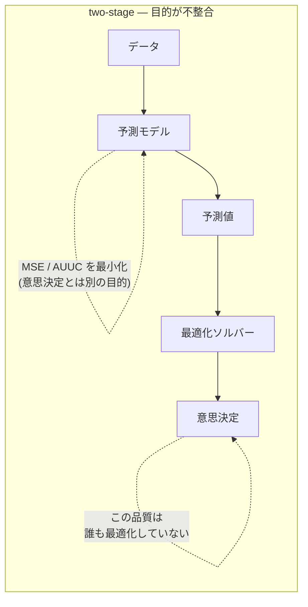
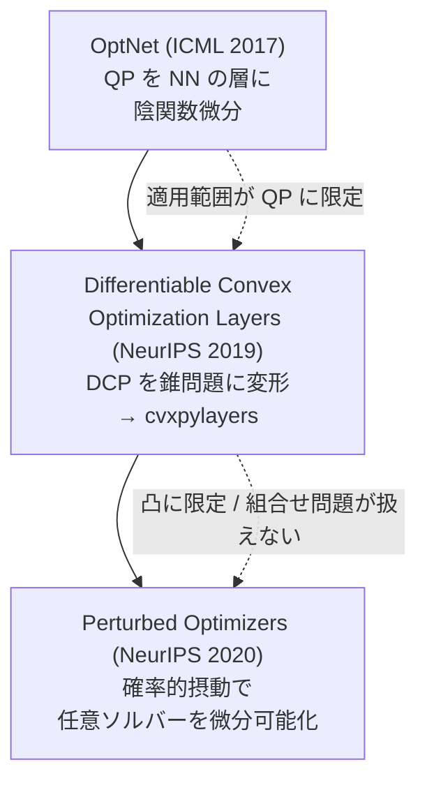
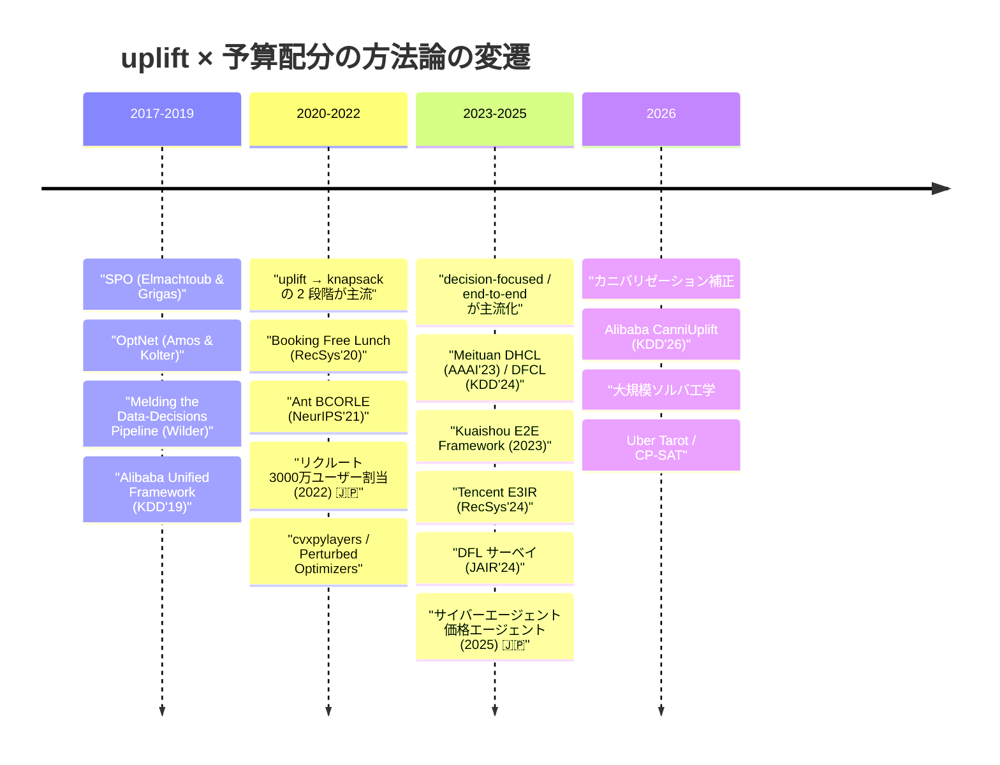

# two-stage から end-to-end へ

本クラスタで観測される**最強の方法論的潮流**が、two-stage（予測してから最適化する）から end-to-end（意思決定品質を直接最適化する）への移行である。2023-25 の産業論文（Meituan DFCL / DHCL、Tencent E3IR、Kuaishou）はほぼ例外なくこの旗のもとに書かれている。

## 1. 問題設定 — 二段階構成の根本問題

標準的な構成は「① CATE を推定する → ② 推定値を入力にナップサックを解く」という二段階である（[02](./02-budget-constrained-allocation.md) パターン②、[01](./01-production-cases.md) の日本の標準構成）。

この構成の根本問題は一文で言える。

> **予測精度の向上が、最終的な意思決定品質の改善に繋がらない。**

予測モデルは MSE や AUUC を最小化するが、**下流の最適化はその誤差に一様に反応しない**。ナップサックの解に影響しない領域の予測誤差はいくら小さくしても無駄で、逆に閾値近傍のわずかな誤差が解を大きく変える。予測誤差の分布と意思決定損失の分布が一致しないため、**予測を良くしても決定が良くなる保証がない**。

この不整合は本クラスタの複数の事例で明示的に問題視されている。Kuaishou の [End-to-End Framework for Marketing Effectiveness Optimization](https://arxiv.org/abs/2302.04477)（2023）は「**2段階の目的不整合を回避**」することを明示的な貢献として掲げ、数億ユーザーの短編動画プラットフォームに展開している。Meituan の [DHCL](https://arxiv.org/abs/2211.15728)（AAAI 2023）は「**decision factor で ML と OR を架橋**」すると表現する。

そして [01](./01-production-cases.md) の ZOZO の否定的結果——**5万サンプル・効果50%でも RMSE/ATE ≈ 0.7**——は、この潮流を裏側から支持している。**予測精度に天井があるなら、予測精度を目的にすること自体が誤り**という論法が成立するからだ。

## 2. 起点 — SPO (Smart "Predict, then Optimize")

| 文献 | 著者 / 発表先 | 要点 |
|------|-------------|------|
| [Smart "Predict, then Optimize" (SPO)](https://arxiv.org/abs/1710.08005) | **Elmachtoub & Grigas** / Management Science 2022 | **この分野の起点**。SPO 損失と凸代理損失 **SPO+** |
| [Generalization Bounds in the Predict-then-Optimize Framework](https://arxiv.org/abs/1905.11488) | — | SPO 損失の汎化誤差限界 |

SPO の核心は、**予測誤差ではなく「その予測を使って下した決定が最適解からどれだけ劣るか」を損失として定義する**ことにある。これが **SPO 損失**である。

ただし SPO 損失は最適化問題の解を経由するため**非凸・不連続**で、そのままでは勾配法で学習できない。この障害に対する解が **SPO+**——SPO 損失の**凸代理損失**であり、劣勾配を計算できる。この「意思決定損失を定義する → 微分可能な代理を作る」という二段構えが、以降のすべての手法の雛形になった。

Management Science 2022 という掲載先が示す通り、SPO はオペレーションズ・リサーチ側から出てきた仕事である。機械学習側から独立に近い問題意識が現れたのが次節の Wilder et al. で、両者が合流して decision-focused learning (DFL) という呼称に収斂した。

## 3. 入口としての DFL サーベイ

| 文献 | 著者 / 発表先 | 要点 |
|------|-------------|------|
| [Decision-Focused Learning: Foundations, State of the Art, Benchmark](https://arxiv.org/abs/2307.13565) | **Mandi et al.** / JAIR 2024 | **DFL の決定版サーベイ**。**7問題 × 11手法の大規模実証比較**。**この分野の入口として最適** |
| [Melding the Data-Decisions Pipeline](https://arxiv.org/abs/1809.05504) | Wilder et al. / AAAI 2019 | 組合せ最適化への DFL の一般枠組み |

**この分野に入るなら Mandi et al. の JAIR 2024 サーベイから読むのが最も効率的**である。理由は 3 点。

1. **7 問題 × 11 手法の実証比較**を含む。手法の羅列だけでなく、どの手法がどの問題で効くかのベンチマークがある。DFL は手法が乱立しており、比較軸なしに個別論文を読むと迷う。
2. **JAIR（査読誌）掲載**で、arXiv プレプリントの寄せ集めより信頼性が高い。
3. 2024 年時点の state of the art を押さえており、本クラスタの産業実装（DFCL 2024、E3IR 2024）とほぼ同時期。

## 4. 微分可能最適化層の系譜

end-to-end 化の技術的中核は、**最適化問題をニューラルネットの「層」として埋め込み、その解について微分する**ことである。3 つの世代がある。

| 世代 | 文献 | 著者 / 発表先 | 要点 | 限界 |
|------|------|-------------|------|------|
| 1 | [OptNet: Differentiable Optimization as a Layer in Neural Networks](https://arxiv.org/abs/1703.00443) | **Amos & Kolter** / ICML 2017 | **QP を NN の層として埋め込み**。KKT 条件に**陰関数微分**を適用して解の勾配を得る | QP に限定 |
| 2 | [Differentiable Convex Optimization Layers](https://arxiv.org/abs/1910.12430) | **Agrawal et al.** / NeurIPS 2019 | **DCP（Disciplined Convex Programming）を錐問題に変形**し汎用的に微分可能化 | 凸問題に限定 |
| 2' | [cvxpylayers](https://github.com/cvxpy/cvxpylayers) | — | 上記の実装。**CVXPY で書いた凸問題をそのまま微分可能層として利用可能** | — |
| 3 | [Learning with Differentiable Perturbed Optimizers](https://arxiv.org/abs/2002.08676) | **Berthet et al.** / NeurIPS 2020 | **確率的摂動で任意のソルバーを微分可能化**。入力にノイズを加えて期待値を取ると滑らかになる | 摂動サンプリングのコスト |

系譜の論理は明快である。**OptNet は QP という狭い範囲で陰関数微分が使えることを示し、DCO layers はそれを凸全般に広げ（cvxpylayers という実装を伴って実用化し）、Perturbed Optimizers は凸性の要求すら捨てて任意のソルバーを対象にした**。整数計画やナップサックのような組合せ問題を扱うには第 3 世代の発想が要る。

実装の観点では、**cvxpylayers が最も敷居が低い**。CVXPY で問題を書けばそのまま PyTorch の層になる。[04](./04-oss-status-and-corrections.md) で述べる通り、uplift 専用 OSS が軒並み保守停止している状況下で、**causalml/econml + cvxpylayers という自前構成**が現実的な選択肢になる理由でもある。

## 5. 産業側の実装

学術側の枠組みが、中国系スーパーアプリで実際に本番投入されている。

| 実装 | 企業 / 発表先 | 手法の要点 |
|------|-------------|----------|
| **DFCL** (Decision Focused Causal Learning) | **Meituan** / **KDD 2024 本会議** | **0-1 整数確率計画を DFL で end-to-end 化**。**decision-focused loss** を定義し、**ソルバ呼び出しコストを削減する代理損失**を導入 |
| **E3IR** (End-to-End Cost-Effective Incentive Recommendation) | **Tencent (FiT)** / RecSys 2024 | **MCKP に単調・平滑な応答曲線制約** + **ILP を微分可能層として統合** |
| **DHCL** (Direct Heterogeneous Causal Learning) | **Meituan** / AAAI 2023 | **decision factor** で ML と OR を架橋し、**ソート/比較のみで解を得る**。⚠️ **Alibaba ではなく Meituan** |
| **End-to-End Framework for Marketing Effectiveness Optimization** ([2302.04477](https://arxiv.org/abs/2302.04477)) | **Kuaishou** / 2023 | 2段階の目的不整合を回避。数億ユーザーの短編動画プラットフォームに展開。⚠️ **Alibaba 帰属は誤り** |
| **Bi-Level Decision-Focused Causal Learning** ([2510.19517](https://arxiv.org/abs/2510.19517)) | **Meituan 系** / 2025 | 観測データと実験データを橋渡しする**二層 DFL**。DFCL の後続 |
| **RERUM** ([PDF](https://xingt-tang.github.io/assets/pdf/rerum_kdd24.pdf)) | **Tencent (FiT)** / KDD 2024 | E3IR と同一グループの実運用ライン。rankability を強化 |

### 5.1 DFCL — 代理損失でソルバ呼び出しを減らす

[DFCL](https://arxiv.org/abs/2407.13664)（Meituan、KDD 2024 本会議）は、0-1 整数確率計画を DFL で end-to-end 化する。**KDD 本会議採択は本クラスタの end-to-end 系では最も強い査読通過**である。

実務的に重要な貢献は **decision-focused loss の代理損失によるソルバ呼び出しコストの削減**にある。DFL の素朴な実装は、学習の各ステップで最適化問題を解いて勾配を得る必要があり、これが計算コストの支配項になる。DFCL はソルバを呼ばずに済む代理損失を設計してこれを回避した。

**DFL の実用化における最大のボトルネックが「学習中のソルバ呼び出し」である**という認識は、この分野を評価する上で重要な視点になる。理論的に美しい手法でも、学習が回らなければ本番に載らない。

### 5.2 DHCL — ソルバーを消す方向の解

[DHCL](https://arxiv.org/abs/2211.15728)（Meituan、AAAI 2023）は逆方向の解を採る。**decision factor** という量を定義し、それでソートして上から取るだけで最適解が得られる構造を作った。**ソート/比較のみで解が得られる**なら、そもそもソルバーが不要になる。

DFCL が「ソルバ呼び出しを代理損失で減らす」のに対し、DHCL は「ソルバ自体を消す」。両者が同じ Meituan の同一グループ（著者 Zhou/Li/Jiang）から出ている点は、**この問題がいかに実務上重いかを示している**。

### 5.3 E3IR — 応答曲線の形状制約

[E3IR](https://arxiv.org/abs/2408.11623)（Tencent FiT、RecSys 2024）は **MCKP に単調・平滑な応答曲線制約**を課した上で、**ILP を微分可能層として統合**する。[02](./02-budget-constrained-allocation.md) で述べた MCKP 定式化と、本レポートの微分可能最適化層が**直接接続する点**がここである。

「クーポン額を増やせば効果は単調に増える（が逓減する）」という形状制約は、ドメイン知識を最適化に注入する手段であると同時に、**推定の不安定さを抑える正則化としても働く**。[01](./01-production-cases.md) のサイバーエージェントの「クリエイティブ3本で AUUC が負」のような病理は、形状制約があれば起きにくい。

## 6. 時系列で見る潮流

| 期間 | 主流 | 代表事例 |
|------|------|---------|
| **2020-22** | **「uplift → knapsack」の2段階** | Booking（Free Lunch, RecSys'20）、Ant（BCORLE, NeurIPS'21）、リクルート 🇯🇵（2022） |
| **2023-25** | **decision-focused / end-to-end の主流化** | Meituan DFCL / DHCL、Tencent E3IR、Kuaishou 2302.04477 |
| **2026** | **カニバリゼーション補正 + 大規模ソルバ工学** | Alibaba CanniUplift（増分 GMV +4.08%）、Uber Tarot（CP-SAT、予算消化率 99.99%） |

### 6.1 日本も同じ経路を辿った

日本の公開事例も同じ経路上にある。ただし数年遅れる。

| 期間 | 日本の状況 🇯🇵 |
|------|-------------|
| 2020-24 | **2段パイプラインが標準**。メルカリ INLP、LINEヤフー ACPA、リクルート 0/1 割当、ZOZO、エムスリー t-learner |
| 2025 | **商用ソリューション化に到達** — サイバーエージェント「価格エージェント」（AI×経済学、**クーポン原資を最大 70% 削減**） |

**2025 年の価格エージェント（#45）が日本における到達点**である。海外の end-to-end 論文が 2023-24 に集中していることを踏まえると、研究から商用化まで 1-2 年程度のラグということになる。

### 6.2 2026 年の 2 つの論点

潮流は end-to-end で終わらない。2026 年の 2 本は、それぞれ別の方向に問題を広げている。

- **カニバリゼーション補正** — [CanniUplift](https://arxiv.org/abs/2607.05242)（Alibaba Taobao & Tmall、KDD 2026）は seller/incentive レベルのカニバリを分離し、**本番 baseline 比で増分 GMV +4.08%**。「この施策の効果」を測るとき、他の施策や他の出品者から奪っただけの分を除く必要があるという問題提起。end-to-end 化とは直交する論点で、**効果の定義そのものを問い直している**。
- **大規模ソルバ工学** — Uber Tarot は end-to-end ではなく、**素直な 2 段階のまま配分ソルバーを CP-SAT に替えることで予算消化率 68% → 99.99%** を達成した（[02](./02-budget-constrained-allocation.md)）。これは**「end-to-end が唯一の道ではない」ことの強力な反証**である。

## 7. 本ユースケースへの含意

1. **潮流としては end-to-end が主流だが、それが本ユースケースの第一選択とは限らない**。Uber Tarot（2026）は 2 段階のままソルバーを替えるだけで予算消化率 31 ポイント改善を得た。**end-to-end の複雑さを引き受ける前に、2 段階構成のソルバー側に伸びしろがないかを確認するのが順序として正しい**。
2. **入口は [DFL サーベイ（JAIR 2024）](https://arxiv.org/abs/2307.13565)**。7問題×11手法の比較があり、個別論文を読み漁る前にここで地図を得るべき。
3. **end-to-end に踏み込むなら cvxpylayers から**。[04](./04-oss-status-and-corrections.md) の通り uplift 専用 OSS は保守停止しており、causalml/econml + cvxpylayers という自前構成が現実解。
4. **学習中のソルバ呼び出しコストが最大のボトルネック**という DFCL の認識を、手法評価の軸に持つこと。
5. **応答曲線の単調・平滑制約（E3IR）はコストが低く効果が高い**。クーポン額に対する効果は単調逓減するというドメイン知識は、多くの場面で妥当で、推定の不安定さを抑える。
6. **カニバリゼーションは 2026 年の新しい論点**。効果測定の設計時に、他施策からの奪い合いを分離できるかを検討する価値がある。
