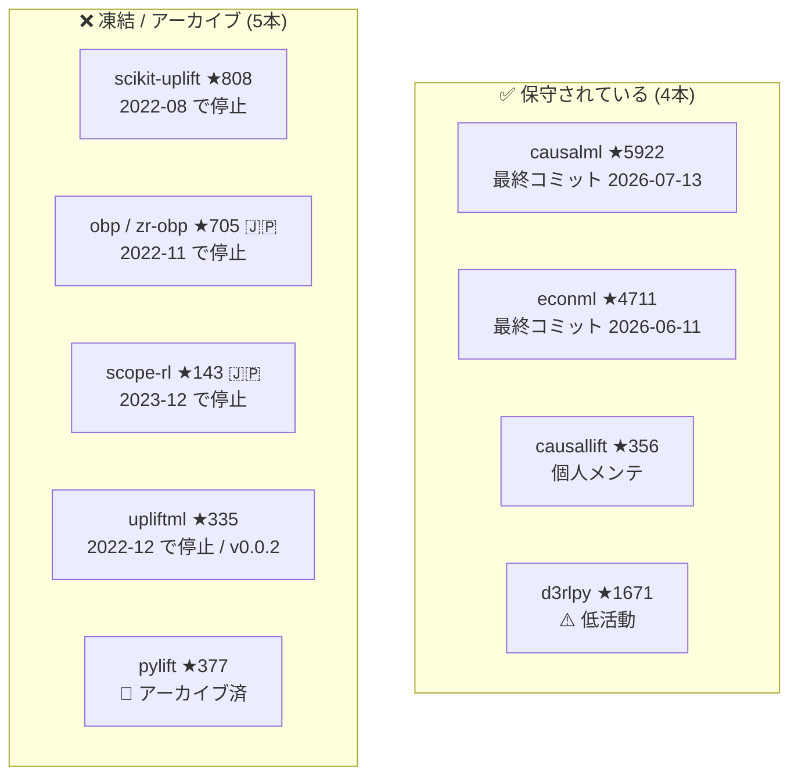
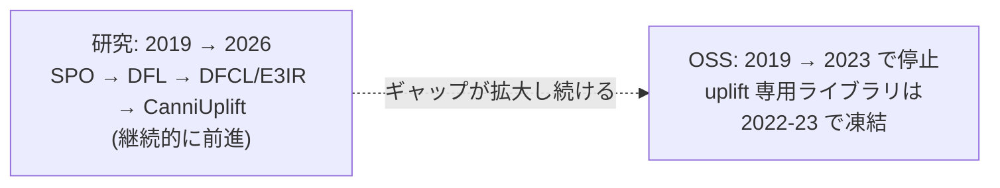
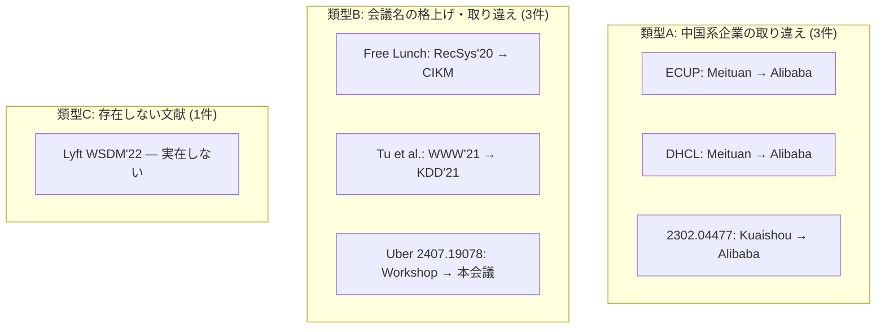

# OSS 保守状況と誤帰属の訂正

本レポートは 2 つの独立した主題を扱う。

1. **OSS 保守状況の実測** — PyPI JSON API と GitHub API による 2026-07-15 時点の実測値。記憶ベースではない
2. **⚠️ 誤帰属・誤引用の訂正 7 件** — 本調査で検出した、巷間よく引用される誤り

両者に共通するのは、**二次情報を信じると誤る**という教訓である。OSS の側では `pushed_at` という指標が実態を誤って伝え、論文の側では帰属と会議名が広く誤って流通している。

## 1. OSS 保守状況（実測値）

**すべて PyPI JSON API と GitHub API で 2026-07-15 に実測**した。最終コミット日は GitHub の `/commits` エンドポイントで取得している。

| ライブラリ | 版 | 最終リリース | 最終コミット | ★ | 状態 |
|-----------|-----|------------|------------|---|------|
| **causalml** (uber/causalml) | 0.17.0 | 2026-07-04 | **2026-07-13** | 5,922 | ✅ **活発**。本領域で最も健全 |
| **econml** (py-why/EconML) | 0.16.0 | 2025-07-10 | **2026-06-11** | 4,711 | ✅ **活発**（リリースは1年空くがコミットは継続） |
| causallift (Minyus/causallift) | 1.1.0 | 2026-04-12 | 2026-04-15 | 356 | ✅ 活発（小規模・個人メンテ） |
| d3rlpy (takuseno/d3rlpy) | 2.8.1 | 2025-03-02 | 2025-09-10 | 1,671 | ⚠️ 低活動（最終コミットから約10ヶ月） |
| scikit-uplift (maks-sh/scikit-uplift) | 0.5.1 | 2022-08-11 | **2022-08-11** | 808 | ❌ **事実上停止**（約4年、未 archive） |
| **obp / zr-obp** (st-tech/zr-obp) 🇯🇵 | 0.5.7 | 2023-04-14 | **2022-11-05** | 705 | ❌ **事実上停止**（約3.7年）。⚠️ pushed_at 2024-06 は誤誘導 |
| scope-rl (hakuhodo-technologies/scope-rl) 🇯🇵 | 0.2.1 | 2023-07-30 | **2023-12-01** | 143 | ❌ **事実上停止**（約2.6年） |
| upliftml (bookingcom/upliftml) | 0.0.2 | 2022-11-22 | **2022-12-20** | 335 | ❌ **事実上停止**（版は 0.0.2 のまま） |
| pylift (**wayfair/pylift**) | 0.1.5 | 2019-12-23 | 2022-10-28 | 377 | 🚫 **アーカイブ済み（read-only）** |

### 1.1 ⚠️ `pushed_at` は当てにならない

GitHub API の `pushed_at` フィールドは、**リポジトリの活性度の指標として広く使われているが、実態を反映しない**。

| 例 | `pushed_at` | **実際の最終コミット** | 乖離 |
|----|------------|---------------------|------|
| **obp / zr-obp** | 2024-06 | **2022-11-05** | **約1年7ヶ月** |

`pushed_at` は**タグ操作やブランチ操作でも更新される**ため、コードの変更がなくても新しい日付になる。obp は pushed_at だけを見れば 2024 年半ばまで動いていたように見えるが、**コードの最終変更は 2022 年 11 月**である。

> **保守状況を判断するときは `/commits` エンドポイントを見ること。** `pushed_at` を根拠にライブラリを選定すると、**2 年近く止まっているプロジェクトを「メンテされている」と誤認する**。

### 1.2 ⚠️ pylift の PyPI Homepage は存在しないリポジトリを指す

pylift の PyPI メタデータの `Homepage` は `github.com/pylift/pylift` を指すが、**このリポジトリは存在しない（GitHub API が 404 を返す）**。

**実体は [wayfair/pylift](https://github.com/wayfair/pylift)**（★377、**archived / read-only**）。出自は Wayfair の技術ブログ [Building Scalable and Performant Marketing ML Systems at Wayfair](https://www.aboutwayfair.com/careers/tech-blog/building-scalable-and-performant-marketing-ml-systems-at-wayfair)（[01](./01-production-cases.md) #35）である。

パッケージのメタデータですら誤っているという事実は、**一次情報にあたることの必要性**を端的に示している。

## 2. エコシステムの二極化

エコシステムは明確に二極化している。

| 分類 | ライブラリ | 特徴 |
|------|----------|------|
| **保守されている汎用因果推論ライブラリ** | causalml, econml, (causallift, d3rlpy) | 大企業/組織バックの汎用ライブラリ |
| **凍結したリファレンス実装** | **OBP, SCOPE-RL, scikit-uplift, pylift, UpliftML** | 論文の付随実装。論文が出た後にメンテが止まる |

**リファレンス実装（OBP, SCOPE-RL, scikit-uplift, pylift, UpliftML）は 2022-23 で凍結し、保守されているのは causalml / econml / d3rlpy / causallift のみ**である。

### 2.1 研究の産出速度がソフトウェア保守を大きく上回っている

これが本節の中心的な観察である。[03](./03-end-to-end-trend.md) で見た通り、2023-25 に decision-focused / end-to-end の産業論文が次々に出ている（DFCL, DHCL, E3IR, Kuaishou, Bi-Level DFL）。2026 年にも CanniUplift が出ている。**手法は前進し続けている**。

一方で、**その手法を実装した OSS はほぼ存在しない**。DFCL にも E3IR にも DHCL にも、広く使われている OSS 実装はない。凍結した 5 本のライブラリが実装しているのは 2022 年頃までの手法である。

**論文を読んで「良さそうだ」と思った手法が、pip install できないのが常態**である。この構造的なギャップを前提に技術選定をしなければならない。

### 2.2 実運用で採用可能なのは実質 causalml と econml の2本のみ

| ライブラリ | 採否 | 理由 |
|----------|------|------|
| **causalml** | ✅ 採用可 | ★5,922、最終コミット 2026-07-13、最終リリース 2026-07-04。**本領域で最も健全** |
| **econml** | ✅ 採用可 | ★4,711、最終コミット 2026-06-11。リリース間隔は空くがコミットは継続 |
| causallift | △ 慎重に | ★356、活発だが**小規模・個人メンテ**。バス係数 1 のリスク |
| d3rlpy | △ 慎重に | ★1,671 だが**最終コミットから約10ヶ月**の低活動 |
| scikit-uplift / obp / scope-rl / upliftml / pylift | ❌ 新規採用不可 | 停止またはアーカイブ済 |

**この帰結として、構成は necessarily 次に収斂する。**

> **causalml / econml + 自前の最適化層（CP-SAT / cvxpylayers）**

これは消極的な選択ではなく、**他に選択肢がない**という意味での必然である。

- **CATE 推定**は causalml または econml で足りる。この 2 本は meta-learner（S/T/X/R-learner）、DML、Causal Forest を実装しており、[01](./01-production-cases.md) の日本の標準構成（2段パイプラインの Stage 1）はこれで組める。ZOZO の実験（Linear DML が S-Learner の MSE 7.3%）も econml/causalml の範囲内の手法比較である。
- **最適化層**は OSS の uplift ライブラリには存在しないので自前で書く。[02](./02-budget-constrained-allocation.md) の結論通りバッチ配分ならナップサック/整数計画を **CP-SAT（OR-Tools）** で解くのが第一候補。end-to-end に踏み込むなら **cvxpylayers**（[03](./03-end-to-end-trend.md)）。

この構成は、**Uber Tarot が CP-SAT を採用した事実**（[02](./02-budget-constrained-allocation.md)、HiGHS 24時間超 → 数分）と**cvxpylayers が Differentiable Convex Optimization Layers の公式実装である事実**（[03](./03-end-to-end-trend.md)）によって裏付けられる。**OSS の空洞化が、たまたま最も筋の良い構成を強制している**とも言える。

### 2.3 OBP — 異常に価値のある孤児

[Open Bandit Dataset and Pipeline](https://arxiv.org/abs/2008.07146)（ZOZO研究所 🇯🇵、NeurIPS 2021 D&B Track）に付随する **obp / zr-obp** は特別扱いを要する。

| 項目 | 内容 |
|------|------|
| 状態 | ❌ **事実上停止**（最終コミット **2022-11-05**、約3.7年） |
| ライセンス | **Apache-2.0** |
| アーカイブ | **されていない**（read-only ではない） |
| ★ | 705 |
| 固有価値 | **MIPS・multi-logger・slate・SLOPE++ を一箇所に実装した唯一の存在** |

**OBP は Apache-2.0・未アーカイブでありながら、MIPS・multi-logger・slate・SLOPE++ を一箇所に実装した唯一の存在＝異常に価値のある孤児**である。

この組み合わせは他のどのライブラリにもない。停止しているが、以下の意味で扱いが特殊になる。

- **Apache-2.0 かつ未アーカイブ** — fork して自前でメンテすることが法的にも技術的にも可能。アーカイブ済の pylift とはこの点で決定的に違う
- **代替がない** — causalml も econml も OPE の高度な手法（MIPS, SLOPE++）は実装していない
- **データセットとしての価値は不変** — 複数方策の A/B により収集された **2,600万件超**のログ、**実運用の方策実装まで同梱した世界初の公開データ**。この価値は保守停止で毀損しない

**OPE が必要ならば、OBP の fork とメンテを引き受ける覚悟が要る**。逆に OPE が不要なら（バッチ配分で A/B テストが打てるなら）この問題は回避できる。

### 2.4 d3rlpy ↔ SCOPE-RL の連携は壊れている可能性が高い

**SCOPE-RL**（hakuhodo-technologies/scope-rl 🇯🇵）は d3rlpy と連携してオフライン RL の評価を行う設計である。しかし両者の時間軸が乖離している。

| | SCOPE-RL | d3rlpy |
|---|---|---|
| 最終コミット | **2023-12-01** | **2025-09-10** |
| 版 | 0.2.1（2023-07-30） | 2.8.1（2025-03-02） |
| 前提環境 | **2023年中頃の d3rlpy 2.x** に固定 | **PyTorch ≥ 2.5 へ移行済み** |

**SCOPE-RL は 2023 年中頃の d3rlpy 2.x 時代に凍結しており、d3rlpy はその後 PyTorch ≥ 2.5 へ移行している。両者の連携が現在も動作する保証はなく、壊れている可能性が高い**。

[01](./01-production-cases.md) の Ant Group（BCORLE、Offline Constrained Deep RL）のようなオフライン RL アプローチを検討するなら、この点は事前に検証が要る。**そして [02](./02-budget-constrained-allocation.md) の結論通り、バッチ配分ユースケースではそもそもオフライン RL は不要**であり、この問題も回避できる。

## 3. ⚠️ 誤帰属・誤引用の訂正

**本調査で検出した誤り 7 件**。いずれも二次情報で広く流通しているものである。**引用前に必ず確認すること。**

| # | よくある誤り | 正しい情報 |
|---|------------|----------|
| 1 | **ECUP ([2402.03379](https://arxiv.org/abs/2402.03379)) を Alibaba とする** | **Meituan（美団）**。WWW'24 Companion。さらに **arXiv v2 は 2026-01-23 に取り下げ済み**で PDF 入手不可 |
| 2 | **DHCL ([2211.15728](https://arxiv.org/abs/2211.15728)) を Alibaba とする** | **Meituan**。著者 Zhou/Li/Jiang は DFCL と同一グループ |
| 3 | **[arXiv:2302.04477](https://arxiv.org/abs/2302.04477) を Alibaba とする** | **Kuaishou（快手）**。著者 Guorui Zhou / Peng Jiang は Kuaishou の中核研究者 |
| 4 | **Booking「Free Lunch!」([2008.06293](https://arxiv.org/abs/2008.06293)) を CIKM とする** | **RecSys 2020** が正。ただし **CIKM'22 の Booking 論文（[2108.13298](https://arxiv.org/abs/2108.13298)）が別途実在**するため混同の温床 |
| 5 | **「Lyft WSDM'22 のインセンティブ論文」** | **存在しない**。実体は [Gurobi 事例](https://www.gurobi.com/case_studies/lyft-optimizing-driver-incentive-plans-and-adapting-to-market-changes/) + [INFORMS J. Applied Analytics 2021](https://arxiv.org/abs/2104.14740) |
| 6 | **Tu et al. ([1901.10550](https://arxiv.org/abs/1901.10550)) を KDD'21 とする** | **WWW 2021**（The Web Conference） |
| 7 | **Uber [2407.19078](https://arxiv.org/abs/2407.19078) を KDD'24 本会議とする** | **KDD 2024 Workshop**（CIML in Practice 2nd）。**本会議採択ではない** |

### 3.1 追加の訂正事項

| 対象 | 誤り | 正しい情報 |
|------|------|----------|
| **LBCF** ([2201.12585](https://arxiv.org/abs/2201.12585)) | "**Lagrangian** Budget-Constrained Causal Forest" | 正式名は "**Large-Scale** Budget-Constrained Causal Forest" |
| **Dual Mirror Descent** | arXiv:2002.10421 | **取り下げ済み**。[arXiv:2011.10124](https://arxiv.org/abs/2011.10124) が正（Balseiro/Lu/Mirrokni、Operations Research 2023） |
| 🇯🇵 **メルカリ RIETI DP 22-E-097** | クーポン最適化の論文として引用 | **主題は OPE 手法**でクーポンは応用事例。査読版は AAAI 2023 |
| 🇯🇵 **ZOZO クーポン推薦モデル改善** | uplift 事例として引用 | **uplift ではなく Two-Stage Recommender**（売上 124.69% はこの手法の成果） |

### 3.2 誤りの類型と、それが生まれる構造

7 件の誤りは無作為ではなく、明確な類型を持つ。

| 類型 | 件数 | 生まれる構造 |
|------|------|------------|
| **A: 中国系企業の取り違え** | 3 | **すべて「Alibaba にされる」方向**。Alibaba が [KDD 2019 の古典](https://arxiv.org/abs/1902.01128) を出しているため、**この領域の中国系論文＝Alibaba という連想が働く**。実際には Meituan と Kuaishou が主力 |
| **B: 会議名の格上げ・取り違え** | 3 | **すべて「格上げ」方向**（RecSys→CIKM、WWW→KDD、Workshop→本会議）。**引用者が権威づけを好む方向にバイアスする**。Booking は RecSys'20 と CIKM'22 の両方に論文があるため混同の温床が実在する |
| **C: 存在しない文献** | 1 | Lyft の Gurobi 事例と INFORMS 論文が実在するため、**「Lyft にもインセンティブ論文があるはず」という推論から生成された**と見られる |

### 3.3 二次情報の帰属を信じる危険

この 7 件が示すのは、**サーベイ・ブログ・LLM の出力といった二次情報の帰属情報が、系統的にバイアスされている**という事実である。

誤りには方向性がある。ランダムなノイズなら訂正の必要も薄いが、**類型 A は「Alibaba へ」、類型 B は「より権威ある会議へ」と一方向に偏っている**。これは伝言ゲームの過程で「もっともらしい方向」に丸められた結果と読める。そして**もっともらしいがゆえに、読み手も違和感を持たない**。

実務上の危険は 3 段階ある。

1. **文献にたどり着けない** — 「Lyft WSDM'22」を探しても見つからない。存在しないので当然だが、**自分の検索能力の問題だと誤解して時間を溶かす**
2. **技術的判断を誤る** — ECUP と DHCL を Alibaba のものだと思っていると、**Meituan が decision-focused の系譜を一貫して主導している**という重要な構図が見えなくなる。DFCL・DHCL・HRC・Bi-Level DFL がすべて Meituan であることは、[03](./03-end-to-end-trend.md) の潮流理解の中核である
3. **信頼を失う** — 社外資料に「Uber, KDD 2024」と書いて、実は Workshop だったと指摘される。**Workshop 論文と本会議論文は査読の厳しさが違う**ため、証拠としての重みも違う

さらに **ECUP の arXiv v2 が 2026-01-23 に取り下げ済み**という事実は別種の警告である。**引用したい論文が撤回されている可能性を、arXiv のページで確認する必要がある**。二次情報は撤回を追跡しない。

### 3.4 実務的なチェックリスト

| 確認項目 | 方法 |
|---------|------|
| 帰属（企業・機関） | **arXiv の著者所属を直接見る**。二次情報を信じない |
| 会議名 | **arXiv のコメント欄 / 論文 PDF の脚注**。「格上げ」方向の誤りを疑う |
| 本会議 vs Workshop | **論文 PDF の冒頭**。Workshop は明記されている |
| 撤回の有無 | **arXiv のページ**（withdrawn 表記） |
| OSS の活性度 | **GitHub `/commits` エンドポイント**。`pushed_at` は使わない |
| OSS のリポジトリ実体 | **PyPI の Homepage を信じない**（pylift の例） |

## 4. 本レポートからの実務的含意

1. **技術選定は causalml / econml の 2 本に絞ってよい**。他の uplift 専用 OSS は停止またはアーカイブ済で、新規採用の理由がない。
2. **最適化層は自前で書く前提で計画する**。OSS には存在しない。CP-SAT（バッチ配分の第一候補）または cvxpylayers（end-to-end 用）。
3. **論文の手法が pip install できることを期待しない**。研究の産出速度が保守を大きく上回っており、DFCL / E3IR / DHCL のいずれにも広く使われる実装はない。
4. **OPE が要るなら OBP の fork を覚悟する**。Apache-2.0・未アーカイブなので可能だが、メンテのコストは自社持ち。MIPS・multi-logger・slate・SLOPE++ の代替は存在しない。
5. **オフライン RL は避けられるなら避ける**。d3rlpy ↔ SCOPE-RL の連携が壊れている可能性が高く、バッチ配分では [02](./02-budget-constrained-allocation.md) の通りそもそも不要。
6. **`pushed_at` でライブラリを評価しない**。obp の例（pushed_at 2024-06 / 実際 2022-11）は 1 年 7 ヶ月の乖離。
7. **社外・社内資料に引用する前に、必ず本レポートの訂正表を確認する**。特に「Alibaba」と「KDD」の 2 語が出てきたら疑う。
