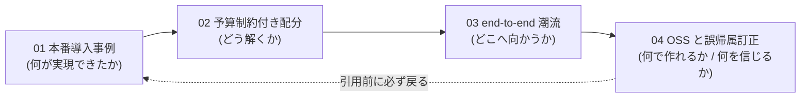

# industry_cases_budget — 詳細レポート索引

マーケティングにおけるクーポン/インセンティブ最適化の**本番導入事例**、**予算制約付き配分の方法論**、**two-stage → end-to-end の潮流**、**OSS 保守状況**に関する詳細レポート群。

> ## ⚠️ 引用前の必読事項
>
> 本調査では、**巷間よく引用される帰属・会議名の誤りを 7 件検出**した。ECUP / DHCL を Alibaba とする誤り（正しくは **Meituan**）、arXiv:2302.04477 を Alibaba とする誤り（正しくは **Kuaishou**）、Booking「Free Lunch!」を CIKM とする誤り（正しくは **RecSys 2020**）、**存在しない「Lyft WSDM'22」論文**、Tu et al. の KDD'21 誤記（正しくは **WWW 2021**）、Uber 2407.19078 の本会議誤記（正しくは **KDD 2024 Workshop**）。
>
> **本レポート群の内容を外部資料に引用する前に、必ず [04-oss-status-and-corrections.md](./04-oss-status-and-corrections.md) の「誤帰属・誤引用の訂正」節を確認すること。**

## レポート一覧

| # | ファイル | タイトル | 主題 | 核心的な数値・知見 |
|---|---------|---------|------|------------------|
| 01 | [01-production-cases.md](./01-production-cases.md) | 本番導入事例 — 定量的成果で読む | 中国系 / 欧米 / 日本 🇯🇵 の本番事例を地域別に整理。定量的成果と**逆向きの定量的知見**を併記 | Uber 予算消化率 68%→99.99% / サイバーエージェント クーポン原資 最大 70% 削減 / ⚠️ ZOZO RMSE/ATE≈0.7 |
| 02 | [02-budget-constrained-allocation.md](./02-budget-constrained-allocation.md) | 予算制約付き配分の3パターン | ①Lagrangian 双対 ②ナップサック/整数計画 ③凸最適化/ADMM の使い分け | Meituan LDM 50ms / Uber CP-SAT で 24h超→数分 / Ant 数十億決定変数 |
| 03 | [03-end-to-end-trend.md](./03-end-to-end-trend.md) | two-stage から end-to-end へ | SPO を起点とする decision-focused learning の系譜と産業実装 | DFL サーベイ 7問題×11手法 / DFCL・E3IR・DHCL |
| 04 | [04-oss-status-and-corrections.md](./04-oss-status-and-corrections.md) | OSS 保守状況と誤帰属の訂正 | PyPI/GitHub API 実測値による保守状況、⚠️ **誤帰属訂正 7 件** | 実運用可能なのは causalml / econml の 2 本のみ |

## 読み方の推奨順序

意思決定者は 01 の定量表と「逆向きの定量的知見」だけでも判断材料になる。実装者は 02 → 03 → 04 の順で読むとよい。

## 全体観のサマリ

- **手法の系譜**: 2020-22 は「uplift → knapsack」の 2 段階（Booking, Ant, リクルート）。2023-25 は **decision-focused / end-to-end**（DFCL, DHCL, E3IR, Kuaishou）が主流化。2026 は**カニバリゼーション補正**（CanniUplift）と**大規模ソルバ工学**（Uber CP-SAT）へ。日本も同じ経路を辿り、2025 年に商用ソリューション化（価格エージェント 🇯🇵）へ到達。
- **事例の偏在**: 公開事例は**中国系スーパーアプリと配車・旅行に集中**。Amazon（LORE 除く）/ eBay / Netflix / Spotify / Airbnb / Instacart / Zalando / Expedia / Shopee / Coupang / Naver / JD.com には該当領域の公開事例が見つからなかった。日本側でも楽天・PayPay 等は同様に該当なし。
- **OSS の空洞化**: 手法が end-to-end へ進む一方、**uplift 専用 OSS は軒並み保守停止**。実運用は **causalml / econml + 自前の最適化層**（CP-SAT / cvxpylayers）という構成に収斂せざるを得ない。

## パラメータ

| 項目 | 値 |
|------|-----|
| 生成日 | 2026-07-15 |
| ドメイン | `dataiku_uplift_ops` |
| クラスタ | `industry_cases_budget` |
| フェーズ | retrieval |
| 入力元 | `research/runs/dataiku_uplift_ops/gather/20260715/industry_cases_budget/resources-industry-cases-budget.md` |
| リソース数 | 69 |
| レポート数 | 4（+ 本索引） |
| OSS 保守状況の実測日 | 2026-07-15（PyPI JSON API + GitHub API） |
| 言語マーク | 🇯🇵 = 日本語ソース |
