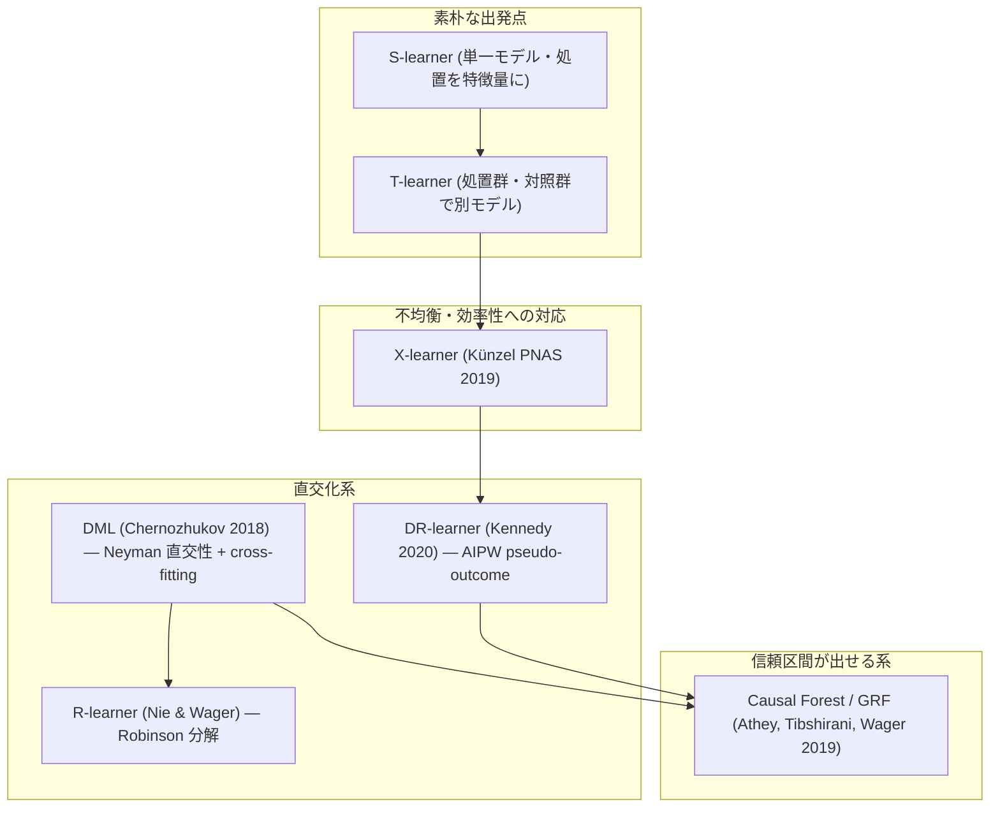

# Uplift / CATE の手法地図

## 概要

本レポートは、uplift modeling（施策の増分効果のモデリング）の中核をなす CATE（Conditional Average Treatment Effect, 条件付き平均処置効果）推定手法を整理する。対象は metalearner 群（S/T/X-learner、R-learner、DR-learner）、causal forest、DML（Double/Debiased Machine Learning）、および多値処置への拡張である。

本クラスタの読解順序では、これは **Step 1**（1週間）に位置する。ただし重要なのは、**Step 2 の「評価指標の地雷原」を Step 3 の OPE 実装より前に置く**という gather リストの最大の主張であり、本レポートで扱う手法選択の議論は、**その手法をどう評価するかという問題（03 のレポート）と切り離しては意味を持たない**。手法を作ってから指標を疑うと、作業がすべて無駄になる。

## 手法の全体像

## 1. Metalearners — S / T / X-learner

### 出典

**Metalearners for Estimating Heterogeneous Treatment Effects Using Machine Learning**（Künzel, Sekhon, Bickel, Yu, PNAS 2019）
<https://www.pnas.org/doi/10.1073/pnas.1804597116>

S/T/X-learner の原典であり、gather リストが「**まずここから**」と指定する起点である。

### 三者の関係

| learner | 構成 | 素朴さの代償 |
|---------|------|------------|
| S-learner | 処置変数を特徴量の一つとして単一モデルに投入し、T=1 と T=0 の予測差を CATE とする | 学習器が処置変数を無視しやすく、効果をゼロに縮小しがち |
| T-learner | 処置群・対照群でそれぞれ独立にアウトカムモデルを学習し、その差を CATE とする | 片方の群のサンプルが少ないと、その群のモデルの誤差がそのまま CATE に乗る |
| X-learner | T-learner の2モデルを使って各個体の imputed treatment effect を作り、それを再度回帰し、傾向スコアで重み付けして統合する | 手順が増える。3段階の推定誤差が重なる |

### X-learner がクーポン施策で効く理由

Künzel らの主張の核心は、**X-learner が処置群と対照群のサイズが不均衡なときに優位性を発揮する**という点にある。gather リストはこれを「**＝クーポン施策の典型**」と明示している。

なぜ不均衡が典型なのかは、実務の構造から説明できる。販促メールやクーポン配信では、

- 配信対象（処置群）は予算やビジネスルールで絞られる一方、対照群は残り全体になるため対照群が圧倒的に大きい
- 逆に、既存の配信オペレーションが全顧客に近い規模で回っており、ホールドアウト（対照群）だけが少数に抑えられている

のいずれかに寄る。どちらの向きでも不均衡は生じる。

X-learner が不均衡に強い機構は次の通りである。サンプルの多い群では高精度のアウトカムモデルが学習できる。X-learner はその**精度の高いモデルを使って、サンプルの少ない群の個体の反実仮想アウトカムを補完する**。そして最終的に2つの CATE 推定を傾向スコアで重み付け統合する際、**サンプルが少ない群側の推定に小さい重みが割り当たる**ように傾向スコアが自然に働く。T-learner はこの調整機構を持たないため、少数群のモデル誤差を等しく引きずる。

**実務上の含意**: 配信規模と対照群規模の比が大きく傾いている場合、T-learner を第一候補にする理由はほとんどない。X-learner を出発点に置くのが Künzel の推奨に沿う。

## 2. R-learner — Robinson 分解の ML 化

### 出典

**Quasi-Oracle Estimation of Heterogeneous Treatment Effects**（Nie & Wager, Biometrika 2021）
<https://arxiv.org/abs/1712.04912>

### 中身

R-learner は **Robinson 分解**（部分線形モデルにおける残差-残差回帰）を機械学習に持ち込んだ、直交化系 CATE の中核である。

考え方は、アウトカム Y と処置 T のそれぞれから、共変量 X で説明できる部分を先に取り除く（残差化する）というものである。残った Y の残差と T の残差の関係を回帰することで CATE を得る。この残差化により、**nuisance（撹乱）関数の推定誤差が CATE 推定に一次のオーダーで影響しない**という性質（＝直交性）が得られる。

「Quasi-Oracle」というタイトルは、nuisance が真値だと知っている理想的な推定量（oracle）に、実際の推定量が漸近的に近づくという主張を指す。

gather リストの評価は「**R-learner。Robinson 分解を ML に持ち込んだ直交化系 CATE の中核**」であり、読解順序上は「**X-learner で不足を感じてから**で十分」という位置づけになっている。

## 3. DR-learner — AIPW を pseudo-outcome にする

### 出典

**Optimal Doubly Robust Estimation of Heterogeneous Causal Effects**（Kennedy, 2020）
<https://arxiv.org/abs/2004.14497>

### 中身

DR-learner は、**AIPW（Augmented Inverse Propensity Weighting）式を pseudo-outcome として構成し、それを2段階目で共変量に回帰する**という設計である。

手順を分解すると、

1. アウトカムモデル（各処置群の回帰）と傾向スコアモデルを推定する
2. 各個体について AIPW 式を評価し、それを「その個体の処置効果の擬似観測値」（pseudo-outcome）とする
3. その pseudo-outcome を共変量 X に回帰する。得られた回帰関数が CATE 推定値

gather リストは「**理論保証が最も明快**」と評価している。二重にロバスト（アウトカムモデルか傾向スコアモデルのどちらかが正しければ一貫性がある）という性質と、pseudo-outcome という単純な構成が組み合わさるため、何が保証されているかが読み解きやすい。

読解順序上の位置づけは R-learner と同じく「X-learner で不足を感じてから」である。

> **注意**: この DR という概念は、02 のレポートで扱う OPE の DR 推定量と原理を共有する。しかし **Adyen の本番実測では DR は A/B とほぼ無相関**という結果が出ている。DR-learner（CATE 推定）と DR 推定量（方策評価）は目的が違うため直接同一視はできないが、「DR は理論的に優れるから使うべき」という推論を無検証で持ち込むことの危うさは共通する。

## 4. Causal Forest / GRF — CATE の信頼区間

### 出典

**Generalized Random Forests**（Athey, Tibshirani, Wager, Annals of Statistics 2019）
<https://arxiv.org/abs/1610.01271>

### 実務上の決定的な差

gather リストの評価は明快である。causal forest の原典であり、「**CATE の信頼区間が出せるのが実務上の決定的な差**」。

これがなぜ決定的かというと、他の metalearner 群は基本的に**点推定しか返さない**からである。点推定だけを見ていると、

- あるセグメントの CATE が 0.03、別のセグメントが 0.01 と出たとき、この差が実在するのかノイズなのか判別できない
- 「上位20%に配信」という閾値ルールを引くとき、その閾値の周辺で本当に効果が分かれているのか確認できない
- ステークホルダーに「この層に効きます」と説明するとき、その主張の不確実性を提示できない

信頼区間があれば、これらすべてが検証可能な主張になる。この点は 03 のレポートで扱う **RATE/TOC のブートストラップ標準誤差**の議論と直結する。評価指標側でも推定量側でも、「不確実性の定量化」が本クラスタの通奏低音である。

### honest splitting

GRF の統計的保証を支える中核機構が **honest splitting** である。データを二分し、**片方を木の分割構造（どの変数のどこで分けるか）の決定に、もう片方を各葉での効果推定に使う**。同じデータで分割を選び効果も推定すると、「効果が大きく見えた場所」を選んでその場所の効果を推定することになり、推定値が系統的に過大になる。honest splitting はこの選択バイアスを断ち切り、それによって漸近正規性と有効な信頼区間が得られる。

honest splitting はデータの半分しか各用途に使わないため、有限サンプルでの効率は犠牲になる。**信頼区間という保証を、サンプル効率で買っている**構造である。

## 5. DML — 裏側の原理

### 出典

**Double/Debiased Machine Learning for Treatment and Structural Parameters**（Chernozhukov et al., 2018）
<https://arxiv.org/abs/1608.00060>

### 中身

gather リストの評価は「**Neyman 直交性 + cross-fitting。causal forest / R-learner の裏側の原理**」である。

2つの構成要素がある。

| 要素 | 解決する問題 |
|------|------------|
| **Neyman 直交性** | nuisance 関数（傾向スコア、アウトカム回帰）の推定誤差が、関心のあるパラメータの推定に一次のオーダーで影響しないようモーメント条件を設計する |
| **cross-fitting** | nuisance の推定と目的パラメータの推定を別のサンプル分割で行い、ML 特有の正則化バイアス・過学習バイアスが目的パラメータに漏れるのを防ぐ |

この2つが揃って初めて、**任意の機械学習器を nuisance の推定に使いながら、目的パラメータについて √n-一貫性と正規漸近分布が得られる**。

R-learner の残差化も、GRF の honest splitting も、この枠組みの実装形態と見なせる。したがって DML を読むのは「個別手法を1つ増やす」ことではなく「**なぜあの手順が必要だったのかを理解する**」ことに当たる。gather の読解順序が「直交化の原理は DML」と、必要が生じたときの参照先として置いているのはこのためである。

## 6. 多値処置への拡張 — クーポン金額が複数段階という実務の実態

### 出典

**Comparison of meta-learners for estimating multi-valued treatment heterogeneous effects**
<https://arxiv.org/abs/2205.14714>

### なぜ重要か

gather リストはこれを「**多値処置（クーポン金額が複数段階＝実務の実態）**への metalearner 拡張」と位置づけている。

ここまでの metalearner の議論は、暗黙に**二値処置**（配信する／しない）を前提にしていた。しかし実際のクーポン施策は、

- 500円引き / 1000円引き / 2000円引き
- 送料無料 / 10%オフ / 20%オフ
- 複数のクリエイティブやメッセージ文面

といった**複数段階の処置**として設計される。この場合、「配信するか否か」ではなく「**誰にいくらのクーポンを出すか**」が意思決定になる。

多値処置は本クラスタの他の論点にも波及する。

- **02（OPE）への波及**: 行動空間が大きくなると IPS 系の重みの分散が爆発する。gather が MIPS を「**クーポン種類やクリエイティブが多数ある設定に直結**」と評価しているのはこのためである
- **03（評価指標）への波及**: AUUC/Qini は「処置するか否か」の順位付けを前提とする。金額が可変なら、uplift の順位付けだけでは意思決定にならない。gather の**対立4**（メルカリの「指標とビジネス目的の不一致」批判）が、まさにこの構造から生じる

## 7. 使い分けの判断材料

### 統一的な整理を与える文献

| 文献 | URL | 役割 |
|------|-----|------|
| Nonparametric Estimation of HTE: From Theory to Learning Algorithms（Curth & van der Schaar, AISTATS 2021） | <https://arxiv.org/abs/2101.10943> | metalearner 群を統一的に整理・比較。「どの learner をいつ使うか」の判断材料 |
| A Tutorial Introduction to HTE Estimation with Meta-learners | <https://pmc.ncbi.nlm.nih.gov/articles/PMC11379759/> | 査読付きチュートリアル。数式と実装の橋渡し |
| 21 - Meta Learners（Causal Inference for the Brave and True） | <https://matheusfacure.github.io/python-causality-handbook/21-Meta-Learners.html> | **実務家向け解説の決定版**。論文3本読む前にこれを読むと理解が速い |
| Chapter 23 Meta-Learners（Oxford APTS） | <https://www.stats.ox.ac.uk/~evans/APTS/meta-learners.html> | 講義ノート。ブログより厳密、論文より短い |
| 🇯🇵 施策は本当に効果があったのか──因果推論に学ぶアップリフトモデリング入門（GiXo） | <https://zenn.dev/gixo/articles/uplift-modeling-meta-learner-intro> | Brave and True 21章の日本語版として機能 |

### 判断軸の整理

gather リストと各文献の位置づけから読み取れる判断軸は次の通り。

| 状況 | 第一候補 | 根拠 |
|------|---------|------|
| 処置群・対照群が不均衡（クーポン施策の典型） | X-learner | Künzel PNAS 2019 の主張の核心 |
| CATE の信頼区間が必要（ステークホルダー説明、閾値の妥当性検証） | Causal Forest / GRF | 信頼区間が出せるのが実務上の決定的な差 |
| X-learner で不足を感じた | R-learner / DR-learner | gather 読解順序が明示的にこの条件を置いている |
| クーポン金額が複数段階 | 多値処置向け metalearner 比較（arXiv 2205.14714） | 二値処置前提の手法が素直に適用できない |
| 原理を理解したい / nuisance の扱いに迷う | DML | causal forest / R-learner の裏側の原理 |

### ライブラリの対応

| ライブラリ | URL | 手法カバレッジ |
|-----------|-----|--------------|
| causalml（Uber） | <https://github.com/uber/causalml> | AUUC・感度分析・解釈性・policy optimization。**uplift 実務の第一候補** |
| EconML（Microsoft） | <https://github.com/py-why/EconML> | DML・DR-learner・causal forest。**あえて Qini/AUUC を持たず**方策を直接学習・解釈する設計思想 |
| grf | <https://grf-labs.github.io/grf/reference/rank_average_treatment_effect.html> | GRF の本体（R）。RATE/TOC のリファレンス実装を含む |
| 🇯🇵 CausalLift | <https://github.com/Minyus/causallift> | Two Models アプローチ。小規模・教育用途向き |
| Uplifting with Decision Forests（TF-DF） | <https://www.tensorflow.org/decision_forests/tutorials/uplift_colab> | 実行可能な Colab |

EconML が**あえて Qini/AUUC を持たない**という設計思想は、03 のレポートで扱う評価指標批判と正面から結びつく。手法選択とその評価は、このクラスタでは分離できない。

## 8. 現実的な期待値 — ZOZO の否定的検証

### 何が報告されているか

🇯🇵 ZOZO の技術ブログ「Off-Policy Evaluation の基礎と ZOZOTOWN 大規模公開実データおよびパッケージ紹介」（齋藤優太）
<https://techblog.zozo.com/entry/openbanditproject>

および関連する日本の実務家コミュニティの検証において、uplift modeling の精度に対する否定的な結果が報告されている。gather が伝える要点は次の通りである。

| 条件 | 結果 |
|------|------|
| サンプル 5万 | RMSE/ATE ≈ 0.7 |
| 効果 50%（かなり大きい効果） | それでも RMSE/ATE ≈ 0.7 |
| 手法別 | **DML 系が最高精度** |

### この数字の読み方

RMSE/ATE ≈ 0.7 とは、**推定誤差の大きさが平均処置効果そのものの 0.7 倍ある**ということである。つまり、

- 5万サンプルという実務的には決して小さくない規模で
- 効果が 50% という、実務ではまず出ないほど大きい条件で

もなお、個体レベルの CATE 推定は**平均効果と同オーダーの誤差を抱える**。

これは uplift modeling を否定するものではない。しかし「CATE を精密に当てられる」という期待は、この数字と両立しない。**現実的に期待できるのは「点推定の精度」ではなく「粗い順位付け」までである**、という水準に期待値を合わせる必要がある。

### 他の論点との接続

この否定的検証は、本クラスタの他の議論と3つの点で噛み合う。

1. **GRF の信頼区間の価値が上がる**。点推定の誤差がこれほど大きいなら、点推定だけを見て意思決定するのは危険であり、信頼区間が「決定的な差」であるという gather の評価が数値的に裏付けられる

2. **03 の AUUC/Qini 批判の重みが増す**。CATE の点推定がこれほどノイジーなら、そのランキングを評価する指標もノイジーになる。Bokelmann & Lessmann の「**ランダムノイズによる恣意性**」という批判は、この数字と整合的である

3. **DML 系が最高精度**という結果は、gather の Step 1 が「直交化の原理は DML」と位置づけていることと呼応する。ただしこれは「DML を使えば精度が十分になる」という意味ではなく、「**最高精度の手法でも RMSE/ATE ≈ 0.7 だった**」という読み方が正しい

## まとめ

| 論点 | 結論 |
|------|------|
| 出発点 | Künzel PNAS 2019 の X-learner。処置群・対照群の不均衡＝クーポン施策の典型に効く |
| 信頼区間が必要なら | Causal Forest / GRF。honest splitting により有効な信頼区間が得られる |
| 原理 | DML（Neyman 直交性 + cross-fitting）が R-learner・causal forest の裏側 |
| 実務の実態 | クーポン金額が複数段階＝多値処置。二値処置前提の手法は素直に適用できない |
| 期待値 | 🇯🇵 ZOZO の検証では 5万サンプル・効果50%でも RMSE/ATE ≈ 0.7、DML 系が最高精度。点推定精度ではなく粗い順位付けまでを期待すべき |
| 次に読むべきもの | **03（評価指標の地雷原）を 02（OPE）より先に**。手法を作ってから指標を疑うと作業がすべて無駄になる |
