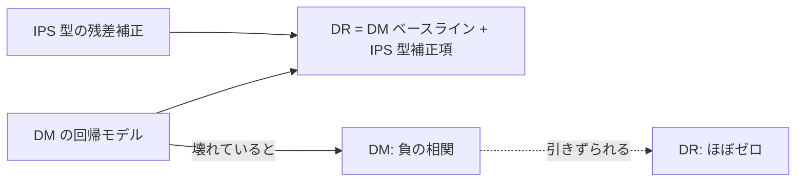
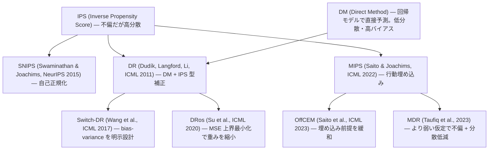
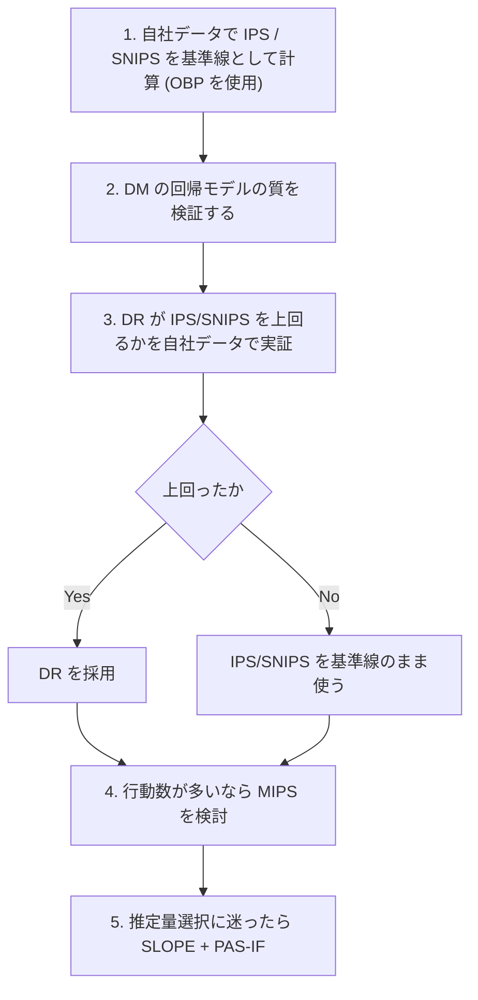

# Off-Policy Evaluation — 推定量の系譜と実務

## 概要

Off-Policy Evaluation（OPE, オフ方策評価）は、過去のログデータだけを使って「もし別の方策を回していたらどうなっていたか」を推定する技術である。A/B テストを回さずに候補方策を絞り込めるため、配信サイクルが数ヶ月おきという実務では価値が高い。

本レポートの中心は **Adyen 2025**（<https://arxiv.org/abs/2501.10470>）である。この論文は billion-scale の本番環境で OPE を実施し、**理論の推奨と正反対の結果**を報告した。この結果をどう読むかが、本レポート全体の軸になる。

読解順序上、これは **Step 3**（2〜3週間）に位置する。**Step 2（03 のレポート＝評価指標の地雷原）を先に踏むこと**が gather リストの最大の主張であり、この順序を入れ替えてはならない。

## 1. 中心 — Adyen 2025 の本番実測

### 出典

**Off-policy Evaluation for Payments at Adyen**（2025）
<https://arxiv.org/abs/2501.10470>

gather リストの評価は「**本クラスタの中心**。billion-scale の本番 OPE」。

### 報告された相関

Adyen は各 OPE 推定量の予測と、実際に実施した A/B テストの結果との相関を測定した。

| 推定量 | A/B テストとの相関 |
|--------|-----------------|
| **IPS** | **0.8 超** |
| **SNIPS** | **0.8 超** |
| **DM** | **負の相関** |
| **DR** | **ほぼゼロ** |

これは OPE の理論的推奨と**正反対**である。理論と大半の論文（DR 原典、DRos）は「DR 系が IPS より優れる」と言う。IPS は不偏だが高分散、DM は低分散だがバイアスあり、DR は両者を組み合わせて良いとこ取りする——これが教科書的な整理である。しかし本番実測では、最も素朴な IPS が最も A/B と一致し、DR は使い物にならなかった。

DM が**負の相関**であるという結果は特に重い。単にノイジーなのではなく、**DM が良いと言った方策ほど実際には悪かった**という意味になる。

### ⚠️ Adyen の検証範囲の限界

gather リストが「本リストの前提を覆す2つの発見」として最初に挙げているのがこの点である。

| 事前の想定 | 実際 |
|-----------|------|
| Adyen 論文は DRos / Switch-DR / MIPS / SLOPE++ を使っている | ❌ **IPS / SNIPS / DM / DR の4つのみ**。高度な推定量は未検証 |
| DR 系が IPS より優れる（理論的推奨） | ❌ Adyen の本番実測では**逆** |

**Adyen が検証したのは IPS / SNIPS / DM / DR の4つだけである。** DRos、Switch-DR、MIPS、SLOPE++ といった、まさにこの種の失敗を防ぐために設計された推定量は一つも使われていない。

したがって、この結果の正しい読み方は次のようになる。

> **「DR 系が本当にダメ」ではなく「素朴な DR を素朴に使うとダメ」**

これは gather リストが明示的に指示している解釈である。Adyen の結果を「DR は使うな」という一般命題に読み替えるのは、論文が検証していない範囲への過剰な外挿になる。

### なぜ DR が失敗したのか — 最も自然な解釈

**DR は DM を内包する**。DR 推定量は、DM の回帰モデルによる予測をベースラインとし、そこに IPS 型の補正項を加える構造をしている。

したがって、**DM の回帰モデルが壊れていれば DR もそれを引きずる**。Adyen で DM が負の相関だったという事実と、DR がほぼゼロだったという事実は、この機構で一貫して説明できる。DR は「DM が悪くても IPS の項が救ってくれる」設計だが、DM が体系的に間違った方向を向いていれば、補正項が打ち消しきれる保証はない。

一方 IPS / SNIPS は回帰モデルを一切使わない。**壊れたモデルに依存しないから壊れなかった**、という単純な話である。

### 含意

gather リストが導く含意は明快である。

> **自社の DM の質を検証せずに DR を選ぶのは危険。まず IPS/SNIPS を基準線に置き、DR がそれを上回ることを自社データで実証してから採用する。**

そして重要な補足として、

> **OBP（Open Bandit Pipeline）を使えばこの追試は安価にできる。**

Adyen が PySpark で自前実装した部分の多くは、ZOZO の OBP（<https://github.com/st-tech/zr-obp>）に既に実装されている。自社データで IPS / SNIPS / DM / DR を並べて比較するのに、ゼロから実装する必要はない。

### 対で読むべき先行事例 — Criteo WSDM 2018

**Offline A/B testing for Recommender Systems**（Gilotte et al., Criteo, WSDM 2018）
<https://arxiv.org/abs/1801.07030>

gather リストの評価は「Criteo の OPE 実運用報告。**Adyen の7年前の先行事例で、Adyen と対で読むべき産業論文**」。読解順序でも「**Adyen と Criteo を必ず対で**」と指定されている。

産業界での OPE 実運用報告は数が少ない。7年の間隔をおいた2本を並べて読むことで、「何が変わり、何が変わらなかったのか」が見える。単独で Adyen だけを読むと、その結果がその企業・その時点固有の事情なのか、産業実装に共通する構造なのかが判別できない。

### ZOZO OBP の実測値

🇯🇵 ZOZO の技術ブログ（<https://techblog.zozo.com/entry/openbanditproject>）が報告する、Open Bandit Dataset での推定量比較。

| 推定量 | 値 |
|--------|-----|
| DM | 0.2319 |
| IPW | 0.1147 |
| DR | 0.1181 |

この数値は Adyen の相関とは異なる評価軸のものだが、**DM が他と大きく乖離する**という点で Adyen の「DM が負の相関」という報告と方向性が噛み合う。DM は回帰モデルの質にすべてを賭けており、それが外れれば他の推定量と全く別の場所を指す。

## 2. 推定量の系譜

### IPS — 出発点

Inverse Propensity Score。ログ方策が各行動を選んだ確率の逆数で重み付けることで、目標方策の価値を不偏に推定する。**不偏だが分散が高い**というのが教科書的な性質であり、それゆえ「実務では使えない」と扱われがちだった。

**Adyen の本番実測ではこれが最も A/B と一致した**（相関 0.8 超）。理論的に劣るとされてきた推定量が、実装依存性の少なさゆえに最も頑健だった。

### SNIPS — 自己正規化

**The Self-Normalized Estimator for Counterfactual Learning**（Swaminathan & Joachims, NeurIPS 2015）
<https://papers.nips.cc/paper/5748-the-self-normalized-estimator-for-counterfactual-learning>

IPS の重みの和で割って正規化する。これにより **propensity overfitting を抑制**する。gather リストは「**Adyen で実際に効いた推定量**なので実務的優先度は高い」と評価している。

propensity overfitting とは、学習が「重みを大きくすることで見かけの価値を吊り上げる」方向に走る病理を指す。自己正規化は重みの総和を固定するため、この経路を塞ぐ。

### DM — 直接法

回帰モデルでアウトカムを予測し、目標方策の行動選択に沿って期待値を取る。**低分散だが回帰モデルのバイアスがそのまま出る**。

**Adyen では負の相関**、ZOZO OBP では 0.2319 と他推定量から大きく乖離。両方の報告が「DM は回帰モデルの質に完全に依存する」という同じ弱点を指している。

### DR — 二重にロバスト

**Doubly Robust Policy Evaluation and Learning**（Dudík, Langford, Li, ICML 2011）
<https://arxiv.org/abs/1103.4601>

gather リストの評価は「DR の原典。OPE の教科書的基準線」。

DM の予測をベースラインに置き、IPS 型の残差補正を加える。回帰モデルか傾向スコアのどちらかが正しければ一貫性を持つ。理論的にはこれが標準的推奨であった。**Adyen ではほぼゼロの相関**。

### Switch-DR — bias-variance を明示的に設計

**Optimal and Adaptive Off-policy Evaluation in Contextual Bandits**（Wang et al., ICML 2017）
<https://arxiv.org/abs/1612.01205>

重みが閾値を超えたら DM に切り替える。**bias-variance トレードオフを明示的に設計**する。Adyen 未検証。

### DRos — MSE 上界を最小化する

**Doubly Robust Off-Policy Evaluation with Shrinkage**（Su et al., ICML 2020）
<https://proceedings.mlr.press/v119/su20a.html>

**MSE 上界を最小化するよう重みを縮小**する。gather リストの評価は決定的である。

> **Adyen が使わなかったが理論上は使うべきだった推定量**

DR の失敗が「重みと DM バイアスの相互作用」に起因するなら、DRos はまさにその制御を目的に設計されている。Adyen の否定的結果を「DR 系全体の否定」と読めない最大の理由がここにある。

### MIPS — 大規模行動空間の分散爆発を回避

**Off-Policy Evaluation for Large Action Spaces via Embeddings**（Saito & Joachims, ICML 2022）
<https://arxiv.org/abs/2202.06317>

行動そのものではなく**行動の埋め込み**を通じて重みを構成する。行動数が多いとき、個々の行動の傾向スコアは極端に小さくなり重みが爆発するが、埋め込み空間では類似行動が集約されるためこれを回避できる。

gather リストの評価は「**クーポン種類やクリエイティブが多数ある設定に直結**」。01 のレポートで扱った**多値処置**（クーポン金額が複数段階＝実務の実態）の問題が、OPE 側ではこの形で現れる。処置が二値でなく多値になった瞬間、素朴な IPS は破綻に向かう。

### OffCEM — 埋め込みを人手で定義できるという前提を緩める

**Off-Policy Evaluation for Large Action Spaces via Conjunct Effect Modeling**（Saito et al., ICML 2023）
<https://proceedings.mlr.press/v202/saito23b/saito23b.pdf>

MIPS の「良い埋め込みを人手で定義できる」という強い前提を緩和する。MIPS を実務に持ち込むとき最初に詰まるのがこの前提であり、OffCEM はその直接の応答である。

### MDR — より弱い仮定で

**Doubly Robust Estimator for Off-Policy Evaluation with Large Action Spaces**（Taufiq et al., 2023）
<https://arxiv.org/abs/2308.03443>

MIPS より弱い仮定で不偏かつ分散低減。

### 系譜の整理表

| 推定量 | 解決する問題 | Adyen 検証 |
|--------|------------|-----------|
| IPS | 不偏性の確保 | ✅ 相関 0.8 超 |
| SNIPS | propensity overfitting | ✅ 相関 0.8 超 |
| DM | 分散の抑制 | ✅ **負の相関** |
| DR | バイアスと分散の両立 | ✅ **ほぼゼロ** |
| Switch-DR | bias-variance の明示的制御 | ❌ 未検証 |
| DRos | MSE 上界の最小化 | ❌ 未検証（**使うべきだった**） |
| MIPS | 大規模行動空間の分散爆発 | ❌ 未検証 |
| OffCEM | MIPS の埋め込み前提の緩和 | ❌ 未検証 |
| MDR | より弱い仮定での不偏 + 分散低減 | ❌ 未検証 |

## 3. 推定量選択問題

推定量がこれだけあり、しかも本番でどれが効くか事前に分からない（Adyen の結果がまさにそれを示している）以上、「**どの推定量を信じるか**」自体が独立の問題になる。

### SLOPE — Lepski の原理

**Adaptive Estimator Selection for Off-Policy Evaluation**（Su et al., ICML 2020）
<https://arxiv.org/abs/2002.07729>

gather リストの評価は「**SLOPE**。Lepski の原理でバイアス推定なしにハイパラを選ぶ。「どの推定量を信じるか」への最初の実用解」。

OPE の推定量選択が難しい根本理由は、**真の方策価値が分からないためバイアスを直接測れない**ことにある。教師あり学習ならホールドアウトで誤差を測れるが、OPE にはそれがない。SLOPE は Lepski の原理を使い、**バイアスを推定することなく**ハイパラを選択する。

### PAS-IF — 方策ごとに選択する

**Policy-Adaptive Estimator Selection for Off-Policy Evaluation**（Udagawa, Kiyohara, Narita, Saito, Tanaka, AAAI 2023）
<https://arxiv.org/abs/2211.13904>

gather リストの評価は運用上の推奨形を明示している。

> **SLOPE（クラス内チューニング）と PAS-IF（クラス間選択）の組合せが実運用の推奨形**

この分業を整理すると次のようになる。

| 役割 | 担当 | 内容 |
|------|------|------|
| クラス**内**チューニング | SLOPE | 一つの推定量ファミリ内でのハイパラ選択（clipping 閾値など） |
| クラス**間**選択 | PAS-IF | 「そもそも IPS か DR か MIPS か」という推定量そのものの選択を、**評価対象の方策ごとに**行う |

PAS-IF の「方策ごとに」という点が重要である。ある方策にとって最良の推定量が、別の方策にとっても最良とは限らない。ログ方策との乖離が大きい方策では IPS の分散が問題になり、小さい方策では DM のバイアスが相対的に効く。方策を固定せずに推定量を一つ決め打ちするのは、この構造を無視することになる。

### その他

**Automated Off-Policy Estimator Selection via Supervised Learning**
<https://arxiv.org/abs/2406.18022>

推定量選択を教師あり学習として解く。

### 🇯🇵 実務ガイド

| 文献 | URL | 内容 |
|------|-----|------|
| A Practical Guide of Off-Policy Evaluation for Bandit Problems（CyberAgent, 2020） | <https://arxiv.org/abs/2010.12470> | 🇯🇵 実務ガイド。実務上の落とし穴を列挙 |
| Debiased Off-Policy Evaluation for Recommendation Systems（Narita, Yasui, Yata） | <https://arxiv.org/abs/2002.08536> | 🇯🇵 成田・安井らによるバイアス除去 OPE |
| Off-Policy Evaluation の基礎と ZOZOTOWN 大規模公開実データおよびパッケージ紹介（齋藤優太） | <https://techblog.zozo.com/entry/openbanditproject> | 🇯🇵 **日本語 OPE 入門の決定版**。英語論文に入る前にここを通ると効率が段違い |
| 私のブックマーク「反実仮想機械学習」（人工知能学会誌 35巻4号） | <https://www.ai-gakkai.or.jp/resource/my-bookmark/my-bookmark_vol35-no4/> | 🇯🇵 CFML 領域全体の**日本語ガイドマップ** |
| バンディットアルゴリズムの評価と因果推論（安井翔太） | <https://cyberagent.ai/blog/research/causal_inference/199/> | 🇯🇵 バンディットと因果推論の接続 |
| バンディットアルゴリズムを用いた推薦システムの構成について | <https://techblog.zozo.com/entry/zozoresearch-bandit-overviews> | 🇯🇵 運用パイプラインの見取り図 |

## 4. ツーリング

| ライブラリ | URL | 位置づけ |
|-----------|-----|---------|
| 🇯🇵 Open Bandit Pipeline（obp） | <https://github.com/st-tech/zr-obp> | OPE 推定量の実装カタログ。**Adyen が自前 Spark 実装した部分の多くはここに既にある** |
| 🇯🇵 Open Bandit Dataset | <https://github.com/st-tech/zr-obp/blob/master/obd/README.md> | 約26M 行。**真の傾向スコアが記録されている稀有な公開データ**。Uniform Random と Bernoulli TS の**複数ポリシーで収集** |

OBP の存在が、本レポートの含意を実行可能にする。**IPS / SNIPS / DM / DR を自社データで並べて比較する追試は、ゼロから実装する必要がない。**

## 5. 実務上の含意

### 対立1（gather リストの整理） — Adyen の実測 vs OPE の理論的推奨

これは gather が「**最も重大**」と位置づける対立である。

| 立場 | 主張 |
|------|------|
| 理論と大半の論文（DR 原典、DRos） | DR 系が IPS より優れる |
| Adyen の本番実測 | **逆**。IPS/SNIPS が相関 0.8 超、DM は負の相関、DR はほぼゼロ |

この対立は**解消していない**。DM を内包する構造による説明は「最も自然な解釈」であって、証明ではない。そして Adyen が DRos / Switch-DR / MIPS / SLOPE++ を検証していない以上、理論側の主張が反証されたわけでもない。

### 実行順序の推奨

### 要点

| 項目 | 内容 |
|------|------|
| **やってはいけないこと** | 自社の DM の質を検証せずに DR を選ぶ |
| **最初にやること** | IPS/SNIPS を基準線に置く |
| **DR の採用条件** | DR がその基準線を上回ることを**自社データで実証してから** |
| **追試のコスト** | OBP を使えば安価 |
| **Adyen の結果の読み方** | 「DR 系が本当にダメ」ではなく「**素朴な DR を素朴に使うとダメ**」 |
| **対で読むべき文献** | Criteo WSDM 2018（Adyen の7年前の先行事例） |
| **推定量選択** | SLOPE（クラス内チューニング）+ PAS-IF（クラス間選択）の組合せ |

### より本質的な前提

ただし、ここまでの議論はすべて「**傾向スコアが正しくログされている**」という前提の上に成り立っている。Adyen の本番方策は決定的であり、OPE は原理的に不可能な状態から始まった。その前提が壊れていれば、推定量の選択は全部無意味になる。この問題は **04 のレポート**で扱う。

gather リストの表現を借りれば、**推定量は安い。難しいのは propensity のロギングである**。
