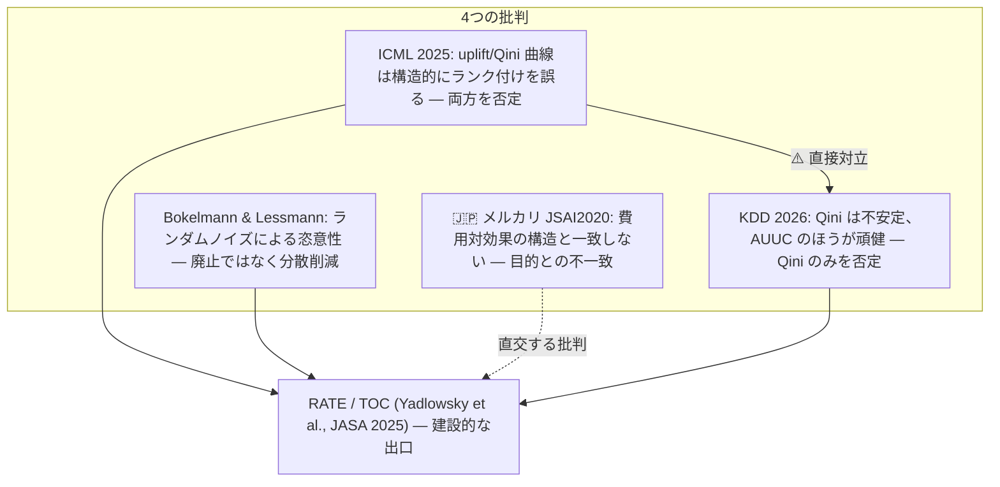
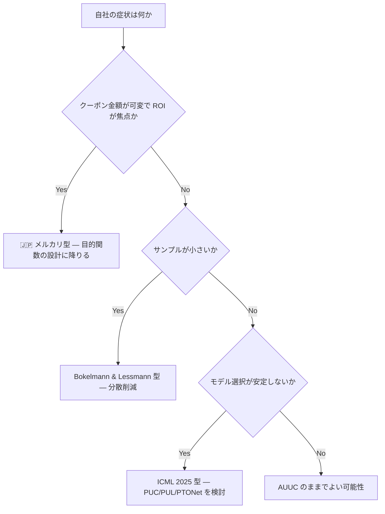

# AUUC / Qini 批判 — 評価指標そのものが壊れている可能性

## 概要

**本クラスタで最重要のレポートである。**

AUUC（Area Under the Uplift Curve）と Qini 係数は、uplift modeling の事実上の標準評価指標として使われてきた。しかし近年、この指標そのものの妥当性に対する批判が複数の方向から提起されている。

読解順序上、これは **Step 2** に位置し、gather リストは次のように明示している。

> **ここを Step 3 の前に置くことが本リストの最大の主張。** モデルを作ってから指標を疑うと作業がすべて無駄になる。

そして本スレッドの最大の特徴は次の点にある。

> **このスレッドの主張は一枚岩ではない。批判の根拠がそれぞれ異なり、しかも互いに矛盾する。**

本レポートはこの対立を**解消しない**。対立したまま提示することが、この領域の現状を最も正確に伝える方法だからである。

## 批判の見取り図

## 1. ICML 2025 —「Rethinking Causal Ranking」

### 出典

**Rethinking Causal Ranking: A Balanced Perspective on Uplift Model Evaluation**（ICML 2025）
<https://proceedings.mlr.press/v267/zhu25s.html>

OpenReview 版（査読コメント込み）: <https://openreview.net/pdf?id=iJdjDM6Odd>

gather リストの評価は「**批判スレッドの現時点での到達点**」。

### 主張

uplift 曲線 / Qini 曲線は、**二値の負のアウトカムを持つ個人を正しくランク付けできない**。

その帰結として、

> **バイアスのあるモデルが不偏なモデルより高い曲線値を得て、系統的に誤ったモデル選択を招く**

### この主張の重さ

ここが本レポートで最も注意深く読むべき箇所である。ICML 2025 の主張は「**曲線がノイジーである**」ではない。「**系統的に誤る**」である。

この違いは決定的である。

| 主張の型 | 帰結 | 対処 |
|---------|------|------|
| 「ノイジー」 | サンプルを増やす、分散を削減すれば改善する | 統計的な改善で対処可能 |
| **「系統的に誤る」** | **サンプルを無限に増やしても誤り続ける**。バイアスのあるモデルが構造的に高く評価される | **指標そのものを変えるしかない** |

サンプルサイズの問題であれば、データを集めれば解決する。しかし構造的な欠陥であれば、データをいくら集めても、**AUUC/Qini は一貫して間違ったモデルを選び続ける**。しかもその誤りは「たまたま外れる」のではなく「バイアスのあるモデルを好む」という特定の方向を持つ。

「二値の負のアウトカムを持つ個人」という条件は、実務ではむしろ普通である。クーポン施策で「クーポンを出したことで購入しなくなった」（sleeping dogs）層は、まさにこれに該当する。

### 対案

PUC / PUL / PTONet。

**公式実装**: <https://github.com/euzmin/PUC>

PUC 指標、PTONet、`metric_test.ipynb` を含む。

> ⚠️ **ライセンス表記がない**点に注意。

これは実務導入時に実質的な制約になる。ライセンスが明示されていないコードは、原則として利用許諾がないものとして扱わざるを得ない。手元での検証には使えても、プロダクションへの組み込みには法務上の判断が要る。

### 査読コメントを読む価値

OpenReview 版（<https://openreview.net/pdf?id=iJdjDM6Odd>）は査読コメント込みで公開されている。gather リストの評価は「反論と著者応答が読め、**主張の射程を測れる**」。

「系統的に誤る」という強い主張がどこまで一般に成り立つのか、査読者がどこに疑問を呈し、著者がどう応じたかを読むことは、この主張を自社設定に持ち込めるかの判断材料になる。

## 2. Bokelmann & Lessmann — ランダムノイズによる恣意性

### 出典

**Improving Uplift Model Evaluation on RCT Data**（Bokelmann & Lessmann, 2022, EJOR）
<https://arxiv.org/abs/2210.02152>

### 主張

Qini 曲線の評価が**ランダムノイズに強く左右され、シグナルが恣意的になる**。

重要なのは、**RCT データ上でもバイアスが生じる**という点である。RCT は因果推論における最も強い設計であり、そこでなお評価が不安定になるということは、観察データではさらに悪いことを意味する。

### ICML 2025 との違い

gather リストは「**#30 とは批判の切り口が異なる**（ノイズ vs 構造的欠陥）」と明示している。

| | ICML 2025 | Bokelmann & Lessmann |
|---|---|---|
| 診断 | 構造的欠陥（負のアウトカムを持つ個人のランク付け失敗） | ランダムノイズによる恣意性 |
| 処方箋 | **指標を置き換える**（PUC/PUL/PTONet） | **分散削減**（廃止ではない） |
| 含意 | AUUC/Qini は根本的に使えない | AUUC/Qini は改善すれば使える |

**Bokelmann & Lessmann は指標の廃止を主張していない。** 分散削減法を提案しており、これは「Qini は直せる」という立場である。この点で ICML 2025 とは処方箋のレベルで両立しない。

## 3. 🇯🇵 メルカリ JSAI2020 — 実務家による批判の原点

### 出典

🇯🇵 **クーポンマーケティングにおける Uplift Modeling 適用の問題点と新しい評価指標**（メルカリ, JSAI2020）
<https://www.jstage.jst.go.jp/article/pjsai/JSAI2020/0/JSAI2020_1H4OS12b02/_pdf>

背景: 🇯🇵 Uplift Modeling の適用（mercari AI）<https://ai.mercari.com/projects/uplift-modeling/> — persuadable のみに通知を送る設計思想

gather リストの評価は「🇯🇵 **実務家による批判の原点**」。

### 主張

Qini が**費用対効果の構造と一致しない**ことを具体例で示す。対案は **Sure Things Curve**。

そして gather リストが強調する位置づけ:

> **学術的批判が統計的性質を問うのに対し、指標とビジネス目的の不一致を問う**

### なぜこれが他の3つと質的に違うのか

ICML 2025 も Bokelmann & Lessmann も KDD 2026 も、「**指標が統計的に正しく振る舞うか**」を問うている。メルカリの批判はそこを問うていない。

メルカリが問うているのは「**統計的に完璧な指標を手に入れたとして、それはビジネスの意思決定に使えるのか**」である。

クーポン施策における具体的な構造は次の通りである。

- AUUC/Qini は「uplift が高い順に並べたときの累積効果」を測る
- しかしクーポンには**コスト**がある
- 「uplift が高い人」と「**コストを回収できる人**」は一致しない
- uplift が 1% でも、そのために 2000円のクーポンを出して 100円の利益しか生まないなら、その人に出すべきではない
- 逆に uplift が低くても、単価の高い商品を買う層なら ROI は正になりうる

Qini 曲線がどれだけ統計的に正確でも、この構造は解消しない。**Qini は「効果の大きさ」の順位付けであって、「ROI」の順位付けではない**からである。

gather リストの**対立4**はこの点を扱っている。

> #34（メルカリ）は**指標とビジネス目的の不一致**を突く。これは #30 / #33 / #35 のどれとも直交し、**統計的に完璧な指標を使っても解消しない**。

そして、

> **本プロジェクトの設定では、この対立4がおそらく最も効いてくる。**

## 4. KDD 2026 — ⚠️ ICML 2025 と直接対立

### 出典

**Evaluating Uplift Modeling under Structural Biases**（KDD 2026）
<https://arxiv.org/abs/2603.20775>

### 主張

**Qini 係数はバイアス環境で安定性が著しく低く、Uplift / AUUC のほうが頑健**。

### 対立の構造

gather リストの**対立2**（「正面衝突」と表現されている）:

| 論文 | Qini | AUUC / uplift 曲線 |
|------|------|------------------|
| **KDD 2026** | ❌ 不安定 | ✅ **頑健。こちらを使え** |
| **ICML 2025** | ❌ 失敗する | ❌ **こちらも失敗する** |

KDD 2026 は **Qini を叩き AUUC を擁護**する。ICML 2025 は **両方を叩く**。

### なぜ直接比較できないのか

gather リストの整理:

> **評価軸が違う**（前者はバイアス下の順位相関の安定性、後者は不偏モデルを正しく選べるか）ため直接比較できない。

| | KDD 2026 | ICML 2025 |
|---|---|---|
| 何を測っているか | バイアス環境下での**順位相関の安定性** | **不偏モデルを正しく選べるか** |
| 前提 | モデルにバイアスがある状況で、指標がどれだけ一貫した順位を出すか | 不偏モデルとバイアスのあるモデルが混在する中で、正しいほうを選べるか |

この2つは別の質問である。ある指標がバイアス環境で安定した順位を出す（KDD 2026 の基準で良い）ことと、その安定した順位が正しいモデルを上位に置く（ICML 2025 の基準で良い）ことは、論理的に独立している。**一貫して間違い続ける指標は、KDD 2026 の基準では「安定」と評価されうる。**

したがって「どちらが正しいか」という問いは、そもそも成立しない。

### gather リストの含意

> **どちらに賭けるかを決めるより、#36 RATE を検定として併用し「そもそも有意な heterogeneity があるか」を先に確かめるほうが安全。**

## 5. 建設的な出口 — RATE / TOC

### 出典

**Evaluating Treatment Prioritization Rules via Rank-Weighted Average Treatment Effects**（Yadlowsky, Fleming, Shah, Brunskill, Wager, JASA 2025）
<https://arxiv.org/abs/2111.07966>

gather リストの評価は「**AUUC・Qini 批判に対する最も建設的な回答**」。

### 3つの貢献

#### (a) TOC 曲線の定義と RATE の構成

TOC（Targeting Operator Characteristic）曲線を定義し、それを**重み付き積分**として RATE（Rank-Weighted Average Treatment Effect）を構成する。

#### (b) AUTOC と QINI の統一的整理

> **AUTOC と QINI は重み関数 α(q) の違いにすぎない**

これは本レポートで最も見通しを与える洞察である。ここまで対立していると見えた指標群が、**同じ枠組みの中のパラメータ違い**として整理される。

| 指標 | RATE 枠組みでの位置 |
|------|------------------|
| AUTOC | 重み関数 α(q) の一つの選択 |
| QINI | 重み関数 α(q) の別の選択 |

これにより「AUUC か Qini か」という論争は、「**どの重み関数を選ぶか**」という設計上の選択に還元される。重み関数の選択は、どの分位に関心があるかというビジネス上の問題であり、統計的な優劣の問題ではなくなる。

#### (c) ブートストラップによる有効な標準誤差

> **ブートストラップによる有効な標準誤差**を与える

これが Bokelmann & Lessmann の「ランダムノイズによる恣意性」という批判への直接の応答になる。標準誤差があれば、「この曲線の差はノイズか、実在するか」を判定できる。**指標を捨てるのではなく、指標に不確実性の定量化を付ける**というアプローチである。

01 のレポートで扱った **GRF の信頼区間が「実務上の決定的な差」である**という評価と、これは同じ思想の系列にある。同じ著者群（Wager）が関わっているのも偶然ではない。

### リファレンス実装

**grf — `rank_average_treatment_effect()`**
<https://grf-labs.github.io/grf/reference/rank_average_treatment_effect.html>

gather リストの評価: **RATE / TOC のリファレンス実装**（R）。ブートストラップ標準誤差つき。`target = "AUTOC"` / `"QINI"` で切替。

`target` パラメータで AUTOC と QINI を切り替えられるという実装の事実そのものが、「両者は重み関数の違いにすぎない」という理論的主張を体現している。

### RATE を「検定」として使う

gather リストが繰り返し強調するのは、RATE をランキング指標としてではなく**検定**として使うという用法である。

> **RATE を検定として併用し「そもそも有意な heterogeneity があるか」を先に確かめる**

これが最も安全な使い方である理由は、順序にある。

1. そもそも有意な heterogeneity（効果の異質性）がなければ、どのモデルのランキングも意味がない
2. 意味のないランキングを AUUC で比較しても、比較しているのはノイズである
3. **AUUC/Qini/PUC のどれが正しいかを議論する前に、議論する対象が存在するかを確かめる**

heterogeneity が有意でなければ、uplift modeling そのものが不要である（全員に配るか誰にも配らないかを ATE で決めればよい）。この判定を先に置くことは、4つの批判のどれに賭けるかを決めずに済ませる方法でもある。

## 6. 4つの対立の整理

### gather リストの対立3 — 批判の根拠が三者三様（同じ結論、違う理由）

> #30（構造的なランク付けの欠陥）、#33（ランダムノイズによる恣意性）、#34（費用対効果の構造との不一致）はいずれも「Qini を信じるな」に着地するが**原因診断が全く異なる**ため処方箋も互換性がない。

これが本レポートの中核である。**4つの批判は結論こそ似ているが、診断が違うため薬が違う。**

| 批判 | 原因診断 | 処方箋 | 他の処方箋との互換性 |
|------|---------|--------|------------------|
| ICML 2025 | **構造的欠陥**（負のアウトカムを持つ個人のランク付け失敗） | 指標を置き換える（PUC/PUL/PTONet） | 分散削減しても解決しない |
| Bokelmann & Lessmann | **ノイズ**（ランダムノイズによる恣意性、RCT でもバイアス） | 分散削減（**廃止ではない**） | 指標を置き換える必要はないと主張 |
| 🇯🇵 メルカリ JSAI2020 | **目的との不一致**（費用対効果の構造と Qini が一致しない） | Sure Things Curve、最終的には目的関数の設計 | **統計的に完璧な指標でも解消しない** |
| KDD 2026 | Qini のバイアス下での不安定性 | **AUUC を使え** | ICML 2025 と正面衝突 |

### 症状に応じた選択

gather リストは、この非互換性への対処を明示している。

> **自社の症状がどれなのかを見極めてから対策を選ぶ。**

| 症状 | 該当する批判 | 対策 |
|------|------------|------|
| クーポン金額が可変で **ROI が焦点** | 🇯🇵 メルカリ JSAI2020 | Sure Things Curve、目的関数の設計 |
| **サンプルが小さい** | Bokelmann & Lessmann | 分散削減 |
| **モデル選択が安定しない** | ICML 2025 | PUC/PUL/PTONet |

**本プロジェクトの設定では、gather リストが「おそらく最も効いてくる」と指摘するのは対立4（メルカリ型）である。**

### 対立4 — 学術的批判 vs 実務的批判の射程

gather リストの整理:

> クーポン施策では「uplift が高い人」と「コストを回収できる人」が一致しない以上、最終的には指標の議論ではなく**目的関数の設計**（#25 の Lagrangian 定式化、#39 の policy optimization）に降りる必要がある。

つまり、**評価指標をどれだけ改善しても、それが最終的な答えにはならない**という可能性がある。行き着く先は、

- BCORLE(λ)（<https://proceedings.neurips.cc/paper/2021/hash/ab452534c5ce28c4fbb0e102d4a4fb2e-Abstract.html>）の Lagrangian 定式化 — 予算制約下のクーポン配分を明示的に定式化する
- causalml（<https://github.com/uber/causalml>）の policy optimization

である。ただし gather リストは Step 5 で「**uplift + 単純な閾値ルールで足りるなら offline RL は不要**」とも釘を刺している。

## 7. 周辺文献

| 文献 | URL | 位置づけ |
|------|-----|---------|
| Learning to Rank for Uplift Modeling（Devriendt et al., TKDE） | <https://arxiv.org/abs/2002.05897> | AUUC を目的関数として最適化することの是非。**ICML 2025 の指摘と読み合わせると論点が立体的になる** |
| Uplift Modeling with Generalization Guarantees（KDD 2021） | <https://dl.acm.org/doi/10.1145/3447548.3467395> | 評価指標の信頼性問題に理論側から接近 |

Devriendt et al. は特に興味深い位置にある。AUUC を**目的関数として直接最適化する**という提案は、AUUC が壊れているという ICML 2025 の主張が正しければ、**壊れた指標を最適化することになる**。この2本を並べて読むことで、批判の射程が具体的に見える。

## 8. ツーリングの側の反応

### scikit-uplift

<https://www.uplift-modeling.com/en/latest/index.html>

AUUC・Qini（理想ケースつき）・uplift@k を最も素直に提供。**評価指標の計算だけならこれが一番速い**。

> ⚠️ **2022年8月で凍結**

批判スレッドの主要な論文（ICML 2025、KDD 2026、RATE の JASA 掲載）はすべて凍結後のものである。sklift は批判以前の指標理解を実装したまま止まっている。

### EconML

<https://github.com/py-why/EconML>

gather リストの評価: DML・DR-learner・causal forest。**あえて Qini/AUUC を持たず**方策を直接学習・解釈する設計思想。

これは設計上の立場表明である。EconML は「ランキング指標でモデルを選ぶ」というワークフロー自体を採らず、方策を直接学習して解釈する道を選んでいる。批判スレッドの結論の一つ（「指標の議論ではなく目的関数の設計に降りる」）と、ライブラリの設計思想が一致している。

### CausalML — 批判が主流ライブラリの自己記述に吸収された

<https://github.com/uber/causalml>

gather リストの評価: AUUC・感度分析・解釈性・policy optimization。**uplift 実務の第一候補**。

そして注目すべきは、CausalML の公式ドキュメントが **DR pseudo-outcome loss を "effect-magnitude accuracy" と位置づけ、「targeting quality（ランキング）」と明示的に区別している**という点である。

これが意味するのは、**批判が主流ライブラリの自己記述に吸収された**ということである。

| 概念 | CausalML の位置づけ |
|------|------------------|
| DR pseudo-outcome loss（`dr_score`） | **effect-magnitude accuracy** — 効果の大きさをどれだけ正確に当てるか |
| AUUC / Qini | **targeting quality** — 誰を狙うかのランキングの質 |

この2つが**明示的に別のものとして区別されている**ということは、ライブラリ自身が「AUUC が良いことと、CATE の推定が正確なことは別だ」と認めているに等しい。批判スレッドが外から突いてきた論点を、第一候補のライブラリが自らのドキュメントに書き込んでいる。

これは「批判は一部の研究者の主張にすぎない」という反論を難しくする。

## 9. 実務的推奨

### やってはいけないこと

> **AUUC/Qini 単独でモデル選択するな。**

4つの批判は互いに矛盾するが、この一点では一致している。どの診断が正しいにせよ、AUUC/Qini を単独の判断基準にすることの危うさは共通の結論である。

### 推奨手順

| 順序 | やること | 根拠 |
|------|---------|------|
| 1 | **RATE を検定として併用**し「そもそも有意な heterogeneity があるか」を先に確かめる | 議論の対象が存在するかを先に確認する。対立2 への gather の含意 |
| 2 | **自社データで AUUC と RATE が食い違うかを実際に確認する** | gather の Step 2 が指定する「最初の一手」 |
| 3 | 食い違わなければ **AUUC のままでよい** | gather の明示的な記述 |
| 4 | 食い違うなら**そこが意思決定の分岐点** | 症状に応じて処方箋を選ぶ（対立3） |
| 5 | CausalML の `dr_score` / `rlearner_score` と併用する | effect-magnitude accuracy と targeting quality を分けて見る |
| 6 | あるいは EconML に倣って**方策を直接学習・解釈する** | ランキング指標を経由しない道 |

### 最初の一手

gather の Step 2 が具体的に指定する行動:

> **#31 PUC 実装**と **#42 grf の RATE** を手元で動かし、**自社データで AUUC と RATE が食い違うかを実際に確認する**。食い違わなければ AUUC のままでよい。食い違うならそこが意思決定の分岐点。

これは「4つの論文のどれが正しいかを机上で決める」のではなく、「**自社データに症状が出ているかを実測する**」というアプローチである。4つの批判が互いに矛盾していて決着がつかない以上、これが唯一の合理的な進み方になる。

なお PUC 実装は ⚠️ **ライセンス表記がない**ため、手元での検証と本番導入は分けて考える必要がある。

### 読解順序（gather の Step 2）

🇯🇵 メルカリ JSAI2020（日本語・短い・問題設定が最も近い）→ Bokelmann & Lessmann → ICML 2025 → RATE/TOC

最後の RATE/TOC が建設的な出口である。

## まとめ

| 論点 | 状態 |
|------|------|
| ICML 2025 vs KDD 2026 | ⚠️ **正面衝突**。評価軸が違う（不偏モデルを選べるか vs バイアス下の順位相関の安定性）ため直接比較できない。**解消していない** |
| ICML 2025 vs Bokelmann & Lessmann | 診断が違う（構造的欠陥 vs ノイズ）→ 処方箋が非互換（置換 vs 分散削減） |
| 🇯🇵 メルカリ vs 学術的批判 | **直交する**。統計的に完璧な指標を使っても解消しない |
| 建設的な出口 | **RATE/TOC**。AUTOC と QINI を重み関数 α(q) の違いとして統一的に整理し、ブートストラップ標準誤差を与える。grf の `rank_average_treatment_effect()` がリファレンス実装 |
| 主流ライブラリの反応 | CausalML が DR pseudo-outcome loss を "effect-magnitude accuracy" と位置づけ targeting quality と明示的に区別 = **批判が主流ライブラリの自己記述に吸収された** |
| 最初の一手 | **自社データで AUUC と RATE が食い違うかを実際に確認する** |
| 本プロジェクトで最も効く対立 | **対立4**（メルカリ型・目的との不一致）。最終的には目的関数の設計に降りる必要がある |
