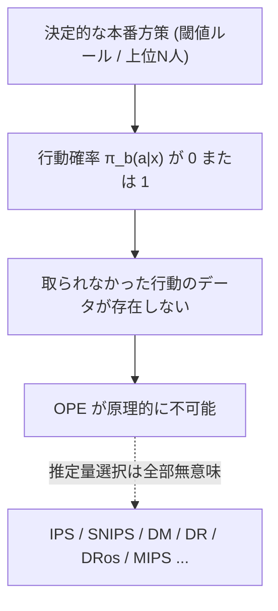
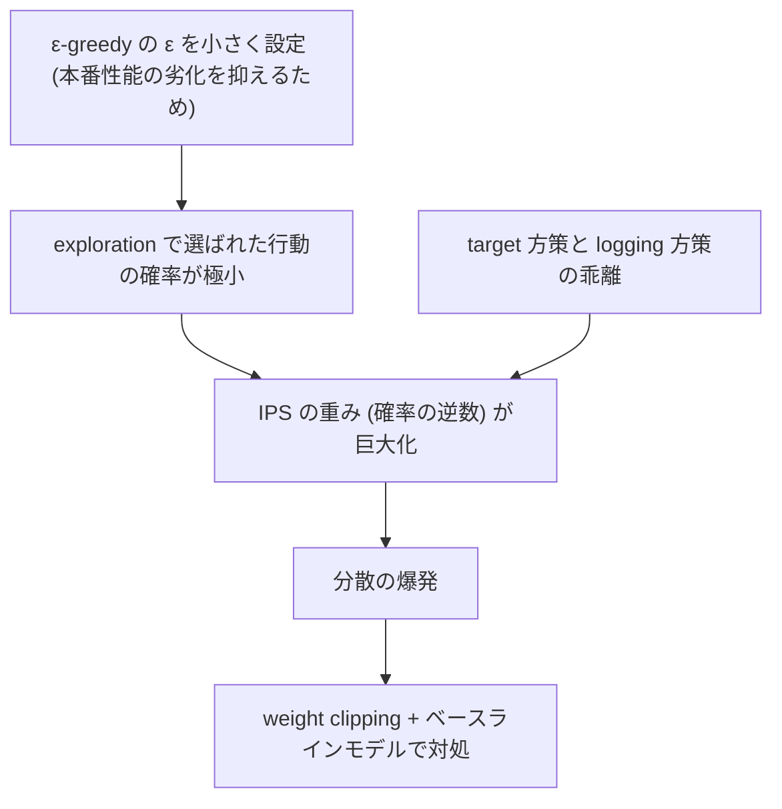
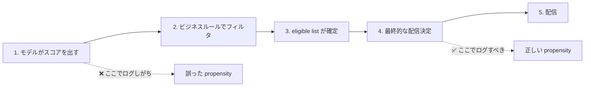
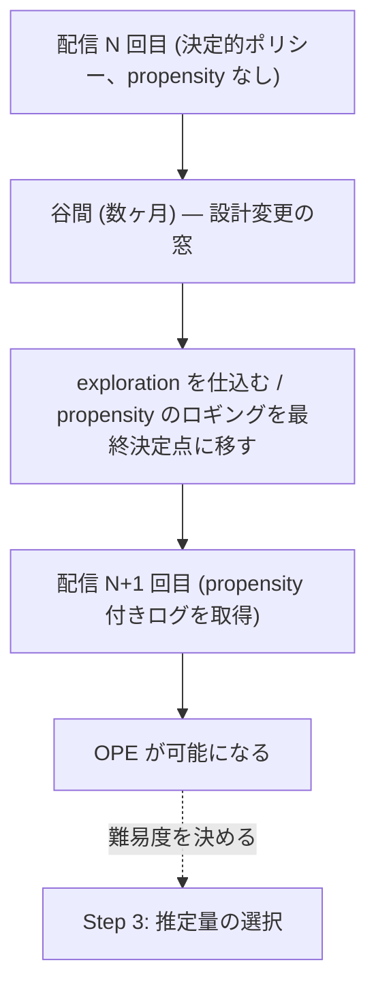

# 傾向スコアのロギング — 推定量より本質的な問題

## 概要

gather リストは本サブトピックに次の一文を冠している。

> **論文が最も少なく、しかし実装で最も詰まる領域。**

02 のレポートで扱った推定量の系譜——IPS、SNIPS、DM、DR、Switch-DR、DRos、MIPS、OffCEM、MDR——は、すべて「**ログデータに傾向スコアが記録されている**」という前提の上に成り立っている。この前提が崩れれば、推定量の選択は全部無意味になる。

そして本番環境では、この前提はしばしば崩れている。

読解順序上、これは **Step 4**（配信サイクルの谷間で）に位置する。ただし gather リストが Step 4 の説明で述べているように、**ここで exploration を仕込めるかが Step 3（OPE 実装）の難易度を決める**。順序としては後だが、依存関係としては前にある。

## 1. 問題の構造 — 決定的な本番方策は propensity を残さない

### なぜ原理的に不可能になるのか

OPE の全推定量は、ログ方策が各行動を選んだ**確率** π_b(a|x) を必要とする。IPS はその逆数で重み付け、DR はその補正項に使う。DM だけは直接には使わないが、DM 単体は Adyen で負の相関だった。

しかし本番の配信システムは、たいてい**決定的**（deterministic）である。

- スコアが閾値を超えた顧客に配信する
- 上位 N 人に配信する
- ビジネスルールで対象を確定させる

これらはいずれも「確率」を持たない。同じ入力に対して必ず同じ行動が出る。つまり π_b(a|x) は 0 か 1 しか取らない。

このとき何が起きるかというと、

- 実際に取られた行動の確率は 1 → 重みは 1 → IPS は単なる平均になり、目標方策の評価にならない
- 取られなかった行動の確率は 0 → **その行動についての情報がログに一切存在しない**

**目標方策が「ログ方策が取らなかった行動」を推奨する部分について、データが原理的に存在しない。** これが「決定的な本番方策では OPE が原理的に不可能」ということの中身である。

### この問題の相対的な重さ

02 のレポートで見た通り、Adyen は本番実測で「IPS/SNIPS が相関 0.8 超、DM は負の相関、DR はほぼゼロ」という結果を得た。この結果は推定量選択の議論として読まれがちだが、**Adyen がそもそもこの実測を行えたこと自体が非自明**である。

Adyen の本番は決定的ポリシーだった。彼らはまず「OPE が原理的に不可能」という状態を突破する必要があった。そこを解決して初めて、推定量の比較というステージに立てた。

gather リストの表現を借りれば、

> **推定量は安い（各20行程度）。難しいのは propensity のロギング。**

## 2. Adyen の解法 — exploration traffic から行動確率を復元する

### 出典

**Adyen — exploration traffic 節**
<https://arxiv.org/html/2501.10470>

### 手法

gather リストの記述:

> 本番が**決定的ポリシー**で OPE が原理的に不可能だった問題を、ε-greedy の exploration traffic から**含意される行動確率を復元**して解決。代償として重みが巨大化し、weight clipping で対処。

分解すると次の構造になる。

| ステップ | 内容 |
|---------|------|
| 1 | 本番トラフィックの一部を **ε-greedy** の exploration に割り当てる |
| 2 | その exploration traffic の存在から、**含意される行動確率**（implied action probability）を復元する |
| 3 | 復元した確率をログ方策の propensity として OPE に使う |

ε-greedy であれば、確率 ε でランダムな行動、確率 1-ε で貪欲な行動が選ばれる。この構造が分かっていれば、各行動が選ばれる確率は逆算できる。決定的だった方策に、**設計上の確率性を後から与える**わけである。

### 代償 — 重みの巨大化

gather リストが明示する代償:

> 代償として **target と logging が乖離し重みが巨大化**し、weight clipping とベースラインモデルで対処。

ε が小さいと（本番の性能劣化を抑えるため ε は小さく設定される）、exploration で選ばれた行動の確率は極めて小さくなる。IPS の重みはその逆数なので、**重みが巨大化する**。

対処は 2 つ。

| 対処 | 内容 |
|------|------|
| **weight clipping** | 重みに上限を設ける。分散は抑えられるが、その代わり**バイアスが入る** |
| **ベースラインモデル** | 分散低減のための基準を置く |

weight clipping は不偏性を犠牲にして分散を抑える操作である。ここに、02 で見た **DRos**（MSE 上界を最小化するよう重みを縮小）が「**Adyen が使わなかったが理論上は使うべきだった推定量**」と評価される理由がある。DRos はまさにこの「重みをどう縮小するか」を原理的に扱う手法であり、Adyen は素朴な clipping で済ませている。

### トレードオフの本質

ε を大きくすれば重みは扱いやすくなるが、本番の性能が落ちる（ランダムな配信が増える）。ε を小さくすれば本番性能は守られるが、OPE の分散が爆発する。**exploration のコストと OPE の精度は直接的なトレードオフにある。**

## 3. 実装原則 — どこで、何を使って計算するか

### 出典

**The Hidden Foundation of OPE: Why Correct Propensity Logging Is Critical**
<https://somayeh-farhadi.medium.com/the-hidden-foundation-of-off-policy-evaluation-why-correct-propensity-logging-is-everything-00335c93b496>

gather リストの評価: **エンジニア向けに最も実用的**。

### 原則

> **傾向スコアは、最終意思決定が行われるその場所で、最終的な eligible list を使って計算・ログする。**

そして、

> **ここを外すと後段の推定量選択が全部無意味。**

この原則は短いが、2つの要求を含んでいる。

| 要求 | 意味 | 外したときに起きること |
|------|------|---------------------|
| **最終意思決定が行われるその場所で** | モデルのスコアリング時点ではなく、実際に「配信する／しない」が確定する場所で計算する | スコアリング後に別のコンポーネントがフィルタをかけていれば、ログした確率は実際の行動確率ではない |
| **最終的な eligible list を使って** | 候補集合が絞られた後の、最終的な母集団に対する確率を計算する | 絞られる前の集合に対する確率をログすると、分母が実際と違う |

### なぜこれが実装で詰まるのか

典型的な配信パイプラインは複数のコンポーネントに分かれている。

自然な実装では、傾向スコアは**モデルのスコアリング時点**でログされる。そこがスコアを持っている唯一の場所だからである。しかし実際の行動確率は、その後のフィルタとビジネスルールを経た**最終決定時点**でしか確定しない。

この乖離は、後から埋めることが極めて難しい。ログに残っていない情報は復元できないからである。

## 4. 候補集合が OPE の妥当性を壊す経路

### 出典

**Candidate Sets: The Invisible Boundary of OPE**
<https://somayeh-farhadi.medium.com/candidate-sets-the-invisible-boundary-of-off-policy-evaluation-ope-796b3b299aff>

gather リストの記述: 候補集合（フィルタ・ビジネスルール）が OPE の妥当性を壊す経路。

### 構造

候補集合（candidate set）とは、モデルが選択肢として考慮できる行動の集合である。実務では必ず何らかのフィルタがかかっている。

- 直近◯日以内に配信済みの顧客は除外
- 特定セグメントは対象外
- 在庫・予算の制約
- 法務・コンプライアンス上の除外

これらのフィルタは、**目標方策が推奨する行動を、そもそも候補集合から排除しうる**。目標方策が「この顧客に配信すべき」と言っても、ログ時点のフィルタでその顧客が除外されていれば、その行動のデータは存在しない。

この境界が「見えない」（invisible）と呼ばれるのは、フィルタがモデルの外側、多くはパイプラインの別の場所に実装されているためである。モデル側からは候補集合の縁が見えない。

### 関連文献

**Unbiased Offline Evaluation for Learning to Rank with Business Rules**
<https://arxiv.org/abs/2311.01828>

gather リストの評価: **現場のポリシーは必ずルールで汚染されているので現実的**。

「汚染」という表現が示す通り、これは例外ではなく常態である。ビジネスルールのないランキング方策は実務には存在しない。

## 5. 決定的ロギング下の OPE — exploration を確保できない場合

### 出典

**OPE for Ranking Policies under Deterministic Logging Policies**
<https://openreview.net/forum?id=0ZkWWxcHKV>

gather リストの評価: exploration traffic を確保できない場合の代替路。

### 位置づけ

Adyen の解法は「exploration traffic を確保する」ことを前提とする。しかしこれが常に可能とは限らない。

- 本番性能の劣化が許容されない
- exploration の設計に必要な組織的な合意が取れない
- 配信サイクルが長く、次の設計変更の機会が遠い

こうした状況では、**決定的なロギングのまま OPE を試みる**代替路が必要になる。この文献はランキング方策の文脈でその問題を扱う。

これは Adyen の解法より原理的に難しい。存在しない情報を作り出すことはできないため、何らかの追加的な仮定を置くことになる。

## 6. Logging Policy Design — そもそもどうログを取る設計にすべきか

### 出典

**Logging Policy Design for Off-Policy Evaluation**
<https://arxiv.org/abs/2605.15108>

gather リストの評価:

> 「そもそもどうログを取る設計にすべきか」。**数ヶ月おきの配信なら次回設計時点で介入できる**ので実務的価値が高い。

### 発想の転換

ここまでの議論はすべて「**既にあるログをどう使うか**」という受動的な問題設定だった。Logging Policy Design は問いを反転させる。「**これから取るログを、OPE がしやすいようにどう設計するか**」。

この転換が可能かどうかは、組織の配信サイクルに依存する。ログが既に確定していて変更できないなら、この文献は読む価値がない。ログの取り方を設計できるなら、これが最も効率の良い介入点になる。

## 7. 本ユースケースへの含意

### cadence が有利に働く

gather リストの Step 4 の記述:

> **数ヶ月おきという cadence は次回配信の設計に介入できるという意味で有利**。ここで exploration を仕込めるかが Step 3 の難易度を決める。

これは重要な指摘である。配信頻度が高いシステム（毎日・毎時間）では、パイプラインの変更が既に回っているオペレーションを止めることになり、介入の窓が狭い。一方、**数ヶ月おきの配信であれば、配信と配信の谷間が丸ごと設計変更の窓になる**。

つまり、**低頻度の配信は OPE にとって不利ではなく、むしろロギング設計の観点では有利**である。頻度が低い分データは少ないが、設計に手を入れる自由度は高い。

### 判断すべきこと

| 問い | 帰結 |
|------|------|
| 次回配信で exploration traffic を確保できるか | できるなら Adyen の解法が使える。Step 3 の難易度が大きく下がる |
| 傾向スコアを**最終意思決定点**でログできるか | できないなら、後段の推定量選択は全部無意味になる |
| 候補集合のフィルタがどこで、何を排除しているか | 把握できていなければ、OPE の妥当性は評価できない |
| exploration が確保できない場合の代替路を用意するか | 決定的ロギング下の OPE を検討する |

**最初の判断は「次回配信の設計に介入できるか」である。** できるなら Logging Policy Design から入るのが最も効率が良い。できないなら、決定的ロギング下の OPE という難しい道を検討することになる。

## 8. 🇯🇵 Open Bandit Dataset — Adyen が苦労した部分を安全に練習できる

### 出典

🇯🇵 **Open Bandit Dataset**（ZOZO）
<https://github.com/st-tech/zr-obp/blob/master/obd/README.md>

### なぜ稀有なのか

gather リストの評価:

> 約26M 行。**真の傾向スコアが記録されている稀有な公開データ**。Uniform Random と Bernoulli TS の**複数ポリシーで収集**されており、**Adyen が苦労した部分を安全に練習できる**。

「稀有」というのは誇張ではない。本レポートで見てきた通り、**本番システムは傾向スコアを残さないのが常態**である。Adyen ですら exploration traffic からの復元という迂回路を通った。真の傾向スコアが記録された公開データは、その常態の例外である。

| Open Bandit Dataset の性質 | 意味 |
|--------------------------|------|
| **真の傾向スコアが記録されている** | 復元・推定を経ずに、正しい propensity で OPE を動かせる |
| **複数ポリシーで収集**（Uniform Random と Bernoulli TS） | ログ方策と目標方策の組を実際に作れる。片方で学習し、もう片方の実測値と照合できる |
| **約26M 行** | 大規模性の問題を含めて練習できる |

### 何が「安全に練習できる」のか

複数方策で収集されているという点が決定的である。ある方策のログから別の方策の価値を OPE で推定し、**その方策の実測値と突き合わせる**ことができる。これは Adyen が本番の A/B テストとの相関を測るために払ったコストを、公開データで代替できるということを意味する。

つまり、02 のレポートで扱った「**自社データで IPS/SNIPS を基準線に置き、DR がそれを上回るか実証する**」という手順の**予行演習が公開データでできる**。

### 関連: 🇯🇵 Open Bandit Pipeline

<https://github.com/st-tech/zr-obp>

gather リストの評価: OPE 推定量の実装カタログ。**Adyen が自前 Spark 実装した部分の多くはここに既にある**。

## 9. 推定量は安い、難しいのは propensity のロギング

### 実装コストの非対称性

gather リストが伝える要点:

> **推定量は安い（各20行程度）。難しいのは propensity のロギング。**

| 項目 | 実装コスト |
|------|----------|
| OPE 推定量（IPS / SNIPS / DM / DR） | **各20行程度**。しかも OBP に実装済み |
| 傾向スコアの正しいロギング | 本番パイプラインの改修、exploration の設計、組織的合意、配信サイクルの制約 |

この非対称性が、本レポートのタイトル（「推定量より本質的な問題」）の根拠である。推定量の選択に時間を使う前に、そもそも propensity が正しく取れているかを確認しなければならない。

### なぜ Adyen は OBP を採用しなかったのか

gather リストが指摘する事実:

> Adyen が OBP を採用せず PySpark で再実装したのは **OBP が単一ノードだから**。

これは重要な実務情報である。OBP は「Adyen が自前 Spark 実装した部分の多くはここに既にある」実装カタログだが、**単一ノードで動作する設計**である。Adyen の billion-scale のデータ規模ではそのままでは動かず、PySpark での再実装が必要になった。

つまり、

| データ規模 | 選択 |
|-----------|------|
| 単一ノードに収まる（検証・追試・中規模の本番） | **OBP をそのまま使える。追試は安価** |
| billion-scale | 分散処理への再実装が必要。ただし**アルゴリズムそのものは 20 行程度**なので、移植の難所は分散化であって OPE の理論ではない |

再実装が必要だったのは「OPE が難しいから」ではなく「スケールのため」である。この区別は、自社のデータ規模に応じた判断に直結する。多くの組織にとって、OBP をそのまま使える規模に収まる。

## まとめ

| 論点 | 内容 |
|------|------|
| **問題の核心** | 決定的な本番方策は propensity を残さない → OPE が**原理的に不可能** |
| **Adyen の解法** | ε-greedy の exploration traffic から**含意される行動確率を復元**。代償として target と logging が乖離し重みが巨大化、**weight clipping とベースラインモデル**で対処 |
| **実装原則** | 傾向スコアは**最終意思決定が行われるその場所で、最終的な eligible list を使って計算・ログする**。ここを外すと**後段の推定量選択が全部無意味** |
| **候補集合** | フィルタ・ビジネスルールが OPE の妥当性を壊す経路。現場のポリシーは必ずルールで汚染されている |
| **exploration が取れない場合** | 決定的ロギング下の OPE という代替路。原理的により難しい |
| **発想の転換** | Logging Policy Design — 「既にあるログをどう使うか」ではなく「これから取るログをどう設計するか」 |
| **本ユースケースへの含意** | **数ヶ月おきという cadence は次回配信の設計に介入できるという意味で有利**。ここで exploration を仕込めるかが OPE の難易度を決める |
| **練習環境** | 🇯🇵 Open Bandit Dataset は**真の傾向スコアが記録され複数方策で収集された稀有な公開データ**。Adyen が苦労した部分を安全に練習できる |
| **コストの非対称性** | **推定量は安い（各20行程度）。難しいのは propensity のロギング**。Adyen が OBP を採用せず PySpark で再実装したのは OBP が単一ノードだから |
