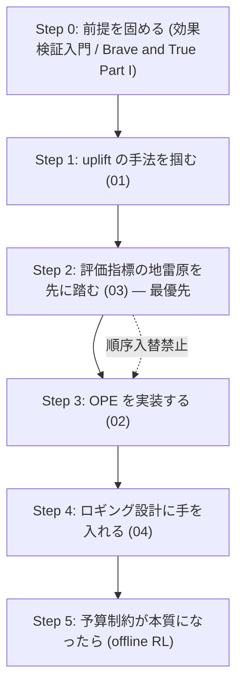

# Retrieval: methodology_map

uplift / CATE、Off-Policy Evaluation、評価指標批判、傾向スコアのロギングに関する詳細レポート群。

## レポート一覧

| # | ファイル | タイトル | 主題 |
|---|---------|---------|------|
| 01 | [01-uplift-cate-methods.md](01-uplift-cate-methods.md) | Uplift / CATE の手法地図 | metalearner 群（S/T/X/R/DR）、causal forest、DML、多値処置拡張、使い分けの判断材料 |
| 02 | [02-off-policy-evaluation.md](02-off-policy-evaluation.md) | Off-Policy Evaluation — 推定量の系譜と実務 | Adyen 2025 の本番実測（IPS/SNIPS が DR を上回る）、推定量の系譜、推定量選択問題 |
| 03 | [03-auuc-qini-critique.md](03-auuc-qini-critique.md) | AUUC / Qini 批判 — 評価指標そのものが壊れている可能性 | 4つの批判とその相互矛盾、建設的な出口としての RATE/TOC |
| 04 | [04-propensity-logging.md](04-propensity-logging.md) | 傾向スコアのロギング — 推定量より本質的な問題 | 決定的ポリシー下の OPE、exploration traffic、ロギング設計 |

## パラメータ

| 項目 | 値 |
|------|-----|
| 生成日 | 2026-07-15 |
| 入力元 | gather（`research/runs/dataiku_uplift_ops/gather/20260715/methodology_map/resources-methodology-map.md`） |
| ドメイン | dataiku_uplift_ops |
| クラスタ | methodology_map |
| リソース数 | 65 |

## 読解順序

gather 側の推奨順序をそのまま踏襲する。**最大の主張は Step 2 を Step 3 より前に置くこと**であり、この順序を入れ替えてはならない。モデルを作ってから指標を疑うと、その作業がすべて無駄になるためである。

### Step 0 — 前提を固める（1週間）

🇯🇵『効果検証入門』（安井翔太）または Causal Inference for the Brave and True Part I。「正しい比較とは何か」が曖昧なまま uplift に進むと、後段の指標議論が空回りする。

### Step 1 — uplift の手法を掴む（1週間）

本レポートの **01** に対応。Meta Learners（Brave and True 21章）→ 査読付きチュートリアル → Künzel PNAS 2019 の順。causal forest が必要になったら GRF、直交化の原理は DML。R-learner / DR-learner は「X-learner で不足を感じてから」で十分。

### Step 2 — 評価指標の地雷原を先に踏む（**最優先・順序を入れ替えない**）

本レポートの **03** に対応。**ここを Step 3 の前に置くことが本リストの最大の主張。**

🇯🇵 メルカリ JSAI2020（短く、問題設定が最も近い）→ Bokelmann & Lessmann → ICML 2025 → RATE/TOC の順。最後の RATE/TOC が建設的な出口。PUC 実装と grf の `rank_average_treatment_effect()` を手元で動かし、**自社データで AUUC と RATE が食い違うかを実際に確認する**。食い違わなければ AUUC のままでよい。食い違うならそこが意思決定の分岐点。

### Step 3 — OPE を実装する（2〜3週間）

本レポートの **02** に対応。🇯🇵 ZOZO の日本語解説 → DR 原典・SNIPS → **Adyen と Criteo を必ず対で** → OBP で実装。行動数が多いなら MIPS、推定量選択に迷ったら SLOPE。

### Step 4 — ロギング設計に手を入れる（配信サイクルの谷間で）

本レポートの **04** に対応。Propensity Logging → Adyen の exploration traffic 節 → Logging Policy Design。**数ヶ月おきという cadence は次回配信の設計に介入できるという意味で有利**。ここで exploration を仕込めるかが Step 3 の難易度を決める。

### Step 5 — 予算制約が本質になったら

BCORLE(λ) → Marketing Budget Allocation with Offline Constrained Deep RL。ただし **uplift + 単純な閾値ルールで足りるなら offline RL は不要**。RL は予算制約が動的で、かつ複数期にまたがる持ち越し効果がある場合にのみ元が取れる。

## 本クラスタの性格

本クラスタは**合意が形成されていない領域**であり、それこそが最も重要な知見である。各レポートは出典間の対立を解消せず、対立したまま提示する。
