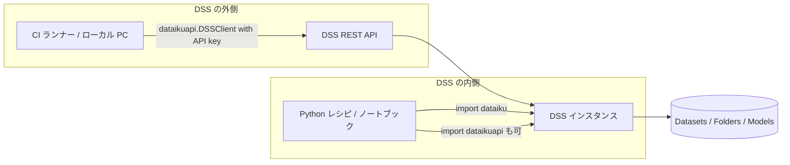

# 01. 2つの API パッケージ: `dataiku` と `dataikuapi`

Dataiku の Python API は 1 つではなく 2 つある。この二層構造はテスト戦略の前提であり、両者の**非対称性**こそが「Dataiku のコードはモックしづらい」という本クラスタ全体の問題の根源である。

- 一次情報: [Python APIs（起点）](https://doc.dataiku.com/dss/latest/python-api/index.html)（公式ドキュメント）
- 一次情報: [The Dataiku Python APIs](https://developer.dataiku.com/latest/getting-started/dataiku-python-apis/index.html)（公式 Developer）
- 一次情報: [Using Dataiku's Python packages](https://developer.dataiku.com/latest/getting-started/dataiku-python-apis/python-client/index.html)（公式 Developer）

## 1.1 役割分担

| 観点 | `dataiku` | `dataikuapi` |
|------|-----------|--------------|
| 通称 | 内部 API / DSS 内 API | REST API client |
| 実行場所 | **DSS 内部**（Python レシピ、ノートブック、シナリオ、Web アプリ） | **DSS 外部**（ローカル PC、CI ランナー、他システム）※DSS 内からも使用可 |
| 配布 | **DSS に内蔵**。単体の OSS 公開なし | PyPI `dataiku-api-client` / GitHub `dataiku/dataiku-api-client-python` |
| 主眼 | データそのものへのアクセス（読み書き） | インスタンスの構成・オーケストレーション |
| 代表クラス | `dataiku.Dataset` / `dataiku.Folder` / `dataiku.Model` / `dataiku.scenario.Scenario` | `dataikuapi.DSSClient` とその配下のハンドル群 |
| 認証 | 実行コンテキストから暗黙に解決 | API Key を明示的に渡す |
| リファレンス | [dataiku-reference](https://doc.dataiku.com/dss/latest/python-api/dataiku-reference.html) | [dataikuapi-reference](https://doc.dataiku.com/dss/latest/python-api/dataikuapi-reference.html) |



## 1.2 非対称性 —— これがテストの核心

2つのパッケージは「同じことを内外から行う 2 つの窓口」ではない。**`dataikuapi` には `dataiku` の等価物が無い操作がある。**

最も重要なのが `dataiku.Dataset.get_dataframe()` である。

- [Datasets](https://doc.dataiku.com/dss/latest/python-api/datasets.html)（公式ドキュメント）の記述として gather が確認しているとおり、`dataiku.Dataset` の `get_dataframe()` は**内部 API にしか存在しない**。
- gather 出力は本件を「**モック困難の根源**」と明記している。

### なぜこれがテストを難しくするのか

典型的な Python レシピは次の形をしている。

```python
import dataiku

# 入力の読み取り —— dataiku 内部 API に強く依存
input_ds = dataiku.Dataset("customer_events")
df = input_ds.get_dataframe()

# ここに本来のビジネスロジック（uplift の特徴量生成など）
df["treatment_flag"] = df["campaign_arm"].map({"control": 0, "treatment": 1})
result = df.groupby("segment")["treatment_flag"].mean().reset_index()

# 出力の書き込み —— これも dataiku 内部 API
output_ds = dataiku.Dataset("uplift_features")
output_ds.write_with_schema(result)
```

このコードをローカルの pytest から実行しようとすると、以下の問題に直面する。

1. **`import dataiku` がそもそも通らない。** `dataiku` は DSS に内蔵されており、PyPI にも GitHub にも無い（gather の「検証できなかった事項」に明記: 「`dataiku` パッケージ本体は OSS 公開されておらず、ソース検証不可」）。ローカル環境に持ち込む正規の手段が存在しない。
2. **モックしようにも API 表面が不明。** OSS 公開が無いため、`get_dataframe()` の完全なシグネチャ・戻り値の型・エラー挙動は公式ドキュメント経由でしか把握できない。gather はこの点を明示的に**未検証**扱いとしている。
3. **`dataikuapi` に逃がせない。** 「では REST クライアント側でやればモックしやすいのでは」という発想は、`get_dataframe()` に REST 等価物が無い以上、成立しない。

つまり、**データ読み書きという最も基本的な操作が、最もモックしにくい層に閉じ込められている**。

### 帰結

この非対称性から導かれる実務的な結論は 1 つしかない。

> **`dataiku` に触れるコードと、触れないコードを、ファイル単位で分離する。**

そして gather の実地検証によれば、これはまさに Dataiku 公式が `dss-plugin-template` の Makefile で示している設計そのものである（詳細は [03-official-testing-pattern.md](03-official-testing-pattern.md)）。上のレシピは次のように書き換えられるべきである。

```python
# python-lib/uplift_features.py — dataiku を import しない純粋モジュール
import pandas as pd


def build_uplift_features(df: pd.DataFrame) -> pd.DataFrame:
    """campaign_arm から treatment_flag を作りセグメント別に集約する。"""
    df = df.copy()
    df["treatment_flag"] = df["campaign_arm"].map({"control": 0, "treatment": 1})
    return df.groupby("segment")["treatment_flag"].mean().reset_index()
```

```python
# Python レシピ本体 — dataiku 依存はここだけ、ロジックはゼロ
import dataiku
from uplift_features import build_uplift_features

df = dataiku.Dataset("customer_events").get_dataframe()
dataiku.Dataset("uplift_features").write_with_schema(build_uplift_features(df))
```

`build_uplift_features` は素の pandas 関数なので、DSS も `dataiku` も無しに pytest でテストできる。レシピ本体は 3 行の glue であり、単体テストの対象から外して結合テストに委ねる。

これが本クラスタ全体を貫く「**薄いレシピ / 厚いライブラリ**」の原理であり、詳細は [02-project-libraries.md](02-project-libraries.md) で扱う。

## 1.3 `dataikuapi` 側 —— DSSClient

外部から DSS を操作する入口が `dataikuapi.DSSClient` である。

- 一次情報: [The REST API client](https://doc.dataiku.com/dss/latest/python-api/rest-api-client/index.html)（公式ドキュメント）
- 一次情報: [The main API client](https://developer.dataiku.com/latest/api-reference/python/client.html)（公式 Developer、`DSSClient` の認証を扱う）

`DSSClient` は API Key を明示的に受け取る。CI から DSS を操作する場合、この経路が基盤となる（[06-cicd-deployment.md](06-cicd-deployment.md) 参照）。

```python
import dataikuapi

client = dataikuapi.DSSClient("https://dss.example.com", api_key)
project = client.get_project("UPLIFT_OPS")
```

`dataiku` と違い `dataikuapi` は PyPI から入手できるので、**ローカルに import できる**。この差は決定的で、`dataikuapi` を使うコードは（少なくとも import レベルでは）通常の Python ライブラリと同様にテストできる。実際、gather が発見した現代的なモック実例 **true-north-partners/dss-provisioner** は、`unittest.mock.MagicMock` で `dataikuapi` ハンドラを単体テストしている（[04-mocking-reality.md](04-mocking-reality.md) 参照）——`dataiku` ではなく `dataikuapi` 側であることに注意。

ただし、`DSSClient` そのものをモックする方法について公式ドキュメントは沈黙している。この空白は Community に「返信ゼロのまま約 2.5 年」という形で残されている（[04-mocking-reality.md](04-mocking-reality.md)）。

## 1.4 マルチインスタンスの注意点: `clear_remote_dss`

gather 出力のリソース一覧では、この論点そのものを主題とする独立した一次情報は挙げられていない。ここでは、テスト設計上の注意点として、DSS 外部から複数インスタンスを扱う際にリモート DSS の接続状態が**プロセスグローバルに保持され得る**という構造上の性質を指摘するに留める。

> **注意（不確実性の保存）**: `clear_remote_dss` の正確なシグネチャ・所属モジュール・挙動については、gather 段階で一次情報を確認できていない。以下の記述は**一般的なテスト設計上の懸念の提示であり、公式仕様の記述ではない**。実装前に [Reference API documentation of `dataiku`](https://doc.dataiku.com/dss/latest/python-api/dataiku-reference.html) および [Index of the `dataiku` package](https://developer.dataiku.com/latest/api-reference/python/dataiku-index.html) で必ず裏を取ること。

テスト上の含意は次のとおりである。

| リスク | 内容 |
|-------|------|
| テスト間の状態漏れ | プロセスグローバルな接続状態は、pytest の 1 プロセス内で複数テストを走らせたとき前のテストの設定を引きずり得る |
| 順序依存 | 結果としてテストが実行順序に依存し、単体では通るが全体では落ちる（またはその逆）という不安定さを生む |
| 対策 | インスタンス切り替えを伴うテストでは fixture の teardown で明示的に接続状態をリセットする、あるいはインスタンスごとにテストプロセスを分離する |

なお、gather が確認している **`dss-plugin-template` が単体テストと結合テストで venv を分けている**という事実（理由は README に「同一環境だと tests-utils の pytest fixture が単体テスト側と衝突するため」と明記）は、Dataiku 公式自身がプロセス／環境レベルの分離を「衝突回避の正攻法」として採用していることを示しており、上の対策と方向性が一致する。

## 1.5 バージョンピン留め —— DSS に合わせる

- 一次情報: [dataiku-api-client (PyPI)](https://pypi.org/pypi/dataiku-api-client/json)

gather が PyPI JSON API で実地確認した事実:

| 項目 | 値 |
|------|-----|
| 最新バージョン | **14.7.1**（2026-07-13 公開） |
| 依存 | `requests<3` と `python-dateutil` **のみ** |
| `requires_python` | **未指定** |

gather はこれに対し「**DSS バージョンに合わせてピン留めすること**」と明記している。

### なぜピン留めが必須なのか

`dataiku-api-client` のバージョン体系は DSS 本体のバージョンに追随している。gather の GitHub 検証では、`dataiku-api-client-python` の最終 push が 2026-07-13 の `Merge branch 'release/14.7'` であり、リリースブランチ名が DSS のバージョン系列と一致していることが確認されている。

したがって CI 側で最新版を無指定インストールすると、**CI が叩く DSS インスタンスのバージョンより新しいクライアント**が入り得る。

```text
# requirements.txt — 悪い例。DSS 側が 14.5 でもクライアントは 14.7.1 が入る
dataiku-api-client
```

```text
# requirements.txt — 良い例。対象 DSS のバージョンに合わせて固定する
dataiku-api-client==14.7.1
```

### 依存の薄さは利点

依存が `requests<3` と `python-dateutil` だけという事実は、CI 環境での導入が軽く、依存衝突が起きにくいことを意味する。テスト用の仮想環境に入れても pandas や numpy を引き込まない。

### `requires_python` 未指定の含意

`requires_python` が未指定であるということは、**pip が Python バージョンによるインストール可否の判定を行わない**ということである。すなわち、古い Python でも新しい Python でも「とりあえず入ってしまう」。動作保証はメタデータからは読み取れない。

この点は、gather が確認した `.travis.yml` の状況（対象 Python が **2.7 と 3.4**、しかも実行対象のテストが存在しない死んだ設定）と併せて理解すべきである。**公式クライアント側に、どの Python バージョンで動くかを検証する仕組みは事実上存在しない**（詳細は [05-github-findings.md](05-github-findings.md)）。CI で使う Python バージョンは自プロジェクト側で固定し、疎通確認を自前で行う必要がある。

### バージョン不一致の未解決点（未検証）

gather は次の 2 点を**未検証**として残している。本レポートでも断定しない。

1. **ライセンス不一致**: GitHub 上 `NOASSERTION` / PyPI 上 Apache-2.0。理由は不明
2. **バージョン不一致**: PyPI 最新 14.7.1 に対し、git タグには **14.7.2 が存在**（`HISTORY.txt` にも記載）。公開遅延か失敗か判別不能（調査当日のリリースのためタイムラグの可能性が高い）

## 1.6 まとめ

| 論点 | 結論 |
|------|------|
| 2 パッケージの役割 | `dataiku` = DSS 内部のデータアクセス / `dataikuapi` = 外部からのオーケストレーション |
| 非対称性 | `get_dataframe()` は内部 API にしか無い。REST に逃がせない |
| モック可能性 | `dataikuapi` は PyPI にあるので import 可能・モック可能。`dataiku` は OSS 非公開でモック対象の API 表面すら不明 |
| 帰結 | `dataiku` 依存を薄い glue に押し込め、ロジックを純粋モジュールへ分離する以外にない |
| マルチインスタンス | プロセスグローバルな接続状態はテスト順序依存を生む。fixture teardown か プロセス分離で対処（`clear_remote_dss` の詳細は**未検証**） |
| バージョン | `dataiku-api-client` は DSS バージョンに合わせて**ピン留め必須**。`requires_python` 未指定なので Python バージョンは自前で固定する |

## 参照リソース

| # | タイトル | URL | 種別 |
|---|---------|-----|------|
| 1 | Python APIs（起点） | https://doc.dataiku.com/dss/latest/python-api/index.html | 公式ドキュメント |
| 2 | The REST API client | https://doc.dataiku.com/dss/latest/python-api/rest-api-client/index.html | 公式ドキュメント |
| 3 | Datasets | https://doc.dataiku.com/dss/latest/python-api/datasets.html | 公式ドキュメント |
| 7 | Reference API documentation of `dataiku` | https://doc.dataiku.com/dss/latest/python-api/dataiku-reference.html | 公式ドキュメント |
| 8 | Reference API documentation of `dataikuapi` | https://doc.dataiku.com/dss/latest/python-api/dataikuapi-reference.html | 公式ドキュメント |
| 10 | The Dataiku Python APIs | https://developer.dataiku.com/latest/getting-started/dataiku-python-apis/index.html | 公式Developer |
| 11 | Using Dataiku's Python packages | https://developer.dataiku.com/latest/getting-started/dataiku-python-apis/python-client/index.html | 公式Developer |
| 13 | The main API client | https://developer.dataiku.com/latest/api-reference/python/client.html | 公式Developer |
| 15 | Index of the `dataiku` package | https://developer.dataiku.com/latest/api-reference/python/dataiku-index.html | 公式Developer |
| 36 | dataiku-api-client (PyPI) | https://pypi.org/pypi/dataiku-api-client/json | PyPI |
