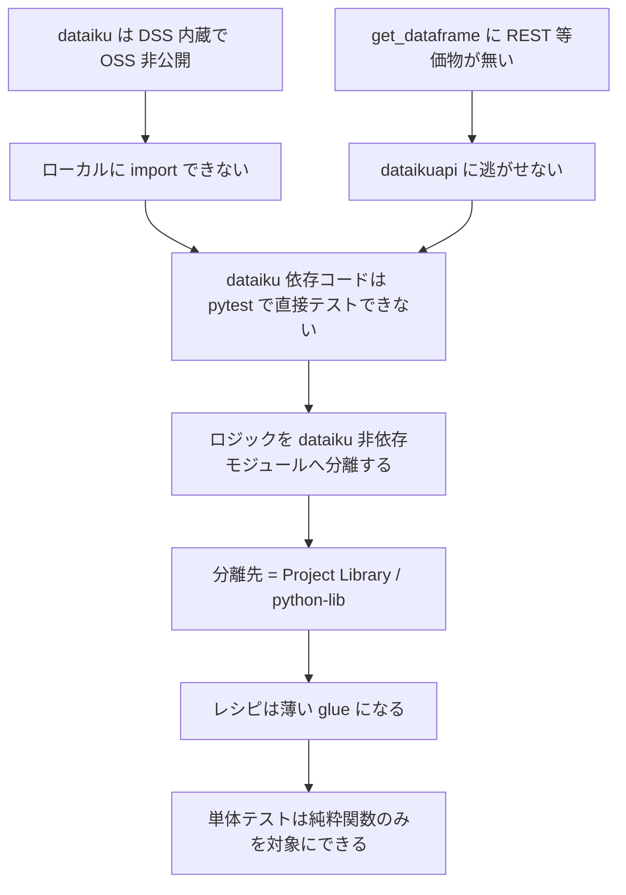
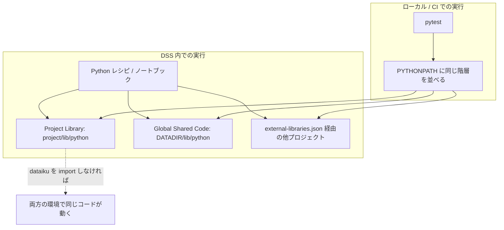

# 02. Project Libraries と「薄いレシピ / 厚いライブラリ」

[01-two-api-packages.md](01-two-api-packages.md) が示したとおり、`dataiku` 内部 API はモックが極めて困難である。その制約下で唯一機能する設計が「ロジックを `dataiku` 非依存の純粋モジュールに逃がす」ことであり、その**逃がし先**が Project Library である。

本レポートは、Project Library の構造・import 機構・共有機構を整理したうえで、「recipes thin / libraries thick」がなぜ**単なるスタイルの好みではなく、テスト可能性を決定する load-bearing な設計判断**なのかを論じる。

## 2.1 なぜ Project Library がテストの主題になるのか

因果関係を先に示す。



つまり Project Library は「便利な共通化の置き場」である以前に、**テスト可能性を成立させるための構造的な必需品**である。

## 2.2 Project Library の構造

- 一次情報: [Python import from Library](https://community.dataiku.com/discussion/29747/python-import-from-library)（Community、project library の import パス意味論）
- 一次情報: [Running unit tests and dealing with project paths](https://community.dataiku.com/discussion/24210/running-unit-tests-and-dealing-with-project-paths)（Community、PYTHONPATH トリックの一次情報）
- 一次情報: [Working with Git](https://doc.dataiku.com/dss/latest/collaboration/git.html)（公式ドキュメント、プロジェクト・ライブラリ・プラグインの Git 連携）
- 一次情報: [知って得する！Dataiku DSSの便利機能 4選＋α](https://www.keywalker.co.jp/blog/dataiku-tips-kw01.html)（Blog、Libraries による共有 Python コード管理）

### `lib/python/` —— プロジェクトごとのライブラリ

各 DSS プロジェクトは自身のライブラリ領域を持ち、その Python 部分が `lib/python/` に置かれる。ここに置かれたモジュールは、そのプロジェクトの Python レシピ・ノートブック・シナリオから直接 import できる。

```text
<project>/
  lib/
    python/
      uplift/
        __init__.py
        features.py        # 純粋な pandas ロジック
        evaluation.py      # uplift 指標の計算（Qini など）
      io_helpers.py        # dataiku 依存の薄い glue（テスト対象外）
```

レシピからの import は、`lib/python/` が import ルートになる。

```python
# Python レシピ内
from uplift.features import build_uplift_features
from uplift.evaluation import qini_curve
```

> **精度の注記**: import パスの厳密な意味論（サブディレクトリの扱い、`__init__.py` の要否など）については、Community スレッド [Python import from Library](https://community.dataiku.com/discussion/29747/python-import-from-library) が一次情報である。gather 出力はこのスレッドの存在と主題（「project library の import パス意味論」）を記録しているが、スレッド内の個別の結論までは要約していない。実装時には当該スレッドと公式ドキュメントで裏を取ること。

### DSS データディレクトリ上の実体

Community の [Running unit tests and dealing with project paths](https://community.dataiku.com/discussion/24210/running-unit-tests-and-dealing-with-project-paths) が示す **PYTHONPATH トリックの一次情報**として、gather は次の具体的な指定を記録している。

```bash
export PYTHONPATH=$PYTHONPATH:/path/to/<DATADIR>/lib/python
```

これが意味するのは、**プロジェクトライブラリは DSS データディレクトリ配下の実ファイルであり、PYTHONPATH に足せば DSS の外からでも import できる**ということである。この一点が、後述する公式パターン（[03-official-testing-pattern.md](03-official-testing-pattern.md)）の技術的土台になっている。

なお、上記のパスは `<DATADIR>/lib/python` すなわち**インスタンスレベルの共有ライブラリ**を指す点に注意。プロジェクト固有のライブラリとインスタンス共有ライブラリは別の階層である。

## 2.3 Global Shared Code —— インスタンス横断の共有

プロジェクト固有の `lib/python/` に対し、DSS インスタンス全体で共有されるライブラリ領域が存在する。上記 PYTHONPATH の例に現れる `<DATADIR>/lib/python` がこれにあたる。

| 階層 | スコープ | 用途 |
|------|---------|------|
| Global Shared Code（`<DATADIR>/lib/python`） | インスタンス全体 | 全プロジェクト共通のユーティリティ、社内標準の前処理など |
| Project Library（`<project>/lib/python`） | 単一プロジェクト | そのプロジェクト固有のロジック |
| External Libraries | プロジェクト間の明示的な参照 | 他プロジェクトのライブラリを取り込む（後述） |

日本語資料としては [知って得する！Dataiku DSSの便利機能 4選＋α](https://www.keywalker.co.jp/blog/dataiku-tips-kw01.html) が Libraries による共有 Python コード管理を扱っているが、gather の総括にあるとおり、**Python API のテスト・モック・CI/CD を主題とする日本語記事は発見できておらず**、日本語資料は入門・レシピ・Code Env 止まりである。本クラスタの中心論点は英語資料に依存する。

## 2.4 `external-libraries.json` —— プロジェクト間の import

プロジェクト A のライブラリをプロジェクト B から使いたい場合、B 側の設定でその参照を宣言する。この設定が `external-libraries.json` である。

> **不確実性の保存**: gather 出力のリソース一覧には、`external-libraries.json` のスキーマを直接記述した一次情報は含まれていない。ファイル名と役割（プロジェクト間 import の宣言）は本クラスタの前提知識として扱うが、**具体的なキー構成・記法は gather では検証されていない**。実装時には [Working with Git](https://doc.dataiku.com/dss/latest/collaboration/git.html) および Dataiku 公式のライブラリ関連ドキュメントで確認すること。以下の構造説明は概念レベルに留める。

概念的には次の 2 種類の参照を宣言する。

| 参照の種類 | 内容 |
|-----------|------|
| 他プロジェクトのライブラリ | 別プロジェクトの `lib/python/` を import パスに追加する |
| 外部 Git リポジトリ | Git 管理されたライブラリを取り込む（[Working with Git](https://doc.dataiku.com/dss/latest/collaboration/git.html) が扱う範囲） |

### テスト上の含意

プロジェクト間 import が入ると、テスト時の import ルートが複数になる。ローカルで pytest を走らせるには、参照先すべてを PYTHONPATH に並べる必要がある。

```bash
export PYTHONPATH="$PWD/lib/python:/path/to/<DATADIR>/lib/python:/path/to/other_project/lib/python"
pytest tests/
```

これは運用上の摩擦であり、**プロジェクト間参照を増やすほどテスト環境の再現が難しくなる**というトレードオフを生む。逆に言えば、テスト容易性を優先するなら、共有したいロジックは Git 管理された独立パッケージとして切り出し、通常の Python 依存として扱うほうが素直である——ただしこれは本レポートの推論であり、公式がそう述べているわけではない。

### Automation ノードでの再現

- 一次情報: [Concept | Automation node preparation](https://knowledge.dataiku.com/latest/mlops-o16n/project-deployment/concept-automation-node-preparation.html)（公式 KB）

gather はこのリソースを「**Git 由来 project library を含むノード準備**」と要約している。すなわち、Design ノードで動いていたライブラリ参照が Automation ノードでも解決されるよう、ノード側の準備が必要になる。デプロイ時の落とし穴として認識しておくべき点である（詳細は [06-cicd-deployment.md](06-cicd-deployment.md)）。

## 2.5 import 機構のまとめ



図の下辺が本レポートの結論である。**Project Library に置いたモジュールが `dataiku` を import していない限り、DSS 内でもローカルでも同一のコードが動く。** `dataiku` を import した瞬間、ローカル側の経路が断たれる。

## 2.6 「recipes thin / libraries thick」—— load-bearing な設計判断

- 一次情報: [MLOps best practices for Dataiku](https://community.dataiku.com/t5/Using-Dataiku-DSS/MLOps-best-practices-for-Dataiku/m-p/8048)（Community）

gather はこのスレッドを「**「recipe は小さく、project library を厚く」**」と要約している。これは Community 発の推奨であり、公式ドキュメントの規範ではない点をまず明確にしておく。

しかし本クラスタの調査が明らかにしたのは、**この Community の推奨が、Dataiku 公式のリポジトリ実装と完全に一致している**ということである。

| 出所 | 種別 | 示していること |
|------|------|--------------|
| [MLOps best practices for Dataiku](https://community.dataiku.com/t5/Using-Dataiku-DSS/MLOps-best-practices-for-Dataiku/m-p/8048) | Community | 「recipe は小さく、project library を厚く」と明言 |
| [dss-plugin-template / Makefile](https://github.com/dataiku/dss-plugin-template/blob/main/Makefile) | **公式 GitHub（実地検証済）** | `export PYTHONPATH=$(PWD)/python-lib` でロジックを `dataiku` 非依存に分離 |
| [dss-plugin-template / test_dummy_module.py](https://github.com/dataiku/dss-plugin-template/blob/main/tests/python/unit/test_dummy_module.py) | **公式 GitHub（実地検証済）** | 単体テストが `dataiku` を**一切 import しない** |
| [Running unit tests on project libraries](https://developer.dataiku.com/latest/tutorials/devtools/project-libs-unit-tests/index.html) | 公式 Developer | pytest 公式チュートリアル。ただし**純粋 pandas 関数しかテストしない** |

つまり Community の助言は、公式が**明文化せずに実装で示している**方針の言語化である。

### なぜ「load-bearing」なのか

「レシピを薄く」は、多くの文脈では可読性や再利用性のための一般論——つまり**あれば良い**程度の指針——として語られる。Dataiku においてはそうではない。

| 一般的なコードベースでの「薄いレシピ」 | Dataiku での「薄いレシピ」 |
|---------------------------------------|--------------------------|
| 可読性・再利用性が向上する | **テストが可能になるか、不可能なままかが決まる** |
| 守らなくてもテストは書ける（DI やモックで対処） | 守らなければ**単体テストを書く手段が事実上無い** |
| スタイルの問題 | **構造の問題** |

差を生んでいるのは [01-two-api-packages.md](01-two-api-packages.md) で述べた 3 点である。

1. `dataiku` は OSS 非公開でローカルに import できない
2. モック対象の API 表面が公式ドキュメント経由でしか分からない（gather は**未検証**と明記）
3. `get_dataframe()` に REST 等価物が無く `dataikuapi` に逃がせない

通常のライブラリなら「モックすればいい」で終わる話が、Dataiku では終わらない。だから分離が**必須**になる。これが load-bearing の意味である——この判断を外すと、その上に載っているテスト戦略全体が崩れる。

### 実践としての境界線

境界の引き方は単純である。**`import dataiku` を書いてよいファイルを限定する。**

| 層 | `dataiku` の import | テスト方法 |
|----|-------------------|-----------|
| Python レシピ本体 | **可**（ここだけ） | 単体テスト対象外。結合テスト（実 DSS 上のシナリオ）で担保 |
| `lib/python/` の I/O ヘルパ | 可（ただし最小限） | 同上 |
| `lib/python/` のロジックモジュール | **不可** | pytest で単体テスト |

この線引きが守られていれば、CI での単体テストは DSS を必要としない。守られていなければ、単体テストのために稼働中の DSS が必要になり、それはもはや単体テストではない。

### 逆向きの示唆: テストしにくさは設計の指標になる

この構造には副産物がある。**あるロジックが「テストしにくい」と感じたら、それは `dataiku` 依存がロジック層に漏れているサインである。** 分離の徹底度がそのままテスト容易性のメーターになるため、テストの書きにくさを設計のフィードバックとして使える。

## 2.7 uplift モデリング文脈での適用例

本調査の対象ドメイン（uplift modeling の運用）に即すと、分離すべき層は概ね次のようになる。

| モジュール | `dataiku` 依存 | 内容 | テスト |
|-----------|--------------|------|-------|
| `uplift/features.py` | なし | treatment/control フラグ生成、特徴量エンジニアリング | pytest（純粋 pandas） |
| `uplift/evaluation.py` | なし | Qini 曲線、uplift@k、AUUC の計算 | pytest（数値の期待値を直接検証できる） |
| `uplift/segmentation.py` | なし | スコアからのセグメント割当ロジック | pytest |
| `io_helpers.py` | **あり** | `Dataset` の読み書き、`Folder` へのモデル保存 | 結合テストのみ |
| Python レシピ | **あり** | 上記の glue | 結合テストのみ |

とくに `evaluation.py` の分離価値は高い。uplift 指標の計算は誤りが静かに混入しやすく（treatment/control の取り違え、分母の定義違いなど）、かつ純粋関数として書ける。**`dataiku` から切り離せば、既知の入力に対する期待値をテストで固定できる。** ここを DSS 内でしか動かないコードにしてしまうと、指標の正しさを担保する術が実質的に失われる。

なお、`dataiku.Folder` は [Managed folders](https://doc.dataiku.com/dss/latest/python-api/managed_folders.html)（公式ドキュメント）が扱う API であり、gather はこれを「**学習済みモデル成果物の保存先**」と要約している。モデル保存は本質的に I/O であり、上表のとおり glue 側に押し込むのが正しい。

## 2.8 まとめ

| 論点 | 結論 |
|------|------|
| Project Library の位置づけ | 共通化の置き場である以前に、**テスト可能性を成立させる構造的必需品** |
| 階層 | Global Shared Code（`<DATADIR>/lib/python`）/ Project Library（`<project>/lib/python`）/ `external-libraries.json` によるプロジェクト間参照 |
| ローカルからの import | PYTHONPATH に該当ディレクトリを足せば DSS 外から import 可能（Community が一次情報） |
| プロジェクト間参照の代償 | 参照が増えるほどテスト環境の再現が困難になる |
| recipes thin / libraries thick | Community 発の推奨だが、**公式が `dss-plugin-template` の実装で同じことを示している** |
| なぜ load-bearing か | 一般のコードベースと違い、この分離を外すと**単体テストを書く手段そのものが消える** |
| 実践 | `import dataiku` を書いてよいファイルを限定する。ロジック層では禁止 |

## 参照リソース

| # | タイトル | URL | 種別 |
|---|---------|-----|------|
| 4 | Managed folders | https://doc.dataiku.com/dss/latest/python-api/managed_folders.html | 公式ドキュメント |
| 9 | Running unit tests on project libraries | https://developer.dataiku.com/latest/tutorials/devtools/project-libs-unit-tests/index.html | 公式Developer |
| 24 | dss-plugin-template / Makefile | https://github.com/dataiku/dss-plugin-template/blob/main/Makefile | GitHub |
| 25 | dss-plugin-template / test_dummy_module.py | https://github.com/dataiku/dss-plugin-template/blob/main/tests/python/unit/test_dummy_module.py | GitHub |
| 46 | Concept \| Automation node preparation | https://knowledge.dataiku.com/latest/mlops-o16n/project-deployment/concept-automation-node-preparation.html | 公式KB |
| 47 | Working with Git | https://doc.dataiku.com/dss/latest/collaboration/git.html | 公式ドキュメント |
| 52 | Running unit tests and dealing with project paths | https://community.dataiku.com/discussion/24210/running-unit-tests-and-dealing-with-project-paths | Community |
| 58 | Python import from Library | https://community.dataiku.com/discussion/29747/python-import-from-library | Community |
| 59 | MLOps best practices for Dataiku | https://community.dataiku.com/t5/Using-Dataiku-DSS/MLOps-best-practices-for-Dataiku/m-p/8048 | Community |
| 63 | 知って得する！Dataiku DSSの便利機能 4選＋α | https://www.keywalker.co.jp/blog/dataiku-tips-kw01.html | Blog |
