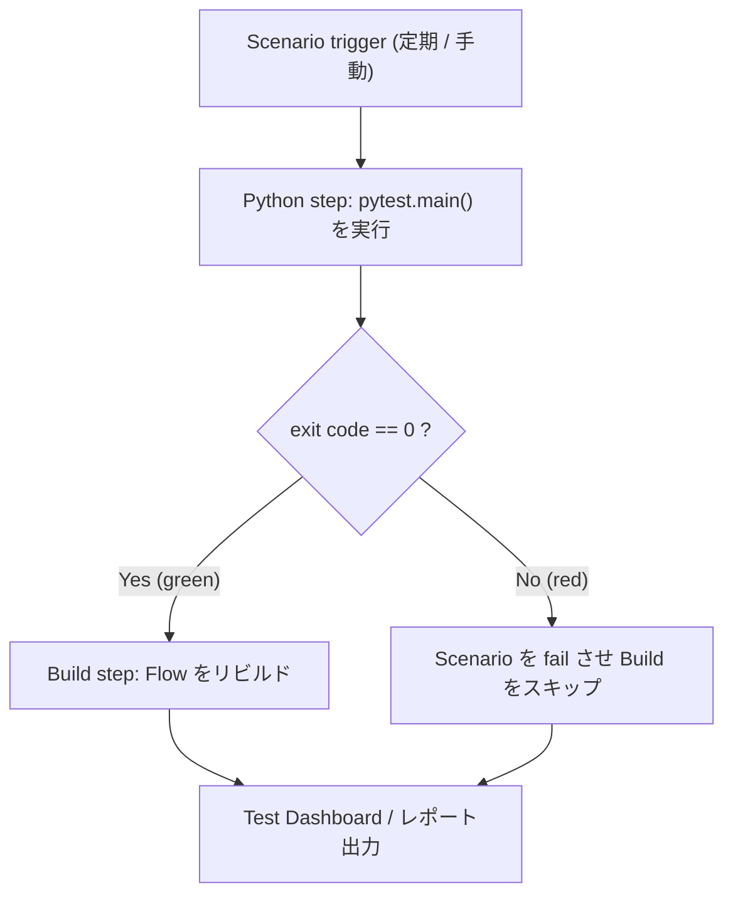
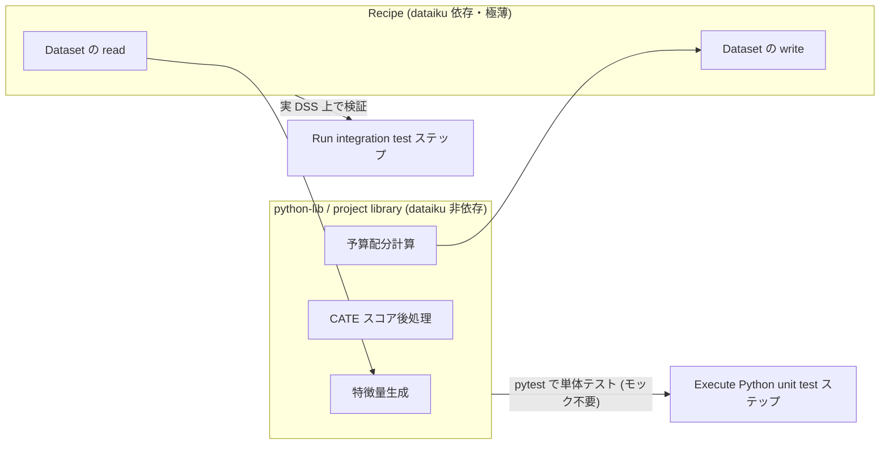

# 公式のテストパターン — なぜ Dataiku は「モックするな」と言っているのか

## 概要

Dataiku には「`dataiku` パッケージをどうモックするか」という問いに対する公式の答えが**明示的には存在しない**。しかし、公式が提供する二つの一次資料 — Developer Guide の pytest チュートリアル（Running unit tests on project libraries）と、公式プラグイン雛形 `dataiku/dss-plugin-template` — を突き合わせると、**沈黙そのものが答えである**ことが見えてくる。

両者に共通するのは、**テスト対象コードが `dataiku` を一度も import していない**という事実である。これは偶然ではなく設計思想の表明であり、Dataiku 公式の暗黙の推奨解は「モックの仕方を学べ」ではなく「**モックが要らない構造にせよ**」である。

本レポートは、公式パターンの構成要素を分解し、その含意を論じ、uplift モデリング運用への適用指針を導く。

| 論点 | 公式の姿勢 | 根拠 |
|------|-----------|------|
| `dataiku.Dataset` の単体テスト | 言及なし（＝範囲外） | チュートリアル・plugin-template ともに触れない |
| モックライブラリの提供 | 提供しない | `dataiku-plugin-tests-utils` にモック機能は皆無 |
| 推奨される単体テスト対象 | 純粋な pandas 変換関数 | 公式チュートリアルの唯一の実例 |
| ロジック分離の手段 | `PYTHONPATH` によるパス注入 | plugin-template Makefile |
| I/O 境界の担保 | 実 DSS 上の結合テスト | `dss_scenario.run` / Run integration test ステップ |

---

## 1. 公式 pytest チュートリアルの構成

出典: [Running unit tests on project libraries](https://developer.dataiku.com/latest/tutorials/devtools/project-libs-unit-tests/index.html)（公式 Developer Guide）

### 1.1 ディレクトリ構成

project library（`lib/python/`）配下に、テスト対象モジュールと `test_*.py` を**同居**させる。

```text
lib/
  python/
    <pkg>/
      __init__.py        # パッケージ化。これが無いと import できない
      <module>.py        # テスト対象（純粋な pandas 変換関数）
      test_<module>.py   # pytest テスト
      pytest.ini         # 設定ファイル
```

ここで重要なのは、テストが**別ディレクトリではなくライブラリ内に置かれる**点である。DSS の project library は Python パッケージとして recipe / notebook から import されるため、テストコードも同じパス解決の下に置くのが最も摩擦が少ない。裏返せば、DSS には「テスト専用のソースルート」という概念が無い。

### 1.2 Build ステップをゲートする

チュートリアルの構成上の要点は、シナリオ内で **`pytest.main()` を実行する Python ステップを先に置き、その戻り値がグリーンのときだけ後段の Build ステップを走らせる**ことである。



この「テストをビルドの前段のゲートに置く」形は、CI における `test → build` の依存関係を、DSS のシナリオという枠の中で再現したものである。**壊れたライブラリコードで Flow をリビルドしてしまう事故を防ぐ**のが目的であり、単にテストを実行するだけの構成とは意味が異なる。

### 1.3 `pytest.ini` の filterwarnings 設定

チュートリアルは `pytest.ini` を置き、`filterwarnings` を設定する。DSS の code env には pandas / numpy をはじめ多数のパッケージが同居しており、DeprecationWarning 等が大量に出る。これらがテスト出力を埋め尽くすと、シナリオのログから本来の失敗理由を読み取れなくなる。

```ini
[pytest]
filterwarnings =
    ignore::DeprecationWarning
```

シナリオのログ画面は pytest のターミナル出力をそのまま流すため、**ノイズ抑制は可読性以上に実用上の必須設定**に近い。とくに Test Dashboard / JUnitXML へ流す場合、警告の混入は下流のパーサ側では取り除けない。

---

## 2. 核心の分析 — 公式が「何をテストしていないか」

ここが本レポートの主張の中心である。

### 2.1 二つの一次資料が示す共通事実

| 資料 | テスト対象 | `dataiku` を import するか | テスト依存 |
|------|-----------|--------------------------|-----------|
| 公式チュートリアル（project-libs-unit-tests） | 純粋な pandas 変換関数 | **しない** | pytest |
| dss-plugin-template `tests/python/unit/` | `dummy_module.dummy_function()` | **しない** | `pytest~=6.2` / `allure-pytest~=2.8` のみ |

`dss-plugin-template` の単体テストは、全文が以下である（出典: [test_dummy_module.py](https://github.com/dataiku/dss-plugin-template/blob/main/tests/python/unit/test_dummy_module.py)）。

```python
from dummy_module import dummy_function


def test_dummy_function():
    dummy_results = dummy_function()
    assert dummy_results == "foo"
```

注目すべきは依存関係である。**`mock` すら入っていない。** 公式が「単体テストのお手本」として提示する雛形に、モックライブラリが存在しないのだ。これは「モックの例を書き忘れた」のではなく、**モックを使う場面がそもそも想定されていない**ことを意味する。

### 2.2 Makefile が明かす設計意図

出典: [dss-plugin-template / Makefile](https://github.com/dataiku/dss-plugin-template/blob/main/Makefile)

```makefile
unit-tests:
	export PYTHONPATH=$(PWD)/python-lib && pytest tests/python/unit
```

この一行が公式パターンの正体である。読み解くと、

1. **`python-lib/` にロジックを置く**。ここは `dataiku` に依存しない純粋な Python コード
2. **`PYTHONPATH` にそのディレクトリだけを通す**。DSS ランタイムも `dataiku` パッケージも視界に入らない
3. **その状態で pytest を実行する**。素の Python プロセスで完結する

つまり `PYTHONPATH` の注入は、便利のためのトリックではなく、**「テスト対象は `dataiku` 無しで動かねばならない」という制約を機械的に強制する装置**である。もしロジックが `dataiku` を import していれば、この Makefile ターゲットは ImportError で即座に落ちる。テストが通るという事実が、そのまま**分離が守られている証明**になっている。

Community でも同型の手法が一次情報として共有されている（[Running unit tests and dealing with project paths](https://community.dataiku.com/discussion/24210/running-unit-tests-and-dealing-with-project-paths)、`export PYTHONPATH=$PYTHONPATH:/path/to/<DATADIR>/lib/python`）。

### 2.3 結論 — 「テストしなくて済む構造にせよ」

三つの事実を重ねる。

| 事実 | 出典 |
|------|------|
| 公式クライアント `dataiku-api-client-python` に `tests/` ディレクトリが**存在しない**（commits 1,524、最終 push 2026-07-13 と活発であるにもかかわらず） | GitHub 実地検証 |
| 公式チュートリアルの単体テスト対象は `dataiku` に触れない純粋関数のみ | Developer Guide |
| 公式プラグイン雛形の単体テストも `dataiku` を import せず、`mock` すら依存に無い | dss-plugin-template |

さらに、Community で `DSSClient` のモック方法を問うたスレッド（[Lib dataiku-api-client-python in unit test mock DSSClient](https://community.dataiku.com/discussion/39164/lib-dataiku-api-client-python-python-in-unit-test-mock-dssclient)）は、**約2年半のあいだ返信ゼロ**のまま放置されている。公式ドキュメントに答えが無いだけでなく、公式・コミュニティのいずれからも回答が出ていない。

したがって、**Dataiku 公式の「`dataiku` コードをどうテストするか」への答えは「テストしなくて済む構造にせよ」である**。

この命題は、一見すると責任放棄に見えるが、設計論としては筋が通っている。`dataiku.Dataset.get_dataframe()` は DSS 内部 API にしか存在せず、`dataiku` パッケージ本体は OSS 公開すらされていない（`dataiku-api-client` とは別物）。モック対象の API 表面を正確に把握する手段が公式ドキュメントしか無い以上、**モックは常に実装との乖離リスクを抱える**。乖離したモックに対して通るテストは、通ること自体が有害である。

Dataiku の回答は、この根本的な検証不能性を、**「モックすべき境界をコードから消し去る」**ことで回避する。`dataiku` に触れるコードを薄く保てば、モックが必要な面積はゼロに漸近する。残った薄い I/O 境界は、モックではなく**実 DSS 上の結合テスト**で担保する。これが一貫した戦略である。



Community の MLOps 議論にある「**recipe は小さく、project library を厚く**」（[MLOps best practices for Dataiku](https://community.dataiku.com/t5/Using-Dataiku-DSS/MLOps-best-practices-for-Dataiku/m-p/8048)）という指針は、この構造の言い換えに他ならない。

---

## 3. 3種のシナリオテストステップ

出典: [Scenario steps](https://doc.dataiku.com/dss/latest/scenarios/steps.html)

DSS はシナリオのステップとして 3 種類のテスト機構を提供する。それぞれ担う層が異なる。

| ステップ | 担う層 | 仕組み | モックの必要性 |
|---------|-------|--------|--------------|
| **Execute Python unit test** | 純粋ロジック | pytest セレクタを指定して project library 内のテストを実行 | 不要（対象が `dataiku` 非依存のため） |
| **Run integration test** | Flow の I/O 境界 | データセットを参照入力に差し替え → リビルド → 参照出力と比較 | 不要（実データセットを差し替えるため） |
| **WebApp test** | 公開エンドポイント | 到達性・GET/POST・MIME/ボディ検証・JSONPath アサーション | 不要（実 HTTP） |

### 3.1 Execute Python unit test

pytest セレクタ（例: `path/to/test_module.py::test_name`）を指定して project library のテストを走らせる。前節で見たとおり、**このステップに載るコードは定義上 `dataiku` 非依存**であり、だからこそ code env に `mock` を入れる必要も生じない。

### 3.2 Run integration test

これが Dataiku における「モックの代替物」である。仕組みは以下の通り。

1. Flow 上の入力データセットを、**参照入力データセット**に差し替える
2. 対象部分を**リビルド**する
3. 出力を**参照出力データセット**と比較する

モックライブラリが担う「入力を固定して出力を検証する」役割を、**DSS のデータセットという第一級概念で実現している**。テストダブルを Python レベルで作るのではなく、Flow レベルで差し替える。これが Dataiku 流の答えである。

この差し替えが効くためには recipe 側の書き方に条件がある。Community の [How to run integration tests on flows with Python recipes](https://community.dataiku.com/discussion/44854/how-to-run-integration-tests-on-flows-with-python-recipes) に、データセット名をハードコードせず参照可能にする書き方（`get_location_info()` 等）が議論されている。

### 3.3 WebApp test

WebApp / API サービスの層を対象とする。到達性チェック、GET/POST リクエスト、MIME タイプおよびレスポンスボディの検証、JSONPath によるアサーションを提供する。

ステップ間の値の受け渡しには `stepOutput_*` 変数を使う（[Variables in scenarios](https://doc.dataiku.com/dss/latest/scenarios/variables.html)）。

---

## 4. Test Dashboard と CI 連携の継ぎ目

出典: [Testing a project](https://doc.dataiku.com/dss/latest/scenarios/test_scenarios.html)

シナリオを「テストシナリオ」として登録すると、結果が **Test Dashboard** に集約される。実務上決定的に重要なのは、この結果が **JUnitXML および HTML でエクスポートできる**点である。

| 出力形式 | 用途 |
|---------|------|
| **JUnitXML** | Jenkins / GitHub Actions / Azure Pipelines が標準でパースできる。**DSS 内テストを外部 CI の合否判定に接続する唯一の実務的な継ぎ目** |
| **HTML** | 人間向けレポート。レビュー・監査証跡 |

JUnitXML はほぼ全ての CI プラットフォームが理解する事実上の標準フォーマットであり、これによって「DSS の中で走ったテスト」が「CI パイプラインのゲート」になる。DSS のテストはブラックボックスに閉じず、外部の CI から観測可能になる。Jenkins / Azure による具体的なパイプライン構成は公式 KB のチュートリアル群（[CI/CD Pipelines](https://knowledge.dataiku.com/latest/mlops-o16n/ci-cd/index.html)）に揃っている。

---

## 5. 推奨フロー — Design で書き、QA Automation で走らせる

出典: [Tutorial | Test scenarios](https://knowledge.dataiku.com/latest/automate-tasks/scenarios/tutorial-test-scenarios.html)


公式が推奨するのは、**テストの「作成」と「実行」を別ノードに分ける**構成である。

| ノード | 役割 | 理由 |
|-------|------|------|
| **Design** | テストシナリオを作成・編集 | 開発の場。ただし Git の外で可変であり、本番判定には使えない |
| **QA / Automation** | テストを実行しレポートを出す | 再現可能な環境。Design と同じ資産がデプロイされたことを保証できる |

Design ノードは**Git の外側で任意に変更され得る**という性質を持つ。公式の GitOps app-note（[Implementing GitOps for Dataiku](https://doc.dataiku.com/app-notes/13/implementing-gitops-for-dataiku/)）が、`dataiku_gitops_action.py` で **Git と Dataiku の commit SHA を照合**してから進行するのは、まさにこの可変性に対する安全弁である。テストを Design ノード上で走らせて満足すると、「テストが通った版」と「デプロイした版」が一致している保証が無い。

---

## 6. 実務上の落とし穴

### 6.1 code env にテスト依存を入れ忘れる — 最頻の失敗原因

出典: [Code environments](https://doc.dataiku.com/dss/latest/code-envs/index.html) / [pyunit test for mock patch in dataiku](https://community.dataiku.com/discussion/20495/pyunitt-test-for-mock-patch-in-dataiku)（Dataiku 社員回答）

**Execute Python unit test ステップが失敗する最頻の原因は、テストコードの不備ではなく、code env に `pytest` / `mock` が入っていないことである。**

シナリオのテストステップはあくまで DSS の code env の中で実行される。ローカルの venv や Makefile が使う環境とは無関係であり、code env の "Packages to Install" に明示的に追加しなければならない。Community では Dataiku 社員が `mock` の追加が必要であることを確認している。

| 実行環境 | 依存の管理場所 |
|---------|--------------|
| ローカル / CI の `make unit-tests` | `requirements.txt` / venv |
| DSS シナリオの Execute Python unit test | **code env の "Packages to Install"** |

この二重管理は自動的には同期されない。ローカルで緑だったテストが DSS 上で ImportError になる、という形で顕在化する。

### 6.2 dss-plugin-template が単体と結合で venv を分ける理由

`dss-plugin-template` の README は、単体テスト用と結合テスト用で **venv を分けることを明記**している。理由は明快である。

> 同一環境だと **`dataiku-plugin-tests-utils` の pytest fixture が単体テスト側と衝突する**ため。

`dataiku-plugin-tests-utils` は pytest プラグインとして実装されており、インストールされているだけで pytest の収集・fixture 解決に介入する。これが `dataiku` 非依存であるはずの単体テスト側にも作用してしまう。

| venv | インストールするもの | 実行対象 |
|------|-------------------|---------|
| 単体テスト用 | `pytest~=6.2` / `allure-pytest~=2.8` のみ | `tests/python/unit` |
| 結合テスト用 | 上記 + `dataiku-plugin-tests-utils` | `tests/python/integration` |

ここにも 2.3 節の思想が現れている。**単体テストの環境からは DSS 由来のものを一切排除する**。環境レベルでの分離が、コードレベルの分離を裏打ちしている。

なお `dataiku-plugin-tests-utils` 自体は実用上の難点を抱える（[リポジトリ](https://github.com/dataiku/dataiku-plugin-tests-utils)）。commits 19 / ★0 / **公開リリース 0 件**でありながら README は `@releases/tag/<VERSION>` でのインストールを指示するためその手順は機能せず、`git://` プロトコルの記述も GitHub が 2021 年に廃止済みである。`dss_scenario.run` の実体は**稼働中の DSS 上のシナリオを起動して成否を待つだけ**で、Personal API Key と `PLUGIN_INTEGRATION_TEST_INSTANCE` 環境変数を要求する。**モック機能は一切持たない**。

---

## 7. 本ユースケースへの含意 — uplift モデリング運用

公式パターンをそのまま uplift のワークロードに写像する。要点は、**uplift ロジックの大半が本質的に純粋関数である**ことだ。

| uplift の処理 | 性質 | 配置先 | テスト手段 |
|--------------|------|-------|-----------|
| **特徴量生成** | DataFrame → DataFrame の純粋変換 | project library | pytest（モック不要） |
| **CATE スコアの後処理** | ndarray/Series → Series の純粋変換（クリッピング、キャリブレーション、ランク化） | project library | pytest（モック不要） |
| **予算配分計算** | スコア + 制約 → 配分の純粋な最適化 | project library | pytest（モック不要） |
| Dataset の read / write | I/O（`dataiku` 依存） | recipe（極薄） | Run integration test |
| Saved Model の学習 / 参照 | I/O（`dataiku` 依存） | recipe / シナリオ | Run integration test |
| スコア API の応答 | HTTP 境界 | API サービス | WebApp test |

### 7.1 なぜ uplift は公式パターンと相性が良いか

uplift モデリングで**間違えると事業インパクトが大きい部分**は、そのほとんどが DSS の I/O とは無関係な計算ロジックである。

- 予算配分計算のオフバイワン、境界条件、制約違反
- CATE スコアのクリッピング閾値、符号の取り違え
- 特徴量生成のリーク（treatment 後の情報の混入）

これらはいずれも**入力 DataFrame と期待出力さえあれば検証できる**。`dataiku.Dataset` をモックする必要はどこにも無い。したがって `python-lib` / project library に純粋関数として切り出せば、**公式が最も手厚く整備している pytest 経路にそのまま乗る**。

### 7.2 推奨する構成

```text
lib/python/uplift/
  __init__.py
  features.py            # 特徴量生成（純粋）
  postprocess.py         # CATE スコア後処理（純粋）
  allocation.py          # 予算配分計算（純粋）
  test_features.py
  test_postprocess.py
  test_allocation.py
  pytest.ini
```

recipe 側は「読む・呼ぶ・書く」の 3 行に近づける。

```python
import dataiku
from uplift.postprocess import calibrate_scores

df = dataiku.Dataset("cate_scores_raw").get_dataframe()
out = calibrate_scores(df)  # ← ここが単体テスト済みの純粋関数
dataiku.Dataset("cate_scores").write_with_schema(out)
```

`calibrate_scores` は `dataiku` を知らない。だから `PYTHONPATH=lib/python pytest` で素の Python として検証でき、`dataiku.Dataset` の呼び出しは「テストしない」のではなく「**テストする価値のあるロジックがそこに無い**」状態になる。残った I/O 境界は Run integration test で参照入出力と突き合わせる。

### 7.3 導入時のチェックリスト

| # | 項目 | 根拠 |
|---|-----|------|
| 1 | uplift ロジックを project library の `dataiku` 非依存モジュールに切り出す | plugin-template Makefile |
| 2 | ローカル/CI で `PYTHONPATH` を通して pytest を実行し、分離を機械的に強制する | plugin-template Makefile |
| 3 | `pytest.ini` に `filterwarnings` を設定しシナリオログのノイズを抑える | 公式チュートリアル |
| 4 | **code env に `pytest` を追加する**（最頻の失敗原因） | Code environments / Community 社員回答 |
| 5 | シナリオで pytest ステップを Build ステップの前段に置きゲートにする | 公式チュートリアル |
| 6 | Flow の I/O は Run integration test（参照入出力の差し替え）で担保する | Scenario steps |
| 7 | テストは Design で作り、QA/Automation ノードで実行する | Test scenarios チュートリアル |
| 8 | JUnitXML を export して外部 CI の合否判定に接続する | Testing a project |
| 9 | 単体テスト用 venv に `dataiku-plugin-tests-utils` を入れない | plugin-template README |

---

## 8. まとめ

Dataiku のテスト戦略は、ドキュメントに書かれていることよりも、**書かれていないことの方が雄弁**である。

- 公式クライアントに `tests/` は無い
- 公式チュートリアルは `dataiku` に触れないコードしかテストしない
- 公式プラグイン雛形の単体テスト依存に `mock` すら無い
- `DSSClient` のモック方法を問う Community スレッドは2年半返信ゼロ

これらは「ドキュメントの不備」ではなく、一貫した設計方針の帰結として読むべきである。すなわち、**モックすべき境界をコードから消し去り、残った薄い I/O 境界は実 DSS 上の結合テストで担保する**。`PYTHONPATH=python-lib` はその方針を機械的に強制する装置であり、Run integration test はモックの代替として DSS のデータセットという第一級概念を使ったテストダブルである。

uplift モデリングの運用にとって、これは幸運な整合である。事業インパクトの大きいロジック（特徴量生成、CATE スコア後処理、予算配分）はいずれも純粋関数として表現でき、公式が最も手厚く整備した pytest 経路にそのまま乗る。**Dataiku を「テストしにくい環境」と捉えるのではなく、「テストしやすい部分を最大化する設計を要求する環境」と捉える**のが正しい構えである。

## 参照

| 種別 | URL |
|------|-----|
| 公式 Developer | https://developer.dataiku.com/latest/tutorials/devtools/project-libs-unit-tests/index.html |
| 公式ドキュメント | https://doc.dataiku.com/dss/latest/scenarios/test_scenarios.html |
| 公式ドキュメント | https://doc.dataiku.com/dss/latest/scenarios/steps.html |
| 公式ドキュメント | https://doc.dataiku.com/dss/latest/scenarios/variables.html |
| 公式ドキュメント | https://doc.dataiku.com/dss/latest/code-envs/index.html |
| 公式ドキュメント | https://doc.dataiku.com/app-notes/13/implementing-gitops-for-dataiku/ |
| 公式KB | https://knowledge.dataiku.com/latest/automate-tasks/scenarios/tutorial-test-scenarios.html |
| 公式KB | https://knowledge.dataiku.com/latest/mlops-o16n/ci-cd/index.html |
| GitHub | https://github.com/dataiku/dss-plugin-template |
| GitHub | https://github.com/dataiku/dss-plugin-template/blob/main/Makefile |
| GitHub | https://github.com/dataiku/dss-plugin-template/blob/main/tests/python/unit/test_dummy_module.py |
| GitHub | https://github.com/dataiku/dataiku-api-client-python |
| GitHub | https://github.com/dataiku/dataiku-plugin-tests-utils |
| Community | https://community.dataiku.com/discussion/24210/running-unit-tests-and-dealing-with-project-paths |
| Community | https://community.dataiku.com/discussion/20495/pyunitt-test-for-mock-patch-in-dataiku |
| Community | https://community.dataiku.com/discussion/39164/lib-dataiku-api-client-python-python-in-unit-test-mock-dssclient |
| Community | https://community.dataiku.com/discussion/44854/how-to-run-integration-tests-on-flows-with-python-recipes |
