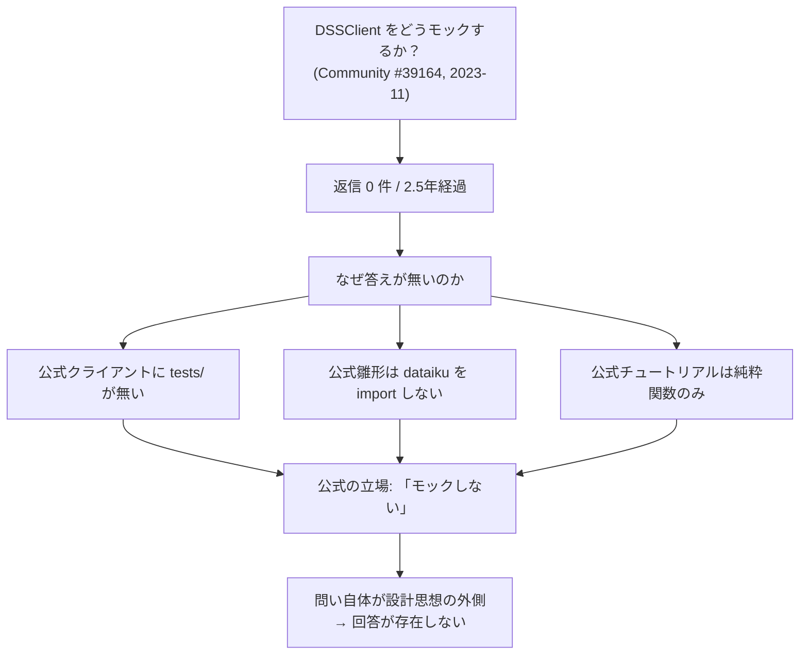
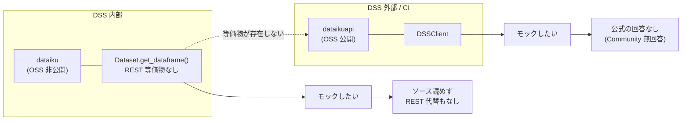
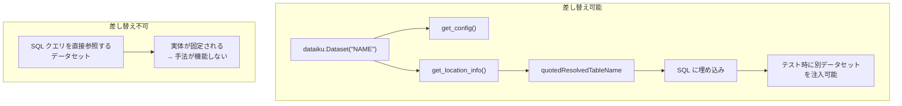
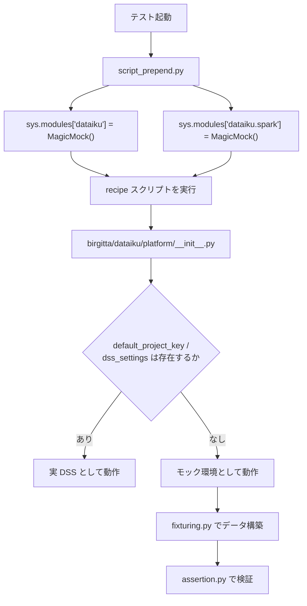
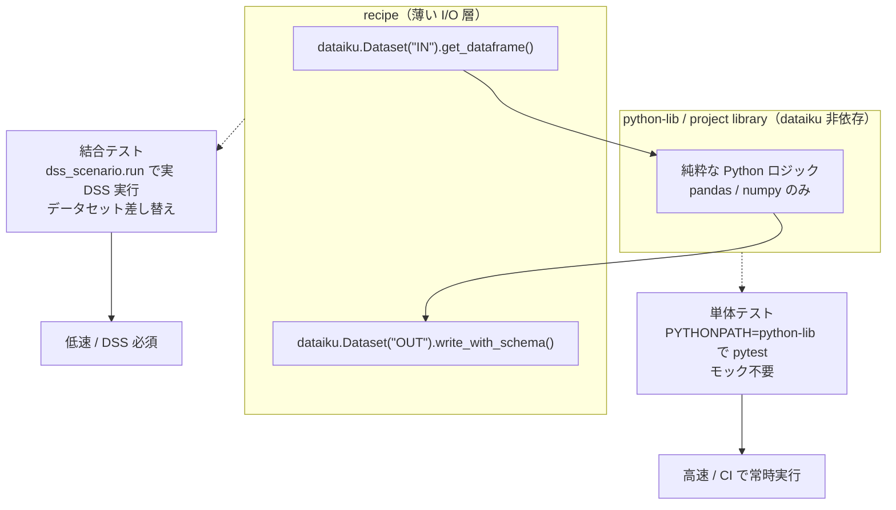

# モックの現実 — 公式ドキュメントの空白地帯

Dataiku Python API の単体テストにおいて「`dataiku` / `dataikuapi` をどうモックするか」は中心的な実務課題である。しかし本調査（2026-07-15、GitHub REST API / raw ファイル取得および Community 一次情報による実地検証）で明らかになったのは、**この問いに対する公式の回答が存在しないという事実そのもの**である。

本レポートは、その空白の輪郭を一次情報で確定し、コミュニティが独自に確立した手法と、実在する OSS 実装の実用性を評価し、最終的にどの設計を採るべきかを判定する。

## 1. ドキュメントの空白 — 2.5年の無回答というシグナル

### 1.1 返信ゼロのスレッド

Dataiku Community に、まさに本レポートの主題を問うスレッドが存在する。

| 項目 | 内容 |
|------|------|
| タイトル | Lib dataiku-api-client-python in unit test mock DSSClient |
| URL | <https://community.dataiku.com/discussion/39164/lib-dataiku-api-client-python-python-in-unit-test-mock-dssclient> |
| 投稿 | 2023-11 |
| 編集 | 2024-07（投稿者が再度手を入れている＝諦めていない） |
| 返信 | **0 件** |
| 経過 | 約 2.5 年（調査日 2026-07-15 時点） |

問われているのは `DSSClient` と `DSSConnectionSettings` のモック方法である。これは周辺的な話題ではない。`DSSClient` は `dataikuapi` の**入口そのもの**であり、外部から DSS を操作するあらゆるコードが最初に触るオブジェクトである。CI から Dataiku を制御するコードを書けば、必ず `DSSClient` をどう扱うかという問題に突き当たる。

### 1.2 無回答が意味すること

Dataiku Community は社員が回答するスレッドも存在する（後述の #55 が実例）。つまり「誰も見ていない場所」ではない。にもかかわらず、中心的ユースケースへの問いが 2.5 年放置されている。

これは単なる見落としではなく、**組織として回答を持っていない**ことのシグナルと読むべきである。この解釈は、以下の独立した証拠と整合する。

| 証拠 | 内容 | 出典 |
|------|------|------|
| 公式クライアントにテストが無い | `dataiku-api-client-python` に `tests/` ディレクトリが**存在しない**（commits 1,524 / 最終 push 2026-07-13 と活発なのに） | <https://github.com/dataiku/dataiku-api-client-python> |
| 死んだ CI 設定 | `.travis.yml` は全5行で `nosetests` を指定するが、**対象テストが無く、対象 Python は 2.7 / 3.4** | 同上 |
| 公式雛形が `dataiku` を import しない | `dss-plugin-template` の単体テストは `dataiku` を一切 import せず、依存は `pytest~=6.2` と `allure-pytest~=2.8` のみ。**`mock` すら入っていない** | <https://github.com/dataiku/dss-plugin-template/blob/main/tests/python/unit/test_dummy_module.py> |
| 公式チュートリアルが純粋関数しか扱わない | Running unit tests on project libraries は pytest を教えるが、テスト対象は**純粋 pandas 関数のみ** | <https://developer.dataiku.com/latest/tutorials/devtools/project-libs-unit-tests/index.html> |

無回答は「答えられない」のではなく、**「その問いを立てるべきではない」というのが公式の立場**だからである、と解釈するのが最も整合的である。公式は「モックしない」設計を推奨しており、モック方法を問う質問はその設計思想の外側にある。



## 2. なぜモックが難しいのか — 非対称性という根源

### 2.1 二層構造

Dataiku の Python API は 2 パッケージに分かれる。

| パッケージ | 実行場所 | 通信 | OSS 公開 |
|-----------|---------|------|---------|
| `dataiku` | DSS 内部（recipe / notebook / scenario） | DSS 内蔵の内部 API | **非公開** |
| `dataikuapi` | DSS 外部（CI / ローカル / 任意の Python） | REST | 公開（`dataiku-api-client-python`） |

出典: <https://doc.dataiku.com/dss/latest/python-api/index.html>

### 2.2 包含関係ではない

素朴には「`dataiku` は内部用の便利ラッパで、`dataikuapi` が REST 経由で同じことをする」と想像しがちである。**これは誤りである。**

両者は厳密な包含関係になく、**内部 API にしか存在しないメソッドがある**。代表例が `dataiku.Dataset.get_dataframe()` である。

出典: <https://doc.dataiku.com/dss/latest/python-api/datasets.html>

これが問題の核心を作る。

| | モックしたい対象 | REST 等価物 | OSS ソース |
|---|---|---|---|
| `dataiku.Dataset.get_dataframe()` | **まさにこれ**（recipe の入口） | **無い** | **無い** |
| `dataikuapi.DSSClient` | これも（CI コードの入口） | 自身が REST | ある |

つまり、**最もモックしたいもの（recipe が依存する `dataiku` の入口）こそが、REST 等価物を持たず、かつソースも読めない**。この非対称性がモック困難の根源である。

### 2.3 検証不可能性が重なる

さらに `dataiku` パッケージ本体は DSS 内蔵であり **OSS 公開されていない**。したがってモック対象の正確な API 表面（メソッドシグネチャ、戻り値の型、副作用）は**公式ドキュメント経由でしか把握できない**。

忠実なモックを書くには対象の振る舞いを知る必要があるが、その情報源が二次的なドキュメントしかない。これは「モックが難しい」というより「**忠実なモックを書けることを検証できない**」という、より深い問題である。



## 3. コミュニティが確立した手法

公式が空白でも、実務者は手法を確立している。以下はいずれも Community の一次情報に基づく。

### 3.1 `mock` は code env に明示的に入れる必要がある

最も基本的かつ最も見落とされる点。**Dataiku 社員が回答で確認している。**

- Py3: `unittest.mock`（標準ライブラリ）
- Py2: `mock`（外部パッケージ）

いずれにせよ、DSS の code env の **"Packages to Install" に追加する**必要がある。

出典: <https://community.dataiku.com/discussion/20495/pyunitt-test-for-mock-patch-in-dataiku>（社員回答）

関連: <https://doc.dataiku.com/dss/latest/code-envs/index.html> — テスト依存（pytest / mock）の導入先であり、**入れ忘れがテスト失敗の最頻原因**である。

なお、公式雛形 `dss-plugin-template` の単体テスト依存に `mock` が入っていないのは、そもそもモックを使わない設計だからである（第 1.2 節参照）。逆に言えば、モックを使う道を選んだ時点で公式雛形から外れ、code env の管理責任が自分に移る。

### 3.2 PYTHONPATH トリック

DSS 内では `<DATADIR>/lib/python` が PYTHONPATH に含まれるため、project library からの `from foo.bar import fun` が解決する。しかし**DSS 外（ローカル / CI）では同じ import が `ModuleNotFoundError` になる**。

対処は PYTHONPATH の明示設定である。

```bash
export PYTHONPATH=$PYTHONPATH:/path/to/<DATADIR>/lib/python
```

出典: <https://community.dataiku.com/discussion/24210/running-unit-tests-and-dealing-with-project-paths>

CI でも同じ設定が必要になる。これは Dataiku 公式の `dss-plugin-template` が Makefile で行っていることと**構造的に同一**である。

```makefile
export PYTHONPATH=$(PWD)/python-lib
```

出典: <https://github.com/dataiku/dss-plugin-template/blob/main/Makefile>

両者が示すのは同じ原理である。**`dataiku` に依存しない純粋な Python ロジックを PYTHONPATH で解決可能な場所に置き、そこだけをテストする。** Community の PYTHONPATH トリックは project library に対して、公式 Makefile は `python-lib` に対して、同じことをしている。

| | Community (#24210) | 公式 (dss-plugin-template) |
|---|---|---|
| 対象 | project library | plugin の `python-lib` |
| 設定 | `PYTHONPATH=$PYTHONPATH:<DATADIR>/lib/python` | `PYTHONPATH=$(PWD)/python-lib` |
| 目的 | DSS 外で import を解決 | DSS 外で import を解決 |
| 帰結 | 純粋ロジックのみテスト可能 | 純粋ロジックのみテスト可能 |

### 3.3 定義元ではなくインポート先にパッチする

標準の `unittest.mock` 作法だが、Dataiku 文脈で明示された整理として重要である。

`list_users` のような `dataikuapi` のメソッドをモックする際、`dataikuapi` 側にパッチするのではなく、**それを import している自分のモジュール側にパッチする**。

出典: <https://community.dataiku.com/discussion/35559/unit-testing-mock-list-users-method-in-python>

このスレッドで提示された整理が本質的である。

> **「あなたは Dataiku の API をテストしたいのではない」**

テストすべきは自分のコードであり、`dataikuapi` の実装ではない。したがってパッチは自分のコードと Dataiku の境界に置くのが正しい。この視点は、後述の総合判定（I/O 境界の分離）と完全に整合する。

### 3.4 データセット差し替え可能な recipe の書き方

結合テストで入力データセットを差し替えるには、recipe の書き方自体を制約する必要がある。

原則: **`dataiku.Dataset("NAME")` としてハンドルを取得し、そこからテーブル名を導出する。** テーブル名をハードコードしない。

導出には以下を使い分ける。

| メソッド | 用途 |
|---------|------|
| `get_config()` | データセット設定の取得 |
| `get_location_info()` | 実体の所在（接続・スキーマ・テーブル）の取得 |
| `quotedResolvedTableName` | 解決済みテーブル名（SQL に埋め込める形） |

出典: <https://community.dataiku.com/discussion/44854/how-to-run-integration-tests-on-flows-with-python-recipes>

**制約**: この手法は **SQL クエリを直接参照するデータセットでは機能しない**。クエリが実体を固定してしまうため、ハンドル経由の導出が意味を持たなくなる。



## 4. OSS モックの実在 — 事前の見立ての反証

### 4.1 探索結果

GitHub Code Search（認証済 `gh` CLI）および Repo Search による網羅的探索の結果は以下である。

| クエリ | 結果 |
|-------|------|
| `sys.modules["dataiku"]`（コード） | **0 件** |
| `patch("dataiku`（コード） | **0 件** |
| `mock dataiku language:Python` | 127 件（大半は無関係） |
| `MagicMock dataiku language:Python` | 10 件 |
| repo search（`dataiku mock` / `dataiku pytest` / `dataiku stub` / `fake dataiku` 等 6 種） | **全て 0 件** |

`MagicMock dataiku` の 10 件を個別精査した結果、実質的な該当は **2 件のみ**であった。

### 4.2 telia-oss/birgitta — 反証の実体

「`dataiku` の OSS モックライブラリは存在しない」という事前の見立ては、**厳密には反証される**。

| 項目 | 内容 |
|------|------|
| リポジトリ | <https://github.com/telia-oss/birgitta> |
| ライセンス | MIT |
| ★ | 16 |
| commits | 55 |
| created | 2019-09-04 |

核心のコードは `birgitta/recipetest/localtest/script_prepend.py` にある。

```python
sys.modules['dataiku'] = mock.MagicMock()
sys.modules['dataiku.spark'] = mock.MagicMock()
```

出典: <https://github.com/telia-oss/birgitta/blob/master/birgitta/recipetest/localtest/script_prepend.py>

これは `import dataiku` が走る前に `sys.modules` へモックを直接注入する手法である。`dataiku` が OSS 非公開でありインストールすらできない環境でも、import を成立させられる。**第 2 節で述べた「ソースが読めない」問題を、忠実さを諦めることで回避している。**

重要なのは、これが**単なるスニペットではなく体系的フレームワーク**である点である。`localtest/` には以下が揃っている。

| ファイル | 役割 |
|---------|------|
| `script_prepend.py` | `sys.modules` へのモック注入 |
| `conftest.py` | pytest fixture 定義 |
| `fixturing.py` | テストデータの構築 |
| `assertion.py` | 結果検証 |

さらに `birgitta/dataiku/platform/__init__.py` は、**`default_project_key` / `dss_settings` の有無で実 DSS かモックかを判定する実行環境検出**を持つ。

出典: <https://github.com/telia-oss/birgitta/blob/master/birgitta/dataiku/platform/__init__.py>

これは同一コードを DSS 内でもローカルでも動かすための機構であり、単発のモックを超えた設計上の工夫である。



### 4.3 しかし実用性は限定的

反証は成立するが、実務的な採用可否は別である。

| 制約 | 内容 |
|------|------|
| 更新停止 | **最終 push 2023-11-09** |
| PyPI 停止 | **最終公開 0.1.37 / 2020-09-10** — 5年以上更新なし（<https://pypi.org/pypi/birgitta/json>） |
| 適用範囲 | **PySpark レシピ専用**。汎用 `dataiku` モックではない |
| 位置づけ | Telia の社内発ツール。事実上アーカイブ状態 |

対比として、公式クライアント `dataiku-api-client` は **14.7.1（2026-07-13）** が最新であり活発に更新されている（<https://pypi.org/pypi/dataiku-api-client/json>）。birgitta が最後に PyPI 公開された 2020-09-10 からの API 変化を追随できていないことは明白である。

**結論**: birgitta は**依存先としては採用できないが、手法の実装参照としては有効**である。`sys.modules` 差し替えという手法自体は、実際に動くコードとして検証済みだからである。

## 5. 紛らわしい 2 件 — 何がモックでないか

### 5.1 dataiku-plugin-tests-utils はモックではない

名前から誤解されやすいが、**これはモックの正反対である**。

| 項目 | 内容 |
|------|------|
| リポジトリ | <https://github.com/dataiku/dataiku-plugin-tests-utils> |
| 正体 | 結合テスト用 pytest プラグイン |
| ★ | 0 |
| commits | **19 件のみ** |
| ライセンス | Apache-2.0 |
| created | 2021-02-02 / 最終コミット 2025-07-23 |
| リリース | **0 件** |

`dss_scenario.run` の実体は、**稼働中の DSS 上のシナリオを起動し成否を待つだけ**である。Personal API Key と `PLUGIN_INTEGRATION_TEST_INSTANCE` 環境変数が必須であり、**モック機能は一切持たない**。

出典: <https://github.com/dataiku/dataiku-plugin-tests-utils/tree/master/dku_plugin_test_utils/dss_scenario>

さらに導入手順そのものが機能しない。

| 記述 | 問題 |
|------|------|
| README は `@releases/tag/<VERSION>` でのインストールを指示 | **タグが無いため手順が機能しない**（リリース 0 件） |
| 導入は `git+git://github.com/...` | **`git://` プロトコルは GitHub が 2021年に廃止済**でこれも失敗する |

つまり「実 DSS を要求する」だけでなく、「書かれた通りには入らない」。モックの代替として期待できるものではない。

### 5.2 dss-provisioner は利用例であって提供側ではない

| 項目 | 内容 |
|------|------|
| リポジトリ | <https://github.com/true-north-partners/dss-provisioner> |
| ライセンス | Apache-2.0 |
| 状態 | **2026-02 更新（現役）** |
| 内容 | `unittest.mock.MagicMock` で `dataikuapi` ハンドラを単体テストする |

これは**標準 `unittest.mock` を自前で使っている「利用例」**であり、モックライブラリを提供しているわけではない。第 3.3 節の「インポート先にパッチする」を実践している現代的な実例、という位置づけである。

再利用できるパッケージは無いが、**現役で保守されている点で birgitta より参照価値が高い場合がある**。特に `dataikuapi`（REST 側）をモックする話であれば、こちらが直接の手本になる。

### 5.3 3 件の整理

| リポジトリ | モック提供 | 対象 | 保守状態 | 使い道 |
|-----------|-----------|------|---------|-------|
| telia-oss/birgitta | **する**（`sys.modules` 差し替え） | `dataiku`（PySpark 限定） | 停止（push 2023-11 / PyPI 2020-09） | 手法の実装参照 |
| dataiku/dataiku-plugin-tests-utils | **しない**（実 DSS 実行） | 実シナリオ | リリース 0 / 手順が破綻 | 結合テストの概念参照 |
| true-north-partners/dss-provisioner | **しない**（標準 mock の利用側） | `dataikuapi` | 現役（2026-02） | 利用パターンの手本 |

## 6. 総合判定

### 6.1 4 つの結論

1. **保守された汎用 `dataiku` モックライブラリは存在しない。** 公式にも、サードパーティにも、依存先として採用できるものは無い。

2. **ただし先行例が皆無ではない。** birgitta が `sys.modules` 差し替え手法の実装参照になり、手法自体は動くコードとして検証済みである。「モックは不可能」ではなく「モックは自前で書くことになる」が正確である。

3. **公式の推奨は「モックしない」ことである。** `dss-plugin-template` の Makefile（`export PYTHONPATH=$(PWD)/python-lib`）が示す通り、`python-lib` に純粋な Python ロジックを置き `dataiku` 依存部と分離することで**モックを不要にする**設計が、Dataiku 公式の暗黙の推奨解である。単体テストが `dataiku` を import せず `mock` すら依存に入っていないのは、その帰結である。

4. **したがって「ロジックを `dataiku` 非依存の純粋モジュールへ分離し、I/O 境界のみを結合テストで担保する」設計が公式パターンに整合し最も現実的である。**

この判定は Community の整理とも一致する。「recipe は小さく、project library を厚く」（<https://community.dataiku.com/t5/Using-Dataiku-DSS/MLOps-best-practices-for-Dataiku/m-p/8048>）は、同じ設計を別の言い方で述べたものである。

### 6.2 推奨アーキテクチャ



### 6.3 手法の選択指針

| 状況 | 推奨 | 根拠 |
|------|------|------|
| ビジネスロジックのテスト | **モックしない。** `python-lib` に分離し PYTHONPATH で単体テスト | 公式パターン（dss-plugin-template Makefile） |
| `dataikuapi`（CI コード）のテスト | **標準 `unittest.mock` でインポート先にパッチ** | Community #35559 / dss-provisioner の実例 |
| `dataiku`（recipe 内部）をどうしてもモックしたい | **`sys.modules` 差し替えを自前実装。** birgitta を参照 | 依存先としては採用不可、実装参照としては有効 |
| I/O 境界の検証 | **結合テスト。** `dss_scenario.run` で実 DSS 実行 | dataiku-plugin-tests-utils（ただし導入手順は要自前対応） |
| データセット差し替えが必要 | `dataiku.Dataset("NAME")` からハンドル経由でテーブル名導出 | Community #44854（SQL クエリ直参照では不可） |

### 6.4 実務上の落とし穴

| 落とし穴 | 対処 |
|---------|------|
| code env に `mock` / `pytest` が入っていない | "Packages to Install" に追加（社員が確認、Community #20495） |
| ローカル / CI で `ModuleNotFoundError` | `export PYTHONPATH=$PYTHONPATH:/path/to/<DATADIR>/lib/python` |
| 定義元にパッチして効かない | インポート先にパッチする |
| SQL クエリ直参照データセットで差し替えが効かない | recipe 設計側で回避する（手法の適用外） |
| birgitta を依存に入れる | 5年以上更新停止。参照に留める |
| `dataiku-plugin-tests-utils` を README 通りに入れる | タグ 0 件 / `git://` 廃止済で失敗する |

## 7. 検証できなかった事項

本レポートの判定には以下の限界がある。

| 事項 | 内容 |
|------|------|
| `dataiku` 本体の API 表面 | DSS 内蔵で **OSS 公開されておらず**ソース検証不可。`dataiku-api-client` とは別物。モック対象の正確な API 表面は公式ドキュメント経由でしか把握できない。**忠実なモックが書けるかを原理的に検証できない** |
| GitHub Code Search の索引限界 | Code Search は**デフォルトブランチのインデックス済リポジトリのみが対象**。未インデックスの小規模リポジトリに追加のモック実装が存在する可能性は排除できない |
| Dataiku 社内の非公開テスト | 公式クライアントに `tests/` が無いことは確認したが、社内に非公開のテストが存在するか否かは不明 |
| ライセンス不一致の理由 | `dataiku-api-client-python` は GitHub 上 `NOASSERTION` / PyPI 上 Apache-2.0 と不一致。理由は不明 |
| バージョン不整合 | PyPI 最新 14.7.1 に対し git タグには 14.7.2 が存在（`HISTORY.txt` にも記載）。公開遅延か失敗か判別不能（調査当日のリリースのためタイムラグの可能性が高い） |

ただし、これらの限界は**結論を揺るがさない**。仮に未発見のモック実装があったとしても、公式が「モックしない」設計を推奨している事実（第 1.2 節の 4 つの独立した証拠）は変わらず、第 6.1 節の結論 3・4 は維持される。

## 参考資料

| # | タイトル | URL |
|---|---------|-----|
| 3 | Datasets（`get_dataframe()` は内部 API のみ） | <https://doc.dataiku.com/dss/latest/python-api/datasets.html> |
| 1 | Python APIs（二層構造） | <https://doc.dataiku.com/dss/latest/python-api/index.html> |
| 9 | Running unit tests on project libraries | <https://developer.dataiku.com/latest/tutorials/devtools/project-libs-unit-tests/index.html> |
| 22 | dataiku/dataiku-api-client-python | <https://github.com/dataiku/dataiku-api-client-python> |
| 23 | dataiku/dss-plugin-template | <https://github.com/dataiku/dss-plugin-template> |
| 24 | dss-plugin-template / Makefile | <https://github.com/dataiku/dss-plugin-template/blob/main/Makefile> |
| 25 | dss-plugin-template / test_dummy_module.py | <https://github.com/dataiku/dss-plugin-template/blob/main/tests/python/unit/test_dummy_module.py> |
| 28 | dataiku/dataiku-plugin-tests-utils | <https://github.com/dataiku/dataiku-plugin-tests-utils> |
| 29 | dataiku-plugin-tests-utils / dss_scenario | <https://github.com/dataiku/dataiku-plugin-tests-utils/tree/master/dku_plugin_test_utils/dss_scenario> |
| 30 | telia-oss/birgitta | <https://github.com/telia-oss/birgitta> |
| 31 | birgitta / script_prepend.py | <https://github.com/telia-oss/birgitta/blob/master/birgitta/recipetest/localtest/script_prepend.py> |
| 32 | birgitta / dataiku/platform/`__init__.py` | <https://github.com/telia-oss/birgitta/blob/master/birgitta/dataiku/platform/__init__.py> |
| 33 | true-north-partners/dss-provisioner | <https://github.com/true-north-partners/dss-provisioner> |
| 37 | birgitta (PyPI) | <https://pypi.org/pypi/birgitta/json> |
| 36 | dataiku-api-client (PyPI) | <https://pypi.org/pypi/dataiku-api-client/json> |
| 48 | Code environments | <https://doc.dataiku.com/dss/latest/code-envs/index.html> |
| 52 | Running unit tests and dealing with project paths | <https://community.dataiku.com/discussion/24210/running-unit-tests-and-dealing-with-project-paths> |
| 53 | Lib dataiku-api-client-python in unit test mock DSSClient | <https://community.dataiku.com/discussion/39164/lib-dataiku-api-client-python-python-in-unit-test-mock-dssclient> |
| 54 | Unit Testing: Mock list_users method in Python | <https://community.dataiku.com/discussion/35559/unit-testing-mock-list-users-method-in-python> |
| 55 | pyunit test for mock patch in dataiku（社員回答） | <https://community.dataiku.com/discussion/20495/pyunitt-test-for-mock-patch-in-dataiku> |
| 57 | How to run integration tests on flows with Python recipes | <https://community.dataiku.com/discussion/44854/how-to-run-integration-tests-on-flows-with-python-recipes> |
| 59 | MLOps best practices for Dataiku | <https://community.dataiku.com/t5/Using-Dataiku-DSS/MLOps-best-practices-for-Dataiku/m-p/8048> |
