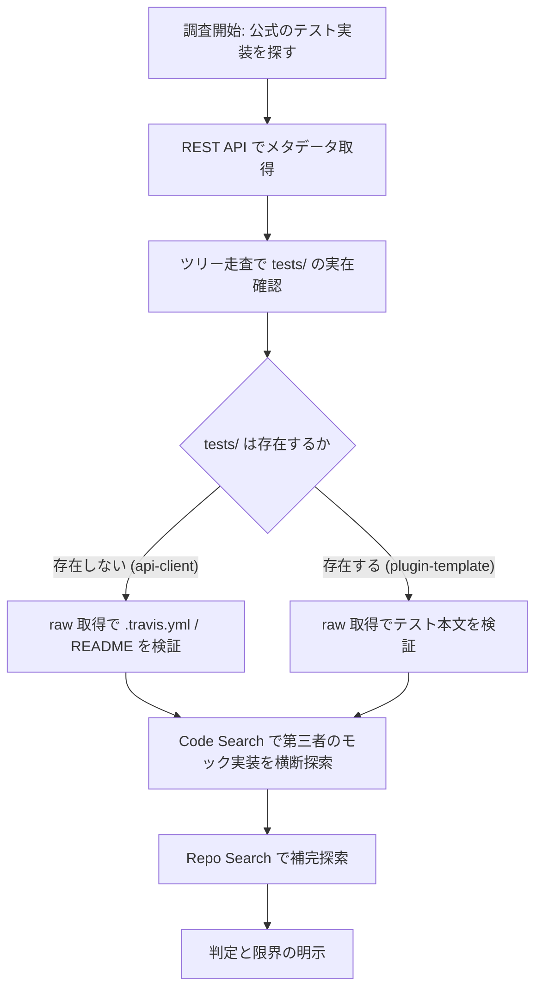
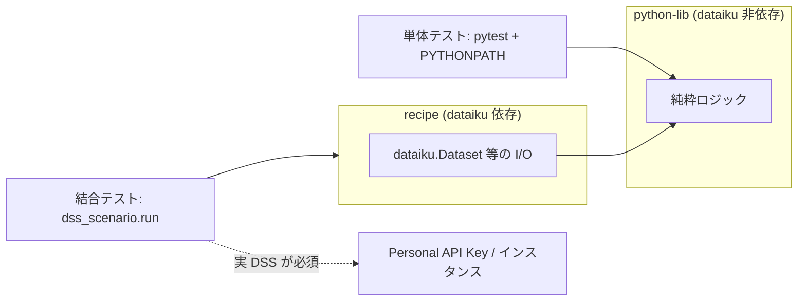

# GitHub 実地検証の結果

Dataiku の Python API 周辺リポジトリについて、GitHub 上の一次情報を実地検証した結果をまとめる。本レポートは「公式クライアントのテストを参照実装にできるか」という問いに対する、直接的な証拠に基づく回答である。

調査日: 2026-07-15。

## 1. 調査手法

### 1.1 用いた手段

| 手段 | 用途 | 取得した情報 |
|------|------|-------------|
| GitHub REST API | リポジトリのメタデータ取得 | star 数 / fork 数 / open issues / commit 数 / created / 最終 push / ライセンス表記 |
| GitHub REST API（releases / tags） | 公開リリースとタグの実在確認 | リリース 0 件・タグのみ、といった乖離の検出 |
| raw ファイル取得 | ファイル内容の直接確認 | `.travis.yml` / `Makefile` / テストコード / README の全文 |
| リポジトリのツリー走査 | ディレクトリ構成の実確認 | `tests/` の存在有無、トップレベル構成 |
| 認証済み `gh` CLI による Code Search | モック実装の横断探索 | `sys.modules["dataiku"]` 等のクエリ結果 |
| 認証済み `gh` CLI による Repo Search | モック系リポジトリの探索 | `dataiku mock` 等6種のクエリ結果 |
| PyPI JSON API | 配布物のメタデータ | バージョン・公開日・依存関係 |

### 1.2 手法の設計意図

「Dataiku 公式は Python API のテストをどう書いているのか」を、ドキュメントの記述ではなく**実際に存在するコードから**確認することを目的とした。ドキュメントは推奨を語るが、リポジトリの構成は実態を語る。両者が食い違うとき、後者を信じるべきだという前提に立っている。

そのため、README やチュートリアルの記述を検証の起点にせず、まずリポジトリのファイルツリーを直接列挙し、`tests/` が実在するかを確認するところから始めた。



## 2. dataiku/dataiku-api-client-python

公式 REST クライアント。URL: <https://github.com/dataiku/dataiku-api-client-python>

### 2.1 メタデータ

| 項目 | 値 |
|------|-----|
| star | 43 |
| fork | 29 |
| open issues | 32 |
| commits | 1,524 |
| created | 2015-07-31 |
| 最終 push | 2026-07-13（`Merge branch 'release/14.7'`） |
| 公開リリース | **0 件**（タグのみで管理、最新タグ 14.7.2） |
| ライセンス表記（GitHub） | NOASSERTION |
| ライセンス表記（PyPI） | Apache-2.0 |

commit 数 1,524、最終 push が調査日の 2 日前という事実は、このリポジトリが**活発に保守されている**ことを明確に示す。放置されたプロジェクトではない。

### 2.2 決定的な発見: `tests/` が存在しない

トップレベルの実際の構成は以下のとおりである。

| 種別 | 実際の中身 |
|------|-----------|
| ファイル | `.gitignore` / `.travis.yml` / `HISTORY.txt` / `LICENSE.txt` / `MANIFEST.in` / `README` / `requirements.txt` / `setup.py` |
| ディレクトリ | `dataikuapi` / `meta` / `module_utils` |

**`tests/` ディレクトリは存在しない。** テストコードは一切含まれていない。

これは「見落とし」や「別ディレクトリ名」ではない。ツリー走査で全トップレベル要素を列挙した結果であり、テストらしきディレクトリは 1 つも無い。

### 2.3 `.travis.yml` の状態

CI 設定ファイルは存在するが、その全文はわずか 5 行で、`script: nosetests` を指定するのみである。ここには二重の問題がある。

| 問題 | 内容 |
|------|------|
| 対象テストが無い | `nosetests` を走らせても実行対象のテストが存在しない |
| 対象 Python が化石 | 指定されている Python は **2.7 と 3.4** |
| ランナーが古い | `nose` は現代の Python エコシステムでは事実上放棄されたテストランナー |

Python 2.7 は 2020 年に、3.4 はそれ以前に EOL を迎えている。1,524 commit を積み、2026 年もリリースを続けているリポジトリの CI 設定が Python 2.7 を対象にしているという事実は、**この CI 設定が長期間まったく参照されていない**ことを意味する。実質的に死んだ設定である。

### 2.4 README の状態

README は **3 行のみ**。テスト・モック・コントリビューションへの言及は皆無である。

「どうテストすればいいか」を知りたい利用者に対して、このリポジトリは何の手がかりも提供していない。

### 2.5 ライセンス表記の不一致

GitHub 上では `NOASSERTION`、PyPI 上では Apache-2.0 と表記されている。

`NOASSERTION` は、GitHub のライセンス検出機構が `LICENSE.txt` の内容を既知のライセンスに機械的に対応づけられなかったことを意味する。ファイル自体は存在するので、ライセンスが無いわけではない。ただし**この不一致の理由は本調査では特定できていない**。実務上は PyPI の Apache-2.0 表記と `LICENSE.txt` の実文面を優先して判断すべきだが、法務レビューが必要な組織では原文の確認を推奨する。

### 2.6 このリポジトリからの結論

> **Dataiku 自身の公式クライアントにはテストが一切存在しない。**

「公式のモック参照実装を読んで真似する」という当初の期待は、**参照すべき対象が物理的に存在しない**という理由で成立しない。

## 3. dataiku/dataiku-plugin-tests-utils

結合テスト用の pytest プラグイン。URL: <https://github.com/dataiku/dataiku-plugin-tests-utils>

### 3.1 メタデータ

| 項目 | 値 |
|------|-----|
| star | 0 |
| open issues | 2 |
| commits | **19 件のみ** |
| ライセンス | Apache-2.0 |
| created | 2021-02-02 |
| 最終コミット | 2025-07-23 |
| 公開リリース | **0 件** |
| PyPI | **未公開** |

commits 19 件・star 0 という数字は、4 年半にわたって存在しながら、ほとんど誰にも使われていないことを示唆する。

### 3.2 インストール手順が機能しない

README は `@releases/tag/<RELEASE_VERSION>` を指定してのインストールを指示している。しかし**リリースもタグも 0 件である**。したがって README の記述どおりに実行しても、参照先が存在せず失敗する。

さらに導入コマンドは `git+git://github.com/...` 形式で記述されているが、**`git://` プロトコルは GitHub が 2021 年に廃止済み**である。この経路でも失敗する。

つまり、この公式ツールは**README の手順が二重の理由で機能しない**状態で放置されている。

| 障害 | 原因 | 結果 |
|------|------|------|
| タグ参照 | リリース・タグが 0 件 | 参照先が存在せず失敗 |
| `git://` プロトコル | GitHub が 2021 年に廃止 | 接続自体が失敗 |
| PyPI | 未公開 | `pip install` の代替経路も無い |

### 3.3 実体はモックではない

`dss_scenario.run` の実装本体（<https://github.com/dataiku/dataiku-plugin-tests-utils/tree/master/dku_plugin_test_utils/dss_scenario>）を確認した結果、その振る舞いは**稼働中の DSS 上のシナリオを起動し、成否を待つだけ**である。

実行には以下が必須である。

| 必須要素 | 内容 |
|---------|------|
| Personal API Key | 実 DSS への認証 |
| `PLUGIN_INTEGRATION_TEST_INSTANCE` | 対象インスタンスを指す環境変数 |

**モック機能は一切持たない。** 名前が「tests-utils」であるため単体テスト支援を期待しがちだが、これは結合テストのトリガーであり、実 DSS が無ければ何もできない。

## 4. dataiku/dss-plugin-template

公式が示す唯一の実働テスト雛形。URL: <https://github.com/dataiku/dss-plugin-template>

### 4.1 メタデータ

| 項目 | 値 |
|------|-----|
| star | 12 |
| commits | 85 |
| ライセンス | Apache-2.0 |
| 最終 push | 2025-09-23 |

### 4.2 テストの構成

`tests/python/unit/` と `tests/python/integration/` に明確に分離されている。CI は **Jenkinsfile と GitHub Actions の二本立て**で用意されている。

| ディレクトリ | 内容 | 実 DSS の要否 |
|-------------|------|--------------|
| `tests/python/unit/` | 純粋ロジックの単体テスト | 不要 |
| `tests/python/integration/` | `dss_scenario.run` による結合テスト | 必要 |

単体と結合で venv を分ける理由は README に明記されており、**同一環境だと tests-utils の pytest fixture が単体テスト側と衝突するため**である。これは前節で見た tests-utils が実 DSS 接続を前提とすることの直接的な帰結であり、設計上の必然と言える。

### 4.3 単体テストの実像

`tests/python/unit/test_dummy_module.py` の全文は以下である。

```python
from dummy_module import dummy_function


def test_dummy_function():
    dummy_results = dummy_function()
    assert dummy_results == "foo"
```

**`dataiku` を一切 import していない。** 依存は `pytest~=6.2` と `allure-pytest~=2.8` のみで、**`mock` すら入っていない**。

### 4.4 Makefile が核心

`unit-tests` ターゲットは `export PYTHONPATH=$(PWD)/python-lib` を設定してから `pytest tests/python/unit` を実行する。

これが意味するのは、**`python-lib` に純粋な Python ロジックを置き、`dataiku` 依存部と分離することで「モックを不要にする」設計**である。これが Dataiku 公式の暗黙の推奨解であり、リポジトリの構成そのものが設計思想を語っている。



## 5. IDE 連携の保守状況

| リポジトリ | star | open issues | 最終更新 | 評価 |
|-----------|------|------------|---------|------|
| dss-integration-vscode | 4 | **28** | 2025-10-27（v1.3.1） | 低メンテナンス |
| dss-integration-pycharm | 2 | 0 | 2025-10-14 | 低メンテナンス |

VS Code 拡張は star 4 に対して **open issues 28** という比率であり、報告された問題に対して対応が追いついていないことを示す。PyCharm 側は open issues 0 だが、star 2 という利用規模から見て、これは「解決済み」ではなく「報告する利用者がほとんどいない」ことの反映と読むべきである。

いずれも最終更新は 2025 年 10 月で、api-client 本体（2026-07-13）とは対照的である。**公式のリソース配分は明らかに IDE 連携に向いていない。**

## 6. Code Search の実行結果と限界

### 6.1 実行結果

認証済み `gh` CLI による Code Search / Repo Search の結果は以下のとおり。

| クエリ | 種別 | 結果 |
|-------|------|------|
| `sys.modules["dataiku"]` | コード | **0 件** |
| `patch("dataiku` | コード | **0 件** |
| `mock dataiku language:Python` | コード | 127 件（大半は無関係） |
| `MagicMock dataiku language:Python` | コード | 10 件 |
| `dataiku mock` / `dataiku pytest` / `dataiku stub` / `fake dataiku` 等 6 種 | リポジトリ | **全て 0 件** |

`MagicMock dataiku` の 10 件を個別に精査した結果、実質的な該当は **telia-oss/birgitta** と **true-north-partners/dss-provisioner** の 2 件のみであった。

### 6.2 注目すべき乖離

`sys.modules["dataiku"]` が 0 件である一方、birgitta には実際に該当コードが存在する。

```python
sys.modules['dataiku'] = mock.MagicMock()
sys.modules['dataiku.spark'] = mock.MagicMock()
```

birgitta の実コードはシングルクォート（`sys.modules['dataiku']`）を用いており、検索クエリはダブルクォートだった。この一件は、**Code Search の 0 件がその手法の不在を意味しない**ことを端的に示している。0 件という結果は「そのクエリ文字列に一致するインデックス済みコードが無い」以上のことを主張できない。

### 6.3 Code Search の限界（明示）

以下の限界を明記しておく。

| 限界 | 影響 |
|------|------|
| **デフォルトブランチのインデックス済リポジトリのみが対象** | 未インデックスの小規模リポジトリ、非デフォルトブランチの実装は検出されない |
| 文字列一致であり意味検索ではない | クォート種別・空白・変数名の差で取りこぼす（6.2 の実例） |
| プライベートリポジトリは対象外 | 企業内の実装は原理的に見えない |

したがって「Code Search で 0 件だったので存在しない」とは結論できない。**未インデックスの小規模リポジトリに追加のモック実装が存在する可能性は排除できない。**

## 7. 検証できなかった事項

以下は本調査で決着させられなかった。不確実性を残したまま記録する。

| 未検証事項 | 状況 | 影響 |
|-----------|------|------|
| `dataiku` パッケージ本体のソース | **OSS 公開されておらず**検証不可（DSS 内蔵、`dataiku-api-client` とは別物） | モック対象の正確な API 表面は公式ドキュメント経由でしか把握できない |
| ライセンス表記の不一致の理由 | GitHub `NOASSERTION` / PyPI Apache-2.0 の乖離理由は不明 | 法務レビューでは原文確認が必要 |
| PyPI 14.7.1 vs git タグ 14.7.2 | `HISTORY.txt` にも 14.7.2 の記載あり。公開遅延か失敗か判別不能 | **調査当日のリリースのためタイムラグの可能性が高い**。後日の再確認で解消される見込み |
| Dataiku 社内の非公開テスト | 存在するか否か確認不能 | 「テストが無い」は「公開されていない」の意。社内品質保証の有無は判断できない |
| 未インデックスのモック実装 | Code Search の構造的限界（6.3） | 網羅性を主張できない |

`dataiku` 本体が OSS 非公開である点は、単なる未検証事項にとどまらない。モックを書こうとする側は、**モック対象の正確な形をソースで確認できない**。ドキュメントに記載された API 表面のみを頼りにモックを構築することになり、記載漏れや内部挙動の差異はモックと実物の乖離として現れる。これはモック戦略そのもののコストを押し上げる構造的要因である。

## 8. この検証が何を意味するか

### 8.1 期待の不成立

当初の期待は「公式クライアントのテストを参照実装にする」ことだった。これは**成立しない**。

| 期待 | 実地検証の結果 |
|------|--------------|
| 公式クライアントにテストがある | `tests/` が存在しない |
| CI がテストを回している | `.travis.yml` は Python 2.7/3.4 対象で対象テスト無し |
| README にテスト方針がある | README は 3 行、言及皆無 |
| tests-utils が単体テストを助ける | 実 DSS 必須、モック機能ゼロ、インストール手順も不通 |

重要なのは、これが**放置の結果ではない**という点である。api-client は 1,524 commit を積み、調査日の 2 日前にもリリースをマージしている。活発に保守されているリポジトリが、意図的にテストを公開していない。これは怠慢ではなく方針と読むのが自然である。

### 8.2 公式の重心は dss-plugin-template にある

テストに関する公式の情報発信は、api-client ではなく **dss-plugin-template** に集中している。

| リポジトリ | テストに関する情報量 | 最終更新 |
|-----------|-------------------|---------|
| dataiku-api-client-python | ゼロ | 2026-07-13（活発だがテスト無し） |
| dss-plugin-template | unit/integration 分離・Makefile・CI 二本立て | 2025-09-23 |
| dataiku-plugin-tests-utils | 結合テストのみ・手順が不通 | 2025-07-23 |

そして dss-plugin-template が示す答えは、**モックを書くことではなく、モックが要らない構造にすること**である。`export PYTHONPATH=$(PWD)/python-lib` という一行が、公式の推奨を最も雄弁に語っている。

### 8.3 実務への含意

この検証から導かれる実務上の判断は次のとおり。

1. **公式クライアントのテストを探すのをやめる。** 存在しない。時間の無駄である。
2. **参照すべきは dss-plugin-template の Makefile と unit テストである。** これが公式パターンの唯一の実働例。
3. **モック実装の先行例は皆無ではない。** birgitta が `sys.modules` 差し替え手法の実装参照として使える。ただし PySpark 専用・2023 年で停止しており、そのまま採用するものではなく手法の参照点として扱う。
4. **`dataiku-plugin-tests-utils` を単体テスト用途で期待しない。** 実 DSS が要る。導入手順も現状では機能しない。
5. **ロジックを `dataiku` 非依存の純粋モジュールへ分離し、I/O 境界のみを結合テストで担保する設計**が、公式パターンに整合し、かつ最も現実的である。

最後に、この検証結果を過度に否定的に読むべきではないことを付言する。「公式にテストが無い」は「テストが不可能」を意味しない。公式が示しているのは**別の答え**であり、それは分離設計という、モックより堅牢な解でもある。問題は、その答えがドキュメントではなく Makefile の一行にしか書かれていないことにある。
