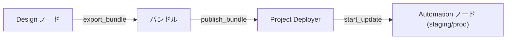
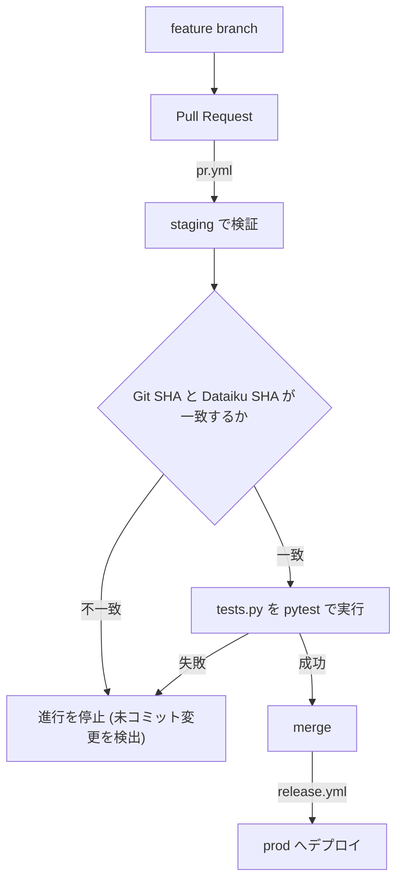
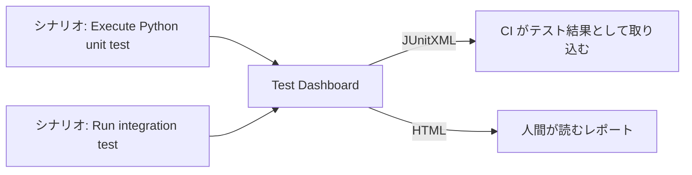
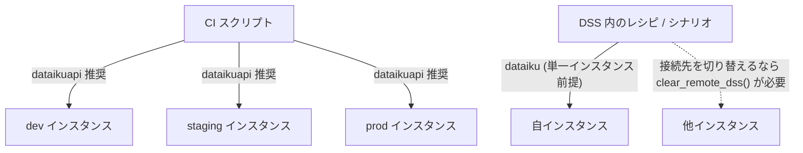
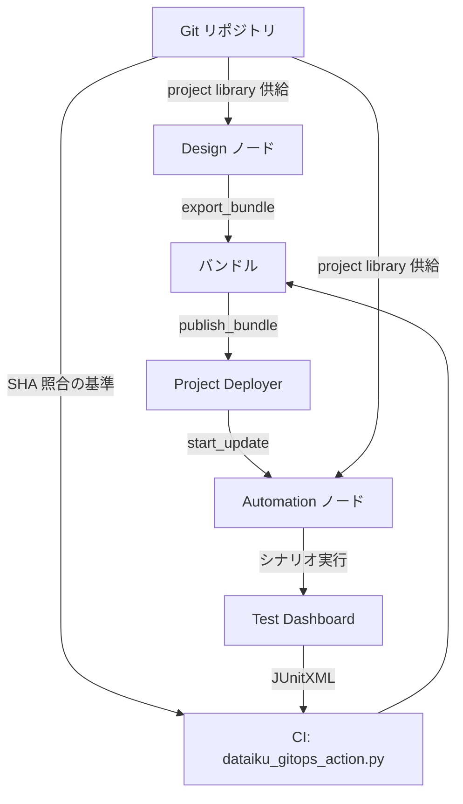

# CI/CD とデプロイ

Dataiku のプロジェクトを Design ノードから本番へ運ぶ経路と、その途中でテストをどこに差し込むかを整理する。テスト戦略が「書けるか」の問題だとすれば、CI/CD は「回せるか」の問題である。

## 1. Project Deployer — 配備の基本経路

DSS 9 以降、プロジェクトの配備は Project Deployer を経由する。参照: <https://developer.dataiku.com/latest/concepts-and-examples/project-deployer.html>

### 1.1 三段階の API

| 段階 | 呼び出し | 役割 |
|------|---------|------|
| 1 | `export_bundle` | Design ノード上でプロジェクトのバンドルを生成 |
| 2 | `publish_bundle` | 生成したバンドルを Deployer へ登録 |
| 3 | `start_update` | 対象の Automation ノードへ配備を反映 |

API リファレンスは <https://developer.dataiku.com/latest/api-reference/python/project-deployer.html> にある。

### 1.2 生 REST か Python クライアントか

生の REST を直接叩くことも可能だが、**Python クライアントが強く推奨される**。バンドル生成・publish・update の各段階は状態遷移を伴い、生 REST ではそれぞれのエンドポイント・ペイロード・完了待ちを自前で組む必要がある。クライアントはこれを 3 つのメソッド呼び出しに畳んでいる。



## 2. GitOps app-note (v13) — 最も完成された GitHub Actions 事例

<https://doc.dataiku.com/app-notes/13/implementing-gitops-for-dataiku/>

公式が示す CI/CD 事例のうち、**GitHub Actions で最も完成度が高いのがこの app-note である**。他のチュートリアルが Jenkins や Azure Pipelines を扱う中で、GitHub Actions を主題に据えた実装例はここに集約されている。

### 2.1 環境とブランチの対応

| 環境 | 役割 |
|------|------|
| dev | 開発 |
| staging | PR 時点での検証先 |
| prod | merge 後の配備先 |

フローは **feature branch → PR → prod** である。

| ワークフロー | トリガー | 動作 |
|-------------|---------|------|
| `pr.yml` | PR | **staging で検証** |
| `release.yml` | merge | **prod へデプロイ** |

PR の時点で staging に実際に配備して検証し、通ったものだけが merge され prod に行く。検証と配備が同じ機構で行われるため、「staging では通ったが prod で落ちる」の余地が構造的に小さい。

### 2.2 `dataiku_gitops_action.py`

このスクリプトが実務の中核を担う。

| 担当 | 内容 |
|------|------|
| バンドル生成 | `export_bundle` 相当 |
| publish | Deployer への登録 |
| テスト実行 | プロジェクトごとの `tests.py` を promotion 時に pytest で実行 |

プロジェクトごとの `tests.py` が **promotion のタイミングで pytest により走る**。テストが「配備の門番」として機能する設計である。

### 2.3 commit SHA 照合という安全弁

この app-note で最も注目すべき設計は、**Git と Dataiku の commit SHA を照合してから進行する**点である。

なぜこれが効くのか。**Design ノードは Git の外側で可変だからである。** 誰かが GUI 上でレシピを編集すれば、Design ノードの状態は Git のどのコミットとも一致しなくなる。CI が Git のコードだけを見てバンドルを作ると、実際に配備されるのは「Git にない何か」になり得る。

| 照合しない場合 | 照合する場合 |
|--------------|-------------|
| Git の SHA を信じてバンドル生成 | Git の SHA と Dataiku 側の SHA を突き合わせる |
| Design ノード上の未コミット変更が黙って本番へ流れる | 不一致を検出して進行を止める |
| 何が配備されたか事後に追跡できない | 配備物と Git のコミットが 1 対 1 で対応する |

これは形式的なチェックではなく、**GUI で可変な環境に GitOps を適用する際の本質的な安全弁**である。Dataiku のように GUI 編集が第一級の操作である基盤では、この照合が無ければ GitOps は名ばかりになる。



## 3. その他の CI/CD チュートリアル

公式は GitHub Actions 以外にも複数の経路を用意している。

| チュートリアル | 対象 | URL |
|--------------|------|-----|
| Jenkins pipeline with Project Deployer | Deployer 経由の配備 | <https://knowledge.dataiku.com/latest/mlops-o16n/ci-cd/tutorial-jenkins-pipeline-project-deployer.html> |
| Jenkins pipeline without Project Deployer | Automation ノードへの直接配備 | <https://knowledge.dataiku.com/latest/mlops-o16n/ci-cd/tutorial-jenkins-pipeline.html> |
| Jenkins for API services | API services 向け | <https://knowledge.dataiku.com/latest/mlops-o16n/ci-cd/tutorial-jenkins-pipeline-api-services.html> |
| Azure pipeline with Project Deployer | Azure DevOps 版 | <https://knowledge.dataiku.com/latest/mlops-o16n/ci-cd/tutorial-azure-pipeline-project-deployer.html> |
| Getting started with CI/CD | パッケージング→テスト→デプロイ入門 | <https://knowledge.dataiku.com/latest/deploy/scaling-automation/tutorial-getting-started-ci-cd.html> |

ハブは <https://knowledge.dataiku.com/latest/mlops-o16n/ci-cd/index.html>。

### 3.1 Deployer の有無という分岐

Jenkins については **Deployer 有り / 無し**の両方のチュートリアルが用意されている。これは Project Deployer が必須ではなく、Automation ノードへ直接配備する経路も公式に認められていることを示す。

| 経路 | 特徴 |
|------|------|
| Deployer 経由 | バンドルの一元管理・複数ノードへの配備・ロールバックの土台 |
| Deployer 無し | 構成が単純。ノードが少ない場合の選択肢 |

### 3.2 API services 向けの特記

API services のチュートリアルでは、**各ステップが `dataikuapi` で記述される**。プロジェクト配備とは別系統だが、CI から外部操作する基盤が同じ `dataikuapi` である点は共通している。

なお `dss-plugin-template` は Jenkinsfile と GitHub Actions の**二本立て**で CI を持っており、公式側も単一の CI 基盤に絞っていない。組織の既存基盤に合わせて選べる。

## 4. Test Dashboard — CI 連携の継ぎ目

<https://doc.dataiku.com/dss/latest/scenarios/test_scenarios.html>

Test Dashboard は **JUnitXML / HTML 形式でのエクスポート**に対応する。これが CI 連携における実務的な継ぎ目になる。

| 出力形式 | 用途 |
|---------|------|
| JUnitXML | CI（Jenkins / GitHub Actions 等）が機械可読なテスト結果として取り込む |
| HTML | 人間がレポートとして読む |

JUnitXML はテスト結果の事実上の共通フォーマットであり、これを吐ければ CI 側の標準的なテストレポート機構にそのまま乗る。**DSS 内部で回したテストの結果を、CI 側の world に持ち出す唯一の橋**がここである。

### 4.1 シナリオステップとの関係

<https://doc.dataiku.com/dss/latest/scenarios/steps.html> によれば、シナリオには以下のステップがある。

| ステップ | 内容 |
|---------|------|
| Execute Python unit test | pytest セレクタを指定して単体テストを実行 |
| Run integration test | 結合テストの実行 |
| WebApp test | WebApp のテスト |

シナリオで実行 → Test Dashboard に集約 → JUnitXML でエクスポート → CI が取り込む、という連鎖が成立する。運用の流れは Design で作成 → QA Automation ノードで実行 → レポート出力（<https://knowledge.dataiku.com/latest/automate-tasks/scenarios/tutorial-test-scenarios.html>）。



## 5. Code environments — テスト依存の導入先

<https://doc.dataiku.com/dss/latest/code-envs/index.html>

### 5.1 環境ごとに独立している

code env は**環境ごとに独立**している。ここが CI/CD で最も足をすくわれる箇所である。

| 概念 | 内容 |
|------|------|
| Base Packages | **バージョン固定**されたパッケージ群 |
| Requested Packages | 利用者が追加で要求するパッケージ |

**テスト依存は、選択先の env に明示的に追加する必要がある。** ローカルで pytest が通っても、DSS 側の code env に pytest や mock が入っていなければシナリオ実行は落ちる。

### 5.2 これは最頻の失敗原因である

`mock` を code env の "Packages to Install" に追加する必要があることは、Community で Dataiku 社員が明示的に確認している（<https://community.dataiku.com/discussion/20495/pyunitt-test-for-mock-patch-in-dataiku>）。

**テスト依存の入れ忘れがテスト失敗の最頻原因**である。エラーメッセージは単なる `ImportError` として現れるため、「テストが壊れた」ではなく「環境が欠けている」と気づくまでに時間を溶かしやすい。

| 症状 | 実際の原因 | 対処 |
|------|-----------|------|
| シナリオ上でのみ `ImportError` | 対象 code env に依存が無い | Requested Packages に追加して rebuild |
| ローカルは通るが DSS で落ちる | env の分離 | 環境ごとに依存を宣言 |

なお `dss-plugin-template` が単体テストと結合テストで venv を分けているのも同じ系統の話である。README には理由が明記されており、**同一環境だと tests-utils の pytest fixture が単体テスト側と衝突するため**である。環境の分離は Dataiku 側だけでなくローカル側でも要る。

code env の Python API 管理は <https://developer.dataiku.com/latest/concepts-and-examples/code-envs.html> を参照。

## 6. dataiku-api-client のバージョンピン留め

<https://pypi.org/pypi/dataiku-api-client/json>

### 6.1 PyPI の実態

| 項目 | 値 |
|------|-----|
| 最新バージョン | **14.7.1（2026-07-13）** |
| 依存 | `requests<3` と `python-dateutil` のみ |
| `requires_python` | **未指定** |

依存が 2 つだけというのは、CI 環境に入れる上では扱いやすい。

### 6.2 DSS と同期リリースされる

PyPI 14.7.1 は **DSS と同期リリース**されている。ここから直接導かれる実務ルールがある。

> **インスタンスの DSS バージョンに合わせてピン留めすること。**

`requires_python` が未指定であるため、pip は Python バージョンの不整合を警告しない。つまり**インストール時には何のエラーも出ずに、実行時に初めて壊れる**構造になっている。ピン留めは任意ではなく必須と考えるべきである。

```text
# CI の requirements で DSS のバージョンに合わせて固定する
dataiku-api-client==14.7.1
```

### 6.3 バージョン乖離の記録

**PyPI 最新 14.7.1 に対し、git タグには 14.7.2 が存在する**（`HISTORY.txt` にも記載）。公開遅延か失敗かは**判別不能**である。ただし**調査当日のリリースのためタイムラグの可能性が高い**。

実務上は PyPI 側で入手可能な版をピン留めすれば足りるが、DSS 側が 14.7.2 の場合は乖離が残る点を認識しておく。

## 7. マルチインスタンスの注意

CI が複数の DSS 環境（dev / staging / prod）を触る場合、パッケージの選択が効いてくる。

### 7.1 内部クライアントは multi-client safe ではない

| パッケージ | 位置づけ | マルチインスタンス |
|-----------|---------|------------------|
| `dataiku` | DSS 内から使う内部クライアント | **multi-client safe でない**。`dataiku.clear_remote_dss()` が必要 |
| `dataikuapi` | 外部から REST で叩くクライアント | **複数環境を扱うならこちらを推奨** |

`dataiku` は暗黙のグローバル接続状態を持つため、接続先を切り替えるには `dataiku.clear_remote_dss()` を明示的に呼ぶ必要がある。呼び忘れれば、**前の接続先に対して操作が飛ぶ**。

### 7.2 CI で効く理由

これが CI で効くのは、**CI こそが複数環境を 1 プロセス内で触る典型的な文脈だから**である。staging に配備して検証し、続けて prod に配備する — この流れを 1 つのスクリプトで書けば、接続先の切り替えは必ず発生する。

| 状況 | 推奨 |
|------|------|
| DSS 内のレシピ・シナリオから単一インスタンスを操作 | `dataiku` |
| CI から複数環境を操作 | **`dataikuapi`** |

GitOps app-note の `dataiku_gitops_action.py` が CI 側のスクリプトとして書かれていること、Jenkins for API services の各ステップが `dataikuapi` で記述されていることも、この方針と整合する。

二層構造の前提は <https://doc.dataiku.com/dss/latest/python-api/index.html> および <https://developer.dataiku.com/latest/getting-started/dataiku-python-apis/index.html> を参照。認証は <https://developer.dataiku.com/latest/api-reference/python/client.html>。



## 8. Automation node preparation と Git 連携

### 8.1 Automation ノードの準備

<https://knowledge.dataiku.com/latest/mlops-o16n/project-deployment/concept-automation-node-preparation.html>

配備先の Automation ノードは、バンドルを受け取れば動くわけではない。事前準備が要る。特に **Git 由来の project library を含むノード準備**が論点になる。project library が Git から供給される構成では、ノード側でその取得が成立していなければ、バンドルを配備してもインポートが失敗する。

### 8.2 Git 連携

<https://doc.dataiku.com/dss/latest/collaboration/git.html>

Git 連携は 3 つの対象に及ぶ。

| 対象 | 内容 |
|------|------|
| プロジェクト | プロジェクト全体の Git 管理 |
| ライブラリ | project library の Git 供給 |
| プラグイン | プラグインの Git 管理 |

Git 操作自体を Python からプログラム制御する方法は <https://developer.dataiku.com/latest/tutorials/devtools/using-api-with-git-project/index.html> にある。GitOps app-note の SHA 照合は、この Git 連携が存在するからこそ可能になっている。

### 8.3 全体像



## 9. まとめ

| 論点 | 実務上の判断 |
|------|-------------|
| 配備経路 | `export_bundle` → `publish_bundle` → `start_update`。生 REST も可能だが Python クライアントを使う |
| GitHub Actions | **GitOps app-note (v13) が最も完成された事例**。pr.yml で staging 検証、release.yml で prod デプロイ |
| 安全弁 | **Git と Dataiku の commit SHA を照合**。Design ノードが Git 外で可変であるため必須 |
| テストの位置 | プロジェクトごとの `tests.py` を promotion 時に pytest で実行 |
| CI との継ぎ目 | Test Dashboard の **JUnitXML** エクスポート |
| code env | **テスト依存を選択先の env に明示的に追加**。入れ忘れが最頻の失敗原因 |
| バージョン | `dataiku-api-client` は DSS と同期リリース。**DSS バージョンに合わせてピン留め** |
| 複数環境 | 内部クライアントは multi-client safe でない。**CI では `dataikuapi` を推奨** |

CI/CD の観点で見ると、Dataiku のテスト戦略の弱点は「テストが書けないこと」ではなく、**Design ノードが Git の外で可変であること**にある。GitOps app-note の SHA 照合は、この構造的な問題に対する唯一の公式回答であり、GitHub Actions を使うなら真っ先に写経すべき箇所である。
