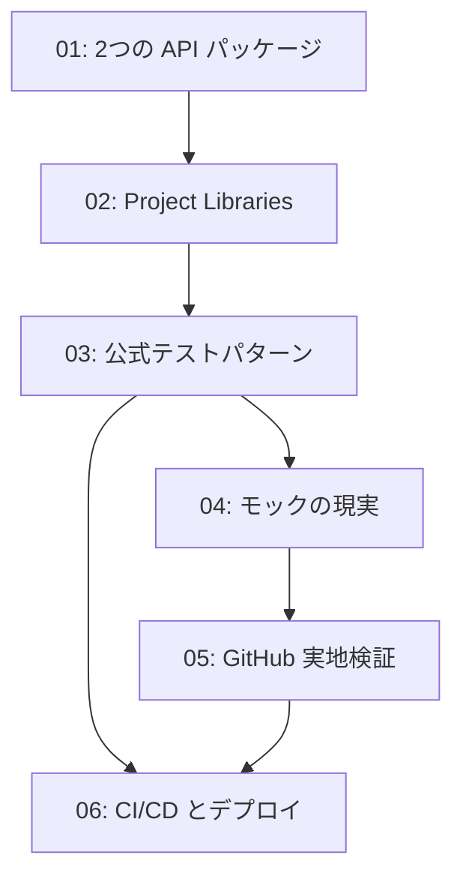

# python_api_testing — 詳細レポート一覧

Dataiku の Python API（`dataiku` / `dataikuapi`）の運用品質——テスト・モック・CI/CD——を主題とする詳細レポート群。すべて `../../../gather/20260715/python_api_testing/resources-python-api-testing.md`（gather 出力、調査日 2026-07-15）に記載された一次情報に基づく。

## 本クラスタの中心命題

このクラスタの調査は、次の一文に収束する。

> **「Dataiku のコードをどうテストするか」という問いに対する公式の答えは、「テストしなくて済むように構造化せよ」である。**

この命題は推測ではなく、Dataiku 公式リポジトリ `dss-plugin-template` の Makefile（`export PYTHONPATH=$(PWD)/python-lib`）と、その単体テストが `dataiku` を一切 import していないという実地検証事実から導かれる。詳細は 03 と 04 を参照。

## レポート一覧

| # | ファイル | タイトル | 主題 | 位置づけ |
|---|---------|---------|------|---------|
| 01 | [01-two-api-packages.md](01-two-api-packages.md) | 2つの API パッケージ: `dataiku` と `dataikuapi` | 役割分担と非対称性、`get_dataframe` に REST 等価物が無いこと、`clear_remote_dss`、バージョンピン留め | 前提知識 |
| 02 | [02-project-libraries.md](02-project-libraries.md) | Project Libraries と「薄いレシピ / 厚いライブラリ」 | `lib/python/`、`external-libraries.json`、Global Shared Code、import 機構 | 設計の土台 |
| 03 | [03-official-testing-pattern.md](03-official-testing-pattern.md) | 公式テストパターンの正体 | pytest チュートリアル、シナリオテストステップ、Test Dashboard / JUnitXML、`dss-plugin-template` の設計思想 | **最重要** |
| 04 | [04-mocking-reality.md](04-mocking-reality.md) | モックの現実 | ドキュメントの空白、コミュニティの回避策、birgitta の `sys.modules` 手法、OSS モックの正直な判定 | **最重要** |
| 05 | [05-github-findings.md](05-github-findings.md) | GitHub 一次情報の実地検証結果 | 公式クライアントにテストが無い、死んだ `.travis.yml`、tests-utils の壊れた導入手順、調査手法とその限界 | 検証記録 |
| 06 | [06-cicd-deployment.md](06-cicd-deployment.md) | CI/CD とデプロイ | Project Deployer、バンドル、GitOps app-note の SHA 照合、Jenkins/Azure、コード環境、バージョンピン留め | 実装指針 |

## 読む順序の推奨

01 と 02 は前提。03 が本命で、04 は 03 の裏面（「公式が推奨しない道を、それでも通らざるを得ない場合」）。05 は 03/04 の主張を支える一次証拠。06 はテストの外側、デプロイまでの継ぎ目を扱う。

## 情報源の信頼区分について

全レポートで、記述の出所を次のように明示する。

| 区分 | 意味 | 本クラスタでの例 |
|------|------|-----------------|
| **公式** | Dataiku 社が公開する doc / developer / knowledge / GitHub | `dss-plugin-template` の Makefile、Test Dashboard の JUnitXML 出力 |
| **公式（実地検証）** | 上記に加え、gather フェーズで GitHub REST API / raw 取得により実物を確認した事実 | `dataiku-api-client-python` に `tests/` が存在しないこと |
| **コミュニティ** | Dataiku Community フォーラムの投稿。社員回答か一般ユーザ回答かを区別する | `mock` を code env に追加する必要（社員が確認） |
| **サードパーティ OSS** | Dataiku 社外の GitHub リポジトリ | telia-oss/birgitta、true-north-partners/dss-provisioner |
| **未検証** | gather 段階で確認できなかった事項。断定しない | `dataiku` パッケージ本体の API 表面、社内非公開テストの有無 |

## gather が「検証できなかった」と明記した事項

以下は本レポート群でも一貫して未検証として扱う。

- `dataiku` パッケージ本体（DSS 内蔵）は **OSS 公開されておらず**、ソース検証不可。モック対象の正確な API 表面は公式ドキュメント経由でしか把握できない
- `dataiku-api-client-python` の GitHub（`NOASSERTION`）と PyPI（Apache-2.0）のライセンス不一致の理由
- PyPI 最新 14.7.1 に対し git タグに 14.7.2 が存在する件（調査当日のリリースのためタイムラグの可能性が高いが、公開遅延か失敗か判別不能）
- Dataiku 社内に非公開のクライアントテストが存在するか否か
- GitHub Code Search はデフォルトブランチのインデックス済リポジトリのみが対象のため、未インデックスの小規模リポジトリに追加のモック実装が存在する可能性は排除できない
