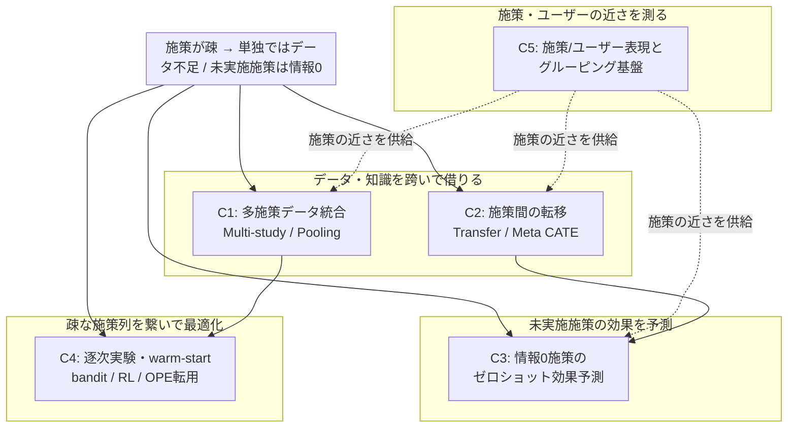

# マーケティング施策間の知識転移・データ統合・情報0施策の効果予測

> 複数のマーケティング施策（クーポン配布・訴求メール等）を跨いでデータを統合・転用し、施策間隔の長さに起因するデータ希薄性を克服する。さらに実施実績のない（情報0の）新規施策の効果を予測する。**uplift model / OPE / RL の手法そのものではなく、施策の「組み合わせ・転用・cold-start予測」の文脈**に焦点を当てた独立リサーチ。

## Research Parameters

- **Research type**: Academic Paper Survey（arXiv 優先、査読論文・ワーキングペーパー含む）
- **Time range**: 2022–2026（一部、基盤となる古典的手法は年代を問わず含む）
- **Generated on**: 2026-07-14
- **Domain**: `uplift_marketing`（前回 run `20260712` とは独立に再実施。append-only で新規作成）
- **Input keywords**: uplift model, off-policy evaluation, 強化学習, クーポン配布, 訴求メール, 複数施策の組み合わせ, 別施策の活用, 情報0施策の効果予測, 施策グルーピング, 施策間隔の短縮, データ量増加
- **Research focus（ユーザー確認済み）**: 施策間の知識転移・データ統合

## Big Picture

ユーザーの課題は「**個々の施策が疎（数ヶ月に1度）で、単独ではデータが不足する**」ことにある。これは因果推論・意思決定最適化の文脈では、**単一の大規模実験の分析問題ではなく、多数の小規模・異質な実験（施策）を跨いで統計的強度を借り合う（borrowing strength）問題**として定式化される。この視点に立つと、関連文献は医療（多施設RCT・新薬）、実験プラットフォーム（テック企業の実験基盤）、レコメンド（大規模action空間・cold-start）の各分野に横断的に存在する。

近年の決定的な進展は、施策（介入）そのものを**特徴量ベクトルで表現**することで、「未実施の施策の効果」をゼロショット予測できるようになった点である（CaML, 2023 の zero-shot causal learning が象徴的）。これにより「情報0施策の予測」は原理的に実現可能な研究テーマとなった。もう一つの潮流は、多数の実験を跨いで CATE を共有・転移する **multi-study / transfer CATE** の系譜であり、施策グルーピングによる擬似的データ拡張のアイデアに直接対応する。

本リサーチはこれらを5クラスタに分割する。C1・C2 が「施策を跨いでデータ・知識を統合する」中核、C3 が「情報0施策のゼロショット予測」という最も先進的かつユーザーの明示要望に合致する領域、C4 が「疎な施策列を逐次的に繋いで学習する」意思決定側の枠組み、C5 が「どの施策が近いか」を定量化しグルーピングを支える基盤技術である。

## Reference Survey/Review Papers

| Title | Year | Summary | Link |
|-------|------|---------|------|
| A unified survey of treatment effect heterogeneity modeling and uplift modeling | 2020 | HTE と uplift を統一的に俯瞰。分割の出発点となる分類体系を提供 | https://arxiv.org/abs/2007.12769 |
| Comparison of methods that combine multiple randomized trials to estimate HTE | 2024 | 複数RCTを結合してCATEを推定する手法の比較サーベイ（C1の中核） | https://onlinelibrary.wiley.com/doi/10.1002/sim.9955 |
| Causal machine learning for predicting treatment outcomes | 2024 | 効果予測のための因果MLの俯瞰。新規介入予測への橋渡し | https://arxiv.org/html/2410.08770v1 |

## Domain Map

## Cluster Summary

| # | Cluster Name | Keyword数 | Summary |
|---|-------------|-----------|---------|
| 1 | 多施策データ統合・エビデンス統合 | 14 | 複数の実験/施策を pool して CATE を推定。random-effects・階層モデル・multi-study R-learner。施策グルーピング＝擬似データ拡張の直接的な理論基盤 |
| 2 | 施策間の知識転移・メタ学習CATE | 13 | 過去施策から新施策へ CATE を転移。transfer learning・meta-learning・異質特徴空間・few-shot。「別施策の活用」の中核 |
| 3 | 情報0施策のゼロショット効果予測 | 12 | 施策を特徴量で表現し、未実施施策の効果を予測。CaML / zero-shot causal / action embedding / cold-start causal。ユーザー最重要要望 |
| 4 | 逐次実験・warm-start による施策連結 | 13 | 疎な施策列を bandit/RL/逐次実験として繋ぐ。過去施策ログで warm-start、long-term は surrogate index で補間 |
| 5 | 施策・ユーザー表現とグルーピング基盤 | 12 | 「どの施策/ユーザーが近いか」を定量化。causal clustering・action representation・transportability。グルーピング判断の土台 |

## Cluster Details

### Cluster 1: 多施策データ統合・エビデンス統合（Multi-study / Data Pooling）

**Overview**: 複数の異質な実験（＝施策）を統合して単一施策では得られない統計的強度を確保する領域。「施策をグルーピングして擬似的にデータ量を増やす」というユーザーの核心アイデアに、最も直接的な理論的裏付けを与える。random-effects meta-analysis、階層ベイズ、multi-study R-learner が中心。施策ごとに対象ユーザーや訴求内容が異なる（＝study間で分布・効果が異質）ことを明示的に扱う手法が近年の焦点。

**Keywords**:
`multi-study R-learner`, `data pooling`, `random-effects meta-analysis`, `hierarchical Bayesian model`, `individual patient data (IPD) meta-analysis`, `combining multiple RCTs`, `partial pooling`, `study heterogeneity`, `shrinkage estimation`, `empirical Bayes`, `federated causal inference`, `cross-study CATE`, `borrowing strength`, `fixed vs random effects`

**Research Strategy**:
- クエリ例: `"multi-study CATE estimation"`, `"combining multiple experiments heterogeneous treatment effect"`, `"partial pooling treatment effect shrinkage"`, `"empirical Bayes many experiments"`
- Brantner et al. 2024（Statistics in Medicine）の比較サーベイを起点に、pooling手法の分類を把握
- multi-study R-learner（PMC12713001）を実装レベルで確認。施策間で propensity/outcome が異なる前提の緩和がポイント
- テック企業側の視点として「多数の弱い実験を跨いだ shrinkage / empirical Bayes」を別途探索（C4と接続）

**Seed resources**:
| Title | Year | Link |
|-------|------|------|
| Comparison of methods that combine multiple RCTs to estimate HTE | 2024 | https://arxiv.org/pdf/2303.16299 |
| Multi-study R-learner for estimating HTE across studies | 2024 | https://www.ncbi.nlm.nih.gov/pmc/articles/PMC12713001/ |

---

### Cluster 2: 施策間の知識転移・メタ学習CATE（Transfer / Meta-learning CATE）

**Overview**: ある施策（source）で学習した効果推定モデルを、別の施策（target）へ転移する領域。「別施策の活用」に直結する。施策間で特徴空間や対象母集団が異なる場合（異質特徴空間の転移）、少数サンプルしかない新施策への few-shot 適応、複数タスクを跨いだメタ学習が含まれる。C1が「同時に pool する」のに対し、C2は「先行施策の知識を後続施策へ移す」非対称な転移である点で区別される。

**Keywords**:
`transfer learning for CATE`, `meta-learning treatment effect`, `heterogeneous feature spaces transfer`, `few-shot CATE`, `domain adaptation causal`, `task-shared / task-specific parameters`, `closed-form meta-learner`, `representation transfer`, `source-target treatment effect`, `MAML for causal inference`, `covariate shift`, `negative transfer`, `multi-task causal learning`

**Research Strategy**:
- クエリ例: `"transfer learning conditional average treatment effect"`, `"meta-learning heterogeneous treatment effect few-shot"`, `"treatment effect estimation heterogeneous feature spaces"`
- Transfer Learning on Heterogeneous Feature Spaces (arXiv:2210.06183) を起点。施策ごとに取得できる特徴が違う実務状況に対応
- Meta-learning with closed-form solvers (arXiv:2305.11353) で few-shot 新施策への適応を確認
- 「negative transfer（似ていない施策からの転移が害になる）」の診断・回避を必ず調べる（C5のグルーピング品質と接続）

**Seed resources**:
| Title | Year | Link |
|-------|------|------|
| Transfer Learning on Heterogeneous Feature Spaces for Treatment Effects Estimation | 2022 | https://arxiv.org/pdf/2210.06183 |
| Meta-learning for HTE estimation with closed-form solvers | 2024 | https://arxiv.org/abs/2305.11353 |

---

### Cluster 3: 情報0施策のゼロショット効果予測（Zero-shot / Cold-start Causal）

**Overview**: **本リサーチの最重要クラスタ**。実施実績が全くない（情報0の）新規施策について、施策そのものを特徴量（クーポン額・訴求文言・対象条件など）で表現し、過去の多数施策から学習したメタモデルで効果をゼロショット予測する領域。CaML（Zero-shot causal learning, NeurIPS 2023）が金字塔。加えて、極端なデータ疎・不均衡下での cold-start 因果推論（ColdNet）も含む。「情報0施策の予測」というユーザーの明示要望に唯一直接答える。

**Keywords**:
`zero-shot causal learning`, `CaML`, `novel intervention effect prediction`, `intervention as features`, `cold-start treatment effect`, `ColdNet`, `causal meta-learning across interventions`, `treatment/action attributes`, `unseen treatment arm`, `meta-model over tasks`, `generalization to new treatments`, `feature-based effect extrapolation`

**Research Strategy**:
- クエリ例: `"zero-shot causal learning novel intervention"`, `"predict effect of new treatment features"`, `"cold-start treatment effect estimation"`
- CaML（arXiv:2301.12292）を精読。「介入を1タスクとしてサンプリングし単一メタモデルを学習」する定式化がユーザー課題の設計図になる
- ColdNet（Amazon Science / ACM）で実務的な極端疎・不均衡への対処を確認
- 施策の特徴量設計（クーポン額・訴求カテゴリ・チャネル）が予測性能を決める → C5の action representation と密接

**Seed resources**:
| Title | Year | Link |
|-------|------|------|
| Zero-shot causal learning (CaML) | 2023 | https://arxiv.org/abs/2301.12292 |
| ColdNet: Treatment effect estimation with cold-start, imbalance, zero-inflated outcomes | 2025 | https://www.amazon.science/publications/coldnet-treatment-effect-estimation-with-cold-start-imbalance-and-zero-inflated-outcomes |

---

### Cluster 4: 逐次実験・warm-start による施策連結（Sequential / Warm-start Decision-making）

**Overview**: 「数ヶ月に1度」という疎な施策列を、独立イベントではなく**逐次的な意思決定過程**として繋ぐ領域。過去施策のログで bandit/RL を warm-start し、cold-start を緩和する。effect が長期（購買LTV等）で観測が遅い問題には surrogate index で短期指標から長期効果を補間する。手法（RL/OPE）そのものではなく、**「過去施策の情報で次施策を初期化・接続する」運用文脈**に絞る。

**Keywords**:
`warm-start contextual bandit`, `sequential experimentation`, `market entry sequential learning`, `causal bandits`, `budget-constrained causal bandits`, `surrogate index`, `long-term effect from short-term proxies`, `proxy / north-star metric blending`, `logged data warm-start`, `prior campaign initialization`, `non-stationary policy`, `transfer across bandit tasks`, `experimentation program optimization`

**Research Strategy**:
- クエリ例: `"warm-start contextual bandit logged data"`, `"sequential learning marketing campaign market entry"`, `"surrogate index long-term treatment effect"`
- Cutting to the chase with warm-start contextual bandits（Springer 2023）で過去ログ活用の初期化を確認
- Surrogate Index（Athey-Chetty-Imbens, NBER w26463）で「短期proxyから長期効果を素早く推定」→ 疎な施策でも早期に学習を回せる
- 施策間隔の長さそのものを緩和する運用設計（施策を跨いだ program 最適化）として位置づける

**Seed resources**:
| Title | Year | Link |
|-------|------|------|
| Cutting to the chase with warm-start contextual bandits | 2023 | https://link.springer.com/article/10.1007/s10115-023-01861-2 |
| The Surrogate Index (Athey, Chetty, Imbens) | 2019 | https://www.nber.org/papers/w26463 |

---

### Cluster 5: 施策・ユーザー表現とグルーピング基盤（Representation & Grouping Foundation）

**Overview**: 「どの施策・どのユーザーが近いか」を定量化し、C1–C3のグルーピング/転移/予測を支える基盤技術。施策（action）を埋め込みベクトルで表現する action representation、効果の似たユーザーを見つける causal clustering、ある母集団の効果を別母集団へ一般化する transportability が中心。ユーザーの「行動傾向や対象ユーザーの近い施策をグルーピング」という発想を、恣意的でなくデータ駆動で正当化する手段を提供する。

**Keywords**:
`action embedding`, `learning action representation`, `causal clustering`, `subgroup discovery`, `transportability`, `generalizability of causal effects`, `covariate shift adaptation`, `customer representation learning`, `RFM segmentation`, `mixture-of-experts consumers`, `policy as mixture over context-action`, `effect-based similarity`

**Research Strategy**:
- クエリ例: `"learning action embeddings off-policy"`, `"causal clustering treatment effect"`, `"transportability of causal effects covariate shift"`
- Learning Action Embeddings for OPE（arXiv:2305.03954）で施策を埋め込む方法論を確認 → 施策の近さ＝埋め込み距離
- causal clustering / subgroup 系で「効果が似たユーザー群」を発見し、施策グルーピングと突き合わせる
- transportability の identification 条件を押さえ、グルーピングが効果推定を歪めない前提を明確化（C1–C3の妥当性ゲート）

**Seed resources**:
| Title | Year | Link |
|-------|------|------|
| Learning Action Embeddings for Off-Policy Evaluation | 2023 | https://arxiv.org/abs/2305.03954 |
| Offline Multi-Action Policy Learning: Generalization and Optimization | 2018 | https://arxiv.org/pdf/1810.04778 |

---

## 次フェーズへの引き継ぎ

- **gather**: C1–C5 の各クラスタについて、上記 seed を起点にリソース一覧を収集。特に C3（情報0施策予測）と C1（多施策統合）を厚めに。
- **retrieval**: 収集リソースのうち、ユーザー課題への実装可能性が高いもの（CaML, multi-study R-learner, warm-start bandit, surrogate index, action embedding）を優先して詳細レポート化。
- **重要な設計原則**: 全クラスタを貫くのは「施策(介入)を特徴量で表現し、施策を跨いで統計的強度を借りる」という一本の軸。手法の羅列ではなく、この軸に沿ってユーザー課題（疎な施策・情報0施策）への適用可能性を評価する。
