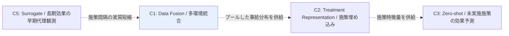

# Cluster 01: Data Fusion / 多環境・多試験統合

[← index](index.md)

## 概要

過去の各マーケティング施策を「独立した小規模実験」とみなし、統計的に情報をプールする系譜である。医療分野の多施設 RCT やメタ分析で成熟した手法群がそのまま転用できる点が、この系譜の実務的な強みとなる。中心概念は完全プール（全施策を同一視する）と完全独立（施策ごとに別モデルを立てる）の中間を取る **partial pooling / 階層ベイズ** であり、施策数が少なく各施策のサンプルも少ない状況で特に効果を発揮する。各施策を「サイト」に見立て、サイトごとのランダム効果を許容しながら全体の事前分布を共有することで、サンプルの薄い施策の推定を全体の情報で補強できる。transportability は「施策 A の対象ユーザー層で得た効果を、対象層の異なる施策 B へ移送できるか」という識別条件を与え、単なる寄せ集めと統計的に正当な統合とを分ける境界線を明示する。exchangeability が成り立たない場合にどこまで部分識別に留めるか、という判断もこのクラスタの守備範囲である。index の Domain Map における位置づけとしては、C2 に対してプールした事前分布を供給する統計的な土台であり、単独で答えを出すクラスタというより他クラスタの前提条件を整備する層にあたる。C5 が施策間隔を実質的に短縮することで、このクラスタが扱う「統合対象となる試験の数」自体も増えていく関係にある。

## キーワード

- 識別条件・理論
  - `data fusion`
  - `transportability`
  - `external validity`
  - `exchangeability`
  - `causal aggregation`
- 統合モデリング
  - `partial pooling`
  - `Bayesian hierarchical model`
  - `random treatment effect per site`
  - `borrowing strength`
  - `multiple environments`
- 医療統計側の語彙
  - `multi-site RCT`
  - `individual participant data meta-analysis`

## このクラスタが本課題に効く理由

- **数ヶ月に一度の低頻度施策**では 1 施策あたりのサンプルが統計的に成立する前に陳腐化するが、partial pooling は「施策単体では足りないが全施策を合わせれば足りる」状況にちょうど適合する。
- **対象ユーザーが施策ごとに異なる**点は、多施設 RCT における「サイトごとに患者層が違う」構造と同型であり、random treatment effect per site の定式化がそのまま使える。
- **訴求内容・クーポン額が異なる**ため完全プールは誤りだが、完全独立ではサンプルが枯渇する。その中間解を原理的に与えるのが階層ベイズであり、本課題の統計的な最低限のラインを担保する。
- **transportability の識別条件**は、「過去施策のデータを新施策の予測に使ってよいか」を感覚ではなく仮定の明示として議論する語彙を提供する。実績ゼロ施策の予測（C3）の正当性を問う際の共通言語となる。
- 部分識別の考え方により、点推定が不可能な場合でも「効果はこの区間に入る」という形で意思決定に足る情報を出せる。低頻度施策で点推定を無理に出すより実務的に安全である。

## 調査戦略

- 識別条件側をまず押さえる。主軸クエリは `"data fusion causal inference survey"` および `"transportability heterogeneous treatment effect"`。
- 医療統計側の用語で検索すると成熟した手法が拾える。`"multi-site RCT random treatment effect"`、`"individual participant data meta-analysis heterogeneity"`、`"borrowing strength hierarchical Bayesian"` を併用する。
- 部分識別・制約ベース統合の探索には `"partial identification causal effects multiple data sources"`、`"causal aggregation constraint-based data fusion"` を用いる。
- 読む順序: Data Fusion for Partial Identification（全体像の把握）→ Meta-Learners for Partially-Identified Treatment Effects Across Multiple Environments（CATE への接続）→ Causal aggregation（制約ベース統合）。
- 注目グループ: Stanford (Athey)、CMU、ETH Zürich。これらの研究室の近年の出版リストを直接辿ると網羅性が上がる。
- マーケティング文脈への読み替えを常に意識する。`site` → `campaign`、`patient` → `user`、`treatment arm` → `クーポン額水準` の対応で検索語を再構成すると、医療側の資産を取り込みやすい。

## 代表リソース

| Title | Type | Year | Summary |
|-------|------|------|---------|
| Data Fusion for Partial Identification of Causal Effects | Paper | 2025 | 複数データ源統合の現況整理と部分識別 |
| Meta-Learners for Partially-Identified Treatment Effects Across Multiple Environments | Paper | 2024 | 多環境からの CATE 推定メタラーナ |
| Causal-ICM: Data Fusion for HTE with Multi-Task GP | Paper | 2024 | マルチタスク GP による実験・観察データ統合 |
| Causal aggregation: constraint-based data fusion | Paper | 2021 | 制約ベースでの因果効果統合 |
| Combining Incomplete Observational and Randomized Data for HTE | Paper | 2024 | 不完全な観察データと RCT の統合 |
| Privacy-preserving Meta-analysis through Low-Rank Basis Hunting | Paper | 2026 | partial pooling を階層線形モデルとして定式化 |
| Clustering and Pruning in Causal Data Fusion | Paper | 2025 | データ源のクラスタリングと枝刈り |

## 隣接クラスタとの関係

本クラスタは Domain Map において統計的な情報プールの土台に位置する。施策をまたいでプールした事前分布を C2（Treatment Representation）へ供給し、C2 はそれを施策特徴ベクトルによるパラメータ共有という形で具体化する。また C5（Surrogate）が長期成果の待ち時間を縮めることで施策間隔が実質的に短縮され、結果として本クラスタが統合対象にできる試験の本数と鮮度が改善する。C1 単独では「実績ゼロの施策」に届かないため、C2 経由で C3 へ接続する経路を前提に読むのが効率的である。

