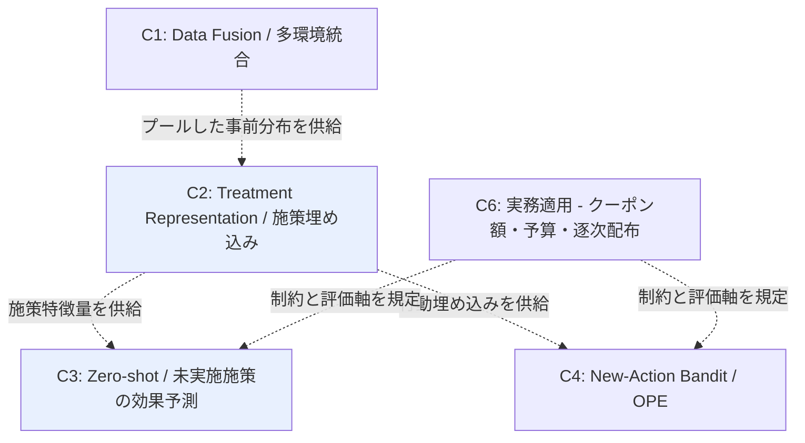

# Cluster 02: Treatment Representation / 施策埋め込み・タスク類似性

[← index](index.md)

## 概要

本ドメインのハブとなるクラスタである。施策を「キャンペーン ID」という不透明な離散ラベルではなく、**特徴ベクトル**（クーポン額、訴求文面、チャネル、対象セグメント条件）として表現することが中核のアイデアである。この持ち上げによって、施策間のパラメータ共有と、類似度に基づく施策のグルーピングが初めて技術的に可能になる。ユーザーが構想する「似た施策をグルーピングして擬似的にデータ量を増やす」という発想は、この系譜の中心的アイデアそのものであり、CISI-Net の task embedding network が最も近い実装にあたる。訴求文面については LLM で埋め込めばテキスト介入として扱え、クーポン額は連続処置として dose-response の枠組みに乗せられるため、異種の施策属性を一つの表現空間に統合できる。施策を ID で扱う限り新規施策はゼロサンプルの新カテゴリでしかないが、特徴ベクトルで扱えば既知施策との距離が定義でき、ここからゼロショット予測（C3）と新規行動の意思決定（C4）が分岐する。index の Domain Map で C2 と C3 が強調表示されているのは、この経路が本課題の主戦場だからである。

## キーワード

- 施策表現の中核
  - `treatment embedding`
  - `task embedding`
  - `structured treatment`
  - `treatment similarity`
  - `intervention-aware representation`
- 共有・学習の枠組み
  - `parameter sharing across treatments`
  - `balanced representation learning`
  - `multi-task learning`
  - `combinations of treatments`
  - `selection bias mitigation`
- 施策のモダリティ別
  - `graph-structured treatment`
  - `text as treatment`
  - `LLM treatment description embedding`

## このクラスタが本課題に効く理由

- **数ヶ月に一度の低頻度施策**では施策 ID ごとの独立モデルは学習不能だが、特徴ベクトル表現に切り替えると全施策のデータが単一のパラメータ集合を共有して学習に寄与する。実質的なサンプル数が施策数倍に増える。
- **訴求内容が施策ごとに異なる**問題は、文面を LLM 埋め込みでベクトル化しテキスト介入として扱うことで、「別物」から「近い/遠い」の連続量へ変換できる。
- **クーポン額が異なる**点は連続処置（dose-response）として表現でき、額の水準ごとに別施策とみなす必要がなくなる。額の内挿・外挿が同一モデル内で扱える。
- **対象ユーザーのグルーピング**とは別に、**施策側のグルーピング**が task embedding の距離として自動的に得られる。ユーザーが手作業で想定していた類似施策のまとめ上げが、データ駆動で定義される。
- **実績ゼロ施策の予測**に対する技術的前提を提供する。施策が特徴ベクトルである限り、未実施施策も既知の特徴空間内の一点として表現でき、C3 のゼロショット予測が成立する。

## 調査戦略

- 主軸クエリは `"treatment embedding causal effect"` と `"structured treatment representation"`。ここから引用ネットワークを両方向に展開する。
- 創薬・遺伝子摂動（perturbation）分野に類似手法が多い。「薬剤 = 施策」の読み替えで転用可能であり、`"perturbation representation learning treatment effect"`、`"drug combination counterfactual representation"` を補助クエリとして用いる。
- 施策のモダリティごとに検索を分ける。テキスト訴求は `"text as treatment causal effect LLM"`、連続処置は `"continuous treatment balanced representation dose-response"`、構造化介入は `"graph-structured treatment individual effect"`。
- 読む順序: CISI-Net（施策類似性の埋め込み）→ NCoRE（施策の組み合わせ）→ GraphITE（構造化介入）→ Estimating Causal Effects of Text Interventions（訴求文面）。
- 実務接続の論点: クーポン額は連続値、訴求内容はテキスト、チャネルはカテゴリ。**マルチモーダルな施策特徴量設計**をどう行うかが最大の設計判断であり、各論文がどのモダリティを前提にしているかを読み分ける。
- selection bias mitigation / balanced representation の系譜は、過去施策のターゲティングが無作為でないことへの対処として押さえる。`"balanced representation learning treatment effect selection bias"`。

## 代表リソース

| Title | Type | Year | Summary |
|-------|------|------|---------|
| Multiple Treatments Causal Effects Estimation with Task Embeddings (CISI-Net) | Paper | 2025 | 施策類似性を埋め込み、施策間パラメータ共有。本課題に最も近い |
| NCoRE: Neural Counterfactual Representation Learning for Combinations of Treatments | Paper | 2021 | 施策の組み合わせに対する反実仮想表現学習 |
| GraphITE: Estimating Individual Effects of Graph-structured Treatments | Paper | 2020 | 構造化介入・ゼロショット介入の効果推定 |
| Estimating Causal Effects of Text Interventions Leveraging LLMs | Paper | 2024 | 訴求文面をテキスト介入として扱う |
| Adversarially Balanced Representation for Continuous Treatment Effect | Paper | 2023 | 連続処置（クーポン額）の表現学習 |
| Causal Estimation for Text Data with (Apparent) Overlap Violations | Paper | 2022 | テキスト介入の overlap 違反への対処 |
| Intervention-Aware Multiscale Representation Learning | Paper | 2026 | 未学習介入・用量変動への汎化 |

## 隣接クラスタとの関係

C2 は Domain Map 全体のハブである。C1 からプールされた事前分布を受け取り、それを施策特徴ベクトル上のパラメータ共有として具体化する。下流では、施策特徴量を C3（Zero-shot 施策効果予測）へ供給して未実施施策の CATE 予測を可能にし、同じ表現を行動埋め込みとして C4（New-Action Bandit / OPE）へ供給して新規行動の評価・選択を可能にする。C6 は連続処置としてのクーポン額やチャネルといった実務上の制約と評価軸を与え、施策特徴量の設計要件を規定する。本課題の主戦場は C2 → C3 の経路であり、C2 を先に読むことで C3 / C4 の前提が揃う。

