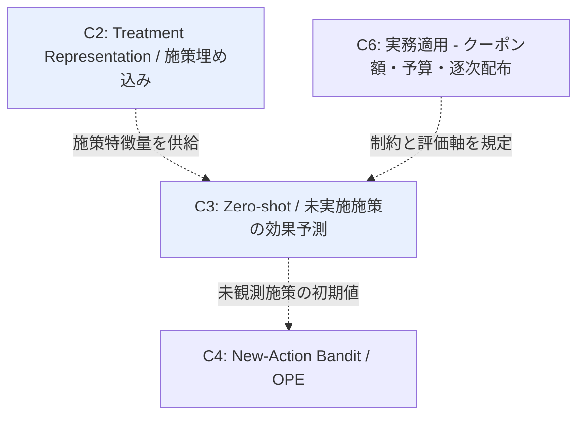

# Cluster 03: Zero-shot 施策効果予測（実績ゼロの施策）

[← index](index.md)

## 概要

ユーザーが明示的に挙げた「実施実績のない情報 0 の施策についての予測」に直接対応するクラスタである。学習時に一度も観測されていない介入について、その **メタ情報（説明文・属性）から効果を予測**することを目的とする。CaML (Zero-shot causal learning) はこの問題設定を確立した代表作であり、施策のメタ情報から未実施介入の個別効果（CATE）を予測する枠組みを与える。CaML は単一介入からの学習を未観測の介入の組み合わせへ汎化させる点まで踏み込んでおり、本ドメインの中核アンカーの一つとして index でも位置づけられている。技術的には C2 の施策埋め込みが前提となる。施策が特徴ベクトルとして表現されて初めて、未実施施策も既知の特徴空間内の一点として扱え、そこへの外挿としてゼロショット予測が定義できるからである。したがって C2 → C3 の順で読むのが効率的であり、index の Domain Map でもこの 2 クラスタが強調されている。この設定を正面から扱う論文は数が限られるため、悉皆的な調査が現実的な戦略となる。最大の実務的論点は手法そのものより評価設計であり、実績ゼロの施策の予測精度をどう検証するかが問われる。

## キーワード

- 問題設定の中核
  - `zero-shot causal learning`
  - `CaML`
  - `unseen treatment`
  - `novel intervention`
  - `zero-shot treatment effect estimation`
- メタ学習・汎化
  - `meta-learning treatment effects`
  - `causal meta-learning`
  - `generalization to unseen intervention combinations`
  - `high-dimensional treatments`
- 施策メタ情報
  - `treatment description`
  - `cold start campaign`

## このクラスタが本課題に効く理由

- **実績ゼロ施策の予測**というユーザーの要求に唯一正面から答えるクラスタである。他クラスタが既存施策の情報をどう活かすかを扱うのに対し、本クラスタは未観測介入への外挿そのものを問題設定として定式化している。
- **訴求内容・クーポン額が施策ごとに異なる**ことが、ここでは障害ではなく資源になる。施策のメタ情報（説明文・属性）が予測の入力そのものであるため、施策ごとの差異が大きいほど特徴空間が張られ、外挿の足場が増える。
- **数ヶ月に一度の低頻度施策**では新施策のたびに事前検証の時間が取れない。ゼロショット予測は施策の実施前に効果を見積もる枠組みであり、次施策の設計判断を打つ前に前倒しできる。
- **対象ユーザーのグルーピング**と組み合わせると、未実施施策 × ユーザーセグメントの CATE 予測となり、「誰にどの新施策を打つか」という実際の意思決定形式に一致する。
- cold start campaign の語彙で特許側の資産（知識転移による新規ノードのコールドスタート解決）にも接続でき、学術と実務の両側から裏付けが取れる。

## 調査戦略

- 主軸クエリは `"zero-shot causal learning"` と `"unseen treatment effect estimation"`。補助として `"novel intervention effect prediction"`、`"treatment effect estimation from treatment description"`、`"generalization to unseen intervention combinations"`。
- **CaML の引用ネットワーク（forward citation）を辿るのが最も効率的**。この設定を扱う論文は数が限られるため悉皆調査が現実的であり、CaML を引用する論文を全件確認する価値がある。
- 高次元処置への汎化は `"causal risk minimization high-dimensional treatments"` で別系統として拾う。
- 特許側は `"knowledge transfer cold start CTR prediction patent"`、`"targeted marketing campaign transfer learning patent"` の語彙で探索し、実務での実装意図を確認する。
- **評価設計が最大の論点**。実績ゼロの施策の予測精度をどう検証するかについて、**leave-one-campaign-out** が定石であり、各論文がどの評価プロトコルを採っているかを必ず記録する。`"leave-one-treatment-out evaluation causal"` で関連議論を拾う。
- 注目グループ: Stanford (Leskovec 研: Nilforoshan, Moor, Roohani)。この研究室の周辺出版を直接辿ると網羅率が高い。
- 前提として C2 を先に読む。施策埋め込みの設計が理解できていないと、本クラスタの手法の差分が読み取れない。

## 代表リソース

| Title | Type | Year | Summary |
|-------|------|------|---------|
| Zero-shot causal learning (CaML) | Paper | 2023 | 未実施介入の個別効果予測。本クラスタの中核 |
| GraphITE | Paper | 2020 | ゼロショット介入を明示的に扱う先行研究 |
| Causal Risk Minimization for High-Dimensional Treatments | Paper | 2026 | 高次元処置への汎化 |
| Estimating Causal Effects of Text Interventions Leveraging LLMs | Paper | 2024 | 施策説明文からの効果推定 |
| Systems and methods for multidimensional knowledge transfer for CTR prediction | Patent | - | 新規ノードのコールドスタートを知識転移で解決 |
| Systems and methods for designing targeted marketing campaigns | Patent | - | 過去施策からの転移学習で新規施策をスコアリング |

## 隣接クラスタとの関係

C3 は C2（Treatment Representation）から施策特徴量の供給を受けて成立する下流クラスタである。施策が特徴ベクトル化されていることが技術的前提であり、この依存関係が読む順序（C2 → C3）を規定する。下流では、C3 が予測した未観測施策の効果が C4（New-Action Bandit / OPE）における新規行動の初期値として利用され、予測から意思決定への接続が生まれる。また C6（実務適用）は予算制約・連続処置としてのクーポン額といった制約と評価軸を規定し、C3 の予測がどの条件下で意味を持つかを定める。本課題の主戦場は C2 → C3 の経路である。

