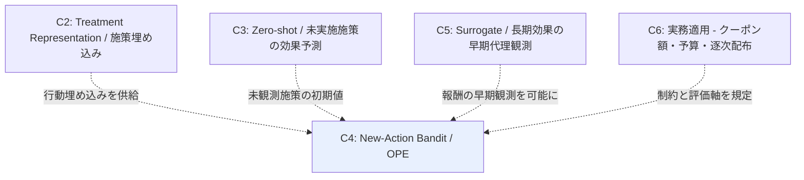

# Cluster 04: New-Action Bandit / 大規模行動空間 OPE

[← index](index.md)

## 概要

意思決定側からの接近を担うクラスタである。「どの施策を誰に打つか」を文脈付きバンディットとして定式化し、**ログに存在しない行動**や**巨大な行動空間**を扱う。起点となるのは行動を埋め込みで表現して周辺化する MIPS (Off-Policy Evaluation for Large Action Spaces via Embeddings) 系であり、行動を独立なアームとして扱う古典的 IPS が行動数の増加とともに破綻する問題を、行動埋め込み上での周辺化によって回避する。2026 年の "Offline Contextual Bandits in the Presence of New Actions" は、データ収集後に行動空間が拡張する設定を正面から扱っており、これは新しいクーポン施策の追加そのものに対応する。行動埋め込みをログから学習する Learning Action Embeddings のように、埋め込み自体の獲得を問題にする系統もある。index のスコープ定義に従い、OPE 手法の分散削減や推定量の理論的性質そのものは対象外であるが、**新規行動を評価可能にする**部分は本ドメインの中核として扱う。C3 が予測した未観測施策の効果は、本クラスタにおける新規行動の初期値として意思決定に接続される。

## キーワード

- 新規・可変行動空間
  - `new actions offline bandit`
  - `variable action space`
  - `in-context RL for variable actions`
  - `Headless-AD`
- 大規模行動空間と埋め込み
  - `large action space`
  - `action embedding`
  - `marginalized IPS (MIPS)`
  - `learning action embeddings`
  - `policy convolution`
  - `structured action space`
- 方策学習・応用
  - `off-policy learning with action features`
  - `causal marketing bandit`

## このクラスタが本課題に効く理由

- **実績ゼロ施策の予測**を予測に留めず意思決定へ接続する。新規行動を行動特徴量経由で評価・選択できるため、「新施策を誰に打つか」まで一気通貫で扱える。
- **数ヶ月に一度の低頻度施策**では新施策のたびに行動空間が拡張するが、これは "Offline Contextual Bandits in the Presence of New Actions" が想定する「データ収集後に行動空間が増える」設定と正確に一致する。
- **クーポン額・訴求内容・対象ユーザーが施策ごとに異なる**状況では、施策を独立アームとみなすと各アームのログが極端に薄くなる。行動埋め込みによる周辺化はこのデータ希薄性への直接の対処である。
- **過去ログからのオフライン評価**が可能なため、低頻度で本番投入のやり直しが効かない状況において、施策を打つ前に方策の期待性能を見積もれる。
- 行動空間の構造（クーポン額の連続性、チャネルのカテゴリ構造）を policy convolution や structured action space として明示的に活用でき、C6 が与える実務上の行動構造をそのまま取り込める。

## 調査戦略

- 主軸クエリは `"offline contextual bandit new actions"` と `"off-policy evaluation large action space embedding"`。
- 補助クエリとして `"marginalized inverse propensity score action embedding"`、`"learning action embeddings off-policy evaluation"`、`"policy convolution off-policy evaluation"`、`"variable action space in-context reinforcement learning"`。
- **Yuta Saito（Cornell）周辺の研究群が体系的**。著者単位で出版リストを辿るのが効率的である。実装参照先として **OBP / OpenBanditPipeline** を確認し、手法の再現可能性と実データ適用の勘所を把握する。
- 読む順序: MIPS（埋め込み OPE の基礎）→ Learning Action Embeddings（埋め込みの学習）→ New Actions（新規行動）。基礎から新規行動設定へ段階的に進む。
- **スコープ注意**: 推定量の理論的性質そのもの（分散削減、バイアス・バリアンストレードオフの解析）ではなく「**新規行動をどう扱うか**」に絞って読む。index のスコープ除外に抵触しないよう、常に「施策をまたぐか」を判定基準とする。
- マーケティング応用への接続は `"contextual bandit causal marketing multiple treatments"` で古典的な接続点を押さえる。

## 代表リソース

| Title | Type | Year | Summary |
|-------|------|------|---------|
| Offline Contextual Bandits in the Presence of New Actions | Paper | 2026 | 収集後に増える行動を行動特徴量で扱う。本課題に直結 |
| Off-Policy Evaluation for Large Action Spaces via Embeddings (MIPS) | Paper | 2022 | 行動埋め込みによる周辺化 IPS |
| Learning Action Embeddings for Off-Policy Evaluation | Paper | 2023 | 行動埋め込み自体をログから学習 |
| Contextual Multi-Armed Bandits for Causal Marketing | Paper | 2018 | 複数施策への拡張と OPE の古典的接続 |
| Contextual Bandits with Large Action Spaces: Made Practical | Paper | 2022 | 連続・線形構造行動空間の効率的アルゴリズム |
| In-Context RL for Variable Action Spaces (Headless-AD) | Paper | 2024 | 未学習の行動空間への汎化 |
| Off-Policy Evaluation for Large Action Spaces via Policy Convolution | Paper | 2023 | 行動空間の構造を畳み込みで活用 |

## 隣接クラスタとの関係

C4 は複数の上流クラスタからの入力を受ける合流点である。C2（Treatment Representation）は施策の特徴ベクトルを行動埋め込みとして供給し、MIPS 系の周辺化を可能にする。C3（Zero-shot）は未観測施策の効果予測を提供し、これが新規行動の初期値として機能する。C5（Surrogate）は長期成果の早期代理観測を可能にすることで、バンディットの報酬信号を待たずに取得できるようにし、逐次的な学習ループを現実的な時間スケールに収める。C6（実務適用）は予算制約・逐次配布といった制約と評価軸を規定する。本課題においては C2 → C3 の主戦場に対する次点の位置づけであり、意思決定への接続を担う。

