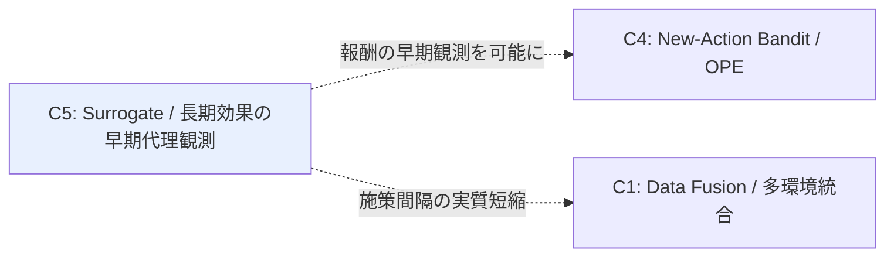

# Cluster 05: Surrogate / 長期効果の早期代理観測

[← index](index.md)

## 概要

他クラスタが「データ量を増やす」方向の解であるのに対し、本クラスタは「**結果を待つ時間を縮める**」という異なる角度から施策間隔の課題に効く。短期に観測できる複数の proxy 指標（開封、クリック、初回購入）を合成して surrogate index を構成し、長期成果（LTV、継続購買）への効果を早期に推定する。The Surrogate Index (Athey, Chetty, Imbens, Kang) がこの系譜の原典であり、短期代理指標の合成によって長期効果を早期かつ高精度に推定できることを示した。施策サイクルが数ヶ月ある状況では、長期成果の確定を待たずに次の施策の設計判断を前倒しできる点で実務価値が高い。理論的には surrogacy assumption の成否が全てであり、短期指標が処置と長期成果の間を十分に媒介しているかが問われる。近年は長期効果の異質性推定への拡張や、未観測交絡下での推定（Proximal Surrogate Index）、短期・長期報酬のバランスを取る方策学習へと展開している。ユーザーの当初発想には含まれていないが、同じ痛点に別角度から効くため index では独立したクラスタとして扱われている。

## キーワード

- 中核概念
  - `surrogate index`
  - `statistical surrogacy`
  - `surrogacy assumption`
  - `short-term proxies`
- 長期効果推定
  - `long-term treatment effect`
  - `long-term causal effect data combination`
  - `proximal surrogate index`
  - `unobserved confounding in surrogates`
- 実務接続
  - `short-term / long-term reward tradeoff`
  - `LTV early prediction`

## このクラスタが本課題に効く理由

- **数ヶ月に一度の低頻度施策**という制約に対し、他クラスタとは逆方向から効く。施策数を増やせないなら、1 施策あたりの結果確定までの待ち時間を縮めることで、実質的な施策サイクルを短縮する。
- 長期成果（LTV、継続購買）の確定を待つと次の施策の設計時点に間に合わないが、surrogate index があれば **前の施策の効果を踏まえた上で次の施策を設計**できる。低頻度ゆえに 1 回の設計判断の重みが大きい状況で価値が高い。
- **対象ユーザー・訴求内容・クーポン額が異なる**施策間で比較を行う際、長期成果が揃うのを待っていては比較可能な施策のペアが揃わない。早期代理観測はこの比較を前倒しする。
- 施策間隔の実質短縮は C1（Data Fusion）が統合対象にできる試験の本数と鮮度を改善し、C4（New-Action Bandit）には報酬の早期観測を提供して逐次学習ループを現実的な時間スケールに収める。
- **実績ゼロ施策の予測**に対しては直接効かないが、予測の検証サイクルを短縮する。新施策を打った後の答え合わせが早まることで、C3 のモデル改善サイクル自体が回るようになる。

## 調査戦略

- 主軸クエリは `"surrogate index long-term treatment effect"`。経済学（NBER, Review of Economic Studies）系が本流であり、arXiv だけでなく NBER working paper も探索対象に含める。
- 補助クエリとして `"statistical surrogacy assumption"`、`"long-term causal effect data combination"`、`"proximal surrogate index unobserved confounding"`、`"short-term long-term reward policy learning"`。
- **surrogacy assumption の成否が全て**。マーケティング文脈でこの仮定（短期指標が処置と長期成果の間を十分に媒介する）が成り立つ条件の検討が実務上の焦点であり、各論文が仮定をどう置き、どう検証しているかを必ず記録する。
- 読む順序: The Surrogate Index（原典）→ Nonparametric Heterogeneous Long-term Causal Effect via Data Combination（異質性への拡張）→ Proximal Surrogate Index（交絡下）。原典で枠組みを掴んでから緩和方向へ進む。
- 注目グループ: Stanford (Athey, Imbens)、Harvard (Chetty)。原典の著者陣であり、後続研究もこの周辺に集中する。
- 実務側の語彙 `"LTV early prediction"` は手法の深さより、どの短期指標を proxy 候補にするかの参照として用いる。

## 代表リソース

| Title | Type | Year | Summary |
|-------|------|------|---------|
| The Surrogate Index (Athey, Chetty, Imbens, Kang) | Paper | 2019/2025 | 短期代理指標の合成による長期効果の早期推定。原典 |
| Nonparametric Heterogeneous Long-term Causal Effect Estimation via Data Combination | Paper | 2025 | 長期効果の異質性推定 |
| The Proximal Surrogate Index | Paper | 2026 | 未観測交絡下での長期効果推定 |
| Policy Learning for Balancing Short-Term and Long-Term Rewards | Paper | 2024 | 短期・長期報酬のバランス方策学習 |

## 隣接クラスタとの関係

C5 は時間軸の圧縮を担い、他クラスタとは独立した角度から同じ痛点に効く。C4（New-Action Bandit / OPE）に対しては報酬の早期観測を可能にし、長期成果を待たずに逐次的な方策更新を回せるようにする。C1（Data Fusion）に対しては施策間隔の実質短縮をもたらし、統合対象となる試験の本数と鮮度を改善する。C5 は C2 の施策埋め込みを前提としないため、他クラスタと並行して独立に読み進められる点が特徴である。index の位置づけとしては「データ量を増やす」系譜に対する「待ち時間を縮める」系譜であり、優先度としては別角度からの解にあたる。

