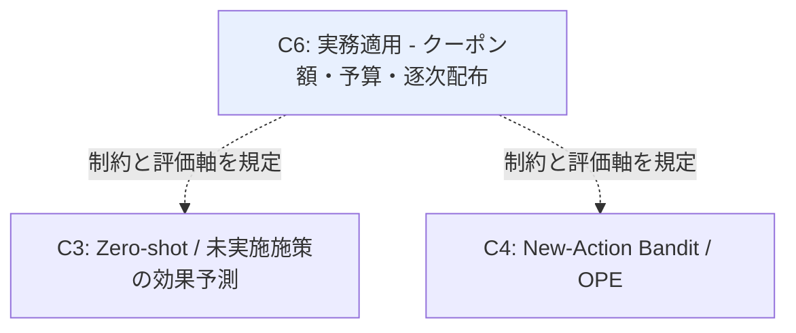

# Cluster 06: 実務適用 — クーポン額・予算制約・逐次配布

[← index](index.md)

## 概要

手法を実運用に落とす際の制約と評価軸を与えるクラスタである。クーポン額は本質的に **連続処置（dose-response）** であり、離散的な施策ラベルとして扱うと額の内挿・外挿という重要な情報が失われる。さらに施策には予算制約があり、「効果が最大の施策を全員に打つ」という素朴な解は実行不可能である。加えて配布は逐次的に繰り返されるため、単発の最適化ではなく時間軸を含む意思決定として定式化する必要がある。ユーザーの「クーポン額が異なる」「対象ユーザーが異なる」という記述はこのクラスタに直接対応する。中国系 EC（Alibaba, Meituan 等）発の論文が実データ規模で豊富であり、制約設定も現実的であるため、実務適用の参照先として価値が高い。参照効果（reference effects）のように、過去の割引履歴が将来の反応を変えるという実務固有の現象もここで扱われる。本クラスタは他クラスタの手法がどの実務制約下で成立するかを検証する土台となり、Domain Map では C3 と C4 に対して制約と評価軸を規定する立場にある。

## キーワード

- 割当・予算最適化
  - `coupon allocation`
  - `incentive recommendation`
  - `budget constraint uplift`
  - `multiple treatments budget allocation`
  - `real-time coupon allocation`
- 連続処置
  - `dose-response function`
  - `continuous treatment`
  - `intensity-response`
- 逐次・実運用
  - `sequential coupon distribution`
  - `personalized promotion`
  - `reference effects`
  - `debiased CTR and uplift`

## このクラスタが本課題に効く理由

- **クーポン額が施策ごとに異なる**という記述に直接対応する。額を連続処置（dose-response）として扱うことで、実施済みの額水準から未実施の額水準への内挿・外挿が可能になり、額違いの施策を「別施策」として切り離さずに済む。
- **対象ユーザーが施策ごとに異なる**点は、予算制約下の割当問題として定式化される。誰に打つかは効果の大小だけでなく予算の配分問題であり、本クラスタがその評価軸を与える。
- **数ヶ月に一度の低頻度施策**であっても配布自体は逐次的であり、ADT4Coupons のような逐次配布フレームワークが施策内・施策間の時間構造を扱う語彙を提供する。
- **実績ゼロ施策の予測**が実運用で意味を持つかは、予算制約・参照効果といった実務条件下で検証されねばならない。本クラスタは C3 / C4 の手法に対する現実性のチェック機構として機能する。
- 中国系 EC 発の論文は実データ規模での検証を伴うため、手法が小規模データで破綻しないかを見極める材料になる。低頻度施策のデータ量で成立する手法かの判断に直結する。

## 調査戦略

- 主軸クエリは `"coupon allocation uplift budget constraint"` と `"incentive recommendation"`。
- 補助クエリとして `"dose-response function continuous treatment marketing"`、`"sequential coupon distribution e-commerce"`、`"personalized promotion reference effects"`、`"debiased CTR uplift joint optimization"`、`"real-time coupon allocation online platform"`。
- **中国系 EC プラットフォームの応用論文（KDD / CIKM 系）を重点的に**。実データ規模と制約設定が現実的であり、会議単位で近年の採択論文を辿ると効率が良い。
- 日本語事例（マクロミル、KPMG、DataRobot 等）は手法の深さより **実務の語彙・KPI 設計の参照に留める**。手法的な新規性を期待しない。
- 読む順序: End-to-End Cost-Effective Incentive Recommendation（予算制約）→ ADT4Coupons（逐次配布）→ Personalized Promotions in Practice（実運用・参照効果）。制約の定式化から実運用の複雑性へ進む。
- 読む際の観点を固定する。各論文について「前提とする施策数」「1 施策あたりのサンプル規模」「クーポン額を連続として扱うか離散か」を記録し、低頻度・少数施策という本課題の条件との距離を測る。

## 代表リソース

| Title | Type | Year | Summary |
|-------|------|------|---------|
| End-to-End Cost-Effective Incentive Recommendation under Budget Constraint with Uplift Modeling | Paper | 2024 | 予算制約下のインセンティブ推薦 |
| ADT4Coupons: Sequential Coupon Distribution in E-commerce | Paper | 2025 | 逐次クーポン配布フレームワーク |
| Personalized Promotions in Practice: Dynamic Allocation and Reference Effects | Paper | 2025 | 割引率分布の設計と参照効果 |
| Jointly Optimizing Debiased CTR and Uplift for Coupons Marketing | Paper | 2026 | CTR と uplift の統合因果フレーム |
| How causal machine learning can leverage marketing strategies: coupon campaign | Paper | 2022 | クーポン施策への因果 ML 適用評価 |
| Optimizing Item-based Marketing Promotion Efficiency in C2C Marketplace | Paper | 2024 | 動的逐次クーポン割当 |
| Autonomous CRM Control via CLV Approximation with Deep RL | Paper | 2015 | RFM 状態空間での CRM 制御 |
| Data-Driven Real-time Coupon Allocation in the Online Platform | Paper | 2024 | リアルタイムクーポン割当 |

## 隣接クラスタとの関係

C6 は Domain Map において他クラスタへ制約と評価軸を供給する立場にある。C3（Zero-shot 施策効果予測）に対しては、未実施施策の効果予測が予算制約・連続処置・参照効果といった実務条件下で意味を持つかという検証軸を与える。C4（New-Action Bandit / OPE）に対しては、行動空間の構造（クーポン額の連続性）と逐次配布・予算制約という意思決定の枠組みを規定する。また C6 が扱うクーポン額の連続処置性は、C2（Treatment Representation）における施策特徴量設計の要件そのものでもある。本課題における優先度としては、主戦場である C2 → C3 を支える制約条件の層にあたる。

