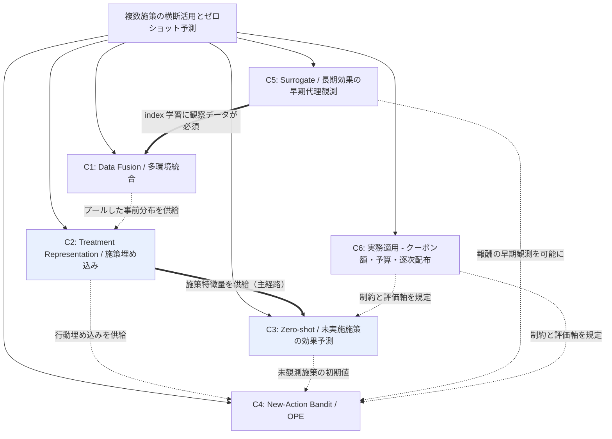
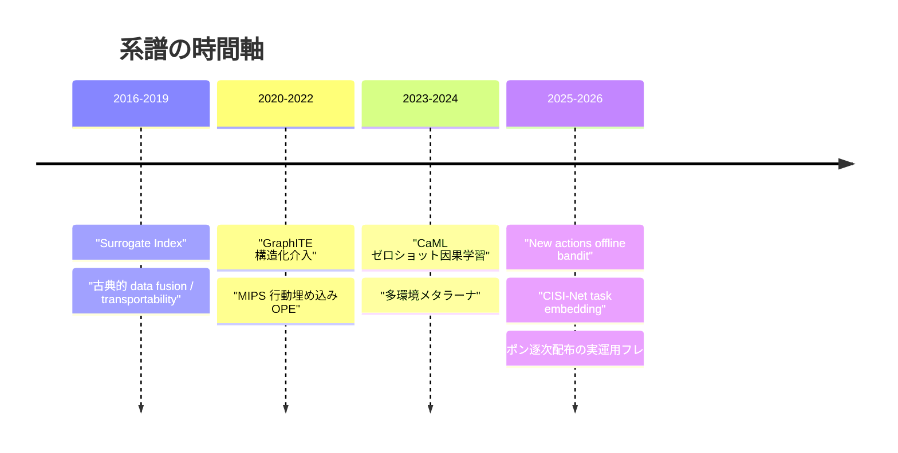
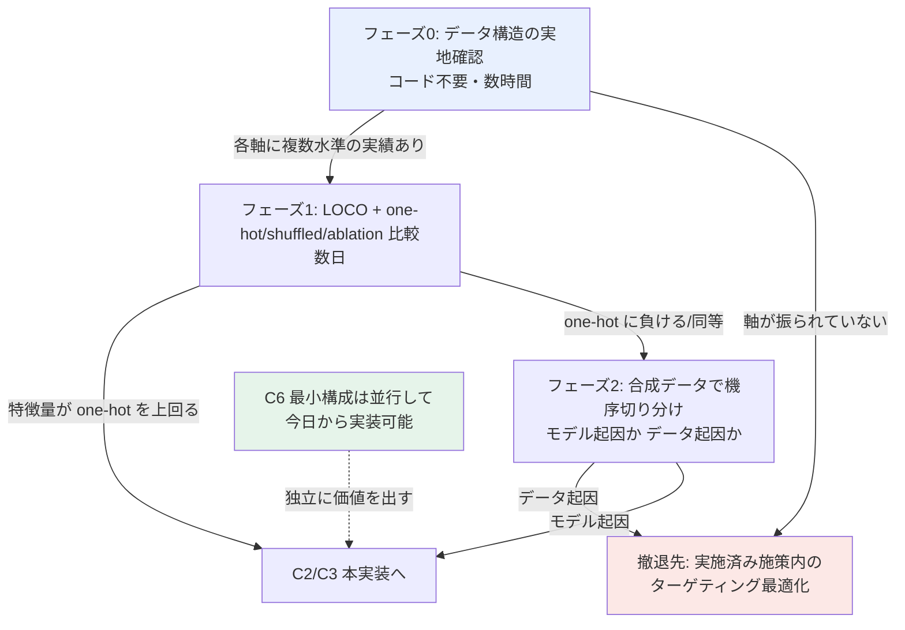

# 複数マーケティング施策の横断活用とゼロショット施策予測

## Research Parameters

- **調査タイプ**: 学術論文サーベイ（+ 事例・特許を補助的に参照）
- **時間範囲**: 2022 – 2026
- **生成日**: 2026-07-15
- **入力キーワード**: uplift model, off-policy evaluation, 強化学習, 複数施策の組み合わせ, 別施策データの活用, 実績ゼロの施策の予測, クーポン額, 訴求内容, 対象ユーザーのグルーピング
- **スコープ除外**: uplift / OPE の単体手法そのもの（S/T/X-learner の比較、IPS/DR 推定量の分散削減など）は対象外。**施策をまたぐ**情報共有・転移・ゼロショット予測の文脈に限定する。

## Big Picture

数ヶ月に一度しか回らないマーケティング施策では、1 施策あたりのサンプルは貯まる前に陳腐化し、施策単体では uplift モデルも OPE も統計的に成立しにくい。この課題は学術的には「単一の介入における推定精度」ではなく、**複数の介入・環境・時点にまたがって情報をプールし、未観測の介入へ外挿する**問題として定式化されている。

この定式化には大きく 3 つの源流がある。第一に因果推論側の **data fusion / transportability**（複数試験・複数サイトのエビデンスを統合し、別母集団へ移送する）。第二に表現学習側の **treatment representation**（施策を ID ではなく特徴ベクトル＝クーポン額・訴求文面・チャネルとして表現し、施策間でパラメータを共有する）。第三に意思決定側の **large / new action space bandit・OPE**（行動を埋め込み空間で扱い、ログにない行動を評価・学習する）。

ユーザーの「似た施策をグルーピングして擬似的にデータ間隔を短縮する」という発想は、第二・第三の系譜にほぼ正確に対応する。特に **CaML (Zero-shot causal learning)** は施策メタ情報から未実施介入の CATE を予測する枠組みであり、**Offline Contextual Bandits in the Presence of New Actions** はログに存在しない新規行動を行動特徴量経由で扱う。この 2 本が本ドメインの中核アンカーとなる。

一方、施策間隔の長さそのものに効くのは **surrogate index**（短期指標を合成して長期効果を早期に代理観測する）系であり、これは「データ量を増やす」のではなく「結果の待ち時間を縮める」方向からの解であるため、独立したクラスタとして扱う。

## Reference Survey/Review Papers

| Title | Year | Summary | Link |
|-------|------|---------|------|
| Zero-shot causal learning (CaML) | 2023 | 施策のメタ情報から未実施介入の個別効果を予測。本ドメインの中核アンカー | https://arxiv.org/abs/2301.12292 |
| Offline Contextual Bandits in the Presence of New Actions | 2026 | データ収集後に行動空間が増える設定。行動特徴量で新規行動を学習・選択 | https://arxiv.org/abs/2605.18509 |
| Off-Policy Evaluation for Large Action Spaces via Embeddings (MIPS) | 2022 | 行動埋め込みで周辺化し大規模行動空間の OPE を実現。埋め込み系の起点 | https://arxiv.org/abs/2202.06317 |
| Data Fusion for Partial Identification of Causal Effects | 2025 | 複数データ源の統合による因果効果の部分識別。data fusion の現況整理 | https://arxiv.org/abs/2505.24296 |
| Meta-Learners for Partially-Identified Treatment Effects Across Multiple Environments | 2024 | 複数環境（病院・地域等）からの CATE 推定。多環境メタラーナ | https://arxiv.org/abs/2406.02464 |
| The Surrogate Index (Athey, Chetty, Imbens, Kang) | 2019/2025 | 短期代理指標を合成し長期効果を早期・高精度に推定 | https://arxiv.org/pdf/1603.09326 |
| Multiple Treatments Causal Effects Estimation with Task Embeddings (CISI-Net) | 2025 | 施策の類似性を task embedding で捉え、施策間でパラメータ共有 | https://arxiv.org/html/2511.09814v1 |

## Domain Map

施策を「ID」から「特徴ベクトル」へ持ち上げる **C2** が全体のハブであり、そこからゼロショット予測（C3）と新規行動の意思決定（C4）が分岐する。C1 は統計的な情報プールの土台、C5 は時間軸の圧縮、C6 は実務制約を与える。ユーザーの課題に対する主戦場は **C2 → C3** の経路（太線）。

> **gather (20260715) を受けた修正**:
> 1. **C5 → C1 は必須依存**（当初は弱い関連と記述）。surrogate index の構成・検証には多数の過去実験が要るが、低頻度施策ではそれが無い。突破口は「index の学習を長期成果確定済みの観察データで行う」data combination であり、C5 は C1 なしに成立しない。「待ち時間を縮めたい理由が、縮める手段を阻害する」構造。
> 2. **C2 → C3 の主経路には反証リスクがある**。施策を特徴ベクトル化してもモデルが施策 ID にショートカット学習する現象が同型問題で実証済み（施策数が少ないほど発生しやすい＝本課題が該当）。この経路は「仮説」であって保証ではない。

### 時間軸

## Cluster Summary

| # | クラスタ名 | キーワード数 | 概要 |
|---|-----------|------------|------|
| 1 | Data Fusion / 多環境・多試験統合 | 12 | 複数施策を「複数試験」とみなし階層モデル等で情報をプール |
| 2 | Treatment Representation / 施策埋め込み | 13 | 施策を特徴ベクトル化し施策間でパラメータ共有・グルーピング |
| 3 | Zero-shot 施策効果予測 | 11 | 実績ゼロの施策の効果をメタ情報から予測 |
| 4 | New-Action Bandit / OPE | 12 | ログにない行動の評価・学習、大規模行動空間 |
| 5 | Surrogate / 長期効果の早期代理観測 | 10 | 短期指標合成で施策間隔そのものを実質短縮 |
| 6 | 実務適用：クーポン額・予算制約・逐次配布 | 12 | 連続処置・予算制約・逐次意思決定の実運用事例 |

## Cluster Details

### Cluster 1: Data Fusion / 多環境・多試験統合

**概要**: 過去の各マーケティング施策を「独立した小規模実験」とみなし、統計的に情報をプールする系譜。医療の多施設 RCT やメタ分析で成熟した手法群がそのまま転用できる。完全プール（全施策を同一視）と完全独立（施策ごとに別モデル）の中間を取る **partial pooling / 階層ベイズ** が中心概念で、施策数が少なく各施策のサンプルも少ない状況で特に効く。transportability は「施策 A の対象ユーザー層で得た効果を、対象層の異なる施策 B へ移送できるか」という識別条件を与える。

**キーワード**:
- `data fusion`
- `transportability`
- `external validity`
- `partial pooling`
- `Bayesian hierarchical model`
- `random treatment effect per site`
- `multi-site RCT`
- `individual participant data meta-analysis`
- `borrowing strength`
- `exchangeability`
- `multiple environments`
- `causal aggregation`

**Research Strategy**:
- `"data fusion causal inference survey"` / `"transportability heterogeneous treatment effect"` で識別条件側を押さえる
- 医療統計側（multi-site RCT, IPD meta-analysis）の用語で検索すると成熟した手法が拾える
- 読む順序: Data Fusion for Partial Identification (全体像) → Meta-Learners for Multiple Environments (CATE への接続) → Causal aggregation (制約ベース統合)
- 注目グループ: Stanford (Athey), CMU, ETH Zürich

**Representative Resources**:
| Title | Type | Year | Summary |
|-------|------|------|---------|
| Data Fusion for Partial Identification of Causal Effects | Paper | 2025 | 複数データ源統合の現況整理と部分識別 |
| Meta-Learners for Partially-Identified Treatment Effects Across Multiple Environments | Paper | 2024 | 多環境からの CATE 推定メタラーナ |
| Causal-ICM: Data Fusion for HTE with Multi-Task GP | Paper | 2024 | マルチタスク GP による実験・観察データ統合 |
| Causal aggregation: constraint-based data fusion | Paper | 2021 | 制約ベースでの因果効果統合 |
| Combining Incomplete Observational and Randomized Data for HTE | Paper | 2024 | 不完全な観察データと RCT の統合 |
| Privacy-preserving Meta-analysis through Low-Rank Basis Hunting | Paper | 2026 | partial pooling を階層線形モデルとして定式化 |
| Clustering and Pruning in Causal Data Fusion | Paper | 2025 | データ源のクラスタリングと枝刈り |

---

### Cluster 2: Treatment Representation / 施策埋め込み・タスク類似性

**概要**: 本ドメインのハブ。施策を「キャンペーン ID」ではなく **特徴ベクトル**（クーポン額、訴求文面、チャネル、対象セグメント条件）として表現することで、施策間のパラメータ共有と類似度に基づくグルーピングが可能になる。ユーザーが構想する「似た施策をグルーピングして擬似的にデータ量を増やす」は、この系譜の中心的アイデアそのものであり、CISI-Net の task embedding network が最も近い実装。訴求文面を LLM で埋め込めばテキスト介入としても扱える。

**キーワード**:
- `treatment embedding`
- `task embedding`
- `structured treatment`
- `treatment similarity`
- `parameter sharing across treatments`
- `balanced representation learning`
- `multi-task learning`
- `combinations of treatments`
- `graph-structured treatment`
- `text as treatment`
- `LLM treatment description embedding`
- `intervention-aware representation`
- `selection bias mitigation`

**Research Strategy**:
- `"treatment embedding causal effect"` / `"structured treatment representation"` が主軸クエリ
- 創薬・遺伝子摂動（perturbation）分野に類似手法が多い。「薬剤 = 施策」の読み替えで転用可能
- 読む順序: CISI-Net (施策類似性の埋め込み) → NCoRE (施策の組み合わせ) → GraphITE (構造化介入) → Estimating Causal Effects of Text Interventions (訴求文面)
- 実務接続: クーポン額は連続値、訴求内容はテキスト、チャネルはカテゴリ → マルチモーダルな施策特徴量設計が論点

**Representative Resources**:
| Title | Type | Year | Summary |
|-------|------|------|---------|
| Multiple Treatments Causal Effects Estimation with Task Embeddings (CISI-Net) | Paper | 2025 | 施策類似性を埋め込み、施策間パラメータ共有。本課題に最も近い |
| NCoRE: Neural Counterfactual Representation Learning for Combinations of Treatments | Paper | 2021 | 施策の組み合わせに対する反実仮想表現学習 |
| GraphITE: Estimating Individual Effects of Graph-structured Treatments | Paper | 2020 | 構造化介入・ゼロショット介入の効果推定 |
| Estimating Causal Effects of Text Interventions Leveraging LLMs | Paper | 2024 | 訴求文面をテキスト介入として扱う |
| Adversarially Balanced Representation for Continuous Treatment Effect | Paper | 2023 | 連続処置（クーポン額）の表現学習 |
| Causal Estimation for Text Data with (Apparent) Overlap Violations | Paper | 2022 | テキスト介入の overlap 違反への対処 |
| Intervention-Aware Multiscale Representation Learning | Paper | 2026 | 未学習介入・用量変動への汎化 |

---

### Cluster 3: Zero-shot 施策効果予測（実績ゼロの施策）

**概要**: ユーザーが明示的に挙げた「実施実績のない情報 0 の施策についての予測」に直接対応するクラスタ。学習時に一度も観測されていない介入について、その **メタ情報（説明文・属性）から効果を予測**する。CaML はこの問題設定を確立した代表作で、単一介入からの学習を未観測の介入の組み合わせへ汎化させる点まで踏み込む。C2 の施策埋め込みが技術的前提となるため、C2 → C3 の順で読むのが効率的。

**キーワード**:
- `zero-shot causal learning`
- `CaML`
- `unseen treatment`
- `novel intervention`
- `meta-learning treatment effects`
- `treatment description`
- `zero-shot treatment effect estimation`
- `generalization to unseen intervention combinations`
- `cold start campaign`
- `causal meta-learning`
- `high-dimensional treatments`

**Research Strategy**:
- `"zero-shot causal learning"` / `"unseen treatment effect estimation"` が主軸
- CaML の引用ネットワーク（forward citation）を辿るのが最も効率的。この設定を扱う論文は数が限られるため悉皆調査が現実的
- 評価設計が最大の論点: 実績ゼロの施策の予測精度をどう検証するか（leave-one-campaign-out が定石）
- 注目グループ: Stanford (Leskovec 研: Nilforoshan, Moor, Roohani)

**Representative Resources**:
| Title | Type | Year | Summary |
|-------|------|------|---------|
| Zero-shot causal learning (CaML) | Paper | 2023 | 未実施介入の個別効果予測。本クラスタの中核 |
| GraphITE | Paper | 2020 | ゼロショット介入を明示的に扱う先行研究 |
| Causal Risk Minimization for High-Dimensional Treatments | Paper | 2026 | 高次元処置への汎化 |
| Estimating Causal Effects of Text Interventions Leveraging LLMs | Paper | 2024 | 施策説明文からの効果推定 |
| Systems and methods for multidimensional knowledge transfer for CTR prediction | Patent | - | 新規ノードのコールドスタートを知識転移で解決 |
| Systems and methods for designing targeted marketing campaigns | Patent | - | 過去施策からの転移学習で新規施策をスコアリング |

---

### Cluster 4: New-Action Bandit / 大規模行動空間 OPE

**概要**: 意思決定側からの接近。「どの施策を誰に打つか」を文脈付きバンディットとして定式化し、**ログに存在しない行動**や**巨大な行動空間**を扱う。行動を埋め込みで表現して周辺化する MIPS 系が起点で、2026 年の "Offline Contextual Bandits in the Presence of New Actions" はデータ収集後に行動空間が拡張する設定＝新しいクーポン施策の追加そのものを扱う。OPE 手法の分散削減自体はスコープ外だが、**新規行動を評価可能にする**部分は本ドメインの中核。

**キーワード**:
- `new actions offline bandit`
- `large action space`
- `action embedding`
- `marginalized IPS (MIPS)`
- `off-policy learning with action features`
- `structured action space`
- `variable action space`
- `in-context RL for variable actions`
- `policy convolution`
- `learning action embeddings`
- `causal marketing bandit`
- `Headless-AD`

**Research Strategy**:
- `"offline contextual bandit new actions"` / `"off-policy evaluation large action space embedding"` が主軸
- Yuta Saito（Cornell）周辺の研究群が体系的。OBP / OpenBanditPipeline も実装参照先
- 読む順序: MIPS (埋め込み OPE の基礎) → Learning Action Embeddings (埋め込みの学習) → New Actions (新規行動)
- スコープ注意: 推定量の理論的性質そのものではなく「新規行動をどう扱うか」に絞って読む

**Representative Resources**:
| Title | Type | Year | Summary |
|-------|------|------|---------|
| Offline Contextual Bandits in the Presence of New Actions | Paper | 2026 | 収集後に増える行動を行動特徴量で扱う。本課題に直結 |
| Off-Policy Evaluation for Large Action Spaces via Embeddings (MIPS) | Paper | 2022 | 行動埋め込みによる周辺化 IPS |
| Learning Action Embeddings for Off-Policy Evaluation | Paper | 2023 | 行動埋め込み自体をログから学習 |
| Contextual Multi-Armed Bandits for Causal Marketing | Paper | 2018 | 複数施策への拡張と OPE の古典的接続 |
| Contextual Bandits with Large Action Spaces: Made Practical | Paper | 2022 | 連続・線形構造行動空間の効率的アルゴリズム |
| In-Context RL for Variable Action Spaces (Headless-AD) | Paper | 2024 | 未学習の行動空間への汎化 |
| Off-Policy Evaluation for Large Action Spaces via Policy Convolution | Paper | 2023 | 行動空間の構造を畳み込みで活用 |

---

### Cluster 5: Surrogate / 長期効果の早期代理観測

**概要**: 他クラスタが「データ量を増やす」方向の解であるのに対し、本クラスタは「**結果を待つ時間を縮める**」方向から施策間隔の課題に効く。短期に観測できる複数の proxy 指標（開封、クリック、初回購入）を合成して surrogate index を作り、長期成果（LTV、継続購買）の効果を早期に推定する。施策サイクルが数ヶ月ある状況では、次の施策の設計判断を前倒しできる点で実務価値が高い。ユーザーの当初発想には含まれていないが、同じ痛点に別角度から効くため独立クラスタとした。

**キーワード**:
- `surrogate index`
- `short-term proxies`
- `long-term treatment effect`
- `surrogacy assumption`
- `statistical surrogacy`
- `proximal surrogate index`
- `long-term causal effect data combination`
- `short-term / long-term reward tradeoff`
- `unobserved confounding in surrogates`
- `LTV early prediction`

**Research Strategy**:
- `"surrogate index long-term treatment effect"` が主軸。経済学（NBER, Review of Economic Studies）系が本流
- surrogacy assumption の成否が全て。マーケティングでこの仮定が成り立つ条件の検討が実務上の焦点
- 読む順序: The Surrogate Index (原典) → Nonparametric Heterogeneous Long-term Causal Effect via Data Combination (異質性への拡張) → Proximal Surrogate Index (交絡下)
- 注目グループ: Stanford (Athey, Imbens), Harvard (Chetty)

**Representative Resources**:
| Title | Type | Year | Summary |
|-------|------|------|---------|
| The Surrogate Index (Athey, Chetty, Imbens, Kang) | Paper | 2019/2025 | 短期代理指標の合成による長期効果の早期推定。原典 |
| Nonparametric Heterogeneous Long-term Causal Effect Estimation via Data Combination | Paper | 2025 | 長期効果の異質性推定 |
| The Proximal Surrogate Index | Paper | 2026 | 未観測交絡下での長期効果推定 |
| Policy Learning for Balancing Short-Term and Long-Term Rewards | Paper | 2024 | 短期・長期報酬のバランス方策学習 |

---

### Cluster 6: 実務適用 — クーポン額・予算制約・逐次配布

**概要**: 手法を実運用に落とす際の制約と評価軸を与えるクラスタ。クーポン額は本質的に **連続処置（dose-response）** であり、施策には予算制約があり、配布は逐次的に繰り返される。ユーザーの「クーポン額が異なる」「対象ユーザーが異なる」という記述はここに対応する。中国系 EC（Alibaba, Meituan 等）発の論文が実データ規模で豊富。他クラスタの手法がどの実務制約下で成立するかを検証する土台となる。

**キーワード**:
- `coupon allocation`
- `incentive recommendation`
- `budget constraint uplift`
- `dose-response function`
- `continuous treatment`
- `intensity-response`
- `sequential coupon distribution`
- `multiple treatments budget allocation`
- `personalized promotion`
- `reference effects`
- `debiased CTR and uplift`
- `real-time coupon allocation`

**Research Strategy**:
- `"coupon allocation uplift budget constraint"` / `"incentive recommendation"` が主軸
- 中国系 EC プラットフォームの応用論文（KDD/CIKM 系）を重点的に。実データ規模と制約設定が現実的
- 日本語事例（マクロミル、KPMG、DataRobot 等）は手法の深さより実務の語彙・KPI 設計の参照に留める
- 読む順序: End-to-End Cost-Effective Incentive Recommendation (予算制約) → ADT4Coupons (逐次配布) → Personalized Promotions in Practice (実運用・参照効果)

**Representative Resources**:
| Title | Type | Year | Summary |
|-------|------|------|---------|
| End-to-End Cost-Effective Incentive Recommendation under Budget Constraint with Uplift Modeling | Paper | 2024 | 予算制約下のインセンティブ推薦 |
| ADT4Coupons / SACO: Sequential Coupon Distribution in E-commerce | Paper | 2025/2026 | 逐次クーポン配布フレームワーク。arXiv 2508.09198 の v1=ADT4Coupons、v2(AAAI採択版)=SACO で**同一論文**（gather 時に判明） |
| Personalized Promotions in Practice: Dynamic Allocation and Reference Effects | Paper | 2025 | 割引率分布の設計と参照効果 |
| Jointly Optimizing Debiased CTR and Uplift for Coupons Marketing | Paper | 2026 | CTR と uplift の統合因果フレーム |
| How causal machine learning can leverage marketing strategies: coupon campaign | Paper | 2022 | クーポン施策への因果 ML 適用評価 |
| Optimizing Item-based Marketing Promotion Efficiency in C2C Marketplace | Paper | 2024 | 動的逐次クーポン割当 |
| Autonomous CRM Control via CLV Approximation with Deep RL | Paper | 2015 | RFM 状態空間での CRM 制御 |
| Data-Driven Real-time Coupon Allocation in the Online Platform | Paper | 2024 | リアルタイムクーポン割当 |

---

## 次フェーズへの申し送り

- **優先度**: C2 → C3 が本課題の主戦場。C4 は意思決定への接続として次点。C1 は統計的土台、C5 は別角度からの解、C6 は制約条件。
- **スコープ維持**: uplift / OPE の単体手法比較に流れないこと。常に「施策をまたぐか」を判定基準とする。
- **探索のコツ**: CaML と New Actions の 2 本の引用ネットワークを辿ると本ドメインの論文は高い網羅率で拾える。
  - **retrieval 後の訂正**: この助言は不正確だった。CaML の被引用は「未観測**介入**」型（直系）と「未観測**データセット**」型（CausalPFN 等、無関係）に二分しており、機械的に辿ると後者に流れ込む。型を判別しながら辿る必要がある。

---

# 統合所見（gather + retrieval 完了後 / 2026-07-15 追記）

全 6 クラスタの本文精読を経て確定した結論。**clustering 時点の見立てから複数の重要な修正が入っている**ため、本節を最初に読むこと。

## 結論

**「似た施策をグルーピングして擬似的にデータ量を増やす」というアイデアは、論理的には正しく、文献上も同型の研究が存在する。しかし本課題のデータ構造は、その成立条件を満たさない公算が高い。**

ただしこれは「やめるべき」を意味しない。**成立可否は数日・低コストで判定でき、撤退先も明確**であるため、大規模実装の前に判定を挟むのが合理的である。

## 最重要の反証: ショートカット学習（C2）

本調査で最も価値のある発見。One-hot news（Bioinformatics 2026）は本課題の前提への直接的な反証を、同型の問題設定で実証している。

| 論点 | 内容 |
|------|------|
| 現象 | 施策に特徴量を与えても、モデルは特徴量を無視し**施策 ID にショートカット学習**する |
| 強度 | 「性能が同等」より強い。**one-hot が特徴量を 6.4% / 0.91% 上回る**（＝特徴量を捨てた方が良い） |
| 機序 | 合成データで特定済み。反復なしデータでは特徴量回復 Jaccard **1.00**、反復ありでは **0.38/0.43** |
| 該当性 | **エンティティが反復する構造**が特徴学習を阻害する。「1 施策 → 数千ユーザー」のログはまさにこの構造 |
| 救済不可 | 事前学習済み表現でも残差モデリングでも改善せず |

### 賛否は矛盾しない — 介入数で説明できる

$$\text{成立条件} \approx \text{介入（施策）の多様性} \gg \text{サンプル行数}$$

| 事例 | 介入数 | 結果 |
|------|-------:|------|
| CaML | 745〜10,325 | 成功 |
| CPA | 188 化合物 | 成功（ただし近傍汎化） |
| One-hot news / O'Neil | **38 薬剤** | **ショートカット発生** |
| **本課題** | **数十施策** | **後者側** |

**「特徴量化すればデータが実質増える」という期待への直接の反証**: MatchMaker は 426,239 組合せ・3,057 薬剤でも未観測薬剤ペアで PCC 0.13 に崩壊した。**増えるのは行数であって施策の多様性ではない。**

## 各クラスタの確定判定

| クラスタ | 判定 | 根拠（本文精読による） |
|---------|------|----------------------|
| **C2 施策埋め込み** | **条件付き・要検証** | ショートカット学習の反証。賛成側 2 本にも穴（CISI-Net は one-hot 比較なし・実データ 3 施策、CPA の摂動埋め込みは「学習可能ベクトル辞書」＝ID ルックアップそのもの） |
| **C3 Zero-shot** | **再定義すれば有望** | 直接答える論文は実質 **CaML 1 本のみ**。かつ主張は「最良ベースラインと**同等**」であり「上回る」ではない（RA-learner 0.47 vs CaML 0.48） |
| C1 Data Fusion | **手法では解けない** | 4 試験 N≈1,850 を統合してなお個人 CATE の信頼区間が全てゼロを含む。移送の収束レートに $1/G$ 項が残る |
| C4 New-Action | **回避が正解** | 「施策数が少ないと周辺化が効く」は**誤り**。周辺化の利得は行動が埋め込みを共有することに由来し、施策数が少ないほど **IPS に退化**する |
| C5 Surrogate | **部分的に成立** | 低頻度性のパラドックスを三分割で突破（下記） |
| **C6 実務適用** | **今日から実装可能** | isotonic + 双対変数は深層モデル不要・110 都市規模で実証済み |

## C3 の再定義: ゼロショット → 組み合わせ外挿

**決め手はタスク数の壁。** CaML は数千〜数万タスクでメタ学習しているが、年数本の施策では **2〜3 桁足りない**。軸への分解は言い換えではなく、この壁を突破する唯一の現実的経路。CaML 自身が "surpassing" という強い表現を使うのは**組み合わせ設定の方**であり、論文の言葉遣いもこれを支持する。

問題を 3 層に切り分けること:

| 層 | 内容 | 見通し |
|----|------|--------|
| **A** | 既知軸の**未知の組み合わせ**（額 500円 × 訴求B × チャネルC） | **有望**。ここに絞る |
| **B** | 既知軸の**未知の水準**（初めての 2000 円） | 外挿の仮定次第 |
| **C** | **真に新しい軸** | **正直に「予測不能」と言うべき** |

**前提条件**: 過去施策で**各軸に複数水準の実績が振られていること**。「額は常に 500 円、訴求だけ毎回違う」なら足場がない。→ フェーズ 0 で確認。

## C5 の突破口: 低頻度性のパラドックスの三分割

「待ち時間を縮めたい理由（低頻度）が、縮める手段を阻害する」構造への回答。gather 時点の二分割は不正確で、**三分割が正しい**。

| 工程 | 実験の要否 | 判定 |
|------|-----------|------|
| ① index の構成 | 不要（観察データで可） | **実験ゼロで着手可** |
| ② 検証（$Y \perp W \mid S,X$） | **必須**（$W$ の外生変動が要る） | **観察データでは原理的に不可能** |
| ③ 交絡除去 | 条件付き | **資源の非対称性あり（下記）** |

**③の非対称性が鍵**: 交絡除去に「実験の**本数**」を要求する手法は実行不能だが、Persistent Confounding は「短期成果の**時点数**」を要求する。**低頻度性が制約するのは施策の本数であって、1 施策あたりの観測の細かさではない。** 週次・日次ログはコストゼロで増やせるため低頻度性の影響を受けず、必要実験数が「Netflix の 200 本」から「数本」に落ちる（ゼロにはならない、②が残るため）。

$$\text{戦略}: \text{希少な実験を①③に浪費せず、②に集中させる}$$

## 実行計画

- **フェーズ 0（コード不要）**: 過去施策の「額 × 訴求 × チャネル × セグメント」のクロス表を作り、各軸に複数水準の実績があるかを確認。ここで C3-A の成立可否がほぼ決まる。
- **フェーズ 1（数日）**: LOCO（leave-one-campaign-out）+ **one-hot ベースライン**・shuffled 特徴量・ablation の比較。**撤退基準を事前に宣言してから**回すこと。
- **並行**: C6 の最小構成（額を 3〜5 水準に離散化 → 額を特徴量に入れた GBDT → PAVA で単調化 → **PCOC で確認**（AUC ではない）→ λ を二分探索 → argmax）は C2/C3 の成否と独立に価値を出す。**探索枠 5〜10% と傾向スコアのログ保存は必須**（探索ゼロだと次回の評価が原理的に不能）。

## 文献の空白（実質的な研究課題）

- **balancing の要件がモダリティ間で矛盾する**。クーポン額（連続）× チャネル（離散）× 文面（テキスト）を単一表現へ統合する際、CISI-Net の Wasserstein / ACFR の KL + 経路分離 / Overlap の識別破綻 が三者三様で、**統一的処方箋は精読した 6 本のいずれにも存在しない**。
- **3 軸（連続処置 / 予算 / 逐次性）を同時に扱う手法が存在しない**。最も網羅的なものも Meituan/Booking 級のトラフィックが前提。
- **「行動の新しさ」と「時間の新しさ」が本課題では同時に起きるが、研究は分離している**。

## 検証プロセスの記録（信頼性に関わる）

本 run では retrieval で本文にあたった結果、**gather 段階の記述に複数の誤りが見つかり訂正した**。二次情報のみの調査には同種の誤りが残存しうる点に留意すること。

| 訂正内容 | クラスタ |
|---------|---------|
| CaML の主張は「最良ベースラインと**同等**」（"comparably"）。「上回る」「8×」は誤り（8× は崩壊した弱ベースラインとの比） | C3 |
| FedTransTEE は**未観測処置の実験を一切していない**（future work の一文のみ）。推薦根拠が不成立 | C3 |
| BHARP は汎用手法ではなく **Adaptive Enrichment Trials** 向け。事後統合では主要価値が使えない | C1 |
| Menzel の実証規模は「5 サイト」ではなく **5 研究・640 サイト**。「少数からの移送の目安」は不成立 | C1 |
| E3IR は online A/B を**実施していない**。挙げられていた数値は別リソースからの転記ミス | C6 |
| Netflix 論文の「負の施策の誤 launch ゼロ」は **abstract に存在しない**。安全性の根拠に使わないこと | C5 |
| ADT4Coupons と SACO は**同一論文**（arXiv 2508.09198 の v1/v2） | C6 |

**さらに、PDF 取得時に原典と矛盾する捏造レスポンスが 2 件発生し、いずれも破棄した**（C4: abstract と矛盾する用語展開、C3: 数値ゼロの一般論）。本 run の記述は HTML 版・一次ソースで確認できたもののみを採用し、確認できなかった項目は各レポートに「未確認」と明記している。

### 主要な未確認事項（意思決定前に原典 PDF の確認を推奨）

- **CaML Appendix Table 5**（組み合わせ汎化の具体的数値）— C3 再定義の根拠として最重要
- **Persistent Confounding の 3 つの識別戦略が逐次構造に何を仮定するか** — C5 の突破口の中心的主張が依存
- Minimax Regret の実験節（leave-one-site-out を実際に実施したかも未確認）
- C5 の 4 本すべて本文 PDF 未取得（abstract と書誌のみ検証）
