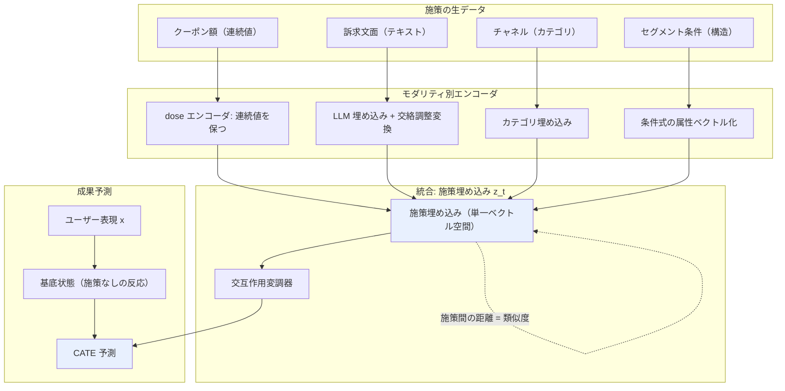

# C2: Treatment Representation / 施策埋め込み — リソース一覧

[← clustering index](../../../clustering/20260715/index.md)

## スコープ

施策を「キャンペーン ID」という不透明な離散ラベルではなく、**特徴ベクトル**（クーポン額 = 連続値、訴求文面 = テキスト、チャネル = カテゴリ、対象セグメント = 条件）として表現する系譜を対象とする。この持ち上げにより、施策間のパラメータ共有・類似度に基づくグルーピング・未実施施策への外挿が技術的に可能になる。

**含む**: treatment embedding / task embedding、構造化・グラフ介入、施策類似性と転移、施策間パラメータ共有、multi-task causal learning、施策の組み合わせ、text-as-treatment、LLM による訴求文面の埋め込み、連続処置（dose-response）の表現、balanced representation。

**含まない**: uplift / OPE の推定量そのものの内部設計（S/T/X-learner の比較、IPS/DR の分散削減理論など）。ただし「行動を埋め込みで表現する」部分は施策表現の一形態として含める。

**隣接分野**: 創薬・遺伝子摂動モデリング（薬剤 = 施策の読み替え）、推薦システムの item cold-start（コンテンツ特徴による新規アイテムの表現）。両者は本課題と数学的にほぼ同型の問題を、はるかに大きなデータ規模で先行して解いており、転用価値が高い。

## リソース総覧

| # | タイトル | 種別 | 年 | リンク | 本課題との関連度 |
|---|---------|------|----|--------|----------------|
| 1 | Multiple Treatments Causal Effects Estimation with Task Embeddings and Balanced Representation Learning (CISI-Net) | Paper | 2025 | https://arxiv.org/abs/2511.09814 | ◎ |
| 2 | Zero-shot causal learning (CaML) | Paper | 2023 | https://arxiv.org/abs/2301.12292 | ◎ |
| 3 | Multiple Treatment Effect Estimation using Deep Generative Model with Task Embedding | Paper | 2019 | https://dl.acm.org/doi/10.1145/3308558.3313744 | ◎ |
| 4 | Transfer Learning for Individual Treatment Effect Estimation (CITA) | Paper | 2022 | https://arxiv.org/abs/2210.00380 | ◎ |
| 5 | Learning to Infer Counterfactuals: Meta-Learning for Estimating Multiple Imbalanced Treatment Effects | Paper | 2022 | https://arxiv.org/abs/2208.06748 | ◎ |
| 6 | NCoRE: Neural Counterfactual Representation Learning for Combinations of Treatments | Paper | 2021 | https://arxiv.org/abs/2103.11175 | ○ |
| 7 | GraphITE: Estimating Individual Effects of Graph-structured Treatments | Paper | 2020 | https://arxiv.org/abs/2009.14061 | ○ |
| 8 | Estimating Causal Effects of Text Interventions Leveraging LLMs (CausalDANN) | Paper | 2024 | https://arxiv.org/abs/2410.21474 | ◎ |
| 9 | Causal Estimation for Text Data with (Apparent) Overlap Violations | Paper | 2022 | https://arxiv.org/abs/2210.00079 | ◎ |
| 10 | Causal Effect Estimation with Latent Textual Treatments | Paper | 2026 | https://arxiv.org/abs/2602.15730 | ○ |
| 11 | Adversarially Balanced Representation for Continuous Treatment Effect Estimation (ACFR) | Paper | 2023 | https://arxiv.org/abs/2312.10570 | ○ |
| 12 | Contrastive Balancing Representation Learning for Heterogeneous Dose-Response Curves (CRNet) | Paper | 2024 | https://arxiv.org/abs/2403.14232 | ○ |
| 13 | Learning Counterfactual Representations for Estimating Individual Dose-Response Curves (DRNet) | Paper | 2019 | https://arxiv.org/abs/1902.00981 | ○ |
| 14 | Causal Risk Minimization for High-Dimensional Treatments | Paper | 2026 | https://arxiv.org/abs/2605.27281 | ○ |
| 15 | Intervention-Aware Multiscale Representation Learning from Imaging Phenomics and Perturbation Transcriptomics | Paper | 2026 | https://arxiv.org/abs/2604.22832 | △ |
| 16 | Predicting cellular responses to complex perturbations in high-throughput screens (CPA) | Paper | 2023 | https://link.springer.com/article/10.15252/msb.202211517 | ◎ |
| 17 | GEARS: Predicting transcriptional outcomes of novel multigene perturbations | Paper | 2023 | https://www.nature.com/articles/s41587-023-01905-6 | ○ |
| 18 | One-hot news: drug synergy models shortcut molecular features | Paper | 2026 | https://academic.oup.com/bioinformatics/article/42/3/btag040/8440676 | ◎ |
| 19 | Multi-treatment Effect Estimation from Biomedical Data | Paper | 2021 | https://arxiv.org/abs/2112.07574 | ○ |
| 20 | Off-Policy Evaluation for Large Action Spaces via Embeddings (MIPS) | Paper | 2022 | https://arxiv.org/abs/2202.06317 | ○ |
| 21 | Learning Action Embeddings for Off-Policy Evaluation | Paper | 2023 | https://arxiv.org/abs/2305.03954 | ○ |
| 22 | Multi-task Item-attribute Graph Pre-training for Strict Cold-start Item Recommendation | Paper | 2023 | https://arxiv.org/abs/2306.14462 | ○ |
| 23 | FELRec: Efficient Handling of Item Cold-Start with Dynamic Representation Learning | Paper | 2022 | https://arxiv.org/abs/2210.16928 | △ |
| 24 | Conversion Prediction Using Multi-task Conditional Attention Networks to Support the Creation of Effective Ad Creative | Paper | 2019 | https://arxiv.org/abs/1905.07289 | ○ |
| 25 | n週連続推薦システム系論文読んだシリーズ21週目: action embedding を使う OPE（MIPS 解説） | Blog | 2023 | https://qiita.com/morinota/items/a6f953d54baa099fecb7 | △ |

計 25 件（◎ 8 / ○ 13 / △ 4）

## 各リソース詳細

### 01. Multiple Treatments Causal Effects Estimation with Task Embeddings and Balanced Representation Learning (CISI-Net)

**リンク**: https://arxiv.org/abs/2511.09814

**概要**: 複数施策が同時に適用され得る状況で、単独効果と交互作用効果の双方を推定する深層学習フレームワークである。中核は **task embedding network** と、balancing penalty 付き representation learning network の 2 段構成にある。task embedding network は各施策パターンを埋め込み、単独効果に共通する要素と交互作用固有の寄与を分けて符号化することで、**関連する施策パターン間でのパラメータ共有**を実現する。先行研究（施策ごとの独立 outcome network や、VAE と task embedding を組み合わせる手法）が抱えていた「関連施策間でパラメータが共有されない」「不要な潜在変数の推定が精度を落とす」という 2 つの弱点を明示的に攻撃している。balancing penalty は異なる施策パターン間で共変量表現の分布距離を縮め、過去の施策ターゲティングが無作為でないことに起因する選択バイアスを緩和する。本課題の「似た施策をグルーピングして擬似的にデータ量を増やす」という発想に、現存する手法の中で最も近い実装である。

**本課題への示唆**:
- task embedding の距離が、そのまま「施策の類似度」のデータ駆動な定義になる。ユーザーが手作業で想定していた類似施策のまとめ上げを、学習の副産物として自動的に得られる。
- 単独効果の共通成分と交互作用固有成分を分離する設計は、「クーポン額の効果」と「訴求文面 × クーポン額の相乗効果」を分けて解釈したい実務ニーズと直接対応する。
- balancing penalty は、過去施策が特定セグメントに偏って配信されてきた履歴（＝非無作為なターゲティング）への対処として必須。実データでは施策ごとに配信対象が異なるため、この項がないと施策間比較が交絡する。
- ただし施策を「パターン（部分集合）」として扱う定式化のため、クーポン額のような連続値を素直に扱えるかは要確認。#11-13 の連続処置系との接合が設計上の論点になる。

**キーとなる用語**: task embedding network, balanced representation learning, interaction treatment effect, parameter sharing, balancing penalty

---

### 02. Zero-shot causal learning (CaML)

**リンク**: https://arxiv.org/abs/2301.12292

**概要**: 学習時に一度も観測されていない新規介入について、その個別効果（CATE）を予測する枠組みを確立した論文である（NeurIPS 2023, Nilforoshan・Moor・Roohani ら Stanford Leskovec 研）。中核のアイデアは、**各介入の個別効果予測を 1 つの「タスク」として定式化し、介入ごとに別モデルを訓練するのではなく、数千のタスクを横断する単一のメタモデルを訓練する**ことにある。各タスクは、介入を 1 つサンプリングし、それを受けた個体と受けなかった個体を集めて構成される。介入情報（薬剤の属性など）と個体特徴（患者履歴など）の双方を活用することで、訓練時点で存在しなかった新規介入の個別効果を予測できる。未観測介入については、その説明文や特徴集合から埋め込みを生成してフレームワークに渡す。評価では、単独薬剤の介入のみで訓練したモデルが、**両方とも未観測な 2 剤の組み合わせ**の個別効果予測において、テストタスクで訓練した最良のベースラインを上回った。

**本課題への示唆**:
- 「実績ゼロの施策の予測」というユーザーの要求に対する、最も直接的な問題設定の定義そのもの。C3 の中核だが、その技術的前提（介入を特徴ベクトルで表す）は C2 に属する。
- 「施策ごとに別モデル」を捨てて「施策を跨ぐ単一メタモデル」にする発想の転換が、低頻度施策の本質的解。施策数がタスク数になるため、施策 1 本あたりのサンプルが薄くても学習が成立する。
- 単独施策のみから訓練して未観測の組み合わせへ汎化した実績は、「クーポン額 A × 訴求文面 B」という未実施の組み合わせの評価に直結する。
- 評価設計として leave-one-intervention-out に相当する検証を行っている点が、実務での検証設計（leave-one-campaign-out）の直接の手本になる。

**キーとなる用語**: zero-shot causal learning, causal meta-learning, task sampling, intervention information, novel intervention, CATE

---

### 03. Multiple Treatment Effect Estimation using Deep Generative Model with Task Embedding

**リンク**: https://dl.acm.org/doi/10.1145/3308558.3313744

**概要**: WWW 2019 で発表された、task embedding を causal effect 推定に持ち込んだ先駆的研究である。VAE（変分オートエンコーダ）の定式化に独自のアーキテクチャを組み合わせ、**施策の任意の部分集合**についての因果効果を推定する。複数施策の高次の効果（higher order effects）を task embedding を通じて捉える点が中核で、施策数が増えると組み合わせが指数的に爆発する問題に、埋め込みによる低次元化で対処している。CISI-Net（#01）が明示的に先行研究として批判的に参照している論文であり、この系譜の起点にあたる。VAE ベースであるため潜在変数の推定を伴い、CISI-Net はまさにこの「不要な潜在変数の推定が精度を落とす」点を改善対象としている。

**本課題への示唆**:
- task embedding という語彙の出自を押さえられる。#01 を読む前提として、何が改善されたのかを理解するための対照群になる。
- 「施策の任意の部分集合の効果」という定式化は、複数チャネル同時配信（メール + アプリ通知）のような実務シナリオに対応する。
- VAE による生成モデル的アプローチは、データが薄い状況で潜在構造を仮定する分だけリスクもある。#01 の批判が正しいなら、実務では非生成的な #01 系を優先すべき。

**キーとなる用語**: task embedding, deep generative model, VAE, higher order effects, treatment subset

---

### 04. Transfer Learning for Individual Treatment Effect Estimation (CITA)

**リンク**: https://arxiv.org/abs/2210.00380

**概要**: Aloui・Dong・Le・Tarokh による、タスク間で因果知識を転移させて ITE 推定を行う枠組みである（2022 投稿、2023 改訂）。反実仮想が観測できないという causal 特有の困難があるにもかかわらず、転移が理論的に成立することを示す上界を導出している点が理論的貢献である。実装上の中核は **Causal Inference Task Affinity (CITA)** という、ソースタスクとターゲットタスクの類似度を測る指標であり、これを用いて最も関連の深いソースタスクを特定して転移を行う。**介入同士が類似度で関連付けられるとき、新しいシナリオから集めた少量のデータだけで効果を素早く推定できる**というのが基本主張で、実験では必要データ量を最大 95% 削減できたと報告している。

**本課題への示唆**:
- 「どの過去施策から転移すべきか」を定量的に選ぶ指標を与える。全施策を無差別にプールするのではなく、CITA で近い施策だけを選んで転移するという設計が可能になる。
- データ量 95% 削減という主張は、まさに「数ヶ月に一度・1 施策あたりのサンプルが薄い」状況への処方箋。新規施策の初期段階で少量データだけから効果を推定する運用に対応する。
- 施策類似度を「埋め込み距離」ではなく「タスク親和性」として定義する別路線。#01 の task embedding 距離と比較検討する価値がある。
- 転移元の選択を誤ると負の転移が起きうる点は実務上のリスク。CITA の閾値設計が運用の要になる。

**キーとなる用語**: Causal Inference Task Affinity (CITA), transfer learning, task similarity, negative transfer, ITE

---

### 05. Learning to Infer Counterfactuals: Meta-Learning for Estimating Multiple Imbalanced Treatment Effects

**リンク**: https://arxiv.org/abs/2208.06748

**概要**: Zhou・Yao・Xu・Wang・Zhu による、**施策グループ間でサンプル数が不均衡**な状況の反実仮想推論を扱う論文である。既存研究の大半が二値処置設定に集中し、施策グループ間のサンプルサイズ不均衡を見落としてきた点を問題提起する。手法はメタ学習の枠組みで、施策グループ間のデータエピソードを meta-learning のタスクとして扱う（episodic learning）。訓練は 2 段階で、**十分なデータを持つソース施策グループでメタ学習器を訓練し、限られたターゲット施策のサンプルで勾配降下により適応させる**。損失関数は 2 本立てで、複数ソース施策にわたる教師あり損失に加え、施策グループ間の潜在分布を整合させる損失を課して分布差を縮める。特定の施策グループのデータが疎でも汎化できることを狙った設計である。

**本課題への示唆**:
- 施策ごとのサンプル数不均衡は本課題の中心的な症状そのもの。大型施策（データ潤沢）から小型・新規施策（データ僅少）への適応という構図が実務と完全に一致する。
- 「ソースで訓練 → ターゲットで少数サンプル適応」という 2 段階運用は、新規施策の配信開始直後に少量のログで素早くモデルを立ち上げる運用に対応する。
- 潜在分布の整合損失は #01 の balancing penalty と同じ思想。施策間で表現分布を揃えるのが、この系譜の共通処方であることが確認できる。
- メタ学習ベースのため、施策数（＝タスク数）がある程度必要。数ヶ月に一度の施策で何本のタスクが確保できるかが適用可否の分岐点になる。

**キーとなる用語**: meta-learning, episodic learning, imbalanced treatments, latent distribution alignment, counterfactual inference

---

### 06. NCoRE: Neural Counterfactual Representation Learning for Combinations of Treatments

**リンク**: https://arxiv.org/abs/2103.11175

**概要**: Parbhoo・Bauer らによる、**複数施策が同時に適用される**設定の反実仮想表現学習である（GSK.ai）。既存の反実仮想推論手法が「行動が同時使用されない」設定に限定されていた点を問題視し、医療の多剤処方や経済政策の財政・金融手段の同時発動のような、組み合わせ介入を明示的に扱う。中核は **branched conditional neural representation** で、学習される **treatment interaction modulator**（施策交互作用の変調器）を含み、複数施策の組み合わせの背後にある因果的生成過程を推論する。合成・半合成・実データの複数ベンチマークで、施策の組み合わせ効果を考慮しない既存手法を有意に上回った。

**本課題への示唆**:
- 「クーポン + メール + アプリ通知」のような複数施策の同時配信を、個別施策の単純和ではなく交互作用込みでモデル化する枠組み。実務では同時配信は常態であり、加法性の仮定は危険。
- interaction modulator を明示的に学習する設計は、「どの施策の組み合わせに相乗効果があるか」という実務的に価値の高い問いに直接答える。
- 組み合わせ数が施策数に対して指数的に増えるため、パラメータ共有なしには学習不能。C2 の中心主張（共有こそが解）を補強する事例。
- #01 の「単独効果の共通成分 + 交互作用固有成分」という分解と発想が近い。両者の設計を比較すると、施策特徴量の分解方針の選択肢が見える。

**キーとなる用語**: combinations of treatments, treatment interaction modulator, branched conditional representation, counterfactual inference

---

### 07. GraphITE: Estimating Individual Effects of Graph-structured Treatments

**リンク**: https://arxiv.org/abs/2009.14061

**概要**: Harada・Kashima による、**施策がグラフ構造を持つ**場合の個別効果推定である。既存手法の大半が二値または多値選択の処置しか扱えないのに対し、薬剤の分子構造のようなグラフ構造の処置を対象とする。処置の候補数が膨大になるため、観察データの反実仮想性（counterfactual nature）がより深刻な問題になるという認識が出発点にある。手法は 2 本柱で、(1) グラフニューラルネットワークで処置の表現を獲得し、(2) **HSIC（Hilbert-Schmidt Independence Criterion）正則化**によって対象の表現と処置の表現の独立性を高め、観測バイアスを緩和する。処置を構造から表現することで、未観測の処置に対してもゼロショットで効果を推定する道を開いた先行研究である。

**本課題への示唆**:
- 「処置の候補数が膨大 → ID では扱えない → 構造から表現を作る」という論理展開が、本課題の「施策 ID から特徴ベクトルへ」の議論の原型。読むべきは手法詳細より、この問題定式化の論理。
- HSIC 正則化による処置表現と対象表現の独立化は、balancing penalty の別形態。施策ターゲティングの偏りへの対処として #01 と比較検討できる。
- 対象セグメント条件が「条件式のツリー構造」で表現される場合、グラフ／構造として埋め込むという発想が転用可能。施策特徴量のうちセグメント条件だけは連続値でもテキストでもない構造データである点で、この論文が最も近い。
- 2020 年と本リストでは古参だが、ゼロショット介入を明示的に扱った点で CaML の前史として位置づけられる。

**キーとなる用語**: graph-structured treatment, GNN, HSIC regularization, observation bias, zero-shot intervention

---

### 08. Estimating Causal Effects of Text Interventions Leveraging LLMs (CausalDANN)

**リンク**: https://arxiv.org/abs/2410.21474

**概要**: 社会システムにおけるテキスト介入の効果（例: SNS 投稿の怒りの度合いを下げるとエンゲージメントがどう変わるか）を定量化する枠組みである。現実の介入がしばしば実行不可能であるため観察データに頼らざるを得ないこと、そして従来の因果推論手法が二値・離散処置向けに設計されており高次元テキストを扱えないことを問題として設定する。提案手法 **CausalDANN** は、LLM によるテキスト変換を用いて因果効果を推定する。**任意のテキスト介入に対応でき**、ドメイン適応能力を持つテキストレベル分類器を活用することで、統制群しか観測されていない場合でもドメインシフトに頑健な効果推定を生成する。訴求文面を「別物」ではなく「近い/遠い」の連続量へ変換する、本課題のテキストモダリティ側の中核文献。

**本課題への示唆**:
- 訴求文面という最も扱いに困るモダリティを、LLM 変換で正面から因果処置として扱う。「文面 A を文面 B に変えたら成果がどう変わるか」という実務の問いの定式化そのもの。
- **統制群しか観測されていない状況でも推定できる**という性質は、新規訴求文面を一度も配信していない状況での事前評価に直結する。
- LLM でテキストを反実仮想的に変換する（怒りを下げた版を生成する）という発想は、「もしこの訴求文面をもう少し割引訴求寄りにしたら」というシミュレーションに転用できる。
- ドメインシフト頑健性は、施策時期がずれることによる市場環境変化への耐性として読み替えられる。

**キーとなる用語**: text as treatment, CausalDANN, LLM text transformation, domain adaptation, textual intervention

---

### 09. Causal Estimation for Text Data with (Apparent) Overlap Violations

**リンク**: https://arxiv.org/abs/2210.00079

**概要**: テキスト文書の**属性**の因果効果（例: 丁寧なメールと無礼なメールで返信時間がどう変わるか）を推定する際の、根本的な識別問題を扱う論文である。この推定にはテキストの交絡的側面（話題や文章レベルなど、処置と成果の両方に影響する要素）の調整が必要になる。しかし致命的な問題がある: **処置自体がテキストの属性であるため処置が完全に決定されてしまい、overlap（重なり）の仮定が見かけ上破綻する**。因果識別と推定の手続きは overlap（どの単位も処置を受けうる/受けないうる余地が残っていること）を前提とするため、これは理論的な障害になる。提案手法は教師あり表現学習により、**交絡情報を保存しつつ、処置のみを予測する情報を除去した**データ表現を作る。この表現が調整に十分であり、かつ overlap を満たすことを示す。

**本課題への示唆**:
- 訴求文面を処置として扱う際に必ず踏む地雷を先回りして指摘している。文面がそのまま処置なら「同じ文面で処置あり/なし」が原理的に存在せず、素朴な傾向スコア調整は破綻する。
- 「交絡情報は残し、処置予測情報だけ落とす」という表現設計の指針は、訴求文面の埋め込みをそのまま共変量に放り込む素朴な実装への明確な反証。LLM 埋め込みをどう加工するかの設計判断を与える。
- #08 と対で読むべき。#08 が「どう推定するか」なら本論文は「そもそも何が識別できるか」を扱う。順序としては本論文が先。
- 実務的含意: 訴求文面の効果を測りたいなら、文面の**属性**（割引訴求か希少性訴求か等）に分解して処置を定義する方が、文面そのものを処置にするより識別が楽になる可能性がある。

**キーとなる用語**: overlap violation, positivity, text attribute as treatment, supervised representation learning, confounding information

---

### 10. Causal Effect Estimation with Latent Textual Treatments

**リンク**: https://arxiv.org/abs/2602.15730

**概要**: 潜在的なテキスト介入の生成と因果推定を一貫して行う end-to-end パイプラインを提案する 2026 年の論文である。**sparse autoencoder (SAE)** による仮説生成と steering を行い、その後に頑健な因果推定を接続する。text-as-treatment 実験における計算面・統計面の双方の課題に対処することを狙う。SAE でテキストの潜在的な意味次元を分離し、その次元に沿って介入（steering）を行うという構成は、テキスト処置を「解釈可能な軸の集合」へ分解するアプローチであり、#09 の「属性への分解」という含意を技術的に実装したものと読める。本リストの中では最新の部類で、text-as-treatment 系の現在地を示す。

**本課題への示唆**:
- SAE で訴求文面の潜在軸（割引訴求・緊急性・親近感 など）を教師なしで抽出できるなら、訴求内容の特徴量設計を人手のタグ付けに頼らず自動化できる。
- steering によって「特定の軸だけを動かした文面」を生成できるため、訴求要素ごとの効果分解と、未実施の訴求組み合わせの事前シミュレーションが可能になる。
- 2026 年の論文であり実績は未知数。手法の成熟度より、テキスト処置を解釈可能な低次元軸へ落とす方向性の妥当性を確認する目的で読む。
- 計算コストが高い可能性があり、数ヶ月に一度の施策設計という低頻度・低スループットな用途にはむしろ許容範囲。

**キーとなる用語**: latent textual treatment, sparse autoencoder (SAE), steering, hypothesis generation, end-to-end causal pipeline

---

### 11. Adversarially Balanced Representation for Continuous Treatment Effect Estimation (ACFR)

**リンク**: https://arxiv.org/abs/2312.10570

**概要**: AAAI 2024 で発表された、**連続処置**に対する ITE 推定の表現学習手法である。ITE 推定では、処置の異なる集団間の共変量シフトを深層表現学習で調整する必要があるが、既存手法の大半は二値処置しか考慮していないという問題認識から出発する。提案手法 **ACFR（adversarial counterfactual regression network）**は、KL ダイバージェンスの意味での表現の不均衡を**敵対的に**最小化しつつ、**attention 機構によって処置の値が成果予測に与える影響を保持する**。ここが設計上の要点で、多くの既存研究が処置変数と独立な共変量表現を学習しようとするのに対し、そうした独立性制約は有用な共変量情報を捨ててしまう（特に処置が連続値の場合に顕著）という批判を含む。

**本課題への示唆**:
- クーポン額は本質的に連続値。額の水準ごとに別施策とみなす必要がなくなり、**額の内挿・外挿が同一モデル内で扱える**という本課題の主要要件に直接応える。
- 「処置と独立な表現を作ると情報を捨てすぎる」という指摘は重要な設計上の警告。balancing を強くかけすぎると、クーポン額と反応の関係そのものが表現から消える。
- attention で処置値の影響を保持する機構は、「500 円クーポンと 1000 円クーポンは近いが別物」という連続性と識別性の両立に対応する。
- #01 の balancing penalty と組み合わせる際、二値/離散パターン前提の balancing と連続処置の balancing をどう共存させるかが実装上の論点になる。

**キーとなる用語**: continuous treatment, ACFR, adversarial balancing, KL divergence, attention, covariate shift

---

### 12. Contrastive Balancing Representation Learning for Heterogeneous Dose-Response Curves (CRNet)

**リンク**: https://arxiv.org/abs/2403.14232

**概要**: 異質な dose-response 曲線の不偏推定において、**balancing 表現と prognostic 表現の双方が重要である**ことを理論的に示した上で、部分距離尺度を用いた **CRNet（Contrastive balancing Representation network）** を提案する論文である。中核の主張は、**処置の連続性を失うことなく**異質な dose-response 曲線を推定する点にある。連続処置を離散ビンに区切って多値処置として扱う素朴な回避策では、処置空間の順序構造・連続構造が壊れてしまうという問題への対処である。対比学習（contrastive learning）の枠組みで表現のバランスを取ることで、連続処置特有の困難に対応する。

**本課題への示唆**:
- 「クーポン額を 500 円刻みのカテゴリに分ける」という実務でよくある前処理が、なぜ情報を失うのかの理論的根拠を与える。額の連続性を保った表現の必要性を裏付ける。
- balancing 表現と prognostic 表現を区別する視点は、施策特徴量の設計を「交絡調整用」と「成果予測用」に分けて考える指針になる。両者を単一表現に押し込む設計への警告。
- #11 と同じ連続処置 balancing の系譜だが、対比学習という別アプローチ。両者を比較して、クーポン額の表現に適した手法を選ぶ材料にする。
- 「異質な」dose-response = ユーザーごとに最適クーポン額が違う、という実務の中核的関心に対応する。

**キーとなる用語**: dose-response curve, contrastive balancing, prognostic representation, partial distance, treatment continuity

---

### 13. Learning Counterfactual Representations for Estimating Individual Dose-Response Curves (DRNet)

**リンク**: https://arxiv.org/abs/1902.00981

**概要**: Schwab・Linhardt らによる、個別の dose-response 曲線推定のための反実仮想表現学習の古典的研究である（AAAI 2020）。処置の有無だけでなく、**処置の用量（dose）レベルが変わったときの個別の反応**を推定する問題を扱う。多値処置と連続的な用量パラメータを組み合わせた設定を、階層的なネットワーク構造（処置ごとのヘッドをさらに用量ビンで分岐させる）で扱う点が特徴である。用量を変化させた際の潜在的反応の推定が医療・経済・公共政策で高い関連性を持つという動機付けから出発しており、本課題のクーポン額の設定と構造的に同型である。#11・#12 がいずれも比較対象・出発点として参照する、この系譜のベースライン。

**本課題への示唆**:
- 「施策の種類（チャネル・訴求）× 用量（クーポン額）」という二層構造は、本課題の施策特徴量の構造とほぼそのまま対応する。DRNet の階層ヘッド設計は素直な出発点になる。
- ただし用量をビンに分岐させる設計は #12 が批判する「連続性の破壊」に該当する。ベースラインとして理解した上で、#11/#12 の改良を採るという読み方が正しい。
- 2019/2020 年と古いが、連続処置表現学習の語彙（dose-response, DRNet）の出自であり、後続論文を読む前提知識になる。
- 実装が公開され広く再現されているため、最初のプロトタイプの土台として実務的価値がある。

**キーとなる用語**: dose-response curve, DRNet, dose level, multi-valued treatment, counterfactual representation

---

### 14. Causal Risk Minimization for High-Dimensional Treatments

**リンク**: https://arxiv.org/abs/2605.27281

**概要**: 高次元の処置空間を扱うために、因果推論を学習問題として再定式化する 2026 年の論文である。中核の理論的結果は、未観測交絡がないという標準的仮定の下で、**因果誤差が次数の増加する一連のモーメント平衡誤差（moment-balancing errors）に分解される**というものである。実務上の含意として、**高次元処置の効果をより低次元の処置属性へ射影することで、単一のモデルが複数の因果的問いに答えられる**ようになる。処置が高次元ベクトル（＝施策特徴量そのもの）である場合の一般論を与える点で、本課題の定式化に対する理論的な後ろ盾になりうる。

**本課題への示唆**:
- 施策を「クーポン額 + 文面埋め込み + チャネル + セグメント条件」という高次元ベクトルにした瞬間、それは高次元処置問題になる。本論文はその一般的取り扱いを与える数少ない理論的文献。
- 「高次元処置を低次元の処置属性へ射影する」という発想は、施策特徴量の次元削減設計の理論的正当化。どの属性軸を残すべきかの判断基準を与えうる。
- 単一モデルで複数の因果的問い（額の効果・文面の効果・チャネルの効果）に答えられるという性質は、施策設計の意思決定支援として実務価値が高い。
- 2026 年の理論寄り論文であり、実装可能性は要確認。理論的な枠組みの確認として読む。

**キーとなる用語**: high-dimensional treatment, causal risk minimization, moment-balancing error, treatment attribute projection

---

### 15. Intervention-Aware Multiscale Representation Learning from Imaging Phenomics and Perturbation Transcriptomics

**リンク**: https://arxiv.org/abs/2604.22832

**概要**: 2026 年 4 月投稿の、創薬における表現型プロファイリング（顕微鏡画像）と摂動トランスクリプトミクスを統合する intervention-aware 蒸留フレームワークである。既存のマルチモーダル手法が**サンプル ID による素朴なアラインメント**を行い、細胞種や用量の変動を無視するため、**未観測の介入への汎化が制限される**という問題認識が出発点にある。transcriptome-conditioned な teacher が遺伝子発現と介入メタデータを統合し、**薬剤類似度によって編成された chemistry-aware なコードブック**上のソフト分布を生成する。単一細胞基盤モデルをファインチューンして細胞種文脈を符号化し、用量効果を分離（disentangle）する。ID ショートカットを回避しつつ、限られたペアデータから転移可能な表現を学習する設計である。

**本課題への示唆**:
- 「ID による素朴なアラインメントが未観測介入への汎化を殺す」という問題認識が、本課題の「施策 ID をやめて特徴ベクトルへ」という主張と完全に一致する。分野は違うが論理は同型。
- **薬剤類似度で編成されたコードブック**は、「施策類似度で編成された施策コードブック」に読み替えられる。類似施策のグルーピングを離散コードブックとして持つ設計は、ユーザーの当初発想に構造的に近い実装案。
- 用量効果を明示的に disentangle する設計は、クーポン額の効果を訴求内容の効果から分離したいという要求に対応する。
- 分野固有の要素（単一細胞基盤モデル等）が多く、直接転用は困難。設計思想（ID ショートカット回避、類似度ベースのコードブック、用量の分離）のみを抽出して読むのが効率的。関連度は △ とした。

**キーとなる用語**: intervention-aware, ID shortcut, chemistry-aware codebook, dose disentanglement, knowledge distillation

---

### 16. Predicting cellular responses to complex perturbations in high-throughput screens (CPA)

**リンク**: https://link.springer.com/article/10.15252/msb.202211517

**概要**: **Compositional Perturbation Autoencoder (CPA)** は、単一細胞レベルで摂動の効果を学習する深層生成フレームワークである（Molecular Systems Biology 2023, theislab）。線形モデルの解釈可能性と深層学習の柔軟性を組み合わせ、エンコーダで細胞の遺伝子発現を **3 つの学習可能な加法的埋め込み**（基底状態・観測された摂動・観測された共変量）へ分解する点が中核である。**未観測の用量・細胞種・時点・種**についての摂動応答を in silico で予測でき、未観測の薬剤組み合わせもベースラインを上回る精度で予測する。さらにアーキテクチャのモジュール性により**薬剤の化学構造表現を組み込むことができ、完全に未観測の薬剤に対する応答予測**まで可能になる。本課題の隣接分野の中で、最も構造的に転用価値が高い。

**本課題への示唆**:
- **「基底状態 + 摂動埋め込み + 共変量埋め込み」の加法分解は、「ユーザーのベースライン購買傾向 + 施策埋め込み + ユーザー属性」への直接の読み替えが可能**。施策表現アーキテクチャの最有力の雛形。
- 用量を埋め込みのスケーリングとして扱う設計により、未観測の用量への内挿・外挿が自然に実現される。クーポン額の未実施水準（例: 未実施の 750 円）の予測に直結。
- 化学構造表現を差し込むと未観測薬剤に対応できる = **訴求文面の LLM 埋め込みを差し込むと未観測施策に対応できる**。ゼロショット施策予測（C3）の実装パターンとして最も具体的。
- 単一細胞データは 1 実験で数万〜数十万サンプル取れるのに対し、マーケティング施策は桁違いに薄い。アーキテクチャは転用できてもデータ要件は転用できない点に注意が必要。

**キーとなる用語**: Compositional Perturbation Autoencoder, additive embeddings, basal state, dose-response, unseen drug, compositional generalization

---

### 17. GEARS: Predicting transcriptional outcomes of novel multigene perturbations

**リンク**: https://www.nature.com/articles/s41587-023-01905-6

**概要**: **GEARS（Graph-Enhanced Gene Activation and Repression Simulator）** は、生物学的事前知識を知識グラフの形で活用し、深層学習によって**未観測の遺伝子摂動への細胞応答**を予測する手法である（Nature Biotechnology 2023, Roohani・Leskovec ら）。単一遺伝子摂動と多遺伝子摂動の双方を扱える。中核は 2 つの知識グラフの併用で、遺伝子埋め込みの学習には**遺伝子共発現の知識グラフ**を、遺伝子摂動埋め込みの学習には **Gene Ontology の知識グラフ**を事前情報として用いる。摂動同士の関係を外部知識グラフで与えることにより、訓練データに一度も現れない摂動でも、グラフ上の近傍から表現を構成できる点が要諦である。CaML（#02）の著者陣（Roohani, Leskovec）と重なる。

**本課題への示唆**:
- **未観測処置の表現を「外部知識グラフ上の近傍」から構成する**という発想は、施策データが薄い状況で特に有効。施策のオントロジー（訴求タイプ・チャネル・商材カテゴリの階層）を人手で定義すれば、それが GEARS の GO グラフに相当する。
- データからの学習だけに頼らず、ドメイン知識を構造として注入する路線は、施策数が数十本しかない本課題の制約下で現実的。純粋なデータ駆動の埋め込み学習は施策数不足で成立しない可能性が高い。
- 単一遺伝子摂動のみから訓練して多遺伝子摂動を予測する構図は、単独施策から施策の組み合わせを予測する構図と同型（CaML と共通）。
- 著者陣が CaML と重なるため、#02 と併せて読むと同一グループの問題意識の連続性が見える。

**キーとなる用語**: GEARS, knowledge graph prior, Gene Ontology, gene perturbation embedding, multigene perturbation, novel perturbation

---

### 18. One-hot news: drug synergy models shortcut molecular features

**リンク**: https://academic.oup.com/bioinformatics/article/42/3/btag040/8440676

**概要**: Bioinformatics 誌に掲載された、薬剤相乗効果予測モデルに対する批判的検証論文である。中核の発見は、**分子特徴量を与えているはずのモデルが、実際にはそれをほとんど使わず、薬剤の ID（one-hot 表現）に相当する情報へショートカットしている**というものである。すなわち、リッチな化学構造表現を入力しても、モデルは「どの薬剤か」を識別する手がかりだけを拾い、構造情報から汎化する能力を獲得していない。結果として、cold-start（未観測薬剤）の設定では性能が大きく劣化する。本課題の中心的な主張（施策を ID ではなく特徴ベクトルで表現すれば汎化する）に対する、最も鋭い反証・警告として機能する。

**本課題への示唆**:
- **本リスト中で最も重要な警告**。施策特徴量を設計して入力しても、モデルが結局「施策 ID の代理」としてそれを使うだけなら、パラメータ共有もゼロショット汎化も起きない。特徴ベクトル化は必要条件であって十分条件ではない。
- 検証設計の必須要件を与える: **leave-one-campaign-out（未観測施策での評価）を必ず行う**こと。通常のランダム分割では ID ショートカットが見抜けず、性能を過大評価する。
- 施策数が少ないほど ID ショートカットは容易になる（数十本の施策なら数個の特徴で完全識別できてしまう）。本課題の低頻度・少数施策という条件は、この病理が最も出やすい条件である。
- 対策として、#15 の ID ショートカット回避設計や、施策 ID を意図的に入力から落とす ablation が有効。特徴量の寄与を必ず ablation で検証すべき。

**キーとなる用語**: shortcut learning, one-hot baseline, molecular features, cold-start evaluation, leave-drug-out, generalization failure

---

### 19. Multi-treatment Effect Estimation from Biomedical Data

**リンク**: https://arxiv.org/abs/2112.07574

**概要**: 生物医学データにおける多施策の効果推定を扱う論文である（PSB 2023 収録版あり）。二値処置に限定されない、複数の処置が存在する現実的な設定での CATE 推定を対象とし、処置間で情報を共有しながら各処置の効果を推定する枠組みを提示する。生物医学ドメインは処置（薬剤・治療法）の種類が多く、各処置あたりのサンプルが限られるという構造を持ち、この点が本課題のマーケティング施策の構造と共通する。multi-task 的な定式化により、処置間の情報共有を実現する方向性を示す。

**本課題への示唆**:
- 「処置の種類が多く、各処置あたりのサンプルが薄い」という構造が本課題と同型。生物医学側の定式化と評価設計が参照材料になる。
- multi-task による処置間情報共有という基本方針が、#01 の task embedding とは別の実装路線として比較できる。
- 生物医学ドメイン特有の仮定（処置の割り当て機序、交絡構造）がマーケティングと異なる点は注意。特に、医療では処置割当が臨床判断に基づくのに対し、マーケティングでは施策側の意図的ターゲティングによる。
- 関連度は ○。#01・#05 を読んだ後の補強材料として位置づける。

**キーとなる用語**: multi-treatment, CATE, multi-task learning, biomedical data, information sharing

---

### 20. Off-Policy Evaluation for Large Action Spaces via Embeddings (MIPS)

**リンク**: https://arxiv.org/abs/2202.06317

**概要**: Saito・Joachims による ICML 2022 論文で、行動埋め込みを用いた OPE の起点となった研究である。行動数が大きい、あるいは一部の行動がログ方策によって十分に探索されていない場合、IPS ベースの推定量は分散が大きく（時に無限大に）なるという問題に対処する。提案する **MIPS（Marginalized IPS）**は、個々の行動ではなく**行動埋め込み**を用いて周辺化することで、大規模行動空間における IPS の分散を削減する。本クラスタのスコープでは推定量の理論的性質そのものは対象外だが、「**行動（＝施策）を埋め込みで表現し、埋め込み空間上で情報を共有する**」という中心的発想を OPE 側から提示した点で、C2 の系譜に属する。

**本課題への示唆**:
- 施策を埋め込みで表現する動機を、推定精度（分散削減）の側から与える。表現学習側（#01 等）とは独立に、同じ結論へ到達している点が重要。
- 「一部の行動が十分探索されていない」状況 = 一部の施策が少数のユーザーにしか配信されていない状況。実務のログはほぼ確実にこの構造を持つ。
- 埋め込みは実務者が定義できるという前提を置いている点が弱点で、#21 がこれを攻撃する。本課題では施策特徴量が自然に定義できるため、この前提は比較的満たしやすい。
- C4 との重複領域。C2 側からは「施策表現の一形態」として、埋め込みの定義と周辺化の部分だけを読む。

**キーとなる用語**: MIPS, marginalized IPS, action embedding, large action space, variance reduction, off-policy evaluation

---

### 21. Learning Action Embeddings for Off-Policy Evaluation

**リンク**: https://arxiv.org/abs/2305.03954

**概要**: MIPS（#20）が「良い行動埋め込みは実務者が定義できる」と仮定している点を、**多くの実世界応用ではそれが困難である**として批判し、**行動埋め込み自体をログデータから学習する**手法を提案する論文である（ECIR 2024, Amazon）。具体的には、訓練済み報酬モデルの中間出力を用いて MIPS 用の行動埋め込みを定義する。埋め込みを人手で設計する負担を取り除きつつ、MIPS の分散削減の恩恵を得ることを狙う。施策表現を「人手で設計するか、データから学習するか」という本課題の中心的な設計判断に、直接対応する論点を提供する。

**本課題への示唆**:
- 本課題では施策特徴量（クーポン額・文面・チャネル）が**人手で自然に定義できる**ため、MIPS の前提はむしろ満たしやすい。本論文の動機は本課題には部分的にしか当てはまらない。
- 一方で「人手の特徴量が効果の異質性を説明する上で十分か」は別問題。報酬モデル中間層から学習した埋め込みと、人手の施策特徴量を比較する ablation は、特徴量設計の妥当性検証として有用。
- 施策数が少ない本課題では、埋め込みをデータから学習する余地は小さい。人手設計（+ LLM 埋め込みという外部知識）が現実的で、#17 の知識グラフ注入と同じ結論に至る。
- 学習した埋め込みと人手特徴量のハイブリッドが実務解になる可能性。

**キーとなる用語**: learned action embedding, reward model intermediate output, MIPS, embedding design

---

### 22. Multi-task Item-attribute Graph Pre-training for Strict Cold-start Item Recommendation

**リンク**: https://arxiv.org/abs/2306.14462

**概要**: 推薦システムの **strict cold-start**（訓練時に一度も現れず、履歴評価が皆無な新規アイテムの推薦）を扱う論文である。アイテムとその属性からなるグラフ上で multi-task の事前学習を行い、属性情報からアイテム表現を構成することで、インタラクション履歴がゼロのアイテムでも推薦を可能にする。属性ベースの表現学習と協調フィルタリング的な信号を、マルチタスクの枠組みで接続する点が特徴である。「履歴ゼロの新規アイテムを、コンテンツ属性から表現する」という構造は、「実績ゼロの新規施策を、施策特徴量から表現する」という本課題と厳密に同型である。

**本課題への示唆**:
- strict cold-start の定式化が「実績ゼロの施策」と同型。推薦分野はこの問題を長年かつ大規模データで扱っており、評価プロトコルが成熟している点が参照価値。
- **属性グラフ上の事前学習**という発想は、施策の属性（訴求タイプ・チャネル・商材）をグラフ化して事前学習する設計に転用できる。#17 の知識グラフ路線と合流する。
- マルチタスク事前学習により、属性表現と行動シグナルの橋渡しを行う設計は、施策特徴量と過去の反応ログを接続する実装パターンになる。
- 推薦のアイテム数は数万〜数百万で、施策数（数十）とは規模が違う。手法の転用可能性は評価設計・問題定式化のレベルに留めるのが妥当。

**キーとなる用語**: strict cold-start, item-attribute graph, multi-task pre-training, content-based representation, zero-interaction item

---

### 23. FELRec: Efficient Handling of Item Cold-Start with Dynamic Representation Learning

**リンク**: https://arxiv.org/abs/2210.16928

**概要**: アイテム埋め込み層を動的ストレージに置き換えることで、逐次推薦モデルが新規アイテムを**単一の順伝播で**更新・表現できるようにする手法である。勾配計算やサイドインフォメーションを不要にする点が特徴で、さらにゼロショット転移の設定において、訓練時に見たことのない推薦データセットへ汎化できることを示す。新規アイテムが継続的に流入する状況で、モデルの再訓練コストを抑えつつ表現を更新する運用面の工夫を提供する。

**本課題への示唆**:
- 新規施策が追加されるたびにモデル全体を再訓練するコストを避ける運用設計として参考になる。ただし数ヶ月に一度の施策頻度では再訓練コストは実質的に問題にならず、優先度は低い。
- 動的な表現更新という発想は、施策配信中にログが蓄積するにつれて施策表現を更新していく逐次運用に対応しうる。
- サイドインフォメーション不要という設計方針は、むしろ本課題の方針（施策特徴量を積極的に使う）と逆行する。参照は限定的。
- 関連度 △。運用面の発想のみ抽出する。

**キーとなる用語**: item cold-start, dynamic representation, zero-shot transfer, sequential recommendation

---

### 24. Conversion Prediction Using Multi-task Conditional Attention Networks to Support the Creation of Effective Ad Creative

**リンク**: https://arxiv.org/abs/1905.07289

**概要**: 広告クリエイティブ（訴求文面・画像）からコンバージョンを予測し、効果的なクリエイティブ制作を支援する手法を提案する論文である（KDD 2019, サイバーエージェント）。マルチタスクの条件付き attention ネットワークにより、クリエイティブのテキスト要素と配信文脈を統合してコンバージョンを予測する。attention 機構により、クリエイティブのどの要素が効果に寄与しているかの解釈可能性も提供する。因果推論の枠組みではなく予測タスクである点がスコープ上の限界だが、**訴求文面を特徴量として扱いコンバージョンを予測する**という実務のパイプラインを、日本の広告事業者の実データで示した事例として価値がある。

**本課題への示唆**:
- 訴求文面を特徴量化して成果予測に使う実務パイプラインの具体例。因果効果ではなく予測である点で本課題の要求には足りないが、特徴量設計とデータ整備の実務的手順が参照できる。
- attention による寄与の可視化は、「どの訴求要素が効いたか」をマーケターへ説明する実務要件に対応する。手法の受容性という観点で重要。
- マルチタスク定式化により、複数の成果指標（クリック・コンバージョン）を同時に扱う設計は、施策の多目的評価に対応する。
- 因果ではなく相関の予測であるため、**この論文のアプローチをそのまま採ると施策のターゲティング偏りに交絡される**。#01 の balancing や #09 の overlap 議論と組み合わせて初めて意思決定に使える。

**キーとなる用語**: ad creative, multi-task conditional attention, conversion prediction, creative feature, interpretability

---

### 25. n週連続推薦システム系論文読んだシリーズ21週目: action embedding を使う OPE（MIPS 解説）

**リンク**: https://qiita.com/morinota/items/a6f953d54baa099fecb7

**概要**: MIPS（#20）を日本語で解説した技術ブログ記事である。大規模行動空間を持つ意思決定タスクにおいて、action そのものではなく action embedding を使うことで OPE の精度を改善する仕組みを、数式を追いながら平易に説明している。関連して、行動埋め込みの選択手法（SLOPE）を用いた MIPS が、シミュレーションの約 8 割で標準的な IPS を上回るという知見や、行動埋め込みの**選択**を適切に行うことの重要性にも言及がある。日本語で行動埋め込みの直観を素早く掴む用途に適する。

**本課題への示唆**:
- 原論文（#20）を読む前の日本語での予習用。チーム内で施策埋め込みの発想を共有する際の説明材料として使える。
- **行動埋め込みの「選択」が性能を左右する**という指摘は重要。施策特徴量をすべて突っ込めばよいのではなく、どの次元を埋め込みに含めるかの選択が精度に直結する。
- 技術ブログであり一次情報ではない。内容の正確性は原論文で必ず確認すること。
- 関連度 △。学術的貢献ではなく、理解の補助線として位置づける。

**キーとなる用語**: action embedding, MIPS, SLOPE, embedding selection, OPE

---

## 施策特徴量の設計論点

本課題の最大の設計判断は、**異種モダリティの施策属性を 1 つの表現空間へどう統合するか**である。各モダリティは要求する技術が異なり、それぞれ別の論文系譜が対応する。

### モダリティ別の対応関係

| 施策属性 | データ型 | 素朴な扱い（問題あり） | 推奨される扱い | 対応リソース | 主な落とし穴 |
|---------|---------|---------------------|--------------|------------|------------|
| クーポン額 | 連続値 | 500円/1000円をカテゴリ化 | dose として連続処置表現、埋め込みのスケーリング | #11 ACFR, #12 CRNet, #13 DRNet, #16 CPA | ビン化で順序・連続構造が壊れ、未実施額へ内挿できない (#12) |
| 訴求文面 | テキスト | 文面 ID / 人手タグのみ | LLM 埋め込み → 交絡情報のみ保持する表現へ変換、または解釈可能な潜在軸へ分解 | #08 CausalDANN, #09 Overlap, #10 SAE | 文面自体を処置にすると overlap が破綻 (#09)。埋め込みを素で共変量に入れると識別不能 |
| チャネル | カテゴリ | one-hot | 低次元埋め込み、属性（到達速度・コスト・侵襲性）へ分解 | #01 CISI-Net, #20 MIPS | カテゴリ数が少なく ID ショートカットが起きやすい (#18) |
| 対象セグメント条件 | 構造（条件式） | セグメント名の ID | 条件式を構造/グラフとして埋め込み、または属性ベクトルへ射影 | #07 GraphITE, #22 属性グラフ | セグメントの偏り自体が選択バイアスの発生源。balancing 必須 (#01) |
| 施策の組み合わせ | 集合 | 組み合わせごとに別 ID | 加法埋め込み + 交互作用変調器 | #06 NCoRE, #16 CPA, #02 CaML | 加法性を仮定すると相乗効果を見逃す (#06) |

### 統合アーキテクチャの候補

最有力の雛形は **CPA（#16）の加法分解**を本課題へ読み替えたものである。

この構成の要点は 3 つある。第一に、**施策埋め込み z_t が単一のベクトル空間に統合される**ため、施策間の距離が定義でき、類似施策のグルーピングが自動的に得られる（ユーザーの当初発想の実現）。第二に、**基底状態（施策を打たなかった場合の反応）と施策効果を加法分解する**ことで、施策効果だけを取り出せる（#16 CPA の設計）。第三に、**未実施施策も同じエンコーダを通せば z_t が得られる**ため、ゼロショット予測が構造的に成立する（#02 CaML, #16 CPA）。

ただし balancing の位置づけが未解決の論点として残る。#01 は施策パターン間で共変量表現の分布を揃えるが、#11 は連続処置に対して独立性を強制しすぎると情報を失うと警告する。**クーポン額（連続）とチャネル（離散）で balancing の掛け方を変える必要がある**可能性が高く、ここが実装上の最難関になる。

## 隣接分野からの転用

### 創薬・遺伝子摂動（perturbation modeling）

「薬剤 = 施策」の読み替えが極めて素直に成立する分野である。対応関係は以下の通り。

| 創薬・摂動側 | マーケティング側 | 対応リソース |
|------------|---------------|------------|
| 薬剤の化学構造 | 訴求文面・施策属性 | #16 CPA, #07 GraphITE |
| 用量（dose） | クーポン額 | #16 CPA, #13 DRNet |
| 細胞種・共変量 | ユーザー属性・セグメント | #16 CPA |
| 基底状態の遺伝子発現 | 施策なしのベースライン購買 | #16 CPA |
| 未観測薬剤への応答予測 | 実績ゼロ施策の効果予測 | #02 CaML, #16 CPA, #17 GEARS |
| 薬剤組み合わせの相乗効果 | 複数施策の同時配信 | #06 NCoRE, #02 CaML |
| Gene Ontology 知識グラフ | 施策オントロジー（訴求タイプ階層） | #17 GEARS |

**転用の要点**: CPA（#16）の「基底状態 + 摂動埋め込み + 共変量埋め込み」の加法分解は、そのまま施策効果モデルのアーキテクチャとして使える。GEARS（#17）の「外部知識グラフから未観測処置の表現を構成する」路線は、施策数が数十本しかない本課題で特に有効である。

**転用の限界**: 単一細胞実験は 1 回で数万〜数十万サンプルを生成するのに対し、マーケティング施策のログは桁違いに薄い。**アーキテクチャは転用できるがデータ要件は転用できない**。この分野の手法をそのまま持ち込むとほぼ確実に過学習する。パラメータ数を大幅に削減するか、#17 のように事前知識を注入して学習すべき自由度を減らす必要がある。

**最重要の警告**: #18（One-hot news）は、まさにこの分野で「分子特徴量を与えてもモデルは薬剤 ID にショートカットしていた」ことを実証した。施策数が少ないほどこの病理は深刻化する。

### 推薦システムの item cold-start

「新規アイテム = 新規施策」の読み替えが成立する。履歴ゼロのアイテムをコンテンツ属性から表現するという構造は、実績ゼロの施策を施策特徴量から表現する構造と同型である（#22, #23）。

**転用の要点**: strict cold-start の**評価プロトコル**が最大の収穫である。推薦分野は「訓練時に見たアイテムでの性能」と「未観測アイテムでの性能」を分けて報告する慣行が確立しており、本課題の leave-one-campaign-out 設計の手本になる。また #22 の item-attribute graph 事前学習は、施策属性グラフへ転用できる。

**転用の限界**: アイテム数が数万〜数百万あるため、属性から表現を学習するだけの多様性がデータに存在する。施策数が数十本の本課題では、属性→表現の写像を学習するのに十分な事例が集まらない。ここでも #17 型の事前知識注入か、LLM 埋め込みのような**外部で事前学習済みの表現**を借りてくる方が現実的である。

## 調査から見えた論点

1. **「特徴ベクトル化すれば汎化する」は仮説であって保証ではない**。#18 が示すように、モデルは施策特徴量を与えられても施策 ID の代理として使うだけで、構造から汎化しないことがある。施策数が少ないほど（＝本課題の条件そのもの）この病理は起きやすい。**特徴量の寄与は必ず ablation と leave-one-campaign-out で検証すべき**であり、これは実装の付随作業ではなく本課題の成否を決める中心的な検証である。

2. **データ量の壁は隣接分野からの転用では埋まらない**。CPA・GEARS・cold-start 推薦はいずれもアーキテクチャの雛形を提供するが、それらは桁違いに大きなデータで成立している。数十本の施策で同じ手法を動かすには、パラメータ削減か事前知識注入（#17 の知識グラフ、LLM の事前学習済み埋め込み）が不可欠。**「施策を特徴ベクトル化すればデータが実質増える」という期待は、増えるのはサンプル数であって施策の多様性ではない**という点で限界がある。施策特徴空間の被覆が薄ければ、外挿は依然として危険。

3. **balancing の掛け方がモダリティごとに矛盾する**。#01 は施策パターン間の分布距離を縮めよと言い、#11 は連続処置で独立性を強制すると情報を失うと言い、#09 はテキスト処置では overlap が原理的に破綻すると言う。**クーポン額・文面・チャネルを 1 つの表現に統合するとき、balancing の要件が各モダリティで異なる**。統一的な処方箋は文献に存在せず、ここが本課題の実質的な研究課題になりうる。

4. **訴求文面の扱いには識別上の分岐がある**。文面そのものを処置とすると overlap が破綻する（#09）。一方、文面の**属性**（割引訴求か希少性訴求か）を処置とすれば識別は楽になるが、属性の定義が人手依存になる。#10 の SAE による潜在軸抽出はこの分岐に対する自動化の提案だが 2026 年の新手法で実績が薄い。**実務的には人手の訴求タグ + LLM 埋め込みの併用から始めるのが現実的**。

5. **施策類似度の定義に 2 つの独立した路線がある**。#01 の task embedding 距離（データ駆動）と #04 の CITA タスク親和性（転移元選択のための指標）は、どちらも「施策の近さ」を測るが目的も算出法も異なる。前者は共有のための表現、後者は選択のための指標。**ユーザーの「似た施策をグルーピング」という発想はどちらでも実装できるが、含意が違う**。前者は全施策を単一モデルで扱い、後者は近い施策だけを選んで転移する。施策数が少ない本課題では前者が有利と思われるが、負の転移のリスク管理では後者に利がある。

6. **予測と因果の境界が実務事例では曖昧**。#24 のような広告クリエイティブの実務論文は、成果予測であって因果効果推定ではない。施策のターゲティングが非無作為である以上、予測モデルをそのまま意思決定に使うと交絡する。**実務事例から学ぶべきは特徴量設計とデータ整備であり、モデリングの枠組みではない**。

7. **日本語圏の学術的蓄積は薄い**。日本語検索では実務者向けの因果推論解説記事が中心で、施策埋め込み・treatment representation に関する学術的資源はほぼ存在しなかった（#25 のような技術ブログの解説が最良）。**この領域は英語文献に依拠せざるを得ない**。一方 #24（サイバーエージェント）のように日本の事業者による実データ研究は存在し、実務語彙の参照先にはなる。

## retrieval 推奨

優先的に精読すべき上位 6 本と理由。

| 優先 | リソース | 理由 |
|-----|---------|------|
| 1 | **#01 CISI-Net** (https://arxiv.org/abs/2511.09814) | ユーザーの中核アイデア「似た施策をグルーピングしてデータをプール」の、現存する最も近い実装。task embedding による施策間パラメータ共有 + balancing penalty という構成が、本課題の要件（施策横断の共有・非無作為ターゲティングへの対処）を同時に満たす。C2 の中心アンカーであり、ここを起点に前方引用を辿るのが最効率。 |
| 2 | **#16 CPA** (https://link.springer.com/article/10.15252/msb.202211517) | 隣接分野だが**アーキテクチャの転用価値が最も高い**。「基底状態 + 摂動埋め込み + 共変量埋め込み」の加法分解が、そのまま「ベースライン購買 + 施策埋め込み + ユーザー属性」へ読み替えられる。未観測用量・未観測薬剤への汎化を実証済みで、クーポン額の内挿とゼロショット施策予測の双方に対応する具体的な設計図を与える。 |
| 3 | **#18 One-hot news** (https://academic.oup.com/bioinformatics/article/42/3/btag040/8440676) | **本課題の前提を崩しうる最重要の反証**。特徴ベクトル化してもモデルが ID にショートカットするなら、C2 の戦略全体が空振りする。施策数が少ない本課題は最もこの病理が出やすい条件。優先度 1・2 を実装する前に読み、検証設計（leave-one-campaign-out、ablation）を先に固めるべき。 |
| 4 | **#02 CaML** (https://arxiv.org/abs/2301.12292) | 「実績ゼロの施策の予測」の問題設定を確立した中核文献。単独施策のみの訓練から未観測の組み合わせへ汎化した実績があり、C3 への橋渡しになる。施策ごとの独立モデルを捨てて施策横断のメタモデルにするという発想の転換が、低頻度施策への本質的な回答。 |
| 5 | **#09 Causal Estimation for Text Data with (Apparent) Overlap Violations** (https://arxiv.org/abs/2210.00079) | 訴求文面を処置として扱う際に必ず踏む識別上の地雷を先回りして示す。「文面そのものを処置にすると overlap が原理的に破綻する」という指摘は、訴求文面の特徴量設計の方針（文面埋め込みを素で入れるか、属性に分解するか）を根本から左右する。#08 より先に読むべき。 |
| 6 | **#11 ACFR** (https://arxiv.org/abs/2312.10570) | クーポン額 = 連続処置の表現学習の代表。「処置と独立な表現を作ると情報を捨てすぎる」という指摘が、#01 の balancing penalty と正面から緊張関係にあり、**両者をどう共存させるかが本課題の統合アーキテクチャの最難関**。この緊張を理解するために #01 とセットで読む。 |

**読む順序**: #18（検証設計を先に固める）→ #01（中核手法）→ #11（連続処置との統合の緊張を把握）→ #16（アーキテクチャの雛形）→ #09（テキスト処置の識別限界）→ #02（ゼロショットへの接続、C3 へ）。

**次点**: #04 CITA（転移元選択の別路線）、#06 NCoRE（施策の組み合わせ）、#17 GEARS（事前知識注入によるデータ不足の緩和）。特に #17 は、施策数が数十本という制約が判明した段階で優先度が上がる。
