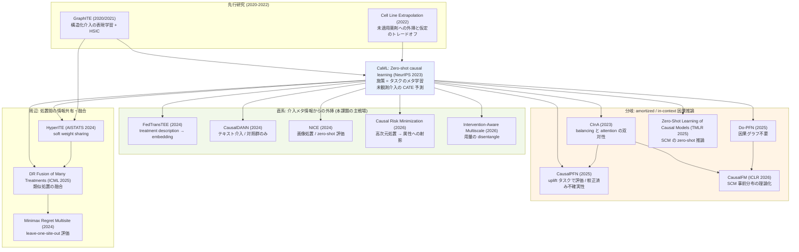

# C3: Zero-shot 施策効果予測 — リソース一覧

[← clustering index](../../../clustering/20260715/index.md)

## スコープ

学習時に一度も観測されていない介入（＝実施実績ゼロの施策）について、その **メタ情報（説明文・属性・埋め込み）から個別効果（CATE）を予測する**問題設定を対象とする。ユーザーが明示的に挙げた「実施実績のない情報 0 の施策についての予測」に直接対応するクラスタである。

含むもの:

- zero-shot causal learning / unseen treatment / novel intervention の問題設定そのもの
- causal meta-learning、amortized / in-context causal inference（未観測タスクへの汎化を担う系譜）
- treatment description・テキスト/画像/高次元処置からの効果推定
- 未観測な介入の**組み合わせ**への汎化
- campaign cold-start（特許・実務側の実装意図）
- **評価設計**（leave-one-treatment-out 等、実績ゼロ施策の検証プロトコル）

除外するもの:

- uplift / OPE の推定量そのものの内部（S/T/X-learner 比較、IPS/DR の分散削減など）
- 因果**探索**（causal discovery）そのもの。ただし「未観測介入への zero-shot 予測」を主目的とするものは含める

### 調査メモ: 本クラスタの構造について

CaML の forward citation を Semantic Scholar の citation graph API で全件確認した結果、**重要な発見が一つある**。CaML を引用する論文群の多数派は、cluster ファイルが想定していた「施策メタ情報からのゼロショット CATE 予測」の直系ではなく、**amortized / in-context causal inference（CausalPFN, Do-PFN, CausalFM, CInA）という別系譜**である。これらは「未観測の介入」ではなく「未観測の**データセット/タスク**」へゼロショット汎化する枠組みで、合成データで事前学習した単一の Transformer が新しい観測データに対して追加学習なしに因果効果を返す。本課題との関係は間接的だが、**「施策ごとにモデルを組み直さない」という運用形態**が数ヶ月に一度の低頻度施策と極めて相性が良いため、△〜○ 相当で収録した（詳細は「調査から見えた論点」参照）。

また、日本語での学術文献調査（2 クエリ）では、本設定を扱う日本語論文・技術記事は**発見できなかった**。日本語圏の uplift 記事は S/T/X-learner と AUUC の解説に集中しており、未実施施策への外挿を扱うものはない。これ自体が「この設定は英語圏の最前線にしか存在しない」ことの傍証であり、retrieval は英語文献に絞ってよい。

## リソース総覧

| # | タイトル | 種別 | 年 | リンク | 本課題との関連度 |
|---|---------|------|----|--------|----------------|
| 01 | Zero-shot causal learning (CaML) | Paper | 2023 | https://arxiv.org/abs/2301.12292 | ◎ |
| 02 | GraphITE: Estimating Individual Effects of Graph-structured Treatments | Paper | 2020/2021 | https://arxiv.org/abs/2009.14061 | ◎ |
| 03 | Causal Risk Minimization for High-Dimensional Treatments | Paper | 2026 | https://arxiv.org/abs/2605.27281 | ◎ |
| 04 | Federated Learning for Estimating Heterogeneous Treatment Effects (FedTransTEE) | Paper | 2024 | https://arxiv.org/abs/2402.17705 | ◎ |
| 05 | Estimating Causal Effects of Text Interventions Leveraging LLMs (CausalDANN) | Paper | 2024 | https://arxiv.org/abs/2410.21474 | ◎ |
| 06 | I See, Therefore I Do: Estimating Causal Effects for Image Treatments (NICE) | Paper | 2024 | https://arxiv.org/abs/2412.06810 | ○ |
| 07 | Dynamic Inter-treatment Information Sharing for ITE Estimation (HyperITE) | Paper | 2023/2024 | https://arxiv.org/abs/2305.15984 | ○ |
| 08 | Systems and methods for designing targeted marketing campaigns (US 11,715,130) | Patent | - | https://image-ppubs.uspto.gov/dirsearch-public/print/downloadPdf/11715130 | ◎ |
| 09 | Multitask transfer learning for optimization of targeted promotional programs (US 11,403,668) | Patent | - | https://image-ppubs.uspto.gov/dirsearch-public/print/downloadPdf/11403668 | ◎ |
| 10 | Systems and methods for multidimensional knowledge transfer for CTR prediction (US 12,236,457) | Patent | - | https://image-ppubs.uspto.gov/dirsearch-public/print/downloadPdf/12236457 | ○ |
| 11 | Minimax Regret Estimation for Generalizing HTE with Multisite Data | Paper | 2024 | https://arxiv.org/abs/2412.11136 | ○ |
| 12 | Causal Models, Prediction, and Extrapolation in Cell Line Perturbation Experiments | Paper | 2022/2025 | https://arxiv.org/abs/2207.09991 | ○ |
| 13 | Doubly Robust Fusion of Many Treatments for Policy Learning | Paper | 2025 | https://arxiv.org/abs/2505.08092 | ○ |
| 14 | CausalPFN: Amortized Causal Effect Estimation via In-Context Learning | Paper | 2025 | https://arxiv.org/abs/2506.07918 | ○ |
| 15 | Do-PFN: In-Context Learning for Causal Effect Estimation | Paper | 2025 | https://arxiv.org/abs/2506.06039 | △ |
| 16 | Foundation Models for Causal Inference via Prior-Data Fitted Networks (CausalFM) | Paper | 2025/2026 | https://arxiv.org/abs/2506.10914 | △ |
| 17 | Towards Causal Foundation Model: on Duality between Causal Inference and Attention (CInA) | Paper | 2023 | https://arxiv.org/abs/2310.00809 | ○ |
| 18 | Zero-Shot Learning of Causal Models (FiP amortized) | Paper | 2024/2025 | https://arxiv.org/abs/2410.06128 | △ |
| 19 | Intervention-Aware Multiscale Representation Learning from Imaging Phenomics and Perturbation Transcriptomics | Paper | 2026 | https://arxiv.org/abs/2604.22832 | △ |
| 20 | LLM-Driven Treatment Effect Estimation Under Inference Time Text Confounding | Paper | 2025 | https://arxiv.org/abs/2507.02843 | △ |
| 21 | Efficient Fine-Tuning of Single-Cell Foundation Models Enables Zero-Shot Molecular Perturbation Prediction | Paper | 2024 | https://arxiv.org/abs/2412.13478 | △ |

計 21 件（Paper 18 / Patent 3）。

## 各リソース詳細

### 01. Zero-shot causal learning (CaML)

**リンク**: https://arxiv.org/abs/2301.12292 ／ NeurIPS 2023 ／ 実装: https://github.com/snap-stanford/caml

**概要**: Nilforoshan, Moor, Roohani, Chen, Šurina, Yasunaga, Oblak, Leskovec（Stanford SNAP）による、本クラスタの問題設定を確立した中核論文である。「未実施の介入の個別効果を予測する」ことを zero-shot causal learning として定式化し、CaML という causal meta-learning フレームワークを提案する。中心的なアイデアは、**各介入の個別効果予測を 1 つの「タスク」とみなす**ことであり、介入・その受領者・非受領者をサンプリングして数千のタスクを構成し、その全体を横断して単一のメタモデルを訓練する。介入側の情報（薬剤の属性など）と個人側の特徴量（患者の履歴など）を両方入力として使うため、訓練時に存在しなかった介入に対しても、その属性さえ与えれば CATE を予測できる。医療保険請求データと細胞株摂動（LINCS）という 2 つの大規模実データで評価され、最も注目すべき結果として、**CaML のゼロショット予測が、対象介入のデータに直接アクセスできる強力なベースラインすら上回った**。さらに単一介入のみで訓練したモデルが、両方とも未観測の薬剤ペア（介入の組み合わせ）の効果を予測できることも示している。

**本課題への示唆**:
- 「施策 = タスク」というメタ学習の定式化は、ユーザーの「数ヶ月に一度の施策が数本しかない」状況にそのまま対応する。施策数 = タスク数であり、各施策のサンプルが少なくても、タスクを横断してメタモデルを訓練できる。
- ゼロショット予測が「直接データを持つベースライン」を上回った点は、実務的に極めて重要である。**新施策のために少量データを集めるより、過去全施策からメタ学習した方が精度が高い可能性**を示唆する。少量の実績データがあっても、それだけで組んだモデルより良いことがある。
- 単一介入 → 未観測の組み合わせへの汎化は、「クーポン額 × 訴求内容 × チャネル」の未実施な組み合わせを予測する形式に直結する。個別の軸を過去に振ってあれば、その掛け合わせが未実施でも予測できる。
- 施策メタ情報の設計（何を介入の属性として与えるか）が精度を左右する。ユーザーの「クーポン額・訴求内容・対象条件」がそのまま入力になる。

**キーとなる用語**: `zero-shot causal learning`, `causal meta-learning`, `task sampling`, `natural experiments`, `unseen intervention`, `intervention information`, `combinations of unseen interventions`, `LINCS`, `claims data`

---

### 02. GraphITE: Estimating Individual Effects of Graph-structured Treatments

**リンク**: https://arxiv.org/abs/2009.14061 ／ CIKM 2021 ／ Harada & Kashima（京都大学）

**概要**: CaML に先立ってゼロショット介入を明示的に扱った precursor である。介入の数が非常に多く、かつ介入自体がリッチな構造情報（グラフ）を持つ場合の効果推定を対象とし、薬剤の分子グラフを典型例とする。GraphITE は graph neural network で介入の表現を獲得し、介入を ID ではなく**構造から導かれる特徴ベクトル**として扱う。この表現を通じて、訓練時に観測されていない介入に対しても、その構造さえ与えれば効果を推定できる。もう一つの貢献は観測バイアスへの対処であり、HSIC（Hilbert-Schmidt Independence Criterion）正則化によって対象（個人）の表現と介入の表現の独立性を高め、「どの介入が誰に割り当てられやすいか」という選択バイアスを緩和する。日本の研究グループ（Kashima 研）の成果であり、CaML の 3 年前に「介入を表現学習して未観測介入へ外挿する」という発想を提示していた点で系譜上の起点にあたる。

**本課題への示唆**:
- 「介入を表現に落とせば未観測介入も扱える」という C2 → C3 の依存関係を最初に実証した論文であり、cluster ファイルが指定する読み順（C2 → C3）の理論的根拠になっている。
- HSIC 正則化による選択バイアス除去は実務上そのまま効く。過去施策は「効きそうな層」に恣意的に配布されているのが常であり、この交絡を落とさないとメタモデルは配布ルールを学習してしまう。
- 介入がグラフでなくとも、構造化された属性（クーポン額・訴求カテゴリ・チャネルの組）であれば同じ枠組みが適用できる。marketing への読み替えは自然である。
- CaML との差分は「メタ学習によるタスク横断訓練」の有無。GraphITE は表現共有のみで、CaML はさらにタスク構成を導入した点が進歩である。

**キーとなる用語**: `graph-structured treatment`, `GNN treatment representation`, `HSIC regularization`, `observation bias`, `zero-shot intervention`, `structured treatment`

---

### 03. Causal Risk Minimization for High-Dimensional Treatments

**リンク**: https://arxiv.org/abs/2605.27281 ／ Dhawan, Kim, Novikova, Paruthi, Gondara, Maddison（University of Toronto / Vector Institute / Vanguard）

**概要**: 古典的な因果推定量が「起こりうる全ての介入が観測されている」ことを暗黙に仮定している点を出発点とし、介入が広大な空間（例: 全てのテキスト文字列）にわたる場合にその仮定が成立しないことを指摘する。本論文は因果推論を高次元処置空間における**学習問題**として捉え直す。理論的な中心は、no unobserved confounding などの標準的仮定の下で、**因果誤差が次数の上がるモーメント balancing 誤差へ分解できる**ことを示した点であり、この分解から因果推定を直接改善する目的関数を設計する。実務的に最も重要な貢献は、**高次元処置の効果を低次元の処置属性へ射影する**手法で、これにより単一のモデルが属性ごとの再訓練なしに複数の因果的問いへ答えられる。高次元の連続・離散・テキスト処置（Amazon Reviews の半合成データを含む）で評価し、高次のモーメント balancing の効果と射影された因果推定の競争力を示した。

**本課題への示唆**:
- **「処置属性への射影」がユーザーの課題に直撃する**。クーポン額・訴求内容・チャネルという属性軸へ効果を射影すれば、「額を上げると効果はどう動くか」「この訴求軸はどれだけ効くか」を属性ごとのモデル再訓練なしに 1 モデルで答えられる。
- 「全ての介入が観測されている」という仮定の破綻を正面から扱う点で、実績ゼロ施策の問題を理論側から定式化している。CaML が経験的な枠組みなのに対し、本論文は誤差分解という理論的な足場を与える。
- moment balancing の考え方は、過去施策間の配布バイアス（どの施策が誰に打たれたか）を補正する道具として使える。GraphITE の HSIC と同じ問題への別解である。
- 2026 年と最新で、テキスト処置を扱う点も訴求文面と相性が良い。理論の難度は高いが retrieval 価値は大きい。

**キーとなる用語**: `causal risk minimization`, `high-dimensional treatments`, `moment balancing error`, `treatment attribute projection`, `text treatments`, `no unobserved confounding`

---

### 04. Federated Learning for Estimating Heterogeneous Treatment Effects (FedTransTEE)

**リンク**: https://arxiv.org/abs/2402.17705 ／ Makhija, Ghosh, Kim

**概要**: HTE 推定が処置ごとに大量のデータを要求する一方、介入コストが高いため各処置のデータを中央集約するのが困難であるという課題に対し、Federated Learning による機関横断の協調学習フレームワークを提案する。本クラスタにとって決定的に重要なのは、この論文が扱う設定が **「各サイトの処置が互いに異なり、それぞれ固有の特性を持ち、集約解析には不適合で、一部の処置は特定の機関でしか観測されない」** という点である。これはユーザーの「施策ごとに訴求内容もクーポン額も違う」状況の構造的な同型である。FedTransTEE は Transformer ベースで、共通の特徴表現を協調的に学習しつつ、処置固有の予測関数は個別かつプライベートに学習する。そして論文は明示的に、**新しく設計された処置について過去データが全く存在しない状況**を扱い、処置の説明文（treatment description）から treatment embedding を生成することで未観測処置の効果推定へ拡張できることを論じている。

**本課題への示唆**:
- 「処置の説明文から埋め込みを作り、未観測処置へ外挿する」という記述は、ユーザーの要求そのものである。CaML と同じ結論に別経路（federated + Transformer）から到達しており、アプローチの頑健性を示す。
- 「サイト = 施策」と読み替えると、federated の設定はそのまま「施策ごとにデータが分断され、処置内容も揃わない」状況のモデルになる。C1（data fusion）との橋渡しにもなる。
- 共通表現 + 処置固有ヘッドという構成は、partial pooling の深層学習版であり、施策数が少ない状況での実装指針として具体的である。
- プライバシー要件がなくても、この分割構造（共有すべき部分と施策固有の部分）の設計思想は単一組織内でも有用である。

**キーとなる用語**: `federated HTE`, `treatment description`, `treatment embedding`, `disparate treatments across sites`, `common feature representation`, `FedTransTEE`, `unseen treatments`

---

### 05. Estimating Causal Effects of Text Interventions Leveraging LLMs (CausalDANN)

**リンク**: https://arxiv.org/abs/2410.21474 ／ Guo, Marmarelis, Morstatter, Lerman（USC/ISI）

**概要**: 社会システムにおけるテキスト介入（例: SNS 投稿の怒りの度合いを下げる）の効果を定量化する問題を扱う。現実世界での介入がしばしば実行不可能であり、かつ二値・離散処置向けに設計された従来の因果推論手法が複雑・高次元なテキストデータを扱えないという二重の困難を指摘する。提案手法 CausalDANN は **LLM によるテキスト変換**を用いて介入をシミュレートし、任意のテキスト介入に対応できる点が特徴である。ドメイン適応能力を持つテキストレベル分類器（domain-adaptive text classifier）を利用することで、ドメインシフトに対して頑健な効果推定を実現する。特筆すべきは、**対照群しか観測されていない場合でも**効果推定が可能な点であり、これは「その介入を一度も実施していない」状況に対する直接的な回答になっている。

**本課題への示唆**:
- 「実施していない訴求文面の効果を、LLM で文面を生成・変換して推定する」という筋道は、ユーザーの訴求内容が施策ごとに異なる状況に対する実装可能な回答である。
- **対照群のみから効果を推定できる**という性質が実績ゼロ施策と正面から噛み合う。新しい訴求文面を LLM で生成し、その反応を推定するというワークフローが描ける。
- ドメイン適応が組み込まれている点は、過去施策と新施策で対象ユーザー層が違う状況（ユーザーの記述そのもの）に効く。
- 限界として、LLM のテキスト変換が「本当にその介入を再現しているか」は検証が必要。効果推定の妥当性は変換の忠実性に依存する。

**キーとなる用語**: `text intervention`, `CausalDANN`, `LLM text transformation`, `domain adaptation`, `domain-adaptive classifier`, `control group only`, `arbitrary textual interventions`

---

### 06. I See, Therefore I Do: Estimating Causal Effects for Image Treatments (NICE)

**リンク**: https://arxiv.org/abs/2412.06810 ／ Thorat, Kolla, Pedanekar

**概要**: 処置が画像である場合の個別因果効果推定を扱い、NICE（Network for Image treatments Causal effect Estimation）を提案する。既存手法の多くが多次元の処置情報をスカラー（連続または離散）に潰してしまい、処置が持つリッチな情報を捨てている点を問題視する。NICE は画像処置に含まれる多次元情報を有効に活用する方法を示し、改善された因果効果推定を得る。評価のために、**画像が処置として働く場合の潜在的結果を生成する半合成データシミュレーションフレームワーク**を新たに提案しており、この評価設計自体が本クラスタにとって参照価値を持つ。実験は複数の設定で行われ、その中に **zero-shot ケース（訓練時に見ていない画像処置での評価）** が明示的に含まれている。この設定で NICE は処置情報を取り込む既存モデルを大きく上回った。

**本課題への示唆**:
- バナー広告・クリエイティブ画像を処置として扱えることを示しており、訴求内容がテキストだけでなくビジュアルでも定義される実際のマーケティングに対応する。
- 「多次元の処置情報をスカラーに潰すな」という主張は本クラスタの根幹。施策を ID や単一の強度に還元した瞬間にゼロショット予測の足場が消える。
- 半合成シミュレーションによる評価フレームワークは、実データでゼロショット精度を測りにくい状況（後述の「評価設計の論点」）への一つの回答である。
- zero-shot 評価を実験設定として明示的に切っている点で、評価プロトコルの参照先になる。

**キーとなる用語**: `image treatments`, `NICE`, `multi-dimensional treatment information`, `semi-synthetic simulation`, `zero-shot setting`, `potential outcomes generation`

---

### 07. Dynamic Inter-treatment Information Sharing for ITE Estimation (HyperITE)

**リンク**: https://arxiv.org/abs/2305.15984 ／ AISTATS 2024 ／ Chauhan, Zhou, Ghosheh, Molaei, Clifton（Oxford）

**概要**: 観測研究から ITE を推定する際、限られたデータを処置群ごとに分割せざるを得ず、各群のサンプルが薄くなるという構造的な問題に取り組む。著者らは ITE 推定における end-to-end の情報共有について一般的な枠組みが存在しないことを指摘し、**soft weight sharing** に基づく深層学習フレームワークを提案する。これにより処置群間で動的かつ end-to-end な情報共有が可能になり、HyperITE と呼ばれる新しい ITE learner のクラスを導入する。既存の SOTA な ITE learner を HyperITE 版へ拡張し、IHDP、ACIC-2016、Twins ベンチマークで評価した。実験結果で最も重要なのは、**データセットが小さいほど本フレームワークの有効性が増す**という傾向であり、これは施策あたりのサンプルが少ない状況で効果が大きいことを意味する。

**本課題への示唆**:
- 「データが小さいほど効く」という結果が、数ヶ月に一度・1 施策あたりのサンプルが薄いユーザーの状況に正確に対応する。完全プールと完全独立の中間（partial pooling）の深層学習実装として読める。
- soft weight sharing は、施策間の類似度を事前に決め打ちせず**モデルに学習させる**アプローチ。「似た施策をグルーピングする」というユーザーの発想を、ハードなクラスタリングではなく連続的な重み共有で実現する。
- ゼロショットそのものは扱わない（訓練時に全処置群を見る）ため関連度は ○。ただし C2 → C3 の橋渡しとして、施策間情報共有の基礎技術を与える。
- HyperNetwork ベースなので、処置埋め込みを条件として与えれば未観測処置へ拡張できる余地がある。この拡張は論文自体は扱っていないが検討価値がある。

**キーとなる用語**: `soft weight sharing`, `HyperITE`, `inter-treatment information sharing`, `hypernetwork`, `end-to-end sharing`, `small data regime`

---

### 08. Systems and methods for designing targeted marketing campaigns（US 11,715,130）

**リンク**: https://image-ppubs.uspto.gov/dirsearch-public/print/downloadPdf/11715130

**概要**: 過去施策のデータを機械学習で活用し、訓練済みモデルを再利用（transfer learning）することで、**新規マーケティング施策の計画・実行を最適化する自動スコアリングサービス**の特許である。ターゲット施策向けに膨大な数のモデルを自動的に訓練・保存・再利用し、cohort 生成の高速な反復を可能にして、より最適な施策設定を不確実性を減らしながら探索する。本クラスタにとって決定的なのは、**「対象顧客の反応データが限られているか欠落している状況でも」ターゲティングと施策成果を改善する**と明記されている点であり、これは実績ゼロ施策そのものを商用システムの要件として掲げていることを意味する。さらに、効果的なチャネル（email / online / call）の特定、推定反応率が良好な施策メッセージの選択・開発の最適化、施策パラメータを変更して総合スコアの差分を観察する **"what if" シナリオの試行**まで含む。

**本課題への示唆**:
- 学術側（CaML 等）と同じ問題意識が商用特許として実装されており、**実務での実現可能性の裏付け**になる。研究段階の話ではない。
- "what if" シナリオ（施策パラメータを振ってスコアの変化を見る）は、ユーザーが次施策を設計する際の UI 要件そのもの。クーポン額を変えたらどうなるかを事前に試せる形式である。
- チャネル・メッセージ・cohort を施策パラメータとして扱う設計は、C2 の施策特徴量設計の実務的な参照先になる。
- 特許であるため手法の詳細は学術論文ほど精密ではない。ただし「何を入力とし何を出力するか」の要件定義として読む価値が高い。

**キーとなる用語**: `automated scoring service`, `transfer learning`, `model reuse`, `cohort generation`, `what-if scenario`, `limited or missing response data`, `campaign configuration`

---

### 09. Multitask transfer learning for optimization of targeted promotional programs（US 11,403,668）

**リンク**: https://image-ppubs.uspto.gov/dirsearch-public/print/downloadPdf/11403668

**概要**: 本調査で新たに発見した特許で、cluster ファイルには記載がない。**ターゲット販促プログラムの最適化を multitask transfer learning で行う**という、本課題の構造にそのまま一致する題名を持つ。マルチタスク学習の枠組みで複数の販促プログラム（＝施策）を同時に扱い、タスク間で知識を転移させることで、個々のプログラムのデータが薄くても最適化を可能にする意図が読み取れる。CaML の「施策 = タスク」というメタ学習の定式化と、multitask learning による施策横断の知識転移という発想が、学術と特許の両側で独立に到達している点が興味深い。No.08 と合わせて、「過去施策から新規施策へ転移する」という発想が商用実装として複数存在することを示す。

**本課題への示唆**:
- 「施策 = タスク」というマルチタスク定式化が、学術（CaML）と商用特許の双方で採用されている。ユーザーの発想が業界標準の方向と一致していることの強い裏付けになる。
- 販促プログラム（promotional program）という語彙はクーポン施策に直接対応する。No.08 より対象が絞られている分、ユーザーの状況に近い可能性がある。
- 特許のため詳細度は限定的。retrieval では claims を読んで、どの粒度でタスクを切り、何を共有パラメータにしているかを確認する価値がある。
- 特許調査の語彙として "multitask transfer learning" + "promotional" が有効であることが判明した。追加調査の起点になる。

**キーとなる用語**: `multitask transfer learning`, `targeted promotional programs`, `cross-program knowledge transfer`, `task-level sharing`

---

### 10. Systems and methods for multidimensional knowledge transfer for CTR prediction（US 12,236,457）

**リンク**: https://image-ppubs.uspto.gov/dirsearch-public/print/downloadPdf/12236457

**概要**: CTR 予測における不均衡データ問題とコールドスタート問題を、3 種の知識転移モデルで解決する特許である。第一の **hierarchical knowledge transfer model** は、計算広告の典型的な組織構造（上位に ad account ノード、中間に ad campaign ノード、下位に ad group ノード）の階層性を利用して不均衡データ問題を解く。第二の **horizontal knowledge transfer model** がコールドスタート問題を担い、キーワードや類似度といったノードの特徴に基づいてノードグラフを構築し、既存・過去のノードから学習した知識をグラフに追加された新規ノードへ伝播させることで、訓練データがほとんど、あるいは全くない新規ノードの CTR 予測を可能にする。第三の **multidimensional knowledge transfer model** は前二者を統合し、複数次元に沿った知識転移を行う包括的な学習フレームワークを構成する。

**本課題への示唆**:
- horizontal knowledge transfer が実績ゼロ施策に直接対応する。「新規ノード（＝新施策）を既存ノードとの類似度グラフ上に置き、知識を伝播させる」という設計は、ユーザーの「似た施策をグルーピングする」発想のグラフ版実装である。
- 階層構造（account → campaign → ad group）は partial pooling の階層ベイズと同型であり、C1 との接続点になる。施策階層をどう切るかの実務的な参照になる。
- 対象が CTR 予測であって因果効果（uplift）ではない点は注意。相関ベースの予測であり、そのまま uplift へ転用はできない。関連度 ○ の理由である。
- 特許の 3 モデル構成は、不均衡（データ量の偏り）とコールドスタート（データ皆無）を別問題として切り分けており、この問題分解自体が有用である。

**キーとなる用語**: `horizontal knowledge transfer`, `hierarchical knowledge transfer`, `cold start`, `node graph`, `knowledge propagation`, `imbalanced data`, `CTR prediction`

---

### 11. Minimax Regret Estimation for Generalizing HTE with Multisite Data

**リンク**: https://arxiv.org/abs/2412.11136 ／ Zhang, Huang（Yale）, Imai（Harvard）

**概要**: 複数サイトのデータから HTE を一般化する問題を扱い、**対象母集団がソースサイトと未知かつ観測不能な形で異なりうる**という困難に取り組む。著者らは minimax-regret の枠組みを提案し、対象母集団の CATE がサイト固有 CATE の凸結合として表現できるようなクラスを考え、そのクラス上での最悪ケースの regret を最小化することで汎化可能な CATE モデルを学習する。得られる CATE モデルは解釈可能な閉形式解を持ち、サイト固有 CATE モデルの加重平均として表現される。これにより各サイト内では柔軟な CATE 推定手法を用いつつ、サイト固有推定を集約できる。本クラスタにとって特に重要なのは、論文が **各実験サイトを hold out して対象母集団とみなし、残りをソースとする leave-one-out 評価**を実施している点で、これは実績ゼロ施策の評価プロトコルの直接的な参照実装である。

**本課題への示唆**:
- **leave-one-site-out 評価の具体的な実装例**として、本クラスタの最大の論点（評価設計）に直接答える。サイトを施策に読み替えれば leave-one-campaign-out がそのまま得られる。
- 「対象が未知の形で異なる」という前提が、次施策の対象ユーザー層が過去と違う状況に対応する。楽観的な仮定を置かず最悪ケースを抑えるのは、施策数が少ない実務で保守的な意思決定を支える。
- 閉形式解（サイト固有モデルの加重平均）は実装が軽く、各施策で既存の uplift モデルを組んでから重み付けするだけで済む。既存資産を捨てずに済む点が実務的である。
- ゼロショットそのものではない（対象サイトのデータは使わないが、介入自体は既知）ため ○。しかし評価設計の観点では ◎ 級の価値がある。

**キーとなる用語**: `minimax regret`, `multisite data`, `HTE generalization`, `convex combination of site-specific CATEs`, `leave-one-site-out`, `distributionally robust`, `unknown target population`

---

### 12. Causal Models, Prediction, and Extrapolation in Cell Line Perturbation Experiments

**リンク**: https://arxiv.org/abs/2207.09991 ／ BMC Bioinformatics 2025 ／ Long, Yang, Do

**概要**: 細胞株摂動実験では、細胞群に外部作用因子（薬剤など）を与えて応答（タンパク質発現など）を測定するが、**コスト制約により起こりうる摂動のごく一部しか実際に試験できない**。この制約が計算モデル（in silico）による応答予測の開発を促した、という問題設定は、施策実施にコストがかかり全パターンを試せないマーケティングの状況と構造的に同一である。本論文は Melanoma 癌細胞株データで因果モデルと非因果の回帰モデルを摂動応答予測について比較する。2 つの推定量を導出し、線形回帰（LR）推定量と Causal Structure Regression（CSR）と呼ばれる因果構造学習推定量を提示する。決定的な結論は、**CSR は LR より多くの仮定を要するが、訓練データで適用されなかった薬剤の効果を予測できる**という点である。すなわち因果構造を明示的にモデル化することが未観測介入への外挿の対価として仮定の追加を要求する、というトレードオフを明確に示している。

**本課題への示唆**:
- **「未観測介入へ外挿するには追加の仮定が要る」というトレードオフを明示した点**が本クラスタで最も価値がある。ゼロショット予測はタダではなく、構造的仮定と引き換えに得られる。
- 「コスト制約で全組み合わせを試せない」という動機がユーザーの状況（数ヶ月に一度しか打てない）と同型であり、生物学側の成熟した議論をマーケティングへ輸入する足場になる。
- 因果モデル vs 非因果モデルの比較という方法論は、実務で「そもそも因果モデルを組む必要があるか」を判断する枠組みを与える。外挿が要らないなら LR で十分、という判断もありうる。
- 対象領域が細胞株なので直接転用はできない。ただし cluster が指摘する「創薬・遺伝子摂動分野の読み替え」の具体例である。

**キーとなる用語**: `extrapolation`, `Causal Structure Regression (CSR)`, `unapplied drugs`, `cost constraint`, `in silico prediction`, `causal vs non-causal models`, `additional assumptions`

---

### 13. Doubly Robust Fusion of Many Treatments for Policy Learning

**リンク**: https://arxiv.org/abs/2505.08092 ／ ICML 2025 ／ Zhu, Chu, Lipkovich, Ye, Yang

**概要**: 個別化処置ルール（ITR）の学習において、**処置群が多数存在する場合にデータが各群で疎になり、共変量分布が群間で大きく不均衡になる**という課題に取り組む。提案手法は calibration-weighted treatment fusion 手順であり、処置群間で共変量を頑健にバランスさせつつ、penalized working model によって**類似した処置を融合（fuse）**する。理論的には、calibration モデルまたは outcome モデルのいずれかが正しく特定されていれば潜在的な処置群構造を回復できるという二重頑健性を持ち、consistency、処置融合の oracle property、policy tree 等の多腕 ITR 学習手法と統合した際の regret bound を確立する。実データとして慢性リンパ性白血病患者の全国規模 EHR データベースで有用性を示す。

**本課題への示唆**:
- **「類似した処置を融合する」が、ユーザーの「似た施策をグルーピングして擬似的にデータ間隔を短縮する」という発想の、統計的に厳密な定式化**である。ヒューリスティックなクラスタリングではなく、oracle property を持つ手続きとして与えられる。
- 二重頑健性により、calibration か outcome のどちらかが当たっていればよい。モデル誤特定が避けられない実務では現実的な保証である。
- 処置群間の共変量不均衡への対処は、過去施策が異なる対象層に打たれている状況（ユーザーの記述）に直接対応する。
- ゼロショットではなく既知処置の融合が対象なので ○。ただし「グルーピングの正しいやり方」を知る上では必読に近い。C2 との境界に立つ論文である。

**キーとなる用語**: `treatment fusion`, `calibration weighting`, `doubly robust`, `many treatments`, `latent treatment group structure`, `oracle property`, `penalized working model`, `ITR`

---

### 14. CausalPFN: Amortized Causal Effect Estimation via In-Context Learning

**リンク**: https://arxiv.org/abs/2506.07918 ／ NeurIPS 2025 ／ Balazadeh, Kamkari, Thomas, Li, Ma, Cresswell, Krishnan ／ 実装: https://github.com/vdblm/CausalPFN

**概要**: 因果効果推定を amortize する単一の Transformer である。ignorability を満たす data-generating process の大規模ライブラリ上で**一度だけ訓練**され、新しい観測データセットに対して追加学習なしで（out of the box）因果効果を推論する。Bayesian causal inference のアイデアと prior-fitted networks（PFN）の大規模訓練プロトコルを組み合わせ、生の観測値から因果効果へ直接写像することを学習し、タスク固有の調整を一切必要としない。HTE / ATE 推定ベンチマーク（IHDP, Lalonde, ACIC）で優れた平均性能を達成し、**実世界の政策決定に関わる uplift modeling タスクでも競争力ある性能**を示した点が本課題にとって重要である。さらに Bayesian の原理に基づく **calibrated uncertainty estimates** を提供し、信頼できる意思決定を支える。

**本課題への示唆**:
- **uplift modeling タスクで評価されている**点で、本クラスタの amortized 系譜の中では最もユーザーの応用に近い。in-context learning が uplift に効くという実証がある。
- 「施策ごとにモデルを組み直さない」運用形態が、数ヶ月に一度の施策サイクルと相性が良い。新施策のデータが少量でも、文脈として与えるだけで効果推定が返る。
- **calibrated uncertainty** が実績ゼロ・少量データの状況で決定的に重要である。点推定だけでは意思決定できず、「どれだけ不確かか」が予算配分の判断を左右する。
- 注意点として、CausalPFN の「ゼロショット」は**未観測データセットへの汎化**であって、CaML の「未観測介入への汎化」とは別物である。混同すると誤読する。この区別は retrieval で必ず確認すべきである。

**キーとなる用語**: `amortized causal inference`, `in-context learning`, `prior-fitted network (PFN)`, `ignorability`, `calibrated uncertainty`, `uplift modeling`, `out-of-the-box inference`

---

### 15. Do-PFN: In-Context Learning for Causal Effect Estimation

**リンク**: https://arxiv.org/abs/2506.06039 ／ Robertson, Reuter, Guo, Hollmann, Hutter, Schölkopf

**概要**: 既存の因果効果推定手法が、介入データ・真の因果グラフの知識・unconfoundedness のような仮定のいずれかを要求し、実世界での適用が制限されるという問題から出発する。表形式機械学習の領域で prior-data fitted networks（PFN）が合成データでの事前学習と in-context learning によって SOTA な予測性能を達成していることを踏まえ、これがより困難な因果効果推定へ転用できるかを検証する。介入を含む多様な因果構造から引いた合成データで PFN を事前学習し、観測データが与えられたときの介入的結果（interventional outcome）を予測する。合成のケーススタディによる広範な実験を通じて、**基礎となる因果グラフの知識なしに**因果効果を正確に推定できることを示した。

**本課題への示唆**:
- 因果グラフを知らなくてよいという性質は実務上大きい。マーケティングで真の因果構造を書き下すのは非現実的であり、この仮定の緩和には価値がある。
- ただし評価が合成データのケーススタディ中心であり、実データでの検証が CausalPFN ほど厚くない。実務適用の判断には追加検証が要る。関連度 △ の理由である。
- 「未観測介入」ではなく「未知の因果構造」への対処が主眼であり、本クラスタの中心設定からは一歩離れる。No.14 と同じ注意が要る。
- 系譜理解のためには押さえておくべき。Schölkopf / Hutter という因果推論と AutoML の両側の重鎮が関わる点で、この方向の勢いを示す。

**キーとなる用語**: `Do-PFN`, `prior-data fitted network`, `interventional outcome prediction`, `synthetic pre-training`, `causal graph agnostic`, `in-context learning`

---

### 16. Foundation Models for Causal Inference via Prior-Data Fitted Networks (CausalFM)

**リンク**: https://arxiv.org/abs/2506.10914 ／ ICLR 2026 ／ Ma, Frauen, Javurek, Feuerriegel（LMU Munich）／ 実装: https://github.com/yccm/CausalFM

**概要**: 様々な因果推論設定において PFN ベースの基盤モデルを訓練するための包括的フレームワーク CausalFM を提示する。PFN は、あらかじめ指定した事前分布から生成された合成データで事前学習される Transformer であり、in-context learning を通じて Bayesian 推論を可能にする。本論文の理論的貢献は、**構造的因果モデル（SCM）に基づく因果推論のための Bayesian 事前分布の構成を原理的に形式化**し、そうした事前分布の妥当性に必要な基準を導出した点である。さらに causality-inspired Bayesian neural network を用いた新しい事前分布の族を提案し、back-door / front-door / instrumental variable 調整を含む多様な設定で Bayesian 因果推論を実行可能にする。ICLR 2026 採択で、toolkit も公開されている。

**本課題への示唆**:
- back-door / front-door / IV という複数の識別戦略を単一の枠組みで扱える点は、施策データの交絡構造が施策ごとに異なる状況で有用になりうる。
- 事前分布の妥当性基準を理論的に導出している点で、amortized 系譜の中では最も基礎が固い。この系譜を深く理解するならここが起点になる。
- 一方で本課題の中心（未実施施策のメタ情報からの外挿）からは距離があり、汎用的な因果推論基盤モデルの話である。関連度 △。
- toolkit が公開されているため、実験的に触ってみる価値はある。ただし優先度は CaML 系の後である。

**キーとなる用語**: `CausalFM`, `prior-data fitted networks`, `Bayesian prior for causal inference`, `structural causal model`, `back-door / front-door / IV adjustment`, `causality-inspired BNN`

---

### 17. Towards Causal Foundation Model: on Duality between Causal Inference and Attention (CInA)

**リンク**: https://arxiv.org/abs/2310.00809 ／ Zhang, Jennings, Zhang, Ma（Microsoft Research / Causica）

**概要**: 処置効果推定のための causally-aware な基盤モデル構築への第一歩を標榜する論文である。提案手法 CInA（Causal Inference with Attention）は理論的に正当化された手法であり、**複数のラベルなしデータセットを用いて自己教師あり因果学習を行い、その後に新しいデータを伴う未観測タスクに対してゼロショット因果推論を可能にする**。理論的な中心は、**最適な共変量バランシングと self-attention の間の primal-dual な関係**を示した点であり、この双対性によって、訓練済み Transformer 型アーキテクチャの最終層を通じたゼロショット因果推論が実現される。因果推論のような複雑なタスクでは、込み入った推論ステップと高い数値精度の要求ゆえに基盤モデル化が遅れていた、というギャップを埋めることを狙う。

**本課題への示唆**:
- 共変量バランシングと self-attention の双対性という理論的洞察は、amortized 系譜の中で最も概念的に深い。なぜ Transformer が因果推論に効くのかを説明する。
- 「未観測タスクへのゼロショット因果推論」という言明が CaML の「未観測介入」と表面上似ているため、**両者の違いを理解することが本クラスタの誤読を防ぐ鍵**になる。CInA は新データセット、CaML は新介入である。
- 自己教師あり学習で複数のラベルなしデータセットを活用する点は、過去の施策ログを効果ラベルなしでも事前学習に使える可能性を示唆する。
- CaML と同時期（2023）に別方向から基盤モデル化を試みた論文であり、系譜図上の分岐点にあたる。

**キーとなる用語**: `CInA`, `causal foundation model`, `primal-dual duality`, `covariate balancing`, `self-attention`, `self-supervised causal learning`, `zero-shot causal inference`

---

### 18. Zero-Shot Learning of Causal Models (FiP amortized)

**リンク**: https://arxiv.org/abs/2410.06128 ／ TMLR 2025 ／ Mahajan ら

**概要**: データセットごとに個別の生成モデルを学習するのではなく、**データセットの因果生成過程をゼロショットで推論できる単一のモデル**を学習することを提案する。Fixed-Point Approach（FiP）を拡張し、データセットの経験的表現を条件として生成 SCM を推論できるようにする。技術的には、Transformer ベースのアーキテクチャでデータセット埋め込みの amortized 学習を行い、その埋め込みを条件として因果メカニズムを推論する。実験では、amortized な手続きが in / out-of-distribution の両問題において各データセット専用に訓練されたベースラインと同等の性能を示し、さらに**データが乏しい領域（scarce data regime）ではベースラインを上回った**。副産物として、推論時にパラメータ更新なしで新規 SCM から観測データ・介入データを生成でき、介入された（intervened）データセットも推論できる。

**本課題への示唆**:
- **scarce data regime で専用モデルを上回る**という結果が、施策あたりのデータが薄い状況に効く。CaML の「直接データを持つベースラインを上回る」と同じ現象が別系譜でも観測されている点は注目に値する。
- 推論時にパラメータ更新なしで介入データを生成できる性質は、施策のシミュレーションに使える可能性がある。ただし SCM の生成であって施策効果の直接予測ではない。
- タイトルが "Zero-Shot Learning of Causal Models" で CaML の "Zero-shot causal learning" と酷似しているが、**扱う対象は因果モデル（SCM）そのものであり、介入効果ではない**。用語の衝突に注意が必要で、関連度 △ とした。
- Semantic Scholar の citation graph ではこの arXiv ID が別題（"Amortized Inference of Causal Models via Conditional Fixed-Point Iterations"）で登録されていた。改題されたと見られ、arXiv 本体の題を採用した。

**キーとなる用語**: `Fixed-Point Approach (FiP)`, `dataset embedding`, `amortized SCM inference`, `zero-shot SCM`, `scarce data regime`, `intervened dataset generation`

---

### 19. Intervention-Aware Multiscale Representation Learning from Imaging Phenomics and Perturbation Transcriptomics

**リンク**: https://arxiv.org/abs/2604.22832

**概要**: 創薬におけるマルチモーダル学習の課題を扱う。既存のマルチモーダル手法が weakly paired なデータにおける**細胞種と用量（dose）の変動を無視しており、それが未観測介入への汎化を制限している**という点を出発点とする。著者らは intervention-aware distillation フレームワークを導入し、摂動トランスクリプトミクスを用いて画像表現学習を導く。構成要素は 2 つあり、第一に transcriptome-conditioned teacher が遺伝子発現と介入メタデータを統合し、薬剤類似性で organize された chemistry-aware codebook 上の soft distribution を生成する。第二に、この teacher はファインチューンされた single-cell 基盤モデルを用いて細胞種の文脈を encode し、**用量効果を disentangle** する。決定的な点は、用量変動を明示的に扱い identity shortcut を回避することで、限られた paired データから転移可能な表現を学習できることである。

**本課題への示唆**:
- **用量（dose）の disentangle がクーポン額に直結する**。「同じ訴求内容でクーポン額だけ違う」施策を区別して扱う設計であり、ユーザーの C6 的関心（連続処置としてのクーポン額）と C3 を繋ぐ。
- 「介入メタデータ + 類似度で organize された codebook」という構成は、施策メタ情報の構造化方法として参考になる。施策を類似度空間に配置する具体的な実装である。
- identity shortcut の回避（モデルが介入の中身でなく ID を覚えてしまう問題）は、施策数が少ない状況で必ず起きる失敗モードであり、この指摘は実務的に重要である。
- 創薬ドメイン特化で読み替えコストが高いため △。ただし「用量 × 文脈 × 介入メタ情報」の三つ組を扱う設計は他に例が少ない。

**キーとなる用語**: `intervention-aware distillation`, `dose disentanglement`, `chemistry-aware codebook`, `identity shortcut`, `weakly paired data`, `unseen interventions`, `transcriptome-conditioned teacher`

---

### 20. LLM-Driven Treatment Effect Estimation Under Inference Time Text Confounding

**リンク**: https://arxiv.org/abs/2507.02843

**概要**: 訓練時には交絡因子が完全に観測されているが、**推論時にはテキスト（例: 自己申告の症状）を通じて部分的にしか利用できない**という現実的なギャップを扱う。この設定は、訓練データと本番環境で利用可能な情報が異なるという実務で頻出する問題を定式化したものである。著者らは inference time text confounding を明示的に考慮した処置効果推定フレームワークを提案し、LLM とカスタムの doubly robust learner を組み合わせてバイアスを緩和する。訓練時のリッチな交絡情報を活かしつつ、推論時のテキストのみの入力でも妥当な推定を行うことを狙う。

**本課題への示唆**:
- 「訓練時と推論時で使える情報が違う」という構造は、新施策の予測時に過去施策ほど詳細な情報がない状況と同型である。実績ゼロ施策では説明文しかない、というのがまさにこれである。
- LLM + doubly robust の組み合わせは、テキスト情報を因果推論のパイプラインへ入れる際の実装パターンとして参照できる。
- ただし主眼は交絡（confounding）であって未観測介入ではない。本クラスタの中心設定からは離れるため △。
- No.05（CausalDANN）と合わせて読むと、テキストが「介入」として入る場合と「交絡」として入る場合の違いが整理できる。

**キーとなる用語**: `inference time text confounding`, `doubly robust learner`, `LLM-driven estimation`, `partial confounder observability`, `train-inference information gap`

---

### 21. Efficient Fine-Tuning of Single-Cell Foundation Models Enables Zero-Shot Molecular Perturbation Prediction

**リンク**: https://arxiv.org/abs/2412.13478

**概要**: single-cell 基盤モデルから学習されたリッチな生物学的表現を活用し、**drug-conditional adapter** を組み込むことでゼロショット設定における頑健な予測を可能にする。パラメータ効率の良いファインチューニング手法により、基盤モデル全体を再訓練することなく、摂動予測タスクへ適応させる。**未観測の薬剤（unseen drugs）、そして特に未観測の細胞株（unseen cell lines）の予測において SOTA な性能**を示した点が本クラスタとの接点である。CaML が LINCS（細胞株摂動）で評価していたことを踏まえると、同じ応用領域におけるゼロショット手法の最新形として位置づけられる。

**本課題への示唆**:
- 「未観測の薬剤 × 未観測の細胞株」という二重の未観測への汎化は、「未実施施策 × 新規ユーザーセグメント」という二重のコールドスタートに対応する。ユーザーの「対象ユーザーのグルーピング」との掛け合わせで生じる状況である。
- drug-conditional adapter という設計（基盤モデル + 介入条件付きの軽量アダプタ）は、施策条件付きアダプタとして読み替えられる実装パターンである。
- パラメータ効率の良いファインチューニングは、施策ごとにフルモデルを訓練できない実務的制約への回答になる。
- 創薬ドメインであり、マーケティングへの直接転用はできないため △。系譜の最新動向の確認用である。

**キーとなる用語**: `drug-conditional adapter`, `parameter-efficient fine-tuning`, `single-cell foundation model`, `zero-shot perturbation prediction`, `unseen drugs`, `unseen cell lines`

## 評価設計の論点

本クラスタの最大の実務的論点は手法そのものではなく、**「一度も実施していない施策の予測精度を、どうやって検証するのか」**である。実施していない以上、正解ラベルが存在しないという根本的な循環がある。調査から確認できた評価プロトコルを整理する。

| プロトコル | 手続き | 採用例 | 長所 | 短所・注意点 |
|-----------|--------|--------|------|-------------|
| **Leave-one-treatment-out (LOTO)** | 各施策を 1 つずつ hold out し、残りの施策のみで訓練したモデルでその施策の効果を予測、実測 CATE と比較 | CaML (No.01) の zero-shot 評価の基本形 | 実績ゼロ施策の状況を最も忠実に再現。実測正解がある | 施策数が少ないと分散が大きい。ユーザーの状況（施策数本）では推定が不安定になりうる |
| **Leave-one-site-out** | 各サイト（≒施策・環境）を対象母集団とみなして hold out、残りをソースとして汎化性能を測る | Minimax Regret (No.11) が明示的に実施 | 対象母集団の差異を含めて評価できる。閉形式解で軽い | 介入自体は既知の設定。「未観測介入」の評価ではない |
| **Leave-one-drug-out (LODO)** | ある薬剤を訓練から除外し、その薬剤が適用された全条件をテストに使う | 創薬・摂動分野の標準（No.12, No.21 の周辺） | 介入単位での hold out が明確。ドメインでの実績が厚い | ドメイン固有の設計。施策へは読み替えが要る |
| **半合成シミュレーション** | 処置が与えられたときの潜在的結果を生成する枠組みを構築し、既知の真値に対して評価 | NICE (No.06) が画像処置向けに新規提案。CausalPFN/Do-PFN (No.14, 15) は合成 DGP で事前学習 | 真の CATE が既知。施策数が少なくても大量に評価できる | 生成過程の仮定が評価結果を規定する。現実との乖離リスク |
| **組み合わせ汎化テスト** | 単一介入のみで訓練し、未観測の介入ペアで評価 | CaML (No.01) の薬剤ペア実験 | 「軸は既知・掛け合わせが未知」という実務状況に一致 | 単一介入の実績が各軸で必要。完全なゼロではない |
| **直接データ持ちベースラインとの比較** | ゼロショット予測を、対象介入のデータに直接アクセスできるモデルと比較 | CaML (No.01) が採用し、上回ることを示した | 「ゼロショットで十分か」という実務判断に直答する | 上回る保証はない。ベースラインの強さに依存 |

**ユーザーの状況への含意**:

- 施策数が数本しかない場合、LOTO の推定は非常に不安定になる。**半合成シミュレーションとの併用**が現実的である。過去施策から DGP を推定し、そこで LOTO の分散も含めて評価する二段構えが要る。
- 最も実務的に意味を持つのは **CaML の「直接データ持ちベースラインとの比較」**である。「新施策に少量データを集めてモデルを組む」vs「過去施策からメタ学習してゼロショット予測」のどちらが良いかは、この比較でしか答えられない。
- **完全なゼロショットである必要はない**という視点が重要である。CaML の組み合わせ汎化のように、「クーポン額は過去に振ってある、訴求軸も振ってある、その掛け合わせが未実施」という状況なら、各軸の実績が足場になる。ユーザーの施策が完全に無関係でない限り、実質的にはこちらに近い。
- 評価指標そのもの（AUUC / Qini）はスコープ外だが、**ゼロショット設定では施策単位の効果の順位付けが実務目的**になるため、施策間の順位相関（どの施策が最も効くか）を測る方が、個別 CATE の RMSE より意思決定に直結する可能性がある。この論点は各論文で扱いが分かれており、retrieval で確認すべきである。

## CaML 引用ネットワークの構造

Semantic Scholar の citation graph API で CaML の被引用論文を全件確認した結果、系譜は**明確に 2 つの流れへ分岐**している。左の「介入メタ情報からの外挿」が本課題の直系であり、右の「amortized / in-context 因果推論」は CaML を引用しつつも別問題（未観測データセットへの汎化）を扱う。この分岐を理解しないと、CaML の引用を辿るだけでは的外れな論文群に流れ込む。

**この図の読み方**:

- **左（緑）が本課題の直系**。「介入のメタ情報を入力として未観測介入へ外挿する」という CaML の問題設定を継承し、介入の様態（テキスト・画像・高次元・用量）を広げていく方向に発展している。retrieval の主軸はここである。
- **右（橙）は用語が似ているが別問題**。CaML を引用するが、ゼロショットの対象が「介入」ではなく「データセット/タスク」である。ただし CausalPFN が uplift で評価されている通り、運用形態（施策ごとにモデルを組み直さない）としては本課題に効く。
- **下（周辺）は処置間の情報共有**。C2 との境界に立ち、「似た施策をどう束ねるか」というユーザーの発想に統計的な裏付けを与える。
- 特許（US 11,715,130 / 11,403,668 / 12,236,457）は学術の引用網には現れないが、同じ問題意識に商用側から独立に到達しており、図の外側で直系と並走している。

## 調査から見えた論点

1. **「ゼロショット」という語が 2 つの異なる意味で使われている**。本調査で最も注意を要する発見である。CaML 系は「**未観測の介入**への汎化」、CausalPFN / Do-PFN / CInA 系は「**未観測のデータセット/タスク**への汎化」を指す。両者は CaML を共通の引用元としながら別の問題を解いており、タイトルだけで判断すると誤読する。ユーザーの課題（実績ゼロ施策）に直接答えるのは前者である。ただし後者も「施策ごとにモデルを組み直さない」という運用形態としては有用で、CausalPFN が uplift タスクで評価されている点は無視できない。

2. **ゼロショット予測は「直接データを持つモデル」を上回りうる**。CaML の最も強い結果であり、No.18（FiP）でも scarce data regime で同種の現象が独立に観測されている。これは実務判断を反転させる可能性がある。新施策のために小規模テストを打ってモデルを組むより、過去全施策からメタ学習した方が精度が高いことがある。ユーザーの「数ヶ月に一度」というサイクルでは、事前テストの時間的コストも考えると、この含意は大きい。

3. **外挿には仮定の対価がある**。No.12 が最も明確に示した論点で、CSR は LR より多くの仮定を要する代わりに未適用薬剤の効果を予測できる。ゼロショット予測は無料ではなく、施策メタ情報が効果を十分に説明するという構造的仮定と引き換えに得られる。この仮定が破れる典型は、施策の効果が説明文に現れない要因（実施タイミング、季節性、競合の動き）に強く依存する場合である。ユーザーの施策が数ヶ月に一度であることは、まさにこの時間的要因の影響を受けやすいことを意味し、**仮定の妥当性検証が実装以上に重要**になる。

4. **「完全にゼロ」の施策は実は稀である**。CaML の組み合わせ汎化（単一介入で訓練 → 未観測ペアを予測）が示す通り、実務の「新施策」は多くの場合「既知の軸の未知の組み合わせ」である。クーポン額 3 水準 × 訴求 4 種のうち 5 通りしか実施していなくても、残り 7 通りは各軸の実績を足場にできる。ユーザーの課題を「完全なゼロショット」と捉えるより「**組み合わせの外挿**」と捉え直した方が、解ける問題になる可能性が高い。これは問題設定の再定義として retrieval 前に確認する価値がある。

5. **選択バイアスの除去が全手法に共通する前処理**である。GraphITE の HSIC 正則化、Causal Risk Minimization の moment balancing、DR Fusion の calibration weighting、CInA の covariate balancing と、系譜の全域で同じ問題への異なる解が現れる。過去施策は「効きそうな層」に恣意的に配布されているのが常であり、これを落とさないとメタモデルは施策の効果ではなく配布ルールを学習する。ユーザーの「対象ユーザーのグルーピング」が施策ごとに違うという記述は、この交絡が実際に存在することを示しており、**どの手法を選んでもこの処理は避けられない**。

6. **日本語圏にこの設定の文献が存在しない**。日本語での調査（2 クエリ）では、uplift の S/T/X-learner 解説と AUUC の記事しか見つからず、未実施施策への外挿を扱うものは皆無だった。GraphITE が日本の研究グループ（京大 Kashima 研）の成果である一方、日本語での実務向け解説には降りてきていない。retrieval は英語文献に絞ってよく、また社内での説明時には概念の翻訳から始める必要があることを意味する。

7. **学術と特許が独立に同じ結論へ到達している**。US 11,403,668（multitask transfer learning for promotional programs）は CaML の「施策 = タスク」定式化と、US 11,715,130 は「反応データが限られるか欠落した状況でのスコアリング」という問題意識と、それぞれ独立に一致する。学術側が理論を、特許側が「反応データが欠落していても動くこと」を製品要件として掲げており、**この設定の実務的実現可能性には両側からの裏付けがある**。

8. **評価設計こそが最大の障壁**であり、手法選択より先に決めるべきである。施策数が数本という制約下では LOTO の分散が大きく、半合成シミュレーションとの併用が要る。そして最も実務的に意味のある評価は「ゼロショット予測 vs 少量データで組んだモデル」の直接比較である。この比較設計を先に固めないと、どの手法を導入しても導入判断ができない。

## retrieval 推奨

優先的に精読すべき上位 6 本を挙げる。**No.01 → No.04 → No.03 の順が本課題の最短経路**である。

| 順位 | リソース | 理由 |
|------|---------|------|
| **1** | **01. Zero-shot causal learning (CaML)** | 本クラスタの中核であり、問題設定そのものを定義した論文。「施策 = タスク」のメタ学習定式化、単一介入 → 未観測の組み合わせへの汎化、そして「直接データを持つベースラインを上回る」という実務判断を反転させうる結果の 3 点は、いずれも精読でしか正確に取れない。実装（snap-stanford/caml）も公開されており、評価プロトコルの詳細を確認する必要がある。**これを読まずに他を読む意味はない**。 |
| **2** | **04. FedTransTEE (Federated HTE)** | 「各サイトの処置が互いに異なり固有の特性を持ち、一部の処置は特定機関でしか観測されない」という設定が、ユーザーの「施策ごとに訴求もクーポン額も違う」状況の構造的同型である。かつ treatment description → treatment embedding による未観測処置への拡張を明示的に論じており、CaML と同じ結論へ別経路から到達している。**アプローチの頑健性を確認する意味で 2 番目**。 |
| **3** | **03. Causal Risk Minimization for High-Dimensional Treatments** | 「高次元処置の効果を低次元の処置属性へ射影し、単一モデルで複数の因果的問いに答える」という貢献が、クーポン額・訴求内容・チャネルという属性軸への分解に直撃する。2026 年と最新で、テキスト処置も扱う。理論的難度は高いが、**属性射影は他のどの論文にもない実務的価値**を持つ。 |
| **4** | **11. Minimax Regret Estimation for Multisite Data** | 本クラスタ最大の論点（評価設計）に対する具体的な実装例。leave-one-site-out 評価を実際に回しており、サイトを施策に読み替えれば leave-one-campaign-out がそのまま得られる。加えて閉形式解（サイト固有モデルの加重平均）は実装が軽く、既存の施策別 uplift モデルを活かせる。**手法としてより評価設計の教科書として読む**。 |
| **5** | **13. Doubly Robust Fusion of Many Treatments** | ユーザーの「似た施策をグルーピングして擬似的にデータ間隔を短縮する」という発想の、oracle property を伴う厳密な定式化。ヒューリスティックなクラスタリングで済ませようとする前に、統計的に正しいやり方を知っておくべきである。二重頑健性により実務のモデル誤特定にも耐える。**ユーザーの当初発想を直接検証する 1 本**。 |
| **6** | **08. US 11,715,130（targeted marketing campaigns 特許）** | 「反応データが限られるか欠落した状況でのスコアリング」「what-if シナリオ」という商用要件が、そのまま次施策設計時の UI/ワークフロー要件になる。学術手法を実務へ落とす際の出力形式の参照先として、論文にはない価値がある。**claims を読んで入出力の要件定義を抽出する**。No.09（US 11,403,668）も余力があれば併読を推奨する。 |

**読む順序の注意**: cluster ファイルの指示通り **C2（施策埋め込み）を先に読む**こと。特に No.03 の属性射影と No.04 の treatment embedding は、施策の特徴量設計が理解できていないと差分が読み取れない。また **No.14（CausalPFN）以降の amortized 系譜は優先度を下げてよい**。「ゼロショット」の語が別の意味であるため、本課題への直接的な回答にはならない。ただし CausalPFN のみは uplift タスクでの評価と較正済み不確実性の観点で、余力があれば 7 本目として読む価値がある。
