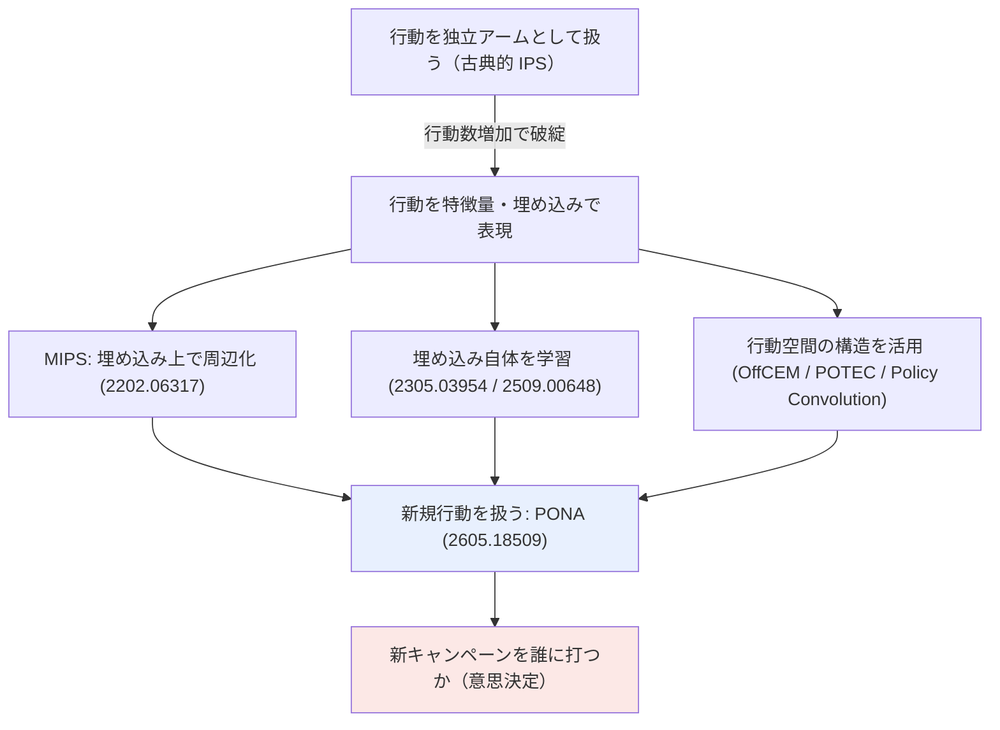

# C4: New-Action Bandit / 大規模行動空間 OPE — リソース一覧

[← clustering index](../../../clustering/20260715/index.md)

## スコープ

本リストは **「ログに存在しない新規行動（施策）をどう評価・選択するか」** という一点に絞って収集した。

ユーザーの明示的な指定により、**OPE 手法の内部（推定量の分散削減、IPS / DR / SNIPS の比較、バイアス・バリアンストレードオフの理論解析）そのものはスコープ外**である。OPE / バンディット系の研究を含めるのは、あくまで以下のいずれかに該当する場合に限る。

- **新規・未観測の行動**を扱う仕組みを提供している
- **行動特徴量・行動埋め込み**を通じて大規模・構造化された行動空間を扱っている

判定基準は一貫して「**施策をまたげるか**（新しいクーポン施策が来たときに、その施策のログがゼロでも評価・選択できるか）」に置いた。MIPS 系を含めているのは分散削減の手法だからではなく、**行動を独立アームではなく特徴ベクトルで表現することが新規行動を扱う前提条件**だからである。この観点で、推定量の理論的性質のみを扱う論文は意図的に除外した。

本課題の設定（数ヶ月に一度、対象ユーザー・訴求内容・クーポン額が毎回異なるキャンペーンを実施し、**新規キャンペーンはログに存在しない**）に対する関連度を ◎ / ○ / △ で示す。

- **◎**: 新規行動・未観測行動の扱いが論文の中心課題
- **○**: 行動特徴量・埋め込みによる大規模行動空間の扱いが中心（新規行動の前提技術）
- **△**: 周辺・補助的（応用文脈、実装、隣接設定）

## リソース総覧

| # | タイトル | 種別 | 年 | リンク | 本課題との関連度 |
|---|---------|------|----|-------|----------------|
| 01 | Offline Contextual Bandits in the Presence of New Actions | Paper | 2026 | [arXiv:2605.18509](https://arxiv.org/abs/2605.18509) | ◎ |
| 02 | Off-Policy Evaluation for Large Action Spaces via Embeddings (MIPS) | Paper | 2022 | [arXiv:2202.06317](https://arxiv.org/abs/2202.06317) | ◎ |
| 03 | In-Context Reinforcement Learning for Variable Action Spaces (Headless-AD) | Paper | 2023 | [arXiv:2312.13327](https://arxiv.org/abs/2312.13327) | ◎ |
| 04 | Budget-Constrained Causal Bandits: Bridging Uplift Modeling and Sequential Decision-Making | Paper | 2026 | [arXiv:2604.26169](https://arxiv.org/abs/2604.26169) | ◎ |
| 05 | Learning Action Embeddings for Off-Policy Evaluation | Paper | 2023 | [arXiv:2305.03954](https://arxiv.org/abs/2305.03954) | ○ |
| 06 | Context-Action Embedding Learning for Off-Policy Evaluation in Contextual Bandits (CAEL-MIPS) | Paper | 2025 | [arXiv:2509.00648](https://arxiv.org/abs/2509.00648) | ○ |
| 07 | POTEC: Off-Policy Learning for Large Action Spaces via Two-Stage Policy Decomposition | Paper | 2024 | [arXiv:2402.06151](https://arxiv.org/abs/2402.06151) | ○ |
| 08 | Off-Policy Evaluation for Large Action Spaces via Conjunct Effect Modeling (OffCEM) | Paper | 2023 | [arXiv:2305.08062](https://arxiv.org/abs/2305.08062) | ○ |
| 09 | Off-Policy Evaluation for Large Action Spaces via Policy Convolution | Paper | 2023 | [arXiv:2310.15433](https://arxiv.org/abs/2310.15433) | ○ |
| 10 | Bayesian Off-Policy Evaluation and Learning for Large Action Spaces | Paper | 2024 | [arXiv:2402.14664](https://arxiv.org/abs/2402.14664) | ○ |
| 11 | Off-Policy Evaluation in Embedded Spaces | Paper | 2022 | [arXiv:2203.02807](https://arxiv.org/abs/2203.02807) | ○ |
| 12 | Off-Policy Learning in Large Action Spaces: Optimization Matters More Than Estimation | Paper | 2025 | [arXiv:2509.03456](https://arxiv.org/abs/2509.03456) | △ |
| 13 | Off-Policy Evaluation and Learning for the Future under Non-Stationarity (OPFV) | Paper | 2025 | [arXiv:2506.20417](https://arxiv.org/abs/2506.20417) | △ |
| 14 | Contextual Multi-Armed Bandits for Causal Marketing | Paper | 2018 | [arXiv:1810.01859](https://arxiv.org/abs/1810.01859) | △ |
| 15 | Open Bandit Dataset and Pipeline (OBP) | Dataset / OSS | 2020 | [arXiv:2008.07146](https://arxiv.org/abs/2008.07146) / [GitHub](https://github.com/st-tech/zr-obp) | △ |

## 各リソース詳細

### 01. Offline Contextual Bandits in the Presence of New Actions

**リンク**: [arXiv:2605.18509](https://arxiv.org/abs/2605.18509)（著者: Ren Kishimoto, Takanori Muroi, Kei Tateno, Tatsuhiro Shimizu, Yusuke Narita, Takuma Udagawa, Kazuki Kawamura, Yuki Sasamoto, Yuta Saito）

**概要**: 本課題に最も直結する論文である。従来のオフ方策学習（OPL）は既存の行動集合の中から期待報酬を最大化する行動を選ぶが、現実の応用では**ログデータ収集時点と比べて行動空間が時間とともに拡張していく**。既存の OPL 手法は新規行動に関するログが存在しないため、それらを学習・選択できないという根本的な限界を持つ。著者らはこの限界に対し、**行動特徴量（action features）を活用する新しい OPL 手法**を提案する。提案手法 PONA は LCPI 推定量と DR 推定量の重み付き和として定義され、既存行動の選択と新規行動の選択の双方を同時に最適化する。広範な実験により、PONA が全体の方策性能を維持しつつ新規行動を効率的に選択できることが示されている。Cowles Foundation のディスカッションペーパー（CFDP 2456）としても公開されている。

**本課題への示唆**:
- 「データ収集後に行動空間が増える」という設定が、**数ヶ月ごとに新しいクーポン施策を追加する本課題の構造と正確に一致**する。C4 の中心として最優先で精読すべき。
- 新規行動を扱う鍵が**行動特徴量**である点は、C2（Treatment Representation）が供給する施策の特徴ベクトル（クーポン額・訴求内容・チャネル）と直接接続する。C2 の設計品質がそのまま本手法の性能を規定する。
- 「新規行動の選択」と「既存行動の性能維持」のトレードオフを重み付き和で明示的に制御する設計は、実務上「冒険的な新施策」と「実績ある既存施策」の配分をどう決めるかという意思決定にそのまま対応する。

**キーとなる用語**: new actions, action features, off-policy learning (OPL), PONA, LCPI, DR estimator, expanding action space

### 02. Off-Policy Evaluation for Large Action Spaces via Embeddings (MIPS)

**リンク**: [arXiv:2202.06317](https://arxiv.org/abs/2202.06317)（著者: Yuta Saito, Thorsten Joachims / ICML 2022）

**概要**: 行動埋め込み OPE の起点となる基礎論文である。文脈付きバンディットの OPE は過去ログからの新方策のオフライン評価を可能にするが、**行動数が大きくなると IPS 系の既存推定量が極端なバイアスと分散に見舞われて破綻する**。著者らは、行動埋め込みが行動空間に構造を与える場合に、**周辺化重要度重み（marginalized importance weights）**を活用する新推定量 MIPS を提案した。論文は提案推定量のバイアス・分散・MSE を特徴づけ、行動埋め込みが従来推定量に対して統計的優位をもたらす条件を解析している。推薦システムから言語モデルまで、行動数が大きくなりがちな応用に広く適用可能である。

**本課題への示唆**:
- **本クラスタの前提技術**。行動を独立アームではなく特徴ベクトルとして扱うという発想の転換が、新規行動を扱う全ての後続研究の土台になっている。まずここを押さえる必要がある。
- 「施策ごとに対象ユーザー・訴求・クーポン額が異なるため、各施策のログが極端に薄くなる」という本課題のデータ希薄性に対する直接の処方箋である。施策を独立に数えるのをやめ、施策の属性空間で周辺化する。
- ただしスコープ上の注意として、**本論文の分散削減の理論解析部分は精読対象から外してよい**。読むべきは「行動埋め込みで周辺化する」という定式化と、埋め込みが有効になる条件のみ。

**キーとなる用語**: MIPS, marginalized importance weighting, action embedding, large action space, common support

### 03. In-Context Reinforcement Learning for Variable Action Spaces (Headless-AD)

**リンク**: [arXiv:2312.13327](https://arxiv.org/abs/2312.13327)（著者: Viacheslav Sinii, Alexander Nikulin, Vladislav Kurenkov, Ilya Zisman, Sergey Kolesnikov / ICML 2024）

**概要**: 一度だけ学習すれば、**サイズ・意味内容・順序が可変の離散行動空間に汎化できる**モデル Headless-AD を提案する。通常の Transformer ベースのポリシーは出力層が固定サイズの線形ヘッドであるため、行動数が変わると使えなくなる。Headless-AD はこの**出力線形ヘッドを取り除き、行動埋め込みを直接予測する**。行動空間の構造に関する事前知識を排除するためにランダム埋め込みを用い、予測埋め込みと実際の後続行動埋め込みの類似度を高めるため InfoNCE 対照損失を回帰目的として採用する。Bernoulli バンディット、文脈付きバンディット、grid world での実験により、**一度も遭遇したことのない行動空間に対しても汎化**し、特定の行動集合向けに専用学習されたモデルを複数の環境設定で上回ることが示された。

**本課題への示唆**:
- 「行動集合が毎回変わる」問題に対し、OPE とは**別の角度（in-context learning）からのアプローチ**を提供する。PONA が推定量ベースなのに対し、こちらは系列モデルの汎化能力に賭ける設計。
- **出力ヘッドを固定サイズにしない**という設計原則そのものが重要な示唆。施策を分類クラスとして扱う実装は新施策で作り直しになるが、施策埋め込みを予測する形にすれば構造を変えずに済む。
- ただしバンディット・grid world の実験規模であり、マーケティングの実データ規模・低頻度性への適用可否は未検証。**アイデアの借用先**として読むのが現実的。

**キーとなる用語**: Headless-AD, variable action space, in-context RL, action embedding prediction, InfoNCE contrastive loss, Algorithm Distillation

### 04. Budget-Constrained Causal Bandits: Bridging Uplift Modeling and Sequential Decision-Making

**リンク**: [arXiv:2604.26169](https://arxiv.org/abs/2604.26169)（著者: Abhirami Pillai / 2026）

**概要**: 予算制約下での施策割当をオンライン学習として扱う枠組み BCCB を提案する。デジタル広告では限られた予算をどのユーザーに使うかを決める必要があり、標準的な手法は「まず過去データで異質処置効果（HTE）を推定し、次に制約付き最適化で予算を配分する」という**二段階のオフラインパイプライン**である。しかしこの方式はデータが潤沢な場合にはうまく機能する一方、**新規キャンペーン・新規市場・新規顧客セグメントといったコールドスタート設定では過去データがほとんど存在せず破綻する**。BCCB は「個人レベルの施策有効性の学習」「反応が不確実なユーザーの探索」「時間軸上での予算のペーシング」の三要素を単一の逐次プロセスに統合する。uplift modeling と逐次意思決定の橋渡しを明示的に狙っている。

**本課題への示唆**:
- **「新規キャンペーンのコールドスタート」を問題設定として明示的に名指ししている**数少ない論文であり、本課題の動機と完全に重なる。C4 と C6（予算・クーポン額の実務制約）の接合点に位置する。
- uplift modeling（本ドメインの主戦場）とバンディットを繋ぐ位置づけであり、**C4 が孤立した技術クラスタではなく uplift の延長線上にある**ことを示す。ドメイン全体の統合的な見取り図を得るのに有用。
- ただし著者単独・2026 年の新しいプレプリントであり、被引用・追試の蓄積は乏しい。**手法の完成度より問題設定の枠組みを借りる**読み方が適切。

**キーとなる用語**: BCCB, budget-constrained, causal bandit, uplift modeling, cold-start, HTE, budget pacing

### 05. Learning Action Embeddings for Off-Policy Evaluation

**リンク**: [arXiv:2305.03954](https://arxiv.org/abs/2305.03954)（著者: Matej Cief, Jacek Golebiowski, Philipp Schmidt, Ziawasch Abedjan, Artur Bekasov / ECIR 2024）

**概要**: MIPS は行動埋め込みが**事前に与えられている**ことを前提とするが、現実には良質な埋め込みが手元にあるとは限らない。本論文は**行動埋め込み自体をログデータから学習する**アプローチを扱う。事前定義の埋め込みが利用できない、あるいは質が低い場合に、報酬モデルの中間表現から埋め込みを獲得する手法を提案し、MIPS の適用範囲を実質的に広げる。Amazon Science による研究で、実装が GitHub（amazon-science/ope-learn-action-embeddings）に公開されている。

**本課題への示唆**:
- 「クーポン施策の埋め込みをどう作るか」という**C2 との接続点そのもの**。施策のメタデータ（額・訴求文言）を手作業で特徴量化するのか、ログから学習するのかという設計判断に直接効く。
- 実装公開があるため、**手元のキャンペーンログで再現実験を回せる**現実的な候補。
- 注意点として、埋め込みをログから学習する場合、**ログに存在しない新規施策の埋め込みは学習できない**。新規施策にはメタデータ由来の特徴量が必須であり、01 の PONA との組み合わせ方が論点になる。

**キーとなる用語**: learned action embeddings, MIPS extension, reward model intermediate representation, ECIR 2024

### 06. Context-Action Embedding Learning for Off-Policy Evaluation in Contextual Bandits (CAEL-MIPS)

**リンク**: [arXiv:2509.00648](https://arxiv.org/abs/2509.00648)（著者: Kushagra Chandak, Vincent Liu, Haanvid Lee / 2025）

**概要**: 05 の系譜をさらに進めた最近の研究である。既存の行動埋め込みは推定量の MSE を最小化するように作られておらず、また**文脈情報を考慮していない**という問題意識から出発する。著者らは CAEL-MIPS を提案し、**オフラインデータから文脈-行動埋め込み（context-action embedding）を学習**して MIPS 推定量の MSE を最小化する。目的関数がバイアスと分散を直接推定する形になっており、結果として MSE を最小化する埋め込みが得られる。行動空間が大きい場合や、文脈-行動空間の一部が十分に探索されていない場合の IPS の高分散に対処する。

**本課題への示唆**:
- 埋め込みが**文脈に依存する**という発想が重要。「同じクーポン額でも、対象ユーザー層によって意味が違う」という本課題の直感（高所得層への 500 円と低所得層への 500 円は別物）を定式化に取り込める。
- 05 との比較で読むと、**埋め込み学習の目的関数設計**という論点が立ち上がる。何を最小化するように埋め込みを学ぶべきかは実務上の設計判断になる。
- 2025 年の新しい論文で追試の蓄積は薄い。05 → 06 の順で読み、差分を掴む使い方が効率的。

**キーとなる用語**: CAEL-MIPS, context-action embedding, MSE-minimizing embedding, underexplored context-action space

### 07. POTEC: Off-Policy Learning for Large Action Spaces via Two-Stage Policy Decomposition

**リンク**: [arXiv:2402.06151](https://arxiv.org/abs/2402.06151)（著者: Yuta Saito, Jihan Yao, Thorsten Joachims / ICLR 2025 Spotlight）

**概要**: 大規模行動空間における**オフ方策学習（評価ではなく学習）**を扱う。方策を二段階に分解する設計を採り、第一段階でクラスタ単位の方策を、第二段階でクラスタ内の行動選択を学習する。この分解により、行動数が大きい場合でも勾配推定の分散を抑えつつ効率的な方策学習を可能にする。ICLR 2025 に Spotlight として採択された。Saito らの大規模行動空間シリーズにおける「学習側」の代表作である。

**本課題への示唆**:
- **評価（OPE）ではなく学習（OPL）側**の代表格。最終的に「新施策を誰に打つか」という方策を得るのが目的である以上、評価だけでなく学習側の設計も必要になる。
- **クラスタ単位への分解**という発想は、クーポン施策を「額の帯」「訴求タイプ」などの粗いクラスタに束ねる実務的な発想と自然に対応する。新規施策も既存クラスタのどれかに属するなら、クラスタ方策の知識を再利用できる。
- 01（PONA）と同じ Saito 系の系譜であり、記法・前提が共通しているため合わせて読むと理解が早い。

**キーとなる用語**: POTEC, two-stage policy decomposition, off-policy learning, action clustering, ICLR 2025

### 08. Off-Policy Evaluation for Large Action Spaces via Conjunct Effect Modeling (OffCEM)

**リンク**: [arXiv:2305.08062](https://arxiv.org/abs/2305.08062)（著者: Yuta Saito, Qingyang Ren, Thorsten Joachims / ICML 2023）

**概要**: 大規模離散行動空間の OPE において、因果効果を**クラスタ効果と残差効果に分解する** conjunct effect model (CEM) に基づく推定量 OffCEM を提案する。重要度重み付けを**行動クラスタに対してのみ適用**し、残差の因果効果はモデルベースの報酬推定で処理する。local correctness という新しい条件の下で不偏となり、この条件は残差効果モデルが各クラスタ内の行動間の相対的な期待報酬差を保存することのみを要求する。第一段階でバイアスを、第二段階で分散を最小化する二段階のモデルベース推定手続きも提案されている。

**本課題への示唆**:
- **行動をクラスタに束ねる**という構造の使い方が本課題に馴染む。クーポン施策を額の帯や訴求タイプでクラスタ化し、クラスタ間は重要度重み、クラスタ内はモデルで、という役割分担。
- 新規施策が**既存クラスタに属する場合**は、クラスタ効果を流用しつつ残差のみモデルで埋めるという扱いが可能になり、実質的に新規行動の評価に接続する。
- local correctness の条件は、実務上「クラスタ内の施策の優劣関係さえ当たっていればよい」という緩い要求に読み替えられ、報酬モデルの精度要求を下げる点が実用的。

**キーとなる用語**: OffCEM, conjunct effect model, cluster effect, residual effect, local correctness, ICML 2023

### 09. Off-Policy Evaluation for Large Action Spaces via Policy Convolution

**リンク**: [arXiv:2310.15433](https://arxiv.org/abs/2310.15433)（著者: Noveen Sachdeva ほか / 2023）

**概要**: オフ方策推定の主要な難しさは、ログ収集方策と評価対象方策の間の分布シフトである。著者らは **Policy Convolution (PC)** という推定量族を提案する。PC は**行動埋め込みを通じて利用可能になる行動の潜在構造**を活用し、ログ方策と目標方策を戦略的に畳み込む。この畳み込みは独自のバイアス・分散トレードオフを導入し、畳み込み量の調整によって制御できる。合成データとベンチマークでの実験により、特に行動空間が大きい場合や方策の乖離が大きい場合に MSE で最大 5〜6 桁の改善が示された。

**本課題への示唆**:
- **行動空間の構造（クーポン額の連続性）を畳み込みとして明示的に活用する**という発想は、C6 が与える実務上の行動構造（額が連続量である、チャネルがカテゴリである）をそのまま取り込む道を示す。
- 「500 円クーポンのログは 400 円・600 円クーポンの評価にも部分的に使える」という直感の定式化。**額が毎回異なる本課題のデータ希薄性への直接の対処**になる。
- スコープ上、バイアス・分散トレードオフの解析部分ではなく「**行動空間の構造をどう畳み込みで表現するか**」の部分に絞って読むべき。

**キーとなる用語**: Policy Convolution, latent action structure, action embedding, distribution shift, policy mismatch

### 10. Bayesian Off-Policy Evaluation and Learning for Large Action Spaces

**リンク**: [arXiv:2402.14664](https://arxiv.org/abs/2402.14664)（著者: Imad Aouali, Victor-Emmanuel Brunel, David Rohde, Anna Korba / AISTATS 2025）

**概要**: 大規模行動空間の OPE / OPL に**ベイズ的な枠組み**を導入する。行動間の相関を構造化された事前分布で表現することにより、頻度論的な重要度重み付けとは異なる経路でデータ効率を高める。行動空間が大きい場合に個々の行動のログが薄くなる問題に対し、行動間の構造的な情報共有によって対処する。

**本課題への示唆**:
- **行動間の相関を事前分布で表現する**というベイズ的アプローチは、「似た施策は似た効果を持つはず」という実務的な事前知識を明示的にモデルに入れる道を与える。
- 新規施策に対しても、**行動特徴量に基づく事前分布から初期の効果推定が得られる**点が本課題に効く。C3（Zero-shot）が与える未観測施策の効果予測を事前分布として取り込む接続が考えられる。
- 頻度論ベースの MIPS 系（02, 08, 09）とは異なる系譜であり、**代替アプローチの比較対象**として押さえる価値がある。

**キーとなる用語**: Bayesian OPE/OPL, structured prior, action correlation, large action space, AISTATS 2025

### 11. Off-Policy Evaluation in Embedded Spaces

**リンク**: [arXiv:2203.02807](https://arxiv.org/abs/2203.02807)（著者: Jaron J. R. Lee, David Arbour, Georgios Theocharous / 2022）

**概要**: MIPS とほぼ同時期に独立して**埋め込み空間での OPE**を扱った研究である（Adobe Research）。行動を埋め込み空間で表現することで、行動数が大きい場合の OPE を可能にする。MIPS と問題意識を共有しつつ異なる定式化を採っており、埋め込み OPE という発想が単一グループの思いつきではなく複数の研究グループが同時に到達した必然的な方向性であったことを示す。

**本課題への示唆**:
- **MIPS の独立な検証**としての価値。同じ発想に別グループが到達している事実は、行動埋め込みというアプローチの筋の良さを裏づける。
- MIPS（02）と読み比べることで、**埋め込み OPE の定式化の自由度**（どこで周辺化するか、何を埋め込むか）が見えてくる。
- 優先度は 02 より低い。02 を読んだ上で余力があれば、という位置づけ。

**キーとなる用語**: embedded spaces, off-policy evaluation, action embedding, Adobe Research

### 12. Off-Policy Learning in Large Action Spaces: Optimization Matters More Than Estimation

**リンク**: [arXiv:2509.03456](https://arxiv.org/abs/2509.03456)（著者: Imad Aouali, Otmane Sakhi / 2025）

**概要**: 大規模行動空間のオフ方策学習に対する**批判的・再考的な論文**である。著者らは、現在のオフ方策学習手法が、特に行動空間が大きくなるにつれて**深刻な最適化上の問題に直面する**ことを示す。そして、より単純な**重み付き対数尤度目的関数**が実質的に優れた最適化特性を持ち、競争力のある——しばしば優れた——方策を回復することを主張する。タイトルが示す通り「推定量の精緻化より最適化の方が効く」という主張であり、推定量開発に偏りがちな研究潮流への異議申し立てになっている。

**本課題への示唆**:
- **推定量の精緻化に投資しすぎることへの警告**として読む価値がある。凝った推定量より、単純な目的関数を安定して最適化する方が実務上の性能が出る可能性を示唆する。
- スコープとの関係では、本論文自体は新規行動を主題としないため関連度は △。ただし**「どこに労力を割くべきか」という実装方針の判断材料**として有用。
- 10 と同じ Aouali 系の著者であり、大規模行動空間に対する一貫した問題意識の下にある。

**キーとなる用語**: optimization vs estimation, weighted log-likelihood, off-policy learning, large action space

### 13. Off-Policy Evaluation and Learning for the Future under Non-Stationarity (OPFV)

**リンク**: [arXiv:2506.20417](https://arxiv.org/abs/2506.20417)（著者: Tatsuhiro Shimizu, Kazuki Kawamura, Takanori Muroi, Yusuke Narita, Kei Tateno, Takuma Udagawa, Yuta Saito / KDD 2025）

**概要**: **将来のオフ方策評価（F-OPE）・学習（F-OPL）**という新しい問題設定を扱う。非定常環境において、分布が時間とともに変化する状況での方策の**将来価値**を推定・最適化する。EC の推薦では「先月の古い方策で集めたデータを使って、来月の方策価値を推定・最適化したい」という要請が典型である。critical な難しさは、**将来環境に関するデータが履歴データには存在しない**点にある。既存手法は定常性を仮定するか制約的な報酬モデリング仮定に依存し、大きなバイアスを生む。提案手法 OPFV は時系列データ内の構造を活用し、任意の将来時点での方策価値を正確に推定する。

**本課題への示唆**:
- **「数ヶ月に一度」という本課題の低頻度性が持つもう一つの側面**を扱う。施策の間隔が空くほど、ログ収集時点と施策実施時点の間で市場環境・ユーザー行動が変化する。新規行動の問題と非定常性の問題は本課題では同時に起きる。
- 01（PONA）と著者陣が大きく重なっており（Shimizu, Kawamura, Muroi, Narita, Tateno, Udagawa, Saito）、**同じ研究グループが「行動の新しさ」と「時間の新しさ」を別々に攻めている**構図が見える。両者の統合は未解決の論点。
- 関連度 △ は「新規行動」が主題でないため。ただし本課題の実務的な成功にとっては無視できない軸であり、C4 の射程を考える上で重要。

**キーとなる用語**: F-OPE, F-OPL, OPFV, non-stationarity, future policy value, time-series structure, KDD 2025

### 14. Contextual Multi-Armed Bandits for Causal Marketing

**リンク**: [arXiv:1810.01859](https://arxiv.org/abs/1810.01859)（著者: Neela Sawant, Chitti Babu Namballa, Narayanan Sadagopan, Houssam Nassif / Amazon, 2018）

**概要**: マーケティング自動化に対する**因果的な文脈付きバンディット**のアプローチを扱う古典的な接続点である。純粋な成果ではなく**因果的（増分的）効果**を推定・最適化することに焦点を当て、これにより「放っておいても行動したはずの顧客」ではなく「説得可能な顧客（persuadable）」のみを狙うことで ROI を改善する。因果推論・uplift modeling・多腕バンディットの強みを結合し、データ収集の中に反実仮想の生成を組み込む。多腕バンディットの枠組みにより**複数施策へのスケール**とログデータ上での OPE が可能になり、Thompson sampling により類似顧客文脈上での施策探索と反実仮想成果の顕在化が可能になる。

**本課題への示唆**:
- **uplift modeling とバンディットの古典的な接続点**。本ドメイン（uplift marketing）と C4 を繋ぐ歴史的な起点として位置づけを把握するのに有用。
- 「因果効果（増分）を最適化する」という原則の確認。成果そのものではなく増分を最適化するという本ドメインの大前提が、バンディットの文脈でどう表現されるかが分かる。
- 2018 年と古く、**行動埋め込み・新規行動の発想は含まれない**（施策は独立アーム扱い）。関連度 △ は主にこの理由による。04（BCCB）が同じ接続を現代的に扱っている。

**キーとなる用語**: causal marketing, uplift modeling, persuadable, incremental effect, Thompson sampling, counterfactual generation

### 15. Open Bandit Dataset and Pipeline (OBP)

**リンク**: [arXiv:2008.07146](https://arxiv.org/abs/2008.07146) / [GitHub: st-tech/zr-obp](https://github.com/st-tech/zr-obp) / [Docs](https://zr-obp.readthedocs.io/)（NeurIPS 2021 Datasets and Benchmarks Track）

**概要**: バンディットアルゴリズムと OPE のための Python ライブラリ、および実データセットである。Open Bandit Dataset はファッション EC の ZOZOTOWN 上で収集された大規模なログバンディットフィードバックデータで、**複数（少なくとも 2 つ）の異なる方策を実際に走らせて収集された初のデータセット**であり、本番で使われた方策の実装そのものを含む。これにより OPE の現実的で再現可能な評価が初めて可能になった。Switch, MRDR, DRos といった先進的な推定量を含む多様な OPE 推定量を実装し、連続行動・組合せ行動を扱う推定量も提供する。scikit-learn 風のインターフェースを採る。

**本課題への示唆**:
- **実装の第一参照先**。MIPS 系推定量が実装されており、手法の再現可能性と実データ適用の勘所を掴める。自前実装の前にまずここを見るべき。
- 現実の EC ログという**実データでのベンチマーク**が可能。合成データでの性能が実データで再現するかを確認できる点が、本番投入のやり直しが効かない本課題では重要。
- 注意点として、OBP は推薦・EC の設定を前提としており、**「数ヶ月に一度のキャンペーン」という低頻度・少数施策の設定とは規模感が異なる**。そのまま使うより、評価パイプラインの設計思想を借りる使い方が現実的。

**キーとなる用語**: Open Bandit Pipeline, Open Bandit Dataset, ZOZOTOWN, OPE benchmark, scikit-learn style interface

## 実装リソース

| リソース | 内容 | リンク |
|---------|------|-------|
| Open Bandit Pipeline (OBP) | バンディット・OPE の Python ライブラリ本体。MIPS 系を含む多様な推定量を実装。実データ（ZOZOTOWN）付き | [GitHub: st-tech/zr-obp](https://github.com/st-tech/zr-obp) |
| OBP Documentation | OBP の API ドキュメント・チュートリアル | [zr-obp.readthedocs.io](https://zr-obp.readthedocs.io/) |
| ope-learn-action-embeddings | 05「Learning Action Embeddings for OPE」の公式実装（Amazon Science） | [GitHub: amazon-science/ope-learn-action-embeddings](https://github.com/amazon-science/ope-learn-action-embeddings) |
| icml2023-offcem | 08「OffCEM」の公式実装（Yuta Saito） | [GitHub: usaito/icml2023-offcem](https://github.com/usaito/icml2023-offcem) |
| headless-ad | 03「Headless-AD」の公式実装（CORL team） | [GitHub: corl-team/headless-ad](https://github.com/corl-team/headless-ad) |
| MIPS 解説スライド（日本語） | 著者（Yuta Saito）自身による MIPS の日本語解説 | [Speaker Deck](https://speakerdeck.com/usaito/mips-icml2022-jp) |
| MIPS 論文読み解説（日本語） | action embedding による OPE の日本語解説記事 | [Qiita](https://qiita.com/morinota/items/a6f953d54baa099fecb7) |

## 調査から見えた論点

**1. 「新規行動を扱う」問題は 2026 年になってようやく正面から扱われ始めた**

MIPS（2022）以降、大規模行動空間の研究は蓄積が厚い一方、**行動空間そのものが事後に拡張する**設定を正面から扱うのは 01（PONA, 2026）がほぼ唯一である。つまり本課題は、**研究側でもまだ最前線の問題設定**である。裏を返せば、既存手法の単純な適用では解けない可能性が高く、01 を軸に据えた上で周辺技術を組み合わせる設計が必要になる。

**2. 新規行動を扱う鍵は例外なく「行動特徴量／行動埋め込み」に収束する**

01（action features）、03（action embedding prediction）、10（structured prior）と、アプローチの系譜は異なるが、**新規行動を扱う手段は「行動を独立アームではなく特徴ベクトルで表現する」一点に収束している**。これは C2（Treatment Representation）が本課題の成否を握る決定的な上流工程であることを意味する。施策の特徴量設計が貧弱なら、下流でどの手法を使っても新規施策は扱えない。

**3. 「埋め込みを学習する」と「新規行動を扱う」は原理的に緊張関係にある**

05・06 はログから埋め込みを学習するが、**ログに存在しない新規施策の埋め込みはログからは学習できない**。したがって新規施策には**メタデータ由来の特徴量**（クーポン額、訴求カテゴリ、チャネル）が不可欠である。実務的には「既存施策はログから学習した埋め込み、新規施策はメタデータ由来の特徴量」というハイブリッドになるが、**両者を同じ空間に整合させる方法は本調査で見つかった論文では扱われていない**。これは本課題における具体的な技術的ギャップである。

**4. 「行動の新しさ」と「時間の新しさ」が本課題では同時に起きるが、研究は分離している**

01（新規行動）と 13（非定常性・将来予測）は**著者陣が大きく重なるにもかかわらず別々の論文**である。本課題では「数ヶ月に一度」という低頻度性ゆえに、新施策の追加（行動軸の変化）と市場環境の変化（時間軸の変化）が必ず同時に発生する。**両者を統合的に扱う手法は存在しない**というのが本調査の結論であり、実務上はどちらの効果が支配的かを見極める必要がある。

**5. Saito（Cornell）系のクラスタが明確に存在する**

01, 02, 07, 08, 13 が Yuta Saito 系であり、記法・前提・評価プロトコルが共通している。**この系譜をまとめて読むのが最も効率的**である。一方 10, 12 の Aouali 系（Criteo 系）は異なる問題意識（ベイズ、最適化）を持ち、09 の Sachdeva（Google）系、11 の Adobe 系も独立した系譜である。複数の独立グループが同じ方向に収束している事実は、行動埋め込みというアプローチの妥当性を裏づける。

**6. 実装は揃っているが、本課題の規模感とはギャップがある**

OBP をはじめ主要手法の実装は公開されているが、いずれも**推薦・EC の大規模ログ**（行動数千〜、ログ数百万〜）を前提とする。本課題は「数ヶ月に一度、施策数は数個〜数十個」という**真逆の規模感**である。行動数が少ない場合に埋め込みによる周辺化がどれだけ効くかは自明ではなく、**手法の適用可否そのものが検証課題**になる。

## retrieval 推奨

優先的に精読すべき上位 5 本を、読む順序とともに示す。

**第 1 位: 01. Offline Contextual Bandits in the Presence of New Actions（[arXiv:2605.18509](https://arxiv.org/abs/2605.18509)）**

本課題と問題設定が完全に一致する唯一の論文であり、議論の余地なく最優先。「データ収集後に行動空間が拡張する」設定は、新しいクーポン施策の追加そのものである。PONA が既存行動の性能維持と新規行動の選択をどう両立させるか、行動特徴量に何を要求するかを精読する。**C4 クラスタの結論は事実上この論文の評価で決まる**。

**第 2 位: 02. Off-Policy Evaluation for Large Action Spaces via Embeddings / MIPS（[arXiv:2202.06317](https://arxiv.org/abs/2202.06317)）**

01 を理解するための前提技術であり、行動埋め込み OPE 全体の起点。**ただしスコープ限定を厳守し、分散削減・MSE 解析の章は飛ばして「行動埋め込みで周辺化する」定式化と埋め込みの要件（common support）に絞って読む**。日本語の著者スライドがあるため導入コストが低い。

**第 3 位: 04. Budget-Constrained Causal Bandits（[arXiv:2604.26169](https://arxiv.org/abs/2604.26169)）**

「新規キャンペーンのコールドスタート」を明示的に扱い、**uplift modeling と逐次意思決定を橋渡し**する。本ドメインの主戦場（uplift）と C4 を接続する位置にあり、C6（予算・クーポン額の制約）とも重なる。手法の完成度より**問題設定の枠組み**を得る目的で読む。

**第 4 位: 05. Learning Action Embeddings for Off-Policy Evaluation（[arXiv:2305.03954](https://arxiv.org/abs/2305.03954)）**

「施策の埋め込みをどう作るか」という C2 との接続点。**論点 3（学習した埋め込みは新規行動に使えない）という本調査で見つかった技術的ギャップの中心**にあり、ここを詰めないと 01 の実装に進めない。公式実装があり手元データでの再現実験が可能。

**第 5 位: 08. OffCEM（[arXiv:2305.08062](https://arxiv.org/abs/2305.08062)）**

行動をクラスタに束ね、クラスタ間は重要度重み・クラスタ内はモデルという役割分担が、クーポン施策を額の帯や訴求タイプでまとめる実務的発想と自然に対応する。**新規施策が既存クラスタに属する場合の扱い**に接続でき、01 の代替・補完として価値がある。公式実装あり。

**次点**: 07（POTEC, 学習側の設計）、13（OPFV, 非定常性の軸）は、上位 5 本を読んだ後に論点 4・5 を深掘りする段階で読むのが効率的である。
