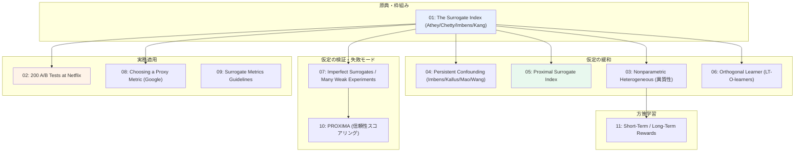
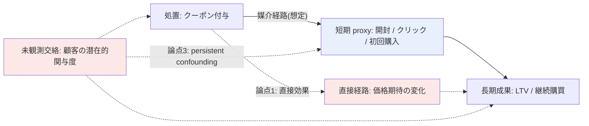

# C5: Surrogate / 長期効果の早期代理観測 — リソース一覧

[← clustering index](../../../clustering/20260715/index.md)

## スコープ

本クラスタは、他クラスタとは **問題への切り込み方向が異なる**。C1（Data Fusion）や C3（Zero-shot）が「**データ量を増やす**」ことで低頻度施策の情報不足を補うのに対し、C5 は「**結果を待つ時間を縮める**」ことで実質的な施策サイクルを短縮する。

施策が数ヶ月に一度しか打てず、かつ長期成果（LTV、継続購買）の確定に数ヶ月かかる状況では、「施策 → 結果確定 → 次施策の設計」のループが年単位になる。ここで短期に観測できる複数の proxy（開封、クリック、初回購入、初月利用頻度）を合成して **surrogate index** を構成し、長期成果への効果を早期推定できれば、前施策の効果を踏まえた上で次施策を設計できる。1 回の設計判断の重みが大きい低頻度環境ほど、この前倒しの価値は大きい。

対象範囲は以下の通り。

- **原典と理論的枠組み**: surrogate index の定義、surrogacy assumption、バイアスの特徴づけ
- **仮定の緩和方向**: 未観測交絡下（proximal / persistent confounding）、異質性推定への拡張
- **仮定の検証と失敗モード**: surrogate paradox、符号反転バイアス、proxy metric の信頼性評価
- **実務適用**: tech 企業の A/B テストにおける実証、proxy metric 選択、LTV 早期予測
- **方策学習への接続**: 短期・長期報酬のトレードオフ

本クラスタの成否は **surrogacy assumption がマーケティング文脈で成り立つか** の一点にかかっており、各リソースがこの仮定をどう置き、どう検証・緩和しているかを軸に整理する。

## リソース総覧

| # | タイトル | 種別 | 年 | リンク | 本課題との関連度 |
|---|----------|------|----|--------|-----------------|
| 01 | The Surrogate Index: Combining Short-Term Proxies to Estimate Long-Term Treatment Effects More Rapidly and Precisely | Paper (NBER / ReStud) | 2019 / 2025 | [NBER w26463](https://www.nber.org/papers/w26463) | ◎ |
| 02 | Evaluating the Surrogate Index as a Decision-Making Tool Using 200 A/B Tests at Netflix | Paper (arXiv) | 2023/2024 | [arXiv:2311.11922](https://arxiv.org/abs/2311.11922) | ◎ |
| 03 | Nonparametric Heterogeneous Long-term Causal Effect Estimation via Data Combination | Paper (arXiv) | 2025 | [arXiv:2502.18960](https://arxiv.org/abs/2502.18960) | ◎ |
| 04 | Long-term Causal Inference Under Persistent Confounding via Data Combination | Paper (arXiv / JRSS-B) | 2022 / 2025 | [arXiv:2202.07234](https://arxiv.org/abs/2202.07234) | ◎ |
| 05 | The Proximal Surrogate Index: Long-Term Treatment Effects under Unobserved Confounding | Paper (arXiv) | 2026 | [arXiv:2601.17712](https://arxiv.org/abs/2601.17712) | ○ |
| 06 | Orthogonal Learner for Estimating Heterogeneous Long-Term Treatment Effects | Paper (arXiv) | 2026 | [arXiv:2604.00915](https://arxiv.org/abs/2604.00915) | ○ |
| 07 | Long-Term Causal Inference with Imperfect Surrogates using Many Weak Experiments, Proxies, and Cross-Fold Moments | Paper (arXiv) | 2023 | [arXiv:2311.04657](https://arxiv.org/abs/2311.04657) | ◎ |
| 08 | Choosing a Proxy Metric from Past Experiments | Paper (arXiv / KDD 2024) | 2023 / 2024 | [arXiv:2309.07893](https://arxiv.org/abs/2309.07893) | ◎ |
| 09 | Online Experimentation with Surrogate Metrics: Guidelines and a Case Study | Paper (arXiv) | 2021 | [arXiv:2106.01421](https://arxiv.org/pdf/2106.01421) | ○ |
| 10 | PROXIMA: A Reliability Scoring Framework for Proxy Metrics in Online Controlled Experiments | Paper (arXiv) | 2026 | [arXiv:2604.14352](https://arxiv.org/abs/2604.14352) | ○ |
| 11 | Policy Learning for Balancing Short-Term and Long-Term Rewards | Paper (arXiv) | 2024 | [arXiv:2405.03329](https://arxiv.org/abs/2405.03329) | ○ |
| 12 | Long-term Causal Effects Estimation via Latent Surrogates Representation Learning | Paper (arXiv) | 2022 | [arXiv:2208.04589](https://arxiv.org/abs/2208.04589) | △ |
| 13 | Long-Term Effect Estimation with Surrogate Representation | Paper (arXiv) | 2020 | [arXiv:2008.08236](https://arxiv.org/abs/2008.08236) | △ |
| 14 | Surrogate index：短期で観測できる指標を用いた長期効果の推定 | Blog (CyberAgent) | — | [CyberAgent Developers Blog](https://developers.cyberagent.co.jp/blog/archives/44402/) | ○ |

## 各リソース詳細

### 01. The Surrogate Index: Combining Short-Term Proxies to Estimate Long-Term Treatment Effects More Rapidly and Precisely

**リンク**: [NBER w26463](https://www.nber.org/papers/w26463) / [Review of Economic Studies](https://academic.oup.com/restud/advance-article/doi/10.1093/restud/rdaf087/8268796) / [Opportunity Insights PDF](https://opportunityinsights.org/wp-content/uploads/2019/11/surrogate_paper.pdf)

**概要**: Athey, Chetty, Imbens, Kang による本系譜の原典であり、2025 年に Review of Economic Studies に掲載された。長期成果（例: 生涯所得）の観測に長い遅延が伴う状況に対し、複数の短期成果を合成した「surrogate index」——短期成果を条件とした長期成果の予測値——を構成する手法を提案する。中核となるのは **長期成果が surrogate index を条件として処置と独立である**（Prentice surrogacy assumption）という仮定であり、これが成り立つとき surrogate index に対する平均処置効果は長期成果に対する処置効果と一致する。著者らはこの仮定が破れた場合に生じるバイアスを理論的に特徴づけ、追加の成果指標を用いて仮定を検証する簡便な手法も提供している。カリフォルニアの多拠点職業訓練実験に適用し、9 年待つ代わりに最初の 6 四半期の短期成果を surrogate として使えること、標準誤差が 35% 減少することを示した。

**本課題への示唆**:
- 「開封・クリック・初回購入」を **個別に見るのではなく合成した index として扱う** という設計思想がそのまま適用できる。個々の proxy が surrogacy を満たさなくても、合成すれば満たし得るという点が実務上の突破口。
- 標準誤差が減少するという副次効果は、低頻度施策ゆえにサンプルサイズが限られる本課題で特に価値が高い。待ち時間短縮と精度向上が同時に得られる。
- 仮定の検証手法が論文内で提供されている点が重要。過去施策で長期成果が既に観測済みのものがあれば、それを使って surrogate index の妥当性を事後検証できる。

**キーとなる用語**: `surrogate index`, `Prentice surrogacy assumption`, `statistical surrogacy`, `surrogate score`, `short-term proxies`

### 02. Evaluating the Surrogate Index as a Decision-Making Tool Using 200 A/B Tests at Netflix

**リンク**: [arXiv:2311.11922](https://arxiv.org/abs/2311.11922)

**概要**: Vickie Zhang, Michael Zhao, Maria Dimakopoulou, Anh Le, Nathan Kallus による、surrogate index の実務適用に関する大規模実証研究。Netflix の 200 件の A/B テスト、1098 のテストアームを活用し、14 日分のデータから構成した surrogate index による意思決定が、63 日目の処置効果を直接測定した場合の意思決定とどの程度一致するかを検証した。結果として、surrogate index から導かれる統計的推論は直接測定によるものと約 95% 一致した。さらに 63 日の直接測定で「launch する」（正かつ統計的に有意）と判断されるテストに限定すると、surrogate index は precision 79%、recall 65% を達成し、直接測定で統計的に負であった施策を誤って launch すると結論づけたケースは 1 件も存在しなかった。線形の "auto-surrogate" モデル（長期成果そのものの短期観測値を利用）に焦点を当てている点が実務的に扱いやすい。

**本課題への示唆**:
- **理論ではなく意思決定ツールとしての性能** を評価している点が本課題の関心と完全に一致する。求めているのは正確な効果量ではなく「次の施策をどう設計するか」の判断材料であり、この論文はまさにその粒度で評価している。
- 「誤って負の施策を launch したケースがゼロ」という非対称な安全性は実務上極めて重要。recall 65% は取りこぼしがあることを意味するが、致命的な誤りは避けられるという性質は低頻度施策の意思決定と相性が良い。
- **auto-surrogate**（長期成果と同じ指標の短期観測値を使う）というシンプルな構成が有効だった点は、いきなり複雑な proxy 合成に走る前の第一歩として採用しやすい。LTV なら「初月の購買額」がそれに当たる。

**キーとなる用語**: `auto-surrogate`, `surrogate index`, `decision-making alignment`, `precision / recall of launch decisions`

### 03. Nonparametric Heterogeneous Long-term Causal Effect Estimation via Data Combination

**リンク**: [arXiv:2502.18960](https://arxiv.org/abs/2502.18960)

**概要**: Weilin Chen, Ruichu Cai, Junjie Wan, Zeqin Yang, José Miguel Hernández-Lobato による研究。既存手法の多くが長期観察データと短期実験データを組み合わせた **平均** 長期因果効果の推定に注力しているのに対し、本論文は **異質な**（heterogeneous）長期因果効果を頑健かつ効果的に推定する方法が未解明である点を問題設定とする。著者らは異質長期因果効果推定のための two-stage 型のノンパラメトリック推定量を複数提案しており、propensity ベース、回帰ベース、および multiple robust 推定量を含む。緩やかな仮定の下でこれらの漸近的性質について包括的な理論解析を行い、複数の semi-synthetic および実世界データセットでの広範な実験によって理論的結果を検証している。

**本課題への示唆**:
- uplift モデリングの本質は **異質性の推定** であり、平均長期効果だけでは「誰にクーポンを送るか」の判断ができない。本論文は surrogate 系譜を uplift の関心事に接続する要の位置にある。
- multiple robust 推定量は傾向スコアモデルと回帰モデルのいずれかが正しければ一致性を持つため、マーケティングデータのようにモデル特定に自信が持てない状況で採用価値が高い。
- 長期観察データ（過去顧客の LTV 実績）と短期実験データ（直近施策の A/B テスト）を組み合わせる設定は、本課題のデータ状況とほぼ一致する。

**キーとなる用語**: `heterogeneous long-term causal effect`, `data combination`, `multiple robust estimator`, `two-stage nonparametric estimation`

### 04. Long-term Causal Inference Under Persistent Confounding via Data Combination

**リンク**: [arXiv:2202.07234](https://arxiv.org/abs/2202.07234) / [JRSS-B](https://academic.oup.com/jrsssb/article/87/2/362/7811312) / [GitHub 実装](https://github.com/CausalML/LongTermCausalInference)

**概要**: Guido Imbens, Nathan Kallus, Xiaojie Mao, Yuhao Wang による研究で、Journal of the Royal Statistical Society Series B（2025年、Vol.87 Issue 2, pp.362–388）に掲載。短期実験データと、未観測交絡の影響を受ける長期観察データを組み合わせた長期処置効果の識別と推定を扱う。本論文の独自性は **persistent confounding**——処置・短期成果・長期成果のすべてに同時に影響し得る未観測交絡因子——という難所に正面から取り組んでいる点にある。これは surrogate index の標準的な仮定が最も破れやすい状況であり、著者らは理論的保証を伴う推定・推論手法を開発し、具体的なケーススタディで検証している。再現用コードが GitHub で公開されている。

**本課題への示唆**:
- マーケティングでは「もともと熱心な顧客」のような **持続的な交絡因子** が処置反応・短期指標・長期 LTV のすべてに影響する。persistent confounding はマーケティング文脈で最も現実的な仮定違反であり、本論文の設定は本課題に直結する。
- 実装が公開されているため、理論の理解と手を動かした検証を並行できる。gather 段階の候補としては実行可能性が高い。
- 原典（01）が仮定の成立を前提とするのに対し、本論文は**破れた場合にどう救うか**を示す。両者をセットで読むことで採用判断の幅が広がる。

**キーとなる用語**: `persistent confounding`, `data combination`, `long-term treatment effect identification`, `unobserved confounding`

### 05. The Proximal Surrogate Index: Long-Term Treatment Effects under Unobserved Confounding

**リンク**: [arXiv:2601.17712](https://arxiv.org/abs/2601.17712)

**概要**: 未観測交絡下での長期処置効果の識別と推定を、長期成果が欠損している実験サンプルと、処置割当が観測されていない観察サンプルを組み合わせることで扱う。標準的な surrogate index 手法は未観測交絡因子が存在すると破綻するが、本論文は **未観測交絡因子に対する proxy 変数を活用する**ことで新たな識別結果を確立する（proximal causal inference の枠組みを surrogate index に持ち込んだ形）。さらにこの識別結果に基づく multiply robust な推定・推論手続きを開発している。RCT が因果推論のゴールドスタンダードである一方、資金制約・高い脱落率・長い追跡期間ゆえに長期成果の測定が困難であり、結果として研究者は実験からの短期成果と、処置割当が観測されない観察データ上の長期成果しか持たないという実務状況が動機となっている。Job Corps プログラムへの適用では、標準的な surrogate index 推定量がバイアスを受ける状況でも実験ベンチマークを回復できることを示した。

**本課題への示唆**:
- 「実験サンプルには長期成果がない、観察サンプルには処置割当がない」という設定は、**過去の施策ログが処置割当を正確に記録していない**という実務でありがちな状況に対応する。
- proxy 変数の活用という発想は、マーケティングでは代替候補が豊富（デモグラ、過去購買履歴、サイト回遊など）であり、適用の素地がある。ただし proxy として妥当な変数の選定自体が新たな仮定を要する点は注意。
- 2026 年の新しい論文であり、04 の persistent confounding と問題意識は近いが緩和のアプローチが異なる。両者の仮定の違いを比較することが選択の鍵になる。

**キーとなる用語**: `proximal surrogate index`, `proximal causal inference`, `negative control / proxy variables`, `multiply robust estimation`

### 06. Orthogonal Learner for Estimating Heterogeneous Long-Term Treatment Effects

**リンク**: [arXiv:2604.00915](https://arxiv.org/abs/2604.00915)

**概要**: Haorui Ma, Dennis Frauen, Valentyn Melnychuk, Stefan Feuerriegel による 2026 年 4 月の論文。異質長期処置効果（HLTE）の推定は、マーケティング・経済学・医学における個別化意思決定で広く用いられ、短期のランダム化実験と長期の観察データを組み合わせる設定が典型である。本論文は HLTE 推定の難所として、**特定の部分集団において処置の overlap または長期成果の観測の overlap が限定的である**ことを挙げ、これが有限標本での分散が大きい不安定な HLTE 推定を招くと指摘する。この課題に対し、著者らは HLTE 推定のための新しい直交学習器群 **LT-O-learners**（Long-Term Orthogonal Learners）を導入する。共変量と surrogate を共有する 2 標本設定を用い、長期データセットで学習した surrogate index を短期実験における長期成果の proxy として利用する。

**本課題への示唆**:
- **overlap の限定性** は低頻度・小規模施策で必然的に生じる問題であり、本論文の問題意識は本課題の制約と一致する。特定セグメントにしかクーポンを配っていない場合、そのセグメント外の効果推定が不安定になる。
- Neyman 直交性に基づく構成は機械学習による nuisance 推定の誤差に対して頑健であり、実務でモデル選択の自由度を確保しやすい。
- 03 と同じく異質性推定を狙うが、本論文は分散安定性に重点を置く。C4（Bandit / OPE）に効果推定量を供給する際、分散の小ささは方策学習の質に直結するため接続価値がある。

**キーとなる用語**: `LT-O-learners`, `Neyman orthogonality`, `heterogeneous long-term treatment effect (HLTE)`, `limited overlap`

### 07. Long-Term Causal Inference with Imperfect Surrogates using Many Weak Experiments, Proxies, and Cross-Fold Moments

**リンク**: [arXiv:2311.04657](https://arxiv.org/abs/2311.04657)

**概要**: 短期 surrogate を用いた長期成果への因果効果の推論は迅速なイノベーションに不可欠であるという問題意識から出発する。本論文の核心は **surrogate paradox** への対処である。処置がランダム化されており、かつ surrogate が処置の成果への効果を完全に媒介していてさえ、surrogate と成果の間の交絡によって **因果効果の符号を取り違え得る**。著者らは、多数の過去実験が利用可能であることが surrogate に対する操作変数を与え、この交絡を迂回する機会になると指摘する。JIVE（Jackknife Instrumental Variables Estimation）のような cross-fold 手続きによってバイアスを除去し、長期効果に対する妥当な信頼区間を構成できることを示す。関連して、Nonparametric Jackknife Instrumental Variable Estimation and Confounding Robust Surrogate Indices（[arXiv:2406.14140](https://arxiv.org/pdf/2406.14140)）が同系統の展開にあたる。

**本課題への示唆**:
- **符号が反転し得る** という失敗モードは、surrogate index を実務投入する上で最も恐ろしいシナリオ。「クリック率は上がったが LTV は下がった」は割引施策で実際に起こり得る（安売り常連化）。この論文はその機序を正面から扱う。
- 「多数の弱い実験」を操作変数として使うという発想は、**過去施策の蓄積そのものを資産化する** 方向であり、C1（Data Fusion）と直接補完関係にある。低頻度でも年単位で蓄積すれば本数は増える。
- surrogate が「完全に媒介していても」符号を誤り得るという指摘は、surrogacy assumption を満たすだけでは不十分という強い警告。仮定検証の設計に影響する。

**キーとなる用語**: `surrogate paradox`, `imperfect surrogates`, `many weak experiments`, `JIVE (Jackknife Instrumental Variables Estimation)`, `cross-fold moments`

### 08. Choosing a Proxy Metric from Past Experiments

**リンク**: [arXiv:2309.07893](https://arxiv.org/abs/2309.07893) / [KDD 2024](https://dl.acm.org/doi/10.1145/3637528.3671543)

**概要**: Nilesh Tripuraneni, Lee Richardson, Alexander D'Amour, Jacopo Soriano, Steve Yadlowsky（Google）による KDD 2024 論文。多くのランダム化実験において、主たる関心である長期指標の処置効果は測定が困難または不可能である。長期指標は変化への反応が遅く、かつ十分にノイジーだからである。著者らは、長期指標を密接に追跡する複数の短期 proxy 指標を測定して近い将来の意思決定を導くことを提案し、**ランダム化実験の均質な母集団において最適な proxy 指標を定義・構成する新たな統計的枠組み** を導入する。手続きの要点は、ある実験における最適 proxy 指標の構成を、当該実験の真の潜在的処置効果とノイズ水準に依存する **ポートフォリオ最適化問題** に帰着させる点にある。

**本課題への示唆**:
- 「どの短期指標を proxy 候補にするか」という **選択問題を定式化** している点が実務的に最も価値が高い。開封・クリック・初回購入のどれをどの重みで合成するかを勘で決めずに済む。
- ポートフォリオ最適化への帰着は、**過去実験の集合から proxy を学習する** という構造であり、施策が蓄積するほど proxy 設計が良くなる。低頻度でも継続すれば改善するという性質は運用設計上の朗報。
- 「均質な母集団の実験」という前提が置かれている点は注意。本課題は対象ユーザー・訴求・クーポン額が施策ごとに異なるため、この前提の適合性を精査する必要がある。

**キーとなる用語**: `proxy metric`, `portfolio optimization`, `optimal proxy construction`, `latent treatment effects`

### 09. Online Experimentation with Surrogate Metrics: Guidelines and a Case Study

**リンク**: [arXiv:2106.01421](https://arxiv.org/pdf/2106.01421)

**概要**: Duan, Ba らによる、surrogate 指標をオンライン実験で運用する際のガイドラインとケーススタディ。真に関心のある指標（true north metric）を近似する機械学習モデルの予測値は surrogate metric / proxy metric / surrogate と呼ばれる。本論文が指摘する重要な落とし穴は、**surrogate 指標が決定された後、その基礎にある予測モデルの誤差が考慮されないことが多い** という点であり、surrogate 指標に対して通常の A/B テストを実行すると **第一種の過誤（Type I error）が膨張する** 傾向がある。理論的な精緻さよりも、実務で surrogate を導入する際の手順・注意点・具体的な事例に重点を置いた内容であり、方法論と運用の橋渡しの位置にある。

**本課題への示唆**:
- **予測モデルの誤差を無視すると有意水準が壊れる** という指摘は、surrogate index を「ただの予測値」として扱って通常の t 検定にかける実装をそのまま否定する。実装時の必須チェック項目。
- ガイドライン形式であるため、01 の理論を実際の運用フローに落とす際の参照として使える。理論論文と実装の間のギャップを埋める役割。
- ケーススタディを含むため、どの程度の予測精度があれば実用に耐えるかの感覚値を得られる可能性がある。

**キーとなる用語**: `surrogate metric`, `true north metric`, `Type I error inflation`, `prediction model error`

### 10. PROXIMA: A Reliability Scoring Framework for Proxy Metrics in Online Controlled Experiments

**リンク**: [arXiv:2604.14352](https://arxiv.org/abs/2604.14352)

**概要**: proxy 指標の信頼性を評価する軽量な診断フレームワーク PROXIMA を提案する 2026 年の論文。3 つの補完的な次元——**正規化効果相関**（normalised effect correlation）、**方向的正確性**（directional accuracy）、**セグメントレベルの脆弱性率**（segment-level fragility rate）——の合成として proxy の信頼性をスコアリングする。実務者への提言は明快で、proxy を本番の意思決定に採用する前に過去実験データ上で PROXIMA を実行して **信頼する前に検証せよ**（validate before trusting）、および proxy の信頼性はユーザー母集団やプロダクト面の変化とともに劣化し得るため **継続的に監視せよ** の 2 点である。副題に "Proxy Metric Validation with Segment-Level Fragility Detection" とある通り、セグメント単位で proxy が壊れる箇所を検出する点に特色がある。

**本課題への示唆**:
- **セグメントレベルの脆弱性検出** は本課題に直撃する。「全体では proxy が機能するが、特定顧客層では機能しない」状況は uplift の関心（誰に効くか）と衝突するため、この診断は採用の前提条件になる。
- 「方向的正確性」を独立した次元として測る設計は、07 の surrogate paradox（符号反転）への実務的な対抗策として整合的。理論（07）と診断ツール（10）をセットで運用できる。
- proxy の信頼性が **時間とともに劣化する** という指摘は、数ヶ月に一度の施策という時間スケールでは特に深刻。施策間隔が長いほど母集団が変化しており、前回検証した proxy が今回も有効とは限らない。

**キーとなる用語**: `proxy metric reliability`, `directional accuracy`, `segment-level fragility`, `normalised effect correlation`, `validate before trusting`

### 11. Policy Learning for Balancing Short-Term and Long-Term Rewards

**リンク**: [arXiv:2405.03329](https://arxiv.org/abs/2405.03329) / [OpenReview](https://openreview.net/forum?id=zgh0ChWocO)

**概要**: Peng Wu, Ziyu Shen, Feng Xie, Zhongyao Wang, Chunchen Liu, Yan Zeng による論文。長期報酬と短期報酬の双方を効果的にバランスさせる最適方策を学習するための新しい枠組みを定式化し、**一部の長期成果が欠損していることを許容する** 設定を扱う。緩やかな仮定の下で両報酬の識別可能性を示し、セミパラメトリック効率性の限界を導出するとともに、推定量の一致性と漸近正規性を確立している。重要な副次的知見として、**短期成果が長期成果と関連している場合、短期成果は長期報酬の推定量の改善に寄与する** ことを示している。関連研究として Pareto-Optimal Estimation and Policy Learning on Short-term and Long-term Treatment Effects（[arXiv:2403.02624](https://arxiv.org/pdf/2403.02624)）があり、短期・長期のトレードオフを Pareto 最適性の観点から扱う。

**本課題への示唆**:
- 効果 **推定** から一歩進んで **方策学習**（誰にどの施策を打つか）まで接続している点で、本課題の最終目的に最も近い位置にある。surrogate index は手段であって目的ではない。
- 「長期成果が一部欠損」という設定は、**古い施策は長期成果が観測済み、直近施策はまだ** という本課題のデータ状況をそのまま表現している。
- 短期と長期のトレードオフを明示的に扱うことは、クーポン施策の本質的ジレンマ（短期売上は上がるが長期 LTV を毀損し得る）に対応する。単一の合成指標に潰さず両方を保持する設計の是非を考える材料になる。

**キーとなる用語**: `short-term / long-term reward tradeoff`, `policy learning`, `semiparametric efficiency bound`, `missing long-term outcomes`

### 12. Long-term Causal Effects Estimation via Latent Surrogates Representation Learning

**リンク**: [arXiv:2208.04589](https://arxiv.org/abs/2208.04589)

**概要**: 短期 surrogate に基づく長期因果効果の推定という、マーケティングや医療などの多くの実世界応用における重要課題を扱う。既存手法の多くは短期 surrogate が完全に観測されることを前提とするが、現実には surrogate の一部しか観測されず、残りは潜在的（latent）である状況が一般的である。本論文はこの **潜在 surrogate** の表現学習を通じて長期因果効果を推定するアプローチを提案する。観測される代理指標から潜在的な surrogate 構造を推論することで、標準的な surrogacy assumption が観測変数のみでは成り立たない状況に対処する。関連する後続研究として Long-Term Individual Causal Effect Estimation via Identifiable Latent Representation Learning（[arXiv:2505.05192](https://arxiv.org/abs/2505.05192)）がある。

**本課題への示唆**:
- 観測できる proxy（開封・クリック）の背後に「顧客のブランド関与度」のような潜在変数を想定する設計は直感的だが、識別可能性の仮定が強くなる点に注意が必要。
- 表現学習系は解釈性が下がるため、実務で「なぜこの施策が良いと判断したか」を説明する必要がある場面では採用ハードルが上がる。優先度は理論系より低い。
- △ 評価は手法の質ではなく、本課題の現時点の段階（まず原典と仮定検証を固める）との距離による。

**キーとなる用語**: `latent surrogates`, `representation learning`, `partially observed surrogates`

### 13. Long-Term Effect Estimation with Surrogate Representation

**リンク**: [arXiv:2008.08236](https://arxiv.org/abs/2008.08236)

**概要**: 主たる関心である成果が蓄積するのに数ヶ月から数年を要する長期効果の問題を扱う。本論文の特色は、**時間変動する交絡因子**（time-varying confounders）を推論し、それを条件づけることで **厳格な surrogacy assumption を迂回する** 点にある。時間的な非交絡性（temporal unconfoundedness）を考慮した surrogate 表現の学習を可能にし、標準的な surrogate index が要求する強い仮定を緩和する方向を示す。surrogate 系譜の中では比較的初期（2020 年）の機械学習寄りの研究であり、後続の表現学習系研究の起点の一つとなっている。

**本課題への示唆**:
- **時間変動交絡** の扱いは、施策間隔が数ヶ月ある本課題で無視できない。前回施策から次回施策までの間に顧客状態が変化し、それが短期指標と長期成果の双方に影響する構造は現実的。
- surrogacy assumption を迂回するアプローチの一つとして位置づけを把握しておく価値はあるが、04・05 の方が理論的保証が明確であり優先度は下がる。
- 12 と同じ表現学習系の系譜にあり、両者は合わせて「機械学習寄りの緩和方向」として一括で把握すれば足りる。

**キーとなる用語**: `time-varying confounders`, `temporal unconfoundedness`, `surrogate representation`

### 14. Surrogate index：短期で観測できる指標を用いた長期効果の推定（CyberAgent Developers Blog）

**リンク**: [CyberAgent Developers Blog](https://developers.cyberagent.co.jp/blog/archives/44402/) / 補足: [Surrogate indexについて調べて簡単にまとめる](https://saltcooky.hatenablog.com/entry/2024/02/04/230021)

**概要**: 日本語で surrogate index を解説した実務者向け記事。処置がランダムに割り当てられている実験的状況において、ルービンの因果モデル（潜在的結果変数の枠組み）に基づいて surrogate index を分析する立場を取る。A/B テストにおいてビジネス指標の多くは短期的に変化を観察するのが困難であるため、効果検証により適した代理指標を用いる必要があるという実務的動機から出発する。**サロゲートパラドックス**——処置がサロゲートに対して望ましい効果を持ち、サロゲートとアウトカムが強い相関関係にあるにもかかわらず、処置がアウトカムに対して望ましくない効果を持つ現象——についても言及がある。また、複数の代理変数を用いることは、たとえ個々の proxy が統計的代理基準を満たさなくても因果推論において有用である、という原典の核心的主張を日本語で整理している。

**本課題への示唆**:
- 日本語の実務文脈での用語対応（surrogate index = 代理指標、surrogacy assumption = 代理性の仮定）を確認でき、**社内での説明・合意形成の語彙** として使える。手法採用には技術面だけでなく組織的な説明が要る。
- 国内 tech 企業が既に検討・適用している事実自体が、本課題での採用可能性を裏づける参考情報になる。
- 学術的な深さは論文に劣るため、原典（01）を読む前の導入、または原典を読んだ後の日本語での再整理として使う位置づけ。

**キーとなる用語**: `代理指標`, `サロゲートパラドックス`, `ルービンの因果モデル`, `統計的代理基準`

## surrogacy assumption がマーケティングで成立する条件

本クラスタの価値は **すべてこの仮定の成否にかかっている**。仮定が成り立てば待ち時間を数ヶ月から数週間へ圧縮でき、成り立たなければ誤った施策設計を高速に量産することになる。以下に論点を整理する。

中核となる仮定は Prentice surrogacy assumption、すなわち **長期成果 Y は surrogate index S を条件として処置 W と独立**（Y ⊥ W | S, X）である。平たく言えば「処置が長期成果に及ぼす影響は、すべて短期指標を経由する」ということ。

| # | 論点 | マーケティングでの具体的状況 | 成立を脅かす要因 | 成立を支える条件 | 対応する手法・リソース |
|---|------|------------------------------|------------------|------------------|----------------------|
| 1 | **媒介の完全性** 処置効果は全て短期指標を経由するか | クーポン付与 → 開封・クリック・初回購入 → LTV | クーポンが「ブランドは値引きする」という**認識**を植え付け、短期指標を経由せず直接的に将来の定価購買意欲を下げる経路がある | 短期指標が購買行動の全チャネルを十分に捕捉している。認識・態度変容の経路が小さいか、態度指標も proxy に含める | 01（バイアスの特徴づけ）、07（不完全な surrogate） |
| 2 | **符号の一貫性** 短期で正なら長期でも正か | クリック率・初回購入率は上昇したが LTV は低下 | **安売り常連化**。値引き時のみ購買する層が育ち、短期指標は改善するが長期収益を毀損。surrogate paradox の典型 | 処置が顧客の価格期待を変えない設計（例: 理由付きクーポン、期間限定の明示） | 07（surrogate paradox / JIVE）、10（directional accuracy）、14 |
| 3 | **交絡の非存在** S と Y の間に未観測交絡がないか | 「もともと熱心な顧客」が開封もするし LTV も高い | **persistent confounding**。顧客の潜在的な関与度が処置反応・短期指標・長期成果の全てに影響する。マーケティングで最も現実的な違反 | 関与度の代理となる豊富な共変量（過去購買履歴、回遊、会員年数）が観測されている | 04（persistent confounding）、05（proximal / proxy 変数）、13（時間変動交絡） |
| 4 | **母集団の安定性** 過去実験で学習した surrogate が今回も有効か | 半年前の施策で構成した index を今回の施策に適用 | 施策間隔が数ヶ月あるため、その間に**顧客層・商品構成・季節性**が変化。proxy の信頼性は時間とともに劣化 | 定期的な再検証。長期成果が確定した過去施策で index を継続的に再学習 | 10（継続監視の提言）、08（過去実験からの proxy 学習） |
| 5 | **施策間の転用可能性** 施策 A で作った index を施策 B に使えるか | クーポン施策で構成した index をプロモメール施策に適用 | 対象ユーザー・訴求内容・クーポン額が施策ごとに異なる。**surrogate の妥当性は介入固有**（intervention-specific）であり、異なる介入では媒介構造が変わる | 施策が同一の行動メカニズムを通じて作用する。または介入タイプごとに index を分ける | 08（「均質な母集団」前提の適合性）、01 |
| 6 | **セグメント間の均質性** 全顧客層で仮定が成り立つか | 全体では index が機能するが、新規顧客層では機能しない | 新規顧客と既存顧客で購買サイクル・意思決定プロセスが異なり、媒介構造が層ごとに違う | セグメント別に仮定を検証し、成り立つ層に限定して適用 | 10（segment-level fragility）、03・06（異質性推定） |
| 7 | **推定誤差の伝播** index の予測誤差を推論に反映しているか | index を「観測値」として通常の t 検定にかける | 予測モデルの誤差が無視され、**第一種の過誤が膨張**。有意でないものを有意と判定する | 予測誤差を織り込んだ推論手続きを使う | 09（Type I error inflation）、01（標準誤差の扱い） |

**実務上の結論**: 論点 2（符号）と論点 3（交絡）が最大のリスク。特に **安売り常連化は割引施策の構造的な副作用** であり、surrogate paradox が理論上の懸念ではなく実在する脅威となる。一方、論点 4・5 は施策が低頻度であることに起因する本課題固有の難所であり、tech 企業の高頻度 A/B テスト（02 の Netflix など）の知見がそのまま転用できない部分にあたる。

上図で **赤色の経路が存在しないこと** が surrogacy assumption の内容にほかならない。点線の経路をどう潰すか（あるいは潰せないことを前提にどう推定するか）が各リソースの分岐点になっている。

## 調査から見えた論点

**1. 原典は「仮定が成り立つ場合」、後続研究の大半は「成り立たない場合」に費やされている**

01 が枠組みを与えた後、研究の主戦場は一貫して **仮定の緩和** に移っている。persistent confounding（04）、proximal（05）、imperfect surrogates（07）、latent surrogates（12）、time-varying confounders（13）と、緩和の方向だけで 5 系統ある。これは裏を返せば **素朴な surrogacy assumption は現実にはほぼ成り立たない** という研究コミュニティの共通認識を示している。実務適用にあたって「原典の手法をそのまま使う」という選択肢は初手の探索としてのみ有効で、本番運用には緩和系のいずれかが要る。

**2. 一方で、実証研究は素朴な手法が意外に機能することを示している**

02 の Netflix 研究は、線形の auto-surrogate という最もシンプルな構成で意思決定の 95% 一致・負の施策の誤 launch ゼロを達成した。理論的な懸念の網羅性と、実務での実際の性能の間には大きなギャップがある。**理論の精緻さと実務の有効性は別軸** であり、まず簡単な構成で試して性能を測る、というアプローチが正当化される。ただし Netflix は高頻度実験環境であり、本課題の低頻度性がこの結論をどこまで保存するかは未検証。

**3. 本課題の低頻度性は、この系譜にとって二重の意味を持つ**

- **追い風**: 待ち時間短縮の価値が高頻度環境より遥かに大きい。年 2〜4 回の施策で毎回数ヶ月待つのと数週間で判断できるのとでは、実質的な学習速度が桁で変わる。
- **向かい風**: surrogate index の **構成と検証に必要な過去実験の本数が足りない**。08（過去実験からの proxy 学習）も 07（many weak experiments）も 10（過去実験データでの検証）も、**実験が多数あることを前提としている**。Netflix の 200 テストに相当するものが本課題には存在しない。

この非対称性が本クラスタ最大の論点である。「待ち時間を縮めたい理由（低頻度）」が「待ち時間を縮める手段（多数の過去実験からの学習）」を阻害している。

**4. 突破口は「観察データの活用」と「長期成果が既に確定した過去施策」**

上記のジレンマに対し、04・05・03 が共有する **data combination** の設定が答えになり得る。すなわち、実験データは少なくても **長期成果が既に観測されている観察データ（過去顧客の LTV 実績）は豊富にある**。surrogate index の学習（S から Y を予測するモデル）は観察データで行い、処置効果の推定にのみ実験データを使う、という分業が成立する。この構造は本課題のデータ状況と極めて相性が良く、**C5 が C1（Data Fusion）と本質的に接続する** 点でもある。当初 C5 は C1 と独立とされていたが、この観点では両者は同じ data combination の枠組みを共有している。

**5. 割引施策特有のリスクとして surrogate paradox は理論的懸念ではない**

07 が扱う符号反転は、クーポン施策の文脈では **安売り常連化** という具体的で頻出する現象に対応する。短期指標（クリック・初回購入）が改善しながら長期 LTV が悪化する構造は、値引きが顧客の価格参照点を下げる限り必然的に生じ得る。したがって本課題で surrogate index を使う場合、**符号の妥当性検証は optional ではなく必須**。10 の directional accuracy はこの検証を運用フローに組み込む手段になる。

**6. 「合成 index に潰す」設計と「短期・長期を両方保持する」設計は思想が異なる**

01 の系譜は短期指標を長期成果の予測値へ合成する（1 次元に潰す）。対して 11 は短期報酬と長期報酬を **別々の目的として保持** し、トレードオフを明示的に扱う。クーポン施策では短期売上も実際の経営目標であるため、後者の定式化の方が実態に近い可能性がある。どちらを採るかは技術判断ではなく **意思決定の設計** の問題であり、早い段階で立場を決めておく価値がある。

**7. 評価すべきは効果量の精度ではなく意思決定の一致率**

02 が precision / recall で評価している点は方法論的に示唆的。本課題の目的は「次の施策をどう設計するか」であって効果量の小数点以下の精度ではない。**surrogate index の検証設計も意思決定の一致率で行うべき** であり、RMSE のような指標で評価すると実務価値を見誤る。

## retrieval 推奨

以下の順に精読することを推奨する。上位 3 本は必読、4〜5 本目は本課題固有の制約に照らして価値が高い。

### 最優先（必読 3 本）

**1. 01. The Surrogate Index（原典）** — [NBER w26463](https://www.nber.org/papers/w26463)

すべての議論の出発点であり、これを読まずに後続研究の位置づけは理解できない。特に **仮定が破れた場合のバイアスの特徴づけ** と **追加成果を用いた仮定検証手法** の 2 点は、本課題の焦点（surrogacy assumption はマーケティングで成り立つか）に直接答える部分であるため、手法の構成以上に重点的に読む必要がある。職業訓練実験の適用例は「9 年を 6 四半期に短縮」という本課題と同型の時間圧縮であり、実務適用のテンプレートとして参照できる。

**2. 02. Evaluating the Surrogate Index Using 200 A/B Tests at Netflix** — [arXiv:2311.11922](https://arxiv.org/abs/2311.11922)

理論が実務でどう機能するかを示す唯一の大規模実証であり、**採用判断の材料として原典と同等に重要**。線形 auto-surrogate という最小構成で 95% の意思決定一致を得た事実は、複雑な手法に進む前の現実的な第一歩を正当化する。評価を precision / recall で行う設計思想も、本課題の検証計画にそのまま流用できる。ただし高頻度実験環境の知見であり、**低頻度環境への転用可能性を批判的に読む** ことが retrieval の主目的になる。

**3. 07. Long-Term Causal Inference with Imperfect Surrogates using Many Weak Experiments, Proxies, and Cross-Fold Moments** — [arXiv:2311.04657](https://arxiv.org/abs/2311.04657)

**surrogate paradox（符号反転）はクーポン施策における安売り常連化そのもの** であり、本課題で最も現実的かつ致命的な失敗モードを扱う。「surrogate が完全に媒介していても符号を誤り得る」という指摘は、仮定検証の設計思想を根本から規定する。加えて「多数の弱い実験を操作変数として使う」という発想は、過去施策の蓄積を資産化する方向であり C1 との接続点にもなる。原典で楽観し、Netflix で実務性を確認した後、本論文で **何が壊れるか** を把握する順序が適切。

### 次点（本課題固有の制約に照らして高価値）

**4. 04. Long-term Causal Inference Under Persistent Confounding via Data Combination** — [arXiv:2202.07234](https://arxiv.org/abs/2202.07234)

「もともと熱心な顧客」という **マーケティングで最も現実的な仮定違反** を正面から扱う。実験データが少なくても長期成果が確定した観察データは豊富、という本課題のデータ状況に data combination の設定が適合する。[GitHub 実装](https://github.com/CausalML/LongTermCausalInference)が公開されており、理論理解と実証検証を並行できる点で実行可能性が高い。JRSS-B 掲載であり理論的信頼性も担保されている。

**5. 08. Choosing a Proxy Metric from Past Experiments** — [arXiv:2309.07893](https://arxiv.org/abs/2309.07893)

「開封・クリック・初回購入のどれをどう重み付けするか」という **最初に直面する実務的問い** に定式化された答えを与える。ポートフォリオ最適化への帰着は明快で実装可能性が高い。ただし「均質な母集団の実験」という前提が本課題（施策ごとに対象・訴求・金額が異なる）と衝突する可能性があり、**この前提の適合性を精査すること自体が retrieval の目的** になる。

### 補足

異質性推定（03・06）は uplift の関心事に直結するが、まず surrogacy assumption の成否を固めてから進むべき段階にある。表現学習系（12・13）は解釈性と仮定の強さの点で優先度が下がる。10（PROXIMA）は運用フロー設計の段階で参照すれば足りる。14（CyberAgent blog）は原典を読む前の日本語での導入として 30 分程度で目を通す価値がある。
