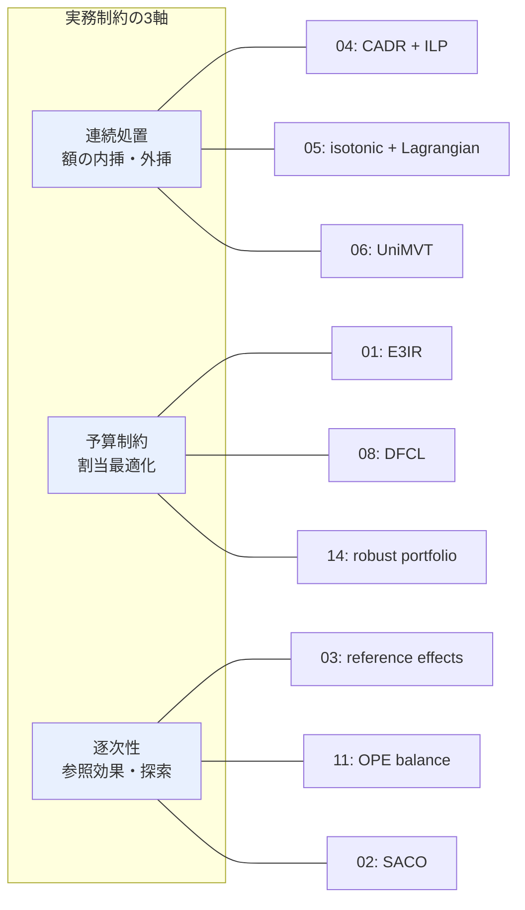

# C6: 実務適用 — クーポン額・予算制約・逐次配布 — リソース一覧

[← clustering index](../../../clustering/20260715/index.md)

## スコープ

本ファイルは Cluster 06「実務適用 — クーポン額・予算制約・逐次配布」に対応するリソース一覧である。手法の理論的新規性ではなく、**実運用に落とす際の制約**を扱う文献を収集した。収集の軸は以下の 3 つである。

- **連続処置（dose-response）**: クーポン額は本質的に連続量であり、額の内挿・外挿が可能かどうかが「額違いの施策」を別施策として切り離さずに済むかを決める。
- **予算制約**: 「効果最大の施策を全員に打つ」は実行不可能であり、割当は knapsack / ILP / Lagrangian 双対といった最適化問題として定式化される。
- **逐次性**: 配布は繰り返され、過去の割引履歴が将来の反応を変える（参照効果）。単発最適化では捉えられない時間構造がある。

収集方針は arXiv-first、中国系 EC（Meituan, Alibaba, Kuaishou）および Booking.com 等の応用論文を重点とした。日本語事例は語彙・KPI 設計の参照に留める。全リソースは検索結果上で存在を確認済みであり、ID が確証できないものは掲載していない。

**本課題の前提**（数ヶ月に一度の低頻度施策 / 施策ごとに対象ユーザー・メッセージ・クーポン額が異なる / 実績ゼロ施策の効果を予測したい）との距離を、各リソースの「本課題への示唆」で明示する。

## リソース総覧

| # | タイトル | 種別 | 年 | リンク | 本課題との関連度 |
|---|---------|------|-----|--------|-----------------|
| 01 | End-to-End Cost-Effective Incentive Recommendation under Budget Constraint with Uplift Modeling (E3IR) | Paper (RecSys'24) | 2024 | [arXiv:2408.11623](https://arxiv.org/abs/2408.11623) | ◎ |
| 02 | ADT4Coupons / SACO: Sequence-Aware Constrained Optimization Framework for Coupon Distribution in E-commerce | Paper (AAAI) | 2025–26 | [arXiv:2508.09198](https://arxiv.org/abs/2508.09198) | ◎ |
| 03 | Personalized Promotions in Practice: Dynamic Allocation and Reference Effects | Paper | 2025 | [arXiv:2512.23781](https://arxiv.org/abs/2512.23781) | ◎ |
| 04 | Uplift modeling with continuous treatments: A predict-then-optimize approach | Paper | 2024 | [arXiv:2412.09232](https://arxiv.org/abs/2412.09232) | ◎ |
| 05 | Data-Driven Real-time Coupon Allocation in the Online Platform | Paper | 2024 | [arXiv:2406.05987](https://arxiv.org/abs/2406.05987) | ◎ |
| 06 | Jointly Optimizing Debiased CTR and Uplift for Coupons Marketing: A Unified Causal Framework (UniMVT) | Paper | 2026 | [arXiv:2602.12972](https://arxiv.org/abs/2602.12972) | ◎ |
| 07 | E-Commerce Promotions Personalization via Online Multiple-Choice Knapsack with Uplift Modeling | Paper (CIKM'22) | 2022 | [arXiv:2108.13298](https://arxiv.org/abs/2108.13298) | ○ |
| 08 | Decision Focused Causal Learning for Direct Counterfactual Marketing Optimization (DFCL) | Paper (KDD'24) | 2024 | [arXiv:2407.13664](https://arxiv.org/abs/2407.13664) | ◎ |
| 09 | Budget-Constrained Causal Bandits: Bridging Uplift Modeling and Sequential Decision-Making | Paper | 2026 | [arXiv:2604.26169](https://arxiv.org/abs/2604.26169) | ◎ |
| 10 | Multi-Treatment Multi-Task Uplift Modeling for Enhancing User Growth (MTMT) | Paper | 2024 | [arXiv:2408.12803](https://arxiv.org/abs/2408.12803) | ○ |
| 11 | Balancing Immediate Revenue and Future Off-Policy Evaluation in Coupon Allocation | Paper | 2024 | [arXiv:2407.11039](https://arxiv.org/abs/2407.11039) | ◎ |
| 12 | Hidden Representation Clustering with Multi-Task Representation Learning towards Robust Online Budget Allocation | Paper | 2025 | [arXiv:2506.00959](https://arxiv.org/abs/2506.00959) | ○ |
| 13 | Marketing Budget Allocation with Offline Constrained Deep Reinforcement Learning | Paper | 2023 | [arXiv:2309.02669](https://arxiv.org/abs/2309.02669) | ○ |
| 14 | Robust portfolio optimization model for electronic coupon allocation | Paper (INFOR) | 2024 | [arXiv:2405.12865](https://arxiv.org/abs/2405.12865) | ○ |
| 15 | Entire Chain Uplift Modeling with Context-Enhanced Learning for Intelligent Marketing (ECUP) | Paper (WWW'24) | 2024 | [arXiv:2402.03379](https://arxiv.org/abs/2402.03379) | ○ |
| 16 | Strategic Coupon Allocation for Increasing Providers' Sales Experiences in Two-sided Marketplaces | Paper (KDD'24) | 2024 | [arXiv:2407.14895](https://arxiv.org/abs/2407.14895) | △ |
| 17 | アップリフトモデリングに基づく費用対効果の高いクーポン配布対象者の決定法 | Paper (JSAI 2024) | 2024 | [J-STAGE](https://www.jstage.jst.go.jp/article/pjsai/JSAI2024/0/JSAI2024_1F5GS1002/_article/-char/ja/) | ○ |

## 各リソース詳細

### 01. End-to-End Cost-Effective Incentive Recommendation under Budget Constraint with Uplift Modeling (E3IR)

**リンク**: [arXiv:2408.11623](https://arxiv.org/abs/2408.11623) / [ACM RecSys'24](https://dl.acm.org/doi/10.1145/3640457.3688147)

**概要**: 予算制約下でのインセンティブ推薦を、uplift 予測モジュールと微分可能割当モジュールの二段構成で end-to-end に解く手法を提案する。uplift 予測側では**隣接する処置水準（treatment）間の増分**を捉える予測ヘッドを構成し、マーケティング領域の事前知識である**単調性（monotonic）と平滑性（smooth）の制約**をモデルに組み込んでいる。割当側では整数線形計画（ILP）を微分可能レイヤとして埋め込むことで、予測誤差の最小化ではなく割当後の収益を直接最適化する。従来の「予測してから最適化する（predict-then-optimize）」二段分離のパイプラインが抱える、予測精度と意思決定品質の不一致という問題への応答である。Meituan での online A/B テストにより、注文量で 0.53%、GMV で 0.65% の改善を報告している。

**本課題への示唆**:
- 「隣接処置間の増分 + 単調性制約」は、**クーポン額が離散水準として与えられるが本来は連続量**という本課題の構造にそのまま対応する。額の順序関係を事前知識として注入する設計は、施策数が少なく各額水準のサンプルが薄い状況で特に効く。
- 単調性・平滑性という帰納バイアスは、**未実施の額水準への内挿**を実質的に可能にする。C3（zero-shot 施策効果予測）の「実績ゼロ」問題に対し、額軸に限れば正則化で橋渡しできることを示す。
- ただし想定は大規模トラフィックの online 配信であり、数ヶ月に一度・少数施策という本課題のデータ量で ILP レイヤの学習が安定するかは未検証。

**キーとなる用語**: `incentive recommendation`, `budget constraint`, `multi-choice knapsack`, `differentiable ILP layer`, `monotonic uplift`, `end-to-end optimization`

### 02. ADT4Coupons / SACO: Sequence-Aware Constrained Optimization Framework for Coupon Distribution in E-commerce

**リンク**: [arXiv:2508.09198](https://arxiv.org/abs/2508.09198) / [AAAI](https://ojs.aaai.org/index.php/AAAI/article/view/38525)

**概要**: **注記: これは 1 本の論文である**。arXiv 2508.09198 の v1（2025年8月）が "ADT4Coupons: An Innovative Framework for Sequential Coupon Distribution in E-commerce"、v2（2026年2月, AAAI 採択版）が "SACO: Sequence-Aware Constrained Optimization Framework" であり、改題されている。clustering ファイルの代表リソース表では ADT4Coupons と SACO が別扱いになりうるため、重複計上に注意が必要である。プラットフォームとユーザー間の**逐次的な相互作用**を活用し、長期収益を最大化するクーポン配布方策を直接学習する。Decision Transformer を改変した枠組みにより予算制約を扱い、複数処置を持つ予算配分問題として定式化する。1 ラウンドに複数ユーザーが同時到着する（共同購入等）並列割当と、ユーザーが複数ラウンドにわたり再訪する逐次依存の双方を扱う点が特徴である。

**本課題への示唆**:
- **逐次性を扱う語彙**（ラウンド、再訪、long-term revenue vs immediate revenue）を提供する。数ヶ月に一度の低頻度施策でも「施策間」の時間構造は存在するため、施策系列を状態遷移として捉える枠組みは援用可能。
- Decision Transformer 系は**大量の系列データ**を前提とする。本課題の施策頻度では系列長・サンプル数ともに不足する可能性が高く、そのまま適用するより「何を状態として持つべきか」の設計指針として読むのが現実的。
- 予算制約を return-to-go 的な条件付けで扱う発想は、制約を最適化の外側ではなくモデル入力として持つ選択肢を示す。

**キーとなる用語**: `sequential coupon distribution`, `Decision Transformer`, `long-term revenue`, `constrained optimization`, `parallel allocation`, `multiple treatments`

### 03. Personalized Promotions in Practice: Dynamic Allocation and Reference Effects

**リンク**: [arXiv:2512.23781](https://arxiv.org/abs/2512.23781) / [著者版 PDF](https://www.columbia.edu/~wm2428/papers/personalized_promotions.pdf)

**概要**: 大規模オンライン小売事業者と共同で、2000 万人超の顧客に日次のパーソナライズド販促を送る問題を扱う。各顧客にどの割引率（10%, 12%, 15%, 17%, 20% off）を提示するかを、全体の配分制約を満たしつつ決定する方策を提案し、A/B テストで **4.5% の収益増**を達成した。前半は「shadow price」という単一パラメータを日次で予算に応じて手動設定する、高速かつスケーラブルなアルゴリズムを提示する。後半は**参照効果（reference effects）を持つ価格設定の組合せモデル**を提案する点が理論的核心であり、顧客は過去 ℓ 日間に見た最良の販促を「参照値」として記憶し、この参照値が悪いほど購入しやすくなるとモデル化する。ここから、最適方策が「悪い割引を ℓ 回提示してから良い割引を 1 回提示する」というサイクルを描くことが導かれる。

**本課題への示唆**:
- **割引率を離散水準の集合（10〜20%）として設計する**という実務そのままの設定であり、本課題の「施策ごとにクーポン額が異なる」に最も近い問題設定を持つ。
- **参照効果は本課題に直接効く論点**である。数ヶ月に一度の施策であっても、前回配った額が今回の反応を規定するなら、施策を独立事象として扱う uplift 推定は系統的にバイアスを持つ。過去施策の額履歴を特徴量に入れる根拠となる。
- shadow price 単一パラメータによる予算調整は、複雑な ILP を組まずとも運用可能な軽量解であり、低頻度・小規模な運用では現実的な第一手になりうる。

**キーとなる用語**: `reference effects`, `dynamic allocation`, `shadow price`, `promotion depth`, `intertemporal patterns`, `combinatorial pricing`

### 04. Uplift modeling with continuous treatments: A predict-then-optimize approach

**リンク**: [arXiv:2412.09232](https://arxiv.org/abs/2412.09232)

**概要**: uplift modeling が通常は二値処置を前提とするのに対し、**連続値処置**を扱う predict-then-optimize フレームワークを提案する。推論ステップでは因果機械学習により **conditional average dose response (CADR)** をデータから推定し、最適化ステップでは連続処置の割当を**用量配分問題（dose-allocation problem）**として定式化し整数線形計画で解く。これにより意思決定者は資源制約とのバランスを取りながら効率的に用量を配分でき、公平性などの追加制約も組み込める。複数の CADR 推定器を比較し、政策価値と公平性のトレードオフを実験的に示している。応用領域はヘルスケア、融資、人材管理などに及ぶ。

**本課題への示唆**:
- **クーポン額を連続処置として扱う正面からの定式化**であり、C6 の中核概念である dose-response を最も明示的に扱う。額の内挿・外挿という本課題の要件に理論的裏付けを与える。
- 「CADR 推定 → ILP 配分」の二段構成は理解しやすく、リソース 01（E3IR）や 08（DFCL）の end-to-end 化が何を改善しようとしているのかを対比で理解する土台になる。
- マーケティング特化ではなく汎用フレームであるため、EC 固有の制約（参照効果、逐次性）は扱わない。実データ規模での検証も中国系 EC 論文ほど厚くない。

**キーとなる用語**: `continuous treatment`, `conditional average dose response (CADR)`, `dose-allocation problem`, `predict-then-optimize`, `integer linear programming`, `fairness constraint`

### 05. Data-Driven Real-time Coupon Allocation in the Online Platform

**リンク**: [arXiv:2406.05987](https://arxiv.org/abs/2406.05987) / [SSRN](https://papers.ssrn.com/sol3/papers.cfm?abstract_id=4742589)

**概要**: Meituan と共同で、不確実なトラフィックと多様な顧客に対しリアルタイムかつ end-to-end のクーポン割当システムを構築した研究である。**各クーポン額の下での CVR を推定し、アイソトニック回帰により予測 CVR のクーポン額に対する単調性を保証する**点が方法上の要点である。その上で Lagrangian 双対に基づくアルゴリズムにより、到着した各顧客に対する最適クーポン額を **50 ミリ秒以内**で決定する。大規模フィールド実験と観測データにより、従来手法を CVR・収益の双方で上回ることを示した。2024年5月時点で Meituan は中国 110 都市以上・1 億人超のユーザーへの配布に本フレームワークを実装し、年間 800 万人民元の追加利益を報告している。

**本課題への示唆**:
- **アイソトニック回帰による「額に対する CVR の単調性」の強制**は、少数の額水準しか観測がない状況でも額軸の秩序を保つ実装容易な手段であり、本課題で最初に試す価値が高い。E3IR の単調性制約と同じ思想をより軽量に実現している。
- Lagrangian 双対による予算制約の扱いは、リソース 03 の shadow price と同型であり、**予算制約 = 双対変数 1 個**という実務的に扱いやすい構図を補強する。
- リアルタイム 50ms という要件は本課題（数ヶ月に一度のバッチ配布）には過剰であり、その部分は読み飛ばしてよい。逆に制約の緩さは本課題に有利に働く。

**キーとなる用語**: `real-time coupon allocation`, `isotonic regression`, `monotonicity of CVR`, `Lagrangian dual`, `budget pacing`, `field experiment`

### 06. Jointly Optimizing Debiased CTR and Uplift for Coupons Marketing: A Unified Causal Framework (UniMVT)

**リンク**: [arXiv:2602.12972](https://arxiv.org/abs/2602.12972)

**概要**: オンライン広告においてクーポン等のマーケティング介入が CTR 予測に**重大な交絡バイアス**を持ち込むという問題を扱う。観測されるクリックはユーザーの内在的な選好と介入による uplift の混合であり、両者が分離されないまま CTR モデルが学習される。提案手法 **Unified Multi-Valued Treatment Network (UniMVT)** は交絡因子を処置感応的な表現から切り離し、全空間の反実仮想推論モジュールにより**debiased base CTR と intensity-response curve を同時に再構成**する。これによりシステムのキャリブレーションに必要な debiased CTR 予測と、インセンティブ配分に必要な精緻な uplift 推定を同時に達成する。実データ A/B テストでビジネス指標の改善を確認している。

**本課題への示唆**:
- **intensity-response curve（強度反応曲線）**という語彙は、クーポン額を多値処置として扱いつつ連続的な反応曲線を推定するという本課題の要件そのものである。`multi-valued treatment` は離散水準と連続処置の中間概念として有用。
- 過去の施策データが**非ランダムに配布されている**（効きそうな人に厚く配る運用）場合、その履歴から素朴に uplift を学ぶと交絡バイアスが乗るという指摘は、本課題の観測データ活用に直結する警告である。
- 2026年の最新論文であり、C6 の中で最も新しい定式化。ただし arXiv のみで査読状況は要確認。

**キーとなる用語**: `debiased CTR`, `multi-valued treatment`, `intensity-response curve`, `confounding bias`, `counterfactual inference`, `calibration`

### 07. E-Commerce Promotions Personalization via Online Multiple-Choice Knapsack with Uplift Modeling

**リンク**: [arXiv:2108.13298](https://arxiv.org/abs/2108.13298) / [CIKM'22](https://dl.acm.org/doi/10.1145/3511808.3557100)

**概要**: 各顧客にどの販促を提示するかを、全体の予算制約に従いつつ購入完了数を最大化するよう選択する「Online Constrained Multiple-Choice Promotions Personalization Problem」を定式化する。これを **Online Multiple Choice Knapsack Problem** として形式化し、因果推論（uplift modeling）による増分推定を最適化の入力とする枠組みを構築する。既存文献に対する拡張は、因果推定の結果として生じる**負の重みと負の価値**を扱える点にある（クーポンが逆効果になる「あまのじゃく」層の存在に対応）。リアルタイム適応手法により予算制約遵守を保証しつつ、各種データセットで潜在的最適インパクトの 99.7% 以上を達成した。Booking.com の大規模実験で展開された。

**本課題への示唆**:
- **負の uplift を最適化に正しく組み込む**という論点は実務上重要である。クーポンで購買を減らす層が存在する場合、素朴な knapsack 定式化は破綻する。
- 予算制約下の割当を multiple-choice knapsack として見る視点は C6 の共通言語であり、E3IR（01）はこの定式化を微分可能化したものと理解できる。本論文を先に読むと 01 の貢献が明確になる。
- 中国系 EC ではなく Booking.com の事例だが、実データ規模と制約設定は同等に現実的。

**キーとなる用語**: `online multiple-choice knapsack`, `budget compliance`, `negative weights and values`, `uplift-driven optimization`, `sleeping bandits`

### 08. Decision Focused Causal Learning for Direct Counterfactual Marketing Optimization (DFCL)

**リンク**: [arXiv:2407.13664](https://arxiv.org/abs/2407.13664) / [KDD'24](https://dl.acm.org/doi/10.1145/3637528.3672353)

**概要**: Meituan と南京大学による KDD 2024 採択論文。既存研究がマーケティング最適化を機械学習（ML）と組合せ最適化（OR）の**完全に分離した二段**として定式化していることを問題視する。ML 側の学習目的が下流の最適化タスクを考慮しないため、**予測精度が意思決定品質と正の相関を持たない**という現象が生じる。Decision Focused Learning (DFL) により ML と OR を end-to-end に統合し、下流タスクの目的を decision loss として直接用いることで両者の最適化方向の一貫性を保証する。方法上の核心は、離散行動の意思決定問題を**行動の確率分布の下での期待収益最大化**に変換し、最大エントロピー正則化と Lagrangian 双対理論を組み合わせて 2 種の代理損失（Policy Learning Loss と Maximum Entropy Regularized Loss）を導出する点にある。

**本課題への示唆**:
- 「**予測精度 ≠ 意思決定品質**」という主張は本課題の評価設計に直結する。uplift の AUUC/Qini を上げても予算制約下の実収益が改善するとは限らず、評価指標を意思決定側に寄せる必要がある。
- 離散行動を確率分布上の期待値に緩和する手法は、微分不可能な割当を学習に載せる汎用テクニックであり、E3IR（01）の微分可能 ILP レイヤと対比して読む価値がある。
- 少数施策・低頻度という本課題では decision loss の推定分散が大きくなる懸念があり、その点は精読時の確認事項。

**キーとなる用語**: `decision focused learning`, `decision loss`, `predict-then-optimize gap`, `maximum entropy regularizer`, `Lagrangian duality`, `surrogate loss`

### 09. Budget-Constrained Causal Bandits: Bridging Uplift Modeling and Sequential Decision-Making

**リンク**: [arXiv:2604.26169](https://arxiv.org/abs/2604.26169)

**概要**: 予算制約下の処置割当をオンライン学習として扱う **Budget-Constrained Causal Bandits (BCCB)** を提案する。広告主は限られた予算で誰に広告を出すかを決めねばならないが、標準的なオフライン手法は**新規キャンペーン・新規市場・新規セグメントといった cold-start 状況**で履歴データが乏しく機能しない。BCCB は「個人レベルの広告効果の学習」「反応が不確実なユーザーの探索」「時間軸での予算ペーシング」の 3 要素を単一の逐次過程に統合する。オフライン手法と異なり事前収集データを必要とせず、1 ユーザーずつ処置決定を行いながら学習と配分を同時に進める点が最大の特徴である。

**本課題への示唆**:
- **cold-start を正面から扱う唯一のリソース**であり、「実績ゼロ施策の効果予測」という本課題の中心問題に対する、予測ではなく**探索による**代替アプローチを提示する。C3 / C4 との接続点そのもの。
- 「新しいクーポン額を試す価値」を探索コストとして定量化する枠組みは、施策設計時に少量の探索枠を確保する運用の根拠になる。低頻度施策では 1 回の施策内に探索を埋め込む設計が必要。
- 2026年4月の新しい arXiv 論文で査読状況は不明。実データ規模の検証がどこまであるかは精読時に確認を要する。

**キーとなる用語**: `causal bandits`, `budget pacing`, `cold-start`, `exploration-exploitation`, `sequential allocation`, `online learning`

### 10. Multi-Treatment Multi-Task Uplift Modeling for Enhancing User Growth (MTMT)

**リンク**: [arXiv:2408.12803](https://arxiv.org/abs/2408.12803)

**概要**: ユーザー成長のためのゲームボーナス等、**複数処置かつ複数タスク**の設定で処置効果を推定する MTMT uplift ネットワークを提案する。既存研究の大半が単一タスク・単一処置を前提とするのに対し、より複雑で現実的なシナリオを扱う。著者は Yuxiang Wei, Zhaoxin Qiu, Yingjie Li, Yuke Sun, Xiaoling Li（2024年8月投稿）。処置ごと・タスクごとの効果を共有表現の上で推定することで、タスク間の情報を相互に活用する構成を取る。

**本課題への示唆**:
- **複数の処置水準（= 複数のクーポン額）を単一モデルで扱う**設計であり、額ごとにモデルを分けるのではなく処置を入力として持つという C2（Treatment Representation）の要件に接続する。
- multi-task 構成は、コンバージョン・クリック・訪問など複数 KPI を同時に見る本課題の運用に対応する。単一 KPI 最適化では見落とすトレードオフを扱える。
- 処置を離散カテゴリとして扱っており、額の連続性・内挿は明示的には扱わない。リソース 04 / 06 と組み合わせて読むべき。

**キーとなる用語**: `multi-treatment`, `multi-task uplift`, `user growth`, `shared representation`, `treatment effect estimation`

### 11. Balancing Immediate Revenue and Future Off-Policy Evaluation in Coupon Allocation

**リンク**: [arXiv:2407.11039](https://arxiv.org/abs/2407.11039) / [Springer](https://link.springer.com/chapter/10.1007/978-981-96-0125-7_35)

**概要**: 筆頭著者は Naoki Nishimura ら（日本の研究グループ）。クーポン配布における根本的トレードオフ、すなわち**現在の最適方策を活用して即時収益を最大化すること**と、**代替方策を探索して将来の off-policy evaluation (OPE) 用データを収集すること**の対立を扱う。提案手法はモデルベースの収益最大化方策とランダム化探索方策を混合し、両者の**混合比率を柔軟に調整**することで短期収益と将来の方策改善のバランスを最適化する枠組みを構築する。最適な混合比率の決定を多目的最適化として定式化し、トレードオフの定量評価を可能にした。

**本課題への示唆**:
- **本課題の状況に極めてよく適合する**。数ヶ月に一度しか施策を打てないなら、1 回の施策は「収益を稼ぐ機会」であると同時に「次回のためのデータを作る唯一の機会」であり、この二重性の明示的な定式化は運用設計に直結する。
- ランダム化探索枠を確保することが**将来の OPE の前提条件**（傾向スコアが既知になる）であるという指摘は、C4（New-Action Bandit / OPE）を本課題で成立させるための実務的必要条件を与える。
- 混合比率という単一の設計変数に落とし込んでいるため、複雑な RL を導入せずとも今の運用に組み込みやすい。

**キーとなる用語**: `off-policy evaluation`, `exploration-exploitation`, `policy mixture ratio`, `multi-objective optimization`, `data collection policy`, `logging policy`

### 12. Hidden Representation Clustering with Multi-Task Representation Learning towards Robust Online Budget Allocation

**リンク**: [arXiv:2506.00959](https://arxiv.org/abs/2506.00959)

**概要**: Meituan の Xiaohan Wang らによる研究。マーケティング最適化をオンライン予算配分問題として扱う際の、**大規模な反実仮想予測**と「個人ごとに予測してから最適化する」方式の**計算複雑性のトレードオフ**という課題に取り組む。提案手法は問題をクラスタ視点から解く。まず multi-task 表現ネットワークで個人属性を学習し特徴を高次元の隠れ表現へ射影する。次にこれらの表現を分割型クラスタリングにより K グループに分け、問題を**整数確率計画（integer stochastic programming）**として再定式化する。6 種の SOTA マーケティング最適化アルゴリズムとの比較でオフライン実験による有効性を確認し、Meituan の online A/B テストで注文量 0.53%、GMV 0.65% の改善を得た。

**本課題への示唆**:
- **個人単位ではなくクラスタ単位で割当を解く**という発想は、サンプル数が限られる本課題で有効な可能性が高い。個人レベルの uplift 推定が不安定なら、セグメント粒度に落として分散を下げる選択は合理的。
- 「対象ユーザーが施策ごとに異なる」という本課題の記述は、実質的にセグメント設計の問題であり、隠れ表現によるクラスタリングはそのデータ駆動な代替を与える。
- 報告されている A/B の改善幅（0.53% / 0.65%）が E3IR（01）と同一の数値であり、同じ Meituan の基準ラインに対する比較と推測される。精読時に両者の関係を確認したい。

**キーとなる用語**: `budget allocation`, `hidden representation clustering`, `integer stochastic programming`, `multi-task representation learning`, `counterfactual prediction at scale`

### 13. Marketing Budget Allocation with Offline Constrained Deep Reinforcement Learning

**リンク**: [arXiv:2309.02669](https://arxiv.org/abs/2309.02669)

**概要**: オンラインマーケティングキャンペーンにおける予算配分問題を、**既に収集済みのオフラインデータ**のみを用いて扱う。ゲーム理論に基づく offline value-based 強化学習手法を混合方策（mixed policies）により構成する点が新規性である。従来手法が無限個の方策を保持する必要があったのに対し、提案法は**定数個の方策の保持のみ**で済むよう削減し、産業利用に耐える方策効率を達成する。また従来の value-based 強化学習手法では達成できなかった**最適方策への収束が保証される**ことを示している。

**本課題への示唆**:
- **オフラインデータのみで予算制約付き方策を学ぶ**という設定は、オンライン探索が困難な本課題（数ヶ月に一度しか施策がない）の制約に合致する。
- 混合方策を定数個に削減する工夫は実装容易性の観点で重要であり、理論保証付きで運用に載せられる形を示している。
- RL 系全般の課題として、状態遷移を定義できるだけの施策系列長が本課題にあるかは疑問。逐次性が弱い場合は 01 / 05 の静的最適化で十分な可能性がある。

**キーとなる用語**: `offline constrained RL`, `mixed policy`, `budget allocation`, `game-theoretic learning`, `policy convergence guarantee`

### 14. Robust portfolio optimization model for electronic coupon allocation

**リンク**: [arXiv:2405.12865](https://arxiv.org/abs/2405.12865) / [INFOR (T&F)](https://www.tandfonline.com/doi/full/10.1080/03155986.2024.2386494)

**概要**: 著者は Yuki Uehara, Naoki Nishimura, Yilin Li, Jie Yang, Deddy Jobson, Koya Ohashi, Takeshi Matsumoto, Noriyoshi Sukegawa, Yuichi Takano（日本の研究グループ、メルカリ関係者を含む）。EC サイトにおいて予算制約下で顧客へクーポンを最適配分する問題を、**顧客セグメンテーションに基づくロバストポートフォリオ最適化モデル**として定式化する。問題を小規模な連続ポートフォリオ最適化問題に帰着できる点が計算上の要点である。金融のポートフォリオ理論を援用し、効果推定の不確実性を明示的にモデル化してロバストな配分を導く。

**本課題への示唆**:
- **効果推定の不確実性を最適化に組み込む**という発想は、サンプルが少なく uplift 推定が不安定な本課題で本質的に重要。点推定を信じて最適化する手法群（01, 05 等）への現実的な対抗軸となる。
- セグメント単位への集約により問題を小規模化する方針は、リソース 12 のクラスタ視点と同じ方向であり、少数データ環境での定石と見てよい。
- 日本の研究グループによる査読付きジャーナル論文であり、語彙・定式化の面で国内実務との接続がよい。

**キーとなる用語**: `robust optimization`, `portfolio optimization`, `customer segmentation`, `budget constraint`, `uncertainty set`

### 15. Entire Chain Uplift Modeling with Context-Enhanced Learning for Intelligent Marketing (ECUP)

**リンク**: [arXiv:2402.03379](https://arxiv.org/abs/2402.03379) / [WWW'24](https://dl.acm.org/doi/10.1145/3589335.3648320)

**概要**: EC においてユーザー行動が **impression → click → conversion** という定まった逐次連鎖に従う点に着目する。マーケティング施策はこの連鎖の各段階で異なる uplift 効果を持ち、CTR や CVR といった指標に影響する。既存研究は特定処置内での全段階にわたるタスク間影響を考慮せず、また処置情報の活用が不十分であるため、下流のマーケティング意思決定に大きなバイアスを導入しうる。著者はこれらを **chain-bias problem** と **treatment-unadaptive problem** と名付け、両者に対処する ECUP（Entire Chain UPlift method with context-enhanced learning）を提案する。WWW 2024 採択。

**本課題への示唆**:
- **treatment-unadaptive problem**（処置情報がモデルに十分活用されない）という問題設定は、C2（Treatment Representation）の中核課題を別角度から言語化したものであり、クーポン額を単なるフラグでなく構造化された入力として扱う必要性を補強する。
- クーポン配布から実際の利用までの経路（配布 → 開封 → 利用）を連鎖として扱う視点は、本課題の KPI 設計（どの段階の uplift を見るか）に示唆を与える。
- 施策の連鎖構造が本課題（メール配信 → クーポン利用 → 購買）にどこまで当てはまるかは要検討。

**キーとなる用語**: `entire chain uplift`, `chain-bias problem`, `treatment-unadaptive problem`, `context-enhanced learning`, `impression-click-conversion`

### 16. Strategic Coupon Allocation for Increasing Providers' Sales Experiences in Two-sided Marketplaces

**リンク**: [arXiv:2407.14895](https://arxiv.org/abs/2407.14895)

**概要**: 著者は Koya Ohashi, Sho Sekine, Deddy Jobson, Jie Yang, Naoki Nishimura, Noriyoshi Sukegawa, Yuichi Takano（KDD'24 発表、日本の研究グループ）。**両側マーケットプレイス**ではネットワーク効果が競争力の鍵であり、多数の出品者（provider）が安定的にプラットフォーム上に留まることが規模と多様性の向上に重要であるとの問題意識に立つ。出品者管理に「**成功した販売経験の分布**」という新しい視点を導入し、出品者の販売経験数を最大化するパーソナライズド販促最適化手法を提案する。一度でも販売経験のある出品者を successful provider と定義し、プラットフォームの適切な介入がなければ販売が少数の出品者に独占される傾向があると指摘する。

**本課題への示唆**:
- 最適化の目的関数が収益ではなく「**経験した出品者数**」という非収益 KPI である点が特徴的。本課題が収益以外の目標（休眠復帰、初回購入者数等）を持つ場合の定式化の参考になる。
- 両側市場という設定は本課題（一般的な B2C クーポン配布）とは異なるため関連度は △。ただし予算制約付き割当の定式化パターンとしては共通言語を持つ。
- 日本の研究グループによる KDD 論文であり、リソース 11 / 14 と著者が重なる。国内での当該領域の研究コミュニティを辿る起点として有用。

**キーとなる用語**: `two-sided marketplace`, `provider retention`, `network effects`, `non-revenue objective`, `personalized promotion optimization`

### 17. アップリフトモデリングに基づく費用対効果の高いクーポン配布対象者の決定法

**リンク**: [LINEヤフー研究開発](https://research.lycorp.co.jp/jp/publications/1960) / [J-STAGE (JSAI2024)](https://www.jstage.jst.go.jp/article/pjsai/JSAI2024/0/JSAI2024_1F5GS1002/_article/-char/ja/)

**概要**: 人工知能学会全国大会（JSAI 2024）で発表された LINEヤフーによる研究。クーポン配布には**使用により生じる割引額が収益を減少させる**という課題があり、さらに配布の仕方は予算により制限されるという問題意識に立つ。機械学習により推定された費用対効果の指標をもとに、クーポン配布対象者を決定する手法を提案する。国内大手プラットフォームの実務課題を、アップリフトモデリングと費用対効果指標の枠組みで扱った事例である。

**本課題への示唆**:
- **「クーポンの割引額そのものがコストである」**という費用構造の明示は、単純な uplift 最大化ではなく「uplift ÷ コスト」で評価すべきという本課題の評価軸に直結する。日本語の語彙で整理されている点が有用。
- 国内実務における KPI 設計・用語（費用対効果、配布対象者決定）の参照先として価値がある。ただし**手法的な深さは中国系 EC の応用論文に及ばず**、定式化の精緻さや実験規模での参照は期待しない。
- 予稿レベルの短い論文であり、詳細な定式化やベンチマーク比較は限定的と見込まれる。

**キーとなる用語**: `アップリフトモデリング`, `費用対効果`, `クーポン配布対象者`, `予算制限`, `割引額コスト`

## 実務制約の整理

各手法が 3 軸（連続処置 / 予算制約 / 逐次性）のうち何を扱い、何を扱わないかを整理する。◎ = 中心的に扱う、○ = 扱うが主眼ではない、× = 扱わない。

| # | 手法 | 連続処置（額の内挿・外挿） | 予算制約 | 逐次性・時間構造 | 扱わないこと |
|---|------|------------------------|---------|----------------|------------|
| 01 | E3IR | ◎ 隣接処置の増分 + 単調性・平滑性制約 | ◎ 微分可能 ILP レイヤ | × 単発割当 | 参照効果、探索、推定不確実性 |
| 02 | ADT4Coupons / SACO | ○ 多処置だが額の連続性は主眼でない | ◎ DT の条件付けで制約 | ◎ ラウンド・再訪を明示モデル化 | 少数データでの成立性、推定不確実性 |
| 03 | Personalized Promotions in Practice | ○ 離散割引率 5 水準 | ◎ shadow price 単一パラメータ | ◎ 参照効果（過去 ℓ 日の最良割引） | 額の外挿、cold-start |
| 04 | Continuous treatments predict-then-optimize | ◎ CADR による dose-response | ◎ ILP による dose 配分 | × 静的 | 参照効果、EC 固有制約、大規模検証 |
| 05 | Real-time Coupon Allocation (Meituan) | ◎ アイソトニック回帰で額に単調な CVR | ◎ Lagrangian 双対 | × 各顧客独立に単発判断 | 参照効果、履歴依存、探索 |
| 06 | UniMVT | ◎ intensity-response curve | ○ 配分への入力を供給 | × 静的 | 予算最適化そのもの、逐次性 |
| 07 | Online Multiple-Choice Knapsack | ○ 離散販促の選択 | ◎ knapsack、負の値も許容 | ○ online 到着だが履歴依存なし | 額の連続性、参照効果 |
| 08 | DFCL | ○ 離散行動を確率分布に緩和 | ◎ Lagrangian 双対 + decision loss | × 静的 | 逐次性、cold-start |
| 09 | BCCB | ○ 処置選択（額の連続性は主眼でない） | ◎ 予算ペーシング | ◎ オンライン逐次学習 | 大規模実データ検証（要確認） |
| 10 | MTMT | ○ 多処置カテゴリとして | × 割当は範囲外 | × 静的 | 予算制約、額の内挿、逐次性 |
| 11 | Balancing Revenue and OPE | × 額は主眼でない | ○ 前提として存在 | ◎ 今期の探索が次期の OPE を規定 | 額の連続性、割当アルゴリズム自体 |
| 12 | Hidden Representation Clustering | ○ 処置を含むが主眼でない | ◎ 整数確率計画（クラスタ単位） | × 静的 | 額の連続性、参照効果 |
| 13 | Offline Constrained DRL | × | ◎ 制約付き RL | ◎ オフライン系列から方策学習 | 額の連続性、少数データでの成立性 |
| 14 | Robust portfolio optimization | × セグメント単位 | ◎ ロバスト最適化 | × 静的 | 額の連続性、逐次性 |
| 15 | ECUP | ○ treatment-adaptive な表現 | × 割当は範囲外 | ○ 行動連鎖（時間軸ではない） | 予算制約、額の外挿 |
| 16 | Strategic Coupon Allocation | × | ◎ 予算制約付き割当 | × 静的 | 額の連続性、逐次性 |
| 17 | LINEヤフー JSAI | × | ○ 予算制限に言及 | × 静的 | 定式化の精緻さ、大規模検証 |

**3 軸すべてを同時に扱う手法は存在しない。**最も網羅的なのは 02（SACO）と 03（Personalized Promotions）だが、02 は大量系列データを、03 は日次 2000 万人規模を前提とする。本課題（低頻度・少数施策）の条件では、いずれもそのままは適用できない。

## 日本語事例

**注意: 本節のリソースは語彙・KPI 設計の参照用である。手法の深さは中国系 EC の応用論文（01, 05, 08, 12 等）に及ばず、定式化の精緻さや実験規模での参照は期待しない。**

| リソース | 種別 | 用途 |
|---------|------|------|
| [アップリフトモデリングに基づく費用対効果の高いクーポン配布対象者の決定法](https://www.jstage.jst.go.jp/article/pjsai/JSAI2024/0/JSAI2024_1F5GS1002/_article/-char/ja/)（LINEヤフー, JSAI 2024） | 学会予稿 | 「費用対効果」「配布対象者決定」「予算制限」の国内語彙。割引額をコストとして扱う費用構造の整理 |
| [第3回『集まるデータ』のマーケティング活用術（3）マーケターの夢を実現するアップリフトモデルとは？](https://www.macromill.com/data_and_insights/marketer_column/article_007.html)（マクロミル） | 実務コラム | 4 象限セグメント（Persuadables / Sure Things / Lost Causes / Do Not Disturbs）の日本語定訳 |
| [アップリフトモデリング（Uplift modeling）について分かりやすく解説](https://toukei-lab.com/uplift-modeling)（スタビジ） | 解説記事 | 基礎語彙の確認用 |
| [【因果推論】uplift modeling とは？TWO MODEL と X LEARNER](https://statisticsschool.com/)（青の統計学） | 解説記事 | Two-Model 法 / X-Learner の日本語説明 |
| [アップリフト分析超入門: クーポンは本当に効いてる？](https://www.salesanalytics.co.jp/datascience/datascience266/)（セールスアナリティクス） | 解説記事 | クーポン文脈での Two-Model 法の説明。実装例あり |

なお、**日本の研究グループによる査読付き論文は手法的にも参照価値がある**点に注意したい。リソース 11（Balancing Revenue and OPE）、14（Robust portfolio）、16（Strategic Coupon Allocation）は Naoki Nishimura / Yuichi Takano らのグループによるもので、上記の実務コラム類とは水準が異なる。これらは日本語事例ではなく本編のリソースとして扱っている。

## 調査から見えた論点

1. **ADT4Coupons と SACO は同一論文である**。arXiv 2508.09198 の v1 が ADT4Coupons、v2（AAAI 採択版）が SACO であり、改題されている。clustering ファイルの代表リソース表では別々に見えうるため、retrieval フェーズで重複計上しないよう注意が必要。引用時は AAAI 版（SACO）を正とすべき。

2. **予算制約の扱いは「双対変数 1 個」に収束しつつある**。リソース 03 の shadow price、05 の Lagrangian 双対、08 の Lagrangian duality はいずれも本質的に同じ構図であり、予算制約は単一のスカラーパラメータで表現できる。これは本課題にとって朗報で、複雑な ILP ソルバを導入せずとも「閾値を予算に合わせて調整する」運用で大部分が実現できることを意味する。

3. **額の単調性が連続処置問題の実用的な突破口である**。E3IR（01）の monotonic 制約と Real-time Coupon Allocation（05）のアイソトニック回帰は、独立に同じ結論に到達している。「クーポン額が増えれば CVR は下がらない」という業務知識を制約として注入することで、額水準ごとのサンプルが薄くても額軸の内挿が安定する。**本課題で最初に試すべき最も費用対効果の高い施策**と考えられる。

4. **「予測精度 ≠ 意思決定品質」という指摘が繰り返し現れる**。DFCL（08）が最も明示的だが、E3IR（01）の end-to-end 化も同じ動機に立つ。本課題の評価設計において、AUUC / Qini を上げることを目標にすると予算制約下の実収益と乖離しうる。評価指標を意思決定側（制約下の期待収益）に置く必要がある。

5. **参照効果は本課題で無視できない可能性が高い**。リソース 03 は、顧客が過去 ℓ 日の最良割引を参照値として記憶し、それが将来の反応を規定することを示した。数ヶ月に一度の施策であっても、前回配った額が今回の反応を規定するなら、施策を独立事象として扱う uplift 推定は系統的バイアスを持つ。**過去施策の額履歴を特徴量に含めるべき**という実装上の帰結が導かれる。

6. **cold-start への回答は「予測」と「探索」の 2 系統に分かれる**。C3 が志向する zero-shot 予測（額の単調性による内挿）に対し、BCCB（09）は探索により解こうとする。本課題の低頻度性を考えると探索の機会費用が極めて高く、予測系が有利に見える。ただしリソース 11 が示す通り、**探索を一切しないと将来の OPE が不可能になる**というジレンマがあり、少量の探索枠確保は必要条件である。

7. **データ規模のギャップが最大の懸念である**。収集した応用論文の大半（01, 02, 05, 06, 08, 12）は Meituan / Booking 級の大規模トラフィックを前提とする。数ヶ月に一度・少数施策という本課題では、深層モデル系（DT, DRL, multi-task network）は成立しない可能性が高い。**セグメント粒度への集約（12, 14）と不確実性の明示的モデル化（14）が現実的な方向**と見られる。

8. **推定不確実性を最適化に組み込む手法が少ない**。ロバストポートフォリオ最適化（14）がほぼ唯一であり、他の大半は uplift の点推定を信じて最適化する。サンプルが少なく推定が不安定な本課題では、この前提が崩れる。14 の位置づけは想定より重要かもしれない。

## retrieval 推奨

以下の 5 本を優先的に精読すべきと考える。順序は「制約の定式化 → 額の連続性 → 実運用の複雑性 → 本課題固有の制約」の流れを意識した。

1. **05. Data-Driven Real-time Coupon Allocation in the Online Platform**（[arXiv:2406.05987](https://arxiv.org/abs/2406.05987)） — **最優先**。アイソトニック回帰による「額に対する CVR の単調性」+ Lagrangian 双対による予算制約という組み合わせは、本課題で最も実装しやすく効果が見込める。深層モデルを要さずサンプル数が少なくても機能する可能性が高い。Meituan の大規模実証があり信頼性も高い。論点 3 の「額の単調性が突破口」を最も軽量に体現する。

2. **03. Personalized Promotions in Practice: Dynamic Allocation and Reference Effects**（[arXiv:2512.23781](https://arxiv.org/abs/2512.23781)） — 割引率を離散水準（10〜20%）として設計する問題設定が本課題に最も近い。加えて**参照効果**という、他のどのリソースも扱わない実務固有の現象を理論・実証の両面で扱う。過去の配布額が今回の反応を歪めるなら本課題の uplift 推定の前提が崩れるため、この論点の確認は必須。shadow price による軽量な予算調整も実装指針になる。

3. **11. Balancing Immediate Revenue and Future Off-Policy Evaluation in Coupon Allocation**（[arXiv:2407.11039](https://arxiv.org/abs/2407.11039)） — 「1 回の施策は収益機会であると同時に次回のためのデータを作る唯一の機会」という二重性の定式化は、**低頻度施策という本課題の中心的制約に直接応答する唯一のリソース**。混合比率という単一の設計変数に落ちており、現行運用に組み込みやすい。C4（OPE）を本課題で成立させる前提条件を与える点でも重要。

4. **01. End-to-End Cost-Effective Incentive Recommendation under Budget Constraint (E3IR)**（[arXiv:2408.11623](https://arxiv.org/abs/2408.11623)） — C6 の中心リソースであり、隣接処置間の増分 + 単調性・平滑性制約という設計は「額の内挿」の理論的支柱。予算制約下の割当を multiple-choice knapsack として見る C6 共通の定式化も押さえられる。ただし ILP レイヤの学習が本課題のデータ量で安定するかは批判的に読む必要がある。リソース 07（knapsack 定式化の原型）を先に軽く通すと理解が早い。

5. **14. Robust portfolio optimization model for electronic coupon allocation**（[arXiv:2405.12865](https://arxiv.org/abs/2405.12865)） — **推定不確実性を最適化に組み込む唯一のリソース**（論点 8）。サンプルが少なく uplift 推定が不安定な本課題では、点推定を前提とする 01 / 05 / 08 の系統に対する重要な対抗軸になる。セグメント単位への集約により小規模問題へ帰着する方針も、データ量の制約に適合する。日本の研究グループによる査読付きジャーナル論文で語彙の接続もよい。

**次点**: 08（DFCL）は「予測精度 ≠ 意思決定品質」という評価設計上の論点（論点 4）が重要であり、評価指標の設計フェーズに入る際は優先度が上がる。06（UniMVT）は過去施策が非ランダムに配布されている場合の交絡バイアスへの警告として、観測データ活用の可否を判断する段階で読む価値がある。
