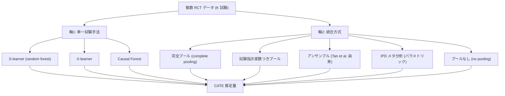

# 01. Comparison of Methods that Combine Multiple Randomized Trials to Estimate Heterogeneous Treatment Effects

[← index](index.md)

## 書誌情報

| 項目 | 内容 |
|------|------|
| タイトル | Comparison of Methods that Combine Multiple Randomized Trials to Estimate Heterogeneous Treatment Effects |
| 著者 | Carly Lupton Brantner, Trang Quynh Nguyen, Tengjie Tang, Congwen Zhao, Hwanhee Hong, Elizabeth A. Stuart |
| arXiv 投稿 | 2023-03-28 (v1) / 2023-11-15 (v2) |
| 出版 | Statistics in Medicine, 43(7), 1291–1314, 2024 |
| 分類 | stat.ME, stat.ML |
| リンク | [arXiv:2303.16299](https://arxiv.org/abs/2303.16299) / [PMC11086055](https://pmc.ncbi.nlm.nih.gov/articles/PMC11086055/) / DOI: [10.1002/sim.9955](https://doi.org/10.1002/sim.9955) |

（著者・年・会場・DOI はすべて arXiv abs ページと PMC 版で確認済み。）

## 一言で言うと

複数の RCT を統合して HTE を推定する既存手法を「単一試験手法（S/X-learner・causal forest）× 統合方式（完全プール／試験指示変数つきプール／アンサンブル／IPD メタ分析／プールなし）」の直積として整理し、シミュレーションで比較したベンチマーク論文である。結論は明快で、**完全プールは全条件で劣り、試験間の効果ばらつきを明示的に許容する統合方式が一貫して勝つ**。

## 問題設定

個別化された処置判断を行いたいが、単一データセットでは信頼性・精度・一般化可能性を同時に満たすのが難しい。複数の RCT を組み合わせれば、処置割付が非交絡であるデータを増やせるため HTE 推定が改善する見込みがある。しかし「どう組み合わせるか」には複数の設計自由度があり、それらの相対性能は整理されていなかった。

本論文が扱う構造は次の通り。試験 $s = 1, \dots, K$ があり、各試験内で処置 $D$ がランダム割付される。関心量は条件付き平均処置効果

$$\tau(x, s) = \mathbb{E}[Y(1) - Y(0) \mid X = x, S = s]$$

であり、これが試験 $s$ に依存し得る（cross-trial heterogeneity）ことが問題の核心である。$\tau$ が $s$ に依存しないと仮定するのが完全プール、依存を全面的に許すのがプールなし、その中間をどう設計するかが論点となる。

## 手法

本論文は新手法の提案ではなく、**二軸の直積による手法空間の整理と比較**である。

### 軸1: 単一試験手法

- **S-learner**: base learner（random forest）で、共変量と処置を合わせた条件付きアウトカム平均関数 $\mu(x, d)$ を推定し、$\hat\tau(x) = \hat\mu(x, 1) - \hat\mu(x, 0)$ とする。処置変数を他の共変量と同格に扱うため、効果が弱いと木が処置で分割せず $\hat\tau \approx 0$ に潰れやすい。
- **X-learner**: 処置群別にアウトカム関数を推定 → 個人ごとの効果を代入（imputation）→ 傾向スコアで重み付けして統合、という三段構え。
- **Causal Forest**: 木の分割基準そのものを処置効果の異質性に向ける。複数木の重み付き集約で $\hat\tau(x)$ を得る。

### 軸2: 統合方式

- **完全プール**: 全試験のデータを 1 つのテーブルに結合し、単一試験手法をそのまま適用。$\tau(x, s) = \tau(x)$（試験間で CATE 均質）を仮定する。
- **試験指示変数つきプール**: 試験メンバーシップをカテゴリ変数としてモデルに投入。試験固有 CATE を表現できる。
- **アンサンブル**（Tan et al. を改変）: 三段階。(1) 各試験内で局所モデルを fit、(2) 全試験の全個人に $K$ 本のモデルを適用して $N \times K$ の CATE 推定値からなる augmented dataset を作る、(3) その augmented data に対して回帰木 / random forest / lasso のアンサンブルを fit。
- **IPD メタ分析**: 試験ごとのランダム切片・ランダム傾きと、事前指定した交互作用項を持つパラメトリックモデル。
- **プールなし**: 各試験内で独立に fit。

## 実験・結果

### シミュレーション設計

| 項目 | 設定 |
|------|------|
| 試験数 $K$ | 10（主）、30（感度分析） |
| 試験あたり標本 | 500（主）。大規模 1 試験 $n=1000$ + 他 $n=200$、および混在サイズも検討 |
| 共変量 | 連続 5 変数（相関 0.2）、効果修飾因子は $X_1, X_2$ |
| 傾向スコア | 各試験内で $\pi = 0.5$ |
| 試験主効果の分散 | $\sigma_\beta \in \{0.5, 1, 3\}$ |
| 試験交互作用の分散 | $\sigma_\delta \in \{0, 0.5, 1\}$ |
| 評価指標 | 真の個人 CATE との MSE、シナリオあたり 1,000 反復平均 |

CATE の関数形は 3 シナリオ。

- **1a（区分線形）**: $\tau(x, s) = x_1 \cdot I(x_1 > 0) + \beta_s + \delta_s x_1$
- **1b（非線形）**: $\tau(x, s) = g(x_1) g(x_2) + \beta_s + \delta_s x_1$、ただし $g(x) = \dfrac{2}{1 + \exp(-12(x - 1/2))}$
- **2（可変 CATE）**: 試験ごとに関数形が異なる（非線形の試験、区分線形の試験、効果ゼロの試験が混在）

追加変動として covariate shift（奇数番号の試験で $X_1$ の平均を 2、偶数試験で 0）、honest vs adaptive causal forest の比較も行う。

### 主要結果

| 条件 | 良好な手法 | 劣る手法 |
|------|-----------|---------|
| 全体（回帰分析による集約） | 「すべての統合方式が完全プールより有意に優れる」。S/X-learner ではアンサンブル forest が平均 MSE 最良、causal forest では試験指示変数つきプールが最良 | 完全プール |
| 1a 区分線形 | causal forest + 試験指示変数つきプール、アンサンブル forest。メタ分析も良好（この関数形に対して正しく特定されているため） | S-learner |
| 1b 非線形 | アンサンブル forest、試験指示変数つきプールが低 MSE を維持 | アンサンブル lasso とメタ分析が「notably worse」 |
| 2 可変 CATE | causal forest が S-learner より明確に優位 | メタ分析が「relatively poorly」 |

- **試験数の効果**: $K=30$ では causal forest + 試験指示変数つきプールの MSE が高くなる。変数重要度の分析では、$K > 20$ で異質性があるにもかかわらず試験指示変数が「rarely picked up」となる。$K = 10$–$20$ では各手法とも安定して良好。
- **honest vs adaptive**: honest causal forest の方が平均 MSE がやや高い（推定精度がやや劣る）が、差は小さく結論は変わらない。

### 実データ適用（大うつ病性障害の 4 RCT）

Duloxetine vs Vortioxetine の 4 試験。アウトカムはベースラインから 8 週後までの MADRS スコア変化（負値が改善）。

| 試験 ID | N (Duloxetine) | N (Vortioxetine) | 合計 N |
|---------|----------------|------------------|--------|
| NCT00635219 | 134 | 441 | 575 |
| NCT001140906 | 144 | 292 | 436 |
| NCT00672620 | 134 | 284 | 418 |
| NCT01153009 | 140 | 278 | 418 |

（試験 ID の表記は PMC 版の記載通り。NCT001140906 は桁数が通常の NCT 番号と異なるが原文ママ。）

被験者特性は年齢平均約 42–46 歳（SD 約 11–14）、女性比率 62–77%、ベースライン MADRS 平均 29–33（SD 約 4）。

結果:

| 手法群 | 平均 CATE 推定値 |
|--------|-----------------|
| S-learner 系 | 0.89–1.38 |
| X-learner 系 | 2.32–2.57 |
| Causal forest 系 | 2.23–2.37 |
| IPD メタ分析（参照） | 平均処置効果 2.49 |

- 全手法が正の平均 CATE を推定 → vortioxetine は MADRS 改善効果が平均的にやや小さいと推定される。
- causal forest + 試験指示変数つきプールの変数重要度では、年齢・体重・ベースライン MADRS・ベースライン HAM-A が主要な修飾因子。**study membership の変数重要度は限定的**で、この 4 試験間の異質性は低いと示唆される。
- 年齢による修飾は「高齢者ほど処置効果が大きい可能性があるが、統計的に有意ではない」。
- **個人 CATE 推定の信頼区間はすべてゼロを含む**（不確実性が高い）。メタ分析側で処置 × 年齢の交互作用を加えても有意に届かず（95% CI: −0.01 to 0.14）、ノンパラ手法の結果と整合。

## 本課題への適用可能性

### 効く点

- **設定の一致度が最も高い。** 「試験 = キャンペーン」「患者 = ユーザー」と読み替えると、本課題（施策ごとに対象ユーザー・訴求・クーポン額が異なり、施策あたりのデータが薄い）にほぼそのまま重なる。$K=10$ 前後・試験あたり数百というシミュレーション設定は、数ヶ月に一度の施策を数年分溜めた規模感と近い。
- **「全施策を単純に 1 テーブルに結合する」が統計的に支持されないことの実証的裏付け。** 「すべての統合方式が完全プールより有意に優れる」という結果は、素朴な密度向上策を棄却し、partial pooling へ投資する根拠として直接使える。
- **最も実装が軽い勝ち筋が示されている。** 「causal forest + 試験指示変数つきプール」は、既存の causal forest パイプラインにキャンペーン ID をカテゴリ変数として 1 本足すだけで実現でき、実務的な導入コストが極小である。にもかかわらず主要シナリオで最良水準にある。
- **手法選択が関数形依存であることの明示。** 万能解が存在しないため、自社データを模した小規模シミュレーションを先に回すべき、という実務手順が導かれる。この論文自体がそのテンプレートになる。
- **$K = 10$–$20$ が sweet spot** という知見は、施策数が一桁〜十数本という現実的レンジがむしろ本手法群の得意領域であることを示す。

### 効かない/リスク点

- **不確実性の大きさが正直に示されている。** 実データ適用で $N \approx 1{,}850$（4 試験合計）を集めてなお、個人 CATE の信頼区間がすべてゼロを含んだ。本課題の施策規模がこれと同程度なら、**個人単位の効果推定は統合しても点推定として信用できない**可能性が高い。統合の目的をセグメント単位の効果や意思決定ルールに落とす設計が要る。
- **RCT のみを前提。** 各試験内で処置がランダム割付されていることが大前提（傾向スコア $\pi = 0.5$）。ホールドアウトを置いていない過去施策のログはこの枠組みにそのまま入れられない。ランダム化なし施策を混ぜるなら別の枠組み（gather #08）が必要。
- **試験数が多すぎると試験指示変数が効かなくなる。** $K > 20$ で試験指示変数が木に拾われなくなるという知見は、施策を細かく分けすぎた場合（例: 配信バッチ単位で 30 個）に causal forest + 指示変数が破綻することを意味する。施策の粒度設計が結果を左右する。
- **covariate shift の扱いは限定的。** 本課題では施策ごとに対象ユーザーの選び方が意図的に異なる（= 強い covariate shift）が、論文のシミュレーションでの shift は $X_1$ の平均を 0 と 2 でずらす程度。**共変量の重なりが乏しい施策間**という本課題で最も厳しい状況は十分にはカバーされていない。
- **クーポン額という連続的な処置強度を扱っていない。** 本論文は二値処置（薬剤 A vs B）。施策ごとにクーポン額が違うという本課題の構造は、二値処置の枠に収まらない。額を共変量に入れるか、額水準ごとにアームとみなすかは自分で設計する必要がある。
- **施策固有の訴求内容（クリエイティブ）は共変量化されていない。** 「試験指示変数」は施策を単なるカテゴリラベルとして扱うため、施策間の類似性（訴求タイプが近い等）を表現できない。ここは C2（施策埋め込み）で補う必要がある。

## 実装ステップ

1. **施策を「試験」として定義し直す。** どの単位を 1 試験と数えるか（キャンペーン単位／配信バッチ単位）を決める。$K = 10$–$20$ に収まる粒度を目指す。$K > 20$ になるなら統合を検討する。
2. **ホールドアウトの有無で施策を仕分ける。** ランダム化ありの施策のみを本論文の枠組みの対象とし、残りは別扱いとする。ここで対象施策が数本しか残らないなら、まずホールドアウト設計を運用に組み込む方が先である。
3. **共変量セットを施策横断で揃える。** 全施策で共通に取れるユーザー属性（購買履歴・RFM・デモグラ等）を確定する。施策ごとに取れる変数が違う場合は共通部分に絞る。
4. **重なりの診断を先に行う。** 施策間で共変量分布がどれだけ重なっているかを確認する（傾向スコア的な「どの施策に入ったか」の予測可能性を見る）。重なりが乏しい施策ペアは統合対象から外す判断材料にする。
5. **自社データを模した DGP でシミュレーションを回す。** 論文の 1a / 1b / 2 のシナリオを、自社の施策数・施策あたり標本・共変量相関に合わせて再現し、どの組み合わせが最良かを事前に確認する。ここが本論文の最大の実用価値である。
6. **ベースラインとして「causal forest + 試験指示変数つきプール」を実装する。** キャンペーン ID をカテゴリ共変量として投入するだけ。`grf` パッケージ等で即座に試せる。同時に完全プールも実装し、両者の MSE 差を自社データで確認する。
7. **アンサンブル方式を第二候補として実装する。** S/X-learner を使う場合はこちらが最良だったため。施策ごとに局所モデル → 全ユーザーに適用して augmented dataset → forest でアンサンブル。
8. **個人 CATE ではなくセグメント効果で評価する。** 論文の実データ適用で個人 CI がすべてゼロを含んだ事実を踏まえ、意思決定に使う粒度（セグメント別・クーポン額別）で不確実性を評価する。
9. **変数重要度で study membership を確認する。** 施策 ID の重要度が低ければ施策間異質性が小さく、より強いプーリングが正当化される。高ければ #11 BHARP のような適応的借用へ進む。

## 関連リソース

- [arXiv:2303.16299](https://arxiv.org/abs/2303.16299) — 本論文（プレプリント）
- [PMC11086055](https://pmc.ncbi.nlm.nih.gov/articles/PMC11086055/) — Statistics in Medicine 出版版のフルテキスト
- [DOI: 10.1002/sim.9955](https://doi.org/10.1002/sim.9955) — 出版版
- [02. Transfer Estimates for Causal Effects across Heterogeneous Sites](02-transfer-estimates-for-causal-effects-across-heterogeneous-sites.md) — 本論文が扱わない「実績のない新規サイトへの移送」を補完
- [03. BHARP](03-bayesian-hierarchical-adjustable-random-partition.md) — 本論文の「試験指示変数つきプール」を、どの施策をまとめるかの自動決定まで進めたもの
- [04. Calibrated Mixtures of g-Priors for IPD-MA](04-bayesian-hierarchical-models-with-calibrated-mixtures-of-g-priors.md) — 本論文で「関数形が合えば良好、外れると notably worse」だった IPD メタ分析側を、事前分布設計で強化する方向。著者に Hwanhee Hong が共通
- 同一クラスタの gather リスト: [resources-data-fusion.md](../../../gather/20260715/c1/resources-data-fusion.md)
