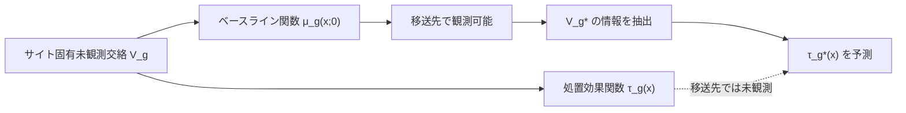

# 02. Transfer Estimates for Causal Effects across Heterogeneous Sites

[← index](index.md)

## 書誌情報

| 項目 | 内容 |
|------|------|
| タイトル | Transfer Estimates for Causal Effects across Heterogeneous Sites |
| 著者 | Konrad Menzel（単著） |
| arXiv 投稿 | 2023-05-02 (v1) / 2025-10-01 (v7) |
| 出版 | 未確認（arXiv abs ページに journal reference の記載を確認できず） |
| 分類 | econ.EM |
| ライセンス | CC BY 4.0 |
| リンク | [arXiv:2305.01435](https://arxiv.org/abs/2305.01435) / DOI: [10.48550/arXiv.2305.01435](https://doi.org/10.48550/arXiv.2305.01435) |

（著者・投稿日・改訂・分類は arXiv abs ページで確認済み。所属機関は未確認。査読誌掲載の有無は未確認。）

## 一言で言うと

処置を実施していない移送先について、**その土地のベースライン（処置前）データだけ**を手がかりに、他サイトの実験結果から条件付き処置効果を予測する枠組みである。鍵は、ベースラインの条件付き分布を「関数データ」として扱い、サイト固有の未観測交絡がアウトカムの平均水準だけでなく**観測属性との相互作用の形**にも現れることを利用する点にある。

## 問題設定

複数の実験サイトで得た処置効果の知見を、実験を行っていない新しい母集団へ適用したい。標準的な transportability の議論は「効果修飾因子の分布差を共変量で補正する」形を取るが、それはサイト間の差が**観測共変量の分布差のみ**に由来することを要求する。現実には、サイトごとに未観測の文脈（制度・文化・実施体制）が異なり、これがサイト固有交絡 $V_g$ として残る。

本論文の設定は次の通り。母集団は $G$ サイトからなり、サイト $g$ には $N_g$ ユニットがある。$G-1$ 個の実験サイトと、1 つの移送先サイト $g^*$ を区別する。ユニット $i$ の潜在アウトカムは

$$Y_{gi}(d) \equiv y(d; X_{gi}, U_{gi}, V_g), \quad d = 0, 1$$

と表現される。ここで $X_{gi}$ は観測属性、$U_{gi}$ は個人レベルの未観測異質性、$V_g$ は**サイト内の全ユニットが共有するサイト固有未観測交絡**である。実現アウトカムは $Y_{gi} = Y_{gi}(D_{gi})$。

中心的な着想は、$V_g$ が観測可能な痕跡を残すという点にある。すなわち、処置前アウトカムのサイト固有条件付き分布

$$\mu_g(x; 0) \equiv \mu(x; 0, V_g) := \mathbb{E}[Y_{gi}(0) \mid X_{gi} = x, V_g]$$

を**関数**として見れば、$V_g$ はこの関数の形状に反映される。論文の言葉では「未観測のサイト固有交絡は、アウトカムの平均水準だけでなく、それが観測されたユニット固有属性とどう相互作用するかにも一般に現れ得る」。ゆえにベースライン関数 $\mu_{g^*}(\cdot)$ を移送先について観測できれば、そこから $V_{g^*}$ の情報を読み取り、CATE の予測に使える。

## 手法

### 最適基底の構成（一般化固有値問題）

標準的な functional principal components（ベースライン関数の分散を最大に説明する基底）を使うのではなく、**処置効果の予測に最適な基底**を直接求める。ベースライン関数と処置効果関数の間の共分散カーネルに付随する積分作用素 $T_{\mu\mu}$、$T_{\mu\tau}$ を用いて、次の一般化固有値問題を解く。

$$T_{\mu\tau} T^*_{\mu\tau} \varphi^*_{ka} = \lambda_{ka} (T_{\mu\mu} + a \cdot \mathrm{Id}) \varphi^*_{ka}$$

ここで $a > 0$ は正則化パラメータである。分散説明ではなく**予測（$\mu$ から $\tau$ への写像）に効く方向**を選ぶため、$T_{\mu\tau}$ が目的関数に入る点が本質的である。

**定理 3.1**: 正則化解は概ね最適な IMSE を達成する。

$$\mathrm{IMSE}^*_K(a) \leq \mathrm{IMSE}^*_K + o(1) \quad (a \to 0)$$

### CATE の予測

最適基底 $\{\phi^*_{1a}, \dots, \phi^*_{Ka}\}$ が得られると、移送先の CATE 予測は次のように分解される。

$$\tau^*_{g^*K}(x) := \tau(x) + \sum_{k=1}^{K} t_{g^*k} \, \psi^*_{ka}(x)$$

第 1 項 $\tau(x)$ は全サイト共通の効果関数、第 2 項がサイト固有の補正である。係数 $t_{g^*k}$ は移送先のベースライン関数への射影で決まる。

$$t_{g^*k} := \frac{1+a}{1-a} \langle \mu_{g^*}, \varphi^*_{ka} \rangle$$

つまり **移送先について必要なのは $\mu_{g^*}$（ベースライン関数）だけ**であり、処置データは一切要らない。これが本論文の実務的な核心である。

### デザインベースの枠組み

固定母集団漸近（fixed-population asymptotics）を採る。$G$ サイトは固定と見なし、**どのサイトが実験サイトでどれが移送先になるかの割付をランダム**と見る。$g^*$ が $\{1, \dots, G\}$ から一様ランダムに抽出される「仮想的なプロトコル」の下で統計的性質を評価する。評価規準は

$$\mathrm{IMSE} := \frac{1}{G} \sum_{g=1}^{G} \mathbb{E}\left[(1 - R_g) \int (\hat\tau_{g,1\dots G}(x) - \tau_g(x))^2 f_0(x) \, dx\right]$$

（$R_g$ は実験サイト指示子。）

### 収束レート

密にサンプルされた場合（各サイト $n \to \infty$）、予備的ノンパラメトリック推定量のレートは

$$r_{Gn} = \frac{1}{G} + h^2 + \left(\frac{\log n}{G n h^d}\right)^{1/2}$$

$h$ はバンド幅、$d$ は共変量次元。**$1/G$ の項が残る**点が重要で、サイト内の標本をいくら増やしてもサイト数 $G$ が小さい限り消えない誤差が存在する。

### 主要な仮定

| 仮定 | 内容 |
|------|------|
| 3.1 非交絡割付 | $D_{gi} \perp\!\!\!\perp (Y_{gi}(0), Y_{gi}(1)) \mid X_{gi}, R_g = 1$。実験サイト内では RCT により満たされる |
| 3.2 非交絡ロケーション | 移送先 $g^*$ が潜在アウトカムと独立に $\{1,\dots,G\}$ から一様ランダムに抽出される。実験サイトと移送先が有限交換可能。論文自身が「事前の系統的なサイト選択バイアスを排除する理想化された観察プロトコル」と認めている |
| 3.3 サポート条件 | 傾向スコアが $\delta < p_g(x) < 1-\delta$、共変量密度比が $\delta < f_g(x)/f_0(x) < 1/\delta$ を全実験サイト・全 $x$ で満たす |
| 3.4 分布・モーメント | 条件付き平均関数と傾向スコアが $x$ について 2 回連続微分可能で導関数が一様有界。潜在アウトカムが $\mathbb{E}|Y_{gi}(d)|^s < \infty$（$s > 3$）を満たす |

## 実験・結果

条件付き現金給付（CCT）プログラムの 5 研究を統合。

| 項目 | 内容 |
|------|------|
| 対象国 | メキシコ、モロッコ、インドネシア、ケニア、エクアドル（5 研究） |
| 代表的研究 | PROGRESA/OPORTUNIDADES（メキシコ） |
| 解析単位 | 選択基準適用後、**640 サイト**のデータセット |
| アウトカム | 世帯への CCT が子どもの就学率に与える効果 |
| 交差検証による $K$ | 「as few as $K = 2$」を推奨（highly regularized estimator）。仕様によっては $K = 3$ |

主張されている知見は、「サイト間・研究間の変動を外挿に利用し、**ベースラインにおけるサイト異質性が、研究間の介入後の反応差および CATE の差を予測する**」ことである。

**未確認**: 移送による予測改善の具体的な数値比較（ベースライン手法比で MSE が何 % 改善したか等）は、取得できた HTML 全文の範囲では特定できなかった。「measurable advantages / 利得の定量化」という定性的記述までは確認したが、**具体的な数値は未確認**である。各研究のサンプルサイズ（世帯数・児童数）も未確認。

## 本課題への適用可能性

### 効く点

- **実績データゼロの新規施策に届く唯一の設計。** 本クラスタの他の論文が「過去施策群をどう統合するか」を扱うのに対し、本論文は「**まだ配信していない施策の対象層について、ターゲットリストの属性分布さえあれば効果を予測する**」ことを可能にする。配信前に期待リフトを見積もりたいという実務要求に直接対応する。
- **ベースライン関数が実務で手に入りやすい。** $\mu_{g^*}(x) = \mathbb{E}[Y(0) \mid X = x]$ は「クーポンを送らなかった場合の購買額の、属性ごとの条件付き期待値」であり、自社の通常購買ログから推定できる。移送先について処置データが不要という前提は、マーケティングでは他分野より遥かに満たしやすい。
- **「未観測交絡が属性との相互作用の形に現れる」という視点。** 施策ごとに季節・配信チャネル・競合状況が異なるが、これらは施策の平均購買水準をずらすだけでなく、「どの属性層がよく買うか」の形状も変える。本論文はまさにその形状変化から施策固有性を読み取る設計であり、施策間の系統差の捉え方として本課題に噛み合う。
- **予測に最適な基底を選ぶという設計思想。** ベースライン関数の分散が大きい方向（= 単に購買額の水準差）ではなく、処置効果の予測に効く方向を選ぶ。これは C2（施策埋め込み）の設計指針として示唆的で、「施策を特徴づける埋め込みは、施策間の見た目の違いではなくリフトの違いを説明する方向に取るべき」という原則を与える。
- **5 研究・640 サイトという構成の読み替え。** 「研究」を大きな施策プログラム、「サイト」を配信セグメント／地域／店舗と読み替えれば、施策数が少なくてもサイト数を稼げる構造がある。本課題でも、1 施策を配信セグメント単位に分解すれば $G$ を増やせる可能性がある。

### 効かない/リスク点

- **仮定 3.2（非交絡ロケーション）が本課題で最も危うい。** 移送先が潜在アウトカムと独立に一様ランダムに選ばれる、という仮定である。しかしマーケティングの施策ターゲティングは**その正反対**で、「反応しそうな層を狙って選ぶ」。ターゲット選定が期待効果に基づいて行われている限り、この仮定は構造的に破れる。論文自身が「理想化された観察プロトコル」と認めている箇所であり、**本課題への適用における最大の障害**である。
- **$1/G$ 項が消えない。** 収束レート $r_{Gn} = 1/G + h^2 + (\log n / (G n h^d))^{1/2}$ の第 1 項は、サイト数 $G$ が小さい限りサイト内標本をいくら増やしても残る。施策数（あるいはサイト数）が一桁なら、この項が誤差を支配する。**「1 施策あたりのデータを増やす」方向では解決しない**ことを明示している点は正直だが、本課題の制約（低頻度＝ $G$ が小さい）に対しては厳しい。実証で 640 サイトを使っていることの裏返しでもある。
- **実証規模が本課題と桁違い。** 「5 研究からの移送」は gather 段階の記述だが、実際の解析単位は **640 サイト**である。$G = 640$ で機能する手法が $G = 8$（数年分の施策）で機能する保証はない。gather の「5 サイトという少数からの移送で利得を実証」という記述は、解析単位を取り違えている可能性が高く、本レポートで訂正しておく。
- **関数データ解析の実装コストが高い。** 積分作用素の一般化固有値問題、正則化パラメータ $a$ の選択、基底数 $K$ の交差検証と、実装難度は本クラスタ中で最も高い。econ.EM の理論論文であり、既製の実装パッケージは未確認。#01 の「causal forest + 施策指示変数」が数行で試せるのと対照的である。
- **サポート条件 3.3 が施策間で満たされにくい。** 共変量密度比が全サイトで有界（$\delta < f_g(x)/f_0(x) < 1/\delta$）という条件は、施策ごとに意図的に異なるセグメントを狙う本課題では破れやすい。ある施策が高 RFM 層のみ、別の施策が休眠層のみ、という配信設計だと密度比が発散する。
- **二値処置・単一アウトカムの枠組み。** クーポン額という連続処置強度、複数 KPI という構造は直接は扱われていない。
- **ベースライン関数の推定誤差が伝播する。** $t_{g^*k} = \frac{1+a}{1-a}\langle \mu_{g^*}, \varphi^*_{ka}\rangle$ は $\mu_{g^*}$ の推定に依存する。移送先セグメントの標本が小さければ $\hat\mu_{g^*}$ 自体が不安定で、射影係数も不安定になる。

## 実装ステップ

1. **サイト単位を定義して $G$ を稼ぐ。** 施策そのものを 1 サイトとすると $G$ が一桁で $1/G$ 項に殺される。施策 × 配信セグメント、施策 × 地域、施策 × 週次コホートなど、意味のある分割で $G$ を数十以上に増やせるかを検討する。**これができないなら本手法は見送るべき**である。
2. **仮定 3.2 の破れ方を正直に評価する。** 過去の施策でターゲット選定に使ったルール（スコア閾値等）を洗い出し、選定が期待効果と相関しているかを確認する。相関が強い場合、移送先の選ばれ方をモデル化するか、選定ルールを共変量として明示的に条件付ける必要がある。ここを飛ばすと結果は信用できない。
3. **ベースライン関数 $\hat\mu_g(x; 0)$ を全サイトで推定する。** 各サイトのコントロール群（ホールドアウト）または非配信期間のログから、属性 $x$ 条件付きの購買額期待値を推定する。これが本手法の入力データそのものである。
4. **サポート条件を診断する。** サイト間で共変量密度比が発散していないかを確認する。発散するサイトペアがあれば、共変量を粗くする（連続変数をビン化する）か、そのサイトを除外する。
5. **共通効果関数 $\hat\tau(x)$ を推定する。** 実験サイト（ホールドアウトあり施策）をプールして、全サイト共通の CATE を推定する。#01 の手法群がそのまま使える。ここまでは #01 の枠内で完結する。
6. **共分散カーネルを推定し、一般化固有値問題を解く。** $\hat T_{\mu\mu}$、$\hat T_{\mu\tau}$ をサイト横断の経験共分散から構成し、$T_{\mu\tau}T^*_{\mu\tau}\varphi = \lambda(T_{\mu\mu} + a\,\mathrm{Id})\varphi$ を解く。正則化 $a$ は交差検証で選ぶ。実装は自前になる見込み。
7. **$K$ を交差検証で選ぶ。** 論文の実証では $K = 2$–$3$ という強い正則化が選ばれた。本課題でも $K$ は小さく出ると予想すべきで、$K = 1$ に潰れるなら「施策固有の補正は効かない」という結論として受け取り、#01 の枠組みに戻る。
8. **leave-one-site-out で移送性能を検証する。** 各サイトを順に移送先と見なし、他サイトから予測した CATE と実測 CATE を比較する。共通効果 $\hat\tau(x)$ のみを使った予測（$K=0$ に相当）をベースラインとし、**サイト固有補正が実際に MSE を下げるか**を確認する。この検証で改善が出なければ導入しない。
9. **新規施策への適用。** 配信前のターゲットリストについて $\hat\mu_{g^*}$ を推定し、$t_{g^*k}$ を計算して $\hat\tau_{g^*}(x)$ を得る。予測区間を必ず併記し、点推定単独では使わない。

## 関連リソース

- [arXiv:2305.01435](https://arxiv.org/abs/2305.01435) — 本論文（v7 が最新）
- [arXiv HTML v7](https://arxiv.org/html/2305.01435v7) — 全文 HTML
- [01. Comparison of Methods that Combine Multiple Randomized Trials](01-comparison-of-methods-that-combine-multiple-randomized-trials.md) — 本論文の第 1 項 $\tau(x)$（共通効果関数）の推定に使える手法群
- [03. BHARP](03-bayesian-hierarchical-adjustable-random-partition.md) — サイト固有性を連続的な基底展開で表す本論文に対し、離散的なクラスタで表す対照的アプローチ
- [04. Calibrated Mixtures of g-Priors for IPD-MA](04-bayesian-hierarchical-models-with-calibrated-mixtures-of-g-priors.md) — サイト数が少ない場合の縮小設計として補完的
- gather #14 Transporting Experimental Results with Entropy Balancing（[arXiv:2002.07899](https://arxiv.org/abs/2002.07899)） — 同じ移送問題を、観測共変量の分布差の補正のみで解く軽量版。本論文の前段ベースラインとして適する
- gather #03 A Review of Generalizability and Transportability（[arXiv:2102.11904](https://arxiv.org/abs/2102.11904)） — 本論文の仮定 3.2 が transportability 文献のどこに位置するかを把握するための語彙
- 同一クラスタの gather リスト: [resources-data-fusion.md](../../../gather/20260715/c1/resources-data-fusion.md)
