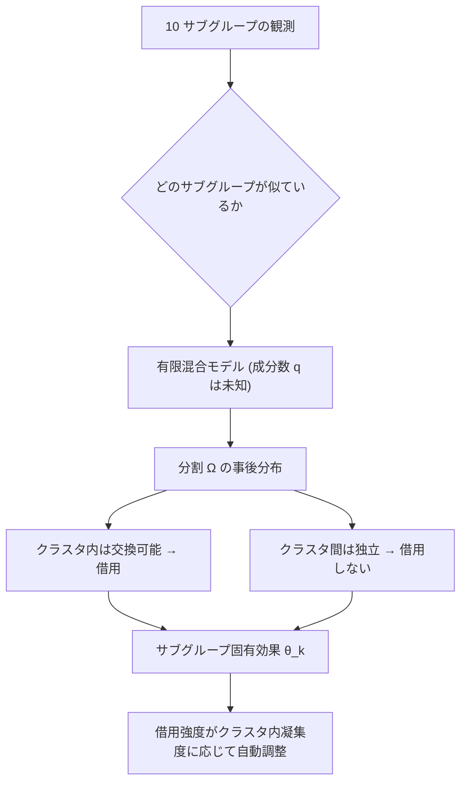

# 03. Identifying Treatment Effect Heterogeneity with Bayesian Hierarchical Adjustable Random Partition in Adaptive Enrichment Trials

[← index](index.md)

## 書誌情報

| 項目 | 内容 |
|------|------|
| タイトル | Identifying Treatment Effect Heterogeneity with Bayesian Hierarchical Adjustable Random Partition in Adaptive Enrichment Trials |
| 著者 | Xianglin Zhao, Shirin Golchi, Jean-Philippe Gouin, Kaberi Dasgupta |
| arXiv 投稿 | 2025-08-22 / 改訂 2026-03-04 (v2) |
| 出版 | 未確認（arXiv abs ページに journal reference の記載を確認できず） |
| 分類 | stat.ME, stat.AP |
| リンク | [arXiv:2508.16523](https://arxiv.org/abs/2508.16523) / DOI: [10.48550/arXiv.2508.16523](https://doi.org/10.48550/arXiv.2508.16523) |

（gather 段階ではタイトルを "Identifying Treatment Effect Heterogeneity with Bayesian Hierarchical Adjustable Random Partition (BHARP)" と記載していたが、実際のタイトルには **"in Adaptive Enrichment Trials"** が付く。本論文は汎用の HTE 手法ではなく、**adaptive enrichment trial という逐次的な試験デザインの文脈に設計された**手法である。この差は適用可能性の評価に効くため、以下で明示的に扱う。）

## 一言で言うと

「どのサブグループ同士をまとめて情報を借りるか」という分割そのものを未知パラメータとし、成分数不明の有限混合モデルで分割空間を探索することで、**借用強度をクラスタ内凝集度に応じて自動調整する**階層ベイズモデルである。手動キャリブレーションを要さず、完全交換可能性による over-shrinkage を回避する。

## 問題設定

処置効果の異質性（TEH）とは、処置効果がサブグループ間で系統的に変動することを指す。階層ベイズモデル（BHM）は全サブグループ間で情報を借用するため、反応が似ている場合は検出力を大きく改善する。しかし**完全交換可能性を課すため、真に異質なサブグループの固有効果を過度に縮小してしまう**。

論文はこの問題領域の既存手法を三つの欠点で整理する。既存の分割ベース手法は、(1) 補助的な解析（auxiliary analysis）に依存する、(2) モデル不確実性を無視する、(3) 借用強度が硬直的（inflexible borrowing strength）である。

BHARP はこれらに対し、**自己完結的（self-contained）な枠組み**として、分割・サブグループ固有効果・異質性パターンを同時に推定する。

## 手法

### 尤度と混合構造

連続アウトカムを $K$ 個の事前定義サブグループについて仮定する。

$$\boldsymbol{Y}_k \sim N(\theta_k, \varsigma^{-1}), \quad k = 1, 2, \dots, K$$

平均反応 $\theta_k$ は、成分数 $q \in \{1, \dots, K\}$ が**未知**である有限混合モデルから生成される。

$$\theta_k \mid \boldsymbol{\mu}, \boldsymbol{\sigma}, z_k \sim N(\mu_{z_k}, \sigma_{z_k})$$

割当ベクトル $\boldsymbol{z} = (z_1, \dots, z_K)$ が成分メンバーシップを示す。

$$\boldsymbol{z} \mid q, \boldsymbol{w} \sim \mathrm{Multinomial}(q; \boldsymbol{w})$$

これが分割 $\boldsymbol{\Omega} = \{\Omega_t : \Omega_t = \{k : z_k = t\}, \Omega_t \neq \emptyset\}$ を誘導する（クラスタは互いに排他的かつ網羅的）。

### 事前分布

| 対象 | 事前分布 |
|------|---------|
| 成分数 | $P(q) \propto q^\alpha$、$\alpha = 2$ が推奨 |
| 成分重み | $\boldsymbol{w} \mid q \sim \mathrm{Dirichlet}(1, \dots, 1)$ |
| セルレベル精度 | $\varsigma \sim \mathrm{Gam}(a_{\text{cell}}, b_{\text{cell}})$ |
| 成分間 | $\tau \sim \mathrm{Gam}(a_{\text{between}}, b_{\text{between}})$、$\mu_t \mid \tau \sim N(0, \tau^{-1})$ |
| 成分内 | $\sigma_t \sim \mathrm{InvGam}(a_{\text{within}}, b_{\text{within}})$ |

$P(q) \propto q^\alpha$ という成分数の事前分布は、$\alpha = 2$ のとき成分数が多い方に重みを置く形だが、データが均質なら事後は $q = 1$ へ縮小する。論文は「$q=1$ への縮小を可能にする柔軟な事前分布が、均質シナリオで BLAST 比の精度・精密性の改善をもたらす」と述べる。

### 借用メカニズム

情報借用は**主に分割構造を通じて**起こる。同一クラスタ内のサブグループは交換可能として扱われ、プールされた推定が可能になる。成分内分散 $\sigma_t$ が過度な縮小を防ぎつつクラスタ凝集度を保つ。論文は事前分布設計の要件として「成分平均 $\boldsymbol{\mu}$ は成分内分散 $\boldsymbol{\sigma}$ に対して十分に分離されているべき」と指定する。

ここが BHM との本質的な差である。BHM は全 $K$ サブグループに単一の $N(0, \tau^{-1})$ を課す（= 常に $q=1$ を強制）のに対し、BHARP は $q$ を推定するため、**データが異質なら自動的に $q > 1$ となりクラスタをまたぐ借用が切れる**。

### reversible-jump MCMC

split-merge 枠組み（Nobile & Green, 2000）に従うカスタム rjMCMC を用いる。

1. **モデル内更新（within-model）**: 全パラメータを完全条件付き分布から Gibbs サンプリング
2. **モデル間更新（between-model）**: 次元をまたぐ提案（split または merge）を、詳細釣り合いを保つ受容確率で受容
   - **split move**: ランダムに選んだ成分から新成分を生成しパラメータリストに追加
   - **merge move**: 最後の成分を、ランダムに選んだ成分へ吸収

論文は「受容確率は、尤度比と事前分布比、前向き・後ろ向きの提案確率、および変換のヤコビアンに依存する」と述べる。実装は Rcpp 経由の C++ で、次元可変のサンプリングを効率的に行う。

## 実験・結果

### シミュレーション設計

| 項目 | 設定 |
|------|------|
| シナリオ数 | 12（Table 1）: 異質性なし(A)、疎な強シグナル(C)、均衡/不均衡クラスタ(E, H)、クラスタ内変動(B, D, F)、稀な小サブグループ(G, J)、多クラスタ構成(K, L) |
| サブグループ数 | 全シナリオで 10 |
| サブグループあたり標本 | 35–70（境界サブグループは 20 に減） |
| アウトカム生成 | $N(\theta_k, 1)$ |
| 評価指標 | RMSE、平均 IQR、$q$ の事後モードの分布、平均 co-clustering 確率、収束診断 |

比較対象:

| 略称 | 内容 |
|------|------|
| IND | 独立モデル。$\theta_k \sim N(0, 10)$。借用なしのベースライン |
| BHM | 標準的階層ベイズ。$\theta_k \sim N(0, \tau^{-1})$、完全交換可能性 |
| BLAST | 成分数 $q$ を $\{1,2,3\}$ から DIC で選ぶ固定 $q$ の有限混合 |
| BART | Bayesian additive regression trees |

### 主要結果

- **成分数の回復**: BHARP の $q$ の事後モードが真のクラスタ数と高頻度で一致（Table 2）。各シナリオで、モードの $q$ が真の構造に一致する確率は **0.97–1.00**。
- **推定精度**: BHARP は比較手法に対して同等または優位な RMSE を達成。均質シナリオでは「BHARP の柔軟な事前分布が $q=1$ への縮小を可能にし、BLAST 比で精度・精密性が改善」。
- **計算効率**: 「BHARP は 500 個のシミュレーションデータセットの解析に最大 2.0 分。BLAST は約 15.5 分で、一桁の増加」。

### 実データ適用（Partner Step T2D）

2 型糖尿病患者のダイアド（二人組）における歩数増加の行動介入を評価した実在の Partner Step T2D 研究に**着想を得た仮想的な adaptive enrichment シナリオ**である（実データそのものの再解析ではない点に注意）。

| 項目 | 設定 |
|------|------|
| アーム | 3 つ: (1) 歩数計のみ、(2) 目標設定＋行動コーチング、(3) 強化コーチング |
| サブグループ | 6 つ: 夫婦関係の質（低/中/高） × 体重一致（無/有）のクロス |
| 中間解析 | 累積 1,200 / 1,500 / 1,800、最終 2,100 |
| 決定閾値 | $x_F = 0.15$（無効中止）、$x_E = 0.5$（有効）、$P_F = 0.50$、$P_E = 0.95$ |

真の効果パターン（Table 3）: アーム 1 は均質な弱効果（全 $\theta_{ik} = 0.10$）、アーム 2 は夫婦関係の質に沿った勾配効果（$\theta_{ik}$ が 0.10–0.73）、アーム 3 は体重一致カップルでより強い効果（$\theta_{ik}$ が 0.60–1.25）。

適応的決定ルール:
- **enrichment**: $P(\theta_{ik} \leq x_F \mid \mathcal{D}_\ell) > P_{\ell,F}$ ならアーム $i$ のサブグループ $k$ を停止
- **efficacy**: $P(\theta_{ik} > x_E \mid \mathcal{D}_\ell) > P_{\ell,E}$ なら成功と結論

主要結果（Table 4）:

| 指標 | BHARP | BHM | IND |
|------|-------|-----|-----|
| Global false positive rate | 0.02 | 0.02 | 0.02 |
| Generalized power（アームレベル） | 0.94 | 0.98 | 1.00 |
| **Generalized power（サブグループレベル）** | **0.44** | 0.18 | 0.20 |
| 期待標本配分 アーム 1 | 478 | 515 | 519 |
| 期待標本配分 アーム 2 | 892 | 773 | 770 |
| 期待標本配分 アーム 3 | 730 | 810 | 810 |

論文は「BHARP のサブグループレベルの generalized power は 0.44 に達し、BHM と IND の 2 倍以上」と強調する。分割の回復についても「3 アームすべてで真の TEH 構造を回復」（アーム 1 は単一クラスタ、アーム 2 は 3 つの交差ペアクラスタ、アーム 3 は 2 つの大きなクラスタ）。

なお **アームレベルの power では BHARP (0.94) が BHM (0.98) / IND (1.00) に劣る**点は正直に読むべきトレードオフである。サブグループ解像度を得る代わりにアームレベルの検出力をわずかに払っている。

## 本課題への適用可能性

### 効く点

- **「どの施策同士をプールしてよいか」に正面から答える。** 本課題の中核の問い（似た施策のグルーピング）を、事前の手作業や補助解析ではなく事後分布として扱う。分割が未知パラメータであるため、**分割の不確実性そのものが推定に織り込まれる**。「訴求が似ているから同じグループだろう」という人間の直観を、データに検証させられる。
- **over-shrinkage の回避が明示的な設計目標。** 訴求内容もクーポン額も異なる施策群を無条件に交換可能と見なすと、個別施策の推定が歪む。BHARP はクラスタ内凝集度で借用強度を決めるため、異質な施策は自動的に別クラスタへ分離され借用が切れる。
- **手動キャリブレーション不要という運用上の利点。** 施策が増えるたびに借用強度を再チューニングする運用負荷を避けられる。低頻度施策の運用（数ヶ月に 1 回、そのたびにモデル更新）と相性が良い。
- **サブグループあたり 35–70 という極小標本で機能している。** シミュレーションのサブグループ標本は 35–70 と非常に小さい。**本課題の「1 施策あたりのデータが薄い」という制約と同じオーダー**で手法が検証されている点は、本クラスタ中で最も心強い。
- **サブグループレベルの検出力が 2 倍以上。** 0.44 vs 0.18/0.20 という差は、「施策別・セグメント別の効果を検出したい」という実務要求に直接効く。プールしないと何も見えない（IND 0.20）、全部プールしても見えない（BHM 0.18）、適応的に借りると見える（BHARP 0.44）という構図。
- **計算コストが軽い。** 500 データセットで最大 2.0 分。施策数が一桁〜十数本の規模なら、rjMCMC でも実務時間内に回る。
- **多段階の階層設計への示唆。** 「施策 → 施策カテゴリ（クーポン額帯・訴求タイプ）→ 全体」という多段階構造を、カテゴリを人間が決める代わりにデータに決めさせる形になる。

### 効かない/リスク点

- **adaptive enrichment trial というデザインが前提。** タイトルが示す通り、本手法は**中間解析で無効なサブグループを逐次的に落とし、標本配分を動的に変える**試験デザインのために設計されている。実データ適用の評価指標（generalized power、期待標本配分、futility/efficacy 閾値）はすべてこのデザイン固有である。本課題は「過去に実施済みの施策群を事後的に統合する」設定であり、**逐次的な標本配分の最適化という本手法の主要な価値の一部は使えない**。使えるのは分割推定と借用の部分に限られる。
- **サブグループは事前定義されている。** モデルは $K$ 個の**既知の**サブグループを入力とし、それらのクラスタリングを学習する。共変量から自動的にサブグループを発見するわけではない。本課題では「施策」を $K$ 個のサブグループとするのが自然だが、その場合**施策内のユーザー異質性（CATE の $x$ 依存）は表現されない**。$\theta_k$ は施策 $k$ の単一の平均効果でしかない。#01 が扱う CATE の関数形の問題は本手法の射程外である。これは本手法の最大の限界で、本課題が「異質処置効果」を求める以上、BHARP 単独では不十分である。
- **共変量が入らない定式化。** $\boldsymbol{Y}_k \sim N(\theta_k, \varsigma^{-1})$ という尤度には共変量 $x$ が現れない。ユーザー属性による効果修飾を扱うには拡張が必要で、そのままでは「施策別平均リフトの縮小推定」にしかならない。施策 × セグメントのセルを $K$ 個のサブグループとして定義すれば部分的に回避できるが、セルが増えると各セルの標本がさらに薄くなる。
- **連続アウトカムの正規尤度。** 購買額はゼロ過剰かつ強い右裾を持ち、正規尤度は不適合。購買率なら二項尤度が要る。尤度の差し替えは原理的には可能だが、rjMCMC の受容確率とヤコビアンの導出を自分でやり直すことになる。
- **クーポン額という連続処置強度が扱われていない。** アームは離散（3 アーム）。クーポン額を額水準ごとのアームとみなす近似はできるが、額の連続性（500 円と 600 円は近い）は表現されない。
- **成分平均の分離要件。** 「成分平均は成分内分散に対して十分に分離されているべき」という事前分布設計の要件は、施策効果が連続的に少しずつ違う（クラスタ構造ではなくグラデーション）場合に、モデルの前提と現実がずれることを意味する。施策効果が本当に離散クラスタを成すかは自明でない。#02 の連続的な基底展開は、この点で対照的なモデル化である。
- **実データ適用が仮想シナリオ。** Partner Step T2D に「着想を得た」仮想的な adaptive enrichment シナリオであり、実データの再解析ではない。真の $\theta_{ik}$ が既知の設定での評価であるため、**実運用での性能は未確認**と見るべきである。
- **アームレベル power のトレードオフ。** BHARP 0.94 < BHM 0.98 < IND 1.00。サブグループ解像度と引き換えに、全体の検出力はわずかに落ちる。「施策全体が効いたか」だけを知りたいなら BHARP は不要である。
- **査読状況が未確認。** 2025 年投稿・2026 年改訂の新しいプレプリントで、出版の有無を確認できなかった。#01（Statistics in Medicine 出版済み）に比べると検証の蓄積が乏しい。

## 実装ステップ

1. **まず BHARP を適用する意味があるかを判定する。** #01 の causal forest + 施策指示変数で変数重要度を見て、施策 ID の重要度が低い（= 施策間異質性が小さい）なら BHM で十分であり、BHARP の複雑さは不要。施策 ID の重要度が高いときに初めて本手法へ進む。
2. **サブグループ $K$ の定義を決める。** 選択肢は 2 つ。(a) 施策そのものを $K$ 個のサブグループとする（施策別平均リフトのクラスタリング）、(b) 施策 × ユーザーセグメントのセルを $K$ 個とする（セグメント別まで見る）。(b) の方が本課題の要求に近いが、セルあたり標本が 35–70 を下回らないかを先に確認する。論文の検証範囲がその水準である。
3. **アウトカムを正規尤度に載る形へ変換する。** 購買額なら log1p 変換や、リフト率のような相対指標を使う。gather #12 の effect-measure transportability の論点（相対指標の方が施策間で移送しやすい）とここで接続する。変換後に $N(\theta_k, \varsigma^{-1})$ が妥当かを QQ プロット等で確認する。
4. **BHM と IND のベースラインを先に実装する。** BHARP の価値は「BHM より over-shrinkage が少なく、IND より借用が効く」という差分にある。両端を先に作らないと BHARP の利得を測れない。Stan や NumPyro で数十行で書ける。
5. **事前分布を設定する。** $P(q) \propto q^2$、$\boldsymbol{w} \mid q \sim \mathrm{Dirichlet}(1,\dots,1)$ から始める。$\varsigma$、$\tau$、$\sigma_t$ のハイパーパラメータは、施策効果の事前の想定スケール（リフト率なら数 % オーダー）に合わせる。**成分平均が成分内分散に対して分離される**という要件を意識して $\sigma_t$ の事前分布を絞る。
6. **rjMCMC を実装するか、著者実装を探す。** 論文は Rcpp/C++ 実装に言及するが、**公開リポジトリの有無は未確認**。split-merge の受容確率とヤコビアンの導出が必要なため、自前実装は重い。代替として、$q$ を固定して $\{1, \dots, K\}$ 全体で回し、周辺尤度や WAIC で重み付け平均する近似（BLAST に近いが $q$ の範囲を広げたもの）から始めるのが現実的である。
7. **シミュレーションで自社設定を再現する。** 施策数・施策あたり標本・想定される異質性パターン（均質／2 クラスタ／グラデーション）で人工データを作り、BHARP・BHM・IND の RMSE を比較する。**特にグラデーション型（クラスタ構造がない）で BHARP が破綻しないか**を確認する。論文の 12 シナリオはクラスタ構造を前提としており、ここは自分で確かめる必要がある。
8. **co-clustering 確率を運用指標として出す。** 「施策 A と施策 B が同じクラスタに入る事後確率」は、実務担当者に対して「この 2 つの施策は似ている／似ていない」を説明できる直感的な出力である。これ自体が施策設計の知見になる。
9. **過去施策で leave-one-out 検証する。** 1 施策を伏せて他施策から効果を予測し、実測と比較する。BHM・IND と比べて改善があるかを確認してから本番投入する。
10. **借用量を診断する。** gather #10（[arXiv:2509.17301](https://arxiv.org/html/2509.17301)）の borrowing of information の定量化指標を併用し、実際にどれだけ情報が借りられているかをブラックボックスにしない。

## 関連リソース

- [arXiv:2508.16523](https://arxiv.org/abs/2508.16523) — 本論文
- [arXiv HTML v2](https://arxiv.org/html/2508.16523v2) — 全文 HTML
- Nobile & Green (2000) — 本論文の rjMCMC が依拠する split-merge 枠組み（本レポートでは原典未確認、論文内の引用として記載）
- [01. Comparison of Methods that Combine Multiple Randomized Trials](01-comparison-of-methods-that-combine-multiple-randomized-trials.md) — 本手法が扱わない「共変量による CATE の関数形」を補完する。BHARP と #01 は直交する関心を持つため併用が要る
- [02. Transfer Estimates for Causal Effects across Heterogeneous Sites](02-transfer-estimates-for-causal-effects-across-heterogeneous-sites.md) — サイト固有性を離散クラスタで表す本論文に対し、連続的な基底展開で表す対照的アプローチ
- [04. Calibrated Mixtures of g-Priors for IPD-MA](04-bayesian-hierarchical-models-with-calibrated-mixtures-of-g-priors.md) — 借用強度を分割で調整する本論文に対し、g-prior の縮小係数で連続的に調整する対照的アプローチ
- gather #10 On Quantification of Borrowing of Information（[arXiv:2509.17301](https://arxiv.org/html/2509.17301)） — 本手法の借用が実際に効いているかを診断する指標
- gather #15 Testing Generalizability in Causal Inference（[arXiv:2411.03021](https://arxiv.org/abs/2411.03021)） — データ駆動の自動分割（本論文）とは別方向から、統合可否を明示的に事前検定するアプローチ
- 同一クラスタの gather リスト: [resources-data-fusion.md](../../../gather/20260715/c1/resources-data-fusion.md)
