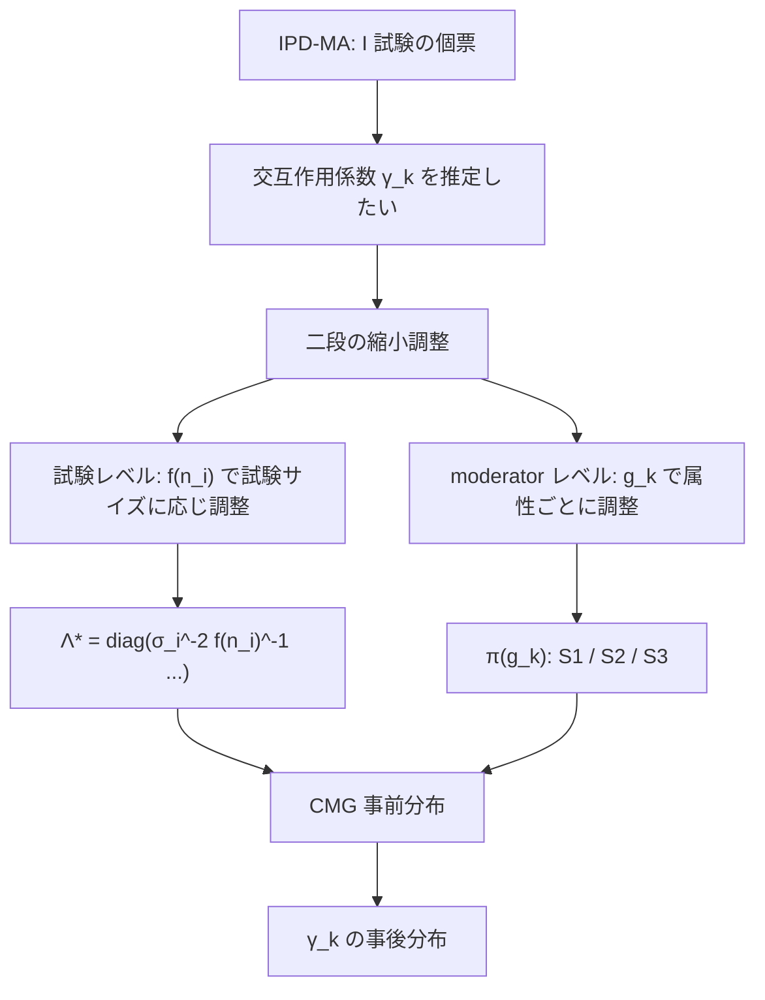

# 04. Bayesian Hierarchical Models with Calibrated Mixtures of g-Priors for Assessing Treatment Effect Moderation in Meta-Analysis

[← index](index.md)

## 書誌情報

| 項目 | 内容 |
|------|------|
| タイトル | Bayesian hierarchical models with calibrated mixtures of g-priors for assessing treatment effect moderation in meta-analysis |
| 著者 | Qiao Wang, Hwanhee Hong |
| arXiv 投稿 | 2024-10-31（v1） |
| 出版 | 未確認（arXiv abs ページに journal reference の記載を確認できず） |
| 分類 | stat.ME, stat.AP |
| リンク | [arXiv:2410.24194](https://arxiv.org/abs/2410.24194) / DOI: [10.48550/arXiv.2410.24194](https://doi.org/10.48550/arXiv.2410.24194) |

（著者・投稿日・分類は arXiv abs ページで確認済み。著者 Hwanhee Hong は [01. Brantner et al.](01-comparison-of-methods-that-combine-multiple-randomized-trials.md) の共著者でもあり、実データも同じ大うつ病 4 RCT を用いている。）

## 一言で言うと

個票データメタ分析（IPD-MA）で「どのユーザー属性が処置効果を修飾するか」を推定する際に、**試験のサンプルサイズに応じて縮小の強さを自動調整する g-prior の混合**を設計した論文である。試験間ばらつきが大きく、モデルが疎で、修飾効果が弱く、予測子が相関しているという「最悪の条件」で既存ベイズ手法を上回る。

## 問題設定

IPD-MA は複数試験の個人レベルデータを活用できる強力な枠組みだが、**試験間のばらつき（between-trial variability）が大きいと性能が劣化する**。特に関心があるのは処置と修飾因子の交互作用係数 $\boldsymbol{\gamma}$ の推定であり、これは (a) 通常は疎（少数の属性のみが真に修飾因子）、(b) 効果が弱い、(c) 予測子が相関している、という三重苦を抱える。

さらに実務上の非対称性として、**試験ごとにサンプルサイズが大きく異なる**。小さい試験の交互作用係数は情報が乏しいため強く縮小されるべきで、大きい試験は自身のデータを信じてよい。標準的な g-prior はこの区別を持たない。

## 手法

### 線形 IPD-MA モデル

$I$ 試験の個票データを統合する基礎モデルは次の通り。

$$y_{ij} = \mu + t_{ij}\alpha + \boldsymbol{x}_{ij}\boldsymbol{\beta} + \boldsymbol{x}_{ij}^{em}\boldsymbol{\gamma} + u_{\mu i} + t_{ij}u_{\alpha i} + \boldsymbol{x}_{ij}^{em}\boldsymbol{u}_i + \epsilon_{ij}$$

$i$ は試験、$j$ は個人。$t_{ij}$ は処置指示子、$\boldsymbol{x}_{ij}$ は共変量、$\boldsymbol{x}_{ij}^{em}$ は効果修飾因子（処置との交互作用項）。**$\boldsymbol{\gamma}$ が主たる関心対象**である処置 × 修飾因子の交互作用係数。$u_{\mu i}$、$u_{\alpha i}$、$\boldsymbol{u}_i$ が試験ごとのランダム効果で、試験間ばらつきを捉える。ランダム効果には half-Cauchy 事前分布が置かれる。

### g-prior の枠組み

標準的な g-prior は

$$\boldsymbol{\beta} \mid g, \sigma^2 \sim N_p(\boldsymbol{0}, g\sigma^2(\boldsymbol{X}'\boldsymbol{X})^{-1})$$

で、縮小係数（shrinkage factor）は $g/(1+g)$ となる。$g$ が小さいほど強くゼロへ縮小される。

### Naïve Mixtures of g-Priors (NMG)

$$\gamma_k \mid g_k, \boldsymbol{t}, \boldsymbol{x}_{[k]}, \boldsymbol{\Lambda} \sim N\left(0, \; g_k\left[(\boldsymbol{t} \circ \boldsymbol{x}_{[k]})' \boldsymbol{\Lambda} (\boldsymbol{t} \circ \boldsymbol{x}_{[k]})\right]^{-1}\right), \quad g_k > 0$$

$\boldsymbol{\Lambda}$ が試験固有の分散を考慮する。$\circ$ は要素ごとの積（処置と修飾因子の交互作用を作る）。

### Calibrated Mixtures of g-Priors (CMG) — 本論文の中核

鍵となる革新は $\boldsymbol{\Lambda}$ を $\boldsymbol{\Lambda}^\star$ に置き換える点である。

$$\boldsymbol{\Lambda}^\star = \mathrm{diag}\left(\sigma_1^{-2}f(n_1)^{-1}\boldsymbol{1}_{n_1}, \dots, \sigma_I^{-2}f(n_I)^{-1}\boldsymbol{1}_{n_I}\right)$$

ここに **サンプルサイズチューニング関数 $f(n_i)$** が入る。これにより、試験 $i$ の寄与が $f(n_i)$ を通じて調整される。

$f(n_i)$ の候補は 3 つ。

| 型 | 定義 |
|----|------|
| Linear | $f(n_i \mid p_i) = n_i p_i$, $\quad p_i \sim \mathrm{Uniform}(1/n_i, 1)$ |
| Logarithmic | $f(n_i \mid p_i) = \log(n_i p_i)$, $\quad p_i \sim \mathrm{Uniform}(1/n_i, 1)$ |
| Power | $f(n_i \mid p_i) = n_i^{p_i}$, $\quad p_i \sim \mathrm{Uniform}(0, 1)$ |

$p_i$ 自体に事前分布を置くことで、「サンプルサイズをどれだけ効かせるか」もデータから学習される。$p_i \to 0$ なら試験サイズを無視、$p_i \to 1$ なら full に効かせる、という連続的な補間になっている。

### 縮小のハイパー事前分布（moderator レベル）

$g_k$（修飾因子 $k$ ごとに独立）に置く事前分布が 3 種類。

$$\pi_{S_1}(g_k \mid b_k) = \frac{g_k}{(1+g_k)^{b_k+2}B(2, b_k)}, \quad b_k \leq 2$$

$$\pi_{S_2}(g_k) = \frac{1}{(1+g_k)^2} \quad (\text{Beta}(1,1))$$

$$\pi_{S_3}(g_k \mid b_k) = \frac{g_k^{b_k-1}}{(1+g_k)^{b_k+2}B(b_k, 2)}, \quad b_k \leq 2$$

$S_1$ / $S_2$ / $S_3$ は縮小係数 $g_k/(1+g_k)$ の事前分布の形状が異なり、論文の言葉では「保守的から楽観的まで」の視点を与える。**$g_k$ が修飾因子ごとに独立**である点が moderator-level shrinkage の実体で、真に修飾因子である属性は縮小が弱まり、そうでない属性は強く縮小される。

## 実験・結果

### シミュレーション設計

変動させた要因:

- 試験間ばらつきの高／低
- 修飾効果の疎／密（sparse / dense）
- 修飾因子の弱／強（weak / strong）
- 計画行列の相関の有無

比較手法:

| 群 | 内容 |
|----|------|
| Flat | 縮小なし |
| HS | Horseshoe |
| SSVS | Stochastic Search Variable Selection |
| NMG 系 | UIP, ZS, HG（$a=3,4$）, HGN（$a=3,4$） |
| **CMG 系** | S1/S2/S3 × n/log/pow の 9 通り、加えて CUIP, CZS |

### 主要結果

CMG 系は「効率とリスクの指標において優位な性能を示し、**とくに高い試験間ばらつき、高いモデル疎性、弱い修飾効果、相関した計画行列の下で**」既存手法を上回った。

**未確認**: 具体的な数値（効率・リスク指標の値、CMG と HS/SSVS の差の大きさ）は、取得できた HTML 全文の範囲では Section 3.3 のテーブルが truncate されており**特定できなかった**。また 9 通りの CMG 変種のうちどれが最良だったか（どの $f$ とどの $S$ の組み合わせを推奨するか）も**未確認**である。

### 実データ適用（大うつ病の 4 RCT）

| 項目 | 内容 |
|------|------|
| データ | 大うつ病性障害患者に対する 2 つの精神科治療を比較した 4 つの RCT |
| MCMC 設定 | 2 チェイン × 各 20,000 サンプル、burn-in として最初の 10,000 を破棄、10 個ごとに間引き（thinning） |

**未確認**: 個々の試験の識別子・試験ごとのサンプルサイズ・検討した修飾因子の一覧・どの修飾因子が有意だったかという結論は、取得できた範囲では Section 4 に参照されているものの詳細が得られず**未確認**である。ただし [01. Brantner et al.](01-comparison-of-methods-that-combine-multiple-randomized-trials.md) が同じ「大うつ病の 4 RCT（Duloxetine vs Vortioxetine）」を用いており、著者 Hwanhee Hong が共通することから、同一データの可能性が高い（**ただしこれは推測であり、本論文の記述としては未確認**）。

## 本課題への適用可能性

### 効く点

- **施策ごとのサンプルサイズ不揃いへの明示的な対処。** 本課題では施策の配信規模が施策ごとに大きく違う（大型キャンペーン 10 万通 vs テスト配信 5 千通）。$f(n_i)$ によるチューニング関数は、この構造に対する数少ない直接的な解答である。小さい施策ほど強く全体へ縮小される挙動は望ましく、かつ $p_i$ に事前分布を置くことで**縮小の効かせ方自体をデータから学習する**。手で重みを決めなくてよい。
- **moderator レベルの縮小が C2 への橋渡しになる。** $g_k$ が修飾因子ごとに独立であるため、「どのユーザー属性が施策効果を修飾するか」を施策をまたいで学習し、無関係な属性は自動的に落ちる。属性が多い（購買履歴由来の特徴量が数十〜数百）マーケティングデータで、変数選択を事前分布に埋め込める。
- **想定される困難条件が本課題と一致する。** 「高い試験間ばらつき・高い疎性・弱い修飾効果・相関した計画行列」という CMG が優位を示した条件は、そのままマーケティングデータの記述である。施策間のばらつきは大きく、真の修飾因子は少数で、リフトへの効果は弱く、RFM 系特徴量は互いに強く相関する。**この一致は本クラスタ中で最も良い**。
- **IPD-MA の前提条件が医療より自社データの方が良い。** 医療では個票データの入手が難所だが、自社マーケティングデータは個票が全て手元にある。集約統計量しか使えない古典的メタ分析より強力な選択肢を、前提を満たした状態で使える。
- **共変量が明示的に入る。** [03. BHARP](03-bayesian-hierarchical-adjustable-random-partition.md) が $\boldsymbol{Y}_k \sim N(\theta_k, \varsigma^{-1})$ と共変量なしの定式化だったのに対し、本論文は $\boldsymbol{x}_{ij}^{em}\boldsymbol{\gamma}$ として修飾因子を明示的にモデル化する。「セグメント別にどう効くか」を直接推定できる。
- **既存の線形モデル資産に乗る。** 定式化は線形混合モデルであり、Stan / brms / NumPyro で実装できる。事前分布を差し替えるだけなので、causal forest のような別系統のツールチェーンを導入せずに済む。

### 効かない/リスク点

- **線形・パラメトリックの制約。** モデルは $\boldsymbol{x}_{ij}^{em}\boldsymbol{\gamma}$ という**線形の交互作用**を仮定する。[01](01-comparison-of-methods-that-combine-multiple-randomized-trials.md) のシミュレーションで、IPD メタ分析は「関数形が正しく特定されている 1a（区分線形）では良好だが、1b（非線形）では notably worse」という結果が出ている。**修飾効果が非線形なら本手法は劣る**ことが、同じ著者グループの別論文で実証されている。この点は正直に受け止めるべきで、非線形性が疑われるなら #01 の causal forest 系と併用して確認する必要がある。
- **修飾因子を事前に指定する必要がある。** $\boldsymbol{x}_{ij}^{em}$ は分析者が選ぶ。$g_k$ による縮小は「指定した候補の中から選ぶ」ものであり、候補に入れなかった属性は発見されない。causal forest が自動で修飾因子を探すのとは性質が異なる。
- **試験数 $I = 4$ での実証。** 実データ適用は 4 試験。本課題の施策数が一桁なら整合するが、**ランダム効果の分散パラメータを 4 試験から推定するのは本質的に難しい**（half-Cauchy 事前分布を使っているのはそのため）。試験間ばらつき $\tau$ の事後分布が事前分布に強く依存し、結果が事前分布の選択に敏感になるリスクがある。感度分析が必須である。
- **数値結果が確認できていない。** シミュレーションの具体的な改善幅、9 通りの CMG 変種のどれを使うべきか、実データでの結論が未確認である。**「どの $f$ とどの $S$ を選ぶか」という実装上最も重要な判断について、論文から推奨を読み取れていない**。導入するなら原典（PDF）を精読して確定させる必要がある。
- **正規線形モデルのアウトカム前提。** $y_{ij}$ は連続アウトカムを前提とする。購買額のゼロ過剰・右裾、購買率の二値性には合わない。一般化線形混合モデルへの拡張は自然だが、g-prior の構成（$(\boldsymbol{X}'\boldsymbol{X})^{-1}$ に基づくスケーリング）は正規線形モデルの構造に依拠しているため、拡張は自明ではない。
- **クーポン額が二値処置の枠に収まらない。** $t_{ij}$ は処置指示子。クーポン額を連続処置として扱うには $t_{ij}$ を連続変数にする必要があり、そのとき $\boldsymbol{t} \circ \boldsymbol{x}_{[k]}$ のスケーリングと g-prior の解釈が変わる。
- **「どの施策をプールするか」は答えない。** 本手法は全試験を単一の階層構造に入れる（ランダム効果は全試験で交換可能）。[03. BHARP](03-bayesian-hierarchical-adjustable-random-partition.md) が指摘する over-shrinkage の問題は本手法にも当てはまる。訴求もクーポン額も全く違う施策を無条件に交換可能と見なす点は変わらず、$f(n_i)$ が調整するのは**サイズによる重み**であって**類似性による重み**ではない。この二つは別の問題である。
- **査読状況が未確認。** v1 のみ、2024 年 10 月投稿。出版の有無を確認できなかった。

## 実装ステップ

1. **原典 PDF を精読して未確認事項を埋める。** 特に (a) 推奨される $f$（linear / log / power）と $S$（S1/S2/S3）の組み合わせ、(b) シミュレーションでの改善幅、(c) 実データでの修飾因子の結論。本レポートで未確認とした部分であり、実装前に確定させる。
2. **修飾因子の候補 $\boldsymbol{x}^{em}$ を絞る。** ドメイン知識で「クーポン効果を修飾しそうな属性」を選ぶ（RFM、過去クーポン反応履歴、価格感応度の代理指標等）。$g_k$ が疎性を扱うとはいえ、候補が数百あると 4–10 試験では推定が破綻する。10–30 程度に絞る。
3. **アウトカムを正規線形モデルに載る形へ変換する。** 購買額なら log1p、あるいは gather #12 の論点に従って相対リフト指標を使う。変換後の残差正規性を確認する。
4. **まず flat prior（縮小なし）と horseshoe でベースラインを組む。** brms / Stan で $y_{ij} = \mu + t_{ij}\alpha + \boldsymbol{x}_{ij}\boldsymbol{\beta} + \boldsymbol{x}_{ij}^{em}\boldsymbol{\gamma} + (\text{random effects})$ を実装する。ここまでは標準的な階層モデルで、既存ライブラリで完結する。**CMG の利得はこのベースラインとの差分でしか測れない**。
5. **試験間ばらつきの事前分布に感度分析をかける。** 施策数が少ない以上、half-Cauchy のスケールパラメータの選択が結果を動かす。複数の設定で事後分布がどう変わるかを確認し、結論が事前分布に頑健かを見る。**ここで結論が不安定なら、施策数が足りないという事実を受け入れて手法選択を見直す。**
6. **CMG 事前分布を実装する。** $\boldsymbol{\Lambda}^\star = \mathrm{diag}(\sigma_i^{-2}f(n_i)^{-1}\boldsymbol{1}_{n_i})$ と $\pi(g_k)$ を Stan のカスタム事前分布として書く。$p_i \sim \mathrm{Uniform}$ の階層も入れる。標準ライブラリにはないため自前実装になる。
7. **MCMC 設定は論文に倣う。** 2 チェイン × 20,000 サンプル、burn-in 10,000、thinning 10。収束診断（$\hat{R}$、有効サンプルサイズ）を必ず確認する。
8. **自社設定のシミュレーションで CMG vs HS vs flat を比較する。** 施策数・施策あたり標本・サイズ不揃いの度合い・修飾因子の疎性を自社データに合わせて人工データを作る。**サイズ不揃いが極端な場合（10 万 vs 5 千）に $f(n_i)$ が実際に効くか**が最大の検証ポイントである。
9. **非線形性を #01 の causal forest でクロスチェックする。** causal forest で推定した CATE と、本モデルの線形交互作用による CATE を比較する。乖離が大きければ線形仮定が破れており、本手法の結論を割り引く。
10. **$g_k$ の事後分布を修飾因子の重要度として読む。** $g_k/(1+g_k)$（縮小係数）の事後分布は「属性 $k$ が真に修飾因子である度合い」として解釈でき、実務担当者への説明材料になる。

## 関連リソース

- [arXiv:2410.24194](https://arxiv.org/abs/2410.24194) — 本論文
- [arXiv HTML v1](https://arxiv.org/html/2410.24194v1) — 全文 HTML
- [01. Comparison of Methods that Combine Multiple Randomized Trials](01-comparison-of-methods-that-combine-multiple-randomized-trials.md) — **著者 Hwanhee Hong が共通、実データも同じ大うつ病 4 RCT**。#01 は IPD メタ分析が非線形 CATE で劣ることを示しており、本手法の限界を外側から検証している。必ず対で読む
- [03. BHARP](03-bayesian-hierarchical-adjustable-random-partition.md) — 借用強度をサイズ（本論文）ではなく類似性で調整する対照的アプローチ。両者は直交するため原理的には併用可能
- [02. Transfer Estimates for Causal Effects across Heterogeneous Sites](02-transfer-estimates-for-causal-effects-across-heterogeneous-sites.md) — 既存施策群の統合（本論文）に対し、新規施策への移送を扱う
- gather #10 On Quantification of Borrowing of Information（[arXiv:2509.17301](https://arxiv.org/html/2509.17301)） — 本手法の縮小が実際にどれだけ情報を借りているかを診断する
- gather #17 これが実務で効く階層ベイズ（[Qiita](https://qiita.com/Gotoubun_taiwan/items/6549859adba3fe879d2a)） — partial pooling の直観をチーム内で共有するための日本語入門
- 同一クラスタの gather リスト: [resources-data-fusion.md](../../../gather/20260715/c1/resources-data-fusion.md)
