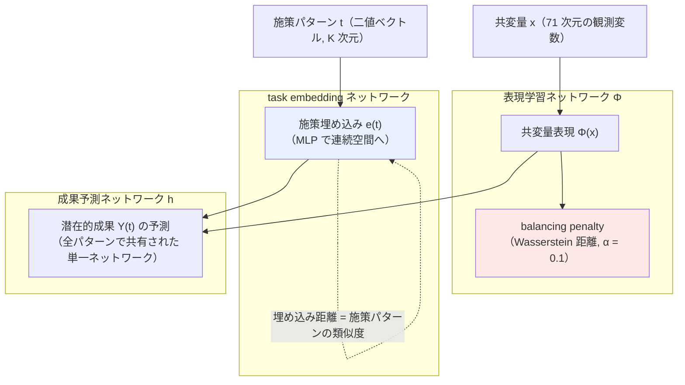

# 01. Multiple Treatments Causal Effects Estimation with Task Embeddings and Balanced Representation Learning (CISI-Net)

[← index](index.md)

## 書誌情報

| 項目 | 内容 |
|------|------|
| タイトル | Multiple Treatments Causal Effects Estimation with Task Embeddings and Balanced Representation Learning |
| 著者 | Yuki Murakami, Takumi Hattori, Kohsuke Kubota |
| 年 | 2025 |
| 会場 | arXiv preprint（stat.ME）。査読会場は未確認 |
| リンク | https://arxiv.org/abs/2511.09814 |
| arXiv ID | 2511.09814 |

## 一言で言うと

複数施策が同時に適用される状況で、施策の組み合わせ（二値ベクトル）を **task embedding** として連続空間へ埋め込み、類似した施策パターン間でパラメータを共有しながら、単独効果と交互作用効果を同時推定するフレームワークである。日本のモバイル決済プラットフォームの販促データで検証されている点が、本課題への近さを際立たせる。

## 問題設定

$K$ 個の二値施策があるとき、施策パターンは $2^K$ 通り存在する。素朴に「パターンごとに独立な outcome network」を組むと、パターン数の増加に対してパラメータが指数的に増え、各パターンに割り当てられるサンプルは指数的に減る。一方、VAE ベースの先行研究（TECE-VAE）は潜在変数の推定を伴い、その推定誤差が効果推定の精度を落とす。

CISI-Net はこの 2 つの弱点を同時に攻撃する。狙いは以下の 2 点の両立にある。

1. **関連する施策パターン間でのパラメータ共有** — 「クーポンのみ」と「クーポン + メール」は無関係な別ラベルではなく、共通成分を持つはずである。
2. **選択バイアスの緩和** — 過去の施策配信が無作為でない（特定セグメントに偏る）ため、施策パターン間で共変量分布が異なる。

前提として **ignorability（観測共変量で条件付ければ未観測交絡がない）** を置く。

## 手法

### 全体構成

3 つのネットワークからなる。

### 各要素

**task embedding ネットワーク**: 二値の施策ベクトル $t \in \{0,1\}^K$ を MLP により連続埋め込み $e(t)$ へ写す。類似した施策パターンが埋め込み空間上で近くに配置されることで、パターン間のパラメータ共有が実現される。ここが「単独効果に共通する成分」と「交互作用固有の寄与」を分離して符号化する中核である。

**表現学習ネットワーク**: 観測共変量 $x$ から表現 $\Phi(x)$ をノンパラメトリックに学習する。施策パターン間で表現分布の距離を縮める **balancing penalty** を課す。距離尺度には **Wasserstein 距離**（IPM の一種）を用い、係数は $\alpha = 0.1$ である。

**成果予測ネットワーク**: $\Phi(x)$ と $e(t)$ を結合し、**全施策パターンで共有された単一のネットワーク**で潜在的成果を予測する。パターンごとにヘッドを分けないことが、先行研究との決定的な差である。

### 損失関数

目的関数は 3 項からなる（概念形。厳密な数式表現は原文 PDF を要確認）。

$$
\mathcal{L} = \underbrace{\sum_i w_i \cdot \ell\big(y_i,\; h(\Phi(x_i), e(t_i))\big)}_{\text{施策頻度の逆数で重み付けした予測誤差}} + \underbrace{\alpha \cdot \mathrm{Wass}\big(\Phi\text{ の分布間距離}\big)}_{\text{balancing penalty}} + \underbrace{\lambda \|\theta\|_2^2}_{L2\ \text{正則化}}
$$

第 1 項の重み $w_i$ が**施策頻度の逆数**である点が実務上重要である。稀な施策パターンのサンプルが多数派パターンに埋没するのを防ぐ設計であり、施策ごとのサンプル数不均衡への直接の対処になっている。

## 実験・結果

### シミュレーション

$K = 3$ 施策、$N = 50{,}000$ サンプルで 3 シナリオ。

| シナリオ | 設定 | 狙い |
|---------|------|------|
| 1 | 真の共変量がすべて観測される | 基本性能 |
| 2 | 潜在共変量の proxy のみ観測 | TECE-VAE との差別化 |
| 3 | 交互作用効果が存在しない | 頑健性（過剰検出しないか） |

### 実データ

日本のモバイル決済プラットフォームの販促データ 2 種。

| データセット | 施策構成 | 共変量 | 成果変数 |
|------------|---------|-------|---------|
| Dataset 1 | 3 施策（単独 3 / 2 者組合せ 3 / 3 者組合せ 1） | 71 次元 | 標準化された決済金額 |
| Dataset 2 | 競合する 2 加盟店（単独 2 / 組合せ 1） | 71 次元 | 標準化された決済金額 |

### 比較対象と結果

**ベースライン**: TARNet, CFR-WASS, TECE-VAE, NCoRE

| 結果 | 内容 |
|------|------|
| 全シナリオ | CISI-Net が最小の絶対推定誤差を達成 |
| シナリオ 2（潜在共変量） | 潜在変数の推定を要さずに高い推定性能を維持（TECE-VAE との対比） |
| 実データの知見 | **同一加盟店内の販促組み合わせは相乗効果**、**加盟店をまたぐ販促はカニバリゼーション**を示した |

個別の数値（誤差の絶対値等）は取得したページからは未確認。

### 明示された限界

1. **サンプル数要件**: 小サンプルで性能が大きく劣化する。**交互作用効果の推定には $N \geq 10{,}000$ が必要**と報告されている。
2. **ハイパーパラメータ感度**: balancing penalty の係数 $\alpha$ が慎重な調整を要し、著者自身が「適応的に調整する機構の開発」を今後の課題としている。
3. **未観測交絡の不在を仮定**: ignorability に依存する。

## 本課題への適用可能性

### 効く点

- **ユーザーの中核アイデアに最も近い実装である**。「似た施策をグルーピングしてデータを実質的にプールする」という発想が、task embedding によるパラメータ共有としてそのまま実装されている。しかも埋め込み距離が「施策の類似度」のデータ駆動な定義を副産物として与えるため、手作業でのグルーピングが不要になる。
- **成果予測ネットワークが全パターンで共有される**設計は、施策ごとに独立モデルを立てる現状（＝施策あたりのデータが薄い元凶）への直接の処方箋である。
- **施策頻度の逆数による重み付け**は、大型施策が小型施策を数の力で埋没させる問題への対処であり、実務のログ構造に直接効く。
- **balancing penalty が必須である理由が明確**。過去の施策が特定セグメントへ偏って配信されている以上、これがないと施策間比較が交絡する。ユーザーのログはほぼ確実にこの構造を持つ。
- **実データがマーケティング販促、しかも日本のプラットフォーム**である。隣接分野からの類推ではなく、同一ドメインでの検証事例として説得力がある。カニバリゼーションの検出は実務的にも価値の高い出力である。

### 効かない/リスク点

- **サンプル数要件が本課題と正面衝突する**。著者自身が交互作用効果の推定に $N \geq 10{,}000$ を要すると述べ、シミュレーションは $N = 50{,}000$ で行われている。「数ヶ月に一度の施策」でこの規模のサンプルが施策あたり確保できるかは、適用可否の第一関門である。**ここが確保できないなら、本手法はそのままでは動かない**。
- **施策数 $K = 3$ での検証にとどまる**。ユーザーが想定する施策の多様性（クーポン額 × 文面 × チャネル）はこれより遥かに大きい組み合わせ空間になる。$K$ が増えたときの挙動は未検証である。
- **施策を「二値ベクトル（パターン）」として扱う定式化**であり、**クーポン額のような連続値を素直に扱えない**。額の水準ごとに別の二値フラグを立てるなら、額の連続性・順序性が失われる（レポート 03 の ACFR が批判する点そのもの）。連続処置への拡張は本論文の範囲外である。
- **訴求文面のようなテキストモダリティは扱っていない**。task embedding の入力は二値ベクトルであり、文面埋め込みをどう接続するかは自前の設計になる。
- **task embedding が施策 ID の代理になるリスク**が原理的に存在する。施策パターンが 7 通りしかないなら、埋め込みは実質的に 7 個のルックアップテーブルと変わらない。**レポート 06（One-hot news）の警告が直撃する構造**であり、本論文には ID ショートカットに対する検証（one-hot ベースラインとの比較）が見当たらない。これは本手法の適用にあたって自前で埋めるべき最大の穴である。
- **$\alpha$ の調整が難しい**という著者の告白は、施策数が少なくバリデーションデータも薄い本課題では、より深刻な問題になる。チューニングに使えるホールドアウトが確保できない可能性がある。

## 実装ステップ

1. **サンプル数の実地確認を最優先で行う**。施策パターンごとのサンプル数を集計し、$N \geq 10{,}000$ という論文の要件と照合する。ここで大きく下回るなら、本手法の交互作用推定は諦め、単独効果の推定に絞る判断を先に下す。
2. **施策パターンの定義を決める**。まず二値フラグ（チャネル・訴求タイプの有無）のみで $K$ を小さく保った定式化から始める。クーポン額は当初は代表水準の二値化で妥協し、連続化はレポート 03 の路線を後から接続する。
3. **共変量の整備**。論文は 71 次元の観測共変量を使っている。ユーザー属性・購買履歴から同程度の共変量を用意し、ignorability の仮定が現実的かをドメイン知識で吟味する。
4. **ベースラインを先に組む**。TARNet と、**施策 one-hot のみを入力とするモデル**を必ず含める。後者はレポート 06 の警告に対する検証装置であり、CISI-Net がこれを上回らないなら task embedding は機能していない。
5. **balancing penalty の有無で ablation** を行い、$\alpha \in \{0, 0.01, 0.1, 1\}$ を掃く。$\alpha = 0.1$ は論文の値であり、データ規模が違えば最適値は動く。
6. **leave-one-campaign-out で評価する**（レポート 06 参照）。ランダム分割の性能は ID ショートカットを見抜けないため、意思決定の根拠にしてはならない。
7. 交互作用の検出結果を、**カニバリゼーションの有無**というマーケター側が検証可能な形で提示し、ドメイン知識との整合を確認する。論文の実データ知見（同一加盟店内は相乗、加盟店間はカニバリ）が、そのまま解釈の妥当性チェックの型になる。

## 関連リソース

- **レポート 06（One-hot news）** — 本手法の task embedding が施策 ID の代理に堕していないかを検証する設計を与える。**本手法を実装する前に読むべき**。
- **レポート 03（ACFR）** — 連続処置の balancing。本論文の離散パターン前提の balancing と、クーポン額の連続性をどう両立させるかが統合の最難関。
- **レポート 04（CPA）** — 加法分解によるアーキテクチャの雛形。本論文の task embedding と設計思想が近く、比較対照になる。
- **TECE-VAE**（Multiple Treatment Effect Estimation using Deep Generative Model with Task Embedding, WWW 2019, https://dl.acm.org/doi/10.1145/3308558.3313744） — 本論文が批判的に参照する先行研究。task embedding の出自。
- **NCoRE**（https://arxiv.org/abs/2103.11175） — 本論文のベースラインの 1 つ。施策の組み合わせを扱う別路線。
- **CFR-WASS / TARNet**（Shalit et al.） — balancing representation の起点。本論文のベースライン。
