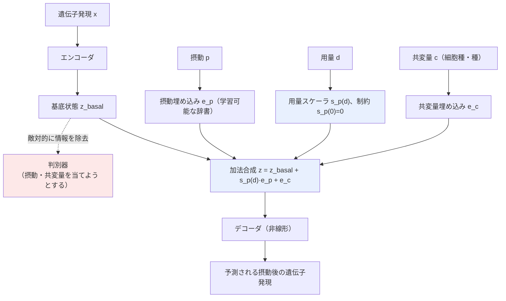

# 02. Predicting cellular responses to complex perturbations in high-throughput screens (CPA)

[← index](index.md)

## 書誌情報

| 項目 | 内容 |
|------|------|
| タイトル | Predicting cellular responses to complex perturbations in high-throughput screens |
| 著者 | Mohammad Lotfollahi, Anna Klimovskaia Susmelj, Carlo De Donno, Leon Hetzel, Yuge Ji, Ignacio L Ibarra, Sanjay R Srivatsan, Mohsen Naghipourfar, Riza M Daza, Beth Martin, Jay Shendure, Jose L McFaline-Figueroa, Pierre Boyeau, F Alexander Wolf, Nafissa Yakubova, Stephan Günnemann, Cole Trapnell, David Lopez-Paz, Fabian J Theis |
| 年 | 2023 |
| 会場 | Molecular Systems Biology |
| DOI | 10.15252/msb.202211517 |
| リンク | https://link.springer.com/article/10.15252/msb.202211517 |

## 一言で言うと

細胞の遺伝子発現を「**基底状態 + 摂動埋め込み + 共変量埋め込み**」の**加法的な潜在因子へ分解**するオートエンコーダであり、未観測の用量・細胞種・時点・種、さらには**未観測の薬剤組み合わせ**への応答を予測する。用量を埋め込みの**非線形スケーリング**として扱う設計と、化学構造表現の差し込みによる未観測薬剤への対応（chemCPA）が、本課題のアーキテクチャ雛形として最も価値が高い。

## 問題設定

単一細胞トランスクリプトミクスでは、薬剤・遺伝子摂動を多重化して大規模にスクリーニングできるようになった。しかし組み合わせ空間は爆発的で、すべての「薬剤 × 用量 × 細胞種 × 時点」を実験することは原理的に不可能である。そこで、観測済みの条件から**未観測の条件の応答を in silico で予測する**ことが求められる。

本課題との対応は以下の通りで、構造的にほぼ同型である。

| CPA 側 | 本課題側 |
|--------|---------|
| 細胞の基底状態の遺伝子発現 | 施策なしのベースライン購買傾向 |
| 薬剤・遺伝子摂動 | 施策（クーポン・訴求） |
| 用量（dose） | クーポン額 |
| 細胞種・種・患者 | ユーザー属性・セグメント |
| 未観測薬剤への応答予測 | 実績ゼロ施策の効果予測 |

## 手法

### 加法分解

CPA の中核は、観測された遺伝子発現を潜在空間で加法的に分解する点にある。

$$
z_{\text{perturbed}} = \underbrace{z_{\text{basal}}}_{\text{基底状態}} + \underbrace{\sum_{p} s_p(d_p)\cdot e_p}_{\text{摂動埋め込み（用量でスケール）}} + \underbrace{\sum_{c} e_c}_{\text{共変量埋め込み}}
$$

- **基底状態 $z_{\text{basal}}$**: エンコーダが抽出する、摂動・共変量から独立な細胞状態。
- **摂動埋め込み $e_p$**: 各薬剤・遺伝子摂動に対応する**学習可能なベクトル辞書**。
- **共変量埋め込み $e_c$**: 細胞種・種・患者といった離散因子ごとの学習可能ベクトル。

### 用量の扱い（本課題の核心）

用量は埋め込みを置き換えるのではなく、**埋め込みを非線形にスケールする**。連続的な用量値を受け取るニューラルネットワーク $s_p(\cdot)$ が、摂動ごとに独立な dose-response 曲線を実装する。制約として

$$
s_p(0) = 0
$$

を課す。用量ゼロなら摂動の寄与がゼロになるという自明な整合性が、構造として保証される。**用量をビンに切らず連続量のまま保つ**ため、未観測の用量への内挿・外挿が自然に成立する。

### 敵対的識別器による disentanglement

基底状態が摂動・共変量の情報を**一切含まない**ことを強制するため、判別器ネットワークがエンコーダと敵対的に学習する。判別器は $z_{\text{basal}}$ から摂動・共変量を当てようとし、エンコーダはそれを妨害する。これにより「基底状態」と「摂動の効果」が分離される。

### 損失

1. **再構成損失**: 予測遺伝子発現と観測値の Gaussian 負対数尤度。
2. **敵対的損失**: 判別器が基底状態から摂動・共変量を予測する交差エントロピー。
3. **統合目的**: エンコーダは「再構成損失 − スケールした敵対的損失」を最小化し、判別器は敵対的損失を最大化する。

### chemCPA（未観測薬剤への拡張）

摂動の**辞書**（薬剤ごとのルックアップ）を、**摂動ネットワーク**へ置き換える。

- **事前学習済み分子エンコーダ $G$**: 化学記述子・化学フィンガープリント・グラフエンコーダで薬剤構造を潜在埋め込みへ写す。**学習中は固定**。
- **摂動エンコーダ $M$**: 化学埋め込みから摂動の潜在効果へ写す。
- **用量スケーラ $S$**: 化学埋め込みと適用用量から実効用量へ写す。

学習で最適化されるのは $M$ と $S$ のみである。これにより、化学記述子さえあれば**訓練時に一度も見ていない薬剤**の応答が予測できる。**「化学構造 → 訴求文面の LLM 埋め込み」と読み替えれば、そのまま未観測施策の予測アーキテクチャになる**のが本課題への最大の含意である。

## 実験・結果

### データセット

| 名称 | 規模 | 摂動 | 詳細 |
|------|------|------|------|
| sci-Plex3 | 290,889 細胞 | 188 化合物 | 3 細胞株（A549, K562, MCF7）、4 用量 |
| ComboSci-Plex | 63,378 細胞 | 32 組み合わせ | A549 細胞、13 薬剤 |
| Perturb-seq | 108,000 細胞 | 105 遺伝子 | K562 細胞、284 条件、131 の二重摂動 |
| Sciplex2 | 未確認 | 4 薬剤 | A549 肺癌、dose-response |
| PBMC IFN-β | 未確認 | 二値刺激 | ループス検体、細胞種特異的 |
| Cross-species LPS | 未確認 | LPS 摂動 | マウス・ラット・ウサギ・ブタの食細胞 |

### 比較対象

訓練データからのランダムサンプリング、線形モデル、scGen（摂動予測の既存深層学習手法）。

### 主要な数値

| 設定 | 結果 |
|------|------|
| sci-Plex3、未観測の最高用量 | 平均遺伝子発現で scGen 比 **+1.54%**、分散予測で **+35.85%**、分布全体で **+65〜70%** の改善 |
| ComboSci-Plex、未観測の組み合わせ | Panobinostat + Alvespimycin で **$R^2 = 0.81$**（訓練事例なし） |
| Perturb-seq | 可能な組み合わせの **97.6%** にあたる 5,329 の未観測組み合わせを予測 |
| Perturb-seq、平均発現 | **線形ベースラインが同等の性能**。CPA の優位は線形が捉えない粒度にある |

### 未観測条件への汎化

- **未観測用量**: 全薬剤で 2 番目に高い用量を訓練から除外して検証。中間用量・高用量へ汎化した。ただし**内挿（中間用量）に比べ、外挿（最高用量）では性能が劣化する**。
- **未観測組み合わせ**: 予測性能は、訓練条件からのトランスクリプトーム的な非類似度と**逆相関**する。近いものは当たり、遠いものは外れる。
- **未観測薬剤（chemCPA）**: HDAC 阻害剤を訓練から完全に除外した場合、実行可能性は示されたが**用量事例が一切ない状態では性能が大きく低下する**。

### 明示された限界

1. **データ依存性**: テストデータが訓練分布と大きく異なると失敗する。距離ベースの不確実性指標は有用だが不完全。
2. **サンプル希少性**: **1 条件あたり 100 細胞未満**、または組み合わせ事例を欠く摂動では性能が劣化する。
3. **バイアスの増幅**: 訓練データが限られると、優勢効果（dominance effect）を予測しがちになる。
4. **遺伝子発現のみ**: 転写後修飾・シグナル伝達・細胞間コミュニケーションは捉えない。
5. **ハイパーパラメータ感度**: 全データセットで単一の固定アーキテクチャを使用。摂動数が多い場合は系統的な調整が必要。
6. **機構的理解の代替にならない**: 「CPA の予測は実験的検証を置き換えられない。あくまで指針として機能しうる」と明記されている。
7. **chemCPA の限界**: 訓練に**最低限の用量事例が必要**。単剤の観測を完全に除外すると性能が大幅に落ちる。

## 本課題への適用可能性

### 効く点

- **加法分解が本課題へ直接読み替え可能である**。「基底状態 + 摂動埋め込み + 共変量埋め込み」は「施策なしのベースライン購買 + 施策埋め込み + ユーザー属性埋め込み」へそのまま対応する。施策効果だけを構造的に取り出せるため、「施策を打たなかったらどうだったか」との差分＝ uplift が定義しやすい。
- **用量スケーリング $s_p(d)$、$s_p(0)=0$ の設計が、クーポン額の扱いに対する最も洗練された解**である。額をビンに切る必要がなく、未実施の額（例: 750 円）への内挿が構造として保証される。しかも $s_p(0)=0$ は「クーポンを配らなければ効果ゼロ」という自明な制約をアーキテクチャに焼き込むもので、データが薄いほどこの種の構造的制約が効く。
- **chemCPA の設計が、ゼロショット施策予測の最も具体的な実装パターン**である。分子エンコーダ $G$ を固定したまま $M$ と $S$ のみを学習する構成は、**LLM 文面埋め込みを固定し、その上の小さな写像だけを学習する**という設計へ直訳できる。施策数が数十本しかない本課題では、学習すべきパラメータを $M$・$S$ に絞れることの価値が極めて大きい。
- **敵対的 disentanglement によりベースライン購買傾向と施策効果が分離される**。ヘビーユーザーほど施策対象になりやすいという交絡構造に対し、基底状態から施策情報を除去する設計は原理的な対処になる。
- **未観測の組み合わせで $R^2 = 0.81$** という実績は、「クーポン額 A × 訴求文面 B」の未実施組み合わせ評価への期待を裏付ける。

### 効かない/リスク点

- **データ規模の差が壊滅的である**。sci-Plex3 は 290,889 細胞、Perturb-seq は 108,000 細胞。1 実験で数万〜数十万サンプルが取れる世界の手法である。**著者自身が「1 条件あたり 100 細胞未満で性能が劣化する」と述べている**が、本課題では 1 施策あたりのサンプルはそれより多くとも、**施策の本数（＝摂動の種類）が 188 化合物に対して数十本**という点が決定的に違う。埋め込み写像 $M$ を学習するのに必要なのは**サンプル数ではなく施策の多様性**であり、そこが桁で足りない。
- **「未観測薬剤の予測には最低限の用量事例が必要」という chemCPA の限界が、本課題の要求と正面衝突する**。完全に新しい訴求軸（過去に類例のない文面）に対しては、化学エンコーダに相当する LLM 埋め込みがあっても外挿できない可能性が高い。CPA が示したのは「**訓練分布の近傍への汎化**」であって、真の意味でのゼロショットではない。
- **性能が訓練条件からの非類似度と逆相関する**という報告は、本課題では特に厳しい。施策の特徴空間が数十点でしか被覆されていないなら、新規施策はほぼ確実に「訓練条件から遠い」領域に落ちる。
- **外挿より内挿が得意**という結果は、「未実施の 750 円クーポン（実施済み 500 円と 1000 円の間）」は当たるが、「未実施の 3000 円クーポン」は当たらないことを意味する。実務で知りたいのはしばしば後者である。
- **因果推論の枠組みではない**。CPA は生成モデル・予測モデルであり、交絡の調整（balancing / ignorability の議論）を明示的に行っていない。単一細胞実験は**実験的に介入が割り当てられる**（無作為化されている）ため交絡が問題にならないのに対し、**マーケティングログは施策側の意図的ターゲティングによる非無作為割当である**。この違いは決定的で、**CPA をそのまま持ち込むと交絡する**。レポート 01 の balancing penalty と組み合わせて初めて意思決定に使える。
- **線形ベースラインが平均発現で同等だった**という Perturb-seq の結果は率直に受け止めるべきである。深層モデルの優位は「線形が捉えない粒度」にあり、データが薄い本課題ではその粒度に到達する前に過学習する可能性が高い。
- 論文の限界 5（ハイパーパラメータ感度、摂動数が多い場合は系統的調整が必要）は、チューニング用のホールドアウトが薄い本課題ではより深刻である。

## 実装ステップ

1. **加法分解の骨格だけを最小構成で移植する**。$z = z_{\text{basal}}(x) + s(d)\cdot e_p + e_c$ の形で、ユーザー属性 $x$ からベースライン購買を、施策から施策埋め込みを作る。深層生成モデル全体（VAE 的な再構成）は不要で、**成果 $y$ の回帰として組む方が本課題のデータ量に合う**。
2. **用量スケーラ $s(d)$、$s(0)=0$ を最優先で実装する**。クーポン額の連続性を保つこの部分が、CPA から借りるべき最大の資産である。単調性の制約（額が増えれば効果も単調に増える）を追加することを検討する。ドメイン知識による制約はデータ不足を補う。
3. **施策埋め込みを「学習可能な辞書」で始め、次に「文面 LLM 埋め込み → 小さな MLP $M$」へ差し替える**。この 2 者の比較が、そのままレポート 06 が要求する ablation になる。**辞書版（＝実質 ID）が MLP 版と同等以上なら、施策特徴量は機能していない**。
4. **敵対的 disentanglement は後回しでよい**。実装が不安定になりやすく、まずは加法分解と用量スケーリングの効果を確認する。
5. **balancing を追加する**（レポート 01）。CPA には交絡調整がないため、そのままでは非無作為ターゲティングに耐えない。ここは CPA の外から持ち込む必要がある。
6. **訓練条件からの距離を不確実性指標として出力する**。CPA の「性能は非類似度と逆相関する」という知見をそのまま運用に組み込み、**新規施策が施策特徴空間のどこに落ちるかを可視化し、遠いものは予測を信用しない**という運用ルールを作る。これは本論文から得られる最も実務的な処方である。
7. **内挿と外挿を分けて評価する**。実施済みの額の間（内挿）と外（外挿）で性能を別々に報告する。CPA の結果はこの 2 つが大きく違うことを示している。

## 関連リソース

- **レポート 01（CISI-Net）** — CPA に欠けている交絡調整（balancing penalty）を供給する。両者の組み合わせが実務解になりうる。
- **レポート 06（One-hot news）** — CPA の摂動埋め込み「辞書」がまさに ID ルックアップである点を突く。同じ創薬分野からの反証であり、必ずセットで読む。
- **レポート 05（CaML）** — 未観測介入への汎化という問題設定。CPA が生成モデル側から、CaML がメタ学習側から同じ問題に迫る。
- **chemCPA**（CPA の化学構造拡張。本論文内で言及） — 未観測薬剤対応の中核。詳細は別論文を要確認。
- **GEARS**（https://www.nature.com/articles/s41587-023-01905-6） — 外部知識グラフから未観測摂動の表現を構成する路線。施策数が少ない本課題では CPA より現実的な可能性がある。
- **scGen** — 本論文のベースライン。
