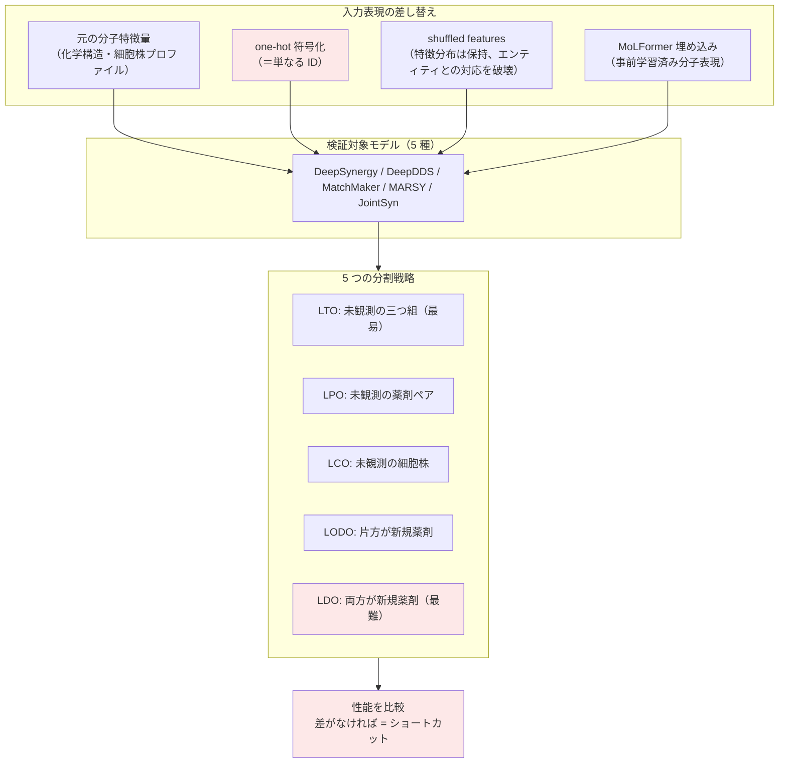

# 03. One-hot news: drug synergy models shortcut molecular features

[← index](index.md)

> **本クラスタで最も重要な文献である。** ユーザーの中核前提「施策を特徴ベクトルで表現すれば汎化する」に対する、実証的な反証を提示する。レポート 01・02 の実装に着手する前に読み、検証設計を先に固めるべきである。

## 書誌情報

| 項目 | 内容 |
|------|------|
| タイトル | One-hot news: drug synergy models shortcut molecular features |
| 著者 | Emine Beyza Çandır, Halil İbrahim Kuru, Magnus Rattray, A Ercüment Çiçek, Oznur Tastan |
| 年 | 2026 |
| 会場 | Bioinformatics, Volume 42, Issue 3 |
| DOI | 10.1093/bioinformatics/btag040 |
| リンク | https://academic.oup.com/bioinformatics/article/42/3/btag040/8440676 |

## 一言で言うと

薬剤の分子特徴量（化学構造）を **one-hot 符号化（＝単なる ID）に置き換えても性能が変わらない、むしろ僅かに向上する**ことを、5 つの主要な薬剤相乗効果予測モデルで実証した批判的検証論文である。モデルは分子特徴を「生化学的情報」としてではなく「**識別子**」として使い、相乗効果ラベルの共変動パターンを拾っているだけだった。さらに合成データにより、**エンティティが繰り返し出現するデータ構造そのものが特徴ベースの学習を阻害する**という機序まで特定している。

## 問題設定

薬剤組み合わせの相乗効果を予測するモデル群は、薬剤の化学構造表現と細胞株の分子プロファイルを入力とし、「構造から生物学的に汎化している」ことを前提に成功を主張してきた。著者らはこの前提を疑い、**極めて単純な対照実験**を設計した。

> リッチな分子特徴量を、意味を一切持たない one-hot ベクトル（＝薬剤 ID）に差し替えたら、性能はどう変わるか。

もし特徴量が生化学的情報として機能しているなら、性能は大きく落ちるはずである。落ちなければ、モデルは特徴量を ID としてしか使っていない。

この問いの構造は本課題と完全に同型である。**「施策特徴量を施策 ID に差し替えたら性能はどう変わるか」** が、そのままユーザーの前提を検証する実験になる。

## 手法

本論文は新手法の提案ではなく、既存モデル群への**診断的介入**である。

### 分割戦略（本課題への最大の資産）

| 略称 | 内容 | 本課題への読み替え |
|------|------|------------------|
| **LTO** (Leave-Triple-Out) | 未観測の三つ組。最も易しい | ランダム分割。**通常やってしまう評価** |
| **LPO** (Leave-Pair-Out) | 未観測の薬剤ペアだが個々の薬剤は既知 | 未実施の「額 × 文面」の組み合わせ |
| **LCO** (Leave-Cell-Line-Out) | 未観測の細胞株 | 未配信のユーザーセグメント |
| **LODO** (Leave-One-Drug-Out) | ペアの少なくとも片方が新規薬剤 | 片方が新規施策 |
| **LDO** (Leave-Drug-Out) | 両方が完全に新規の薬剤。最難 | **完全に新規の施策 = leave-one-campaign-out** |

### 合成データによる機序の特定

観測データだけでは「なぜ」ショートカットするかが分からない。著者らは真の特徴量が既知の合成データを 2 種構築した。

- **非反復データセット**: 24,500 の一意な三つ組。**エンティティの再利用なし**。
- **反復データセット**: 61,250 の三つ組。50 薬剤 × 50 細胞株の**完全交差**。

## 実験・結果

### 検証対象モデルとデータセット

| モデル | データセット | 組み合わせ数 | 薬剤数 | 細胞株数 |
|--------|------------|------------|-------|---------|
| DeepSynergy | O'Neil | 23,052 | 38 | 39 |
| DeepDDS | O'Neil | 12,415 | 36 | 31 |
| MatchMaker | DrugComb (filtered) | 426,239 | 3,057 | 162 |
| MatchMaker | NCI-ALMANAC | 264,424 | 99 | 54 |
| MARSY | DrugComb | 86,348 | 670 | 75 |
| JointSyn | O'Neil | 12,033 | 38 | 34 |

### 主要な数値: 特徴量 vs one-hot

| モデル・設定 | 元の特徴量 | one-hot | 差 |
|------------|-----------|---------|-----|
| MatchMaker (DrugComb, LPO) | MSE 97.23 ± 1.14 | MSE 100.25 ± 1.15 | わずか **3.11%** |
| DeepSynergy (O'Neil, LTO) | — | — | **−0.91%**（one-hot が僅かに**良い**） |
| MARSY (DrugComb, LTO) | — | — | **−6.4%**（one-hot が**良い**） |

**特徴量を捨てて ID にした方が性能が上がるケースがある**という結果は、決定的である。

### 汎化性能の崩壊（MatchMaker, DrugComb）

| 分割 | 元の特徴量 PCC | one-hot PCC | 評価 |
|------|--------------|------------|------|
| LCO（未観測細胞株） | 0.52 | 0.53 | 同等 |
| LODO（片方が新規薬剤） | 0.39 | 0.33 | 双方とも低い |
| **LDO（両方が新規薬剤）** | **0.13** | **0.10** | **双方とも破綻** |

**LDO で PCC 0.13** は実質的に予測できていないに等しい。しかも one-hot（0.10）との差は僅かで、**分子特徴量は新規薬剤への転移可能な知識を何ら与えていない**。

### 合成データによる機序の解明（最重要）

線形モデルによる真の特徴量の回復度（Jaccard 指数）。

| データ構造 | 設定 | Jaccard 指数 |
|-----------|------|-------------|
| **反復あり** | LDO | 0.38 (Drug1), 0.43 (Drug2) — **回復不良** |
| **反復なし** | — | **全エンティティで 1.00 — 完全回復** |

これが本論文の中核的機序である。**モデルは真の特徴量を学習する能力を持っている**（非反復データでは完全に回復した）。しかし**同じ薬剤・細胞株が繰り返し登場する構造になった途端、ラベルの共変動を利用する方が容易になり、特徴ベースの学習が阻害される**。

論文の表現では「repeating structure of the data impairs feature-based learning（データの反復構造が特徴ベースの学習を損なう）」。

### その他のベースラインと対策の失敗

- **平均予測器**: 全体平均、薬剤ペア平均、細胞株平均などの単純ベースライン。
- **shuffled features**: 特徴分布を保ったままエンティティとの対応を破壊。
- **MoLFormer 埋め込み**: 事前学習済み分子表現でも状況は変わらず。
- **残差モデリング**: one-hot の残差を生物学的特徴量で学習させるアンサンブル → **測定可能な改善なし**。

**事前学習済みの豊かな表現（MoLFormer）を使っても、残差を狙い撃ちしても効かなかった**という点は、素朴な対策では抜けられないことを示す。

### 著者の結論と推奨

> 「current models can aid in prioritizing drug pairs within a panel of tested drugs and cell lines（現行モデルは、**既にテスト済みの薬剤パネル内での**優先順位付けには役立つ）」
>
> しかし「need for better strategies to learn from intended features and to generalize to unseen drugs and cell lines（意図した特徴量から学習し、未観測の薬剤・細胞株へ汎化するためのより良い戦略が必要）」

**推奨事項**:

1. **複数の分割戦略を実施する**（LTO だけでは不十分）。LDO と LCO を重視する。
2. **真の特徴量が既知の合成データ**で、モデルが実際に特徴量を学習しているか診断する。
3. **複数のベースラインモデル**を置いて予測を吟味する。
4. **三つ組構造そのもの**をショートカット学習の駆動要因として調査する（知識グラフの汎化問題との類似）。
5. **実用上は、テスト済みパネル内での優先順位付けに用途を限定する**。新規薬剤の予測を主張しない。

> 「diagnosing model behaviors with different strategies is imperative for understanding the capabilities and advancing these models」

## 本課題への適用可能性

### 効く点

この論文は本課題に「効く手法」を与えるのではなく、**破滅的な失敗を事前に回避させる**という形で効く。

- **検証設計の完全な型を与える**。5 分割戦略はそのまま本課題へ読み替えられる。特に **LDO ≡ leave-one-campaign-out** が、施策特徴量化の成否を判定する唯一の実験である。
- **one-hot ベースラインという診断装置**が、極めて安価に実装できる。施策特徴量モデルと、施策 ID を one-hot 化しただけのモデルを並べて LDO で比較する。**これだけで、施策特徴量化に投資する価値があるかの答えが出る**。数日の作業で、数ヶ月の実装判断が下せる。
- **合成データによる診断という発想**が転用できる。真の施策特徴量→成果の関係を人工的に作り、その上でモデルが特徴量を回復できるかを確認すれば、「データが悪いのかモデルが悪いのか」を切り分けられる。
- **機序が特定されている点が最も価値が高い**。「反復構造が特徴学習を阻害する」という診断は、対策の方向を示す。エンティティ（施策）の反復を減らす／各施策の出現を疎にする設計が、原理的には効くはずである。

### 効かない/リスク点（本課題の条件はこの病理が最も出やすい）

これが本レポートの核心である。**本課題の条件は、この論文が「ショートカットが起きる」と特定した条件を、ほぼすべて満たしている**。

- **施策数の少なさが致命的である**。この論文でショートカットが最も明瞭に出た O'Neil データセットは **38 薬剤**である。ユーザーの施策は「数ヶ月に一度」であり、数年分を集めても**数十本**。**38 薬剤でショートカットするなら、数十施策では確実にショートカットする**。数十本の施策なら、クーポン額とチャネルの数個の特徴量の組み合わせだけで各施策が一意に識別できてしまい、モデルにとって「特徴量から汎化する」動機が存在しない。
- **反復構造が本課題のログそのものである**。同じ施策が多数のユーザーに配信される＝1 つの施策 ID が数千〜数万行に繰り返し現れる。これは論文の「反復データセット」（Jaccard 0.38〜0.43、回復不良）そのものの構造であり、「非反復データセット」（Jaccard 1.00、完全回復）とは正反対である。**ユーザーのデータは、特徴ベースの学習が最も阻害される構造をしている**。
- **サンプル数が多くても救われない**。MatchMaker の DrugComb は 426,239 組み合わせ・3,057 薬剤という大規模データだが、それでも **LDO で PCC 0.13** に崩壊した。**サンプル数を増やしても、エンティティの多様性が足りなければ汎化しない**。これは「施策を特徴ベクトル化すればデータが実質的にプールされて増える」という期待への直接の反証である。増えるのは行数であって、施策の多様性ではない。
- **事前学習済み表現（MoLFormer）でも効かなかった**という結果は、本課題における「LLM 文面埋め込みを使えば大丈夫だろう」という期待に冷や水を浴びせる。**LLM 埋め込みは MoLFormer と同じ位置にある**（外部で事前学習された、リッチな、意味を持つはずの表現）。それでも ID ショートカットは防げなかった。
- **残差モデリングという素朴な対策が失敗した**。「まず ID で当てて、残差を特徴量で説明する」という自然な発想が、測定可能な改善を生まなかった。安易な回避策は期待できない。
- **レポート 01（CISI-Net）と 02（CPA）の両方に、この批判が直撃する**。CISI-Net の task embedding は施策パターン（$2^K$ 通り、実データでは 7 パターン）のルックアップであり、CPA の摂動埋め込みは**明示的に「学習可能なベクトル辞書」＝ ID ルックアップそのもの**である。**しかも CPA は同じ創薬分野の手法であり、本論文の批判対象と同じ土俵にいる**。両論文とも one-hot ベースラインとの比較を報告していない（少なくとも取得範囲では未確認）。
- **著者の結論は本課題の主目的を否定しうる**。「テスト済みパネル内での優先順位付けには役立つが、未観測への汎化は要改善」という結論を本課題へ読み替えると、「**過去に実施した施策の中でのターゲティング最適化には使えるが、未実施施策の効果予測には使えない**」となる。後者こそがユーザーの狙いであるなら、この論文はその狙いに赤信号を出している。

### 誠実な評価

本論文は「施策の特徴ベクトル化は無意味だ」と言っているのではない。合成データで**特徴量は学習可能である**ことを示している。言っているのは以下である。

> **特徴ベクトル化は必要条件であって十分条件ではない。データ構造（エンティティの反復・少数性）が、特徴ベースの学習を阻害しうる。だから ID ベースラインとの比較と、cold-start 分割での評価なしに、特徴量が機能していると主張してはならない。**

ユーザーのアイデアは論理的には正しい。問題は、**そのアイデアが機能するかどうかがデータ構造に依存し、本課題のデータ構造は最も不利な側にある**という点である。

## 実装ステップ

**これらは実装の付随作業ではない。実装に着手すべきかを決める意思決定そのものである。**

1. **施策数を数える**。過去ログに何本の**異なる施策**があるか。行数ではなく施策の本数である。数十本なら、本論文の O'Neil（38 薬剤）と同じ危険域にいると認識する。
2. **施策特徴量の識別性を確認する**。設計した施策特徴ベクトルで、各施策が一意に識別できてしまうか。できるなら、それは ID と情報量的に等価であり、モデルはそう使う。
3. **one-hot ベースラインを最初に組む**。施策 ID の one-hot のみを入力とするモデル。これが**主要な比較対象**である。
4. **LDO（leave-one-campaign-out）を評価の主軸に据える**。ランダム分割（LTO 相当）の数値は報告してもよいが、**意思決定には使わない**。本論文は LTO で差が出ないことを示している。
5. **判定基準を事前に宣言する**。「特徴量モデルが LDO で one-hot ベースラインを **X% 上回らなければ、施策特徴量化は機能していないと結論し、撤退する**」という基準を、実験前に決めておく。事後に基準を動かせば、この論文の教訓は無意味になる。
6. **ablation を階層的に行う**。施策特徴量を 1 つずつ落とし（額のみ / 文面のみ / チャネルのみ）、どの特徴量が LDO 性能に寄与しているかを測る。寄与ゼロの特徴量は、入れる意味がない。
7. **shuffled features 対照を置く**。施策特徴量を施策間でシャッフルし（分布は保持、対応を破壊）、性能が落ちなければ、特徴量の中身は使われていない。**極めて安価で決定的な診断である**。
8. **合成データで診断する**。既知の「施策特徴量 → 効果」の関係を人工的に作り、実データと同じ施策数・同じ反復構造でモデルが特徴量を回復できるかを見る。回復できないなら、問題はモデルではなくデータ構造にあり、**モデルを改良しても解決しない**。
9. **反復構造の緩和を検討する**。本論文の機序（反復が特徴学習を阻害する）が正しいなら、施策あたりのサンプルをサブサンプリングして施策の多様性に対する相対的な重みを上げる、といった対策が原理的には考えられる。ただし本論文はこの対策を検証していないため、投機的である。
10. **用途を限定する判断を準備する**。LDO が崩壊した場合の撤退先は「実施済み施策内でのターゲティング最適化」である。これは本論文の著者が推奨する用途限定であり、それ自体は十分に価値がある。**未実施施策の予測だけが目的でないなら、プロジェクトは死なない**。

## 関連リソース

- **レポート 01（CISI-Net）** — task embedding が施策パターンのルックアップである点で、本論文の批判の射程内にある。one-hot 比較が未報告。
- **レポート 02（CPA）** — 摂動埋め込みが明示的に「学習可能なベクトル辞書」であり、同じ創薬分野の手法である点で、本論文の批判が最も直接的に当たる。
- **レポート 05（CaML）** — 未観測介入への汎化を主張する手法。本論文の懐疑に対し、CaML の「zero-shot が test intervention で直接訓練したベースラインを上回る」という主張をどう整合させるかが論点。CaML の介入数（Claims で 745 単剤、LINCS で 10,325 perturbagen）は本論文の O'Neil（38 薬剤）より 1〜2 桁多く、**この差がショートカットの起きやすさを分けている可能性が高い**。
- **Intervention-Aware Multiscale Representation Learning**（https://arxiv.org/abs/2604.22832） — ID ショートカットの回避を明示的に設計目標に据えた手法。本論文への技術的応答として読める。
- 検証対象モデル: DeepSynergy, DeepDDS, MatchMaker, MARSY, JointSyn
- データセット: O'Neil, DrugComb, NCI-ALMANAC
- MoLFormer — 事前学習済み分子表現。本論文で効果がなかった。
