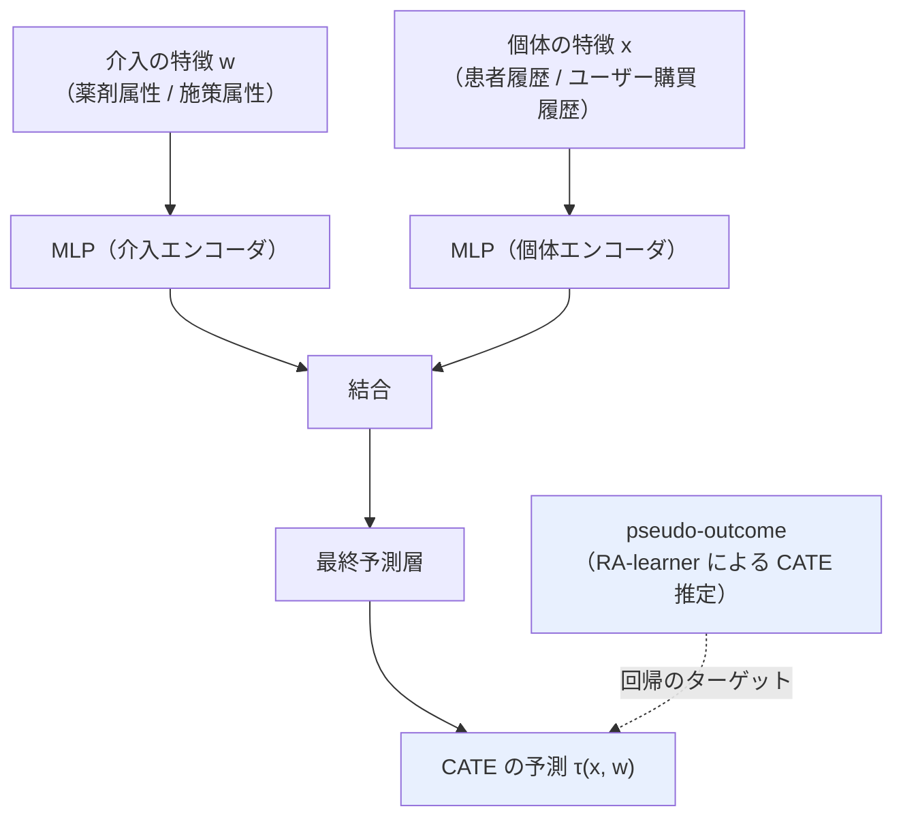

# 04. Zero-shot causal learning (CaML)

[← index](index.md)

## 書誌情報

| 項目 | 内容 |
|------|------|
| タイトル | Zero-shot causal learning |
| 著者 | Hamed Nilforoshan, Michael Moor, Yusuf Roohani, Yining Chen, Anja Šurina, Michihiro Yasunaga, Sara Oblak, Jure Leskovec |
| 年 | 2023（初版 2023-01-28 投稿、v4 は 2024-02-23） |
| 会場 | arXiv 掲載ページ上では会場の明記を確認できず（**未確認**。NeurIPS 2023 とする二次情報があるが本調査では未検証） |
| リンク | https://arxiv.org/abs/2301.12292 |
| arXiv ID | 2301.12292 |

## 一言で言うと

「各介入の個別効果予測を 1 つの**タスク**とみなし、数千のタスクを横断する**単一のメタモデル**を訓練する」ことで、訓練時に存在しなかった**新規介入の個別効果（CATE）**を予測する枠組みである。施策ごとに別モデルを立てる発想を捨てる点が、低頻度施策への本質的な回答になる。

## 問題設定

既存の因果推論手法は「その介入を受けた個体の履歴データ」から効果を推定する。したがって**まだ一度も実施されていない介入**については何も言えない。CaML はこの空隙を **zero-shot causal learning** として定式化した。

本課題との対応は直接的である。「新しく発明された薬」＝「まだ配信していない施策」であり、「薬の属性」＝「クーポン額・訴求文面・チャネル」、「患者の履歴」＝「ユーザーの購買履歴」となる。

抽象度の高い前提として、**介入間で共通する CATE 関数がグローバルに存在する**ことを仮定する。すなわち、介入の属性と個体の特徴を入力とする単一の関数が、すべての介入の効果を説明できるという仮定である。これは本課題の「施策特徴量が効果を説明する」という前提と同一物である。

## 手法

### タスクの構成

各タスクは以下をサンプリングして構成される。

1. 介入を 1 つサンプリングする
2. それを受けた個体（recipients）を集める
3. 受けなかった個体（nonrecipients）を集める

これにより**自然実験**の形をとるデータの塊が、介入ごとに 1 つずつ得られる。数千のタスクが生成される。

### pseudo-outcome の利用

CaML の重要な設計判断は、**成果を直接モデリングしない**点にある。代わりに **RA-learner**（regression-adjusted learner）等の確立された因果推論手法により、**CATE の不偏だが noisy な推定量**＝ pseudo-outcome を計算し、それを回帰のターゲットにする。

$$
\tilde{\tau}_i = \text{pseudo-outcome}(y_i, x_i, t_i) \quad \text{（不偏だがノイズの大きい CATE の推定値）}
$$

$$
\min_{\theta} \sum_{\text{tasks}} \sum_{i} \big(f_\theta(x_i, w_{t}) - \tilde{\tau}_i\big)^2
$$

成果を直接予測すると、成果の大部分を占める「介入と無関係なベースライン変動」に学習が引きずられる。pseudo-outcome を経由することで、**効果そのもの**へ学習を集中させる。データが薄い状況ではこの設計が効く。

### アーキテクチャ

- 介入特徴 $w$ と個体特徴 $x$ を**別々の MLP** で符号化する。
- 出力を結合し、最終予測層へ通す。
- メタ学習アルゴリズムには **Reptile** を用いる。

未観測の介入については、その説明文や属性集合から $w$ を生成してモデルへ渡せば、$\tau(x, w)$ が計算できる。**同じエンコーダを通すだけでゼロショット予測が構造的に成立する**のが要諦である。

### 理論的貢献

有限サンプルの汎化バウンドを証明している。誤差は以下に応じて減少する。

- **介入の滑らかさ**（$\beta$ パラメータ）— 似た介入は似た効果を持つ、という度合い
- **pseudo-outcome 推定の正確さ**

**この $\beta$ が本課題の急所である**。「似た施策は似た効果を持つ」という滑らかさが成り立たなければ、バウンドは緩み、汎化は保証されない。これはユーザーの前提そのものであり、理論的にも「仮定」として扱われている。

## 実験・結果

### データセット

| データセット | 介入数 | 内容 |
|------------|-------|------|
| **Claims** | 745 単剤、22,883 ペア | 3,060 万人の患者から、薬剤誘発性汎血球減少症を予測 |
| **LINCS** | 10,325 perturbagen | 99 細胞株における遺伝子発現応答 |

### 主要な数値

**Claims データセット（RATE 指標、高いほど良い）**

| 手法 | RATE@0.999 |
|------|-----------|
| **CaML** | **0.48** |
| T-learner + メタ学習 | 0.40 |

- **7 つの単一介入ベースラインのうち 6 つを上回った**。しかもそれらのベースラインは**テスト介入のデータで直接訓練されている**。
- 最強のベースライン（RA-learner、テストデータへ直接アクセスあり）とは同等。

**LINCS データセット（PEHE 指標、低いほど良い）**

| 手法 | PEHE (50 遺伝子) |
|------|-----------------|
| **CaML** | **3.56** |
| T-learner + メタ学習 | 3.61 |

### 注目すべき発見

1. **直接訓練を上回る**: ゼロショット予測が、対象介入のデータで直接訓練したベースラインを超えた。マルチタスクの知識転移が有効に働いている証拠である。
2. **薬剤の組み合わせへ汎化**: **単剤のみで訓練したモデルが、未観測の薬剤ペアの効果を予測した**。
3. **ablation の結果**: メタ学習（Reptile vs ERM）と、柔軟な CATE 推定戦略の**双方が critical** であった。

### 明示された限界

1. **後ろ向きデータに限定**。前向きの検証が必要。
2. **介入分布の連続性と、介入横断のグローバルな CATE 関数の存在を仮定**する。
3. 個体データへのアクセスに関するプライバシー上の懸念。

## 本課題への適用可能性

### 効く点

- **「実績ゼロの施策の効果予測」という問題設定を確立した中核文献である**。ユーザーの要求そのものが、学術的に定義され、評価され、達成可能であることが示されている。
- **「施策ごとに別モデル」を捨てて「施策横断の単一メタモデル」にする発想の転換**が、低頻度施策への本質的な解である。施策数がタスク数になるため、1 施策あたりのサンプルが薄くても学習が成立しうる。
- **pseudo-outcome の設計が、データが薄い状況で特に効く**。成果を直接予測せず CATE 推定値を回帰ターゲットにすることで、ベースライン変動に学習を奪われない。**本課題で真似すべき設計判断の筆頭**である。
- **単独施策のみの訓練から未観測の組み合わせへ汎化した実績**は、「クーポン額 A × 訴求文面 B」という未実施の組み合わせ評価に直結する。
- **評価設計が leave-one-intervention-out に相当する**。本課題の leave-one-campaign-out の直接の手本になる。
- **介入特徴と個体特徴を別 MLP で符号化する**という素直な構成は、実装コストが低い。複雑な生成モデルを組む必要がない。
- **理論的な汎化バウンドが、何に賭けているかを明示している**。介入の滑らかさ $\beta$ に依存するという形式化は、「施策特徴量が効くかどうか」を漠然とした期待ではなく検証可能な量として扱う枠組みを与える。

### 効かない/リスク点

- **介入数が本課題と 2 桁違う**。Claims で **745 単剤**、LINCS で **10,325 perturbagen**。「数千のタスクを横断して訓練する」という手法の前提が、**数十本の施策では成立しない**。タスク数が数十では、メタ学習は機能しない可能性が高い。**これは本手法の適用における最大の障害である**。
- **レポート 03（One-hot news）との関係で決定的に重要な観察**: CaML が汎化に成功した介入数（745 / 10,325）は、One-hot news がショートカットを検出した O'Neil（**38 薬剤**）より 1〜2 桁多い。**両者の矛盾は、介入数によって説明できる可能性が高い**。介入が数千あれば特徴量から学習する方が容易になり、数十しかなければ ID を覚える方が容易になる。**ユーザーの施策数は後者の側にある**。CaML の成功を根拠に本課題の成功を予期するのは、この点で誤りである。
- **「介入横断のグローバルな CATE 関数の存在」という仮定**が、著者自身によって限界として挙げられている。マーケティングでは、市場環境・季節・競合状況が施策ごとに異なるため、この仮定は医療より脆い可能性がある。時期の違いが施策の違いと交絡する。
- **滑らかさ $\beta$ が本課題で成り立つ保証がない**。「500 円クーポンと 600 円クーポンは似た効果」は妥当だが、「訴求文面 A と B は似ているから似た効果」は、文面埋め込みの距離が効果の距離と対応する場合にのみ成り立つ。**これは検証すべき仮説であって前提ではない**。
- **RATE / PEHE といった指標は本課題では計算しにくい**。PEHE は真の個別効果が既知の半合成データでなければ計算できない。実データでの評価指標の設計は自前で行う必要がある。
- **後ろ向きデータの限界**は本課題でも同じである。過去ログでの検証が良好でも、実配信での効果は別問題であり、最終的には A/B テストによる前向き検証が要る。
- **薬剤誘発性汎血球減少症という成果は、マーケティングの成果より因果構造が単純である**可能性がある。医療では処置割当が臨床判断に基づくが、マーケティングでは**施策側の意図的ターゲティング**による。後者の方が交絡が強く、しかも CaML は balancing を明示的に扱っていない。

## 実装ステップ

1. **タスク数（＝施策数）を数え、本手法の前提と照合する**。数千のタスクが前提の手法に、数十本の施策で臨むことになる。**この差を直視した上で、メタ学習部分（Reptile）は最初から諦め、単純な pooled 学習（ERM）から始めるのが現実的**である。論文の ablation は Reptile が critical だと述べているが、それはタスクが数千ある場合の話である。
2. **pseudo-outcome の構成を最優先で実装する**。これは施策数に依存せず効く設計であり、本論文から借りるべき最大の資産である。過去施策ごとに、配信群・非配信群から RA-learner 等で CATE 推定値を作る。**非配信群（コントロール）が各施策で確保できているかが前提条件**であり、確保できていないなら、まずログ収集設計の見直しから始める。
3. **タスク構成のためのデータ整備**。施策ごとに「配信された個体」「配信されなかった個体」のペアを作る。非配信群の定義（同時期の未配信ユーザーか、配信対象条件を満たすが選ばれなかったユーザーか）が交絡に直結するため、ここは慎重に設計する。
4. **介入エンコーダと個体エンコーダを別 MLP で組む**。素直な構成で始める。介入特徴 $w$ には、クーポン額（連続）・チャネル（カテゴリ）・文面の LLM 埋め込みを結合する。
5. **滑らかさ $\beta$ を経験的に確認する**。施策特徴空間での距離と、推定された効果の距離の相関を散布図で見る。**相関がなければ、本手法の理論的前提が崩れており、実装しても汎化しない**。これは安価で決定的な事前チェックである。
6. **leave-one-campaign-out で評価し、one-hot ベースラインと比較する**（レポート 03）。CaML 論文自身が「テスト介入で直接訓練したベースライン」との比較を行っている点を見習う。本課題では**施策 ID の one-hot モデル**を必ず加える。
7. **時期の交絡を検証する**。施策と時期が完全に交絡している（各施策が特定の月にしか実施されていない）なら、施策特徴量の効果と季節効果が分離できない。この場合、施策特徴量の寄与は原理的に識別不能である。

## 関連リソース

- **レポート 03（One-hot news）** — 本論文と正面から緊張関係にある。**介入数の差（745〜10,325 vs 38）が両者の結論を分けている可能性**を検討することが、本課題の判断の核心。
- **レポート 02（CPA）** — 未観測摂動への汎化という同じ目標。生成モデル側からのアプローチ。著者に Roohani が共通する。
- **レポート 01（CISI-Net）** — CaML に欠けている balancing を供給する。
- **GEARS**（https://www.nature.com/articles/s41587-023-01905-6） — 著者陣（Roohani, Leskovec）が重なる。外部知識グラフによる未観測摂動の表現構成であり、**施策数が少ない本課題では CaML より現実的な路線**の可能性がある。
- **RA-learner** — pseudo-outcome の構成に用いる。CATE 推定の標準手法。
- **Reptile** — 用いられているメタ学習アルゴリズム。
- **LINCS / Claims** — 実験データセット。
