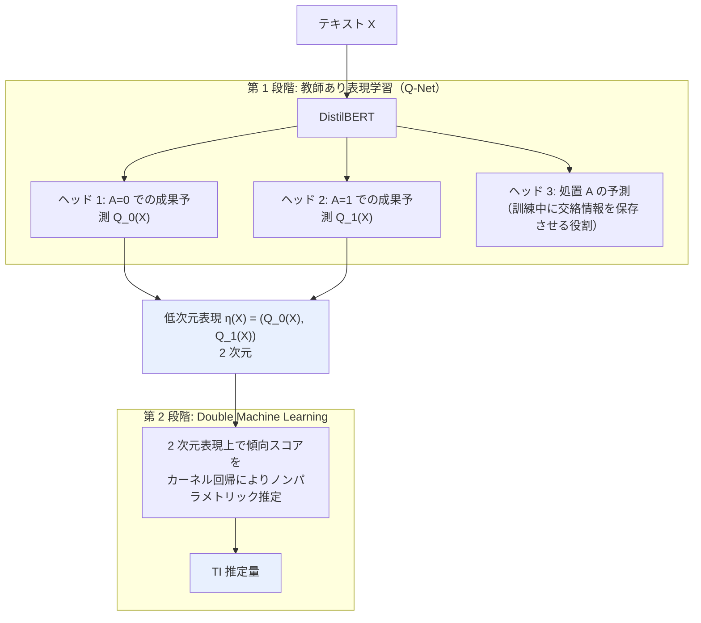

# 05. Causal Estimation for Text Data with (Apparent) Overlap Violations

[← index](index.md)

## 書誌情報

| 項目 | 内容 |
|------|------|
| タイトル | Causal Estimation for Text Data with (Apparent) Overlap Violations |
| 著者 | Lin Gui, Victor Veitch |
| 年 | 2022 投稿、v3 は 2023 |
| 会場 | arXiv（stat.ML / cs.LG）。査読会場は**未確認**（ICLR 2023 とする二次情報があるが本調査では未検証） |
| リンク | https://arxiv.org/abs/2210.00079 |
| arXiv ID | 2210.00079 |

## 一言で言うと

「丁寧なメールと無礼なメールで返信時間はどう変わるか」のように、**テキストの属性そのものを処置とする**と、テキストを見れば処置が完全に決まってしまうため **overlap（重なり）の仮定が見かけ上破綻する**。本論文はこの識別上の障害を定式化し、「**交絡情報は保存し、処置のみを予測する情報を除去する**」教師あり表現学習によって overlap を回復させる。訴求文面を処置として扱う際に必ず踏む地雷の、事前の解除法である。

## 問題設定

### overlap 違反の構造

テキスト $X$ の属性 $A$（丁寧さ・割引訴求の有無など）の因果効果を推定したい。交絡（話題・文章レベルなど、処置と成果の両方に影響する要素）を調整する必要があり、交絡要素は事前に未知であるため、**テキスト全体を transformer で調整する**のが自然に見える。

しかしここに致命的な問題がある。処置 $A$ 自体がテキストの属性であるため、

$$
P(A = 1 \mid X) \in \{0, 1\}
$$

となる。論文の表現では「the probability of treatment given any text is either 0 or 1」。**テキストを見れば処置が確定する**のだから、当然である。

因果識別・推定の手続きは overlap

$$
0 < P(A = 1 \mid \text{調整変数}) < 1
$$

を前提とする。「どの単位も処置を受けうる／受けないでいられる余地が残っている」ことが必要だが、テキスト全体で条件付けるとこれが原理的に破綻する。**傾向スコアがすべて 0 か 1 になり、IPW も DR も定義できない**。

### 本課題への直接の含意

訴求文面を処置として扱い、文面の LLM 埋め込みを共変量として放り込む——という素朴な実装は、**この地雷を踏む**。「同じ文面で処置あり／なし」が原理的に存在しないため、素朴な傾向スコア調整は破綻する。

## 手法

### 中核のアイデア

**すべての情報を調整に使ってはいけない**。テキストには 2 種類の情報が混在する。

- **交絡情報**: 処置と成果の**両方**に影響する（話題、文章レベル）→ **調整に必要、保存すべき**
- **処置のみを予測する情報**: 処置を決定するが成果には直接影響しない → **overlap を壊す元凶、除去すべき**

後者を落とせば overlap が回復し、前者を残せば交絡調整が成立する。

### 2 段階の構成

**Q-Net アーキテクチャ**（DragonNet ベース）: DistilBERT に 3 つのヘッドを付ける。

1. $A=0$ での成果を予測するヘッド → $Q_0(X)$
2. $A=1$ での成果を予測するヘッド → $Q_1(X)$
3. 処置を予測するヘッド（訓練中に交絡情報を表現へ保存させるために置かれる）

得られる表現は

$$
\eta(X) = \big(Q_0(X),\; Q_1(X)\big)
$$

という**わずか 2 次元**である。テキスト全体ではなくこの 2 次元で条件付けることで、overlap が回復する。傾向スコアはこの 2 次元表現上でカーネル回帰によりノンパラメトリックに推定される。

### 理論的結果

**Theorem 1**: 弱い条件の下で、**Controlled Direct Effect (CDE)** という推定対象の識別を確立する。テキストが処置固有の情報と交絡情報の両方を含むとき、「$A$ の $Y$ への効果」が何を意味するのかを形式化している。**推定できるのは ATE ではなく CDE である**という点が重要で、推定対象自体が読み替わる。

**Theorem 2**: 提案する **TI 推定量**が $\sqrt{n}$ レートで収束することを証明する。成果モデルの収束レートは $n^{-1/4}$ で足りる。この頑健性は、**2 次元の傾向スコアがノンパラメトリックに高速推定できる**ことに由来する。低次元へ落としたことが、統計的性質の面でも効いている。

## 実験・結果

| 項目 | 内容 |
|------|------|
| データ | 半合成の Amazon レビューデータ |
| 実応用 | メールの丁寧さが迅速な返信に与える効果 |

| 指標 | TI 推定量 | 成果モデルのみのベースライン |
|------|----------|---------------------------|
| 95% 信頼区間のカバレッジ | 約 **84%** | **0%** |
| 絶対バイアス | 大幅に低い | — |

- ノイズ・交絡の水準を変えても、一貫して低いバイアスを示した。
- 実応用では、**丁寧さが迅速な返信を増やす**ことを確認した。

### 明示された限界

- **実際のカバレッジが名目の 95% を下回る**（約 84%）ことを著者自身が認めている。原因を成果モデルの当てはまりの不完全さに帰し、より強力な言語モデルで解消しうると示唆している。
- コードとチュートリアルは GitHub で公開されている。

## 本課題への適用可能性

### 効く点

- **訴求文面を処置として扱う際に必ず踏む地雷を、先回りして指摘している**。「文面そのものを処置にすると overlap が原理的に破綻する」という指摘は、実装方針を根本から左右する。**これを知らずに実装すると、動いているように見えて推定値が無意味になる**（ベースラインのカバレッジ 0% がそれを示している）。
- **「交絡情報は残し、処置予測情報だけ落とす」という表現設計の指針**が、LLM 文面埋め込みの扱いに対する明確な処方箋になる。埋め込みをそのまま共変量に入れる素朴な実装への、理論的裏付けを伴う反証である。
- **2 次元まで落とすという解が、データが薄い本課題に極めて好都合である**。高次元の文面埋め込みで条件付ける代わりに $(Q_0, Q_1)$ の 2 次元で条件付けるなら、傾向スコアの推定に必要なサンプルが劇的に減る。**次元の呪いを構造的に回避している**。
- **Q-Net の実装コストが低い**。DragonNet ベースで DistilBERT に 3 ヘッドを付けるだけであり、公開実装もある。
- **推定対象が CDE として形式化されている**点は、実務での解釈を明確にする。「文面を変えたら成果がどう変わるか」を厳密に何と定義するかが曖昧なまま進むより遥かに良い。
- **実応用（メールの丁寧さ→返信速度）が本課題の構造とほぼ同型**である。「訴求文面の属性 → コンバージョン」への読み替えが素直に効く。

### 効かない/リスク点

- **推定できるのは ATE ではなく CDE である**。これは弱い推定対象であり、「この文面に変えたら売上がいくら増えるか」という実務の問いに直接答えているとは限らない。**推定対象の読み替えが起きていることを、意思決定者に正確に伝える必要がある**。ここを曖昧にすると、数字が独り歩きする。
- **カバレッジが 84% にとどまる**（名目 95%）。半合成データでこれなら、実データではさらに悪化しうる。信頼区間を額面通りに受け取ってはならない。
- **処置を「テキストの属性」として二値で定義する必要がある**。「丁寧／無礼」のような明確な二値属性が前提であり、**訴求文面全体を高次元の処置ベクトルとして扱う本課題の構想とは、定式化が異なる**。本論文の枠組みへ乗せるには、文面を「割引訴求か否か」「緊急性訴求か否か」といった二値属性へ**人手で分解**する必要がある。これは本課題が避けたかった作業そのものである可能性がある。
- **施策数の問題は本論文では解決されない**。半合成 Amazon レビューは文書数が多く、文面のバリエーションが豊富である。**数十本の施策＝数十の文面しかない本課題では、$Q_0, Q_1$ を学習する DistilBERT のファインチューニングが成立しない**。文書レベルではユーザーごとに行が増えるが、**文面のユニーク数は施策数に等しく数十**である。ここでもレポート 03 の問題（エンティティの多様性不足）が再来する。
- **DistilBERT のファインチューニングには相応のデータが要る**。数十文面では過学習が確実であり、事前学習済み埋め込みを凍結して使う等の妥協が必要になる。その場合、本論文の「交絡情報を保存する表現学習」という中核が機能するかは未検証である。
- **成果モデルの当てはまりに性能が依存する**。著者自身がカバレッジ不足の原因をここに帰している。データが薄ければ成果モデルの当てはまりも悪く、問題は増幅する。
- **時期の交絡が扱われていない**。マーケティング施策では文面と配信時期が交絡するが、本論文の枠組みにはこの構造が入っていない。

## 実装ステップ

1. **推定対象を先に決める**。文面の**どの属性**の効果を知りたいのかを明確にする。「文面全体の効果」は本論文の枠組みでは扱えない。「割引訴求 vs 希少性訴求」のような二値属性へ落とす。**この分解が人手依存になる点を受け入れるかが、最初の分岐である**。
2. **overlap の破綻を実データで確認する**。文面埋め込みで処置を予測してみて、精度がほぼ 100% になるなら overlap は破綻している。これは 1 時間で確認できる診断であり、**素朴な実装が無意味であることの証拠になる**。
3. **文面のユニーク数を数える**。施策数と同じく数十なら、DistilBERT のファインチューニングは諦め、**凍結した埋め込み + 小さなヘッド**で $Q_0, Q_1$ を学習する構成に落とす。
4. **Q-Net を DragonNet ベースで組む**。3 ヘッド（$Q_0$、$Q_1$、処置予測）。公開実装を出発点にする。
5. **$\eta(X) = (Q_0, Q_1)$ の 2 次元表現を取り出し、その上で傾向スコアをカーネル回帰で推定する**。ここで overlap が回復しているか（傾向スコアが 0/1 に張り付いていないか）を必ず可視化する。**回復していなければ、以降の推定はすべて無効である**。
6. **TI 推定量で効果を推定し、信頼区間を出す**。ただしカバレッジが名目を下回ることを前提に、区間は保守的に解釈する。
7. **人手の訴求タグと LLM 埋め込みの併用から始める**。本論文の含意（属性へ分解する方が識別が楽）と、施策数の制約の両方が、この保守的な出発点を支持する。
8. **CDE と ATE の違いを文書化し、意思決定者へ明示する**。

## 関連リソース

- **CausalDANN**（Estimating Causal Effects of Text Interventions Leveraging LLMs, https://arxiv.org/abs/2410.21474） — 「どう推定するか」を扱う。本論文（「そもそも何が識別できるか」）を先に読むべき。対で読む。
- **Causal Effect Estimation with Latent Textual Treatments**（https://arxiv.org/abs/2602.15730） — SAE で文面を解釈可能な潜在軸へ分解する。本論文の「属性へ分解せよ」という含意を自動化する提案。
- **DragonNet**（Shi, Blei, Veitch） — Q-Net の基礎アーキテクチャ。著者に Veitch が共通する。
- **レポート 01（CISI-Net）** — balancing による交絡調整。本論文の overlap の議論と、balancing の要件が矛盾しうる点が統合の論点。
- **レポート 03（One-hot news）** — 文面のユニーク数が施策数に等しいという構造的制約が、本論文の適用でも障害になる。
- **Double Machine Learning**（Chernozhukov et al.） — 第 2 段階の基礎。
- コード: GitHub で公開（**URL 未確認**）。
