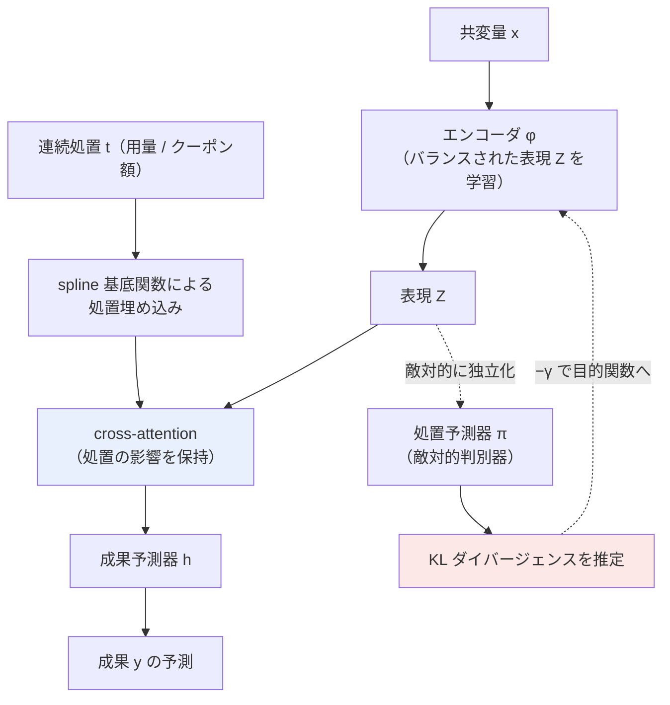

# 06. Adversarially Balanced Representation for Continuous Treatment Effect Estimation (ACFR)

[← index](index.md)

## 書誌情報

| 項目 | 内容 |
|------|------|
| タイトル | Adversarially Balanced Representation for Continuous Treatment Effect Estimation |
| 著者 | Amirreza Kazemi, Martin Ester |
| 年 | 2023 |
| 会場 | arXiv 掲載ページ上では会場の明記を確認できず（**未確認**。AAAI 2024 とする二次情報があるが本調査では未検証） |
| リンク | https://arxiv.org/abs/2312.10570 |
| arXiv ID | 2312.10570 |

## 一言で言うと

**連続処置**（薬剤の用量、クーポン額）の ITE 推定において、IPM 距離を **KL ダイバージェンス**に置き換えて敵対的に表現をバランスさせつつ、**cross-attention 機構によって処置の値が成果予測へ与える影響を保持する**手法である。「処置と独立な表現を作ると有用な情報まで捨ててしまう」という指摘が、レポート 01 の balancing penalty と正面から緊張関係にある。

## 問題設定

ITE 推定では、処置の異なる集団間の**共変量シフト**を調整する必要がある。深層表現学習による balancing がこの調整に有望であることは広く認められてきた。

しかし既存手法の大半は**二値処置**しか考慮していない。連続処置には固有の困難がある。

- 処置が連続なら、「処置群 vs 対照群」という 2 集団の対比が存在しない。処置値ごとに集団が無限に存在する。
- **balancing を強くかけすぎると、処置値と成果の関係そのものが表現から消える**。「処置と独立な表現」を作ることが目的化すると、dose-response 曲線を推定するための情報が失われる。

この 2 点目が本論文の批判の核心であり、**本課題の統合アーキテクチャにおける最難関**を予告している。

## 手法

### 理論的中核: IPM から KL ダイバージェンスへ

**Proposition 1**: 反実仮想誤差は、事実誤差と、$P(Z)P(T)$ と $P(Z,T)$ の間の KL ダイバージェンスによって上から抑えられる。

$$
\epsilon_{CF} \;\leq\; \epsilon_F \;+\; \mathrm{KL}\big(P(Z,T) \,\|\, P(Z)P(T)\big)
$$

ここで $Z$ は学習された表現、$T$ は処置である。$\mathrm{KL}(P(Z,T)\|P(Z)P(T))$ は $Z$ と $T$ の**相互情報量**に他ならず、これを小さくすることは表現と処置を独立に近づけることを意味する。

**なぜ KL か**: IPM（Wasserstein、MMD など）は**高次元での近似が信頼できない**。KL ダイバージェンスは**パラメトリックな推定が可能**であり、判別器ネットワークで推定できる。レポート 01 の CISI-Net が Wasserstein 距離を使っているのと対照的な設計判断である。

### アーキテクチャ

3 つのネットワークからなる。

- **エンコーダ $\varphi$**: バランスされた表現 $Z$ を学習する。
- **成果予測器 $h$**: **事前定義された spline 関数**から得た処置埋め込みと、表現 $Z$ の間で **cross-attention** を取る。ここが「バランスさせつつ処置の影響を保持する」ための機構である。
- **処置予測器 $\pi$**: 敵対的判別器。表現から処置を当てようとし、KL ダイバージェンスを推定する。

### 目的関数

$$
\mathcal{L} = \min_{\varphi, h} \; \ell_{\text{pred}} \;-\; \gamma \, \ell_{\text{adv}}
$$

エンコーダと成果予測器が予測損失を最小化しつつ敵対的損失を打ち消す方向へ、判別器が敵対的損失を最大化する方向へ学習する。

### 設計上の要点

**独立性を強制するだけでは足りない**、というのが本論文の主張である。表現 $Z$ を処置 $T$ と独立にすれば balancing は達成されるが、それだけでは成果予測に処置値が効かなくなる。そこで**成果予測の経路には attention を通じて処置情報を明示的に注入する**。**独立化する経路（$Z$）と、処置情報を流す経路（attention）を分離した**のが本手法の構造的な工夫である。

## 実験・結果

### データセット

半合成データ 2 種。

| データセット | サンプル数 | 特徴次元 |
|------------|----------|---------|
| TCGA | 9,659 | 4,000 |
| News | 5,000 | 3,477 |

### 主要な数値

| データセット | ACFR の MISE | ACFR の PE |
|------------|-------------|-----------|
| News | **1.12 ± 0.12** | 0.18 ± 0.01 |
| TCGA | **1.60 ± 0.20** | **0.76 ± 0.12** |

### 比較対象

**VCNet, DRNet, ADMIT** を上回った。特に**処置選択バイアスが強い状況での頑健性**において優位を示した。

各ベースラインの個別の数値は、取得したページからは**未確認**。

### 明示された限界

- **unconfoundedness（すべての交絡因子が観測されている）を仮定する**点。著者は「is not necessarily hold in real-world applications（実世界の応用では必ずしも成り立たない）」と認めている。

## 本課題への適用可能性

### 効く点

- **クーポン額は本質的に連続値であり、本手法はそこに正面から答える**。額の水準ごとに別施策とみなす必要がなくなり、**額の内挿・外挿が同一モデル内で扱える**。500 円と 1000 円の実績から 750 円を推定する、という本課題の主要要件に直接応える。
- **「処置と独立な表現を作ると情報を捨てすぎる」という指摘が、極めて重要な設計上の警告である**。レポート 01 の CISI-Net は施策パターン間で表現分布を揃えるが、これを連続処置へ素朴に拡張すると、**クーポン額と反応の関係そのものが表現から消える**。balancing は無条件に善ではない。
- **独立化の経路と処置情報の経路を分離する**という構造的解決が、本課題の統合アーキテクチャに直接使える。共変量表現は balancing し、処置情報は attention で別途注入する。
- **KL ダイバージェンスの採用理由（高次元で IPM の近似が信頼できない）**は、本課題でも当てはまる。文面埋め込みを含む高次元の施策表現を扱うなら、Wasserstein より KL の方が推定が安定する可能性がある。**レポート 01 が Wasserstein を使っている点との比較検討が要る**。
- **spline 基底による処置埋め込み**は、パラメータ数が少なく、データが薄い状況で好都合である。クーポン額を数個の spline 基底で表現すれば、学習すべき自由度が小さく抑えられる。
- **処置選択バイアスが強い状況での頑健性**が報告されている点は、施策のターゲティングが強く偏る実務ログに適合する。

### 効かない/リスク点

- **半合成データのみでの検証である**。TCGA も News も、真の dose-response 曲線を人工的に付与した半合成データであり、**実データでの検証がない**。MISE や PE は真の効果が既知でなければ計算できない指標であり、**本課題の実データでこれらの数値を再現・検証する手段がない**。
- **サンプル数が本課題と乖離する**。TCGA 9,659、News 5,000。桁としては CISI-Net や CPA より控えめだが、これらは**特徴次元が 4,000・3,477 と極めて高い**半合成設定であり、単純な比較はできない。
- **unconfoundedness の仮定**を著者自身が限界として挙げている。マーケティングでは「なぜこのユーザーにこの額のクーポンを配ったか」の意思決定ロジックが完全にログに残っていなければ、この仮定は破れる。**過去の配信ロジックがルールベースなら記録されているが、担当者の裁量が入っていれば未観測交絡が残る**。
- **連続処置の balancing と離散施策パターンの balancing をどう共存させるかは、本論文でも未解決である**。本論文は連続処置単独を扱う。「クーポン額（連続）× チャネル（離散）× 文面（テキスト）」という混在した処置空間に対する統一的な処方箋は、**本論文にも、レポート 01 にも、レポート 05 にも存在しない**。ここは文献の空白であり、本課題における実質的な研究課題になる。
- **クーポン額の分布が実務では極端に離散的である**可能性が高い。実際には 500 円・1000 円・3000 円の 3 水準しか実施していないなら、それは「連続処置」ではなく 3 値の離散処置である。**連続処置手法を使う前提（処置値が連続的に散らばっている）が満たされない**。この場合、本手法の利点（内挿）は「3 点間の補間」という強い外挿的仮定に依存することになる。
- **spline による処置埋め込みが、実施済み水準の外側でどう振る舞うかは保証されない**。未実施の 3000 円超の額への外挿は、spline の端点挙動に支配され、実質的に無根拠になる。
- **attention 機構は追加のパラメータを要する**。データが薄い本課題では、attention が過学習の温床になりうる。

## 実装ステップ

1. **クーポン額の実際の分布を確認する**。何水準が実施されているか。3〜4 水準しかないなら、**連続処置手法を使う前提が崩れている**ことを直視する。この場合、レポート 01 の離散パターン扱いの方が正直である。
2. **連続処置として扱う価値があるか判断する**。「未実施の額を推定したい」が明確な要求であり、かつ既存の水準が 5 つ以上あるなら、本手法へ進む。そうでなければ、離散扱いから始める。
3. **spline 基底による処置埋め込みから実装する**。$s(0) = 0$ 制約（レポート 02 の CPA）と組み合わせ、「クーポンなし＝効果ゼロ」を構造的に保証する。基底数は少なく（3〜5）保つ。
4. **balancing なしのモデルを先に組む**。本論文の警告（balancing の掛けすぎで情報が消える）を実地で確認するため、$\gamma \in \{0, 0.1, 1, 10\}$ を掃き、**$\gamma$ を上げると dose-response 曲線が平坦化していく**現象が起きるかを可視化する。起きるなら、それが本論文の主張の実データでの再現である。
5. **cross-attention による処置情報の注入**を実装し、独立化経路と分離する。
6. **KL 推定のための判別器を組む**。敵対的学習は不安定になりやすいため、判別器の学習率と更新頻度は慎重に設定する。
7. **未観測交絡の有無をドメイン知識で吟味する**。過去の配信ロジック（誰にいくらのクーポンを配るかの決定規則）を、可能な限り共変量として復元する。担当者の裁量が入っていた期間のデータは、別扱いにするか除外を検討する。
8. **内挿と外挿を分けて評価する**。実施済み水準の間（内挿）と外（外挿）で性能を別々に報告する。外挿の性能は原理的に保証されない。
9. **レポート 01 との統合を設計する**。離散施策パターン（チャネル・訴求）は Wasserstein で balancing、連続処置（額）は KL + attention で扱う、というハイブリッドが素直な出発点だが、**両者の共存は文献に前例がない**。ここは自前の設計判断と検証が必要である。

## 関連リソース

- **レポート 01（CISI-Net）** — balancing penalty に Wasserstein（IPM）を使う。本論文は IPM を高次元で信頼できないとして KL へ置き換えた。**両者の設計判断が正面から対立しており、統合の際の核心的な論点になる**。
- **レポート 02（CPA）** — 用量を埋め込みの非線形スケーリングで扱う別解。$s(0)=0$ 制約は本手法にも移植できる。
- **DRNet**（Learning Counterfactual Representations for Estimating Individual Dose-Response Curves, https://arxiv.org/abs/1902.00981） — 本論文のベースライン。用量をビンに分岐させる古典的設計。
- **VCNet** — 本論文のベースライン。
- **ADMIT** — 本論文のベースライン。
- **CRNet**（Contrastive Balancing Representation Learning for Heterogeneous Dose-Response Curves, https://arxiv.org/abs/2403.14232） — 連続処置 balancing の対比学習による別路線。
- **TCGA / News** — 半合成ベンチマーク。連続処置文献の標準データセット。
