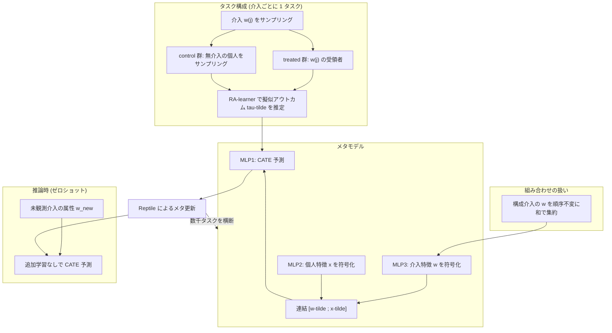

# 01. Zero-shot causal learning (CaML)

[← index](index.md)

## 書誌情報

| 項目 | 内容 |
|------|------|
| タイトル | Zero-shot causal learning |
| 著者 | Hamed Nilforoshan, Michael Moor, Yusuf Roohani, Yining Chen, Anja Šurina, Michihiro Yasunaga, Sara Oblak, Jure Leskovec |
| 年 | 2023（初版 2023-01-28 / v3 2024-02-23） |
| 会場 | NeurIPS 2023（gather 記載。arXiv ページ上は cs.LG 表記のみで、本文からの会場確認は**未確認**） |
| リンク | https://arxiv.org/abs/2301.12292 |
| 実装 | https://github.com/snap-stanford/caml （gather 記載。本 retrieval では未検証） |

## 一言で言うと

「各施策の効果予測を 1 つのタスクとみなし、数千のタスクを横断して単一のメタモデルを訓練する」ことで、訓練時に一度も観測していない介入についても、その**属性さえ与えれば** CATE を予測できるようにした枠組みであり、本クラスタの問題設定そのものを定義した論文である。

## 問題設定

**「未観測介入」型**である。本課題の直系にあたる。

論文が扱うのは「novel intervention（新規介入）の個別効果予測」であり、訓練時に存在しなかった薬剤・政策の効果を、その介入の属性（薬剤の分子構造や知識グラフ埋め込み）から予測する。データセットは既知のものを使い、**未知なのは介入そのもの**である。CausalPFN / Do-PFN 系の「未観測データセットへの汎化」とは別問題であり、本論文がその区別の基準点になる。

識別のための仮定は、観測される各介入 $w$ について unconfoundedness・consistency・overlap という標準的なものに加え、以下が置かれる。

- $\tau_w(x) = \tau(w, x)$ — 介入ごとに別関数ではなく、**介入と個人を引数に取る単一の大域関数**が存在する
- $\tau(w, x)$ が $w$ について連続
- $W$ が連続分布に従う
- 関数族が $W$ について滑らか、および介入分布上の Poincaré 型不等式（Assumption 2–3）

この「$\tau(w,x)$ が $w$ について連続な単一関数」という仮定が、ゼロショット外挿を可能にしている実質的な対価である。施策メタ情報が近ければ効果も近い、という構造を仮定している。

## 手法

タスク構成は、(a) 介入 $w^{(j)}$ をサンプリング、(b) それを受領した個人全員を treated 群 $D_{\text{treated}}^{(j)}$ とする、(c) いかなる介入も受けていない個人をサンプリングして control 群 $D_{\text{control}}^{(j)}$ とする、という手順を踏む。各タスク $j$ について擬似アウトカム $\tilde{\tau}^{(j)}$ を推定し、$\mathbb{E}_{\mathcal{P}}[\tilde{\tau}^{(j)} \mid X=x] = \tau_{w^{(j)}}(x)$ を満たすようにする。

擬似アウトカムの生成には **RA-learner** を用い、論文はこれを「データ前処理ステップとして扱う」と述べる（具体的な RA-learner の式は本文には書かれず Appendix C.6 に委ねられている＝**本文からは未確認**）。

モデルは介入特徴 $w$ と個人特徴 $x$ を別々の MLP で符号化して連結する構成である。

$$\Psi_\theta(w, x) = \mathrm{MLP}_1([\tilde{w}; \tilde{x}]), \quad \tilde{x} = \mathrm{MLP}_2(x), \quad \tilde{w} = \mathrm{MLP}_3(w)$$

ここで $[\cdot;\cdot]$ は連結を表す。残差接続 $g(z) = z + \mathrm{ReLU}(\mathrm{Linear}(z))$ が用いられる。

メタ学習は **Reptile** に基づく（論文は「CaML の枠組み自体は特定の訓練戦略に依存しないが、Algorithm 1 は Reptile に基づく」と述べる）。

介入の組み合わせ（薬剤ペア等）は、**順序不変なプーリング演算**で各介入の $w$ を集約して扱う。論文は sum 演算子を採用し、Claims では「薬剤の組み合わせ埋め込みを構成薬剤の埋め込みの和として計算する」と明記している。この設計が後述の組み合わせ汎化を支えている。

## 実験・結果

### データセット

| データセット | 規模 | 介入 | アウトカム | 介入特徴 $w$ |
|------------|------|------|-----------|-------------|
| Claims（医療保険請求） | 3.5 billion claims / 30.6 million patients（米国）、患者特徴 443,940 次元 | 単剤 745 種、薬剤ペア 22,883 種 | 90 日以内の pancytopenia 発症 | 大規模生物医学**知識グラフ**の事前学習済み薬剤埋め込み |
| LINCS（細胞株摂動） | perturbagen 10,325 種、細胞株 99 種（CCLE）、細胞株特徴 19,221 次元 | 小分子化合物 | 上位 50 / 20 の差次発現遺伝子（DEG）の発現量 | **RDKit** featurizer による分子埋め込み |

### 指標

- Claims: RATE @$u$（Rank-weighted Average Treatment Effect）、Recall @$u$、Precision @$u$（$u \in \{0.999, 0.998, 0.995, 0.99\}$）
- LINCS: PEHE（top-50 DEGs / top-20 DEGs）

### Claims 結果（Table 2、RATE）

| 手法 | @0.99 | @0.995 | @0.998 | @0.999 |
|------|-------|--------|--------|--------|
| Random | 0.00 | 0.00 | 0.00 | 0.00 |
| T-learner | 0.10 | 0.16 | 0.26 | 0.32 |
| X-learner | 0.03 | 0.04 | 0.05 | 0.06 |
| RA-learner | 0.14 | 0.23 | 0.37 | 0.47 |
| T-learner w/ meta-learning | 0.11 | 0.18 | 0.31 | 0.40 |
| **CaML** | 0.13 | 0.23 | 0.38 | **0.48** |

### LINCS 結果（Table 3、PEHE。低いほど良い）

| 手法 | PEHE 50 DEGs | PEHE 20 DEGs |
|------|-------------|-------------|
| Mean baseline | 3.78 | 4.11 |
| GraphITE | 3.58 ± 0.023 | 3.82 ± 0.011 |
| SIN | 3.78 ± 0.001 | 4.06 ± 0.001 |
| T-learner w/ meta-learning | 3.61 ± 0.007 | 3.85 ± 0.006 |
| **CaML** | **3.56 ± 0.001** | **3.78 ± 0.005** |

### 「ゼロショットが直接データ持ちベースラインを上回る」主張の精査

**この主張は gather 段階の要約より弱い。正確には「7 本中 6 本に勝ち、最強の 1 本とは互角」である。**

論文の実際の記述はこうである。

> "CaML performs stronger (up to 8× higher RATE values) than 6 of the 7 baselines which are trained directly on the test interventions, and performs comparably to the strongest baseline trained directly on the test interventions (RA-learner)."

実験条件を分解すると以下になる。

| 論点 | 精査結果 |
|------|---------|
| 比較対象の 7 ベースライン | T-learner, X-learner, R-learner, RA-learner, DragonNet, TARNet, FlexTENet |
| ベースラインの訓練条件 | 各 meta-testing タスクのサンプルの **50% で訓練し、残り 50% で評価**。つまり「直接データ」とはテスト介入の半分のサンプルに過ぎない |
| 最強ベースラインとの差 | RA-learner 0.47 vs CaML 0.48（@0.999）。**ほぼ互角であり、有意差の主張ではない** |
| 「8×」の出どころ | 弱いベースライン（X-learner 0.03 等）との比。X-learner 比では 16× にもなるが、これは X-learner がこの設定で崩壊していることの裏返しでもある |
| LINCS での注記 | 論文自身が「介入あたりのインスタンス（細胞株）数が少ないため multi-intervention learner が最強になる」と述べており、**直接データ持ちとの比較はこの設定では意味が薄い**と認めている |

したがって実務的な含意は「**ゼロショットは、テスト介入の半分のデータで組んだ最良の単一介入モデルと同等の性能に達しうる**」であって、「データを持つモデルより明確に優れる」ではない。ただし同等というだけでも十分に強い結果である。データ収集を待たずに同等の精度が得られるなら、時間的コストの差は決定的だからである。

### 組み合わせ汎化の実験

設定は「**単剤の介入のみで訓練し、両方とも訓練時に未観測な 2 剤の組み合わせの個別効果を予測する**」というものである。論文は結果について次のように述べる。

> "CaML achieves strong performance results (see Appendix Table 5), surpassing the best baseline trained on the test tasks, and outperforms all zero-shot baselines, across all 12 metrics."

**注意**: この「12 指標すべてで、テストタスクで訓練した最良ベースラインを上回る」という主張の**具体的な数値は Appendix Table 5 にあり、本 retrieval では取得できなかった（未確認）**。組み合わせ設定では単剤設定と違い「上回る（surpassing）」と書かれている点は、単剤設定の「comparably」より強い表現である。この差は重要なので、実際に採用判断を下す前に Appendix Table 5 の数値を原典で確認すべきである。

## 本課題への適用可能性

### 効く点

- **「施策 = タスク」の定式化がそのまま乗る**。ユーザーの状況は施策数がタスク数であり、1 施策あたりのサンプルが薄くてもタスクを横断してメタモデルを訓練できる。これは施策ごとに独立にモデルを組む現行の発想を構造的に置き換える。
- **組み合わせ汎化が本課題の本丸に直結する**。sum による順序不変プーリングで組み合わせを扱う設計は、「クーポン額 × 訴求 × チャネル」の未実施な掛け合わせにそのまま読み替えられる。各軸に実績があれば掛け合わせが未実施でも予測できる、という主張の実験的裏付けがここにある（ただし数値は未確認）。
- **介入特徴の設計指針が具体的**。Claims では知識グラフ埋め込み、LINCS では RDKit という「介入の意味を担う外部表現」を使っている。施策側では「クーポン額・訴求カテゴリ・チャネル・対象条件」の構造化ベクトル、あるいは訴求文面の埋め込みが対応する。
- **アーキテクチャが軽い**。MLP 3 本と残差接続に過ぎず、Reptile も実装が容易である。深層モデルとしては小さく、施策数が少ない状況でも過学習しにくい構成である。

### 効かない/リスク点

- **仮定 $\tau(w,x)$ が $w$ について連続、が本課題では破れやすい**。これはゼロショットの生命線だが、マーケティングでは「クーポン 500 円と 1000 円で効果が連続的に動く」ことは期待できても、「訴求内容 A と B が埋め込み空間で近ければ効果も近い」は保証されない。訴求は閾値的・カテゴリカルに効くことがある。仮定違反はゼロショット予測を静かに壊す。
- **施策数の桁が違う**。CaML は Claims で 745 単剤 + 22,883 ペア、LINCS で 10,325 perturbagen という**数千〜数万のタスク**でメタ学習している。数ヶ月に一度・年数本というユーザーの状況では**タスク数が 2〜3 桁足りない**。この論文の結果がその領域で再現する保証はどこにもなく、これが本課題における最大のリスクである。メタ学習は「タスクが大量にある」ことを前提とした技術である。
- **季節性・時間交絡が介入特徴に入っていない**。CaML の $w$ は薬剤の化学的属性であり、時間的文脈を持たない。マーケティング施策の効果は実施時期（年末・セール期・競合の動き）に強く依存するが、これは施策メタ情報に現れない。「同じ施策を 3 月と 12 月に打つと効果が違う」場合、$\tau(w,x)$ という定式化自体が誤特定になる。実施時期を $w$ に含めるか、$x$ 側の文脈として明示的に入れる改造が要る。
- **control 群の定義が本課題では難しい**。CaML は「いかなる介入も受けていない個人」を control とするが、常時何らかの接触があるマーケティングでは「無施策」の定義が曖昧である。この群の構成を誤ると擬似アウトカムが汚染される。
- **選択バイアスへの明示的な対処が弱い**。CaML は unconfoundedness を仮定して済ませており、GraphITE の HSIC や Causal Risk Minimization の moment balancing のような明示的なバランシング機構を持たない。過去施策が「効きそうな層」に恣意的に配布されている実務では、この仮定が最も破れやすい部分である。
- 論文自身が「本研究は後ろ向きデータに限られており、前向きの検証は今後の課題」と限界を認めている。

## 実装ステップ

1. **施策メタ情報 $w$ のスキーマを先に固める**。クーポン額（数値）・訴求カテゴリ・チャネル・対象条件を構造化ベクトル化する。訴求文面がある場合はテキスト埋め込みを連結する。**実施時期・季節フラグをここに含めるかを明示的に設計判断する**（CaML 原典にはない拡張だが本課題では必須に近い）。
2. **タスク数を数える**。過去施策が何本あるかを確認する。数十本を切るなら、CaML をそのまま適用するのではなく、後述の組み合わせ外挿としてタスクを水増しできるか（施策 × セグメントでタスクを切る等）を先に検討する。ここが実現可能性の分水嶺である。
3. **control 群を定義する**。「無施策」に相当する母集団を決め、施策ごとに treated / control を切り出してタスク化する。
4. **擬似アウトカムを RA-learner で生成する**（前処理ステップとして独立に実装できる）。
5. **$\Psi_\theta(w,x) = \mathrm{MLP}_1([\mathrm{MLP}_3(w); \mathrm{MLP}_2(x)])$ を実装し、Reptile でメタ訓練する**。組み合わせ施策は構成要素の $w$ の和で表現する。
6. **leave-one-campaign-out で評価する**（詳細は [index](index.md) の「評価設計」節）。CaML の比較設計を踏襲し、「hold out した施策の 50% データで組んだ RA-learner」を対抗馬に置く。これが実務判断に直答する唯一の比較である。
7. 公開実装（snap-stanford/caml）の評価スクリプトを参照し、RATE の実装を借用する。

## 関連リソース

- 原典: https://arxiv.org/abs/2301.12292
- 実装: https://github.com/snap-stanford/caml （未検証）
- 本クラスタ内: [03. Causal Risk Minimization](03-causal-risk-minimization-high-dimensional-treatments.md)（CaML が仮定で済ませる balancing を正面から扱う）、[02. FedTransTEE](02-federated-learning-heterogeneous-treatment-effects.md)（別経路からの類似構想だがゼロショット実験は無い）
- 評価設計の対抗: [04. Minimax Regret](04-minimax-regret-multisite-hte.md)（leave-one-site-out の実装例）
- gather 一覧: [../../../gather/20260715/c3/resources-zero-shot.md](../../../gather/20260715/c3/resources-zero-shot.md)
