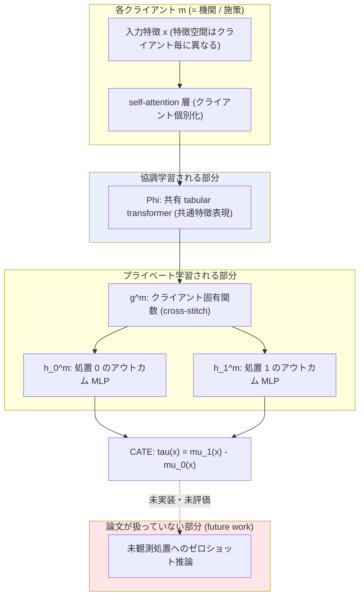

# 02. Federated Learning for Estimating Heterogeneous Treatment Effects (FedTransTEE)

[← index](index.md)

## 書誌情報

| 項目 | 内容 |
|------|------|
| タイトル | Federated Learning for Estimating Heterogeneous Treatment Effects |
| 著者 | Disha Makhija, Joydeep Ghosh, Yejin Kim |
| 年 | 2024（初版 2024-02-27 / 改訂 2024-06-24） |
| 会場 | **未確認**（arXiv 上は cs.LG のみ。査読会場の記載を確認できず） |
| リンク | https://arxiv.org/abs/2402.17705 |
| 実装 | 未確認 |

**名称について**: gather では「FedTransTEE」と呼称しているが、この略称が論文自身のものかは**未確認**である。以下では便宜上この呼称を用いる。

## 一言で言うと

処置が機関ごとに異なり集約解析ができない状況で、**共通特徴表現は協調学習し、処置固有の予測関数は各機関がプライベートに学習する**という分割構造で HTE を推定する federated 枠組みであり、本課題には「未観測処置への外挿」ではなく**この分割構造の設計思想**として効く。

## 問題設定

**「未観測介入」型を目指すと宣言しているが、本論文が実際に解いているのはそこではない。**

この点が本 retrieval における最重要の訂正である。gather 段階では「論文は明示的に、新しく設計された処置について過去データが全く存在しない状況を扱い、処置の説明文から treatment embedding を生成することで未観測処置の効果推定へ拡張できることを論じている」と記載されていたが、**原典を確認した結果、これは論文の実験内容ではなく future work の記述である**。

論文は末尾で次のように述べる。

> "In the future, our objective is to expand this solution to incorporate zero or few-shot inference capabilities, enabling us to assess the effectiveness and efficacy of a completely new treatment for a specific population."

すなわち zero/few-shot 推論は「**今後の目標**」であり、実験は**すべて既知の 3 処置**（臨床試験に存在する処置）に対して行われている。treatment description から embedding を生成して未観測処置へ外挿する、という機構は**本論文には実装も評価もされていない**。

したがって本論文の実際の問題設定は、「処置が機関ごとに異なり、特徴空間すら揃わない状況での、**既知処置**に対する HTE 推定の協調学習」である。本課題との関係は**間接的**であり、gather の関連度 ◎ は過大評価だったと判断する。実質 ○ 相当である。

## 手法

アウトカム予測は 3 層の合成として分解される。

$$\hat{\mu}_i^m(x) = h_i^m\big(g^m(\Phi(x))\big)$$

- $\Phi(\cdot)$: **共有されるグローバルな transformer**。共通特徴表現を担う
- $g^m(\cdot)$: クライアント $m$ 固有の関数（cross-stitch network）。2 つの潜在アウトカム間で共有される
- $h_i^m(\cdot)$: 処置条件 $i$ ごとのアウトカム固有 MLP

CATE は Neyman-Rubin の枠組みで 2 つの潜在アウトカムの差として得る。

$$\tau(x) = \mu_1(x) - \mu_0(x)$$

tabular transformer は multi-head attention を用いる。クライアント間で特徴空間が異なる問題（heterogeneous input feature spaces）に対しては、論文は「**self-attention 層をクライアントごとに個別化し、それ以外の transformer コンポーネントを協調学習する**」と述べる。

損失関数の明示的な式は本文に提示されていない（**未確認**）。

## 実験・結果

| 項目 | 内容 |
|------|------|
| データ | 3 つの ICH（脳内出血）ランダム化試験: **ATACH2, MISTIE3, ERICH**。病院拠点ごとに異なる内科的・外科的介入 |
| 処置数 | 3（すべて既知。未観測処置の評価は**無し**） |
| ベースライン | TNet, TARNet, FlexTENet（いずれも local 版）、FlexTENet-FL（federated ベースライン） |
| 指標 | RMSE-F（事実アウトカム予測誤差）、$\epsilon_{\text{ATT}}$（平均処置効果の乖離） |
| 主要結果（Table 1） | 提案手法が federated 設定で **RMSE-F = 0.49、$\epsilon_{\text{ATT}}$ = 0.035** を達成し、全ベースラインを上回った |

**注意**: ベースライン各手法の個別数値は本 retrieval では取得できなかった（**未確認**）。また、この 3 試験はいずれもランダム化試験であり、観測データにおける選択バイアスの問題は実験設定に含まれていない。マーケティングの観測ログとは前提が異なる。

**ゼロショット関連の実験は存在しない**。したがって gather の評価設計表にある「treatment description → embedding」の検証も本論文からは得られない。

## 本課題への適用可能性

### 効く点

- **「サイト = 施策」の読み替えで構造的同型が成立する**。各サイトの処置が互いに異なり、固有の特性を持ち、集約解析に不適合という設定は、「施策ごとに訴求もクーポン額もチャネルも違う」ユーザーの状況の構造をよく写す。
- **共有表現 + 処置固有ヘッドという分割が partial pooling の深層版として実装指針になる**。これは本論文から取れる最大の実用価値である。「顧客特徴の表現は全施策で共有し、施策固有の反応関数だけ分ける」という設計は、施策数が少ない状況で過学習を抑える現実的な構造である。プライバシー要件が無い単一組織内でも、この分割思想はそのまま使える。
- **特徴空間が揃わない状況への対処**（self-attention 層のみ個別化）は、過去施策ごとに取得できている変数が違う（古い施策には無い特徴量がある）という実務の頻出問題に対応する。これは意外に効く。
- cross-stitch による潜在アウトカム間の共有は、treated / control で別モデルを組む T-learner 的な分断を緩和する。

### 効かない/リスク点

- **本課題の中心的な要求（未観測施策への外挿）にこの論文は答えていない**。future work に書かれているだけである。gather の要約を信じて本論文を実装しても、ゼロショット能力は得られない。**これが本 retrieval で最も重要な発見である**。
- **CaML と「別経路から同じ結論に到達している」という gather の主張は成立しない**。同じ結論に到達していないからである。したがって「アプローチの頑健性の裏付け」としては使えない。CaML のゼロショット主張を支持する独立の証拠は、本論文からは得られない。
- **評価がランダム化試験データである**。3 つの RCT を使っており、割り付けバイアスが無い。過去施策が「効きそうな層」に恣意的に配布されている観測ログでの性能は未知である。
- **処置数 3 は本課題より更に少ない**。共有表現の学習には本来多数のクライアントが要るが、3 サイトで動いたという結果は、逆に言えば少数施策でも分割構造が機能しうる弱い傍証にはなる。ただし RMSE-F は事実アウトカムの予測誤差であって CATE の精度ではない点に注意が要る。
- **季節性・時間交絡は一切扱われていない**。サイト間の差異は空間的（病院）であって時間的ではない。数ヶ月おきの施策という時間軸の交絡には何の解も与えない。
- transformer ベースであり、施策数・サンプル数が小さい状況ではモデル容量が過剰になりうる。

## 実装ステップ

本論文は**ゼロショットの実装元としては使えない**ため、以下は「分割構造の設計」を借りる前提のステップである。

1. **本論文をゼロショット手法として実装しようとしない**。まず [01. CaML](01-zero-shot-causal-learning-caml.md) を主軸に据える。
2. 過去施策ごとに、取得できている特徴量の集合を洗い出す。施策間で特徴空間が揃っていない場合、本論文の「共有部分 + 個別 self-attention」の分割が参考になる。
3. $\hat{\mu}_i^m(x) = h_i^m(g^m(\Phi(x)))$ の 3 層分割を、施策横断モデルの設計テンプレートとして採用する。$\Phi$（顧客表現）は全施策で共有、$h_i^m$（施策固有の反応）は施策ごとに分ける。
4. **CaML の $w$ 条件付けと組み合わせる**。本論文の $h_i^m$ は施策ごとに独立なヘッドなので未観測施策には使えない。ここを CaML 流に「施策メタ情報 $w$ で条件付けた単一ヘッド」に置き換えると、分割構造の利点とゼロショット能力の両方が得られる。**これは本論文自身が future work として挙げた方向であり、本課題の実装としては最も筋が良い合成である**。
5. 評価は RMSE-F ではなく CATE ベースの指標（leave-one-campaign-out での RATE / Qini）で行う。事実アウトカムの予測精度は本課題の目的ではない。

## 関連リソース

- 原典: https://arxiv.org/abs/2402.17705
- 本クラスタ内: [01. CaML](01-zero-shot-causal-learning-caml.md)（本論文が future work とした能力を実際に実装している）
- [05. DR Fusion](05-doubly-robust-fusion-many-treatments.md)（処置をまとめる別解。本論文の「共有 vs 個別」を統計的に定式化したものと読める）
- gather 一覧: [../../../gather/20260715/c3/resources-zero-shot.md](../../../gather/20260715/c3/resources-zero-shot.md)
