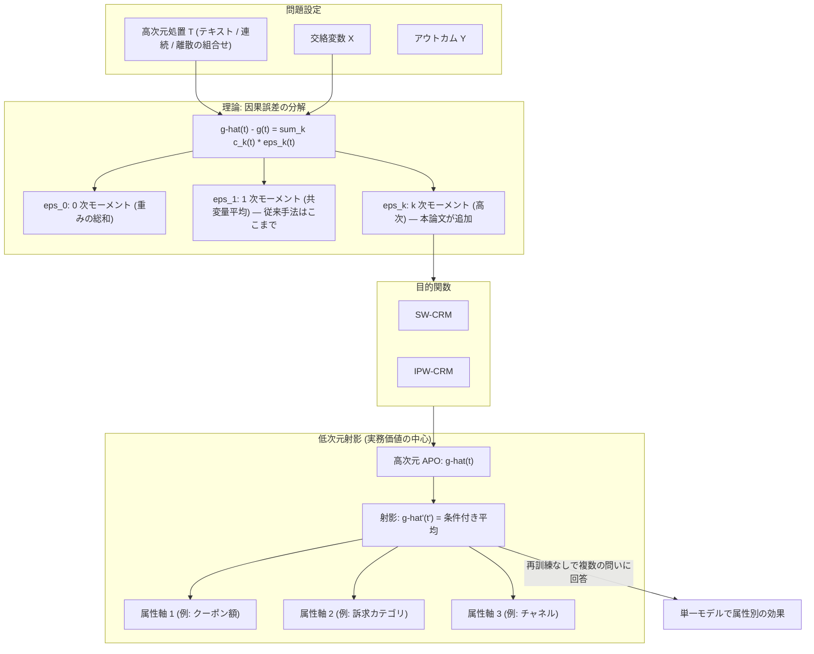

# 03. Causal Risk Minimization for High-Dimensional Treatments

[← index](index.md)

## 書誌情報

| 項目 | 内容 |
|------|------|
| タイトル | Causal Risk Minimization for High-Dimensional Treatments |
| 著者 | Nikita Dhawan, Arnav Paruthi, Andrew Kim, Lovedeep Gondara, Jekaterina Novikova, Chris J. Maddison |
| 年 | 2026（初版 2026-05-26） |
| 会場 | **未確認**（arXiv 上は cs.LG のみ） |
| リンク | https://arxiv.org/abs/2605.27281 |
| 実装 | 未確認 |

**注**: 著者順は arXiv ページ記載のものを採用した。gather 記載の順序（Dhawan, Kim, Novikova, Paruthi, Gondara, Maddison）とは異なっており、所属（University of Toronto / Vector Institute / Vanguard）は本 retrieval では**未確認**である。

## 一言で言うと

「起こりうる全ての介入が観測されている」という古典的因果推定量の暗黙の仮定を捨て、**因果誤差を次数の上がるモーメントバランシング誤差の級数へ分解**し、それを直接最小化する目的関数を設計した上で、高次元処置の効果を**低次元の処置属性へ射影**して単一モデルで複数の因果的問いに答えられるようにした論文である。

## 問題設定

**「未観測介入」型**である。ただし CaML とは切り口が異なる。

論文は、処置 $T$ が高次元空間（連続ベクトル、離散の組み合わせ、テキスト全体など）にわたる場合、**全ての介入を観測することが原理的に不可能**であり、標準的な因果推定量の前提が崩れる点から出発する。関心量は Average Potential Outcome（APO）$g(t) = \mathbb{E}[Y(t)]$ であり、strong ignorability と positivity を仮定する。

CaML が「介入をメタ学習のタスクとして扱う」経験的枠組みなのに対し、本論文は「**高次元処置空間における学習問題**」として捉え直し、誤差分解という理論的足場を与える。両者は競合ではなく補完関係にある。

なお、本論文の関心は主として APO $g(t)$（処置ごとの平均的な潜在アウトカム）であり、CaML のような個人ごとの CATE $\tau(w,x)$ ではない点に注意が要る。個別化の粒度が異なる。

## 手法

### 誤差分解

中心的な理論結果は、Assumption 1（条件付きアウトカム関数が次数 $\le K$ の多項式）の下で、APO の推定誤差が**モーメントバランシング誤差の級数へ分解される**ことである。

$$\hat{g}(t) - g(t) = \sum_{k=0}^{K} c_k(t) \cdot \varepsilon_k(t), \qquad \varepsilon_k(t) = \mathbb{E}[\hat{w}(T,X) \cdot X^k \mid T=t] - \mathbb{E}[X^k]$$

$\varepsilon_k(t)$ は $k$ 次のモーメントに関するバランシング誤差である。$k=0$ は重みの総和、$k=1$ は共変量平均のバランス、$k=2$ 以降は高次モーメントのバランスに対応する。この分解は binary / discrete / continuous いずれの交絡変数についても成立する。

この結果の意味は明快である。**従来の共変量バランシング（1 次モーメントのみを揃える）では不十分であり、アウトカム関数が非線形なら高次モーメントまで揃えないと因果誤差が残る**、ということである。

### 目的関数

分解から直接、2 つの目的関数が導かれる。

$$\text{SW-CRM}: \quad \arg\min_m \sum_i \mathcal{L}\big(g(T_i), \hat{w}(T_i, X_i) Y_i\big)$$

$$\text{IPW-CRM}: \quad \arg\min_m \sum_i \mathcal{L}\left(g(T_i), \frac{\hat{p}_t(T_i)}{\hat{e}(T_i, X_i)} Y_i\right)$$

### 低次元射影

実務的に最も価値がある部分である。Assumption 2（条件付き分布 $p_{t'|t}$ が既知）の下で、処置属性 $t'$ への射影された APO は次で計算される。

$$\hat{g}'(t') = \frac{\sum_i \mathbb{I}(T_i' = t') \, \hat{g}(T_i)}{\sum_i \mathbb{I}(T_i' = t')}$$

これにより、**高次元処置について一度推定器を訓練すれば、任意の処置属性軸への効果を再訓練なしに読み出せる**。

## 実験・結果

### データセットと結果

| 設定 | 内容 | 主要結果 |
|------|------|---------|
| Linear continuous | ガウシアンの交絡変数・処置 | SW-CRM（$K=1$）が**オラクル性能に一致** |
| Synthetic discrete | 高次元離散処置、二値アウトカム | SW-CRM（$K=2$）が **relative MAE 0.121 / APO 相関 0.996** |
| **Amazon Reviews 半合成** | レビュー 10,000 件を処置、評価数を 8 次元の交絡変数、二値の購買アウトカムを **GPT-5.1** で生成 | SW-CRM（$K=2$）が **relative MAE 0.220 / APO 相関 0.874** |

ベースラインは OI（Outcome Imputation）、OI-CRM、IPW-CRM、および $K$ を変えた SW-CRM の各変種である。指標は relative MAE、真値との APO 相関、バランス誤差。

**射影の結果**: 「射影された推定値は、属性ごとに個別に再訓練した推定器と同等の性能を、追加の訓練コストなしに達成した」。これが本論文の実務的な主張の核である。

**注意点**:
- ベースライン各手法の個別数値は本 retrieval では取得できず（**未確認**）、SW-CRM がどれだけ差をつけたかの定量比較はできていない。
- 全実験が**合成ないし半合成**である。Amazon Reviews も処置は実データだがアウトカムは GPT-5.1 による生成であり、真の因果構造は研究者が設計したものである。実データでの検証は無い。
- $K=2$（2 次モーメントまで）で良好な結果が出ている点は、実装負荷の観点で朗報である。

## 本課題への適用可能性

### 効く点

- **処置属性への射影が本課題に直撃する**。「クーポン額を上げると効果はどう動くか」「この訴求軸単体でどれだけ効くか」を、属性ごとにモデルを組み直さずに 1 つの推定器から読み出せる。これは施策設計時の what-if 分析（gather の特許 US 11,715,130 が商用要件として掲げるもの）を、統計的な足場の上で実現する道筋である。**他のどの論文にもない価値**という gather の評価はここでは支持できる。
- **高次モーメントバランシングが選択バイアス対策として効く**。過去施策が「効きそうな層」に配布されているという本課題の交絡に対し、1 次モーメント（平均）だけ揃える従来のバランシングでは不足だと理論的に示している。反応関数が非線形なマーケティングでは、この指摘は実質的である。$K=2$ 程度で十分という実験結果も実装可能性を支える。
- **「全ての介入が観測されている」仮定の破綻を理論側から定式化している**。CaML が経験的にゼロショットを示すのに対し、本論文はなぜそれが可能／不可能かの誤差論を与える。両者を併せて読むと、ゼロショットの限界がどこから来るかが理解できる。
- **テキスト処置を扱う**。訴求文面を処置として直接入力できる設計であり、施策メタ情報を構造化ベクトルに落とす際の情報損失を避けられる可能性がある。

### 効かない/リスク点

- **APO であって CATE ではない**。本論文の関心量は $g(t) = \mathbb{E}[Y(t)]$ という処置ごとの平均であり、個人ごとの効果 $\tau(w,x)$ ではない。ユーザーが個別ターゲティング（誰に配るか）を目的とするなら、本論文だけでは足りない。「どの施策が全体として効くか」の比較には使えるが、「誰に打つか」には CaML 側が要る。**この区別は gather では曖昧だった**。
- **Assumption 1（アウトカム関数が次数 $\le K$ の多項式）が強い**。マーケティングの反応関数が低次多項式で書けるかは疑わしい。閾値効果（クーポン額が一定を超えると急に効く）は多項式近似が苦手とする形状である。$K$ を上げれば表現力は増すが、高次モーメントの推定は分散が爆発する。
- **Assumption 2（条件付き分布 $p_{t'|t}$ が既知）が射影の前提**。属性への射影を使うには、高次元処置から属性への写像の分布を知っている必要がある。「この訴求文面のクーポン額属性は 500 円」のような決定的な写像なら問題ないが、属性が処置から一意に定まらない場合は仮定が問題になる。
- **実データ検証が無い**。全て合成・半合成であり、しかも Amazon Reviews のアウトカムは LLM 生成である。生成過程の仮定が評価結果を規定しており、現実のマーケティング反応で同じ性能が出る保証はない。
- **施策数の少なさへの対処が無い**。本論文が想定するのは「処置空間が広大」な状況であり、Amazon Reviews では 10,000 件の処置を使っている。年数本の施策では、そもそもモーメントバランシングの推定に必要なサンプルが処置あたりに存在しない。**高次モーメントの推定は特にサンプルを食う**ため、少数施策では $K=2$ すら不安定になりうる。
- **季節性の交絡には無力**。$X$ に時間的文脈を入れればバランシングの対象にはできるが、施策と時期が完全に交絡している（各施策が 1 時点でしか実施されていない）場合、positivity が破れる。この状況では本論文の枠組みは identification 自体が成立しない。
- 2026 年の最新論文であり、追試・査読状況が**未確認**である。理論の正しさは独立に検証されていない可能性がある。

## 実装ステップ

1. **目的を切り分ける**。「どの施策が効くか（施策間の順位付け）」なら本論文の APO 射影が主役、「誰に打つか（個別ターゲティング）」なら [01. CaML](01-zero-shot-causal-learning-caml.md) が主役である。多くの実務ではまず前者が問われるため、本論文の優先度は高い。
2. **処置属性 $t'$ の軸を定義する**。クーポン額・訴求カテゴリ・チャネル・対象条件。各施策からこれらの属性が一意に定まることを確認する（Assumption 2 の実務的チェック）。
3. **交絡変数 $X$ を定め、時間・季節を含めるか判断する**。含めると positivity のチェックが必須になる。施策と時期が 1:1 なら、この時点で識別不能が判明する可能性がある。**それが分かること自体が価値である**。
4. **SW-CRM を $K=1$ から実装し、$K=2$ へ上げて安定性を見る**。施策数・サンプル数が小さい状況では $K$ を上げると分散が増えるため、$K$ ごとのバランス誤差 $\varepsilon_k$ を実際に監視する。
5. **射影 $\hat{g}'(t') = \sum_i \mathbb{I}(T_i'=t') \hat{g}(T_i) / \sum_i \mathbb{I}(T_i'=t')$ を実装し、属性軸ごとの効果を読み出す**。これが what-if 分析の出力になる。
6. **属性ごとに個別に組んだモデルと射影の結果を突き合わせる**（論文が「同等」と主張している部分の自前検証）。ここが乖離するなら射影の仮定が破れている。
7. CaML と併用する場合、本論文の高次モーメントバランシングを CaML の擬似アウトカム生成の前処理として組み込むのが自然な合成である。CaML は unconfoundedness を仮定するだけで明示的なバランシング機構を持たないため、ここを補える。

## 関連リソース

- 原典: https://arxiv.org/abs/2605.27281
- 本クラスタ内: [01. CaML](01-zero-shot-causal-learning-caml.md)（個別 CATE 側。本論文と補完関係）
- [05. DR Fusion](05-doubly-robust-fusion-many-treatments.md)（calibration weighting による別のバランシング解）
- gather の論点 5「選択バイアスの除去が全手法に共通する前処理」の理論的中核が本論文である
- gather 一覧: [../../../gather/20260715/c3/resources-zero-shot.md](../../../gather/20260715/c3/resources-zero-shot.md)
