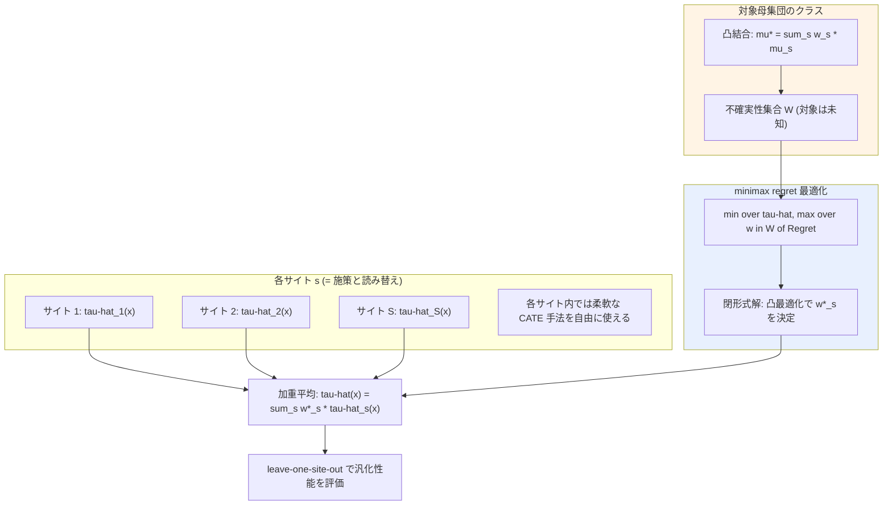

# 04. Minimax Regret Estimation for Generalizing Heterogeneous Treatment Effects with Multisite Data

[← index](index.md)

## 書誌情報

| 項目 | 内容 |
|------|------|
| タイトル | Minimax Regret Estimation for Generalizing Heterogeneous Treatment Effects with Multisite Data |
| 著者 | Yi Zhang, Melody Huang, Kosuke Imai |
| 年 | 2024（初版 2024-12-15 / 改訂 2026-04-30） |
| 会場 | **未確認**（arXiv stat.ME。査読会場の記載を確認できず） |
| リンク | https://arxiv.org/abs/2412.11136 |
| 実装 | 未確認 |

**所属について**: gather は Zhang, Huang（Yale）, Imai（Harvard）と記載するが、本 retrieval では所属を**確認できていない**。

## 一言で言うと

対象母集団がソースサイトと**未知かつ観測不能な形で異なりうる**という前提の下で、対象 CATE を「サイト固有 CATE の凸結合」の族としてモデル化し、その族上での**最悪ケースの regret を最小化**することで、解釈可能な閉形式解（サイト固有モデルの加重平均）として汎化可能な CATE モデルを得る枠組みである。

## 問題設定

**どちらでもない。「未観測の対象母集団」型**である。

この位置づけの明確化が重要である。本論文で未知なのは**介入ではなく対象母集団**である。介入自体（処置 $W \in \{0,1\}$）は全サイトで既知かつ共通であり、サイトごとに違うのは母集団の分布と効果の異質性である。

したがって本論文は「実績ゼロ施策への外挿」には**直接は答えない**。gather がこれを ○ とし「手法としてより評価設計の教科書として読む」と位置づけたのは妥当である。本 retrieval もその評価を支持する。**本論文の価値は手法ではなく leave-one-site-out という評価プロトコルにある**。

サイトを施策に読み替えたときに何が得られるかは慎重に見る必要がある。「サイト = 施策」と読み替えると、各サイト固有 CATE は「その施策の効果」であり、未知の対象母集団への汎化は「次に打つ施策の対象層が過去と違う」状況に対応する。これは本課題の**半分**（対象層のシフト）に答えるが、もう半分（施策内容自体が未知）には答えない。

## 手法

複数サイト $s = 1, \ldots, S$、共変量 $X_i$、処置 $W_i \in \{0,1\}$、アウトカム $Y_i$ を潜在アウトカムの枠組みで扱う。

対象母集団のクラスを、サイト固有の分布の凸結合として定義する。

$$\mu^* = \sum_s w_s \mu_s, \qquad w_s \ge 0, \quad \sum_s w_s = 1, \quad w \in \mathcal{W}$$

このクラス上で最悪ケースの regret を最小化する。regret は、真の対象母集団を知るオラクルとの性能差として定義される。

$$\min_{\hat\tau} \max_{w \in \mathcal{W}} \ \mathrm{Regret}(\hat\tau; w)$$

得られる解は**サイト固有 CATE モデルの加重平均**という閉形式を持つ。

$$\hat{\tau}(x) = \sum_s w_s^* \, \hat{\tau}_s(x)$$

$w_s^*$ は凸最適化問題を解いて定まり、サイト間のバイアスと分散のトレードオフを均衡させる。

構成上の利点は、**各サイト内では任意の CATE 推定手法を使える**ことである。集約は加重平均という後処理で済むため、既存の施策別 uplift モデルをそのまま部品として使える。

## 実験・結果

**ここは正直に記す。本 retrieval では実験の詳細を検証できなかった。**

arXiv の abs ページからは、「simulations and a real-world application を通じて、既存手法より robustness と generalizability が改善することを示した」という要旨レベルの記述しか得られなかった。PDF の全文取得を試みたが、返ってきた内容は具体的な数値・データセット名・ベースライン名を一切含まない一般的な記述に終始しており、**原典の実験内容を正確に反映しているとは判断できなかったため、採用しない**。

| 項目 | 状態 |
|------|------|
| シミュレーション設計 | **未確認** |
| 実データの応用先 | **未確認**（PDF 取得試行では「microcredit study の複数国 RCT」という記述が得られたが、独立に検証できず**信頼できない**ため採用しない） |
| leave-one-site-out の具体的手続き | **未確認**（要旨レベルでは言及を確認できず） |
| ベースライン名 | **未確認** |
| 結果の数値 | **未確認** |

**重要**: gather は「各実験サイトを hold out して対象母集団とみなし、残りをソースとする leave-one-out 評価を実施している」と記載し、これを「leave-one-site-out 評価の具体的な実装例」として推薦の根拠にしている。しかし**本 retrieval ではこの記述を原典で確認できなかった**。手法の性質（対象母集団を未知とし凸結合でモデル化する）からしてそのような評価が自然ではあるが、**実際に論文がそのプロトコルを回しているかは未確認**である。

本論文を「評価設計の教科書」として使う場合、**この点を原典（PDF を直接開く、または著者の公開コードを見る）で必ず確認すること**を推奨する。本 retrieval の環境ではその検証ができなかった。

## 本課題への適用可能性

### 効く点

- **閉形式解の実装が極めて軽い**。$\hat{\tau}(x) = \sum_s w_s^* \hat{\tau}_s(x)$ という加重平均であり、各施策で既存の uplift モデル（S/T/X-learner でも何でも）を組んだ上で、重みを凸最適化で決めるだけで済む。**既存資産を捨てずに済む**点は、いきなり CaML のようなメタ学習基盤を作るより導入障壁が低い。段階的移行の第一歩として現実的である。
- **「対象母集団が未知の形で異なる」という前提が本課題の半分に正確に効く**。次施策の対象層が過去施策と違うのは常態であり、楽観的な仮定（対象が既知・同一）を置かないのは実務的に正しい。
- **minimax regret という保守性が少数施策と相性が良い**。施策数が少なく推定が不安定な状況では、平均的に良い手法より最悪ケースを抑える手法の方が意思決定を支えやすい。「最悪でもこの程度」が言える価値は大きい。
- **サイト内の手法選択が自由**という設計は、施策ごとにデータ量も特徴量も違う本課題の実情に合う。データが厚い施策には複雑なモデル、薄い施策には単純なモデルを使い分けられる。
- **leave-one-site-out の発想そのもの**が、本課題の評価設計に直結する（プロトコルの詳細は原典で要確認）。

### 効かない/リスク点

- **未観測介入には答えない**。これが最大の限界である。本論文の枠組みでは、新施策の CATE は「過去施策の CATE の加重平均」としてしか表現できない。**施策メタ情報を一切使わない**ため、「クーポン 1500 円という未実施の水準」に対して原理的に何も言えない。加重平均は既存施策の凸包の内側にしか出られず、**外挿ができない**。本課題の中心的要求に対しては構造的に不足している。
- **凸結合クラスの妥当性が本課題では疑わしい**。次施策の効果が過去施策の効果の凸結合で書けるという仮定は、「新施策は過去施策の中間的な何か」を意味する。真に新しい訴求軸を導入した施策はこのクラスの外に出る。CaML の組み合わせ汎化が「軸の掛け合わせ」で外挿できるのと対照的である。
- **施策数 $S$ が小さいと重み推定が不安定**。凸結合の重みを $S$ 個推定するが、$S$ が数本では各 $\hat{\tau}_s$ 自体が不安定であり、その加重平均も不安定になる。minimax の保守性がこれを緩和する方向には働くが、解決はしない。
- **季節性の交絡が「サイト固有 CATE」に紛れ込む**。サイト = 施策と読み替えると、$\hat{\tau}_s$ は「施策 $s$ の効果」だが、実際には「施策 $s$ の効果 × 実施時期の効果」が混ざったものである。この分解は本論文の枠組みでは行われない。加重平均を取ると、季節性の混入したまま平均されることになる。**時期の異なる施策を凸結合するとき、何を推定しているのかが不明瞭になる**のは本課題における深刻なリスクである。
- 実験・評価の詳細が本 retrieval で未確認であるため、**推薦の根拠自体が検証されていない**。

## 実装ステップ

1. **まず原典で leave-one-site-out の実験節を確認する**。本 retrieval の最大の欠落である。gather の推薦根拠（評価プロトコルの実装例）が事実かをここで確定させる。
2. 本手法を**ゼロショット手法としては採用しない**。未観測施策には原理的に答えられない。位置づけは (a) 評価プロトコルの参照、(b) 対象層シフトへの対処、(c) 既存モデル資産を活かした暫定解、の 3 つに限定する。
3. 各過去施策 $s$ について、手元の既存手法で $\hat{\tau}_s(x)$ を推定する（施策ごとのデータ量に応じて手法を選ぶ）。
4. 凸結合の重み $w_s^*$ を minimax regret の凸最適化で決定する。不確実性集合 $\mathcal{W}$ の設計（どこまでの対象シフトを想定するか）が実質的なチューニングポイントになる。
5. **leave-one-campaign-out で、この加重平均を [01. CaML](01-zero-shot-causal-learning-caml.md) 型のゼロショット予測の対抗馬として評価する**。これが本論文の最も有益な使い方である。「施策メタ情報を使わない加重平均」がベースラインとなり、CaML がそれをどれだけ上回るかで**施策メタ情報の価値そのものが測れる**。この比較設計は本クラスタの中心的な問いに直答する。
6. 季節性については、$\hat{\tau}_s$ の推定時に時期の効果を分離できるか検討する。分離できないなら、加重平均の解釈に注意書きを付す。

## 関連リソース

- 原典: https://arxiv.org/abs/2412.11136
- 本クラスタ内: [01. CaML](01-zero-shot-causal-learning-caml.md)（本論文が原理的にできない外挿を行う。対比で読むと差分が明確）
- [05. DR Fusion](05-doubly-robust-fusion-many-treatments.md)（施策をまとめる別解。融合 vs 加重平均の対比）
- gather 一覧: [../../../gather/20260715/c3/resources-zero-shot.md](../../../gather/20260715/c3/resources-zero-shot.md)
