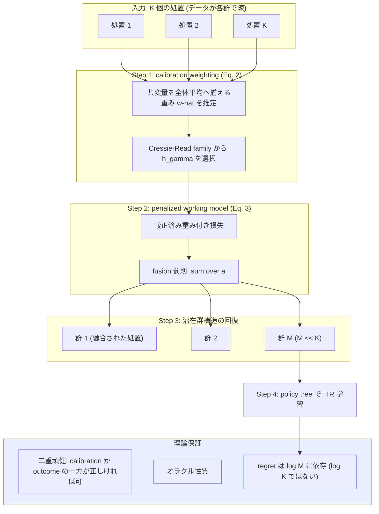

# 05. Doubly Robust Fusion of Many Treatments for Policy Learning

[← index](index.md)

## 書誌情報

| 項目 | 内容 |
|------|------|
| タイトル | Doubly Robust Fusion of Many Treatments for Policy Learning |
| 著者 | Ke Zhu, Jianing Chu, Ilya Lipkovich, Wenyu Ye, Shu Yang |
| 年 | 2025 |
| 会場 | ICML 2025（採択） |
| リンク | https://arxiv.org/abs/2505.08092 |
| 実装 | 未確認 |

## 一言で言うと

処置の選択肢が多数あってデータが各群で疎になる状況で、**calibration weighting で共変量をバランスさせた上で、fused lasso 型の罰則により類似した処置を自動的に融合**し、潜在的な処置群構造を二重頑健に回復する手法であり、ユーザーの「似た施策をグルーピングする」という発想の統計的に厳密な定式化である。

## 問題設定

**どちらでもない。「既知だが多数・疎な処置」型**である。

$K$ 腕の処置 $A \in \{1, \ldots, K\}$ はすべて**訓練時に観測されている**。未知なのは処置ではなく、**処置間の潜在的な群構造**（どの処置が実質的に同じ効果を持つか）である。オラクルの群構造とは、処置が $M$ 個の群に分割され、同じ群内では $\mu_a(X) = \mu_{a'}(X)$ が成り立つような分割を指す。

したがって本論文はゼロショットではない。gather の関連度 ○ と「ユーザーの当初発想を直接検証する 1 本」という位置づけは妥当である。本論文の価値は、**ヒューリスティックなクラスタリングに走る前に、統計的に正しい融合の作法を知る**ことにある。

関心量は個別化処置ルール（ITR）$d(\cdot): X \to A$ の価値 $V(d) := \mathbb{E}\{Y(d(X))\}$ であり、CATE 予測そのものではなく**方策学習**が目的である点は本課題との差分として押さえておく必要がある。

## 手法

### calibration weighting（Eq. 2）

各処置 $a$ について、共変量を全体平均に揃える重みを求める。

$$\min_{w_i} \sum h_\gamma(w_i) \quad \text{s.t.} \quad \sum w_i X_i = \bar{X}, \quad \sum w_i = 1$$

$h_\gamma$ は Cressie–Read family から選ばれ、較正済み重み $\hat{w}_i$ が得られる。これにより処置群間の共変量不均衡を補正する。

### penalized working model（Eq. 3）

較正済み重みの下で、処置ごとの係数 $\zeta_a$ を fusion 罰則付きで推定する。

$$\min_\zeta \left\{ \frac{1}{n} \sum_a \sum_{i: A_i = a} \hat{w}_i \, \mathcal{L}(\tilde{Y}_i, X_i^\top \zeta_a) + \sum_{a < a'} p_{\lambda_n}\big(\|\zeta_a - \zeta_{a'}\|_1\big) \right\}$$

第 2 項が fused lasso 型の罰則であり、**係数が近い処置どうしを同一視（融合）する**方向に働く。融合された処置群が潜在的な群構造の推定になる。

### 理論保証

| 結果 | 内容 |
|------|------|
| **二重頑健性**（Assumption 3.3） | (i) calibration weighting が正しい（$\hat{w}_i = 1/\pi_{A_i}(X_i)$）**または** (ii) アウトカムモデルが正しい（$\mathbb{E}\{\varepsilon(a) \mid X\} = 0$）のいずれか一方が成立すれば一致性が成り立つ。**両方は不要** |
| **オラクル性質**（Theorem 3.12） | 正則条件と群間の十分な分離の下で、fused lasso 推定量 $\hat\zeta$ は確率 1 に近づく形でオラクル推定量 $\hat\zeta^{or}$ に一致する |
| **regret bound**（Proposition 3.18） | 深さ $D$ の policy tree、$M$ 個の処置群に対し $R(\hat{d}^B) = O_P\left(\left\{\sqrt{(2^D-1)\log p + 2^D \log M} + \frac{4}{3} D^{1/4}\sqrt{2^D-1}\right\}\sqrt{V_*/n}\right)$ |

regret bound が $\log M$ に依存する点は重要である。**処置を $K$ 個から $M$ 個の群へ融合できれば、regret が $\log K$ ではなく $\log M$ で抑えられる**。これが融合の理論的な旨味である。

## 実験・結果

### シミュレーション設計

- $M = 4$ 処置群、各群 $|G_b^*| = 4$ 処置、計 $K = 16$ 処置
- 群間で共変量シフト: $X_1 \sim \mathrm{Bernoulli}(0.3\text{–}0.6)$、層別サンプルサイズ 75–150
- 非線形アウトカム平均（群 1 の例）: $3\exp\{0.7 + 0.1X_1 - 0.3X_2 - 0.2X_3^2 + 0.4\,\mathrm{sign}(X_2^2 + 3X_3 - 2.5)\}$
- 200 反復

### シミュレーション結果（Table 5）

| 手法 | ARI | 回復した群数 | Value |
|------|-----|-------------|-------|
| Baseline（融合なし、CAIPWL + depth-3 policy tree） | — | 16 | 8.77 (0.08) |
| 融合のみ（calibration なし） | 0.26 (0.14) | 10.73 (1.93) | 8.78 (0.09) |
| **CW + Fusion + Tree（提案）** | **0.96 (0.06)** | **4.33 (0.60)** | **8.89 (0.11)** |
| Ma et al. (2022) | 0.26 (0.14) | 10.73 (1.93) | 8.51 (0.12) |

真の群数は 4 であり、提案手法は 4.33 群を回復（ARI 0.96）した。**calibration weighting の有無が決定的である**ことが読み取れる。ARI が 0.26 → 0.96 へ跳ね、回復群数も 10.73 → 4.33 と真値に近づいた。共変量をバランスさせずに融合すると、**群構造の推定が壊れる**。

一方で policy value の差は 8.77 → 8.89 と小さい。**群構造の回復精度ほどには最終的な方策価値は改善していない**点は正直に見るべきである。

### 実データ（CLL/SLL、Flatiron Health EHR）

- $N = 10{,}346$ 患者
- 一次治療: cBTKi mono (3,392)、AntiCD20+Chemo (1,726)、AntiCD20 mono (1,230)、BCL2i+AntiCD20 (463)、cBKTi+AntiCD20 (408)、Chemo only (215)、Other (412)
- アウトカム: 全生存（二値）
- 共変量 10 個: 人種、地域、SES、性別、ECOG、Rai stage、リンパ節腫脹、年齢、初回治療までの時間
- 所見: **融合は単剤療法どうしをまとめ、併用療法は分離した**。高齢・早期診断の患者は化学療法単独へ、若年患者は併用療法へ振り分けられた

**注意点**: 実データ結果の信頼区間は報告されておらず、外部検証セットも報告されていない（論文の欠落）。また処置数の分布が極めて不均衡（3,392 対 215）である。

## 本課題への適用可能性

### 効く点

- **ユーザーの「似た施策をグルーピングする」発想に、オラクル性質付きの正しい作法を与える**。ヒューリスティックに「この施策とこの施策は似てそう」とまとめるのではなく、データから群構造を推定し、しかもそれが真の構造に一致することが理論保証される。**当初発想を捨てる必要はなく、正しくやる方法がある**というのが本論文の答えである。
- **calibration weighting の重要性が実験で定量的に示された**。ARI 0.26 → 0.96 という差は、「過去施策が異なる対象層に打たれている」本課題の状況で、バランシングを省くと施策のグルーピング自体が壊れることを意味する。gather の論点 5（選択バイアス除去は全手法共通の前処理）を最も明確に裏付ける実験証拠である。
- **二重頑健性が実務的に現実的**。calibration かアウトカムモデルのどちらか一方が当たっていればよい。両方を正しく特定できる保証がないマーケティングでは、この緩さは価値がある。
- **regret が $\log M$ に依存する**という結果は、施策を融合することの利得を定量化している。施策数が増えても、実質的な群数が少なければ方策学習は劣化しない。
- **施策数 16 という規模が本課題に近い**。CaML の 745 単剤や本論文の $K=16$ を比べると、後者の方がユーザーの現実（年数本〜十数本）に桁が近い。少数処置での挙動を示す数少ない実験である。

### 効かない/リスク点

- **ゼロショットではない。未実施施策には一切答えない**。融合は既知処置間の関係を推定するものであり、新しい施策を既存群のどこに置くかを決める機構は無い。**施策メタ情報を使わない**ため、未実施施策は群構造のどこにも配置できない。本課題の中心的要求には構造的に届かない。
  - ただし**組み合わせ外挿の文脈では使い道がある**。「新施策が既存のどの群に属するか」を施策メタ情報から予測する分類器を別途組めば、群ごとの効果を流用できる。これは本論文の枠外の拡張だが、CaML より軽量な代替案になりうる。
- **目的が ITR（方策学習）であって CATE 予測ではない**。「誰にどの施策を割り当てるか」には答えるが、「この新施策の効果はどれくらいか」という予測値そのものは主目的でない。ユーザーが効果量の見積もりを求めるなら、ずれる。
- **施策数が本当に数本なら融合の旨味が消える**。$K=16$ を $M=4$ に融合するから意味があるのであって、$K=5$ 程度では融合の余地が小さい。この場合、本論文を導入するコストに見合わない可能性が高い。**まず施策数を数えるべきである**。
- **線形 working model**（$X_i^\top \zeta_a$）が融合の判定基準である。係数ベクトルの近さで処置の類似性を測るため、反応関数が強い非線形性を持つ場合、線形近似の係数が近いだけで実質的に異なる施策が融合されうる。シミュレーションのアウトカムは非線形だが、working model は線形である点に注意が要る。
- **季節性の交絡が融合を誤らせる**。同じ内容の施策を別時期に打った場合、時期の効果で係数がずれて別群に分かれる、あるいは逆に無関係な施策が同時期の外部要因で似た係数を持ち融合される。**時期を共変量に入れてバランシングの対象にしないと、群構造は「施策の類似性」ではなく「時期の類似性」を拾う**。本課題における最大の実装上の注意点である。
- policy value の改善幅が小さい（8.77 → 8.89）。群構造が正しく回復できても、最終的な意思決定の質はそこまで変わらないかもしれない。
- 実データ結果に信頼区間・外部検証が無い。

## 実装ステップ

1. **施策数 $K$ を数え、融合の余地があるか判断する**。$K$ が 10 を切るなら本手法の優先度は下げてよい。$K$ が数十あるなら有力である。
2. **時期・季節を共変量 $X$ に明示的に含める**。これを怠ると群構造が時期を拾う。本課題における本手法の成否はここで決まる。
3. **calibration weighting を実装する**（Eq. 2）。Cressie–Read family から $h_\gamma$ を選び、各施策群の共変量を全体平均へ揃える。**この工程を省略しない**。実験が示す通り、省くと群構造の推定が壊れる（ARI 0.26）。
4. **fusion 罰則付き working model を解く**（Eq. 3）。$\lambda_n$ の選択で融合の粒度が決まるため、複数の $\lambda_n$ で群構造を出し、ドメイン知識と突き合わせて妥当性を確認する。
5. **回復された群構造をドメイン知識で検証する**。実データ実験が「単剤どうしが融合され併用療法は分離した」と解釈可能な構造を出したように、「クーポン施策どうしが融合され、ブランディング施策は分離した」のような納得できる構造が出るかを見る。出ないなら仮定が破れている。
6. **群ごとに効果を集約し、policy tree で ITR を学習する**（必要なら）。
7. **拡張として、施策メタ情報から「新施策がどの群に属するか」を予測する分類器を検討する**。これにより本手法をゼロショット方向へ延伸できる。[01. CaML](01-zero-shot-causal-learning-caml.md) のフル実装が重すぎる場合の軽量な代替経路になる。

## 関連リソース

- 原典: https://arxiv.org/abs/2505.08092
- 本クラスタ内: [03. Causal Risk Minimization](03-causal-risk-minimization-high-dimensional-treatments.md)（moment balancing という別のバランシング解。calibration weighting と対比できる）
- [04. Minimax Regret](04-minimax-regret-multisite-hte.md)（施策をまとめる別解。融合 vs 加重平均）
- [01. CaML](01-zero-shot-causal-learning-caml.md)（本手法が届かない未観測施策への外挿）
- gather 一覧: [../../../gather/20260715/c3/resources-zero-shot.md](../../../gather/20260715/c3/resources-zero-shot.md)
