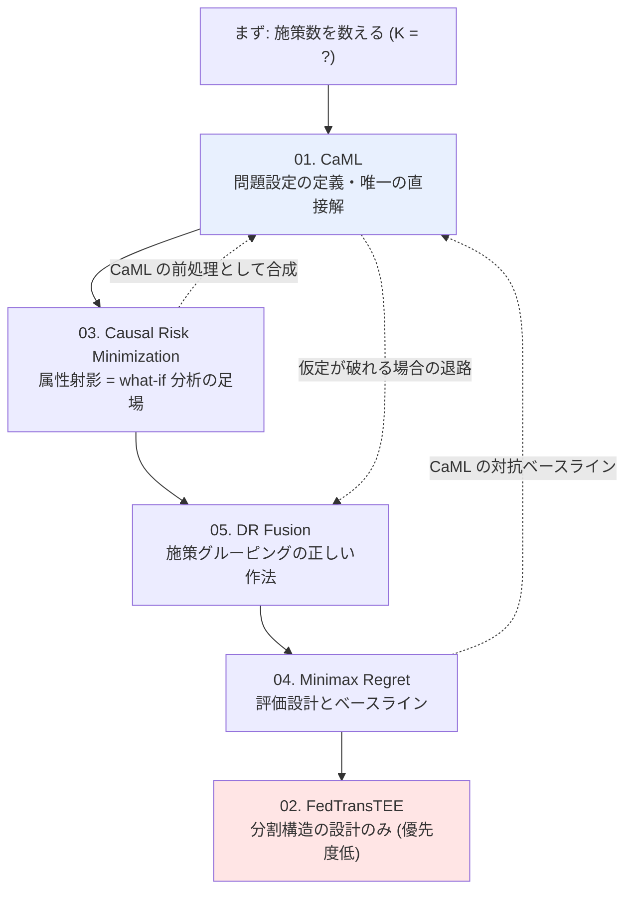
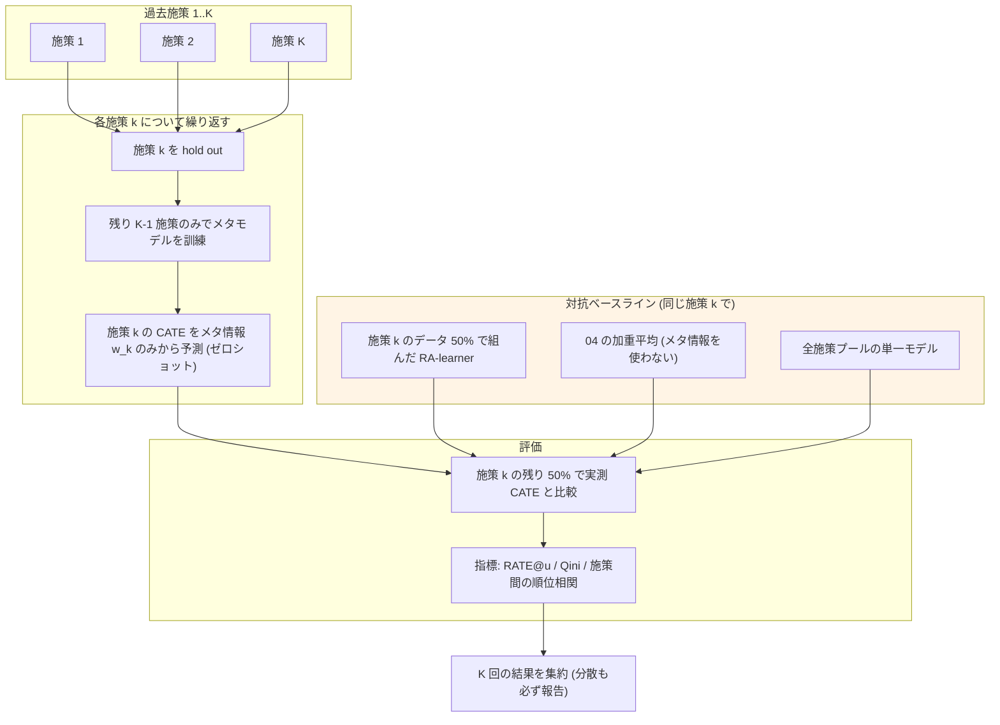

# C3: Zero-shot 施策効果予測 — retrieval レポート索引

[← gather 一覧](../../../gather/20260715/c3/resources-zero-shot.md)

gather の「retrieval 推奨」上位 5 本を原典で精読した結果である。**gather 段階の要約には 2 箇所の重大な誤りがあり、本 retrieval で訂正した**（下記「gather からの訂正」参照）。

## レポート一覧

| # | タイトル | 年 | 問題設定の型 | 本課題への実効 |
|---|---------|----|-----------|--------------|
| [01](01-zero-shot-causal-learning-caml.md) | Zero-shot causal learning (CaML) | 2023 | **未観測介入** | ◎ 唯一の直接的回答 |
| [02](02-federated-learning-heterogeneous-treatment-effects.md) | Federated Learning for Estimating HTE (FedTransTEE) | 2024 | 既知処置（ゼロショットは future work） | ○ 分割構造の設計思想のみ |
| [03](03-causal-risk-minimization-high-dimensional-treatments.md) | Causal Risk Minimization for High-Dimensional Treatments | 2026 | 未観測介入（ただし APO であって CATE ではない） | ◎ 属性射影と高次バランシング |
| [04](04-minimax-regret-multisite-hte.md) | Minimax Regret Estimation for Generalizing HTE with Multisite Data | 2024 | 未観測**母集団** | ○ 評価設計とベースライン |
| [05](05-doubly-robust-fusion-many-treatments.md) | Doubly Robust Fusion of Many Treatments for Policy Learning | 2025 | 既知・多数・疎な処置 | ○ 施策グルーピングの正しい作法 |

## gather からの訂正

原典確認により、gather の記述のうち以下は**事実として誤り**である。retrieval の最も重要な成果として先に記す。

1. **CaML の「ゼロショットが直接データ持ちベースラインを上回った」は過大**。原典の記述は "performs stronger than **6 of the 7** baselines ... and performs **comparably** to the strongest baseline trained directly on the test interventions (RA-learner)" である。数値でも RA-learner 0.47 vs CaML 0.48（RATE@0.999）で互角にすぎない。「8×」は弱いベースライン（X-learner 0.03 等）との比である。正しい含意は「**ゼロショットは直接データで組んだ最良モデルと同等に達しうる**」であり、上回るではない。ただし単剤 → 未観測ペアの組み合わせ設定では "surpassing the best baseline trained on the test tasks" と強い表現になる（数値は Appendix Table 5 にあり**未確認**）。

2. **FedTransTEE は未観測処置の実験を一切行っていない**。gather は「論文は明示的に、過去データが全く存在しない処置を扱い、treatment description から embedding を生成して未観測処置へ拡張できることを論じている」とするが、原典ではこれは **future work** の一文（"In the future, our objective is to expand this solution to incorporate zero or few-shot inference capabilities..."）である。実験は既知の 3 処置（ATACH2/MISTIE3/ERICH）のみ。したがって「CaML と別経路から同じ結論に到達しており、アプローチの頑健性を示す」という gather の主張は**成立しない**。CaML のゼロショット主張を支持する独立の証拠は本 5 本からは得られていない。

この 2 点の帰結として、**本課題に直接答える論文は実質 CaML 1 本のみ**であり、その主張も gather が伝えたほど強くない。この認識から出発すべきである。

## 読む順序

1. **[01. CaML](01-zero-shot-causal-learning-caml.md)** — これを読まずに他を読む意味はない、という gather の指示は正しい。ただし主張の強さは上記の通り割り引くこと。
2. **[03. Causal Risk Minimization](03-causal-risk-minimization-high-dimensional-treatments.md)** — 属性射影は他のどの論文にもない価値。「どの施策が効くか」を問うなら実はこちらが主役になりうる。
3. **[05. DR Fusion](05-doubly-robust-fusion-many-treatments.md)** — ユーザーの当初発想（似た施策のグルーピング）の答え合わせ。calibration の有無で ARI が 0.26 → 0.96 という実験結果は必読。
4. **[04. Minimax Regret](04-minimax-regret-multisite-hte.md)** — 手法としてではなく評価設計とベースラインとして。
5. **[02. FedTransTEE](02-federated-learning-heterogeneous-treatment-effects.md)** — 優先度は最も低い。ゼロショットを期待して読むと失望する。

**前提**: gather の指示通り C2（施策埋め込み）を先に読むこと。特に 03 の属性射影と CaML の $w$ 設計は、施策の特徴量設計が理解できていないと差分が読み取れない。

## 課題の再定義: ゼロショット vs 組み合わせ外挿

**結論から言えば、ユーザーの課題は「完全なゼロショット」ではなく「組み合わせ外挿」として定式化すべきである。** 5 本を精読した結果、この再定義を支持する根拠と、逆に慎重になるべき点の両方が見えた。

### 再定義を支持する根拠

**1. 完全ゼロショットを支える証拠が想定より薄い。**

本課題に直接答える論文は CaML 1 本に減った（FedTransTEE が脱落したため）。そして CaML の単剤ゼロショットの結果は「直接データ持ちの最良モデルと**互角**」（0.48 vs 0.47）であって、圧倒するものではない。**完全ゼロショットに賭ける根拠は、gather 時点の理解より弱い**。

**2. 対照的に、組み合わせ設定での主張の方が強い。**

CaML が「テストタスクで訓練した最良ベースラインを**上回る**（surpassing）」と書いているのは、単剤設定ではなく**単剤訓練 → 未観測ペア予測**の組み合わせ設定である。表現が "comparably" から "surpassing" へ強まっている。**メタ学習が最も効くのは、軸が既知で掛け合わせが未知の領域である**ことを、論文自身の言葉遣いが示唆している（ただし Appendix Table 5 の数値は未確認であり、ここは検証を要する）。

**3. 組み合わせの実装機構が既に用意されている。**

CaML は介入の組み合わせを**構成介入の $w$ の順序不変な和**（sum 演算子）で表現する。「クーポン額 500 円の埋め込み + 訴求 A の埋め込み + メールチャネルの埋め込み」という和で未実施の組み合わせを表現できる。これは追加研究ではなく、原典に実装されている機構をそのまま読み替えるだけである。

**4. タスク数の壁を回避できる。**

これが実務上最も決定的である。CaML は Claims で単剤 745 + ペア 22,883、LINCS で 10,325 perturbagen という**数千〜数万タスク**でメタ学習している。年数本の施策では**タスク数が 2〜3 桁足りず、CaML をそのまま適用しても動く見込みが薄い**。しかし施策を「クーポン額 × 訴求 × チャネル × セグメント」の軸へ分解すれば、過去 10 本の施策が軸の水準の組み合わせとして展開され、実質的なタスク数を稼げる。**組み合わせ外挿への再定義は、単なる問題の言い換えではなく、データ量の壁を突破する唯一の現実的な経路である。**

**5. 「真にゼロ情報」の施策はほぼ存在しない。**

ユーザーが「情報 0」と表現する施策も、実際にはクーポン額という既知の軸、訴求という既知のカテゴリ、既知のチャネル、既知のセグメントの組み合わせであることがほとんどである。真にゼロなのは「今まで一度も使ったことのない全く新しい訴求軸」を導入する場合に限られ、それは稀である。

### 再定義に慎重であるべき点

- **軸への分解が可能かは実データを見ないと分からない**。過去施策が「クーポン額は常に 500 円、訴求は毎回違う」のように**軸が振られていない**なら、組み合わせ外挿の足場が無い。各軸に複数水準の実績があることが前提であり、これは最初に確認すべき事実である。
- **軸の直交性が仮定される**。sum による集約は、暗黙に「額の効果 + 訴求の効果」という加法性に近い構造を仮定する。実際には交互作用（高額クーポン × 特定訴求で跳ねる）があり、それこそが知りたいことである場合、和の表現では捉えきれない。CaML はペアの交互作用を予測できたと主張するが、その数値は未確認である。
- **真に新しい軸には答えない**。再定義は問題を解けるものに縮小する代わりに、一部の問い（全く新しい訴求軸の効果）を守備範囲外に追い出す。この境界をユーザーと合意しておく必要がある。

### 実務的な帰結

問題を 3 層に切り分けることを提案する。

| 層 | 問い | 手法 | 見込み |
|----|------|------|--------|
| **A. 既知の軸の未知の組み合わせ** | 「1000 円 × 訴求 B × アプリ通知」は未実施だが各軸に実績あり | [01. CaML](01-zero-shot-causal-learning-caml.md) の組み合わせ汎化 + [03](03-causal-risk-minimization-high-dimensional-treatments.md) の属性射影 | **最も有望。ここに注力すべき** |
| **B. 既知の軸の未知の水準** | 「クーポン 1500 円」は未実施（500/1000 円は実績あり） | [03](03-causal-risk-minimization-high-dimensional-treatments.md) の属性射影（$\tau(w,x)$ の $w$ 連続性を利用した内挿/近傍外挿） | 内挿なら有望、外挿は要注意 |
| **C. 真に新しい軸** | 今まで無い訴求カテゴリを導入 | 原理的に困難。[05](05-doubly-robust-fusion-many-treatments.md) の群構造へ人手で位置づける等の弱い手段のみ | **正直に「予測できない」と言うべき** |

**ユーザーへの回答としては、「実施実績のない施策の効果予測」を A に落とし込めるかを最初に確認し、落とせるなら CaML 型の組み合わせ外挿、落とせないなら C として予測を諦めて A/B テスト設計に切り替える、という判断フローが現実的である。**

## 評価設計

gather の論点 8（評価設計こそが最大の障壁で、手法選択より先に決めるべき）を支持する。以下に具体的なプロトコルを示す。

### leave-one-campaign-out (LOCO) プロトコル

**手続き**:

1. 各施策 $k$ を 1 つずつ hold out する。
2. 残り $K-1$ 施策のみでメタモデルを訓練する。**施策 $k$ のデータは一切使わない**。
3. 施策 $k$ のメタ情報 $w_k$ のみを与えて CATE を予測する。
4. 施策 $k$ の実測データと比較する。

**必ず置くべき対抗ベースライン**（CaML の実験設計を踏襲）:

| ベースライン | 意味 | なぜ必要か |
|-------------|------|-----------|
| **施策 $k$ の 50% データで組んだ RA-learner** | 「少量データを集めてから組む」現行案 | **これが実務判断に直答する唯一の比較**。ゼロショットがこれと互角なら、データ収集を待つ時間的コストの分だけゼロショットが勝つ |
| [04](04-minimax-regret-multisite-hte.md) の加重平均 | 施策メタ情報を**使わない**汎化 | これを上回って初めて「**施策メタ情報に価値がある**」と言える。メタ情報が効いていないのに CaML が良く見える事態を防ぐ |
| 全施策プールの単一モデル | 施策を区別しない | 下限。これに負けるなら設計が破綻している |

**指標**: 個別 CATE の RMSE より、**施策単位の効果の順位相関**（どの施策が最も効くか）を主指標にすべきである。実務目的が「次にどの施策を打つか」の選択なら、順位が合っていれば足り、絶対値の精度は二次的である。RATE@$u$ は CaML が使っており、上位 $u$ に絞った効果を測るため「誰に配るか」の判断とも整合する。

**施策数が少ない場合の対処**: $K$ が数本なら LOCO の分散は極めて大きく、点推定は信用できない。**必ず $K$ 回の結果の分散を報告し、平均だけを見ない**。加えて半合成シミュレーション（過去施策から DGP を推定し、既知の真値に対して大量に評価）を併用する。ただし生成過程の仮定が評価結果を規定するため、**半合成の結果は「手法が壊れていないことの確認」であって「実データで効く証拠」ではない**。

### 季節性交絡への防御

**これが本課題における最大の脅威であり、上記のどの論文も解を持たない。**

問題の構造は深刻である。各施策が 1 時点でしか実施されていない場合、**施策と時期が完全交絡する**。「施策 A の効果」と「3 月という時期の効果」が原理的に分離できない。この状態で LOCO を回すと、メタモデルは施策メタ情報ではなく時期を学習し、しかも評価上は高精度に見えることがある。

| 防御策 | 手続き | 限界 |
|--------|--------|------|
| **時期を共変量 $X$ に明示的に含める** | 月・四半期・セール期フラグ・競合イベントを $X$ に入れ、[03](03-causal-risk-minimization-high-dimensional-treatments.md) の moment balancing や [05](05-doubly-robust-fusion-many-treatments.md) の calibration weighting でバランスさせる | 施策と時期が 1:1 なら positivity が破れ、識別不能。**この検査自体に価値がある** |
| **時間的 LOCO（forward chaining）** | 施策を時系列順に並べ、「過去の施策のみで訓練 → 次の施策を予測」を繰り返す。ランダムな hold out をしない | 実運用と同じ条件を再現できるが、訓練に使える施策数が更に減る |
| **同一施策の別時期実施を意図的に作る** | 過去に打った施策を、別の時期に再度打つ。時期の効果を識別するための実験計画 | 実施コストがかかるが、**これをやらないと交絡は原理的に解けない**。中長期的には最も価値の高い投資 |
| **時期を施策メタ情報 $w$ に含めない** | $w$ は施策の内容（額・訴求・チャネル）のみとし、時期は $x$ 側の文脈として扱う | $\tau(w,x)$ の定式化を保てるが、時期 × 施策の交互作用は捉えられない |
| **季節性のみのベースラインを置く** | 「施策の中身を無視し、時期だけから効果を予測するモデル」を対抗馬に加える | **これに勝てないなら、モデルは施策ではなく季節を学習している**。最も安価で効く診断 |

**最後の「季節性のみベースライン」は必ず実装すべきである。** 施策メタ情報を使わず時期だけを入力とするモデルを組み、LOCO で比較する。CaML 型モデルがこれを有意に上回らないなら、施策メタ情報は何も寄与しておらず、見かけの精度は季節性の学習に由来する。これは実装コストがほぼゼロで、最も重大な失敗モードを検出できる。

### 評価設計の実行順序

1. **施策数 $K$ と各軸の水準数を数える**（組み合わせ外挿が成立するかの判定）。
2. **施策と時期の交絡を確認する**（positivity のチェック）。ここで識別不能が判明したら、手法選択の前に実験計画の見直しへ戻る。
3. **季節性のみベースラインを組む**（最も安価な診断）。
4. **[04](04-minimax-regret-multisite-hte.md) の加重平均ベースラインを組む**（メタ情報の価値の測定基準）。
5. **LOCO を回す**。分散を必ず報告する。
6. **施策 $k$ の 50% データで組んだ RA-learner と比較する**（実務判断への直答）。
7. これらが揃って初めて、CaML 型のメタ学習基盤を作る投資判断ができる。

## 未確認事項

本 retrieval で検証できなかった点を明記する。

- **CaML の Appendix Table 5**（組み合わせ汎化の具体的数値）。「12 指標すべてで最良ベースラインを上回る」という主張の数値的裏付け。**再定義の根拠として最も重要な箇所であり、原典 PDF で要確認**。
- CaML の RA-learner 擬似アウトカムの具体式（Appendix C.6）。
- CaML の NeurIPS 2023 採択の一次確認（gather 記載を踏襲）。
- **[04. Minimax Regret](04-minimax-regret-multisite-hte.md) の実験節全体**（シミュレーション設計、実データ、leave-one-site-out の具体的手続き、ベースライン、数値）。PDF 取得が失敗し、要旨レベルの情報しか得られなかった。**gather が推薦根拠とした「leave-one-site-out を実際に実施している」という記述自体が未確認**である。
- [02. FedTransTEE](02-federated-learning-heterogeneous-treatment-effects.md) のベースライン個別数値、損失関数の式、会場、「FedTransTEE」という略称の出典。
- [03. Causal Risk Minimization](03-causal-risk-minimization-high-dimensional-treatments.md) のベースライン個別数値、著者所属、査読状況。
- [05. DR Fusion](05-doubly-robust-fusion-many-treatments.md) の実データ結果の信頼区間（論文自体に記載が無い）。
