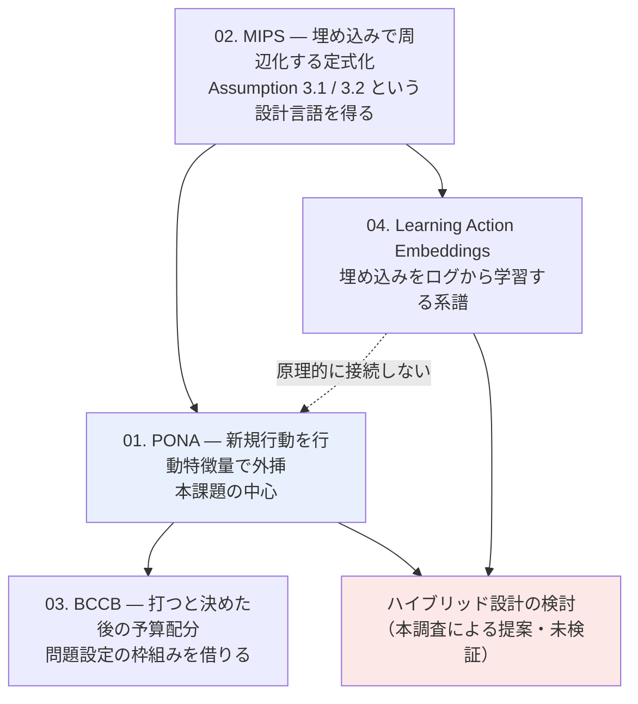

# C4: New-Action Bandit / 大規模行動空間 OPE — 詳細レポート

[← gather リソース一覧](../../../gather/20260715/c4/resources-new-action-bandit.md)

gather 段階の「retrieval 推奨」上位 4 本について、各論文の実物を取得して精読した結果をまとめる。

**スコープ**: ユーザー指定により、OPE 手法の内部（分散削減・MSE の理論解析）はスコープ外とした。MIPS 系については**周辺化の定式化と行動埋め込みへの要件**に絞っている。

## レポート一覧

| # | タイトル | 年 | 会場 | 本課題との関連 |
|---|---------|----|----|--------------|
| [01](01-offline-contextual-bandits-in-the-presence-of-new-actions.md) | Offline Contextual Bandits in the Presence of New Actions (PONA) | 2026 | preprint | ◎ 問題設定が完全一致。本クラスタの中心 |
| [02](02-off-policy-evaluation-for-large-action-spaces-via-embeddings.md) | Off-Policy Evaluation for Large Action Spaces via Embeddings (MIPS) | 2022 | ICML 2022 | ◎ 前提技術。埋め込み要件の定義元 |
| [03](03-budget-constrained-causal-bandits.md) | Budget-Constrained Causal Bandits (BCCB) | 2026 | preprint | ○ コールドスタートを名指し。ただし行動特徴量は扱わない |
| [04](04-learning-action-embeddings-for-off-policy-evaluation.md) | Learning Action Embeddings for Off-Policy Evaluation | 2023 | 未確認 | ○ 技術的ギャップの中心。新規行動には原理的に使えない |

## 読む順序

1. **02 (MIPS)** — まず「行動を独立アームとして数えるのをやめる」定式化と、Assumption 3.1 (common embedding support) / 3.2 (no direct effect) を押さえる。以降の全議論がこの 2 条件の言葉で行われる。分散・MSE の章は飛ばしてよい。
2. **01 (PONA)** — 本課題の中心。02 の記法を前提とするので順序は逆にしない。Condition 4.3 / 4.4 が本課題で成立するかが唯一の論点。
3. **04 (Learning Action Embeddings)** — 02 の「埋め込みは与えられる」前提を緩和する系譜。**01 とは前提が正面から対立する**ことを確認するために読む。
4. **03 (BCCB)** — 手法ではなく問題設定の枠組みとして。優先度は最も低い。

## 学習埋め込みと新規行動の緊張関係

gather 段階で提起された論点（「埋め込みを学習する」と「新規行動を扱う」は原理的に緊張関係にあり、両者を同じ空間に整合させる方法を扱った論文が見つからない）について、実物の論文で検証した結果を報告する。

### 検証結果: ギャップは実在する（確認済み）

**1. 04 は新規行動を一切扱っていない — 確認済み**

Learning Action Embeddings の埋め込みは、行動 ID を入力とする線形層として学習される。

$$\hat{r}(x,a) = \phi(a)^{\top}x, \qquad \min_{\phi}\frac{1}{n}\sum_i\left(\phi(a_i)^{\top}x_i - r_i\right)^2$$

$\phi$ は**行動 ID から埋め込みへのルックアップ表**であり、ログに存在しない行動には値を返せない。これは実装の都合ではなく**定式化上の帰結**である。本調査の範囲で、論文は新規行動・コールドスタート・未観測行動への汎化を一切論じていない。全実験は行動が訓練データに存在することを前提とする。

**gather の指摘は論文の実物によって裏づけられた。**

**2. 01 は行動特徴量の出所を「与えられるもの」として扱う — 確認済み**

PONA は行動特徴量 $f(a) = (f_1(a), \dots, f_d(a))$ を**メタデータとして所与**とする立場に立つ。論文は Netflix のサムネイル最適化におけるキャラクタータイプ・タイトル位置・タイトルサイズ、KuaiRec における動画タグ・カテゴリを例として挙げており、いずれも**新規行動についても計算可能なメタデータ**である。

つまり **01 は緊張関係を「学習埋め込みを使わない」ことで回避している**のであって、解決しているのではない。論文はログから学習した埋め込みが新規行動に転用できるかを論じていない。

**3. 両者を同じ空間に整合させる方法は、4 本のいずれにも存在しない — 確認済み**

- 01: メタデータ特徴量のみ。学習埋め込みへの言及なし
- 02: 埋め込みは所与。$p(e|x,a)$ の出所は問わない
- 03: 行動特徴量・行動埋め込みを扱わない（探索軸が文脈側であり、行動側と直交）
- 04: 学習埋め込みのみ。新規行動への言及なし

**結論: gather 段階で提起された技術的ギャップは実在する。**上位 4 本を精読した限り、「既存施策はログから学習した埋め込み、新規施策はメタデータ由来の特徴量」を単一の空間に整合させる方法を扱った論文は存在しない。

### ただし、ギャップの重要性には留保が必要

正直に評価すると、**このギャップは本課題では実務的な争点にならない可能性が高い**。理由は 2 つある。

**理由 1: 本課題の規模では、そもそも埋め込み学習の動機が薄い**

04 の埋め込み学習が価値を持つのは、行動数が多く（実験は 10〜2,000）各行動のログが薄い領域である。本課題は施策数が数個〜数十個で、各施策に数万〜数十万の配信がある。**この形状では施策 ID のダミー変数を入れた素直な回帰で足り、埋め込み学習という間接経路を取る理由がない**。学習埋め込みを使わないなら、緊張関係そのものが発生しない。

**理由 2: メタデータ特徴量が上位互換になりうる**

新規施策に使えるのはメタデータ特徴量のみである以上、メタデータ特徴量で十分な報酬予測性能が出るなら、**既存施策にもメタデータ特徴量を使えばよい**。両者を混ぜる必要がそもそもない。ハイブリッドが必要になるのは「メタデータでは説明できない施策固有の効果が大きく、かつそれが実績施策で無視できない」場合に限られる。

したがって**このギャップを埋める研究がないことは、本課題にとって痛手ではない**。むしろ「学習埋め込みには手を出さない」という設計判断で回避するのが正しい。これは gather の論点 3 に対する本 retrieval の追加的な結論である。

### 実務的な workaround（本調査による設計提案・未検証）

それでもハイブリッドが必要になった場合の形を示す。**以下はいずれの論文の主張でもなく、本調査による構成である。妥当性は未検証。**

**案 A: 残差方式（04 の Combined / FineTune バリアントを転用）**

$$\phi(a) = \phi_{\text{meta}}(a) + \Delta(a)$$

- $\phi_{\text{meta}}(a)$: メタデータから決定的に計算される埋め込み。全施策（新規含む）に定義される
- $\Delta(a)$: 既存施策にのみログから学習される残差。**新規施策では $\Delta = 0$**

新規施策は自動的に $\phi_{\text{meta}}$ のみにフォールバックし、既存施策はメタデータでは捉えきれない固有効果を $\Delta$ で補う。両者が同じ空間に乗るのは、$\Delta$ が $\phi_{\text{meta}}$ と同じ空間上の加法的な補正として定義されているためである。

04 の **Combined（one-hot と事前定義埋め込みの連結）/ FineTune（事前定義埋め込みの微調整）は、この構成に最も近い場所にある**。ただし論文はこれらを既存行動の埋め込み品質向上の手段として提示しており、新規行動の文脈では論じていない。

リスク: $\Delta$ が大きく学習されるほど、新規施策（$\Delta=0$）と既存施策の予測が系統的にずれ、**新規施策が不当に保守的に評価される**。$\Delta$ には強い正則化が要る。

**案 B: メタデータ特徴量に一本化（推奨）**

$\Delta$ を最初から使わない。$\phi_{\text{meta}}$ のみで 01 (PONA) の枠組みに乗せる。上述の理由 1・2 より、本課題ではこれが第一候補である。

**案 C: 二段構え**

新規施策の評価は $\phi_{\text{meta}}$ ベースの PONA で行い、既存施策の精緻な評価は施策 ID ベースの直接推定で行う。両者を同じ空間に載せることを諦め、**用途で使い分ける**。整合を取る必要がそもそもあるのか、という問いに対する最も安全な答え。

### 検証の第一歩

どの案を採るにせよ、最初にやるべきことは同一である。

**メタデータ特徴量のみで、過去施策の効果をどこまで説明できるかを測る。** 具体的には leave-one-campaign-out で、ある施策を人為的に「新規」として隠し、他施策のログとメタデータ特徴量のみからその効果を外挿し、実測値と比較する。

- 外挿が当たる → 案 B で十分。ギャップは無関係になる
- 外挿が外れる → 施策固有効果が支配的。案 A / C を検討する。ただしこの場合、**そもそも新規施策の事前評価という試み自体が本課題では成立しない可能性**を示唆する。その時は 03 (BCCB) 的なオンライン探索に舵を切るべき

この検証は 01 の実装可否判断（レポート 01 の実装ステップ 4）と同一の実験であり、**C4 全体の結論を決める単一の分岐点**である。

## 横断的な所見

**1. 「新規行動を扱う」ための道具は行動特徴量しかない**

01 は行動特徴量の次元分解と擬似逆行列による外挿、02 は埋め込み空間での周辺化。アプローチは違うが、**新規行動に触れる手段は「行動をメタデータのベクトルで表現する」一点に収束する**。C2（Treatment Representation）が本課題の成否を握るという gather の指摘は、精読後さらに強まった。**施策の特徴量設計が貧弱なら、下流でどの手法を使っても新規施策は扱えない。**

**2. MIPS の周辺化と PONA の外挿を混同してはならない**

本調査で明確になった重要な区別である。MIPS の周辺化は**観測された埋め込み上での重み付け**であり、未観測の埋め込み領域への外挿は行わない。新規施策の評価を担うのは 01 の LCPI による**特徴量次元ごとの分解と再構成**であって、MIPS の周辺化ではない。「MIPS を使えば新規施策が評価できる」は誤りである。

**3. 規模感のギャップは 4 本すべてに存在し、しかも方向が悪い**

| 論文 | 実験の行動数 | サンプル数 |
|------|------------|-----------|
| 01 PONA | 243（合成）/ 117（KuaiRec） | $n=500\sim4{,}000$ |
| 02 MIPS | 10 〜 5,000（合成）/ 240（OBD） | $n=800\sim25{,}600$ / 100,000 |
| 03 BCCB | 二値処置（行動特徴量なし） | Criteo Uplift |
| 04 Learning Emb. | 10 〜 2,000（合成）/ 240 | $n=10{,}000$ |

本課題は施策数が数個〜数十個。**埋め込みによる周辺化の利得は「多数の行動が同じ埋め込みを共有する」ことから生じるため、施策数が少ないほど利得は消える**。極端には埋め込みが施策 ID と 1 対 1 になり MIPS は IPS に退化する。**「行動数が少ないから簡単」ではなく「行動数が少ないから埋め込み系の手法が効かない」**というのが正直な評価である。

ただし本課題で真に効く可能性があるのは、行動数削減ではなく**属性次元を跨いだ外挿**（01 の LCPI）である。こちらは施策数ではなく**特徴量の組み合わせの被覆**に依存するため、施策数が少なくても各次元の値が複数施策で観測されていれば機能しうる。**評価すべきはここ一点**。

**4. 「行動の新しさ」と「時間の新しさ」の分離は未解決のまま**

01 は行動軸の変化のみを扱い、非定常性は範囲外。本課題では数ヶ月に一度という低頻度性ゆえに両者が必ず同時に起きる。gather 論点 4 の指摘は精読後も変わらない。OPFV（gather 一覧 13）との統合は未解決の論点として残る。

## 取得できなかった情報

| 対象 | 状況 |
|------|------|
| 01 の会場 | arXiv コメント欄は "12 pages, 7 figures" のみ。Cowles Foundation Discussion Paper (CFDP 2456) としての公開は未確認 |
| 01 の詳細な数値結果 | 方策価値の improvement 幅、$\gamma$ ごとの劣化曲線は未確認 |
| 01 の公式実装 | 有無を未確認 |
| 03 の手法詳細 | 推定量・獲得関数の数式、事前分布、ペーシング則は未確認（abstract のみ検証） |
| 03 が多腕設定に対応するか | 二値処置前提に読めるが未確認。本課題への適用範囲を左右する |
| 04 の会場 | arXiv 上は cs.LG のみ。gather 記載の ECIR 2024 は未確認 |
| PDF 全文 | 01 / 02 / 04 とも arxiv.org/pdf は取得できず（バイナリ解析不能）。ar5iv / arxiv.org/html 版で代替した |

**注記**: 01 について arxiv.org/pdf 経由の取得を試みた際、LCPI / PONA の展開が abstract の記載（Local Combination PseudoInverse / Policy Optimization for Effective New Actions）と矛盾する内容が返された。当該レスポンスは信頼できないものとして全面的に破棄し、HTML 版から再取得した内容のみを本レポートに採用している。
